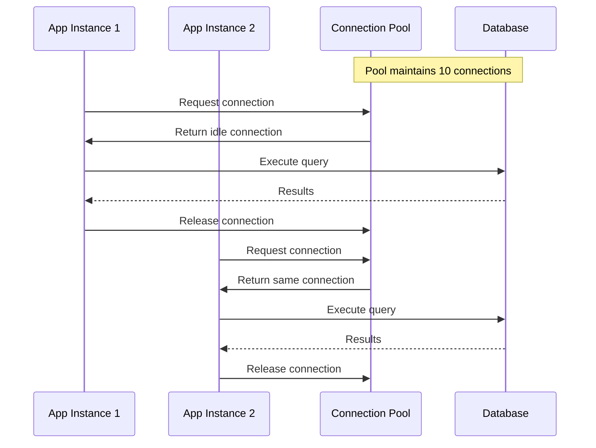
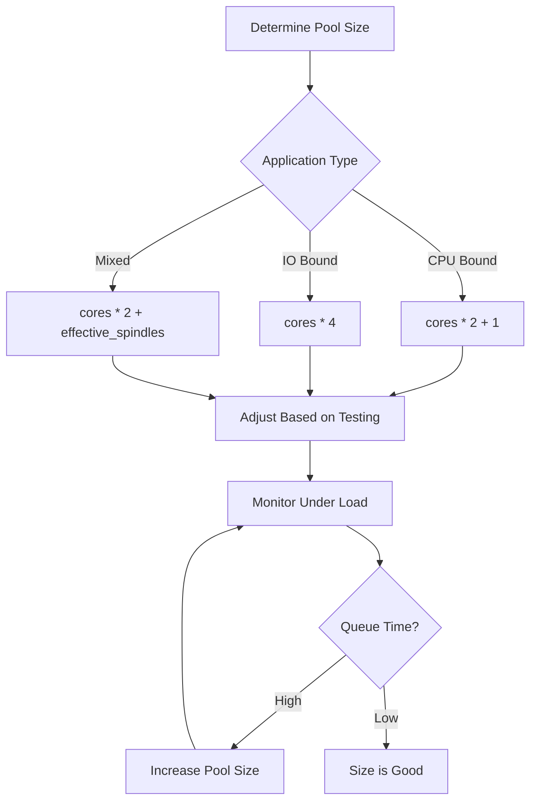

# How to Handle Connection Pooling

Author: [nawazdhandala](https://www.github.com/nawazdhandala)

Tags: Database, Performance, PostgreSQL, MySQL, Backend, DevOps

Description: Learn how to configure and optimize connection pooling for databases, HTTP clients, and other resources to improve application performance and reliability.

---

Every database connection costs resources: memory on both client and server, TCP socket overhead, authentication time, and connection setup latency. Without connection pooling, each request opens a new connection, uses it briefly, and closes it. Under load, this creates thousands of short-lived connections, exhausting database resources and adding 20-50ms latency per request. Connection pooling solves this by maintaining a set of reusable connections ready for immediate use.

## How Connection Pooling Works



| Connection Model | Connections per Request | Total with 1000 RPS |
|-----------------|------------------------|---------------------|
| No pooling | 1 new connection | 1000 connections/sec |
| With pooling | 0 (reuses existing) | 10-50 total connections |

## PostgreSQL Connection Pool Configuration

```javascript
// pg-pool.js - PostgreSQL pool with proper configuration
const { Pool } = require('pg');

// Calculate pool size based on application needs
// Formula: connections = (core_count * 2) + effective_spindle_count
// For SSDs, effective_spindle_count is typically 1
const poolSize = (process.env.CPU_CORES || 4) * 2 + 1;

const pool = new Pool({
  // Connection settings
  host: process.env.DB_HOST,
  port: process.env.DB_PORT || 5432,
  database: process.env.DB_NAME,
  user: process.env.DB_USER,
  password: process.env.DB_PASSWORD,

  // Pool sizing
  min: Math.floor(poolSize / 2),  // Minimum connections to maintain
  max: poolSize,                   // Maximum connections

  // Timeouts
  connectionTimeoutMillis: 5000,   // Fail if cannot connect in 5s
  idleTimeoutMillis: 30000,        // Close idle connections after 30s

  // Query timeout
  statement_timeout: 30000,        // Kill queries running > 30s

  // SSL configuration for production
  ssl: process.env.NODE_ENV === 'production' ? {
    rejectUnauthorized: true,
    ca: process.env.DB_CA_CERT
  } : false
});

// Monitor pool health
pool.on('connect', (client) => {
  console.log('New client connected to pool');
});

pool.on('error', (err, client) => {
  console.error('Unexpected pool error:', err);
});

// Expose pool metrics
function getPoolStats() {
  return {
    total: pool.totalCount,
    idle: pool.idleCount,
    waiting: pool.waitingCount
  };
}

// Graceful shutdown
async function closePool() {
  console.log('Draining connection pool...');
  await pool.end();
  console.log('Pool closed');
}

process.on('SIGTERM', closePool);
process.on('SIGINT', closePool);

module.exports = { pool, getPoolStats };
```

### Query Wrapper with Connection Management

```javascript
// db.js - Safe query execution with connection management
class Database {
  constructor(pool) {
    this.pool = pool;
  }

  // Single query - pool manages connection
  async query(sql, params = []) {
    const start = Date.now();
    try {
      const result = await this.pool.query(sql, params);
      this.logQuery(sql, Date.now() - start);
      return result;
    } catch (error) {
      this.logError(sql, error);
      throw error;
    }
  }

  // Transaction - explicit connection checkout
  async transaction(callback) {
    const client = await this.pool.connect();

    try {
      await client.query('BEGIN');
      const result = await callback(client);
      await client.query('COMMIT');
      return result;
    } catch (error) {
      await client.query('ROLLBACK');
      throw error;
    } finally {
      // CRITICAL: Always release connection back to pool
      client.release();
    }
  }

  // Batch operations with single connection
  async batch(queries) {
    const client = await this.pool.connect();
    const results = [];

    try {
      for (const { sql, params } of queries) {
        const result = await client.query(sql, params);
        results.push(result);
      }
      return results;
    } finally {
      client.release();
    }
  }

  logQuery(sql, duration) {
    if (duration > 100) {
      console.warn('Slow query:', {
        sql: sql.substring(0, 100),
        duration: `${duration}ms`
      });
    }
  }

  logError(sql, error) {
    console.error('Query error:', {
      sql: sql.substring(0, 100),
      error: error.message
    });
  }
}

module.exports = new Database(pool);
```

## MySQL Connection Pool Configuration

```javascript
// mysql-pool.js - MySQL2 pool configuration
const mysql = require('mysql2/promise');

const pool = mysql.createPool({
  host: process.env.DB_HOST,
  user: process.env.DB_USER,
  password: process.env.DB_PASSWORD,
  database: process.env.DB_NAME,

  // Pool settings
  connectionLimit: 10,        // Maximum connections
  queueLimit: 0,              // Unlimited queue (or set limit)
  waitForConnections: true,   // Queue requests when pool exhausted

  // Timeouts
  connectTimeout: 10000,      // 10s connection timeout

  // Keep connections alive
  enableKeepAlive: true,
  keepAliveInitialDelay: 10000,

  // Handle connection issues
  multipleStatements: false,  // Prevent SQL injection

  // Timezone handling
  timezone: 'Z',              // UTC
  dateStrings: true
});

// Connection event handling
pool.on('acquire', (connection) => {
  console.debug(`Connection ${connection.threadId} acquired`);
});

pool.on('release', (connection) => {
  console.debug(`Connection ${connection.threadId} released`);
});

pool.on('enqueue', () => {
  console.warn('Waiting for available connection');
});

// Health check
async function healthCheck() {
  try {
    await pool.query('SELECT 1');
    return { status: 'healthy' };
  } catch (error) {
    return { status: 'unhealthy', error: error.message };
  }
}

module.exports = { pool, healthCheck };
```

## HTTP Connection Pooling

HTTP clients also benefit from connection pooling via keep-alive:

```javascript
// http-pool.js - HTTP client with connection pooling
const http = require('http');
const https = require('https');

// Create agents with connection pooling
const httpAgent = new http.Agent({
  keepAlive: true,
  keepAliveMsecs: 30000,
  maxSockets: 50,            // Max connections per host
  maxTotalSockets: 100,      // Max connections total
  maxFreeSockets: 10,        // Max idle connections to keep
  timeout: 60000             // Socket timeout
});

const httpsAgent = new https.Agent({
  keepAlive: true,
  keepAliveMsecs: 30000,
  maxSockets: 50,
  maxTotalSockets: 100,
  maxFreeSockets: 10,
  timeout: 60000,

  // TLS settings
  rejectUnauthorized: true
});

// Using with fetch (Node.js 18+)
async function fetchWithPooling(url, options = {}) {
  const isHttps = url.startsWith('https');

  return fetch(url, {
    ...options,
    agent: isHttps ? httpsAgent : httpAgent
  });
}

// Using with axios
const axios = require('axios');

const apiClient = axios.create({
  timeout: 30000,
  httpAgent: httpAgent,
  httpsAgent: httpsAgent
});

// Monitor agent status
function getAgentStats(agent) {
  return {
    requests: Object.keys(agent.requests).length,
    sockets: Object.keys(agent.sockets).length,
    freeSockets: Object.keys(agent.freeSockets).length
  };
}

module.exports = { httpAgent, httpsAgent, apiClient, getAgentStats };
```

## Redis Connection Pooling

```javascript
// redis-pool.js - Redis connection pool with ioredis
const Redis = require('ioredis');

// Single connection is often sufficient for Redis
// due to its single-threaded nature and fast operations
const redis = new Redis({
  host: process.env.REDIS_HOST,
  port: process.env.REDIS_PORT || 6379,
  password: process.env.REDIS_PASSWORD,
  db: 0,

  // Connection settings
  connectTimeout: 10000,
  commandTimeout: 5000,

  // Reconnection
  retryStrategy: (times) => {
    if (times > 10) return null; // Stop retrying
    return Math.min(times * 100, 3000);
  },

  // Keep-alive
  keepAlive: 30000,

  // Connection pool (if needed for high throughput)
  maxRetriesPerRequest: 3
});

// For high-throughput scenarios, use Cluster with multiple connections
const cluster = new Redis.Cluster([
  { host: 'redis-1', port: 6379 },
  { host: 'redis-2', port: 6379 },
  { host: 'redis-3', port: 6379 }
], {
  scaleReads: 'slave',
  redisOptions: {
    connectTimeout: 10000,
    commandTimeout: 5000
  },

  // Pool settings per node
  natMap: {
    'redis-1:6379': { host: 'external-1', port: 6379 },
    'redis-2:6379': { host: 'external-2', port: 6379 },
    'redis-3:6379': { host: 'external-3', port: 6379 }
  }
});

// Connection events
redis.on('connect', () => console.log('Redis connected'));
redis.on('ready', () => console.log('Redis ready'));
redis.on('error', (err) => console.error('Redis error:', err));
redis.on('close', () => console.log('Redis connection closed'));

module.exports = redis;
```

## Connection Pool Monitoring

```javascript
// pool-monitor.js - Centralized pool monitoring
const prometheus = require('prom-client');

class PoolMonitor {
  constructor() {
    this.pools = new Map();

    // Metrics
    this.totalConnections = new prometheus.Gauge({
      name: 'db_pool_connections_total',
      help: 'Total connections in pool',
      labelNames: ['pool_name']
    });

    this.idleConnections = new prometheus.Gauge({
      name: 'db_pool_connections_idle',
      help: 'Idle connections in pool',
      labelNames: ['pool_name']
    });

    this.waitingRequests = new prometheus.Gauge({
      name: 'db_pool_waiting_requests',
      help: 'Requests waiting for connection',
      labelNames: ['pool_name']
    });

    this.connectionAcquireTime = new prometheus.Histogram({
      name: 'db_pool_acquire_duration_seconds',
      help: 'Time to acquire connection from pool',
      labelNames: ['pool_name'],
      buckets: [0.001, 0.005, 0.01, 0.05, 0.1, 0.5, 1]
    });
  }

  registerPool(name, pool, getStats) {
    this.pools.set(name, { pool, getStats });
  }

  async collectMetrics() {
    for (const [name, { getStats }] of this.pools) {
      const stats = await getStats();

      this.totalConnections.labels(name).set(stats.total || 0);
      this.idleConnections.labels(name).set(stats.idle || 0);
      this.waitingRequests.labels(name).set(stats.waiting || 0);
    }
  }

  // Wrap pool.connect to track timing
  wrapConnect(name, pool) {
    const original = pool.connect.bind(pool);
    const histogram = this.connectionAcquireTime;

    pool.connect = async function() {
      const end = histogram.startTimer({ pool_name: name });
      try {
        return await original();
      } finally {
        end();
      }
    };
  }

  startCollecting(intervalMs = 5000) {
    setInterval(() => this.collectMetrics(), intervalMs);
  }
}

// Usage
const monitor = new PoolMonitor();

// Register PostgreSQL pool
monitor.registerPool('postgres', pgPool, () => ({
  total: pgPool.totalCount,
  idle: pgPool.idleCount,
  waiting: pgPool.waitingCount
}));

// Register MySQL pool
monitor.registerPool('mysql', mysqlPool, async () => {
  const [rows] = await mysqlPool.query('SHOW STATUS LIKE "Threads%"');
  return {
    total: parseInt(rows.find(r => r.Variable_name === 'Threads_connected')?.Value || 0),
    idle: parseInt(rows.find(r => r.Variable_name === 'Threads_cached')?.Value || 0)
  };
});

monitor.startCollecting();

module.exports = monitor;
```

## Pool Sizing Guidelines



| Scenario | Recommended Pool Size | Notes |
|----------|----------------------|-------|
| Small app, single DB | 5-10 | Default is usually fine |
| Medium app, shared DB | 10-20 | Consider DB total connections |
| Large app, dedicated DB | 20-50 | Match DB max_connections |
| Microservices | 5-10 per service | Total across services matters |
| Connection proxy (PgBouncer) | 2-5 per app | Proxy handles actual pooling |

### Database Server Limits

```sql
-- PostgreSQL: Check and set max connections
SHOW max_connections;  -- Default: 100
ALTER SYSTEM SET max_connections = 200;

-- MySQL: Check connection limits
SHOW VARIABLES LIKE 'max_connections';
SET GLOBAL max_connections = 200;

-- View current connections
-- PostgreSQL
SELECT count(*) FROM pg_stat_activity;

-- MySQL
SHOW STATUS LIKE 'Threads_connected';
```

## Connection Pool Best Practices

```javascript
// best-practices.js - Production-ready pool configuration
const { Pool } = require('pg');

class ProductionPool {
  constructor(config) {
    this.pool = new Pool({
      ...config,

      // Always set reasonable limits
      max: config.max || 20,
      min: config.min || 2,

      // Prevent connection leaks
      idleTimeoutMillis: 30000,

      // Fast failure on connection issues
      connectionTimeoutMillis: 5000,

      // Prevent runaway queries
      statement_timeout: 30000,

      // Validate connections before use
      allowExitOnIdle: true
    });

    this.setupErrorHandling();
    this.setupHealthCheck();
  }

  setupErrorHandling() {
    this.pool.on('error', (err, client) => {
      console.error('Pool error:', err);
      // Don't exit - pool will remove bad connection
    });

    this.pool.on('connect', (client) => {
      // Set session configuration
      client.query('SET statement_timeout = 30000');
    });
  }

  setupHealthCheck() {
    // Periodic connection validation
    setInterval(async () => {
      try {
        await this.pool.query('SELECT 1');
      } catch (error) {
        console.error('Health check failed:', error);
      }
    }, 30000);
  }

  // Safe query with automatic retry
  async query(sql, params, retries = 2) {
    for (let attempt = 0; attempt <= retries; attempt++) {
      try {
        return await this.pool.query(sql, params);
      } catch (error) {
        // Retry on connection errors, not query errors
        if (attempt < retries && this.isConnectionError(error)) {
          console.warn(`Query failed, retrying (${attempt + 1}/${retries})`);
          await this.sleep(100 * Math.pow(2, attempt));
          continue;
        }
        throw error;
      }
    }
  }

  isConnectionError(error) {
    return [
      'ECONNREFUSED',
      'ECONNRESET',
      'ETIMEDOUT',
      'CONNECTION_CLOSED'
    ].includes(error.code);
  }

  sleep(ms) {
    return new Promise(resolve => setTimeout(resolve, ms));
  }

  async close() {
    await this.pool.end();
  }
}

module.exports = ProductionPool;
```

## Summary

| Component | Key Configuration | Watch Out For |
|-----------|------------------|---------------|
| Pool size | Match workload | Too small = queuing, too large = resource waste |
| Timeouts | Always set | Prevent hanging connections |
| Idle timeout | 30-60 seconds | Balance reuse vs. resources |
| Health checks | Enable | Detect dead connections early |
| Monitoring | Essential | Track pool exhaustion |
| Graceful shutdown | Implement | Drain pool before exit |

Connection pooling is essential for any application that talks to databases or external services. Start with conservative pool sizes, monitor under realistic load, and adjust based on actual queue times and connection utilization. A well-tuned pool improves both performance and reliability.
