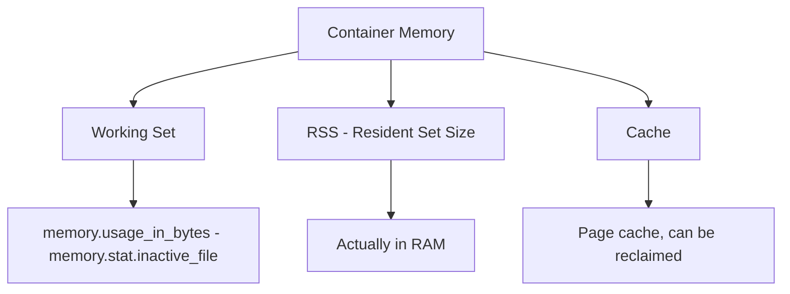

# How to Get Container Memory Metrics from Kubernetes API

Author: [nawazdhandala](https://www.github.com/nawazdhandala)

Tags: Kubernetes, Metrics, Monitoring, API, Memory

Description: Learn how to retrieve container memory metrics using the Kubernetes API and metrics server. This guide covers kubectl top, metrics API queries, and programmatic access.

---

Monitoring container memory usage is essential for capacity planning, debugging OOM issues, and setting appropriate resource limits. Kubernetes provides memory metrics through the Metrics API, which is backed by the metrics-server. This guide shows you how to access these metrics through various methods.

## Prerequisites: Metrics Server

The Kubernetes Metrics API requires metrics-server to be installed:

```bash
# Check if metrics-server is running
kubectl get pods -n kube-system | grep metrics-server

# If not installed, install it
kubectl apply -f https://github.com/kubernetes-sigs/metrics-server/releases/latest/download/components.yaml

# Wait for it to be ready
kubectl wait --for=condition=Ready pod -l k8s-app=metrics-server -n kube-system --timeout=120s
```

For local clusters like minikube:

```bash
minikube addons enable metrics-server
```

## Method 1: kubectl top

The simplest way to check memory usage:

```bash
# Memory usage of all pods in current namespace
kubectl top pods

# Example output:
# NAME                        CPU(cores)   MEMORY(bytes)
# web-app-7d4b8c9f6-x2j9k    25m          128Mi
# api-server-5c6b7d8f9-abc   50m          256Mi

# Memory by namespace
kubectl top pods -n production

# All namespaces
kubectl top pods -A

# Sort by memory usage
kubectl top pods --sort-by=memory

# Memory for a specific pod
kubectl top pod web-app-7d4b8c9f6-x2j9k
```

Get container-level metrics within a pod:

```bash
# Show each container's metrics separately
kubectl top pod web-app-7d4b8c9f6-x2j9k --containers

# Output:
# POD                        NAME        CPU(cores)   MEMORY(bytes)
# web-app-7d4b8c9f6-x2j9k   app         20m          100Mi
# web-app-7d4b8c9f6-x2j9k   sidecar     5m           28Mi
```

## Method 2: Direct Metrics API Queries

Query the metrics API directly for more control:

```bash
# Get metrics for all pods in a namespace
kubectl get --raw "/apis/metrics.k8s.io/v1beta1/namespaces/default/pods" | jq .

# Get metrics for a specific pod
kubectl get --raw "/apis/metrics.k8s.io/v1beta1/namespaces/default/pods/web-app-7d4b8c9f6-x2j9k" | jq .
```

Example response:

```json
{
  "kind": "PodMetrics",
  "apiVersion": "metrics.k8s.io/v1beta1",
  "metadata": {
    "name": "web-app-7d4b8c9f6-x2j9k",
    "namespace": "default",
    "creationTimestamp": "2026-01-24T10:30:00Z"
  },
  "timestamp": "2026-01-24T10:29:45Z",
  "window": "30s",
  "containers": [
    {
      "name": "app",
      "usage": {
        "cpu": "25m",
        "memory": "134217728"
      }
    }
  ]
}
```

Memory is returned in bytes. Convert to human-readable format:

```bash
# Get memory in Mi for all pods
kubectl get --raw "/apis/metrics.k8s.io/v1beta1/namespaces/default/pods" | \
  jq '.items[] | {
    pod: .metadata.name,
    containers: [.containers[] | {
      name: .name,
      memory_mi: ((.usage.memory | rtrimstr("Ki") | tonumber) / 1024 | floor)
    }]
  }'
```

## Method 3: Using kubectl with JSONPath

Extract specific memory values with JSONPath:

```bash
# Get memory usage for a specific container
kubectl get --raw "/apis/metrics.k8s.io/v1beta1/namespaces/default/pods/web-app-7d4b8c9f6-x2j9k" | \
  jq -r '.containers[0].usage.memory'

# List all pods with memory over 200Mi
kubectl get --raw "/apis/metrics.k8s.io/v1beta1/namespaces/default/pods" | \
  jq -r '.items[] | select(.containers[].usage.memory | gsub("Ki";"") | tonumber > 204800) | .metadata.name'
```

## Method 4: Programmatic Access with Python

Access metrics from your applications:

```python
# kubernetes_metrics.py
from kubernetes import client, config
import json

def get_pod_memory_metrics(namespace="default"):
    """
    Retrieve memory metrics for all pods in a namespace.
    Returns memory usage in bytes for each container.
    """
    # Load kubeconfig (or use in-cluster config)
    try:
        config.load_incluster_config()
    except:
        config.load_kube_config()

    # Create custom objects API for metrics
    api = client.CustomObjectsApi()

    # Query the metrics API
    metrics = api.list_namespaced_custom_object(
        group="metrics.k8s.io",
        version="v1beta1",
        namespace=namespace,
        plural="pods"
    )

    results = []
    for pod in metrics.get("items", []):
        pod_name = pod["metadata"]["name"]
        for container in pod.get("containers", []):
            # Parse memory value (comes as string like "134217728" or "128Ki")
            memory_str = container["usage"]["memory"]
            memory_bytes = parse_memory(memory_str)

            results.append({
                "pod": pod_name,
                "container": container["name"],
                "memory_bytes": memory_bytes,
                "memory_mi": memory_bytes / (1024 * 1024)
            })

    return results

def parse_memory(memory_str):
    """Convert Kubernetes memory string to bytes."""
    if memory_str.endswith("Ki"):
        return int(memory_str[:-2]) * 1024
    elif memory_str.endswith("Mi"):
        return int(memory_str[:-2]) * 1024 * 1024
    elif memory_str.endswith("Gi"):
        return int(memory_str[:-2]) * 1024 * 1024 * 1024
    else:
        # Plain bytes
        return int(memory_str)

if __name__ == "__main__":
    metrics = get_pod_memory_metrics("production")
    for m in sorted(metrics, key=lambda x: x["memory_bytes"], reverse=True):
        print(f"{m['pod']}/{m['container']}: {m['memory_mi']:.1f} Mi")
```

## Method 5: Using curl with kubectl proxy

Access the API through kubectl proxy:

```bash
# Start the proxy in the background
kubectl proxy &

# Query metrics API
curl -s http://localhost:8001/apis/metrics.k8s.io/v1beta1/namespaces/default/pods | jq .

# Get node metrics
curl -s http://localhost:8001/apis/metrics.k8s.io/v1beta1/nodes | jq .
```

## Comparing Usage to Limits

Compare current usage against configured limits:

```bash
#!/bin/bash
# memory-usage-report.sh
# Compare actual memory usage to limits

NAMESPACE=${1:-default}

echo "Pod/Container | Usage | Request | Limit | Usage%"
echo "-------------|-------|---------|-------|-------"

# Get pod specs and metrics
kubectl get pods -n $NAMESPACE -o json > /tmp/pods.json
kubectl get --raw "/apis/metrics.k8s.io/v1beta1/namespaces/$NAMESPACE/pods" > /tmp/metrics.json

# Process with jq
jq -r --slurpfile metrics /tmp/metrics.json '
  .items[] as $pod |
  $pod.spec.containers[] as $container |
  ($metrics[0].items[] | select(.metadata.name == $pod.metadata.name) | .containers[] | select(.name == $container.name)) as $metric |
  [
    "\($pod.metadata.name)/\($container.name)",
    ($metric.usage.memory // "N/A"),
    ($container.resources.requests.memory // "not set"),
    ($container.resources.limits.memory // "not set")
  ] | @tsv
' /tmp/pods.json | column -t
```

## Memory Metrics Explained



The metrics-server reports **working set** memory, which is what Kubernetes uses for OOM decisions:
- **Working Set** = Total usage minus inactive file-backed memory
- This is the memory that cannot be reclaimed without killing the process

## Node Memory Metrics

Get memory stats for nodes:

```bash
# Node memory usage
kubectl top nodes

# Detailed node metrics via API
kubectl get --raw "/apis/metrics.k8s.io/v1beta1/nodes" | jq '.items[] | {
  node: .metadata.name,
  memory_bytes: .usage.memory,
  memory_gi: ((.usage.memory | rtrimstr("Ki") | tonumber) / 1024 / 1024 | . * 100 | floor / 100)
}'
```

## Troubleshooting Metrics Issues

### Metrics Not Available

```bash
# Check metrics-server logs
kubectl logs -n kube-system -l k8s-app=metrics-server

# Common issue: TLS certificate errors
# Add these args to metrics-server deployment:
# --kubelet-insecure-tls
# --kubelet-preferred-address-types=InternalIP
```

### Metrics Delayed

Metrics-server scrapes every 15 seconds by default. Recent pods may not have metrics yet:

```bash
# Check the timestamp in metrics response
kubectl get --raw "/apis/metrics.k8s.io/v1beta1/namespaces/default/pods/my-pod" | jq '.timestamp'
```

### Zero or Missing Values

```bash
# Verify the pod is running
kubectl get pod my-pod -o jsonpath='{.status.phase}'

# Check if containers have resource requests/limits
kubectl get pod my-pod -o jsonpath='{.spec.containers[*].resources}'
```

## Summary

Kubernetes provides container memory metrics through the Metrics API (requires metrics-server). Use `kubectl top` for quick checks, direct API queries for scripting, or the Python client for application integration. Memory is reported as working set memory, which reflects actual non-reclaimable usage. Compare usage to limits to identify pods at risk of OOM, and use these metrics for capacity planning and resource optimization.
