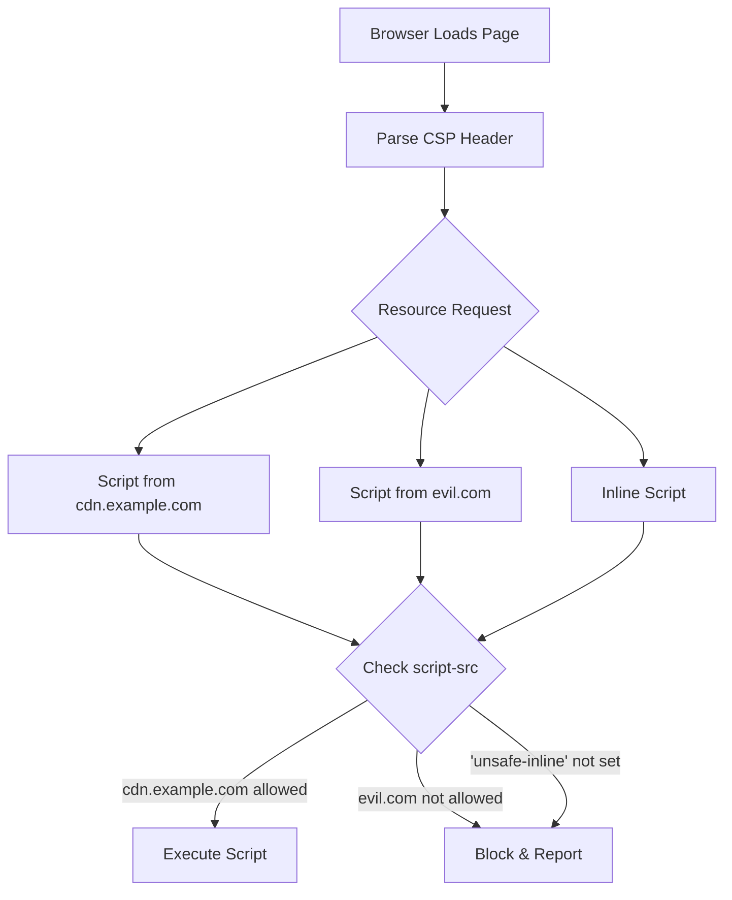
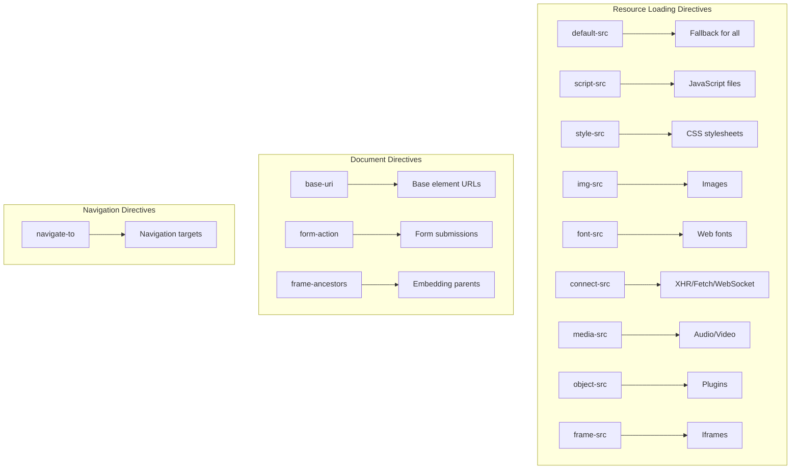
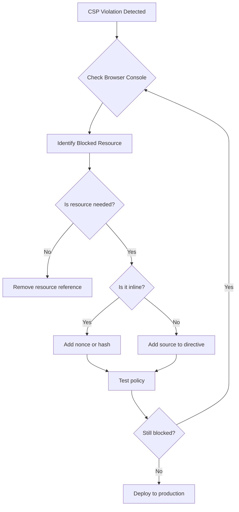

# How to Configure Content Security Policy (CSP)

Author: [nawazdhandala](https://github.com/nawazdhandala)

Tags: Security, CSP, Web Security, Frontend, DevOps

Description: A practical guide to implementing Content Security Policy headers to protect your web applications from XSS, clickjacking, and data injection attacks.

---

Content Security Policy (CSP) is a powerful browser security mechanism that helps prevent cross-site scripting (XSS), clickjacking, and other code injection attacks. This guide covers how to implement CSP effectively, from basic setups to advanced configurations.

## How CSP Works

CSP works by telling the browser which sources of content are trusted. When a page loads, the browser checks every resource (scripts, styles, images, etc.) against the CSP rules and blocks anything that violates the policy.



## Basic CSP Configuration

Start with a restrictive policy and gradually loosen it as needed.

### Setting CSP Headers in Node.js/Express

```javascript
const express = require('express');
const app = express();

// Basic CSP middleware
app.use((req, res, next) => {
  // Define the CSP policy
  const cspPolicy = [
    "default-src 'self'",           // Default: only same origin
    "script-src 'self'",            // Scripts: only same origin
    "style-src 'self'",             // Styles: only same origin
    "img-src 'self' data:",         // Images: same origin + data URIs
    "font-src 'self'",              // Fonts: only same origin
    "connect-src 'self'",           // XHR/Fetch: only same origin
    "frame-ancestors 'none'",       // Prevent embedding in iframes
    "base-uri 'self'",              // Restrict <base> tag
    "form-action 'self'"            // Form submissions: only same origin
  ].join('; ');

  res.setHeader('Content-Security-Policy', cspPolicy);
  next();
});
```

### Using Helmet for Express

```javascript
const helmet = require('helmet');

app.use(helmet.contentSecurityPolicy({
  directives: {
    // Default fallback for all resource types
    defaultSrc: ["'self'"],

    // JavaScript sources
    scriptSrc: [
      "'self'",
      "https://cdn.jsdelivr.net",    // Trusted CDN
      "https://www.google-analytics.com"
    ],

    // CSS sources
    styleSrc: [
      "'self'",
      "https://fonts.googleapis.com",
      // Allow inline styles if needed (less secure)
      // "'unsafe-inline'"
    ],

    // Image sources
    imgSrc: [
      "'self'",
      "data:",                        // Data URIs for inline images
      "https:",                       // Any HTTPS image
    ],

    // Font sources
    fontSrc: [
      "'self'",
      "https://fonts.gstatic.com"
    ],

    // XHR, WebSocket, EventSource connections
    connectSrc: [
      "'self'",
      "https://api.example.com",      // Your API
      "wss://ws.example.com"          // WebSocket server
    ],

    // Embedded frames
    frameSrc: ["'none'"],             // Block all iframes

    // Where this page can be embedded
    frameAncestors: ["'none'"],       // Prevent clickjacking

    // Object, embed, applet elements
    objectSrc: ["'none'"],            // Block plugins

    // Base URI restriction
    baseUri: ["'self'"],

    // Form submission targets
    formAction: ["'self'"],

    // Upgrade insecure requests
    upgradeInsecureRequests: []       // Upgrade HTTP to HTTPS
  }
}));
```

## CSP Directive Reference



## Handling Inline Scripts and Styles

Inline scripts and styles are blocked by default in CSP. Here are secure ways to handle them.

### Option 1: Use Nonces (Recommended)

```javascript
const crypto = require('crypto');

// Generate a unique nonce for each request
function generateNonce() {
  return crypto.randomBytes(16).toString('base64');
}

app.use((req, res, next) => {
  // Generate nonce for this request
  const nonce = generateNonce();
  res.locals.nonce = nonce;

  // Set CSP with nonce
  const cspPolicy = [
    "default-src 'self'",
    `script-src 'self' 'nonce-${nonce}'`,  // Allow scripts with this nonce
    `style-src 'self' 'nonce-${nonce}'`,   // Allow styles with this nonce
    "img-src 'self' data:",
    "connect-src 'self'"
  ].join('; ');

  res.setHeader('Content-Security-Policy', cspPolicy);
  next();
});

// In your template engine (EJS example)
// The nonce must match exactly
```

```html
<!-- In your HTML template -->
<!DOCTYPE html>
<html>
<head>
  <!-- Inline style with nonce - will be allowed -->
  <style nonce="<%= nonce %>">
    body { font-family: Arial, sans-serif; }
  </style>
</head>
<body>
  <!-- Inline script with nonce - will be allowed -->
  <script nonce="<%= nonce %>">
    console.log('This script is allowed');
  </script>

  <!-- Script without nonce - will be BLOCKED -->
  <script>
    console.log('This script is blocked');
  </script>
</body>
</html>
```

### Option 2: Use Hashes

For static inline scripts that never change, use hashes.

```javascript
const crypto = require('crypto');

// Calculate hash of your inline script content
const scriptContent = "console.log('Hello World');";
const hash = crypto
  .createHash('sha256')
  .update(scriptContent)
  .digest('base64');

console.log(`'sha256-${hash}'`);  // 'sha256-xyz123...'

// Add the hash to your CSP
const cspPolicy = [
  "default-src 'self'",
  `script-src 'self' 'sha256-${hash}'`,  // Allow this specific script
].join('; ');
```

```html
<!-- The script content must match EXACTLY (including whitespace) -->
<script>console.log('Hello World');</script>
```

### Option 3: Move Inline Scripts to Files

The most secure approach is to eliminate inline scripts entirely.

```html
<!-- Instead of inline event handlers -->
<!-- BAD: This won't work with strict CSP -->
<button onclick="handleClick()">Click Me</button>

<!-- GOOD: Use external JavaScript -->
<button id="myButton">Click Me</button>

<!-- External script file -->
<script src="/js/handlers.js"></script>
```

```javascript
// /js/handlers.js
document.getElementById('myButton').addEventListener('click', function() {
  handleClick();
});
```

## Configuring CSP for Common Use Cases

### Single Page Applications (React, Vue, Angular)

```javascript
// CSP for React/Vue/Angular apps
app.use(helmet.contentSecurityPolicy({
  directives: {
    defaultSrc: ["'self'"],

    scriptSrc: [
      "'self'",
      // For development with hot reloading
      ...(process.env.NODE_ENV === 'development'
        ? ["'unsafe-eval'"]
        : [])
    ],

    styleSrc: [
      "'self'",
      // Many UI libraries need unsafe-inline for styles
      "'unsafe-inline'"
    ],

    imgSrc: [
      "'self'",
      "data:",           // For inline images and icons
      "blob:"            // For dynamically created images
    ],

    connectSrc: [
      "'self'",
      "https://api.yourservice.com",
      // WebSocket for development
      ...(process.env.NODE_ENV === 'development'
        ? ["ws://localhost:*"]
        : [])
    ],

    fontSrc: ["'self'", "data:"],

    // Block embedding
    frameAncestors: ["'none'"],

    // Workers for modern apps
    workerSrc: ["'self'", "blob:"]
  }
}));
```

### Third-Party Integrations

```javascript
// CSP with common third-party services
const cspDirectives = {
  defaultSrc: ["'self'"],

  scriptSrc: [
    "'self'",
    // Google Analytics
    "https://www.google-analytics.com",
    "https://www.googletagmanager.com",
    // Stripe
    "https://js.stripe.com",
    // reCAPTCHA
    "https://www.google.com",
    "https://www.gstatic.com"
  ],

  styleSrc: [
    "'self'",
    "'unsafe-inline'",  // Often needed for third-party widgets
    "https://fonts.googleapis.com"
  ],

  imgSrc: [
    "'self'",
    "data:",
    "https://www.google-analytics.com",
    "https://*.stripe.com"
  ],

  frameSrc: [
    // Stripe checkout
    "https://js.stripe.com",
    // reCAPTCHA
    "https://www.google.com"
  ],

  connectSrc: [
    "'self'",
    "https://www.google-analytics.com",
    "https://api.stripe.com"
  ],

  fontSrc: [
    "'self'",
    "https://fonts.gstatic.com"
  ]
};
```

## CSP Reporting

Configure reporting to catch violations without blocking users during rollout.

```javascript
// Report-only mode for testing
app.use((req, res, next) => {
  const cspPolicy = [
    "default-src 'self'",
    "script-src 'self'",
    "style-src 'self'",
    "report-uri /csp-report"  // Where to send violation reports
  ].join('; ');

  // Use Report-Only header during testing
  // Violations are reported but not blocked
  res.setHeader('Content-Security-Policy-Report-Only', cspPolicy);
  next();
});

// Endpoint to receive CSP violation reports
app.post('/csp-report', express.json({ type: 'application/csp-report' }), (req, res) => {
  const report = req.body['csp-report'];

  console.log('CSP Violation:', {
    documentUri: report['document-uri'],
    violatedDirective: report['violated-directive'],
    blockedUri: report['blocked-uri'],
    sourceFile: report['source-file'],
    lineNumber: report['line-number']
  });

  // Log to your monitoring system
  // logToMonitoring('csp_violation', report);

  res.status(204).end();
});
```

### Modern Reporting with Reporting API

```javascript
// Using the newer Reporting API
app.use((req, res, next) => {
  // Define reporting endpoint
  res.setHeader('Reporting-Endpoints', 'csp-endpoint="/csp-report"');

  const cspPolicy = [
    "default-src 'self'",
    "script-src 'self'",
    "report-to csp-endpoint"  // Use report-to instead of report-uri
  ].join('; ');

  res.setHeader('Content-Security-Policy', cspPolicy);
  next();
});
```

## Nginx Configuration

```nginx
# /etc/nginx/conf.d/csp.conf

# Define CSP policy
map $uri $csp_policy {
    default "default-src 'self'; script-src 'self' https://cdn.example.com; style-src 'self' 'unsafe-inline'; img-src 'self' data: https:; font-src 'self'; connect-src 'self' https://api.example.com; frame-ancestors 'none'; base-uri 'self'; form-action 'self';";
}

server {
    listen 443 ssl;
    server_name example.com;

    # Add CSP header to all responses
    add_header Content-Security-Policy $csp_policy always;

    # Other security headers
    add_header X-Content-Type-Options "nosniff" always;
    add_header X-Frame-Options "DENY" always;
    add_header X-XSS-Protection "1; mode=block" always;

    location / {
        proxy_pass http://app:3000;
    }
}
```

## Apache Configuration

```apache
# .htaccess or httpd.conf

<IfModule mod_headers.c>
    # Set CSP header
    Header always set Content-Security-Policy "\
        default-src 'self'; \
        script-src 'self' https://cdn.example.com; \
        style-src 'self' 'unsafe-inline'; \
        img-src 'self' data: https:; \
        font-src 'self'; \
        connect-src 'self' https://api.example.com; \
        frame-ancestors 'none'; \
        base-uri 'self'; \
        form-action 'self';"

    # Other security headers
    Header always set X-Content-Type-Options "nosniff"
    Header always set X-Frame-Options "DENY"
</IfModule>
```

## Debugging CSP Issues



### Browser Developer Tools

```javascript
// In browser console, CSP violations appear as errors:
// Refused to load the script 'https://evil.com/script.js'
// because it violates the following Content Security Policy directive:
// "script-src 'self'"

// To see current CSP policy:
// Open DevTools > Network > Select the HTML document > Headers tab
// Look for Content-Security-Policy header
```

## CSP Rollout Strategy

| Phase | Action | Duration |
|-------|--------|----------|
| 1 | Deploy in Report-Only mode | 1-2 weeks |
| 2 | Analyze violation reports | Ongoing |
| 3 | Fix legitimate violations | As needed |
| 4 | Tighten policy based on data | Iterative |
| 5 | Switch to enforcement mode | After validation |
| 6 | Monitor and maintain | Ongoing |

## Common Mistakes to Avoid

```javascript
// DON'T: Use 'unsafe-inline' for scripts
// This defeats much of CSP's protection against XSS
scriptSrc: ["'self'", "'unsafe-inline'"]  // BAD

// DO: Use nonces instead
scriptSrc: ["'self'", `'nonce-${nonce}'`]  // GOOD

// DON'T: Use 'unsafe-eval'
// Allows eval(), Function(), setTimeout with strings
scriptSrc: ["'self'", "'unsafe-eval'"]  // BAD

// DON'T: Allow all HTTPS sources
// Too permissive - attacker can host on any HTTPS site
scriptSrc: ["https:"]  // BAD

// DO: Whitelist specific trusted domains
scriptSrc: ["'self'", "https://cdn.trusted.com"]  // GOOD

// DON'T: Forget frame-ancestors
// Without it, your site can be clickjacked
// DO: Always set frame-ancestors
frameAncestors: ["'none'"]  // Or specific trusted parents
```

Content Security Policy is one of the most effective defenses against XSS and injection attacks. Start with a strict policy, use Report-Only mode to identify issues, and gradually refine your policy based on real-world data. The effort invested in CSP configuration pays off significantly in improved application security.
