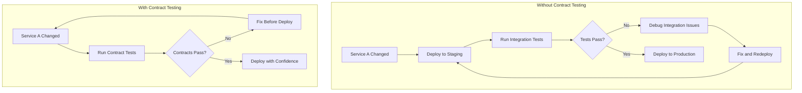
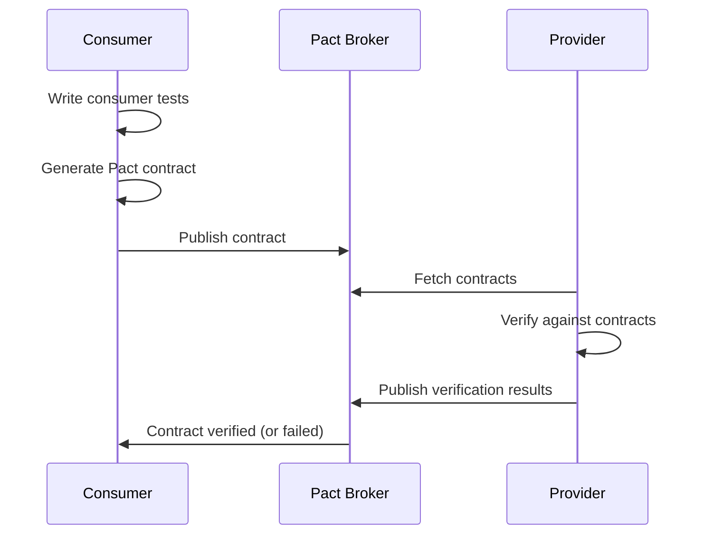
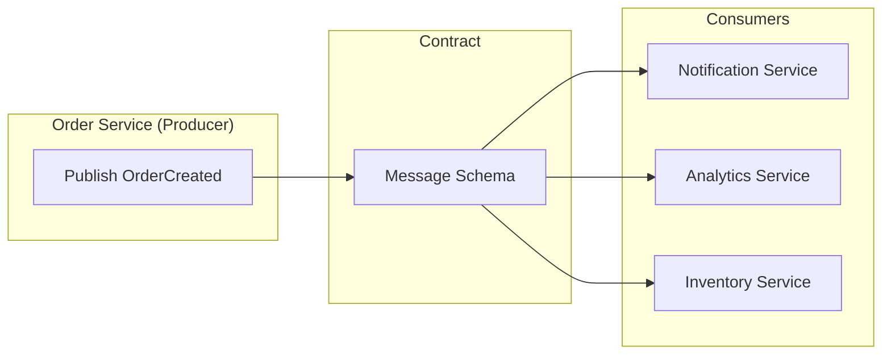
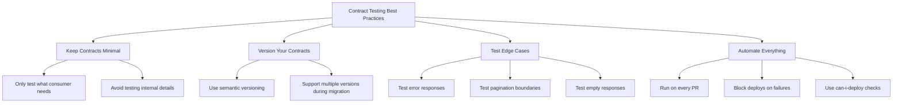

# How to Handle Contract Testing Between Services

Author: [nawazdhandala](https://www.github.com/nawazdhandala)

Tags: Contract Testing, Microservices, API Testing, Pact, Consumer-Driven Contracts, Integration Testing

Description: A comprehensive guide to implementing contract testing between microservices using consumer-driven contracts, Pact, and schema validation to prevent integration failures.

---

Contract testing ensures that services can communicate correctly without requiring end-to-end integration tests for every change. When Service A depends on Service B, a contract defines what Service A expects and what Service B provides. Breaking this contract breaks the integration. This guide covers implementing consumer-driven contract testing using Pact and schema-based approaches.

## Why Contract Testing Matters

Traditional integration testing has limitations in microservices architectures. Contract testing fills the gap.



## Consumer-Driven Contract Testing with Pact

Pact is the most popular tool for consumer-driven contract testing. The consumer defines what it expects, and the provider verifies it can meet those expectations.



### Consumer Side Implementation

```python
# tests/contract/test_user_service_consumer.py
import pytest
import atexit
from pact import Consumer, Provider, Like, EachLike, Term

# Set up Pact
pact = Consumer('order-service').has_pact_with(
    Provider('user-service'),
    pact_dir='./pacts',
    log_dir='./logs'
)
pact.start_service()
atexit.register(pact.stop_service)


class TestUserServiceContract:
    """Contract tests for user-service from order-service perspective."""

    def test_get_user_by_id(self):
        """Verify we can fetch user details."""
        # Define expected interaction
        expected_user = {
            "id": "user-123",
            "email": "john@example.com",
            "name": "John Doe",
            "status": "active",
            "created_at": "2026-01-15T10:00:00Z"
        }

        pact.given(
            'a user with ID user-123 exists'
        ).upon_receiving(
            'a request for user details'
        ).with_request(
            method='GET',
            path='/api/users/user-123',
            headers={'Authorization': 'Bearer token123'}
        ).will_respond_with(
            status=200,
            headers={'Content-Type': 'application/json'},
            body=Like(expected_user)
        )

        # Execute test against mock
        with pact:
            from myapp.clients import UserServiceClient
            client = UserServiceClient(base_url=pact.uri)

            user = client.get_user('user-123', token='token123')

            assert user['id'] == 'user-123'
            assert user['email'] == 'john@example.com'

    def test_get_user_not_found(self):
        """Verify 404 handling for missing user."""
        pact.given(
            'user with ID unknown-user does not exist'
        ).upon_receiving(
            'a request for non-existent user'
        ).with_request(
            method='GET',
            path='/api/users/unknown-user',
            headers={'Authorization': 'Bearer token123'}
        ).will_respond_with(
            status=404,
            headers={'Content-Type': 'application/json'},
            body={
                "error": "not_found",
                "message": Like("User not found")
            }
        )

        with pact:
            from myapp.clients import UserServiceClient
            client = UserServiceClient(base_url=pact.uri)

            with pytest.raises(UserNotFoundError):
                client.get_user('unknown-user', token='token123')

    def test_list_users_with_pagination(self):
        """Verify paginated user listing."""
        pact.given(
            'multiple users exist'
        ).upon_receiving(
            'a request for paginated user list'
        ).with_request(
            method='GET',
            path='/api/users',
            query={'page': '1', 'limit': '10'},
            headers={'Authorization': 'Bearer token123'}
        ).will_respond_with(
            status=200,
            headers={'Content-Type': 'application/json'},
            body={
                "users": EachLike({
                    "id": Like("user-1"),
                    "email": Term(r'.+@.+\..+', 'user@example.com'),
                    "name": Like("User Name"),
                    "status": Term(r'active|inactive|suspended', 'active')
                }),
                "pagination": {
                    "page": 1,
                    "limit": 10,
                    "total": Like(100),
                    "has_more": Like(True)
                }
            }
        )

        with pact:
            from myapp.clients import UserServiceClient
            client = UserServiceClient(base_url=pact.uri)

            result = client.list_users(page=1, limit=10, token='token123')

            assert 'users' in result
            assert 'pagination' in result
            assert isinstance(result['users'], list)


# Publish pacts to broker
def publish_pacts():
    """Publish pacts to Pact Broker after tests pass."""
    import subprocess
    subprocess.run([
        'pact-broker', 'publish', './pacts',
        '--broker-base-url', os.environ['PACT_BROKER_URL'],
        '--consumer-app-version', os.environ['GIT_COMMIT'],
        '--branch', os.environ.get('GIT_BRANCH', 'main')
    ], check=True)
```

### Provider Side Verification

```python
# tests/contract/test_user_service_provider.py
import pytest
from pact import Verifier
import subprocess

class TestUserServiceProvider:
    """Verify user-service meets all consumer contracts."""

    @pytest.fixture(scope='module')
    def provider_url(self, docker_services):
        """Start provider service for testing."""
        # Start service with test database
        port = docker_services.port_for('user-service', 8080)
        return f'http://localhost:{port}'

    def test_verify_contracts(self, provider_url):
        """Verify all consumer contracts."""
        verifier = Verifier(
            provider='user-service',
            provider_base_url=provider_url
        )

        # Fetch contracts from Pact Broker
        output, _ = verifier.verify_with_broker(
            broker_url=os.environ['PACT_BROKER_URL'],
            enable_pending=True,  # Allow new contracts to not break builds
            include_wip_pacts_since='2026-01-01',
            publish_version=os.environ['GIT_COMMIT'],
            provider_branch=os.environ.get('GIT_BRANCH', 'main'),

            # State handlers for setting up test data
            provider_states_setup_url=f'{provider_url}/_pact/states'
        )

        assert output == 0, "Contract verification failed"


# Provider state setup endpoint
from flask import Flask, request

app = Flask(__name__)

@app.route('/_pact/states', methods=['POST'])
def setup_provider_state():
    """Set up provider state for contract testing."""
    state = request.json
    state_name = state.get('state')
    state_params = state.get('params', {})

    if state_name == 'a user with ID user-123 exists':
        # Create test user
        db.session.execute("""
            INSERT INTO users (id, email, name, status, created_at)
            VALUES ('user-123', 'john@example.com', 'John Doe', 'active', NOW())
            ON CONFLICT (id) DO NOTHING
        """)
        db.session.commit()

    elif state_name == 'user with ID unknown-user does not exist':
        # Ensure user does not exist
        db.session.execute(
            "DELETE FROM users WHERE id = 'unknown-user'"
        )
        db.session.commit()

    elif state_name == 'multiple users exist':
        # Create test users
        for i in range(20):
            db.session.execute(f"""
                INSERT INTO users (id, email, name, status, created_at)
                VALUES ('user-{i}', 'user{i}@example.com', 'User {i}', 'active', NOW())
                ON CONFLICT (id) DO NOTHING
            """)
        db.session.commit()

    return {'status': 'ok'}
```

## Schema-Based Contract Testing

For simpler cases or when using OpenAPI, schema validation provides contract testing.

```python
# schema_contract_testing.py
import json
import yaml
from jsonschema import validate, ValidationError
from typing import Dict, Any
import requests

class SchemaContractValidator:
    """Validate API responses against OpenAPI schemas."""

    def __init__(self, openapi_spec_url: str):
        self.spec = self._load_spec(openapi_spec_url)
        self.schemas = self._extract_schemas()

    def _load_spec(self, url: str) -> Dict:
        """Load OpenAPI specification."""
        response = requests.get(url)
        if url.endswith('.yaml') or url.endswith('.yml'):
            return yaml.safe_load(response.text)
        return response.json()

    def _extract_schemas(self) -> Dict:
        """Extract component schemas from spec."""
        return self.spec.get('components', {}).get('schemas', {})

    def _resolve_ref(self, ref: str) -> Dict:
        """Resolve $ref to actual schema."""
        # Handle #/components/schemas/User format
        parts = ref.split('/')
        schema = self.spec
        for part in parts[1:]:  # Skip leading #
            schema = schema[part]
        return schema

    def _get_response_schema(
        self,
        path: str,
        method: str,
        status_code: int
    ) -> Dict:
        """Get expected response schema for an endpoint."""
        path_spec = self.spec['paths'].get(path, {})
        method_spec = path_spec.get(method.lower(), {})
        response_spec = method_spec.get('responses', {}).get(str(status_code), {})

        content = response_spec.get('content', {})
        json_content = content.get('application/json', {})
        schema = json_content.get('schema', {})

        # Resolve $ref if present
        if '$ref' in schema:
            schema = self._resolve_ref(schema['$ref'])

        return schema

    def validate_response(
        self,
        path: str,
        method: str,
        status_code: int,
        response_body: Any
    ) -> bool:
        """Validate response against schema."""
        schema = self._get_response_schema(path, method, status_code)

        if not schema:
            raise ValueError(f"No schema found for {method} {path} {status_code}")

        try:
            validate(instance=response_body, schema=schema)
            return True
        except ValidationError as e:
            raise ContractViolation(
                f"Response does not match schema for {method} {path}: {e.message}"
            )


class ContractViolation(Exception):
    """Raised when API response violates contract."""
    pass


# Test using schema validation
class TestOrderServiceSchemaContract:

    @pytest.fixture
    def validator(self):
        return SchemaContractValidator(
            'http://user-service:8080/openapi.json'
        )

    def test_get_user_matches_schema(self, validator, user_service_client):
        """Verify GET /users/{id} response matches schema."""
        response = user_service_client.get('/api/users/user-123')

        validator.validate_response(
            path='/api/users/{id}',
            method='GET',
            status_code=response.status_code,
            response_body=response.json()
        )

    def test_list_users_matches_schema(self, validator, user_service_client):
        """Verify GET /users response matches schema."""
        response = user_service_client.get('/api/users?page=1&limit=10')

        validator.validate_response(
            path='/api/users',
            method='GET',
            status_code=response.status_code,
            response_body=response.json()
        )
```

## Bidirectional Contract Testing

For event-driven systems, test both message producers and consumers.



```python
# event_contract_testing.py
from dataclasses import dataclass
from typing import Type, Dict, Any
import json
from pydantic import BaseModel, ValidationError
import pytest

# Define message schemas using Pydantic
class OrderCreatedEvent(BaseModel):
    event_type: str = "order.created"
    event_id: str
    timestamp: str
    data: 'OrderData'

    class OrderData(BaseModel):
        order_id: str
        user_id: str
        items: list
        total_amount: float
        currency: str

class OrderData(BaseModel):
    order_id: str
    user_id: str
    items: list
    total_amount: float
    currency: str

OrderCreatedEvent.OrderData = OrderData


class EventContractRegistry:
    """Registry of event contracts."""

    def __init__(self):
        self.contracts: Dict[str, Type[BaseModel]] = {}

    def register(self, event_type: str, schema: Type[BaseModel]):
        """Register event schema."""
        self.contracts[event_type] = schema

    def validate(self, event_type: str, event_data: Dict) -> bool:
        """Validate event against registered schema."""
        schema = self.contracts.get(event_type)
        if not schema:
            raise ValueError(f"No contract registered for {event_type}")

        try:
            schema(**event_data)
            return True
        except ValidationError as e:
            raise EventContractViolation(
                f"Event {event_type} violates contract: {e}"
            )

class EventContractViolation(Exception):
    pass


# Producer tests - verify published events match contract
class TestOrderServiceProducer:
    """Test that order-service publishes valid events."""

    @pytest.fixture
    def registry(self):
        registry = EventContractRegistry()
        registry.register('order.created', OrderCreatedEvent)
        return registry

    @pytest.fixture
    def captured_events(self):
        """Capture events published during test."""
        events = []

        # Mock the event publisher
        with patch('myapp.events.publish') as mock_publish:
            mock_publish.side_effect = lambda e: events.append(e)
            yield events

    def test_order_creation_publishes_valid_event(
        self,
        registry,
        captured_events,
        order_service
    ):
        """Verify order creation publishes contract-compliant event."""
        # Create order
        order = order_service.create_order(
            user_id='user-123',
            items=[{'product_id': 'prod-1', 'quantity': 2}]
        )

        # Verify event was published
        assert len(captured_events) == 1
        event = captured_events[0]

        # Validate against contract
        registry.validate('order.created', event)

        # Verify required fields
        assert event['data']['order_id'] == order.id
        assert event['data']['user_id'] == 'user-123'


# Consumer tests - verify consumer handles valid events
class TestNotificationServiceConsumer:
    """Test that notification-service handles events correctly."""

    def test_handles_order_created_event(self, notification_service):
        """Verify consumer processes valid OrderCreated event."""
        event = {
            "event_type": "order.created",
            "event_id": "evt-123",
            "timestamp": "2026-01-24T10:00:00Z",
            "data": {
                "order_id": "order-456",
                "user_id": "user-123",
                "items": [{"product_id": "prod-1", "quantity": 2}],
                "total_amount": 99.99,
                "currency": "USD"
            }
        }

        # Process event
        result = notification_service.handle_event(event)

        # Verify notification was created
        assert result.success
        assert result.notification_sent

    def test_handles_minimal_event(self, notification_service):
        """Verify consumer handles event with only required fields."""
        event = {
            "event_type": "order.created",
            "event_id": "evt-124",
            "timestamp": "2026-01-24T10:00:00Z",
            "data": {
                "order_id": "order-457",
                "user_id": "user-124",
                "items": [],
                "total_amount": 0.0,
                "currency": "USD"
            }
        }

        result = notification_service.handle_event(event)
        assert result.success
```

## CI/CD Integration

Integrate contract testing into your pipeline.

```yaml
# .github/workflows/contract-tests.yaml
name: Contract Tests

on:
  push:
    branches: [main, develop]
  pull_request:
    branches: [main]

jobs:
  consumer-contract-tests:
    runs-on: ubuntu-latest
    steps:
      - uses: actions/checkout@v4

      - name: Set up Python
        uses: actions/setup-python@v5
        with:
          python-version: '3.11'

      - name: Install dependencies
        run: |
          pip install -r requirements-test.txt
          pip install pact-python

      - name: Run consumer contract tests
        run: pytest tests/contract/test_*_consumer.py -v

      - name: Publish pacts to broker
        if: github.ref == 'refs/heads/main'
        env:
          PACT_BROKER_URL: ${{ secrets.PACT_BROKER_URL }}
          PACT_BROKER_TOKEN: ${{ secrets.PACT_BROKER_TOKEN }}
          GIT_COMMIT: ${{ github.sha }}
          GIT_BRANCH: ${{ github.ref_name }}
        run: |
          pact-broker publish ./pacts \
            --broker-base-url $PACT_BROKER_URL \
            --broker-token $PACT_BROKER_TOKEN \
            --consumer-app-version $GIT_COMMIT \
            --branch $GIT_BRANCH

  provider-contract-verification:
    runs-on: ubuntu-latest
    needs: consumer-contract-tests
    steps:
      - uses: actions/checkout@v4

      - name: Start provider service
        run: docker compose up -d user-service

      - name: Wait for service
        run: |
          timeout 60 bash -c 'until curl -s http://localhost:8080/health; do sleep 2; done'

      - name: Verify provider contracts
        env:
          PACT_BROKER_URL: ${{ secrets.PACT_BROKER_URL }}
          PACT_BROKER_TOKEN: ${{ secrets.PACT_BROKER_TOKEN }}
          GIT_COMMIT: ${{ github.sha }}
          GIT_BRANCH: ${{ github.ref_name }}
        run: |
          pact-verifier \
            --provider-base-url http://localhost:8080 \
            --provider user-service \
            --broker-url $PACT_BROKER_URL \
            --broker-token $PACT_BROKER_TOKEN \
            --publish-verification-results \
            --provider-app-version $GIT_COMMIT \
            --provider-version-branch $GIT_BRANCH

  can-i-deploy:
    runs-on: ubuntu-latest
    needs: [consumer-contract-tests, provider-contract-verification]
    if: github.ref == 'refs/heads/main'
    steps:
      - name: Check if safe to deploy
        env:
          PACT_BROKER_URL: ${{ secrets.PACT_BROKER_URL }}
          PACT_BROKER_TOKEN: ${{ secrets.PACT_BROKER_TOKEN }}
        run: |
          pact-broker can-i-deploy \
            --pacticipant order-service \
            --version ${{ github.sha }} \
            --to-environment production \
            --broker-base-url $PACT_BROKER_URL \
            --broker-token $PACT_BROKER_TOKEN
```

## Best Practices



Contract testing catches integration issues early, before they reach production. Start with critical service boundaries and expand coverage over time. Remember that contracts should test the interface, not the implementation.
