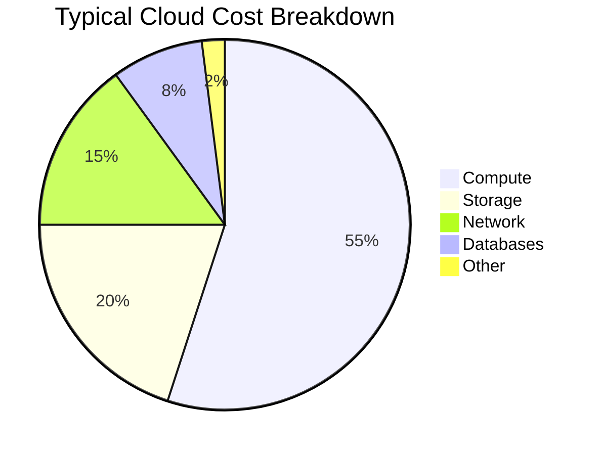
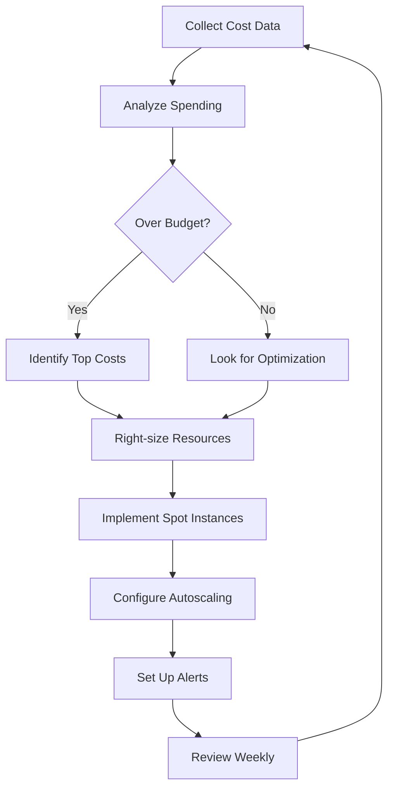

# How to Configure Cost Optimization

Author: [nawazdhandala](https://www.github.com/nawazdhandala)

Tags: Cost Optimization, Cloud, FinOps, Kubernetes, AWS, Infrastructure

Description: Learn how to configure cost optimization strategies for cloud infrastructure, including right-sizing resources, using spot instances, implementing autoscaling, and setting up cost monitoring.

---

Cloud bills have a tendency to grow faster than expected. What starts as a manageable expense can quickly become a significant budget line item. Cost optimization is not about cutting corners; it is about using resources efficiently so you get the performance you need without paying for resources you do not use.

## Understanding Cloud Costs

Before optimizing, you need to understand where money goes.



Most organizations spend the majority on compute, so that is where optimization efforts often have the biggest impact.

## Right-Sizing Compute Resources

Over-provisioned resources are the most common source of waste. Start by analyzing actual usage.

This script collects resource utilization data to identify over-provisioned workloads.

```bash
#!/bin/bash
# analyze-utilization.sh

echo "Analyzing resource utilization..."

# Get CPU and memory requests vs actual usage for all pods
kubectl top pods -A --no-headers | while read namespace pod cpu memory; do
    # Get requested resources
    requested=$(kubectl get pod $pod -n $namespace -o jsonpath='{.spec.containers[0].resources.requests.cpu},{.spec.containers[0].resources.requests.memory}' 2>/dev/null)

    req_cpu=$(echo $requested | cut -d, -f1)
    req_mem=$(echo $requested | cut -d, -f2)

    # Calculate utilization percentage
    echo "$namespace/$pod | Requested: $req_cpu CPU, $req_mem Memory | Actual: $cpu CPU, $memory Memory"
done
```

Configure resource requests based on actual usage patterns, not guesses.

```yaml
# deployment-right-sized.yaml
apiVersion: apps/v1
kind: Deployment
metadata:
  name: api-server
spec:
  replicas: 3
  template:
    spec:
      containers:
        - name: api-server
          image: ghcr.io/company/api-server:v2.3.1
          resources:
            # Set requests to P95 of actual usage
            requests:
              cpu: 200m      # Reduced from 1000m after analysis
              memory: 256Mi  # Reduced from 1Gi after analysis
            # Set limits to handle occasional spikes
            limits:
              cpu: 500m
              memory: 512Mi
```

Use the Vertical Pod Autoscaler to automate right-sizing.

```yaml
# vpa.yaml
apiVersion: autoscaling.k8s.io/v1
kind: VerticalPodAutoscaler
metadata:
  name: api-server-vpa
spec:
  targetRef:
    apiVersion: apps/v1
    kind: Deployment
    name: api-server
  updatePolicy:
    updateMode: "Auto"  # Automatically update pod resources
  resourcePolicy:
    containerPolicies:
      - containerName: api-server
        minAllowed:
          cpu: 50m
          memory: 64Mi
        maxAllowed:
          cpu: 2
          memory: 4Gi
        controlledResources: ["cpu", "memory"]
```

## Spot and Preemptible Instances

Spot instances cost 60-90% less than on-demand. They can be interrupted, but for fault-tolerant workloads, the savings are significant.

Configure your cluster to use spot instances for non-critical workloads.

```yaml
# spot-node-pool.yaml (GKE example)
apiVersion: container.google.com/v1beta1
kind: NodePool
metadata:
  name: spot-pool
spec:
  cluster: production-cluster
  config:
    machineType: n2-standard-4
    spot: true
    taints:
      - key: cloud.google.com/gke-spot
        value: "true"
        effect: NoSchedule
  autoscaling:
    enabled: true
    minNodeCount: 0
    maxNodeCount: 20
```

Configure pods to run on spot instances when appropriate.

```yaml
# deployment-spot.yaml
apiVersion: apps/v1
kind: Deployment
metadata:
  name: batch-processor
spec:
  replicas: 5
  template:
    spec:
      # Tolerate spot instance taints
      tolerations:
        - key: cloud.google.com/gke-spot
          operator: Equal
          value: "true"
          effect: NoSchedule
      # Prefer spot instances
      affinity:
        nodeAffinity:
          preferredDuringSchedulingIgnoredDuringExecution:
            - weight: 100
              preference:
                matchExpressions:
                  - key: cloud.google.com/gke-spot
                    operator: In
                    values:
                      - "true"
      containers:
        - name: processor
          image: ghcr.io/company/batch-processor:v1.2.0
```

Handle spot instance interruptions gracefully.

```python
# spot_handler.py
import signal
import sys
import requests
import time

class SpotInterruptionHandler:
    def __init__(self, shutdown_callback):
        self.shutdown_callback = shutdown_callback
        self.running = True

        # Handle SIGTERM for graceful shutdown
        signal.signal(signal.SIGTERM, self._handle_signal)
        signal.signal(signal.SIGINT, self._handle_signal)

    def _handle_signal(self, signum, frame):
        print(f"Received signal {signum}, initiating graceful shutdown")
        self.running = False
        self.shutdown_callback()

    def check_spot_interruption(self):
        """Check cloud provider's interruption notice endpoint."""
        # AWS example
        try:
            response = requests.get(
                "http://169.254.169.254/latest/meta-data/spot/instance-action",
                timeout=1
            )
            if response.status_code == 200:
                print("Spot interruption notice received")
                return True
        except requests.exceptions.RequestException:
            pass
        return False

    def run_with_interruption_check(self, work_func, interval=5):
        """Run work function with periodic interruption checks."""
        while self.running:
            if self.check_spot_interruption():
                print("Spot interruption detected, finishing current work")
                self.shutdown_callback()
                break

            work_func()
            time.sleep(interval)
```

## Autoscaling for Cost Efficiency

Scale resources based on actual demand instead of provisioning for peak capacity.

```yaml
# hpa-cost-optimized.yaml
apiVersion: autoscaling/v2
kind: HorizontalPodAutoscaler
metadata:
  name: api-server-hpa
spec:
  scaleTargetRef:
    apiVersion: apps/v1
    kind: Deployment
    name: api-server
  minReplicas: 2      # Minimum for high availability
  maxReplicas: 20     # Cap to control costs
  metrics:
    - type: Resource
      resource:
        name: cpu
        target:
          type: Utilization
          averageUtilization: 70  # Scale at 70% utilization
    - type: Resource
      resource:
        name: memory
        target:
          type: Utilization
          averageUtilization: 80
  behavior:
    scaleDown:
      # Scale down slowly to avoid thrashing
      stabilizationWindowSeconds: 300
      policies:
        - type: Percent
          value: 10
          periodSeconds: 60
    scaleUp:
      # Scale up quickly when needed
      stabilizationWindowSeconds: 0
      policies:
        - type: Percent
          value: 100
          periodSeconds: 15
```

For predictable traffic patterns, use scheduled scaling.

```yaml
# scheduled-scaling.yaml
apiVersion: batch/v1
kind: CronJob
metadata:
  name: scale-down-night
spec:
  schedule: "0 22 * * *"  # Every day at 10 PM
  jobTemplate:
    spec:
      template:
        spec:
          containers:
            - name: scaler
              image: bitnami/kubectl:latest
              command:
                - /bin/sh
                - -c
                - |
                  # Scale down non-critical services at night
                  kubectl scale deployment api-server --replicas=2
                  kubectl scale deployment web-frontend --replicas=2
          restartPolicy: OnFailure
---
apiVersion: batch/v1
kind: CronJob
metadata:
  name: scale-up-morning
spec:
  schedule: "0 6 * * 1-5"  # Weekdays at 6 AM
  jobTemplate:
    spec:
      template:
        spec:
          containers:
            - name: scaler
              image: bitnami/kubectl:latest
              command:
                - /bin/sh
                - -c
                - |
                  # Scale up for business hours
                  kubectl scale deployment api-server --replicas=5
                  kubectl scale deployment web-frontend --replicas=5
          restartPolicy: OnFailure
```

## Storage Cost Optimization

Storage costs accumulate over time. Implement lifecycle policies to manage data retention.

```yaml
# s3-lifecycle.yaml (AWS S3 example)
AWSTemplateFormatVersion: '2010-09-09'
Resources:
  DataBucket:
    Type: AWS::S3::Bucket
    Properties:
      BucketName: company-data-bucket
      LifecycleConfiguration:
        Rules:
          # Move logs to cheaper storage after 30 days
          - Id: TransitionLogs
            Prefix: logs/
            Status: Enabled
            Transitions:
              - StorageClass: STANDARD_IA
                TransitionInDays: 30
              - StorageClass: GLACIER
                TransitionInDays: 90
            ExpirationInDays: 365

          # Delete temporary files after 7 days
          - Id: CleanupTemp
            Prefix: temp/
            Status: Enabled
            ExpirationInDays: 7

          # Abort incomplete multipart uploads
          - Id: AbortIncompleteUploads
            Status: Enabled
            AbortIncompleteMultipartUpload:
              DaysAfterInitiation: 1
```

Clean up unused persistent volumes in Kubernetes.

```bash
#!/bin/bash
# cleanup-pvcs.sh

echo "Finding unused PersistentVolumeClaims..."

# Get all PVCs
for pvc in $(kubectl get pvc -A -o jsonpath='{range .items[*]}{.metadata.namespace}/{.metadata.name}{"\n"}{end}'); do
    namespace=$(echo $pvc | cut -d'/' -f1)
    name=$(echo $pvc | cut -d'/' -f2)

    # Check if PVC is bound to any pod
    bound_pods=$(kubectl get pods -n $namespace -o json | jq -r ".items[].spec.volumes[]? | select(.persistentVolumeClaim.claimName == \"$name\") | .name" 2>/dev/null)

    if [ -z "$bound_pods" ]; then
        size=$(kubectl get pvc $name -n $namespace -o jsonpath='{.spec.resources.requests.storage}')
        echo "Unused PVC: $namespace/$name (Size: $size)"
    fi
done
```

## Reserved Capacity and Savings Plans

For predictable workloads, reserved instances offer significant savings.

```python
# reservation_calculator.py
def calculate_reservation_recommendation(usage_data):
    """
    Analyze usage patterns and recommend reserved capacity.
    """
    # Find baseline usage (P10 over 30 days)
    baseline = percentile(usage_data, 10)

    # Find peak usage (P99 over 30 days)
    peak = percentile(usage_data, 99)

    # Reserved capacity should cover baseline
    # On-demand or spot handles the variable portion
    recommendations = {
        'reserved_capacity': baseline,
        'on_demand_buffer': peak - baseline,
        'savings_estimate': calculate_savings(baseline, usage_data)
    }

    return recommendations

def calculate_savings(reserved_amount, usage_data):
    """
    Calculate estimated savings from reserved vs on-demand.
    """
    # Assume 30% savings for 1-year reserved
    reserved_rate = 0.70

    hours_per_month = 730
    on_demand_cost = sum(usage_data) * hours_per_month
    reserved_cost = reserved_amount * hours_per_month * reserved_rate
    remaining_on_demand = sum(max(0, u - reserved_amount) for u in usage_data) * hours_per_month

    total_with_reserved = reserved_cost + remaining_on_demand
    savings = on_demand_cost - total_with_reserved

    return {
        'monthly_savings': savings,
        'annual_savings': savings * 12,
        'savings_percentage': (savings / on_demand_cost) * 100
    }
```

## Cost Monitoring and Alerts

Set up monitoring to catch cost issues before they become budget problems.

```yaml
# cost-alerts.yaml
apiVersion: monitoring.coreos.com/v1
kind: PrometheusRule
metadata:
  name: cost-alerts
spec:
  groups:
    - name: cost
      rules:
        # Alert when cluster cost projection exceeds budget
        - alert: ProjectedCostOverBudget
          expr: |
            sum(
              kube_pod_container_resource_requests{resource="cpu"} * 0.03 +
              kube_pod_container_resource_requests{resource="memory"} * 0.004
            ) * 730 > 10000  # $10,000 monthly budget
          for: 1h
          labels:
            severity: warning
          annotations:
            summary: "Projected monthly cost exceeds budget"
            description: "Current resource usage projects to exceed $10,000/month"

        # Alert on sudden cost increase
        - alert: CostSpike
          expr: |
            sum(rate(container_cpu_usage_seconds_total[1h])) /
            sum(rate(container_cpu_usage_seconds_total[24h] offset 1d)) > 1.5
          for: 30m
          labels:
            severity: warning
          annotations:
            summary: "Resource usage spiked 50% above yesterday"
```

Create a cost dashboard in Grafana.

```json
{
  "dashboard": {
    "title": "Cost Monitoring",
    "panels": [
      {
        "title": "Estimated Daily Cost by Namespace",
        "type": "timeseries",
        "targets": [
          {
            "expr": "sum by (namespace) (kube_pod_container_resource_requests{resource=\"cpu\"} * 0.03 + kube_pod_container_resource_requests{resource=\"memory\"} / 1073741824 * 0.004) * 24",
            "legendFormat": "{{namespace}}"
          }
        ]
      },
      {
        "title": "Resource Efficiency (Usage/Requests)",
        "type": "gauge",
        "targets": [
          {
            "expr": "sum(rate(container_cpu_usage_seconds_total[5m])) / sum(kube_pod_container_resource_requests{resource=\"cpu\"}) * 100"
          }
        ]
      },
      {
        "title": "Idle Resources (Requested but Unused)",
        "type": "stat",
        "targets": [
          {
            "expr": "sum(kube_pod_container_resource_requests{resource=\"cpu\"}) - sum(rate(container_cpu_usage_seconds_total[5m]))"
          }
        ]
      }
    ]
  }
}
```

## Cost Optimization Workflow

Implement a continuous cost optimization process.



## Quick Wins Checklist

Start with these high-impact optimizations.

- [ ] Delete unused resources (orphaned volumes, old snapshots)
- [ ] Right-size over-provisioned instances
- [ ] Implement autoscaling for variable workloads
- [ ] Use spot instances for fault-tolerant workloads
- [ ] Set up lifecycle policies for storage
- [ ] Purchase reserved capacity for stable workloads
- [ ] Enable cost alerts before hitting budget limits
- [ ] Review and clean up dev/test environments

## Best Practices

1. **Measure first** - You cannot optimize what you do not measure
2. **Start with the biggest costs** - Focus on compute before optimizing small services
3. **Automate right-sizing** - Manual optimization does not scale
4. **Accept some waste** - Perfect optimization is expensive to maintain
5. **Review regularly** - Usage patterns change, so should your optimization
6. **Set budgets** - Cost awareness starts with knowing the limits

---

Cost optimization is a continuous process, not a one-time project. Start with visibility into where money goes, automate the obvious optimizations, and review regularly. The goal is not to minimize cost but to maximize value per dollar spent.
