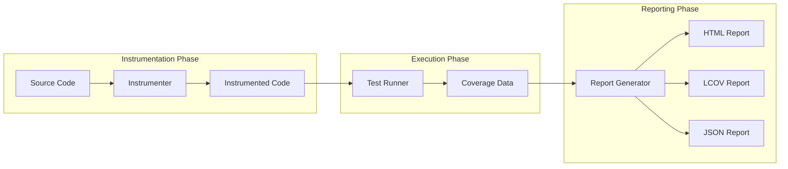
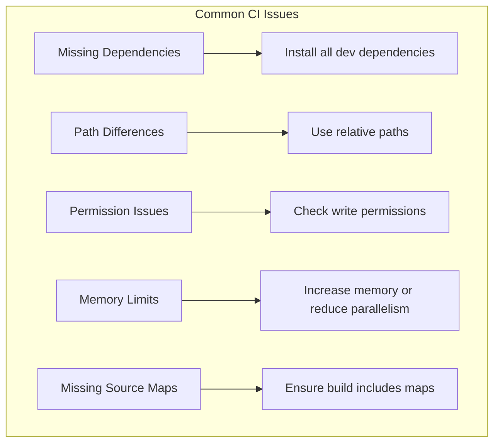

# How to Fix 'Coverage Report' Generation Issues

Author: [nawazdhandala](https://www.github.com/nawazdhandala)

Tags: Testing, Code Coverage, Jest, Istanbul, NYC, CI/CD, Quality Assurance, DevOps

Description: Learn how to troubleshoot and fix common code coverage report generation issues across different testing frameworks and CI/CD environments.

---

Code coverage reports are essential for understanding how much of your codebase is tested. But when coverage generation fails or produces incorrect results, it can block your CI/CD pipeline and leave your team guessing about test quality. This guide walks you through the most common coverage report issues and how to fix them.

---

## Table of Contents

1. Understanding Coverage Report Generation
2. Common Coverage Issues and Fixes
3. Framework-Specific Troubleshooting
4. CI/CD Environment Issues
5. Merging Coverage from Multiple Sources
6. Performance Optimization
7. Best Practices

---

## 1. Understanding Coverage Report Generation

Before diving into fixes, it helps to understand how coverage tools work.

### How Coverage Tools Work

Coverage tools typically work by instrumenting your code - adding tracking statements that record which lines, branches, and functions are executed during tests.



### Coverage Metrics

| Metric | Description | What It Measures |
|--------|-------------|------------------|
| **Line Coverage** | Percentage of lines executed | Basic execution coverage |
| **Branch Coverage** | Percentage of branches taken | Conditional logic coverage |
| **Function Coverage** | Percentage of functions called | API surface coverage |
| **Statement Coverage** | Percentage of statements executed | Fine-grained execution |

---

## 2. Common Coverage Issues and Fixes

### Issue 1: Coverage Shows 0% Despite Tests Passing

This is often caused by the coverage tool not instrumenting your source files.

**Symptoms:**
- Tests pass successfully
- Coverage report shows 0% or empty
- No source files appear in the report

**Fix: Check your include/exclude patterns**

```javascript
// jest.config.js - Common misconfiguration
module.exports = {
  // Wrong: This excludes everything in src/
  collectCoverageFrom: [
    '!src/**/*.js'  // The ! negates the pattern
  ],

  // Correct: Include src files, exclude tests
  collectCoverageFrom: [
    'src/**/*.{js,jsx,ts,tsx}',
    '!src/**/*.test.{js,jsx,ts,tsx}',
    '!src/**/*.spec.{js,jsx,ts,tsx}',
    '!src/**/index.{js,ts}'  // Optional: exclude barrel files
  ]
};
```

**Fix: Verify source maps are enabled for TypeScript**

```json
{
  "compilerOptions": {
    "sourceMap": true,
    "inlineSources": true,
    "declaration": true
  }
}
```

### Issue 2: "Cannot Find Module" During Coverage

Coverage instrumentation can change how modules resolve.

**Symptoms:**
- Tests pass without coverage
- Tests fail with coverage enabled
- Module resolution errors appear

**Fix: Configure module resolution consistently**

```javascript
// jest.config.js
module.exports = {
  moduleNameMapper: {
    // Map path aliases to actual paths
    '^@/(.*)$': '<rootDir>/src/$1',
    '^@components/(.*)$': '<rootDir>/src/components/$1'
  },
  // Ensure transforms apply to node_modules if needed
  transformIgnorePatterns: [
    'node_modules/(?!(some-esm-package|another-package)/)'
  ]
};
```

### Issue 3: Coverage Numbers Don't Match Reality

When coverage reports show lines as uncovered that you know are tested.

**Symptoms:**
- Tested code shows as uncovered
- Async code shows incorrect coverage
- Generated code appears in reports

**Fix: Handle async code properly**

```javascript
// Problem: Coverage misses async branches
async function fetchData(url) {
  try {
    const response = await fetch(url);
    return response.json();  // May show as uncovered
  } catch (error) {
    return null;
  }
}

// Test: Ensure all branches are tested
describe('fetchData', () => {
  it('returns data on success', async () => {
    global.fetch = jest.fn().mockResolvedValue({
      json: () => Promise.resolve({ data: 'test' })
    });
    const result = await fetchData('http://example.com');
    expect(result).toEqual({ data: 'test' });
  });

  it('returns null on failure', async () => {
    global.fetch = jest.fn().mockRejectedValue(new Error('Network error'));
    const result = await fetchData('http://example.com');
    expect(result).toBeNull();
  });
});
```

**Fix: Exclude generated files**

```javascript
// jest.config.js
module.exports = {
  collectCoverageFrom: [
    'src/**/*.{js,ts}',
    '!src/**/*.generated.{js,ts}',  // Exclude generated files
    '!src/**/*.d.ts',                // Exclude type definitions
    '!src/graphql/generated/**'      // Exclude GraphQL codegen
  ],
  coveragePathIgnorePatterns: [
    '/node_modules/',
    '/__generated__/',
    '/dist/'
  ]
};
```

---

## 3. Framework-Specific Troubleshooting

### Jest Coverage Issues

**Issue: Jest coverage hangs or times out**

```javascript
// jest.config.js
module.exports = {
  // Increase timeout for coverage runs
  testTimeout: 30000,

  // Use fewer workers to reduce memory pressure
  maxWorkers: '50%',

  // Clear mocks between tests to prevent state leaks
  clearMocks: true,

  // Force exit if tests hang
  forceExit: true
};
```

**Issue: Jest coverage with TypeScript**

```javascript
// jest.config.js for TypeScript projects
module.exports = {
  preset: 'ts-jest',
  testEnvironment: 'node',
  collectCoverage: true,
  collectCoverageFrom: [
    'src/**/*.ts',
    '!src/**/*.d.ts'
  ],
  coverageReporters: ['text', 'lcov', 'html'],

  // Important: Map coverage back to TypeScript source
  globals: {
    'ts-jest': {
      tsconfig: 'tsconfig.json',
      // Enable source maps for accurate coverage
      diagnostics: false
    }
  }
};
```

### NYC (Istanbul) Coverage Issues

NYC is commonly used with Mocha, Ava, and other test runners.

**Issue: NYC not finding files**

```json
{
  "nyc": {
    "all": true,
    "include": [
      "src/**/*.js"
    ],
    "exclude": [
      "**/*.spec.js",
      "**/*.test.js",
      "coverage/**",
      "test/**"
    ],
    "reporter": ["text", "html", "lcov"],
    "check-coverage": true,
    "branches": 80,
    "lines": 80,
    "functions": 80,
    "statements": 80
  }
}
```

**Issue: NYC with ES modules**

```bash
# Use the experimental loader for ES modules
node --experimental-vm-modules node_modules/.bin/nyc mocha
```

```json
{
  "nyc": {
    "instrument": true,
    "sourceMap": true,
    "require": [
      "@babel/register"
    ],
    "extension": [
      ".js",
      ".mjs"
    ]
  }
}
```

### Pytest Coverage Issues (Python)

**Issue: Coverage missing dynamically loaded modules**

```ini
# pytest.ini or pyproject.toml
[tool.pytest.ini_options]
addopts = "--cov=src --cov-report=html --cov-report=xml"

[tool.coverage.run]
source = ["src"]
branch = true
# Important: Enable dynamic context
dynamic_context = "test_function"
# Measure coverage of subprocesses
parallel = true

[tool.coverage.report]
exclude_lines = [
    "pragma: no cover",
    "def __repr__",
    "raise NotImplementedError",
    "if TYPE_CHECKING:",
    "if __name__ == .__main__.:"
]
```

---

## 4. CI/CD Environment Issues

Coverage often fails in CI environments due to environmental differences.

### Issue: Coverage works locally but fails in CI



**Fix: GitHub Actions configuration**

```yaml
# .github/workflows/test.yml
name: Test with Coverage

on: [push, pull_request]

jobs:
  test:
    runs-on: ubuntu-latest
    steps:
      - uses: actions/checkout@v4

      - name: Setup Node.js
        uses: actions/setup-node@v4
        with:
          node-version: '20'
          cache: 'npm'

      - name: Install dependencies
        run: npm ci

      - name: Run tests with coverage
        run: npm test -- --coverage --coverageReporters=lcov
        env:
          CI: true
          # Increase memory for large projects
          NODE_OPTIONS: '--max-old-space-size=4096'

      - name: Upload coverage to Codecov
        uses: codecov/codecov-action@v4
        with:
          files: ./coverage/lcov.info
          fail_ci_if_error: true
          verbose: true
```

### Issue: Coverage reports not uploading

```yaml
# Ensure coverage files exist before upload
- name: Verify coverage files
  run: |
    if [ ! -f coverage/lcov.info ]; then
      echo "Coverage file not found!"
      exit 1
    fi
    echo "Coverage file size: $(wc -c < coverage/lcov.info) bytes"

- name: Upload coverage
  uses: codecov/codecov-action@v4
  with:
    files: ./coverage/lcov.info
    flags: unittests
    name: codecov-umbrella
    fail_ci_if_error: true
```

---

## 5. Merging Coverage from Multiple Sources

When you have multiple test suites (unit, integration, e2e), you need to merge coverage.

### Merging with NYC

```bash
# Run different test suites with separate coverage outputs
nyc --reporter=json --report-dir=coverage/unit npm run test:unit
nyc --reporter=json --report-dir=coverage/integration npm run test:integration

# Merge the coverage reports
nyc merge coverage coverage/merged.json

# Generate final report from merged data
nyc report --reporter=lcov --reporter=text --temp-dir=coverage
```

### Merging with Jest

```javascript
// jest.config.js
module.exports = {
  projects: [
    {
      displayName: 'unit',
      testMatch: ['<rootDir>/src/**/*.test.js'],
      coverageDirectory: 'coverage/unit'
    },
    {
      displayName: 'integration',
      testMatch: ['<rootDir>/integration/**/*.test.js'],
      coverageDirectory: 'coverage/integration'
    }
  ],
  // Merge coverage from all projects
  collectCoverageFrom: ['src/**/*.js'],
  coverageDirectory: 'coverage/merged'
};
```

### Merging in CI pipeline

```yaml
# GitHub Actions example
jobs:
  unit-tests:
    runs-on: ubuntu-latest
    steps:
      - uses: actions/checkout@v4
      - run: npm ci
      - run: npm run test:unit -- --coverage
      - uses: actions/upload-artifact@v4
        with:
          name: unit-coverage
          path: coverage/

  integration-tests:
    runs-on: ubuntu-latest
    steps:
      - uses: actions/checkout@v4
      - run: npm ci
      - run: npm run test:integration -- --coverage
      - uses: actions/upload-artifact@v4
        with:
          name: integration-coverage
          path: coverage/

  merge-coverage:
    needs: [unit-tests, integration-tests]
    runs-on: ubuntu-latest
    steps:
      - uses: actions/checkout@v4
      - uses: actions/download-artifact@v4
        with:
          path: coverage-parts/

      - name: Merge coverage reports
        run: |
          npm ci
          npx nyc merge coverage-parts coverage/merged.json
          npx nyc report --reporter=lcov --temp-dir=coverage

      - uses: codecov/codecov-action@v4
        with:
          files: coverage/lcov.info
```

---

## 6. Performance Optimization

Large codebases can experience slow coverage generation.

### Optimizing Jest Coverage

```javascript
// jest.config.js
module.exports = {
  // Only collect coverage for changed files in watch mode
  collectCoverageFrom: [
    'src/**/*.{js,ts}',
    '!**/node_modules/**'
  ],

  // Use V8 coverage instead of Babel instrumentation
  coverageProvider: 'v8',  // Faster than 'babel'

  // Limit coverage to specific paths
  coveragePathIgnorePatterns: [
    '/node_modules/',
    '/__tests__/',
    '/dist/',
    '/coverage/'
  ],

  // Cache transformed files
  cache: true,
  cacheDirectory: '<rootDir>/.jest-cache'
};
```

### Incremental Coverage

For large projects, consider running coverage only on changed files:

```bash
# Get changed files
CHANGED_FILES=$(git diff --name-only HEAD~1 | grep -E '\.(js|ts)$' | tr '\n' ' ')

# Run coverage only on changed files
jest --coverage --findRelatedTests $CHANGED_FILES
```

---

## 7. Best Practices

### Coverage Thresholds

```javascript
// jest.config.js
module.exports = {
  coverageThreshold: {
    global: {
      branches: 80,
      functions: 80,
      lines: 80,
      statements: 80
    },
    // Stricter thresholds for critical paths
    './src/core/': {
      branches: 90,
      functions: 90,
      lines: 90
    }
  }
};
```

### Ignoring Code Intentionally

```javascript
// Use coverage ignore comments sparingly and with justification

/* istanbul ignore next: Platform-specific code not testable in CI */
if (process.platform === 'win32') {
  // Windows-specific handling
}

/* istanbul ignore if: Error case requires network failure */
if (!response.ok) {
  throw new Error('Network failure');
}
```

### Coverage Report Types

| Format | Use Case | File |
|--------|----------|------|
| **lcov** | CI services (Codecov, Coveralls) | lcov.info |
| **html** | Human-readable browsing | index.html |
| **json** | Programmatic processing | coverage.json |
| **text** | Console output | stdout |
| **cobertura** | Jenkins, Azure DevOps | cobertura.xml |

---

## Key Takeaways

1. **Check include/exclude patterns first** - Most coverage issues stem from misconfigured file patterns
2. **Ensure source maps are enabled** for TypeScript and transpiled code
3. **Use the same coverage configuration** locally and in CI
4. **Merge coverage from multiple test suites** for accurate totals
5. **Set realistic thresholds** - 100% coverage is rarely practical or necessary
6. **Monitor coverage trends** over time, not just absolute numbers
7. **Use V8 coverage provider** for better performance in Jest

---

*Need to monitor your test coverage trends and alert on regressions? [OneUptime](https://oneuptime.com) can help you track quality metrics alongside your application performance and availability.*
