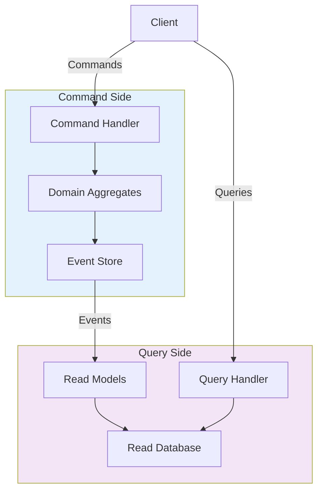
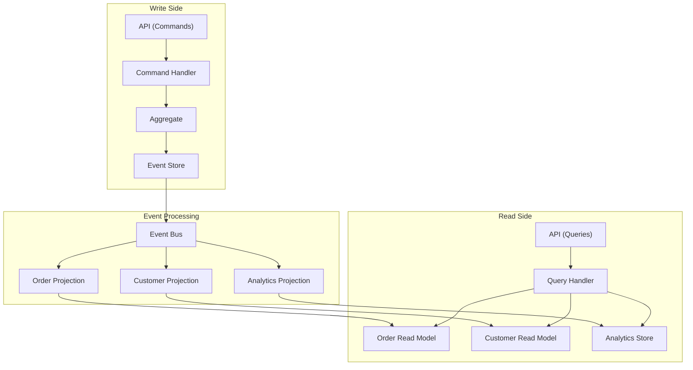

# How to Handle CQRS Pattern Implementation

Author: [nawazdhandala](https://www.github.com/nawazdhandala)

Tags: CQRS, Architecture, Event Sourcing, Microservices, Python, Domain-Driven Design, System Design

Description: A comprehensive guide to implementing Command Query Responsibility Segregation (CQRS) with separate read and write models for scalable, maintainable applications.

---

> CQRS (Command Query Responsibility Segregation) separates read and write operations into distinct models, allowing each to be optimized independently. This guide shows you how to implement CQRS effectively in your applications.

Traditional CRUD applications use a single model for both reads and writes. CQRS acknowledges that read and write patterns often have different requirements and optimizes each separately.

---

## Understanding CQRS

CQRS splits your application into two sides:

- **Command Side**: Handles writes (create, update, delete)
- **Query Side**: Handles reads (optimized for specific use cases)



---

## Basic CQRS Implementation

### Command Side

```python
# commands.py
from dataclasses import dataclass
from abc import ABC, abstractmethod
from typing import Dict, Any, List
from datetime import datetime
import uuid


# Base command class
@dataclass
class Command(ABC):
    """Base class for all commands"""
    command_id: str = None
    timestamp: datetime = None

    def __post_init__(self):
        if self.command_id is None:
            self.command_id = str(uuid.uuid4())
        if self.timestamp is None:
            self.timestamp = datetime.utcnow()


# Specific commands
@dataclass
class CreateOrderCommand(Command):
    """Command to create a new order"""
    customer_id: str = None
    items: List[Dict] = None
    shipping_address: Dict = None


@dataclass
class AddItemToOrderCommand(Command):
    """Command to add item to existing order"""
    order_id: str = None
    product_id: str = None
    quantity: int = 1


@dataclass
class CancelOrderCommand(Command):
    """Command to cancel an order"""
    order_id: str = None
    reason: str = None


# Command handler interface
class CommandHandler(ABC):
    """Base class for command handlers"""

    @abstractmethod
    def handle(self, command: Command) -> Any:
        """Handle the command and return result"""
        pass


# Domain events
@dataclass
class DomainEvent:
    """Base class for domain events"""
    event_id: str = None
    aggregate_id: str = None
    timestamp: datetime = None
    version: int = 1

    def __post_init__(self):
        if self.event_id is None:
            self.event_id = str(uuid.uuid4())
        if self.timestamp is None:
            self.timestamp = datetime.utcnow()


@dataclass
class OrderCreatedEvent(DomainEvent):
    """Event when order is created"""
    customer_id: str = None
    items: List[Dict] = None
    total_amount: float = 0.0


@dataclass
class OrderItemAddedEvent(DomainEvent):
    """Event when item is added to order"""
    product_id: str = None
    quantity: int = 0
    price: float = 0.0


@dataclass
class OrderCancelledEvent(DomainEvent):
    """Event when order is cancelled"""
    reason: str = None
```

### Aggregate Root

```python
# aggregates.py
from typing import List, Dict, Optional
from dataclasses import dataclass, field
from datetime import datetime
from enum import Enum


class OrderStatus(Enum):
    DRAFT = "draft"
    PLACED = "placed"
    CONFIRMED = "confirmed"
    SHIPPED = "shipped"
    DELIVERED = "delivered"
    CANCELLED = "cancelled"


@dataclass
class OrderItem:
    product_id: str
    quantity: int
    price: float

    @property
    def total(self) -> float:
        return self.quantity * self.price


@dataclass
class Order:
    """Order aggregate root"""

    id: str
    customer_id: str
    status: OrderStatus = OrderStatus.DRAFT
    items: List[OrderItem] = field(default_factory=list)
    created_at: datetime = None
    updated_at: datetime = None
    version: int = 0

    # Uncommitted events
    _events: List[DomainEvent] = field(default_factory=list, repr=False)

    def __post_init__(self):
        if self.created_at is None:
            self.created_at = datetime.utcnow()
        self.updated_at = self.created_at

    # Command methods that modify state and emit events

    @classmethod
    def create(cls, order_id: str, customer_id: str, items: List[Dict]) -> 'Order':
        """Create a new order"""
        order = cls(id=order_id, customer_id=customer_id)

        # Add items
        order_items = []
        total = 0.0
        for item in items:
            order_item = OrderItem(
                product_id=item["product_id"],
                quantity=item["quantity"],
                price=item["price"]
            )
            order_items.append(order_item)
            total += order_item.total

        order.items = order_items

        # Emit event
        event = OrderCreatedEvent(
            aggregate_id=order_id,
            customer_id=customer_id,
            items=items,
            total_amount=total,
            version=1
        )
        order._events.append(event)
        order.version = 1

        return order

    def add_item(self, product_id: str, quantity: int, price: float):
        """Add item to order"""

        if self.status != OrderStatus.DRAFT:
            raise ValueError("Cannot add items to non-draft order")

        item = OrderItem(product_id=product_id, quantity=quantity, price=price)
        self.items.append(item)
        self.version += 1
        self.updated_at = datetime.utcnow()

        event = OrderItemAddedEvent(
            aggregate_id=self.id,
            product_id=product_id,
            quantity=quantity,
            price=price,
            version=self.version
        )
        self._events.append(event)

    def cancel(self, reason: str):
        """Cancel the order"""

        if self.status in [OrderStatus.SHIPPED, OrderStatus.DELIVERED]:
            raise ValueError("Cannot cancel shipped/delivered order")

        self.status = OrderStatus.CANCELLED
        self.version += 1
        self.updated_at = datetime.utcnow()

        event = OrderCancelledEvent(
            aggregate_id=self.id,
            reason=reason,
            version=self.version
        )
        self._events.append(event)

    def get_uncommitted_events(self) -> List[DomainEvent]:
        """Get events that haven't been persisted yet"""
        return self._events.copy()

    def clear_events(self):
        """Clear uncommitted events after persistence"""
        self._events.clear()

    @property
    def total_amount(self) -> float:
        return sum(item.total for item in self.items)


# Event store interface
class EventStore(ABC):
    """Interface for event storage"""

    @abstractmethod
    def save_events(self, aggregate_id: str, events: List[DomainEvent], expected_version: int):
        """Save events with optimistic concurrency"""
        pass

    @abstractmethod
    def get_events(self, aggregate_id: str) -> List[DomainEvent]:
        """Get all events for an aggregate"""
        pass
```

### Command Handlers

```python
# command_handlers.py
from typing import Dict, Optional


class CreateOrderHandler(CommandHandler):
    """Handler for CreateOrderCommand"""

    def __init__(self, event_store: EventStore, event_publisher):
        self.event_store = event_store
        self.event_publisher = event_publisher

    def handle(self, command: CreateOrderCommand) -> Dict:
        """Handle order creation"""

        # Generate order ID
        order_id = str(uuid.uuid4())

        # Create aggregate
        order = Order.create(
            order_id=order_id,
            customer_id=command.customer_id,
            items=command.items
        )

        # Persist events
        events = order.get_uncommitted_events()
        self.event_store.save_events(order_id, events, expected_version=0)

        # Publish events for read model updates
        for event in events:
            self.event_publisher.publish(event)

        order.clear_events()

        return {
            "order_id": order_id,
            "status": "created",
            "total_amount": order.total_amount
        }


class AddItemToOrderHandler(CommandHandler):
    """Handler for AddItemToOrderCommand"""

    def __init__(self, event_store: EventStore, event_publisher, product_service):
        self.event_store = event_store
        self.event_publisher = event_publisher
        self.product_service = product_service

    def handle(self, command: AddItemToOrderCommand) -> Dict:
        """Handle adding item to order"""

        # Load aggregate from events
        events = self.event_store.get_events(command.order_id)
        order = self._rebuild_order(command.order_id, events)

        # Get product price
        product = self.product_service.get_product(command.product_id)

        # Execute command
        order.add_item(
            product_id=command.product_id,
            quantity=command.quantity,
            price=product["price"]
        )

        # Persist new events
        new_events = order.get_uncommitted_events()
        self.event_store.save_events(
            command.order_id,
            new_events,
            expected_version=order.version - len(new_events)
        )

        # Publish events
        for event in new_events:
            self.event_publisher.publish(event)

        return {"status": "item_added", "order_id": command.order_id}

    def _rebuild_order(self, order_id: str, events: List[DomainEvent]) -> Order:
        """Rebuild order aggregate from events"""
        order = None

        for event in events:
            if isinstance(event, OrderCreatedEvent):
                order = Order(
                    id=order_id,
                    customer_id=event.customer_id,
                    version=event.version
                )
                for item in event.items:
                    order.items.append(OrderItem(**item))

            elif isinstance(event, OrderItemAddedEvent):
                order.items.append(OrderItem(
                    product_id=event.product_id,
                    quantity=event.quantity,
                    price=event.price
                ))
                order.version = event.version

            elif isinstance(event, OrderCancelledEvent):
                order.status = OrderStatus.CANCELLED
                order.version = event.version

        return order


# Command dispatcher
class CommandDispatcher:
    """Routes commands to appropriate handlers"""

    def __init__(self):
        self._handlers: Dict[type, CommandHandler] = {}

    def register(self, command_type: type, handler: CommandHandler):
        """Register a handler for a command type"""
        self._handlers[command_type] = handler

    def dispatch(self, command: Command):
        """Dispatch command to registered handler"""
        command_type = type(command)

        if command_type not in self._handlers:
            raise ValueError(f"No handler registered for {command_type.__name__}")

        handler = self._handlers[command_type]
        return handler.handle(command)
```

---

## Query Side

### Read Models

```python
# read_models.py
from dataclasses import dataclass
from typing import List, Optional
from datetime import datetime


@dataclass
class OrderSummaryReadModel:
    """Optimized read model for order list view"""
    order_id: str
    customer_id: str
    customer_name: str
    status: str
    item_count: int
    total_amount: float
    created_at: datetime


@dataclass
class OrderDetailReadModel:
    """Detailed read model for single order view"""
    order_id: str
    customer_id: str
    customer_name: str
    customer_email: str
    status: str
    items: List[Dict]
    total_amount: float
    shipping_address: Dict
    created_at: datetime
    updated_at: datetime


@dataclass
class CustomerOrdersReadModel:
    """Read model for customer's order history"""
    customer_id: str
    customer_name: str
    total_orders: int
    total_spent: float
    orders: List[OrderSummaryReadModel]
```

### Read Model Projections

```python
# projections.py
from abc import ABC, abstractmethod
from typing import Dict, Any


class EventHandler(ABC):
    """Base class for event handlers that update read models"""

    @abstractmethod
    def handle(self, event: DomainEvent):
        """Handle the event and update read model"""
        pass


class OrderSummaryProjection(EventHandler):
    """Projects events to order summary read model"""

    def __init__(self, read_db):
        self.read_db = read_db

    def handle(self, event: DomainEvent):
        """Route event to appropriate handler"""
        handlers = {
            OrderCreatedEvent: self._on_order_created,
            OrderItemAddedEvent: self._on_item_added,
            OrderCancelledEvent: self._on_order_cancelled,
        }

        handler = handlers.get(type(event))
        if handler:
            handler(event)

    def _on_order_created(self, event: OrderCreatedEvent):
        """Handle order created event"""

        # Calculate totals
        item_count = sum(item["quantity"] for item in event.items)
        total_amount = event.total_amount

        # Get customer name from read model
        customer = self.read_db.get_customer(event.customer_id)

        # Insert into read model
        self.read_db.insert_order_summary({
            "order_id": event.aggregate_id,
            "customer_id": event.customer_id,
            "customer_name": customer["name"] if customer else "Unknown",
            "status": "draft",
            "item_count": item_count,
            "total_amount": total_amount,
            "created_at": event.timestamp
        })

    def _on_item_added(self, event: OrderItemAddedEvent):
        """Handle item added event"""

        # Update read model
        order = self.read_db.get_order_summary(event.aggregate_id)
        if order:
            self.read_db.update_order_summary(event.aggregate_id, {
                "item_count": order["item_count"] + event.quantity,
                "total_amount": order["total_amount"] + (event.price * event.quantity)
            })

    def _on_order_cancelled(self, event: OrderCancelledEvent):
        """Handle order cancelled event"""

        self.read_db.update_order_summary(event.aggregate_id, {
            "status": "cancelled"
        })


class CustomerOrdersProjection(EventHandler):
    """Projects events to customer orders read model"""

    def __init__(self, read_db):
        self.read_db = read_db

    def handle(self, event: DomainEvent):
        if isinstance(event, OrderCreatedEvent):
            self._on_order_created(event)

    def _on_order_created(self, event: OrderCreatedEvent):
        """Update customer's order stats"""

        customer_stats = self.read_db.get_customer_stats(event.customer_id)

        if customer_stats:
            self.read_db.update_customer_stats(event.customer_id, {
                "total_orders": customer_stats["total_orders"] + 1,
                "total_spent": customer_stats["total_spent"] + event.total_amount
            })
        else:
            self.read_db.insert_customer_stats({
                "customer_id": event.customer_id,
                "total_orders": 1,
                "total_spent": event.total_amount
            })
```

### Query Handlers

```python
# query_handlers.py
from dataclasses import dataclass
from typing import List, Optional
from abc import ABC, abstractmethod


# Query definitions
@dataclass
class Query(ABC):
    """Base class for queries"""
    pass


@dataclass
class GetOrderSummaryQuery(Query):
    """Query to get order summary"""
    order_id: str


@dataclass
class GetCustomerOrdersQuery(Query):
    """Query to get all orders for a customer"""
    customer_id: str
    page: int = 1
    page_size: int = 20


@dataclass
class SearchOrdersQuery(Query):
    """Query to search orders"""
    customer_id: Optional[str] = None
    status: Optional[str] = None
    min_amount: Optional[float] = None
    max_amount: Optional[float] = None
    date_from: Optional[datetime] = None
    date_to: Optional[datetime] = None
    page: int = 1
    page_size: int = 20


# Query handlers
class QueryHandler(ABC):
    @abstractmethod
    def handle(self, query: Query):
        pass


class GetOrderSummaryHandler(QueryHandler):
    """Handler for GetOrderSummaryQuery"""

    def __init__(self, read_db):
        self.read_db = read_db

    def handle(self, query: GetOrderSummaryQuery) -> Optional[OrderSummaryReadModel]:
        """Get order summary from read model"""

        data = self.read_db.get_order_summary(query.order_id)

        if data:
            return OrderSummaryReadModel(**data)
        return None


class GetCustomerOrdersHandler(QueryHandler):
    """Handler for GetCustomerOrdersQuery"""

    def __init__(self, read_db):
        self.read_db = read_db

    def handle(self, query: GetCustomerOrdersQuery) -> CustomerOrdersReadModel:
        """Get customer's order history"""

        # Get customer info
        customer = self.read_db.get_customer(query.customer_id)

        # Get customer stats
        stats = self.read_db.get_customer_stats(query.customer_id)

        # Get paginated orders
        orders = self.read_db.get_orders_by_customer(
            query.customer_id,
            page=query.page,
            page_size=query.page_size
        )

        return CustomerOrdersReadModel(
            customer_id=query.customer_id,
            customer_name=customer["name"] if customer else "Unknown",
            total_orders=stats["total_orders"] if stats else 0,
            total_spent=stats["total_spent"] if stats else 0,
            orders=[OrderSummaryReadModel(**o) for o in orders]
        )


class SearchOrdersHandler(QueryHandler):
    """Handler for SearchOrdersQuery"""

    def __init__(self, read_db):
        self.read_db = read_db

    def handle(self, query: SearchOrdersQuery) -> List[OrderSummaryReadModel]:
        """Search orders with filters"""

        filters = {}
        if query.customer_id:
            filters["customer_id"] = query.customer_id
        if query.status:
            filters["status"] = query.status
        if query.min_amount:
            filters["total_amount_gte"] = query.min_amount
        if query.max_amount:
            filters["total_amount_lte"] = query.max_amount
        if query.date_from:
            filters["created_at_gte"] = query.date_from
        if query.date_to:
            filters["created_at_lte"] = query.date_to

        results = self.read_db.search_orders(
            filters=filters,
            page=query.page,
            page_size=query.page_size
        )

        return [OrderSummaryReadModel(**r) for r in results]


# Query dispatcher
class QueryDispatcher:
    """Routes queries to appropriate handlers"""

    def __init__(self):
        self._handlers: Dict[type, QueryHandler] = {}

    def register(self, query_type: type, handler: QueryHandler):
        self._handlers[query_type] = handler

    def dispatch(self, query: Query):
        query_type = type(query)

        if query_type not in self._handlers:
            raise ValueError(f"No handler registered for {query_type.__name__}")

        return self._handlers[query_type].handle(query)
```

---

## Event Bus for Synchronization

```python
# event_bus.py
from typing import List, Dict, Callable
import threading
import queue
import time


class EventBus:
    """Publishes events to subscribers"""

    def __init__(self):
        self._subscribers: Dict[type, List[Callable]] = {}
        self._lock = threading.Lock()

    def subscribe(self, event_type: type, handler: Callable):
        """Subscribe to an event type"""
        with self._lock:
            if event_type not in self._subscribers:
                self._subscribers[event_type] = []
            self._subscribers[event_type].append(handler)

    def publish(self, event: DomainEvent):
        """Publish event to all subscribers"""
        event_type = type(event)

        with self._lock:
            handlers = self._subscribers.get(event_type, [])

        for handler in handlers:
            try:
                handler(event)
            except Exception as e:
                print(f"Error handling event {event_type.__name__}: {e}")


class AsyncEventBus:
    """Asynchronous event bus with retry logic"""

    def __init__(self, max_workers: int = 5):
        self._queue = queue.Queue()
        self._subscribers: Dict[type, List[Callable]] = {}
        self._lock = threading.Lock()
        self._running = True

        # Start worker threads
        self._workers = []
        for i in range(max_workers):
            worker = threading.Thread(target=self._process_events, daemon=True)
            worker.start()
            self._workers.append(worker)

    def _process_events(self):
        """Worker thread that processes events"""
        while self._running:
            try:
                event, retry_count = self._queue.get(timeout=1)
                self._dispatch(event, retry_count)
            except queue.Empty:
                continue

    def _dispatch(self, event: DomainEvent, retry_count: int = 0):
        """Dispatch event to handlers with retry"""
        event_type = type(event)

        with self._lock:
            handlers = self._subscribers.get(event_type, [])

        for handler in handlers:
            try:
                handler(event)
            except Exception as e:
                if retry_count < 3:
                    # Requeue with backoff
                    time.sleep(2 ** retry_count)
                    self._queue.put((event, retry_count + 1))
                else:
                    # Dead letter queue
                    self._handle_failed_event(event, e)

    def _handle_failed_event(self, event: DomainEvent, error: Exception):
        """Handle events that failed after all retries"""
        print(f"Event {event.event_id} failed permanently: {error}")
        # Could write to dead letter queue or alert

    def publish(self, event: DomainEvent):
        """Queue event for async processing"""
        self._queue.put((event, 0))

    def subscribe(self, event_type: type, handler: Callable):
        with self._lock:
            if event_type not in self._subscribers:
                self._subscribers[event_type] = []
            self._subscribers[event_type].append(handler)

    def shutdown(self):
        self._running = False
        for worker in self._workers:
            worker.join()
```

---

## Full Application Setup

```python
# application.py
from fastapi import FastAPI, HTTPException
from pydantic import BaseModel
from typing import List, Optional


app = FastAPI()


# Setup CQRS infrastructure
event_store = InMemoryEventStore()  # Or PostgresEventStore
read_db = InMemoryReadDatabase()     # Or specialized read database
event_bus = AsyncEventBus()

# Register projections
order_summary_projection = OrderSummaryProjection(read_db)
customer_orders_projection = CustomerOrdersProjection(read_db)

event_bus.subscribe(OrderCreatedEvent, order_summary_projection.handle)
event_bus.subscribe(OrderItemAddedEvent, order_summary_projection.handle)
event_bus.subscribe(OrderCancelledEvent, order_summary_projection.handle)
event_bus.subscribe(OrderCreatedEvent, customer_orders_projection.handle)

# Setup command dispatcher
command_dispatcher = CommandDispatcher()
command_dispatcher.register(
    CreateOrderCommand,
    CreateOrderHandler(event_store, event_bus)
)
command_dispatcher.register(
    AddItemToOrderCommand,
    AddItemToOrderHandler(event_store, event_bus, ProductService())
)

# Setup query dispatcher
query_dispatcher = QueryDispatcher()
query_dispatcher.register(
    GetOrderSummaryQuery,
    GetOrderSummaryHandler(read_db)
)
query_dispatcher.register(
    GetCustomerOrdersQuery,
    GetCustomerOrdersHandler(read_db)
)
query_dispatcher.register(
    SearchOrdersQuery,
    SearchOrdersHandler(read_db)
)


# API Models
class CreateOrderRequest(BaseModel):
    customer_id: str
    items: List[dict]


class OrderResponse(BaseModel):
    order_id: str
    status: str
    total_amount: float


# Command endpoints
@app.post("/api/orders", response_model=OrderResponse)
async def create_order(request: CreateOrderRequest):
    """Create a new order"""
    command = CreateOrderCommand(
        customer_id=request.customer_id,
        items=request.items
    )

    result = command_dispatcher.dispatch(command)
    return OrderResponse(**result)


@app.post("/api/orders/{order_id}/items")
async def add_item(order_id: str, product_id: str, quantity: int = 1):
    """Add item to order"""
    command = AddItemToOrderCommand(
        order_id=order_id,
        product_id=product_id,
        quantity=quantity
    )

    return command_dispatcher.dispatch(command)


# Query endpoints
@app.get("/api/orders/{order_id}")
async def get_order(order_id: str):
    """Get order details"""
    query = GetOrderSummaryQuery(order_id=order_id)
    result = query_dispatcher.dispatch(query)

    if not result:
        raise HTTPException(status_code=404, detail="Order not found")

    return result


@app.get("/api/customers/{customer_id}/orders")
async def get_customer_orders(customer_id: str, page: int = 1, page_size: int = 20):
    """Get customer's order history"""
    query = GetCustomerOrdersQuery(
        customer_id=customer_id,
        page=page,
        page_size=page_size
    )

    return query_dispatcher.dispatch(query)


@app.get("/api/orders")
async def search_orders(
    customer_id: Optional[str] = None,
    status: Optional[str] = None,
    min_amount: Optional[float] = None,
    page: int = 1
):
    """Search orders with filters"""
    query = SearchOrdersQuery(
        customer_id=customer_id,
        status=status,
        min_amount=min_amount,
        page=page
    )

    return query_dispatcher.dispatch(query)
```

---

## CQRS with Event Sourcing Architecture



---

## Best Practices

### 1. Keep Commands and Queries Separate

```python
# Never mix commands and queries
# BAD
def create_order_and_get_total(command):
    order = create_order(command)
    return get_order_total(order.id)  # Query in command handler!

# GOOD
def create_order(command):
    # Pure command - just create and return ID
    return {"order_id": order.id}

# Client queries separately after
result = create_order(command)
total = get_order(result["order_id"])
```

### 2. Handle Eventual Consistency

```python
# Read models may be slightly behind
# Option 1: Return enough data from command
@app.post("/api/orders")
async def create_order(request):
    result = command_dispatcher.dispatch(...)
    # Return created data, don't query read model immediately
    return {
        "order_id": result["order_id"],
        "status": "created",
        "total": result["total"]  # From command result
    }

# Option 2: Use correlation IDs for status checks
@app.get("/api/orders/{order_id}/status")
async def check_order_status(order_id: str):
    # Check if read model has caught up
    read_model = query_dispatcher.dispatch(GetOrderQuery(order_id))
    if not read_model:
        return {"status": "processing", "message": "Order being processed"}
    return read_model
```

### 3. Idempotent Event Handlers

```python
class IdempotentProjection:
    """Projection that handles duplicate events safely"""

    def __init__(self, read_db):
        self.read_db = read_db

    def handle(self, event: DomainEvent):
        # Check if event already processed
        if self.read_db.event_processed(event.event_id):
            return  # Skip duplicate

        # Process event
        self._process(event)

        # Mark as processed
        self.read_db.mark_event_processed(event.event_id)
```

---

## Conclusion

CQRS enables building scalable systems by separating read and write concerns. Key takeaways:

- **Separate models**: Optimize reads and writes independently
- **Event-driven**: Use events to sync read models asynchronously
- **Multiple read models**: Create specialized views for different queries
- **Eventual consistency**: Design for and communicate async updates
- **Idempotent handlers**: Handle duplicate events gracefully

CQRS adds complexity but provides significant benefits for systems with different read/write patterns.

---

*Need to monitor CQRS event processing and read model synchronization? [OneUptime](https://oneuptime.com) provides distributed system monitoring with custom metrics and alerting.*
