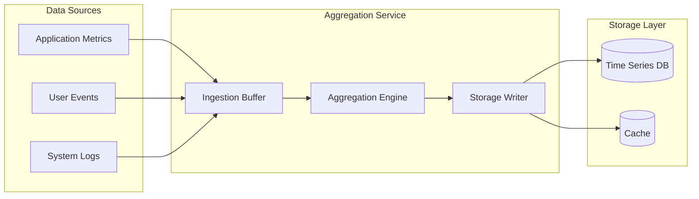

# How to Build a Data Aggregation Service in Python

Author: [nawazdhandala](https://www.github.com/nawazdhandala)

Tags: Python, Data Aggregation, ETL, Async, Redis, Time Series, Analytics, Performance

Description: Learn how to build a data aggregation service in Python that collects metrics from multiple sources, computes rollups, and serves aggregated data efficiently. This guide covers buffering, windowing, and storage patterns.

---

> Data aggregation is the backbone of analytics, monitoring, and reporting systems. Instead of storing every single data point, you compute summaries like counts, averages, and percentiles over time windows. This reduces storage costs and query times dramatically.

Building a data aggregation service requires careful thought about buffering incoming data, computing aggregates efficiently, and storing results for fast retrieval. This guide walks through a complete implementation you can adapt to your needs.

---

## Architecture Overview

A data aggregation service typically has three main components:



---

## Core Data Structures

Let us start with the fundamental building blocks. These classes define what a metric looks like and how we track aggregated values.

```python
# models.py
# Core data structures for the aggregation service
from dataclasses import dataclass, field
from datetime import datetime
from typing import Dict, List, Optional
from enum import Enum
import statistics

class AggregationType(Enum):
    """Types of aggregations we support"""
    COUNT = "count"
    SUM = "sum"
    AVG = "avg"
    MIN = "min"
    MAX = "max"
    P50 = "p50"  # Median
    P95 = "p95"
    P99 = "p99"

@dataclass
class MetricPoint:
    """A single metric data point"""
    name: str  # Metric identifier (e.g., "api.request.duration")
    value: float  # The measured value
    timestamp: datetime  # When the measurement was taken
    tags: Dict[str, str] = field(default_factory=dict)  # Dimensions

    def bucket_key(self, window_seconds: int) -> str:
        """
        Generate a bucket key for time-based aggregation.
        Groups timestamps into fixed windows.
        """
        # Round down to the nearest window boundary
        bucket_ts = int(self.timestamp.timestamp()) // window_seconds * window_seconds
        # Include tags in the key for dimensional aggregation
        tag_str = ",".join(f"{k}={v}" for k, v in sorted(self.tags.items()))
        return f"{self.name}:{bucket_ts}:{tag_str}"

@dataclass
class AggregatedMetric:
    """Result of aggregating multiple metric points"""
    name: str
    window_start: datetime
    window_end: datetime
    tags: Dict[str, str]
    count: int = 0
    sum: float = 0.0
    min: float = float('inf')
    max: float = float('-inf')
    values: List[float] = field(default_factory=list)  # For percentile calc

    def add_value(self, value: float):
        """Add a value to this aggregate"""
        self.count += 1
        self.sum += value
        self.min = min(self.min, value)
        self.max = max(self.max, value)
        self.values.append(value)

    def get_aggregations(self) -> Dict[str, float]:
        """Compute all aggregation types for this bucket"""
        if self.count == 0:
            return {}

        sorted_values = sorted(self.values)

        return {
            "count": self.count,
            "sum": self.sum,
            "avg": self.sum / self.count,
            "min": self.min if self.min != float('inf') else 0,
            "max": self.max if self.max != float('-inf') else 0,
            "p50": self._percentile(sorted_values, 50),
            "p95": self._percentile(sorted_values, 95),
            "p99": self._percentile(sorted_values, 99),
        }

    def _percentile(self, sorted_values: List[float], percentile: int) -> float:
        """Calculate a percentile from sorted values"""
        if not sorted_values:
            return 0.0
        index = int(len(sorted_values) * percentile / 100)
        index = min(index, len(sorted_values) - 1)
        return sorted_values[index]
```

---

## The Aggregation Buffer

The buffer collects incoming metrics and groups them by time window. When a window closes, it flushes the aggregated results.

```python
# buffer.py
# In-memory aggregation buffer with time-based flushing
import asyncio
from datetime import datetime, timedelta
from typing import Dict, Callable, Awaitable
from collections import defaultdict
import threading

class AggregationBuffer:
    """
    Buffers incoming metrics and aggregates them by time window.
    Automatically flushes completed windows to a storage callback.
    """

    def __init__(
        self,
        window_seconds: int = 60,
        flush_callback: Callable[[List[AggregatedMetric]], Awaitable[None]] = None,
        max_buffer_size: int = 100000
    ):
        self.window_seconds = window_seconds
        self.flush_callback = flush_callback
        self.max_buffer_size = max_buffer_size

        # Buckets keyed by bucket_key, containing AggregatedMetric
        self.buckets: Dict[str, AggregatedMetric] = {}

        # Lock for thread-safe access
        self.lock = threading.Lock()

        # Track the current window for flush decisions
        self.current_window_start = self._get_window_start(datetime.utcnow())

    def _get_window_start(self, timestamp: datetime) -> datetime:
        """Get the start of the window containing this timestamp"""
        ts = int(timestamp.timestamp())
        window_ts = ts // self.window_seconds * self.window_seconds
        return datetime.utcfromtimestamp(window_ts)

    def add(self, metric: MetricPoint):
        """
        Add a metric point to the buffer.
        The metric will be aggregated with others in the same time window.
        """
        bucket_key = metric.bucket_key(self.window_seconds)
        window_start = self._get_window_start(metric.timestamp)
        window_end = window_start + timedelta(seconds=self.window_seconds)

        with self.lock:
            # Check buffer size limit
            if len(self.buckets) >= self.max_buffer_size:
                # Drop oldest buckets or raise an error
                oldest_keys = sorted(self.buckets.keys())[:1000]
                for key in oldest_keys:
                    del self.buckets[key]

            # Get or create the bucket
            if bucket_key not in self.buckets:
                self.buckets[bucket_key] = AggregatedMetric(
                    name=metric.name,
                    window_start=window_start,
                    window_end=window_end,
                    tags=metric.tags.copy()
                )

            # Add the value to the bucket
            self.buckets[bucket_key].add_value(metric.value)

    async def flush_completed_windows(self) -> List[AggregatedMetric]:
        """
        Flush all windows that have completed (are in the past).
        Returns the flushed aggregates.
        """
        now = datetime.utcnow()
        current_window = self._get_window_start(now)

        completed = []
        keys_to_remove = []

        with self.lock:
            for key, aggregate in self.buckets.items():
                # Window is complete if its end time is in the past
                if aggregate.window_end <= now:
                    completed.append(aggregate)
                    keys_to_remove.append(key)

            # Remove flushed buckets
            for key in keys_to_remove:
                del self.buckets[key]

        # Call the flush callback if we have completed windows
        if completed and self.flush_callback:
            await self.flush_callback(completed)

        return completed

    def get_stats(self) -> Dict:
        """Get buffer statistics for monitoring"""
        with self.lock:
            return {
                "bucket_count": len(self.buckets),
                "max_buffer_size": self.max_buffer_size,
                "window_seconds": self.window_seconds,
                "current_window": self.current_window_start.isoformat()
            }
```

---

## Storage Backend

The storage layer persists aggregated metrics and supports efficient time-range queries. Here is an implementation using Redis for both storage and caching.

```python
# storage.py
# Redis-based storage for aggregated metrics
import redis.asyncio as redis
import json
from datetime import datetime, timedelta
from typing import List, Dict, Optional

class MetricStorage:
    """
    Stores aggregated metrics in Redis using sorted sets.
    Supports efficient time-range queries and automatic expiration.
    """

    def __init__(
        self,
        redis_url: str = "redis://localhost:6379",
        retention_days: int = 30
    ):
        self.redis_url = redis_url
        self.retention_days = retention_days
        self.client: redis.Redis = None

    async def connect(self):
        """Establish Redis connection"""
        self.client = await redis.from_url(self.redis_url)

    async def close(self):
        """Close Redis connection"""
        if self.client:
            await self.client.close()

    def _metric_key(self, name: str, tags: Dict[str, str]) -> str:
        """Generate a Redis key for a metric series"""
        tag_str = ",".join(f"{k}={v}" for k, v in sorted(tags.items()))
        return f"metrics:{name}:{tag_str}"

    async def store(self, aggregates: List[AggregatedMetric]):
        """
        Store multiple aggregated metrics.
        Uses pipelining for efficiency.
        """
        if not aggregates:
            return

        pipe = self.client.pipeline()
        expiry_seconds = self.retention_days * 24 * 3600

        for agg in aggregates:
            key = self._metric_key(agg.name, agg.tags)
            score = agg.window_start.timestamp()  # Use timestamp as score

            # Serialize the aggregation data
            data = {
                "window_start": agg.window_start.isoformat(),
                "window_end": agg.window_end.isoformat(),
                "aggregations": agg.get_aggregations()
            }

            # Add to sorted set with timestamp as score
            pipe.zadd(key, {json.dumps(data): score})

            # Set expiry on the key
            pipe.expire(key, expiry_seconds)

        await pipe.execute()

    async def query(
        self,
        name: str,
        tags: Dict[str, str],
        start: datetime,
        end: datetime,
        aggregation: str = "avg"
    ) -> List[Dict]:
        """
        Query aggregated metrics for a time range.
        Returns data points with the specified aggregation type.
        """
        key = self._metric_key(name, tags)

        # Query by score (timestamp) range
        results = await self.client.zrangebyscore(
            key,
            min=start.timestamp(),
            max=end.timestamp()
        )

        data_points = []
        for raw in results:
            data = json.loads(raw)
            aggregations = data["aggregations"]

            if aggregation in aggregations:
                data_points.append({
                    "timestamp": data["window_start"],
                    "value": aggregations[aggregation]
                })

        return data_points

    async def query_latest(
        self,
        name: str,
        tags: Dict[str, str],
        count: int = 10
    ) -> List[Dict]:
        """Get the most recent aggregated values"""
        key = self._metric_key(name, tags)

        # Get the last N entries by score
        results = await self.client.zrevrange(key, 0, count - 1)

        data_points = []
        for raw in results:
            data = json.loads(raw)
            data_points.append({
                "timestamp": data["window_start"],
                "aggregations": data["aggregations"]
            })

        # Reverse to get chronological order
        return list(reversed(data_points))

    async def delete_old_data(self, name: str, tags: Dict[str, str]):
        """Remove data older than retention period"""
        key = self._metric_key(name, tags)
        cutoff = datetime.utcnow() - timedelta(days=self.retention_days)

        await self.client.zremrangebyscore(key, "-inf", cutoff.timestamp())
```

---

## The Aggregation Service

Now let us tie everything together into a service that ingests metrics, aggregates them, and provides query endpoints.

```python
# service.py
# Main aggregation service combining buffer, storage, and API
import asyncio
from datetime import datetime, timedelta
from typing import List, Dict, Optional
from fastapi import FastAPI, HTTPException
from contextlib import asynccontextmanager
from pydantic import BaseModel

# Import our components
from models import MetricPoint, AggregatedMetric
from buffer import AggregationBuffer
from storage import MetricStorage

class MetricInput(BaseModel):
    """API input model for submitting metrics"""
    name: str
    value: float
    timestamp: Optional[datetime] = None
    tags: Dict[str, str] = {}

class QueryInput(BaseModel):
    """API input model for querying metrics"""
    name: str
    tags: Dict[str, str] = {}
    start: datetime
    end: datetime
    aggregation: str = "avg"

class AggregationService:
    """
    Main service that orchestrates metric ingestion and aggregation.
    """

    def __init__(
        self,
        window_seconds: int = 60,
        flush_interval_seconds: int = 10,
        redis_url: str = "redis://localhost:6379"
    ):
        self.window_seconds = window_seconds
        self.flush_interval_seconds = flush_interval_seconds

        # Initialize storage
        self.storage = MetricStorage(redis_url=redis_url)

        # Initialize buffer with storage callback
        self.buffer = AggregationBuffer(
            window_seconds=window_seconds,
            flush_callback=self._handle_flush
        )

        # Background task handle
        self.flush_task: asyncio.Task = None

    async def start(self):
        """Start the aggregation service"""
        await self.storage.connect()

        # Start background flush task
        self.flush_task = asyncio.create_task(self._flush_loop())
        print(f"Aggregation service started (window={self.window_seconds}s)")

    async def stop(self):
        """Stop the aggregation service gracefully"""
        if self.flush_task:
            self.flush_task.cancel()
            try:
                await self.flush_task
            except asyncio.CancelledError:
                pass

        # Final flush of any remaining data
        await self.buffer.flush_completed_windows()
        await self.storage.close()
        print("Aggregation service stopped")

    async def _flush_loop(self):
        """Background loop that periodically flushes completed windows"""
        while True:
            try:
                await asyncio.sleep(self.flush_interval_seconds)
                flushed = await self.buffer.flush_completed_windows()
                if flushed:
                    print(f"Flushed {len(flushed)} aggregated windows")
            except asyncio.CancelledError:
                break
            except Exception as e:
                print(f"Flush error: {e}")

    async def _handle_flush(self, aggregates: List[AggregatedMetric]):
        """Callback invoked when windows are flushed from buffer"""
        await self.storage.store(aggregates)

    def ingest(self, metric: MetricPoint):
        """
        Ingest a single metric point.
        This is synchronous for maximum throughput.
        """
        self.buffer.add(metric)

    def ingest_batch(self, metrics: List[MetricPoint]):
        """Ingest multiple metrics at once"""
        for metric in metrics:
            self.buffer.add(metric)

    async def query(
        self,
        name: str,
        tags: Dict[str, str],
        start: datetime,
        end: datetime,
        aggregation: str = "avg"
    ) -> List[Dict]:
        """Query aggregated metrics"""
        return await self.storage.query(name, tags, start, end, aggregation)

    def get_stats(self) -> Dict:
        """Get service statistics"""
        return {
            "buffer": self.buffer.get_stats(),
            "window_seconds": self.window_seconds,
            "flush_interval_seconds": self.flush_interval_seconds
        }

# Create service instance
aggregation_service = AggregationService(
    window_seconds=60,  # 1-minute windows
    flush_interval_seconds=10  # Check every 10 seconds
)

@asynccontextmanager
async def lifespan(app: FastAPI):
    """Manage service lifecycle"""
    await aggregation_service.start()
    yield
    await aggregation_service.stop()

# Create FastAPI app
app = FastAPI(title="Data Aggregation Service", lifespan=lifespan)

@app.post("/metrics")
async def ingest_metric(metric: MetricInput):
    """
    Ingest a single metric data point.
    The metric will be aggregated with others in the same time window.
    """
    point = MetricPoint(
        name=metric.name,
        value=metric.value,
        timestamp=metric.timestamp or datetime.utcnow(),
        tags=metric.tags
    )
    aggregation_service.ingest(point)
    return {"status": "accepted"}

@app.post("/metrics/batch")
async def ingest_batch(metrics: List[MetricInput]):
    """Ingest multiple metrics at once for efficiency"""
    points = [
        MetricPoint(
            name=m.name,
            value=m.value,
            timestamp=m.timestamp or datetime.utcnow(),
            tags=m.tags
        )
        for m in metrics
    ]
    aggregation_service.ingest_batch(points)
    return {"status": "accepted", "count": len(points)}

@app.post("/query")
async def query_metrics(query: QueryInput):
    """
    Query aggregated metrics for a time range.
    Returns time series data with the specified aggregation.
    """
    results = await aggregation_service.query(
        name=query.name,
        tags=query.tags,
        start=query.start,
        end=query.end,
        aggregation=query.aggregation
    )
    return {"data": results}

@app.get("/stats")
async def get_stats():
    """Get service statistics for monitoring"""
    return aggregation_service.get_stats()
```

---

## Multi-Resolution Rollups

For long-term storage, you often want multiple resolutions. For example, keep 1-minute data for a week, 1-hour data for a month, and 1-day data for a year.

```python
# rollups.py
# Multi-resolution data rollups for efficient long-term storage
from datetime import datetime, timedelta
from typing import List, Dict

class RollupManager:
    """
    Manages multiple aggregation resolutions.
    Automatically rolls up fine-grained data into coarser aggregates.
    """

    def __init__(self, storage: MetricStorage):
        self.storage = storage

        # Define rollup tiers: (window_seconds, retention_days)
        self.tiers = [
            (60, 7),      # 1-minute data for 7 days
            (3600, 30),   # 1-hour data for 30 days
            (86400, 365)  # 1-day data for 365 days
        ]

    async def rollup_tier(
        self,
        name: str,
        tags: Dict[str, str],
        source_tier: int,
        target_tier: int
    ):
        """
        Roll up data from a finer tier to a coarser tier.
        Aggregates multiple windows into a single larger window.
        """
        source_window, _ = self.tiers[source_tier]
        target_window, _ = self.tiers[target_tier]

        # Calculate how many source windows fit in a target window
        windows_per_rollup = target_window // source_window

        # Determine the time range to roll up
        # Roll up the most recent completed target window
        now = datetime.utcnow()
        target_end = datetime.utcfromtimestamp(
            int(now.timestamp()) // target_window * target_window
        )
        target_start = target_end - timedelta(seconds=target_window)

        # Query source data for the rollup period
        source_key = f"metrics:{name}:{source_window}s"
        target_key = f"metrics:{name}:{target_window}s"

        source_data = await self.storage.query(
            name=name,
            tags=tags,
            start=target_start,
            end=target_end,
            aggregation="avg"  # Get raw aggregation data
        )

        if not source_data:
            return

        # Compute rolled-up aggregates
        total_count = sum(d.get("count", 1) for d in source_data)
        total_sum = sum(d.get("sum", d["value"]) for d in source_data)
        all_values = []
        for d in source_data:
            if "values" in d:
                all_values.extend(d["values"])
            else:
                all_values.append(d["value"])

        # Create rolled-up aggregate
        rollup = AggregatedMetric(
            name=f"{name}:{target_window}s",
            window_start=target_start,
            window_end=target_end,
            tags=tags,
            count=total_count,
            sum=total_sum,
            min=min(d.get("min", d["value"]) for d in source_data),
            max=max(d.get("max", d["value"]) for d in source_data),
            values=all_values
        )

        # Store the rolled-up data
        await self.storage.store([rollup])
```

---

## Best Practices

### 1. Buffer Size Management

```python
# Prevent memory exhaustion with buffer limits
buffer = AggregationBuffer(
    window_seconds=60,
    max_buffer_size=100000  # Drop oldest if exceeded
)
```

### 2. Use Batch Ingestion

```python
# Batch reduces network overhead significantly
@app.post("/metrics/batch")
async def ingest_batch(metrics: List[MetricInput]):
    # Process all at once instead of one by one
    aggregation_service.ingest_batch(points)
```

### 3. Monitor Buffer Health

```python
# Expose metrics about the aggregation service itself
@app.get("/health")
async def health():
    stats = aggregation_service.get_stats()
    buffer_usage = stats["buffer"]["bucket_count"] / stats["buffer"]["max_buffer_size"]

    if buffer_usage > 0.9:
        return {"status": "degraded", "reason": "buffer nearly full"}
    return {"status": "healthy", "buffer_usage": buffer_usage}
```

---

## Conclusion

Building a data aggregation service involves balancing throughput, latency, and storage efficiency. The key components are a time-windowed buffer for collecting incoming data, an aggregation engine that computes statistics, and a storage layer optimized for time-series queries. Start with a simple single-resolution design and add multi-resolution rollups as your retention requirements grow.

---

*Need to monitor your data aggregation pipelines? [OneUptime](https://oneuptime.com) provides real-time monitoring for data processing services with alerting on buffer depths and processing latency.*

**Related Reading:**
- [How to Build Background Task Processing in FastAPI](https://oneuptime.com/blog/post/2026-01-25-background-task-processing-fastapi/view)
- [How to Reduce DB Load with Request Coalescing in Python](https://oneuptime.com/blog/post/2026-01-23-request-coalescing-python/view)
