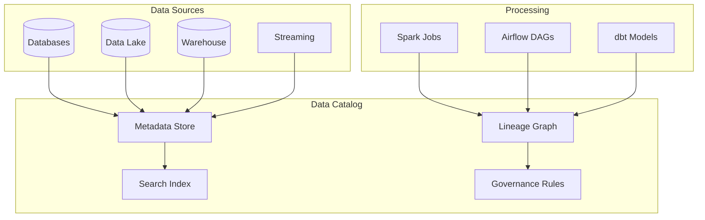

# How to Handle Data Catalog Integration

Author: [nawazdhandala](https://www.github.com/nawazdhandala)

Tags: Data Catalog, Data Governance, Metadata Management, Apache Atlas, AWS Glue, Data Discovery, Data Lineage

Description: Learn how to integrate data catalogs with your data infrastructure for better discoverability, governance, and lineage tracking across your data ecosystem.

---

> A data catalog is essential for data discovery, governance, and compliance. Without proper integration, metadata becomes stale, lineage breaks, and teams waste hours searching for the right data. This guide shows you how to set up robust data catalog integrations.

If your data scientists spend more time finding data than analyzing it, your catalog integration needs work. Let's fix that.

---

## Data Catalog Architecture

A well-integrated data catalog connects all your data sources and processing systems:



---

## Integrating with AWS Glue Data Catalog

### Automatic Crawler Configuration

```python
# Configure AWS Glue crawler for automatic metadata discovery
import boto3

glue_client = boto3.client('glue')

def create_s3_crawler(database_name, s3_path, schedule='cron(0 2 * * ? *)'):
    """Create Glue crawler for S3 data lake"""

    crawler_name = f"{database_name}-crawler"

    # Create database if not exists
    try:
        glue_client.create_database(
            DatabaseInput={
                'Name': database_name,
                'Description': f'Catalog for {database_name} data'
            }
        )
    except glue_client.exceptions.AlreadyExistsException:
        pass

    # Create crawler configuration
    crawler_config = {
        'Name': crawler_name,
        'Role': 'arn:aws:iam::123456789:role/GlueCrawlerRole',
        'DatabaseName': database_name,
        'Targets': {
            'S3Targets': [
                {
                    'Path': s3_path,
                    'Exclusions': [
                        '**/_temporary/**',
                        '**/.spark-staging/**',
                        '**/tmp/**'
                    ]
                }
            ]
        },
        'SchemaChangePolicy': {
            'UpdateBehavior': 'UPDATE_IN_DATABASE',
            'DeleteBehavior': 'LOG'
        },
        'RecrawlPolicy': {
            'RecrawlBehavior': 'CRAWL_EVERYTHING'
        },
        'Schedule': schedule,
        'Configuration': json.dumps({
            'Version': 1.0,
            'Grouping': {
                'TableGroupingPolicy': 'CombineCompatibleSchemas'
            },
            'CrawlerOutput': {
                'Partitions': {
                    'AddOrUpdateBehavior': 'InheritFromTable'
                }
            }
        })
    }

    try:
        glue_client.create_crawler(**crawler_config)
        print(f"Created crawler: {crawler_name}")
    except glue_client.exceptions.AlreadyExistsException:
        glue_client.update_crawler(**crawler_config)
        print(f"Updated crawler: {crawler_name}")

    return crawler_name

# Create crawlers for different data domains
create_s3_crawler('sales_db', 's3://data-lake/sales/')
create_s3_crawler('inventory_db', 's3://data-lake/inventory/')
create_s3_crawler('customers_db', 's3://data-lake/customers/')
```

### Manual Table Registration with Schema

```python
# Register table with explicit schema and metadata
def register_glue_table(database, table_name, s3_location, columns, partition_keys=None):
    """Register table in Glue catalog with full metadata"""

    table_input = {
        'Name': table_name,
        'Description': f'Production table for {table_name}',
        'StorageDescriptor': {
            'Columns': columns,
            'Location': s3_location,
            'InputFormat': 'org.apache.hadoop.hive.ql.io.parquet.MapredParquetInputFormat',
            'OutputFormat': 'org.apache.hadoop.hive.ql.io.parquet.MapredParquetOutputFormat',
            'SerdeInfo': {
                'SerializationLibrary': 'org.apache.hadoop.hive.ql.io.parquet.serde.ParquetHiveSerDe',
                'Parameters': {
                    'serialization.format': '1'
                }
            },
            'Compressed': True
        },
        'PartitionKeys': partition_keys or [],
        'TableType': 'EXTERNAL_TABLE',
        'Parameters': {
            'classification': 'parquet',
            'compressionType': 'snappy',
            'typeOfData': 'file',
            'EXTERNAL': 'TRUE',
            # Custom metadata
            'owner': 'data-engineering',
            'pii_columns': 'email,phone',
            'retention_days': '365'
        }
    }

    try:
        glue_client.create_table(
            DatabaseName=database,
            TableInput=table_input
        )
        print(f"Created table: {database}.{table_name}")
    except glue_client.exceptions.AlreadyExistsException:
        glue_client.update_table(
            DatabaseName=database,
            TableInput=table_input
        )
        print(f"Updated table: {database}.{table_name}")

# Example: Register orders table
register_glue_table(
    database='sales_db',
    table_name='orders',
    s3_location='s3://data-lake/sales/orders/',
    columns=[
        {'Name': 'order_id', 'Type': 'string', 'Comment': 'Unique order identifier'},
        {'Name': 'customer_id', 'Type': 'string', 'Comment': 'Customer reference'},
        {'Name': 'amount', 'Type': 'decimal(10,2)', 'Comment': 'Order total in USD'},
        {'Name': 'status', 'Type': 'string', 'Comment': 'Order status'},
        {'Name': 'created_at', 'Type': 'timestamp', 'Comment': 'Order creation time'}
    ],
    partition_keys=[
        {'Name': 'order_date', 'Type': 'date', 'Comment': 'Partition by order date'}
    ]
)
```

---

## Apache Atlas Integration

### Configure Atlas for Metadata Collection

```python
# Apache Atlas client for metadata management
from apache_atlas.client.base_client import AtlasClient
from apache_atlas.model.instance import AtlasEntity, AtlasEntityWithExtInfo
from apache_atlas.model.enums import EntityOperation
import json

class AtlasCatalogClient:
    def __init__(self, atlas_url, username, password):
        self.client = AtlasClient(atlas_url, (username, password))

    def register_database(self, database_name, description, owner):
        """Register database in Atlas"""

        entity = AtlasEntity({
            'typeName': 'hive_db',
            'attributes': {
                'qualifiedName': f'{database_name}@cluster',
                'name': database_name,
                'description': description,
                'owner': owner,
                'clusterName': 'production',
                'location': f'/data/warehouse/{database_name}'
            }
        })

        response = self.client.entity.create_entity(
            AtlasEntityWithExtInfo(entity=entity)
        )
        return response.guidAssignments

    def register_table(self, database_name, table_name, columns, description):
        """Register table with columns in Atlas"""

        # Create column entities
        column_entities = []
        for col in columns:
            column_entity = AtlasEntity({
                'typeName': 'hive_column',
                'attributes': {
                    'qualifiedName': f'{database_name}.{table_name}.{col["name"]}@cluster',
                    'name': col['name'],
                    'type': col['type'],
                    'comment': col.get('comment', ''),
                    'owner': col.get('owner', 'data-engineering')
                }
            })
            column_entities.append(column_entity)

        # Create table entity with column references
        table_entity = AtlasEntity({
            'typeName': 'hive_table',
            'attributes': {
                'qualifiedName': f'{database_name}.{table_name}@cluster',
                'name': table_name,
                'description': description,
                'owner': 'data-engineering',
                'tableType': 'EXTERNAL_TABLE',
                'db': {
                    'typeName': 'hive_db',
                    'uniqueAttributes': {
                        'qualifiedName': f'{database_name}@cluster'
                    }
                },
                'columns': column_entities
            }
        })

        response = self.client.entity.create_entity(
            AtlasEntityWithExtInfo(entity=table_entity)
        )
        return response

    def add_classification(self, entity_guid, classification_name, attributes=None):
        """Add classification (tag) to entity for governance"""

        classification = {
            'typeName': classification_name,
            'attributes': attributes or {}
        }

        self.client.entity.add_classification(
            entity_guid,
            [classification]
        )

        print(f"Added classification {classification_name} to {entity_guid}")

# Usage
atlas = AtlasCatalogClient(
    'http://atlas.company.com:21000',
    'admin',
    'admin_password'
)

# Register and classify PII data
table_guid = atlas.register_table(
    'customers_db',
    'customer_profiles',
    [
        {'name': 'customer_id', 'type': 'string'},
        {'name': 'email', 'type': 'string', 'comment': 'PII'},
        {'name': 'phone', 'type': 'string', 'comment': 'PII'},
        {'name': 'created_at', 'type': 'timestamp'}
    ],
    'Customer profile information'
)

# Tag as containing PII
atlas.add_classification(table_guid, 'PII')
```

---

## Data Lineage Integration

### Capture Lineage from Spark Jobs

```python
# Capture data lineage from Spark transformations
from pyspark.sql import SparkSession
from openlineage.client import OpenLineageClient
from openlineage.client.run import Run, RunEvent, RunState
from openlineage.client.facet import DataSourceDatasetFacet, SchemaDatasetFacet

class LineageTracker:
    def __init__(self, api_url, namespace):
        self.client = OpenLineageClient(url=api_url)
        self.namespace = namespace

    def create_dataset(self, name, location, schema_fields):
        """Create dataset with schema for lineage"""

        return {
            'namespace': self.namespace,
            'name': name,
            'facets': {
                'dataSource': DataSourceDatasetFacet(
                    name=name,
                    uri=location
                ),
                'schema': SchemaDatasetFacet(
                    fields=schema_fields
                )
            }
        }

    def emit_start_event(self, job_name, run_id, inputs, outputs):
        """Emit job start event with lineage"""

        event = RunEvent(
            eventType=RunState.START,
            eventTime=datetime.utcnow().isoformat() + 'Z',
            run=Run(runId=run_id),
            job={
                'namespace': self.namespace,
                'name': job_name
            },
            inputs=inputs,
            outputs=outputs
        )

        self.client.emit(event)

    def emit_complete_event(self, job_name, run_id, inputs, outputs):
        """Emit job completion event"""

        event = RunEvent(
            eventType=RunState.COMPLETE,
            eventTime=datetime.utcnow().isoformat() + 'Z',
            run=Run(runId=run_id),
            job={
                'namespace': self.namespace,
                'name': job_name
            },
            inputs=inputs,
            outputs=outputs
        )

        self.client.emit(event)

# Usage in Spark job
def run_etl_with_lineage():
    lineage = LineageTracker(
        'http://lineage-api.company.com/api/v1/lineage',
        'production'
    )

    run_id = str(uuid.uuid4())
    job_name = 'customer_aggregation'

    # Define inputs
    inputs = [
        lineage.create_dataset(
            'raw_customers',
            's3://data-lake/raw/customers/',
            [
                {'name': 'customer_id', 'type': 'STRING'},
                {'name': 'name', 'type': 'STRING'},
                {'name': 'email', 'type': 'STRING'}
            ]
        ),
        lineage.create_dataset(
            'raw_orders',
            's3://data-lake/raw/orders/',
            [
                {'name': 'order_id', 'type': 'STRING'},
                {'name': 'customer_id', 'type': 'STRING'},
                {'name': 'amount', 'type': 'DECIMAL'}
            ]
        )
    ]

    # Define outputs
    outputs = [
        lineage.create_dataset(
            'customer_summary',
            's3://data-lake/processed/customer_summary/',
            [
                {'name': 'customer_id', 'type': 'STRING'},
                {'name': 'total_orders', 'type': 'INTEGER'},
                {'name': 'total_amount', 'type': 'DECIMAL'}
            ]
        )
    ]

    # Emit start
    lineage.emit_start_event(job_name, run_id, inputs, outputs)

    try:
        # Run actual transformation
        spark = SparkSession.builder.appName(job_name).getOrCreate()

        customers_df = spark.read.parquet('s3://data-lake/raw/customers/')
        orders_df = spark.read.parquet('s3://data-lake/raw/orders/')

        summary_df = orders_df.groupBy('customer_id') \
            .agg(
                count('order_id').alias('total_orders'),
                sum('amount').alias('total_amount')
            ) \
            .join(customers_df, 'customer_id')

        summary_df.write.mode('overwrite') \
            .parquet('s3://data-lake/processed/customer_summary/')

        # Emit completion
        lineage.emit_complete_event(job_name, run_id, inputs, outputs)

    except Exception as e:
        # Emit failure
        lineage.emit_fail_event(job_name, run_id, str(e))
        raise
```

### dbt Lineage Integration

```yaml
# dbt_project.yml - Configure metadata extraction
name: 'analytics'
version: '1.0.0'

# Enable metadata for catalog integration
target-path: "target"
clean-targets:
  - "target"
  - "dbt_packages"

# Configure artifact generation for lineage
on-run-end:
  - "{{ export_lineage_to_catalog() }}"
```

```python
# dbt macro to export lineage to catalog
# macros/export_lineage.sql

    
        
        

        
            
                -- Register model in catalog
                

                

                {{ send_to_catalog_api(lineage_payload) }}
            
        
    

```

---

## Metadata Sync Between Systems

### Bidirectional Sync Service

```python
# Sync metadata between multiple catalog systems
import schedule
import time
from concurrent.futures import ThreadPoolExecutor

class CatalogSyncService:
    def __init__(self, sources, target):
        self.sources = sources  # List of catalog clients
        self.target = target    # Primary catalog client
        self.executor = ThreadPoolExecutor(max_workers=5)

    def sync_table_metadata(self, source, database, table):
        """Sync table metadata from source to target"""

        # Get metadata from source
        source_metadata = source.get_table(database, table)

        if source_metadata is None:
            return

        # Transform to target format
        target_metadata = self.transform_metadata(source_metadata)

        # Upsert in target catalog
        self.target.upsert_table(database, table, target_metadata)

        print(f"Synced {database}.{table} from {source.name}")

    def sync_all_tables(self):
        """Sync all tables from all sources"""

        futures = []

        for source in self.sources:
            databases = source.list_databases()

            for db in databases:
                tables = source.list_tables(db)

                for table in tables:
                    future = self.executor.submit(
                        self.sync_table_metadata,
                        source, db, table
                    )
                    futures.append(future)

        # Wait for all syncs to complete
        for future in futures:
            try:
                future.result(timeout=60)
            except Exception as e:
                print(f"Sync error: {e}")

    def sync_lineage(self):
        """Sync lineage information"""

        for source in self.sources:
            lineage_data = source.get_lineage_graph()

            for edge in lineage_data['edges']:
                self.target.add_lineage_edge(
                    source_table=edge['source'],
                    target_table=edge['target'],
                    job_name=edge.get('job_name'),
                    timestamp=edge.get('timestamp')
                )

    def run_scheduled_sync(self):
        """Run sync on schedule"""

        # Full sync every hour
        schedule.every().hour.do(self.sync_all_tables)

        # Lineage sync every 15 minutes
        schedule.every(15).minutes.do(self.sync_lineage)

        while True:
            schedule.run_pending()
            time.sleep(60)

# Configure sync between Glue, Atlas, and internal catalog
sync_service = CatalogSyncService(
    sources=[
        GlueCatalogClient('us-east-1'),
        AtlasCatalogClient('http://atlas:21000', 'admin', 'password')
    ],
    target=InternalCatalogClient('http://catalog-api:8080')
)

sync_service.run_scheduled_sync()
```

---

## Search and Discovery API

### Build Search Index for Catalog

```python
# Elasticsearch-based catalog search
from elasticsearch import Elasticsearch
from datetime import datetime

class CatalogSearchService:
    def __init__(self, es_hosts):
        self.es = Elasticsearch(es_hosts)
        self.index_name = 'data_catalog'
        self._create_index()

    def _create_index(self):
        """Create search index with proper mapping"""

        mapping = {
            'mappings': {
                'properties': {
                    'name': {'type': 'text', 'analyzer': 'standard'},
                    'database': {'type': 'keyword'},
                    'description': {'type': 'text', 'analyzer': 'standard'},
                    'columns': {
                        'type': 'nested',
                        'properties': {
                            'name': {'type': 'text'},
                            'type': {'type': 'keyword'},
                            'description': {'type': 'text'}
                        }
                    },
                    'tags': {'type': 'keyword'},
                    'owner': {'type': 'keyword'},
                    'created_at': {'type': 'date'},
                    'updated_at': {'type': 'date'},
                    'popularity_score': {'type': 'float'},
                    'quality_score': {'type': 'float'}
                }
            }
        }

        if not self.es.indices.exists(index=self.index_name):
            self.es.indices.create(index=self.index_name, body=mapping)

    def index_table(self, table_metadata):
        """Index table metadata for search"""

        doc = {
            'name': table_metadata['name'],
            'database': table_metadata['database'],
            'description': table_metadata.get('description', ''),
            'columns': table_metadata.get('columns', []),
            'tags': table_metadata.get('tags', []),
            'owner': table_metadata.get('owner', 'unknown'),
            'created_at': table_metadata.get('created_at'),
            'updated_at': datetime.utcnow(),
            'popularity_score': self._calculate_popularity(table_metadata),
            'quality_score': self._calculate_quality(table_metadata)
        }

        doc_id = f"{table_metadata['database']}.{table_metadata['name']}"
        self.es.index(index=self.index_name, id=doc_id, body=doc)

    def search(self, query, filters=None, limit=20):
        """Search catalog with filters"""

        search_body = {
            'query': {
                'bool': {
                    'must': [
                        {
                            'multi_match': {
                                'query': query,
                                'fields': ['name^3', 'description^2', 'columns.name', 'tags'],
                                'fuzziness': 'AUTO'
                            }
                        }
                    ],
                    'filter': []
                }
            },
            'sort': [
                {'_score': 'desc'},
                {'popularity_score': 'desc'}
            ],
            'size': limit
        }

        # Add filters
        if filters:
            if 'database' in filters:
                search_body['query']['bool']['filter'].append(
                    {'term': {'database': filters['database']}}
                )
            if 'tags' in filters:
                search_body['query']['bool']['filter'].append(
                    {'terms': {'tags': filters['tags']}}
                )
            if 'owner' in filters:
                search_body['query']['bool']['filter'].append(
                    {'term': {'owner': filters['owner']}}
                )

        results = self.es.search(index=self.index_name, body=search_body)

        return [hit['_source'] for hit in results['hits']['hits']]

    def _calculate_popularity(self, table_metadata):
        """Calculate popularity based on query frequency"""
        # Placeholder - integrate with query logs
        return 0.5

    def _calculate_quality(self, table_metadata):
        """Calculate quality score based on metadata completeness"""
        score = 0.0

        if table_metadata.get('description'):
            score += 0.3
        if table_metadata.get('columns'):
            score += 0.3
            # Bonus for column descriptions
            columns_with_desc = sum(
                1 for c in table_metadata['columns']
                if c.get('description')
            )
            score += 0.2 * (columns_with_desc / len(table_metadata['columns']))
        if table_metadata.get('owner'):
            score += 0.1
        if table_metadata.get('tags'):
            score += 0.1

        return score

# Usage
search = CatalogSearchService(['http://elasticsearch:9200'])

# Search for customer data
results = search.search(
    'customer email',
    filters={'database': 'customers_db', 'tags': ['production']}
)

for result in results:
    print(f"{result['database']}.{result['name']}: {result['description']}")
```

---

## Best Practices

1. **Automate metadata collection** - Use crawlers and hooks, not manual entry
2. **Enrich with business context** - Add descriptions, owners, and tags
3. **Track lineage automatically** - Integrate with processing frameworks
4. **Keep metadata fresh** - Schedule regular sync jobs
5. **Enable self-service** - Build search and discovery interfaces
6. **Enforce governance** - Use classifications for PII and sensitive data
7. **Monitor catalog health** - Track completeness and freshness metrics

---

## Conclusion

Data catalog integration requires connecting multiple systems and keeping metadata synchronized. Key components include:

- Automatic metadata extraction from data sources
- Lineage tracking from processing jobs
- Governance classifications for compliance
- Search and discovery interfaces for users

With proper integration, your data catalog becomes the single source of truth for understanding your data landscape.

---

*Need to monitor your data infrastructure? [OneUptime](https://oneuptime.com) provides comprehensive observability for data catalogs, ETL pipelines, and data quality with real-time alerting on metadata drift and lineage breaks.*
