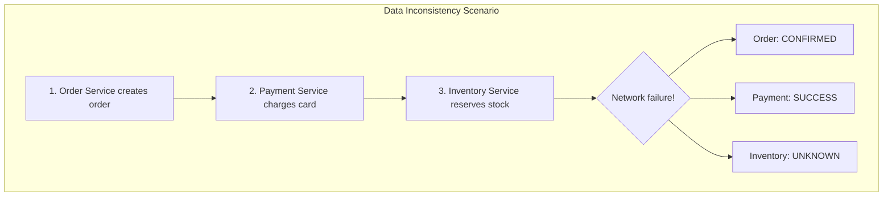
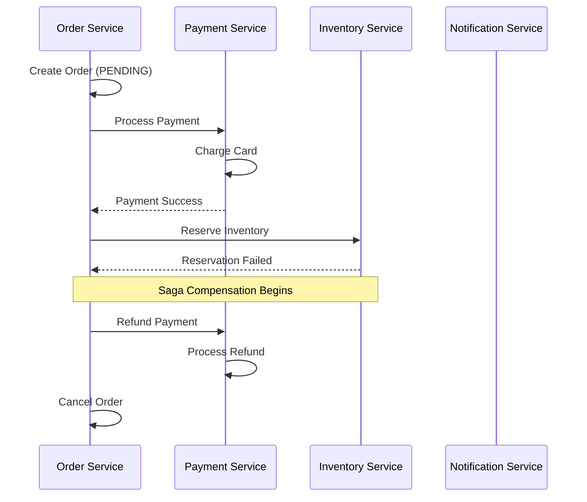
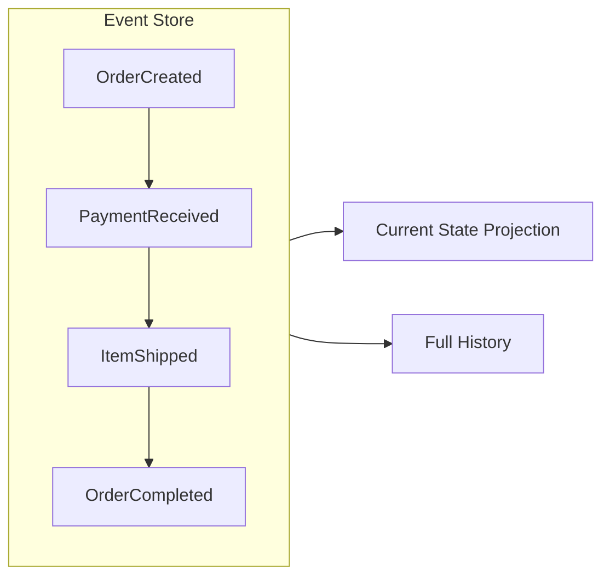
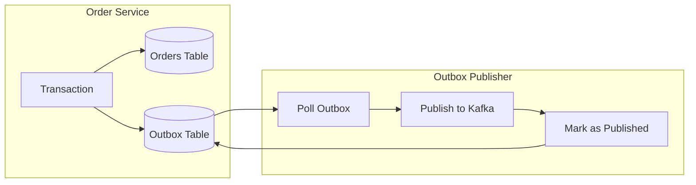
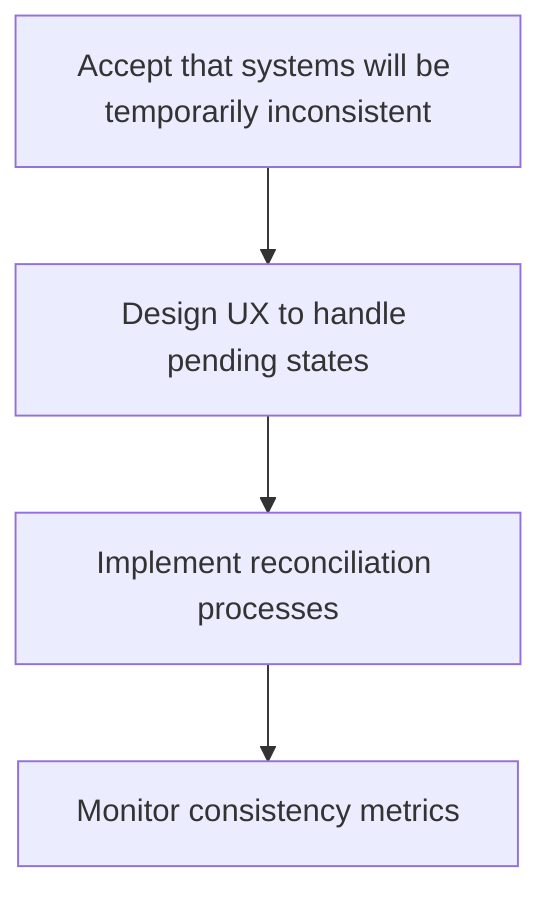

# How to Fix "Data Inconsistency" Across Services

Author: [nawazdhandala](https://www.github.com/nawazdhandala)

Tags: Microservices, Data Consistency, Saga Pattern, Event Sourcing, Distributed Transactions, CQRS, Eventual Consistency

Description: A practical guide to identifying and fixing data inconsistency issues in microservices architectures using patterns like Saga, Event Sourcing, and CQRS.

---

> In a monolithic application, database transactions guarantee consistency. In microservices, each service owns its data, and maintaining consistency across service boundaries becomes one of the hardest distributed systems problems. This guide shows you how to identify, prevent, and fix data inconsistency issues.

Data inconsistency occurs when related data across multiple services gets out of sync. An order shows as "paid" but the payment service shows "pending." A user was deleted but their orders still exist. These issues erode trust and cause downstream failures.

---

## Understanding the Problem



### Common Causes of Data Inconsistency

1. **Partial failures in distributed transactions**
2. **Out-of-order message processing**
3. **Missing or duplicate events**
4. **Race conditions between services**
5. **Failed compensating transactions**

---

## Pattern 1: The Saga Pattern

Sagas manage distributed transactions by breaking them into a sequence of local transactions, each with a compensating action for rollback.



### Orchestration-Based Saga

```python
# saga/orchestrator.py
from enum import Enum
from dataclasses import dataclass
from typing import List, Optional, Callable
import asyncio
import logging

logger = logging.getLogger(__name__)

class SagaStepStatus(Enum):
    PENDING = "pending"
    COMPLETED = "completed"
    FAILED = "failed"
    COMPENSATED = "compensated"

@dataclass
class SagaStep:
    name: str
    execute: Callable
    compensate: Callable
    status: SagaStepStatus = SagaStepStatus.PENDING
    result: Optional[dict] = None
    error: Optional[str] = None

class SagaOrchestrator:
    """
    Orchestrates a distributed transaction using the Saga pattern.
    Executes steps in order and compensates on failure.
    """

    def __init__(self, saga_id: str, steps: List[SagaStep]):
        self.saga_id = saga_id
        self.steps = steps
        self.completed_steps: List[SagaStep] = []
        self.context = {}

    async def execute(self) -> dict:
        """Execute the saga, compensating on any failure."""
        logger.info(f"Starting saga {self.saga_id}")

        try:
            for step in self.steps:
                logger.info(f"Executing step: {step.name}")

                try:
                    # Execute the step with current context
                    result = await step.execute(self.context)

                    step.status = SagaStepStatus.COMPLETED
                    step.result = result

                    # Update context with step result
                    self.context.update(result or {})
                    self.completed_steps.append(step)

                    logger.info(f"Step {step.name} completed successfully")

                except Exception as e:
                    logger.error(f"Step {step.name} failed: {e}")
                    step.status = SagaStepStatus.FAILED
                    step.error = str(e)

                    # Trigger compensation
                    await self._compensate()

                    return {
                        "saga_id": self.saga_id,
                        "status": "failed",
                        "failed_step": step.name,
                        "error": str(e)
                    }

            return {
                "saga_id": self.saga_id,
                "status": "completed",
                "result": self.context
            }

        except Exception as e:
            logger.error(f"Saga {self.saga_id} failed unexpectedly: {e}")
            await self._compensate()
            raise

    async def _compensate(self):
        """Execute compensation for all completed steps in reverse order."""
        logger.info(f"Starting compensation for saga {self.saga_id}")

        for step in reversed(self.completed_steps):
            try:
                logger.info(f"Compensating step: {step.name}")
                await step.compensate(self.context)
                step.status = SagaStepStatus.COMPENSATED
                logger.info(f"Step {step.name} compensated successfully")

            except Exception as e:
                # Compensation failure is critical - log and alert
                logger.critical(
                    f"Compensation failed for step {step.name}: {e}. "
                    f"Manual intervention required for saga {self.saga_id}"
                )
                # Store for manual resolution
                await self._store_failed_compensation(step, e)

    async def _store_failed_compensation(self, step: SagaStep, error: Exception):
        """Store failed compensation for manual resolution."""
        # In production, store to database and alert operations team
        pass


# Order Saga Implementation
class OrderSaga:
    """
    Saga for creating an order with payment and inventory reservation.
    """

    def __init__(
        self,
        order_service,
        payment_service,
        inventory_service,
        notification_service
    ):
        self.order_service = order_service
        self.payment_service = payment_service
        self.inventory_service = inventory_service
        self.notification_service = notification_service

    async def create_order(self, order_data: dict) -> dict:
        """Execute the create order saga."""
        saga_id = f"order-{order_data['order_id']}"

        steps = [
            SagaStep(
                name="create_order",
                execute=lambda ctx: self._create_order(order_data),
                compensate=lambda ctx: self._cancel_order(ctx.get("order_id"))
            ),
            SagaStep(
                name="process_payment",
                execute=lambda ctx: self._process_payment(ctx),
                compensate=lambda ctx: self._refund_payment(ctx.get("payment_id"))
            ),
            SagaStep(
                name="reserve_inventory",
                execute=lambda ctx: self._reserve_inventory(ctx),
                compensate=lambda ctx: self._release_inventory(ctx.get("reservation_id"))
            ),
            SagaStep(
                name="send_confirmation",
                execute=lambda ctx: self._send_confirmation(ctx),
                compensate=lambda ctx: self._send_cancellation(ctx)
            )
        ]

        orchestrator = SagaOrchestrator(saga_id, steps)
        return await orchestrator.execute()

    async def _create_order(self, order_data: dict) -> dict:
        """Create the order in pending state."""
        order = await self.order_service.create(
            order_id=order_data["order_id"],
            user_id=order_data["user_id"],
            items=order_data["items"],
            status="PENDING"
        )
        return {"order_id": order.id, "total": order.total}

    async def _cancel_order(self, order_id: str):
        """Cancel the order."""
        await self.order_service.update_status(order_id, "CANCELLED")

    async def _process_payment(self, ctx: dict) -> dict:
        """Process payment for the order."""
        payment = await self.payment_service.charge(
            order_id=ctx["order_id"],
            amount=ctx["total"],
            idempotency_key=f"order-{ctx['order_id']}"
        )
        return {"payment_id": payment.id}

    async def _refund_payment(self, payment_id: str):
        """Refund the payment."""
        await self.payment_service.refund(payment_id)

    async def _reserve_inventory(self, ctx: dict) -> dict:
        """Reserve inventory for order items."""
        reservation = await self.inventory_service.reserve(
            order_id=ctx["order_id"],
            items=ctx.get("items", [])
        )
        return {"reservation_id": reservation.id}

    async def _release_inventory(self, reservation_id: str):
        """Release inventory reservation."""
        await self.inventory_service.release(reservation_id)

    async def _send_confirmation(self, ctx: dict) -> dict:
        """Send order confirmation."""
        await self.notification_service.send_order_confirmation(
            order_id=ctx["order_id"]
        )
        return {}

    async def _send_cancellation(self, ctx: dict):
        """Send cancellation notification."""
        await self.notification_service.send_order_cancelled(
            order_id=ctx["order_id"]
        )
```

### Choreography-Based Saga

```python
# saga/choreography.py
from dataclasses import dataclass
from typing import Any
import json

@dataclass
class DomainEvent:
    event_type: str
    aggregate_id: str
    payload: dict
    timestamp: str
    saga_id: str

class OrderService:
    """
    Order service using choreography-based saga.
    Reacts to events from other services.
    """

    def __init__(self, event_bus, order_repository):
        self.event_bus = event_bus
        self.repository = order_repository

        # Subscribe to relevant events
        self.event_bus.subscribe("PaymentCompleted", self._on_payment_completed)
        self.event_bus.subscribe("PaymentFailed", self._on_payment_failed)
        self.event_bus.subscribe("InventoryReserved", self._on_inventory_reserved)
        self.event_bus.subscribe("InventoryReservationFailed", self._on_inventory_failed)

    async def create_order(self, order_data: dict) -> dict:
        """Create order and publish event to start saga."""
        order = await self.repository.create(
            order_id=order_data["order_id"],
            user_id=order_data["user_id"],
            items=order_data["items"],
            status="PENDING"
        )

        # Publish event to trigger payment processing
        await self.event_bus.publish(DomainEvent(
            event_type="OrderCreated",
            aggregate_id=order.id,
            payload={
                "order_id": order.id,
                "user_id": order.user_id,
                "total": order.total,
                "items": order.items
            },
            timestamp=datetime.utcnow().isoformat(),
            saga_id=f"order-{order.id}"
        ))

        return {"order_id": order.id, "status": "PENDING"}

    async def _on_payment_completed(self, event: DomainEvent):
        """Handle successful payment."""
        order_id = event.payload["order_id"]
        payment_id = event.payload["payment_id"]

        order = await self.repository.get(order_id)
        order.payment_id = payment_id
        order.status = "PAYMENT_COMPLETED"
        await self.repository.save(order)

        # Continue saga - request inventory reservation
        await self.event_bus.publish(DomainEvent(
            event_type="PaymentCompletedForOrder",
            aggregate_id=order_id,
            payload={
                "order_id": order_id,
                "items": order.items
            },
            timestamp=datetime.utcnow().isoformat(),
            saga_id=event.saga_id
        ))

    async def _on_payment_failed(self, event: DomainEvent):
        """Handle payment failure."""
        order_id = event.payload["order_id"]

        order = await self.repository.get(order_id)
        order.status = "PAYMENT_FAILED"
        order.failure_reason = event.payload.get("reason", "Unknown")
        await self.repository.save(order)

    async def _on_inventory_reserved(self, event: DomainEvent):
        """Handle successful inventory reservation."""
        order_id = event.payload["order_id"]

        order = await self.repository.get(order_id)
        order.reservation_id = event.payload["reservation_id"]
        order.status = "CONFIRMED"
        await self.repository.save(order)

        # Saga complete - send confirmation
        await self.event_bus.publish(DomainEvent(
            event_type="OrderConfirmed",
            aggregate_id=order_id,
            payload={"order_id": order_id, "user_id": order.user_id},
            timestamp=datetime.utcnow().isoformat(),
            saga_id=event.saga_id
        ))

    async def _on_inventory_failed(self, event: DomainEvent):
        """Handle inventory reservation failure - trigger compensation."""
        order_id = event.payload["order_id"]

        order = await self.repository.get(order_id)

        # Request payment refund
        await self.event_bus.publish(DomainEvent(
            event_type="RefundRequested",
            aggregate_id=order.payment_id,
            payload={
                "payment_id": order.payment_id,
                "order_id": order_id,
                "reason": "Inventory unavailable"
            },
            timestamp=datetime.utcnow().isoformat(),
            saga_id=event.saga_id
        ))

        order.status = "CANCELLED"
        order.failure_reason = "Inventory unavailable"
        await self.repository.save(order)
```

---

## Pattern 2: Event Sourcing

Event sourcing stores all changes as events, making it possible to rebuild state and detect inconsistencies.



```python
# eventsourcing/event_store.py
from dataclasses import dataclass, field
from typing import List, Optional, Type
from datetime import datetime
import json
import uuid

@dataclass
class Event:
    """Base class for all domain events."""
    event_id: str = field(default_factory=lambda: str(uuid.uuid4()))
    aggregate_id: str = ""
    aggregate_type: str = ""
    event_type: str = ""
    version: int = 0
    timestamp: datetime = field(default_factory=datetime.utcnow)
    data: dict = field(default_factory=dict)
    metadata: dict = field(default_factory=dict)

class EventStore:
    """
    Event store for event sourcing pattern.
    Stores all events and allows replaying to rebuild state.
    """

    def __init__(self, db_connection):
        self.db = db_connection

    async def append(self, events: List[Event], expected_version: int = None):
        """
        Append events to the store with optimistic concurrency control.
        """
        if not events:
            return

        aggregate_id = events[0].aggregate_id

        # Check for concurrent modifications
        if expected_version is not None:
            current_version = await self._get_current_version(aggregate_id)
            if current_version != expected_version:
                raise ConcurrencyError(
                    f"Expected version {expected_version}, "
                    f"but current version is {current_version}"
                )

        # Append events
        async with self.db.transaction():
            for event in events:
                await self.db.execute(
                    """
                    INSERT INTO events
                    (event_id, aggregate_id, aggregate_type, event_type,
                     version, timestamp, data, metadata)
                    VALUES ($1, $2, $3, $4, $5, $6, $7, $8)
                    """,
                    event.event_id,
                    event.aggregate_id,
                    event.aggregate_type,
                    event.event_type,
                    event.version,
                    event.timestamp,
                    json.dumps(event.data),
                    json.dumps(event.metadata)
                )

    async def get_events(
        self,
        aggregate_id: str,
        from_version: int = 0
    ) -> List[Event]:
        """Get all events for an aggregate from a specific version."""
        rows = await self.db.fetch(
            """
            SELECT * FROM events
            WHERE aggregate_id = $1 AND version >= $2
            ORDER BY version ASC
            """,
            aggregate_id,
            from_version
        )

        return [self._row_to_event(row) for row in rows]

    async def get_all_events(
        self,
        from_position: int = 0,
        batch_size: int = 1000
    ) -> List[Event]:
        """Get all events across all aggregates for projections."""
        rows = await self.db.fetch(
            """
            SELECT * FROM events
            WHERE id > $1
            ORDER BY id ASC
            LIMIT $2
            """,
            from_position,
            batch_size
        )

        return [self._row_to_event(row) for row in rows]

    async def _get_current_version(self, aggregate_id: str) -> int:
        """Get the current version of an aggregate."""
        result = await self.db.fetchval(
            "SELECT MAX(version) FROM events WHERE aggregate_id = $1",
            aggregate_id
        )
        return result or 0

    def _row_to_event(self, row) -> Event:
        """Convert database row to Event object."""
        return Event(
            event_id=row["event_id"],
            aggregate_id=row["aggregate_id"],
            aggregate_type=row["aggregate_type"],
            event_type=row["event_type"],
            version=row["version"],
            timestamp=row["timestamp"],
            data=json.loads(row["data"]),
            metadata=json.loads(row["metadata"])
        )


class EventSourcedAggregate:
    """Base class for event-sourced aggregates."""

    def __init__(self, aggregate_id: str):
        self.id = aggregate_id
        self.version = 0
        self._pending_events: List[Event] = []

    def apply_event(self, event: Event):
        """Apply an event to update aggregate state."""
        handler = getattr(self, f"_apply_{event.event_type}", None)
        if handler:
            handler(event)
        self.version = event.version

    def raise_event(self, event_type: str, data: dict):
        """Raise a new event."""
        event = Event(
            aggregate_id=self.id,
            aggregate_type=self.__class__.__name__,
            event_type=event_type,
            version=self.version + len(self._pending_events) + 1,
            data=data
        )
        self._pending_events.append(event)
        self.apply_event(event)

    def get_pending_events(self) -> List[Event]:
        """Get events that haven't been persisted yet."""
        return self._pending_events.copy()

    def clear_pending_events(self):
        """Clear pending events after persistence."""
        self._pending_events.clear()


class Order(EventSourcedAggregate):
    """Event-sourced Order aggregate."""

    def __init__(self, order_id: str):
        super().__init__(order_id)
        self.status = None
        self.user_id = None
        self.items = []
        self.total = 0
        self.payment_id = None

    @classmethod
    def create(cls, order_id: str, user_id: str, items: list) -> "Order":
        """Create a new order."""
        order = cls(order_id)
        total = sum(item["price"] * item["quantity"] for item in items)

        order.raise_event("OrderCreated", {
            "user_id": user_id,
            "items": items,
            "total": total
        })

        return order

    def add_payment(self, payment_id: str):
        """Record payment for the order."""
        if self.status != "PENDING":
            raise InvalidOperationError(
                f"Cannot add payment to order in {self.status} status"
            )

        self.raise_event("PaymentAdded", {"payment_id": payment_id})

    def confirm(self):
        """Confirm the order."""
        if self.status != "PAID":
            raise InvalidOperationError(
                f"Cannot confirm order in {self.status} status"
            )

        self.raise_event("OrderConfirmed", {})

    def cancel(self, reason: str):
        """Cancel the order."""
        if self.status in ["SHIPPED", "DELIVERED"]:
            raise InvalidOperationError(
                f"Cannot cancel order in {self.status} status"
            )

        self.raise_event("OrderCancelled", {"reason": reason})

    # Event handlers
    def _apply_OrderCreated(self, event: Event):
        self.user_id = event.data["user_id"]
        self.items = event.data["items"]
        self.total = event.data["total"]
        self.status = "PENDING"

    def _apply_PaymentAdded(self, event: Event):
        self.payment_id = event.data["payment_id"]
        self.status = "PAID"

    def _apply_OrderConfirmed(self, event: Event):
        self.status = "CONFIRMED"

    def _apply_OrderCancelled(self, event: Event):
        self.status = "CANCELLED"


class OrderRepository:
    """Repository for Order aggregates using event sourcing."""

    def __init__(self, event_store: EventStore):
        self.event_store = event_store

    async def save(self, order: Order):
        """Save order by appending new events."""
        pending_events = order.get_pending_events()
        if pending_events:
            expected_version = order.version - len(pending_events)
            await self.event_store.append(pending_events, expected_version)
            order.clear_pending_events()

    async def get(self, order_id: str) -> Optional[Order]:
        """Load order by replaying its events."""
        events = await self.event_store.get_events(order_id)

        if not events:
            return None

        order = Order(order_id)
        for event in events:
            order.apply_event(event)

        return order
```

---

## Pattern 3: Outbox Pattern for Reliable Events

The Outbox pattern ensures events are published reliably by storing them in the same transaction as the data change.



```python
# outbox/outbox_pattern.py
from dataclasses import dataclass
from datetime import datetime
from typing import List
import json
import asyncio

@dataclass
class OutboxMessage:
    id: str
    aggregate_type: str
    aggregate_id: str
    event_type: str
    payload: dict
    created_at: datetime
    published_at: datetime = None

class OutboxRepository:
    """Repository for managing outbox messages."""

    def __init__(self, db_connection):
        self.db = db_connection

    async def save(self, message: OutboxMessage, connection=None):
        """Save an outbox message (within the same transaction)."""
        conn = connection or self.db
        await conn.execute(
            """
            INSERT INTO outbox
            (id, aggregate_type, aggregate_id, event_type, payload, created_at)
            VALUES ($1, $2, $3, $4, $5, $6)
            """,
            message.id,
            message.aggregate_type,
            message.aggregate_id,
            message.event_type,
            json.dumps(message.payload),
            message.created_at
        )

    async def get_unpublished(self, batch_size: int = 100) -> List[OutboxMessage]:
        """Get unpublished messages."""
        rows = await self.db.fetch(
            """
            SELECT * FROM outbox
            WHERE published_at IS NULL
            ORDER BY created_at ASC
            LIMIT $1
            FOR UPDATE SKIP LOCKED
            """,
            batch_size
        )

        return [self._row_to_message(row) for row in rows]

    async def mark_published(self, message_ids: List[str]):
        """Mark messages as published."""
        await self.db.execute(
            """
            UPDATE outbox
            SET published_at = NOW()
            WHERE id = ANY($1)
            """,
            message_ids
        )

    def _row_to_message(self, row) -> OutboxMessage:
        return OutboxMessage(
            id=row["id"],
            aggregate_type=row["aggregate_type"],
            aggregate_id=row["aggregate_id"],
            event_type=row["event_type"],
            payload=json.loads(row["payload"]),
            created_at=row["created_at"],
            published_at=row["published_at"]
        )


class OrderServiceWithOutbox:
    """Order service using the outbox pattern for reliable events."""

    def __init__(self, db, outbox_repo: OutboxRepository):
        self.db = db
        self.outbox = outbox_repo

    async def create_order(self, order_data: dict) -> dict:
        """
        Create order and outbox message in the same transaction.
        This ensures the event is reliably published.
        """
        async with self.db.transaction() as tx:
            # Create the order
            order_id = str(uuid.uuid4())
            await tx.execute(
                """
                INSERT INTO orders (id, user_id, items, total, status, created_at)
                VALUES ($1, $2, $3, $4, $5, NOW())
                """,
                order_id,
                order_data["user_id"],
                json.dumps(order_data["items"]),
                order_data["total"],
                "PENDING"
            )

            # Create outbox message in the same transaction
            outbox_message = OutboxMessage(
                id=str(uuid.uuid4()),
                aggregate_type="Order",
                aggregate_id=order_id,
                event_type="OrderCreated",
                payload={
                    "order_id": order_id,
                    "user_id": order_data["user_id"],
                    "items": order_data["items"],
                    "total": order_data["total"]
                },
                created_at=datetime.utcnow()
            )

            await self.outbox.save(outbox_message, connection=tx)

        return {"order_id": order_id, "status": "PENDING"}


class OutboxPublisher:
    """
    Background process that publishes outbox messages to message broker.
    """

    def __init__(self, outbox_repo: OutboxRepository, message_broker):
        self.outbox = outbox_repo
        self.broker = message_broker
        self.running = False

    async def start(self):
        """Start the outbox publisher."""
        self.running = True
        while self.running:
            try:
                await self._publish_batch()
                await asyncio.sleep(1)  # Poll interval
            except Exception as e:
                print(f"Error publishing outbox messages: {e}")
                await asyncio.sleep(5)  # Back off on error

    async def stop(self):
        """Stop the outbox publisher."""
        self.running = False

    async def _publish_batch(self):
        """Publish a batch of outbox messages."""
        messages = await self.outbox.get_unpublished(batch_size=100)

        if not messages:
            return

        published_ids = []

        for message in messages:
            try:
                await self.broker.publish(
                    topic=f"{message.aggregate_type}.{message.event_type}",
                    key=message.aggregate_id,
                    value=json.dumps({
                        "event_id": message.id,
                        "event_type": message.event_type,
                        "aggregate_id": message.aggregate_id,
                        "payload": message.payload,
                        "timestamp": message.created_at.isoformat()
                    })
                )
                published_ids.append(message.id)

            except Exception as e:
                print(f"Failed to publish message {message.id}: {e}")
                # Continue with other messages

        if published_ids:
            await self.outbox.mark_published(published_ids)
            print(f"Published {len(published_ids)} messages")
```

---

## Pattern 4: Idempotent Consumers

Ensure message handlers can be safely retried without causing duplicate effects.

```python
# idempotency/idempotent_handler.py
from functools import wraps
from typing import Callable
import hashlib

class IdempotencyStore:
    """Store for tracking processed message IDs."""

    def __init__(self, redis_client):
        self.redis = redis_client
        self.ttl = 86400 * 7  # 7 days

    async def is_processed(self, message_id: str) -> bool:
        """Check if a message has already been processed."""
        key = f"idempotency:{message_id}"
        return await self.redis.exists(key)

    async def mark_processed(self, message_id: str, result: str = "ok"):
        """Mark a message as processed."""
        key = f"idempotency:{message_id}"
        await self.redis.setex(key, self.ttl, result)

    async def get_result(self, message_id: str) -> str:
        """Get the result of a previously processed message."""
        key = f"idempotency:{message_id}"
        return await self.redis.get(key)


def idempotent(store: IdempotencyStore):
    """
    Decorator to make a message handler idempotent.
    """
    def decorator(handler: Callable):
        @wraps(handler)
        async def wrapper(message: dict, *args, **kwargs):
            message_id = message.get("event_id") or message.get("message_id")

            if not message_id:
                # Generate ID from message content
                content = json.dumps(message, sort_keys=True)
                message_id = hashlib.sha256(content.encode()).hexdigest()

            # Check if already processed
            if await store.is_processed(message_id):
                print(f"Message {message_id} already processed, skipping")
                return await store.get_result(message_id)

            try:
                result = await handler(message, *args, **kwargs)
                await store.mark_processed(message_id, json.dumps(result))
                return result

            except Exception as e:
                # Don't mark as processed on failure - allow retry
                raise

        return wrapper
    return decorator


# Usage
idempotency_store = IdempotencyStore(redis_client)

@idempotent(idempotency_store)
async def handle_payment_completed(message: dict):
    """Handle payment completed event idempotently."""
    order_id = message["payload"]["order_id"]
    payment_id = message["payload"]["payment_id"]

    # This is safe to retry - only executes once per message
    order = await order_repository.get(order_id)
    order.add_payment(payment_id)
    await order_repository.save(order)

    return {"status": "processed", "order_id": order_id}
```

---

## Detecting and Fixing Inconsistencies

### Consistency Checker

```python
# consistency/checker.py
from dataclasses import dataclass
from typing import List, Dict
import asyncio

@dataclass
class InconsistencyReport:
    entity_type: str
    entity_id: str
    issue: str
    service_states: Dict[str, dict]
    detected_at: str

class ConsistencyChecker:
    """
    Periodic checker that detects data inconsistencies across services.
    """

    def __init__(self, services: Dict[str, any]):
        self.services = services
        self.inconsistencies: List[InconsistencyReport] = []

    async def check_order_consistency(self, order_id: str) -> List[InconsistencyReport]:
        """Check consistency of an order across all services."""
        reports = []

        # Fetch state from all services concurrently
        order_state, payment_state, inventory_state = await asyncio.gather(
            self.services["order"].get_order(order_id),
            self.services["payment"].get_payment_for_order(order_id),
            self.services["inventory"].get_reservation_for_order(order_id),
            return_exceptions=True
        )

        # Check order-payment consistency
        if isinstance(order_state, dict) and isinstance(payment_state, dict):
            if order_state.get("status") == "CONFIRMED" and payment_state.get("status") != "COMPLETED":
                reports.append(InconsistencyReport(
                    entity_type="Order",
                    entity_id=order_id,
                    issue="Order confirmed but payment not completed",
                    service_states={
                        "order": order_state,
                        "payment": payment_state
                    },
                    detected_at=datetime.utcnow().isoformat()
                ))

        # Check order-inventory consistency
        if isinstance(order_state, dict) and isinstance(inventory_state, dict):
            if order_state.get("status") == "CONFIRMED" and inventory_state.get("status") != "RESERVED":
                reports.append(InconsistencyReport(
                    entity_type="Order",
                    entity_id=order_id,
                    issue="Order confirmed but inventory not reserved",
                    service_states={
                        "order": order_state,
                        "inventory": inventory_state
                    },
                    detected_at=datetime.utcnow().isoformat()
                ))

        return reports

    async def run_full_check(self, batch_size: int = 1000) -> List[InconsistencyReport]:
        """Run consistency check on all recent orders."""
        reports = []

        # Get recent order IDs
        order_ids = await self.services["order"].get_recent_order_ids(
            hours=24,
            limit=batch_size
        )

        for order_id in order_ids:
            try:
                order_reports = await self.check_order_consistency(order_id)
                reports.extend(order_reports)
            except Exception as e:
                print(f"Error checking order {order_id}: {e}")

        return reports


class ConsistencyReconciler:
    """
    Reconciles detected inconsistencies by triggering corrective actions.
    """

    def __init__(self, services: Dict[str, any], event_bus):
        self.services = services
        self.event_bus = event_bus

    async def reconcile(self, report: InconsistencyReport):
        """Attempt to reconcile an inconsistency."""
        if report.issue == "Order confirmed but payment not completed":
            await self._reconcile_payment(report)
        elif report.issue == "Order confirmed but inventory not reserved":
            await self._reconcile_inventory(report)
        else:
            # Unknown issue - alert for manual resolution
            await self._alert_operations(report)

    async def _reconcile_payment(self, report: InconsistencyReport):
        """Reconcile payment inconsistency."""
        order_state = report.service_states["order"]
        payment_state = report.service_states["payment"]

        if payment_state.get("status") == "PENDING":
            # Payment might be stuck - retry
            await self.event_bus.publish({
                "event_type": "PaymentRetryRequested",
                "payload": {
                    "order_id": report.entity_id,
                    "amount": order_state.get("total")
                }
            })
        elif payment_state.get("status") == "FAILED":
            # Payment failed - cancel order
            await self.services["order"].update_status(
                report.entity_id,
                "PAYMENT_FAILED"
            )

    async def _reconcile_inventory(self, report: InconsistencyReport):
        """Reconcile inventory inconsistency."""
        # Retry inventory reservation
        await self.event_bus.publish({
            "event_type": "InventoryReservationRetryRequested",
            "payload": {
                "order_id": report.entity_id,
                "items": report.service_states["order"].get("items", [])
            }
        })

    async def _alert_operations(self, report: InconsistencyReport):
        """Alert operations team for manual resolution."""
        await self.services["alerting"].send_alert({
            "severity": "high",
            "title": f"Data inconsistency detected: {report.issue}",
            "entity": f"{report.entity_type}:{report.entity_id}",
            "details": report.service_states
        })
```

---

## Best Practices

### 1. Design for Eventual Consistency



### 2. Use Idempotency Keys Everywhere

```python
# Every write operation should accept an idempotency key
async def process_payment(order_id: str, amount: float, idempotency_key: str):
    existing = await get_payment_by_idempotency_key(idempotency_key)
    if existing:
        return existing  # Return cached result
    # Process new payment
```

### 3. Implement Dead Letter Queues

```python
# Handle failed messages gracefully
async def handle_message(message: dict):
    try:
        await process_message(message)
    except RetryableError:
        await message_queue.retry(message, delay=60)
    except PermanentError:
        await dead_letter_queue.send(message)
        await alert_operations(message)
```

---

## Conclusion

Data consistency in microservices requires explicit design patterns:

- **Sagas** manage distributed transactions with compensation
- **Event Sourcing** provides full audit trail and state reconstruction
- **Outbox Pattern** ensures reliable event publishing
- **Idempotent Consumers** handle message retries safely

Choose patterns based on your consistency requirements. Most systems benefit from eventual consistency with proper reconciliation.

---

*Need to detect data inconsistencies across your microservices? [OneUptime](https://oneuptime.com) provides distributed tracing and custom metrics to monitor data flow and detect anomalies before they impact users.*

**Related Reading:**
- [How to Handle Configuration Management in Microservices](https://oneuptime.com/blog/post/2026-01-24-configuration-management-microservices/view)
- [How to Implement Distributed Tracing in Python Microservices](https://oneuptime.com/blog/post/2025-01-06-python-distributed-tracing-microservices/view)
