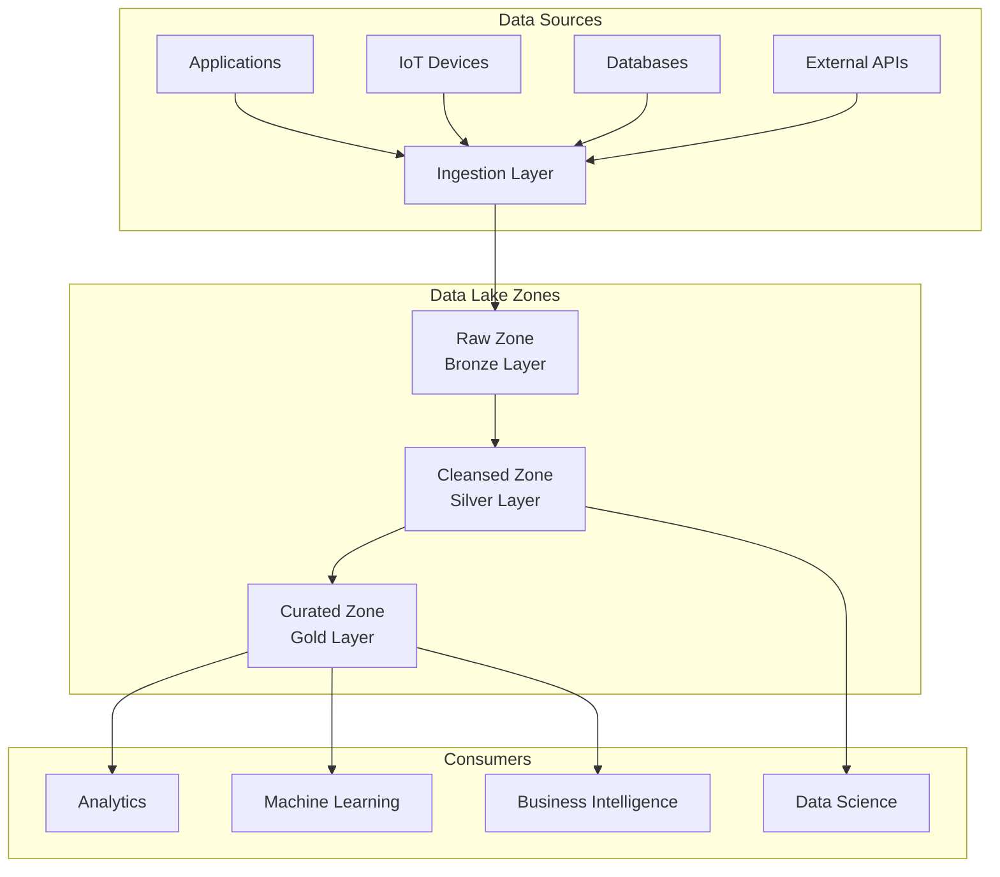
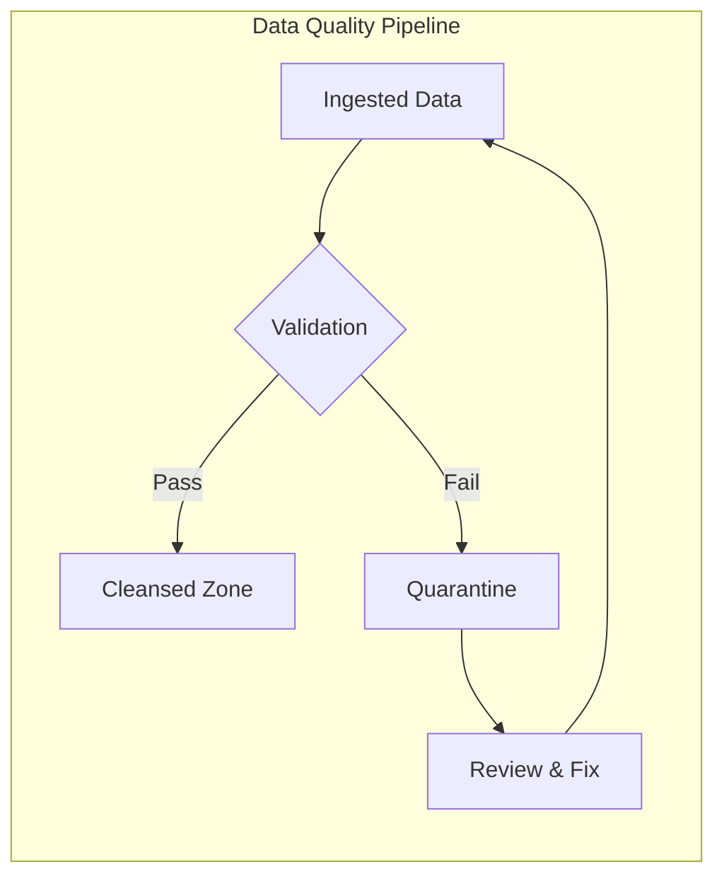

# How to Configure Data Lake Architecture

Author: [nawazdhandala](https://www.github.com/nawazdhandala)

Tags: Data Lake, Big Data, Cloud Storage, Data Architecture, AWS S3, Azure Data Lake, Data Engineering

Description: Learn how to configure a modern data lake architecture with best practices for data organization, storage optimization, and processing pipelines.

---

> Data lakes have become the foundation of modern analytics platforms, allowing organizations to store massive amounts of raw data in its native format. However, without proper configuration, a data lake quickly becomes a data swamp.

A well-architected data lake provides flexibility, scalability, and cost-effectiveness for storing and analyzing diverse data types. This guide walks you through configuring a production-ready data lake architecture from scratch.

---

## Understanding Data Lake Architecture

A data lake stores raw data in its native format until it is needed for analysis. Unlike data warehouses that require upfront schema design, data lakes follow a schema-on-read approach. This flexibility comes with the responsibility of proper organization.



---

## Setting Up the Storage Layer

The storage layer forms the foundation of your data lake. Most organizations use cloud object storage like AWS S3, Azure Data Lake Storage, or Google Cloud Storage.

### AWS S3 Configuration

```python
# infrastructure/s3_data_lake.py
# Configure S3 buckets for data lake zones using boto3

import boto3
import json

def create_data_lake_buckets(environment: str, region: str):
    """
    Create S3 buckets for each data lake zone with proper configurations.
    Each zone has specific lifecycle policies and access controls.
    """
    s3_client = boto3.client('s3', region_name=region)

    # Define bucket configurations for each zone
    zones = {
        'raw': {
            'suffix': 'raw-zone',
            'lifecycle_days': 365,  # Keep raw data for 1 year
            'storage_class': 'INTELLIGENT_TIERING'
        },
        'cleansed': {
            'suffix': 'cleansed-zone',
            'lifecycle_days': 180,
            'storage_class': 'STANDARD'
        },
        'curated': {
            'suffix': 'curated-zone',
            'lifecycle_days': 90,
            'storage_class': 'STANDARD'
        }
    }

    bucket_names = {}

    for zone, config in zones.items():
        bucket_name = f"datalake-{environment}-{config['suffix']}"

        # Create the bucket
        if region == 'us-east-1':
            s3_client.create_bucket(Bucket=bucket_name)
        else:
            s3_client.create_bucket(
                Bucket=bucket_name,
                CreateBucketConfiguration={'LocationConstraint': region}
            )

        # Enable versioning for data protection
        s3_client.put_bucket_versioning(
            Bucket=bucket_name,
            VersioningConfiguration={'Status': 'Enabled'}
        )

        # Configure server-side encryption
        s3_client.put_bucket_encryption(
            Bucket=bucket_name,
            ServerSideEncryptionConfiguration={
                'Rules': [{
                    'ApplyServerSideEncryptionByDefault': {
                        'SSEAlgorithm': 'aws:kms',
                        'KMSMasterKeyID': 'alias/datalake-key'
                    },
                    'BucketKeyEnabled': True
                }]
            }
        )

        bucket_names[zone] = bucket_name
        print(f"Created bucket: {bucket_name}")

    return bucket_names


def configure_lifecycle_policies(bucket_name: str, transition_days: int):
    """
    Configure lifecycle policies to optimize storage costs.
    Data automatically transitions to cheaper storage tiers over time.
    """
    s3_client = boto3.client('s3')

    lifecycle_policy = {
        'Rules': [
            {
                'ID': 'TransitionToIntelligentTiering',
                'Status': 'Enabled',
                'Filter': {'Prefix': ''},
                'Transitions': [
                    {
                        'Days': transition_days,
                        'StorageClass': 'INTELLIGENT_TIERING'
                    }
                ]
            },
            {
                'ID': 'DeleteOldVersions',
                'Status': 'Enabled',
                'Filter': {'Prefix': ''},
                'NoncurrentVersionExpiration': {
                    'NoncurrentDays': 90
                }
            },
            {
                'ID': 'AbortIncompleteMultipartUploads',
                'Status': 'Enabled',
                'Filter': {'Prefix': ''},
                'AbortIncompleteMultipartUpload': {
                    'DaysAfterInitiation': 7
                }
            }
        ]
    }

    s3_client.put_bucket_lifecycle_configuration(
        Bucket=bucket_name,
        LifecycleConfiguration=lifecycle_policy
    )
```

---

## Data Organization Strategy

Proper data organization is critical for query performance and data governance. Use a consistent folder structure across all zones.

### Folder Structure

```
s3://datalake-prod-raw-zone/
├── source=salesforce/
│   └── entity=contacts/
│       └── year=2026/
│           └── month=01/
│               └── day=24/
│                   └── contacts_20260124_001.parquet
├── source=postgres/
│   └── database=orders/
│       └── table=transactions/
│           └── year=2026/
│               └── month=01/
│                   └── day=24/
│                       └── transactions_20260124.parquet
└── source=kinesis/
    └── stream=clickstream/
        └── year=2026/
            └── month=01/
                └── day=24/
                    └── hour=14/
                        └── clickstream_20260124_14.parquet
```

### Partition Strategy Implementation

```python
# ingestion/partitioner.py
# Implement consistent partitioning for data lake ingestion

from datetime import datetime
from typing import Optional
import pyarrow as pa
import pyarrow.parquet as pq

class DataLakePartitioner:
    """
    Handles consistent partitioning of data across data lake zones.
    Uses Hive-style partitioning for compatibility with Spark, Athena, and Presto.
    """

    def __init__(self, base_path: str, source: str, entity: str):
        self.base_path = base_path
        self.source = source
        self.entity = entity

    def get_partition_path(
        self,
        timestamp: datetime,
        include_hour: bool = False
    ) -> str:
        """
        Generate partition path based on timestamp.
        Uses Hive-style key=value partitioning.
        """
        parts = [
            self.base_path,
            f"source={self.source}",
            f"entity={self.entity}",
            f"year={timestamp.year}",
            f"month={timestamp.month:02d}",
            f"day={timestamp.day:02d}"
        ]

        if include_hour:
            parts.append(f"hour={timestamp.hour:02d}")

        return "/".join(parts)

    def write_partitioned_data(
        self,
        table: pa.Table,
        timestamp: datetime,
        compression: str = 'snappy'
    ) -> str:
        """
        Write data to the appropriate partition with optimized settings.
        Returns the path where data was written.
        """
        partition_path = self.get_partition_path(timestamp)

        # Generate unique filename with timestamp
        filename = f"{self.entity}_{timestamp.strftime('%Y%m%d_%H%M%S')}.parquet"
        full_path = f"{partition_path}/{filename}"

        # Write with optimized parquet settings
        pq.write_table(
            table,
            full_path,
            compression=compression,
            # Row group size affects query performance
            row_group_size=100000,
            # Use dictionary encoding for low-cardinality columns
            use_dictionary=True,
            # Write statistics for predicate pushdown
            write_statistics=True
        )

        return full_path


def create_partition_columns(df, timestamp_column: str):
    """
    Add partition columns to a DataFrame for Hive-style partitioning.
    """
    import pandas as pd

    df['year'] = df[timestamp_column].dt.year
    df['month'] = df[timestamp_column].dt.month.apply(lambda x: f"{x:02d}")
    df['day'] = df[timestamp_column].dt.day.apply(lambda x: f"{x:02d}")

    return df
```

---

## Configuring the Metadata Layer

A metadata catalog is essential for data discovery and governance. AWS Glue Data Catalog or Apache Hive Metastore are common choices.

```python
# catalog/glue_catalog.py
# Configure AWS Glue Data Catalog for data lake metadata management

import boto3

def create_database(database_name: str, description: str, location: str):
    """
    Create a Glue database to organize tables.
    """
    glue_client = boto3.client('glue')

    glue_client.create_database(
        DatabaseInput={
            'Name': database_name,
            'Description': description,
            'LocationUri': location,
            'Parameters': {
                'classification': 'datalake',
                'owner': 'data-engineering'
            }
        }
    )


def create_table_with_partitions(
    database_name: str,
    table_name: str,
    s3_location: str,
    columns: list,
    partition_keys: list
):
    """
    Create a Glue table with partition support for efficient querying.
    """
    glue_client = boto3.client('glue')

    # Define column schema
    column_definitions = [
        {'Name': col['name'], 'Type': col['type'], 'Comment': col.get('comment', '')}
        for col in columns
    ]

    # Define partition keys
    partition_definitions = [
        {'Name': key, 'Type': 'string'}
        for key in partition_keys
    ]

    glue_client.create_table(
        DatabaseName=database_name,
        TableInput={
            'Name': table_name,
            'StorageDescriptor': {
                'Columns': column_definitions,
                'Location': s3_location,
                'InputFormat': 'org.apache.hadoop.hive.ql.io.parquet.MapredParquetInputFormat',
                'OutputFormat': 'org.apache.hadoop.hive.ql.io.parquet.MapredParquetOutputFormat',
                'SerdeInfo': {
                    'SerializationLibrary': 'org.apache.hadoop.hive.ql.io.parquet.serde.ParquetHiveSerDe',
                    'Parameters': {'serialization.format': '1'}
                },
                'Compressed': True
            },
            'PartitionKeys': partition_definitions,
            'TableType': 'EXTERNAL_TABLE',
            'Parameters': {
                'classification': 'parquet',
                'compressionType': 'snappy',
                'typeOfData': 'file'
            }
        }
    )


def configure_crawler(
    crawler_name: str,
    database_name: str,
    s3_targets: list,
    schedule: str = 'cron(0 */6 * * ? *)'
):
    """
    Configure a Glue crawler to automatically discover schema changes.
    Runs every 6 hours by default.
    """
    glue_client = boto3.client('glue')

    glue_client.create_crawler(
        Name=crawler_name,
        Role='arn:aws:iam::123456789012:role/GlueCrawlerRole',
        DatabaseName=database_name,
        Targets={
            'S3Targets': [{'Path': path} for path in s3_targets]
        },
        Schedule=schedule,
        SchemaChangePolicy={
            'UpdateBehavior': 'UPDATE_IN_DATABASE',
            'DeleteBehavior': 'LOG'
        },
        RecrawlPolicy={
            'RecrawlBehavior': 'CRAWL_NEW_FOLDERS_ONLY'
        },
        Configuration=json.dumps({
            'Version': 1.0,
            'Grouping': {
                'TableGroupingPolicy': 'CombineCompatibleSchemas'
            }
        })
    )
```

---

## Data Quality and Governance

Implementing data quality checks ensures your data lake maintains trustworthy data.



```python
# quality/data_quality.py
# Implement data quality checks using Great Expectations

from great_expectations.core import ExpectationSuite, ExpectationConfiguration
from great_expectations.dataset import PandasDataset
import pandas as pd

def create_quality_suite(suite_name: str) -> ExpectationSuite:
    """
    Create a reusable expectation suite for data validation.
    """
    suite = ExpectationSuite(expectation_suite_name=suite_name)

    # Add common expectations
    expectations = [
        # Ensure no null values in key columns
        ExpectationConfiguration(
            expectation_type="expect_column_values_to_not_be_null",
            kwargs={"column": "id"}
        ),
        # Validate timestamp format
        ExpectationConfiguration(
            expectation_type="expect_column_values_to_match_regex",
            kwargs={
                "column": "created_at",
                "regex": r"^\d{4}-\d{2}-\d{2}T\d{2}:\d{2}:\d{2}"
            }
        ),
        # Check for valid email format
        ExpectationConfiguration(
            expectation_type="expect_column_values_to_match_regex",
            kwargs={
                "column": "email",
                "regex": r"^[a-zA-Z0-9._%+-]+@[a-zA-Z0-9.-]+\.[a-zA-Z]{2,}$",
                "mostly": 0.95  # Allow 5% invalid
            }
        ),
        # Ensure referential integrity
        ExpectationConfiguration(
            expectation_type="expect_column_values_to_be_in_set",
            kwargs={
                "column": "status",
                "value_set": ["active", "inactive", "pending", "deleted"]
            }
        )
    ]

    for exp in expectations:
        suite.add_expectation(exp)

    return suite


def validate_dataframe(df: pd.DataFrame, suite: ExpectationSuite) -> dict:
    """
    Validate a DataFrame against an expectation suite.
    Returns validation results with details on failures.
    """
    dataset = PandasDataset(df)
    results = dataset.validate(expectation_suite=suite)

    return {
        'success': results.success,
        'statistics': results.statistics,
        'failed_expectations': [
            {
                'expectation': r.expectation_config.expectation_type,
                'column': r.expectation_config.kwargs.get('column'),
                'observed_value': r.result.get('observed_value')
            }
            for r in results.results if not r.success
        ]
    }
```

---

## Access Control Configuration

Secure your data lake with proper access controls using IAM policies and Lake Formation.

```json
{
    "Version": "2012-10-17",
    "Statement": [
        {
            "Sid": "DataAnalystAccess",
            "Effect": "Allow",
            "Action": [
                "s3:GetObject",
                "s3:ListBucket"
            ],
            "Resource": [
                "arn:aws:s3:::datalake-prod-curated-zone",
                "arn:aws:s3:::datalake-prod-curated-zone/*"
            ],
            "Condition": {
                "StringEquals": {
                    "s3:ExistingObjectTag/classification": "public"
                }
            }
        },
        {
            "Sid": "DataEngineerAccess",
            "Effect": "Allow",
            "Action": [
                "s3:GetObject",
                "s3:PutObject",
                "s3:ListBucket"
            ],
            "Resource": [
                "arn:aws:s3:::datalake-prod-*",
                "arn:aws:s3:::datalake-prod-*/*"
            ]
        }
    ]
}
```

---

## Best Practices

1. **Use consistent naming conventions** - Establish naming standards for buckets, folders, and files early
2. **Implement data lineage** - Track where data comes from and how it transforms
3. **Optimize file sizes** - Target 128MB to 1GB files for optimal query performance
4. **Enable compression** - Use Snappy for hot data, ZSTD for cold storage
5. **Partition wisely** - Avoid over-partitioning which creates too many small files
6. **Automate schema evolution** - Use tools like Delta Lake or Apache Iceberg for schema management
7. **Monitor storage costs** - Set up cost alerts and use intelligent tiering

---

*Looking for unified observability across your data lake infrastructure? [OneUptime](https://oneuptime.com) provides comprehensive monitoring for data pipelines, storage systems, and processing jobs.*

**Related Reading:**
- [How to Handle Apache Beam Pipelines](https://oneuptime.com/blog/post/2026-01-24-apache-beam-pipelines/view)
- [How to Configure Snowflake Data Warehouse](https://oneuptime.com/blog/post/2026-01-24-snowflake-data-warehouse/view)
