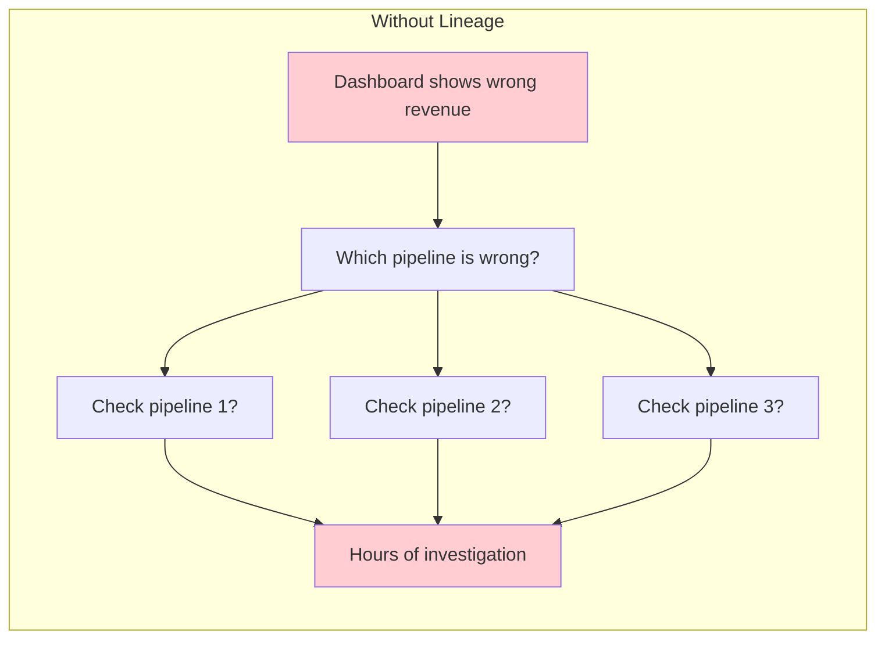
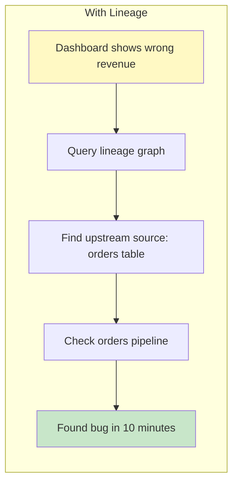
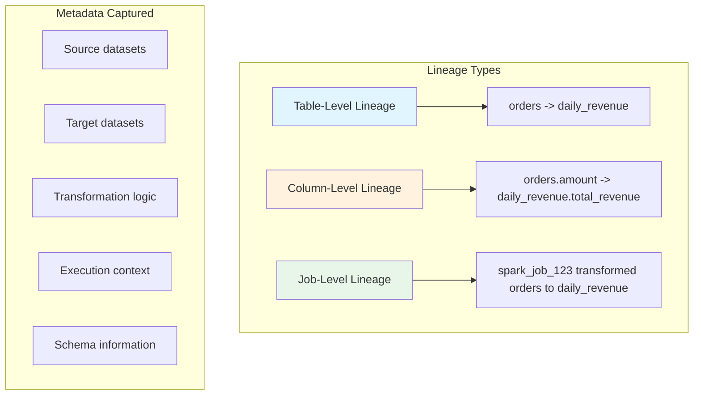

# How to Handle Data Lineage Tracking

Author: [nawazdhandala](https://www.github.com/nawazdhandala)

Tags: Data Lineage, Data Engineering, Data Governance, Metadata, ETL, Data Quality, OpenLineage, Data Catalog

Description: Learn how to implement data lineage tracking in your data pipelines using OpenLineage, custom solutions, and best practices for understanding data flow and impact analysis.

---

> Data lineage answers the question "where did this data come from and where does it go?" When a dashboard shows wrong numbers, lineage tells you which upstream pipeline to investigate. When you need to deprecate a table, lineage tells you what will break.

Data lineage tracking has become essential as data ecosystems grow more complex. This guide covers practical approaches to implementing lineage, from simple metadata tracking to full integration with lineage platforms like OpenLineage.

---

## Why Data Lineage Matters

Without lineage, debugging data issues becomes a guessing game:





---

## Understanding Lineage Components

Data lineage tracks three types of relationships:



---

## Implementing OpenLineage Integration

OpenLineage is the open standard for lineage metadata. Here's how to integrate it with your pipelines.

### Setting Up OpenLineage with Airflow

```python
# airflow_openlineage.py
# Configure Airflow to emit OpenLineage events

# In airflow.cfg or environment variables:
# OPENLINEAGE_URL=http://marquez:5000
# OPENLINEAGE_API_KEY=your-api-key

from airflow import DAG
from airflow.providers.openlineage.extractors import ExtractorManager
from airflow.operators.python import PythonOperator
from datetime import datetime

# Airflow 2.7+ has built-in OpenLineage support
# Just configure the URL and extractors will emit events automatically

with DAG(
    dag_id='lineage_tracked_pipeline',
    start_date=datetime(2026, 1, 1),
    schedule_interval='@daily',
    # Enable OpenLineage (default when URL is configured)
    tags=['lineage-enabled'],
) as dag:

    def extract_orders(**context):
        """OpenLineage will capture this task's inputs and outputs"""
        # When using supported operators (Postgres, BigQuery, Spark)
        # lineage is captured automatically
        pass

    def transform_data(**context):
        """For custom Python, we need to emit lineage manually"""
        from openlineage.client import OpenLineageClient
        from openlineage.client.run import (
            RunEvent, RunState, Run, Job, Dataset,
            InputDataset, OutputDataset
        )
        from openlineage.client.uuid import generate_new_uuid
        import os

        # Create OpenLineage client
        client = OpenLineageClient(
            url=os.getenv('OPENLINEAGE_URL', 'http://marquez:5000')
        )

        # Define the job
        job = Job(
            namespace='data-platform',
            name='transform_orders'
        )

        # Create a run
        run = Run(runId=str(generate_new_uuid()))

        # Define input datasets
        inputs = [
            InputDataset(
                namespace='postgres',
                name='public.orders',
                facets={}
            )
        ]

        # Define output datasets
        outputs = [
            OutputDataset(
                namespace='warehouse',
                name='analytics.daily_revenue',
                facets={}
            )
        ]

        # Emit START event
        client.emit(
            RunEvent(
                eventType=RunState.START,
                eventTime=datetime.utcnow().isoformat() + 'Z',
                run=run,
                job=job,
                inputs=inputs,
                outputs=outputs,
            )
        )

        try:
            # Your actual transformation logic here
            result = do_transformation()

            # Emit COMPLETE event on success
            client.emit(
                RunEvent(
                    eventType=RunState.COMPLETE,
                    eventTime=datetime.utcnow().isoformat() + 'Z',
                    run=run,
                    job=job,
                    inputs=inputs,
                    outputs=outputs,
                )
            )

            return result

        except Exception as e:
            # Emit FAIL event on error
            client.emit(
                RunEvent(
                    eventType=RunState.FAIL,
                    eventTime=datetime.utcnow().isoformat() + 'Z',
                    run=run,
                    job=job,
                    inputs=inputs,
                    outputs=outputs,
                )
            )
            raise

    extract = PythonOperator(
        task_id='extract_orders',
        python_callable=extract_orders,
    )

    transform = PythonOperator(
        task_id='transform_data',
        python_callable=transform_data,
    )

    extract >> transform
```

### Adding Column-Level Lineage

```python
# column_lineage.py
# Track column-level transformations for detailed lineage

from openlineage.client.facet import (
    ColumnLineageDatasetFacet,
    ColumnLineageDatasetFacetFieldsAdditional,
    InputField,
    SchemaDatasetFacet,
    SchemaField,
)
from openlineage.client.run import OutputDataset

def create_output_with_column_lineage():
    """Create an output dataset with column-level lineage information"""

    # Define schema of the output table
    schema_facet = SchemaDatasetFacet(
        fields=[
            SchemaField(name='date', type='DATE', description='Aggregation date'),
            SchemaField(name='total_revenue', type='DECIMAL', description='Sum of order amounts'),
            SchemaField(name='order_count', type='INTEGER', description='Number of orders'),
            SchemaField(name='avg_order_value', type='DECIMAL', description='Average order amount'),
        ]
    )

    # Define column-level lineage
    # This shows exactly which input columns feed each output column
    column_lineage_facet = ColumnLineageDatasetFacet(
        fields={
            'date': ColumnLineageDatasetFacetFieldsAdditional(
                inputFields=[
                    InputField(
                        namespace='postgres',
                        name='public.orders',
                        field='order_date'
                    )
                ],
                transformationType='IDENTITY',
                transformationDescription='Direct mapping from order_date'
            ),
            'total_revenue': ColumnLineageDatasetFacetFieldsAdditional(
                inputFields=[
                    InputField(
                        namespace='postgres',
                        name='public.orders',
                        field='amount'
                    )
                ],
                transformationType='AGGREGATION',
                transformationDescription='SUM(amount) grouped by date'
            ),
            'order_count': ColumnLineageDatasetFacetFieldsAdditional(
                inputFields=[
                    InputField(
                        namespace='postgres',
                        name='public.orders',
                        field='order_id'
                    )
                ],
                transformationType='AGGREGATION',
                transformationDescription='COUNT(order_id) grouped by date'
            ),
            'avg_order_value': ColumnLineageDatasetFacetFieldsAdditional(
                inputFields=[
                    InputField(
                        namespace='postgres',
                        name='public.orders',
                        field='amount'
                    )
                ],
                transformationType='AGGREGATION',
                transformationDescription='AVG(amount) grouped by date'
            ),
        }
    )

    return OutputDataset(
        namespace='warehouse',
        name='analytics.daily_revenue',
        facets={
            'schema': schema_facet,
            'columnLineage': column_lineage_facet,
        }
    )
```

---

## Building a Custom Lineage Tracker

If you need a lightweight solution without a full lineage platform:

```python
# custom_lineage_tracker.py
# Simple lineage tracking with metadata storage

import json
import hashlib
from datetime import datetime
from typing import List, Dict, Optional
from dataclasses import dataclass, asdict
import psycopg2

@dataclass
class DatasetReference:
    """Reference to a dataset (table, file, etc.)"""
    namespace: str  # e.g., 'postgres', 's3', 'bigquery'
    name: str       # e.g., 'public.orders', 's3://bucket/path'

    @property
    def qualified_name(self) -> str:
        return f"{self.namespace}:{self.name}"

@dataclass
class LineageEvent:
    """A lineage event representing a data transformation"""
    job_name: str
    job_namespace: str
    run_id: str
    inputs: List[DatasetReference]
    outputs: List[DatasetReference]
    started_at: datetime
    ended_at: Optional[datetime] = None
    status: str = 'RUNNING'  # RUNNING, COMPLETE, FAILED
    metadata: Optional[Dict] = None

class LineageTracker:
    """Simple lineage tracker that stores events in PostgreSQL"""

    def __init__(self, connection_string: str):
        self.conn = psycopg2.connect(connection_string)
        self._ensure_tables()

    def _ensure_tables(self):
        """Create lineage tables if they don't exist"""
        with self.conn.cursor() as cur:
            cur.execute("""
                CREATE TABLE IF NOT EXISTS lineage_events (
                    id SERIAL PRIMARY KEY,
                    run_id VARCHAR(255) UNIQUE NOT NULL,
                    job_namespace VARCHAR(255) NOT NULL,
                    job_name VARCHAR(255) NOT NULL,
                    status VARCHAR(50) NOT NULL,
                    started_at TIMESTAMP NOT NULL,
                    ended_at TIMESTAMP,
                    metadata JSONB,
                    created_at TIMESTAMP DEFAULT NOW()
                );

                CREATE TABLE IF NOT EXISTS lineage_datasets (
                    id SERIAL PRIMARY KEY,
                    run_id VARCHAR(255) NOT NULL REFERENCES lineage_events(run_id),
                    direction VARCHAR(10) NOT NULL,  -- 'INPUT' or 'OUTPUT'
                    namespace VARCHAR(255) NOT NULL,
                    name VARCHAR(500) NOT NULL,
                    created_at TIMESTAMP DEFAULT NOW()
                );

                CREATE INDEX IF NOT EXISTS idx_lineage_job
                    ON lineage_events(job_namespace, job_name);
                CREATE INDEX IF NOT EXISTS idx_lineage_datasets_name
                    ON lineage_datasets(namespace, name);
            """)
            self.conn.commit()

    def start_run(self, event: LineageEvent):
        """Record the start of a pipeline run"""
        with self.conn.cursor() as cur:
            # Insert the event
            cur.execute("""
                INSERT INTO lineage_events
                (run_id, job_namespace, job_name, status, started_at, metadata)
                VALUES (%s, %s, %s, %s, %s, %s)
            """, (
                event.run_id,
                event.job_namespace,
                event.job_name,
                event.status,
                event.started_at,
                json.dumps(event.metadata) if event.metadata else None,
            ))

            # Insert input datasets
            for inp in event.inputs:
                cur.execute("""
                    INSERT INTO lineage_datasets (run_id, direction, namespace, name)
                    VALUES (%s, 'INPUT', %s, %s)
                """, (event.run_id, inp.namespace, inp.name))

            # Insert output datasets
            for out in event.outputs:
                cur.execute("""
                    INSERT INTO lineage_datasets (run_id, direction, namespace, name)
                    VALUES (%s, 'OUTPUT', %s, %s)
                """, (event.run_id, out.namespace, out.name))

            self.conn.commit()

    def complete_run(self, run_id: str, status: str = 'COMPLETE'):
        """Mark a run as complete or failed"""
        with self.conn.cursor() as cur:
            cur.execute("""
                UPDATE lineage_events
                SET status = %s, ended_at = NOW()
                WHERE run_id = %s
            """, (status, run_id))
            self.conn.commit()

    def get_upstream_datasets(self, namespace: str, name: str) -> List[Dict]:
        """Find all datasets that feed into this dataset"""
        with self.conn.cursor() as cur:
            cur.execute("""
                WITH RECURSIVE upstream AS (
                    -- Start with direct inputs
                    SELECT DISTINCT
                        inp.namespace, inp.name, 1 as depth
                    FROM lineage_datasets out
                    JOIN lineage_datasets inp ON out.run_id = inp.run_id
                    WHERE out.direction = 'OUTPUT'
                    AND inp.direction = 'INPUT'
                    AND out.namespace = %s AND out.name = %s

                    UNION

                    -- Recursively find upstream datasets
                    SELECT DISTINCT
                        inp.namespace, inp.name, u.depth + 1
                    FROM upstream u
                    JOIN lineage_datasets out ON
                        out.namespace = u.namespace AND out.name = u.name
                    JOIN lineage_datasets inp ON out.run_id = inp.run_id
                    WHERE out.direction = 'OUTPUT'
                    AND inp.direction = 'INPUT'
                    AND u.depth < 10  -- Prevent infinite recursion
                )
                SELECT namespace, name, MIN(depth) as depth
                FROM upstream
                GROUP BY namespace, name
                ORDER BY depth, namespace, name
            """, (namespace, name))

            return [
                {'namespace': row[0], 'name': row[1], 'depth': row[2]}
                for row in cur.fetchall()
            ]

    def get_downstream_datasets(self, namespace: str, name: str) -> List[Dict]:
        """Find all datasets that depend on this dataset"""
        with self.conn.cursor() as cur:
            cur.execute("""
                WITH RECURSIVE downstream AS (
                    -- Start with direct outputs
                    SELECT DISTINCT
                        out.namespace, out.name, 1 as depth
                    FROM lineage_datasets inp
                    JOIN lineage_datasets out ON inp.run_id = out.run_id
                    WHERE inp.direction = 'INPUT'
                    AND out.direction = 'OUTPUT'
                    AND inp.namespace = %s AND inp.name = %s

                    UNION

                    -- Recursively find downstream datasets
                    SELECT DISTINCT
                        out.namespace, out.name, d.depth + 1
                    FROM downstream d
                    JOIN lineage_datasets inp ON
                        inp.namespace = d.namespace AND inp.name = d.name
                    JOIN lineage_datasets out ON inp.run_id = out.run_id
                    WHERE inp.direction = 'INPUT'
                    AND out.direction = 'OUTPUT'
                    AND d.depth < 10
                )
                SELECT namespace, name, MIN(depth) as depth
                FROM downstream
                GROUP BY namespace, name
                ORDER BY depth, namespace, name
            """, (namespace, name))

            return [
                {'namespace': row[0], 'name': row[1], 'depth': row[2]}
                for row in cur.fetchall()
            ]


# Usage example
def run_pipeline_with_lineage():
    """Example of tracking lineage during pipeline execution"""
    import uuid

    tracker = LineageTracker('postgresql://localhost/lineage')

    run_id = str(uuid.uuid4())

    event = LineageEvent(
        job_name='daily_revenue_aggregation',
        job_namespace='analytics-team',
        run_id=run_id,
        inputs=[
            DatasetReference('postgres', 'public.orders'),
            DatasetReference('postgres', 'public.customers'),
        ],
        outputs=[
            DatasetReference('warehouse', 'analytics.daily_revenue'),
        ],
        started_at=datetime.utcnow(),
    )

    tracker.start_run(event)

    try:
        # Run your actual pipeline logic here
        process_data()

        tracker.complete_run(run_id, 'COMPLETE')

    except Exception as e:
        tracker.complete_run(run_id, 'FAILED')
        raise
```

---

## Querying Lineage for Impact Analysis

Use lineage data to understand what will be affected by changes.

```python
# impact_analysis.py
# Analyze impact of changes using lineage data

def impact_analysis(tracker: LineageTracker, namespace: str, name: str):
    """
    Analyze the impact of deprecating or changing a dataset
    """
    print(f"Impact Analysis for {namespace}:{name}")
    print("=" * 60)

    # Find all downstream dependencies
    downstream = tracker.get_downstream_datasets(namespace, name)

    if not downstream:
        print("No downstream dependencies found.")
        return

    print(f"\nDownstream datasets that will be affected ({len(downstream)}):")

    for ds in downstream:
        indent = "  " * ds['depth']
        print(f"{indent}-> {ds['namespace']}:{ds['name']} (depth: {ds['depth']})")

    # Group by depth for priority assessment
    by_depth = {}
    for ds in downstream:
        depth = ds['depth']
        if depth not in by_depth:
            by_depth[depth] = []
        by_depth[depth].append(ds)

    print(f"\nImpact summary:")
    for depth in sorted(by_depth.keys()):
        print(f"  Depth {depth}: {len(by_depth[depth])} datasets")

    return downstream


def root_cause_analysis(tracker: LineageTracker, namespace: str, name: str):
    """
    Trace back to find the source of data in a dataset
    """
    print(f"Root Cause Analysis for {namespace}:{name}")
    print("=" * 60)

    # Find all upstream sources
    upstream = tracker.get_upstream_datasets(namespace, name)

    if not upstream:
        print("No upstream dependencies found. This appears to be a source dataset.")
        return

    print(f"\nUpstream datasets ({len(upstream)}):")

    for ds in upstream:
        indent = "  " * ds['depth']
        print(f"{indent}<- {ds['namespace']}:{ds['name']} (depth: {ds['depth']})")

    # Find root sources (datasets with no further upstream)
    root_sources = []
    for ds in upstream:
        ds_upstream = tracker.get_upstream_datasets(ds['namespace'], ds['name'])
        if not ds_upstream:
            root_sources.append(ds)

    if root_sources:
        print(f"\nRoot source datasets:")
        for ds in root_sources:
            print(f"  * {ds['namespace']}:{ds['name']}")

    return upstream
```

---

## Best Practices

1. **Capture lineage at write time**: Emit lineage events when data is written, not when it's read. This ensures complete coverage.

2. **Use unique run IDs**: Every pipeline execution should have a unique identifier to correlate events.

3. **Include schema information**: Schema changes are common causes of pipeline failures. Track schemas alongside lineage.

4. **Automate where possible**: Use operators and connectors that emit lineage automatically rather than manual instrumentation.

5. **Store lineage durably**: Lineage is valuable for compliance and debugging. Store it in a reliable database with proper backup.

6. **Make lineage queryable**: Invest in good indexes and query interfaces. Lineage is only useful if you can query it quickly.

7. **Start with table-level lineage**: Column-level lineage is valuable but complex. Start simple and add detail incrementally.

---

## Conclusion

Data lineage transforms debugging and impact analysis from guesswork into systematic investigation. Whether you adopt OpenLineage for standardization, build a custom tracker for simplicity, or use a commercial data catalog, the key is consistent capture of lineage metadata across all your pipelines. Start with the critical paths in your data platform and expand coverage as you see the value in faster debugging and safer changes.
