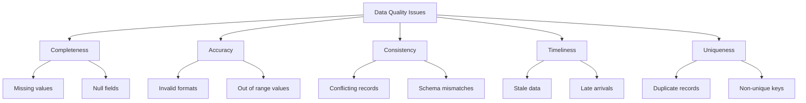
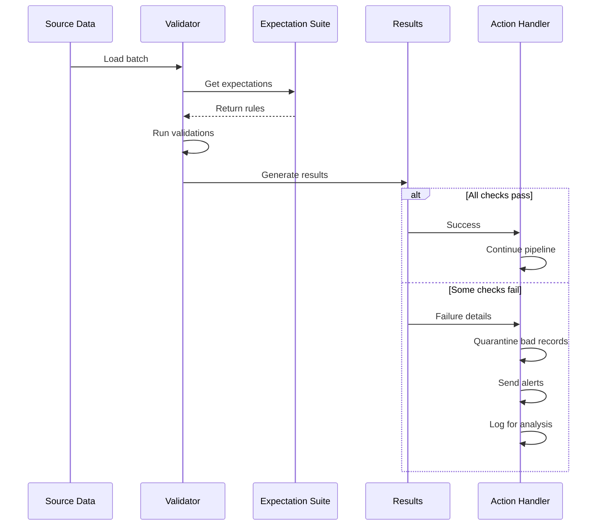

# How to Fix 'Data Quality' Validation Issues

Author: [nawazdhandala](https://www.github.com/nawazdhandala)

Tags: Data Quality, Data Validation, Great Expectations, Data Engineering, Testing, ETL

Description: Learn how to fix data quality validation issues in your pipelines, including implementing checks with Great Expectations, handling bad data, and building robust validation frameworks.

---

Data quality issues can silently corrupt your analytics and break downstream systems. Whether you are dealing with missing values, duplicate records, or schema violations, having a robust validation framework is essential. This guide covers practical approaches to detecting and fixing data quality problems.

---

## Common Data Quality Issues



---

## Setting Up Great Expectations

Great Expectations is the standard library for data validation in Python:

```bash
# Install Great Expectations
pip install great_expectations

# Initialize a new project
great_expectations init
```

### Project Structure

```
great_expectations/
├── great_expectations.yml
├── expectations/
│   └── my_suite.json
├── checkpoints/
│   └── my_checkpoint.yml
├── plugins/
├── uncommitted/
│   ├── config_variables.yml
│   └── data_docs/
└── .gitignore
```

---

## Creating Expectation Suites

```python
# create_expectations.py

import great_expectations as gx
from great_expectations.core.expectation_configuration import ExpectationConfiguration

# Initialize context
context = gx.get_context()

# Create a new expectation suite
suite_name = "orders_validation_suite"
suite = context.add_expectation_suite(expectation_suite_name=suite_name)

# Add expectations programmatically
expectations = [
    # Primary key must exist and be unique
    ExpectationConfiguration(
        expectation_type="expect_column_to_exist",
        kwargs={"column": "order_id"}
    ),
    ExpectationConfiguration(
        expectation_type="expect_column_values_to_be_unique",
        kwargs={"column": "order_id"}
    ),
    ExpectationConfiguration(
        expectation_type="expect_column_values_to_not_be_null",
        kwargs={"column": "order_id"}
    ),

    # Customer ID must be valid
    ExpectationConfiguration(
        expectation_type="expect_column_values_to_not_be_null",
        kwargs={"column": "customer_id"}
    ),
    ExpectationConfiguration(
        expectation_type="expect_column_values_to_be_of_type",
        kwargs={"column": "customer_id", "type_": "int64"}
    ),

    # Order amount must be positive
    ExpectationConfiguration(
        expectation_type="expect_column_values_to_be_between",
        kwargs={
            "column": "order_amount",
            "min_value": 0.01,
            "max_value": 1000000,
            "mostly": 0.99  # Allow 1% exceptions
        }
    ),

    # Status must be from allowed values
    ExpectationConfiguration(
        expectation_type="expect_column_values_to_be_in_set",
        kwargs={
            "column": "status",
            "value_set": ["pending", "confirmed", "shipped", "delivered", "cancelled"]
        }
    ),

    # Email format validation
    ExpectationConfiguration(
        expectation_type="expect_column_values_to_match_regex",
        kwargs={
            "column": "customer_email",
            "regex": r"^[a-zA-Z0-9_.+-]+@[a-zA-Z0-9-]+\.[a-zA-Z0-9-.]+$",
            "mostly": 0.95
        }
    ),

    # Date must be reasonable
    ExpectationConfiguration(
        expectation_type="expect_column_values_to_be_between",
        kwargs={
            "column": "order_date",
            "min_value": "2020-01-01",
            "max_value": "2030-12-31",
            "parse_strings_as_datetimes": True
        }
    ),

    # Table-level expectations
    ExpectationConfiguration(
        expectation_type="expect_table_row_count_to_be_between",
        kwargs={"min_value": 1000, "max_value": 10000000}
    ),
    ExpectationConfiguration(
        expectation_type="expect_table_columns_to_match_set",
        kwargs={
            "column_set": [
                "order_id", "customer_id", "customer_email",
                "order_amount", "status", "order_date", "updated_at"
            ],
            "exact_match": False
        }
    )
]

for expectation in expectations:
    suite.add_expectation(expectation)

context.update_expectation_suite(expectation_suite=suite)
print(f"Created expectation suite: {suite_name}")
```

---

## Running Validations

```python
# validate_data.py

import great_expectations as gx
import pandas as pd
from datetime import datetime

def validate_dataframe(df: pd.DataFrame, suite_name: str) -> dict:
    """Validate a DataFrame against an expectation suite."""

    context = gx.get_context()

    # Create a batch from the DataFrame
    datasource = context.sources.add_or_update_pandas(name="pandas_datasource")
    data_asset = datasource.add_dataframe_asset(name="orders_data")

    batch_request = data_asset.build_batch_request(dataframe=df)

    # Get the expectation suite
    expectation_suite = context.get_expectation_suite(suite_name)

    # Create a validator
    validator = context.get_validator(
        batch_request=batch_request,
        expectation_suite=expectation_suite
    )

    # Run validation
    results = validator.validate()

    return {
        "success": results.success,
        "statistics": results.statistics,
        "results": results.results,
        "run_time": datetime.now().isoformat()
    }


def handle_validation_results(results: dict):
    """Process validation results and handle failures."""

    if results["success"]:
        print("All data quality checks passed!")
        return True

    # Extract failed expectations
    failed = []
    for result in results["results"]:
        if not result.success:
            failed.append({
                "expectation": result.expectation_config.expectation_type,
                "column": result.expectation_config.kwargs.get("column", "table-level"),
                "observed_value": result.result.get("observed_value"),
                "details": result.result
            })

    print(f"Data quality validation failed!")
    print(f"Passed: {results['statistics']['successful_expectations']}")
    print(f"Failed: {results['statistics']['unsuccessful_expectations']}")

    for f in failed:
        print(f"\nFailed: {f['expectation']} on {f['column']}")
        print(f"  Observed: {f['observed_value']}")

    return False


# Example usage
if __name__ == "__main__":
    # Load data
    df = pd.read_csv("orders.csv")

    # Validate
    results = validate_dataframe(df, "orders_validation_suite")

    # Handle results
    if not handle_validation_results(results):
        # Take action on failure
        # Could: send alert, quarantine data, halt pipeline
        raise ValueError("Data quality validation failed")
```

---

## Data Quality Validation Flow



---

## Custom Validation Functions

```python
# custom_validators.py

import pandas as pd
from typing import List, Dict, Any, Callable
from dataclasses import dataclass
from enum import Enum

class ValidationSeverity(Enum):
    ERROR = "error"      # Pipeline must stop
    WARNING = "warning"  # Log and continue
    INFO = "info"        # Informational only


@dataclass
class ValidationResult:
    name: str
    passed: bool
    severity: ValidationSeverity
    message: str
    failed_records: int = 0
    total_records: int = 0


class DataValidator:
    """Custom data validation framework."""

    def __init__(self):
        self.validations: List[Callable] = []

    def add_validation(self, func: Callable):
        """Add a validation function."""
        self.validations.append(func)
        return func

    def validate(self, df: pd.DataFrame) -> List[ValidationResult]:
        """Run all validations on a DataFrame."""
        results = []
        for validation in self.validations:
            result = validation(df)
            results.append(result)
        return results

    def has_errors(self, results: List[ValidationResult]) -> bool:
        """Check if any ERROR severity validations failed."""
        return any(
            not r.passed and r.severity == ValidationSeverity.ERROR
            for r in results
        )


# Create validator instance
validator = DataValidator()


@validator.add_validation
def check_no_null_primary_keys(df: pd.DataFrame) -> ValidationResult:
    """Primary keys cannot be null."""
    null_count = df['order_id'].isna().sum()
    return ValidationResult(
        name="no_null_primary_keys",
        passed=null_count == 0,
        severity=ValidationSeverity.ERROR,
        message=f"Found {null_count} null primary keys",
        failed_records=null_count,
        total_records=len(df)
    )


@validator.add_validation
def check_no_duplicates(df: pd.DataFrame) -> ValidationResult:
    """Primary keys must be unique."""
    duplicate_count = df['order_id'].duplicated().sum()
    return ValidationResult(
        name="no_duplicate_keys",
        passed=duplicate_count == 0,
        severity=ValidationSeverity.ERROR,
        message=f"Found {duplicate_count} duplicate primary keys",
        failed_records=duplicate_count,
        total_records=len(df)
    )


@validator.add_validation
def check_valid_amounts(df: pd.DataFrame) -> ValidationResult:
    """Order amounts must be positive."""
    invalid = df[df['order_amount'] <= 0]
    invalid_count = len(invalid)
    # Allow up to 0.1% invalid
    threshold = len(df) * 0.001
    return ValidationResult(
        name="valid_order_amounts",
        passed=invalid_count <= threshold,
        severity=ValidationSeverity.ERROR if invalid_count > threshold else ValidationSeverity.WARNING,
        message=f"Found {invalid_count} orders with invalid amounts",
        failed_records=invalid_count,
        total_records=len(df)
    )


@validator.add_validation
def check_data_freshness(df: pd.DataFrame) -> ValidationResult:
    """Data should not be older than 24 hours."""
    from datetime import datetime, timedelta

    max_date = pd.to_datetime(df['updated_at']).max()
    hours_old = (datetime.now() - max_date).total_seconds() / 3600

    return ValidationResult(
        name="data_freshness",
        passed=hours_old < 24,
        severity=ValidationSeverity.WARNING,
        message=f"Most recent record is {hours_old:.1f} hours old",
        failed_records=0 if hours_old < 24 else len(df),
        total_records=len(df)
    )


@validator.add_validation
def check_referential_integrity(df: pd.DataFrame) -> ValidationResult:
    """All customers should exist in the customer table."""
    # In real scenario, you would check against the customer table
    # Here we check for obviously invalid IDs
    invalid = df[df['customer_id'] <= 0]
    return ValidationResult(
        name="referential_integrity",
        passed=len(invalid) == 0,
        severity=ValidationSeverity.ERROR,
        message=f"Found {len(invalid)} records with invalid customer IDs",
        failed_records=len(invalid),
        total_records=len(df)
    )


# Run validations
def run_validation_pipeline(df: pd.DataFrame) -> bool:
    """Run validation pipeline and return success status."""
    results = validator.validate(df)

    print("=" * 60)
    print("DATA QUALITY VALIDATION REPORT")
    print("=" * 60)

    for result in results:
        status = "PASS" if result.passed else "FAIL"
        print(f"\n[{status}] {result.name}")
        print(f"  Severity: {result.severity.value}")
        print(f"  Message: {result.message}")
        if result.failed_records > 0:
            pct = (result.failed_records / result.total_records) * 100
            print(f"  Failed: {result.failed_records}/{result.total_records} ({pct:.2f}%)")

    print("\n" + "=" * 60)

    if validator.has_errors(results):
        print("RESULT: FAILED - Pipeline should not proceed")
        return False
    else:
        print("RESULT: PASSED - Pipeline can proceed")
        return True
```

---

## Handling Bad Records

```python
# bad_record_handler.py

import pandas as pd
from datetime import datetime
import json
import logging

class BadRecordHandler:
    """Handle records that fail validation."""

    def __init__(self, quarantine_path: str):
        self.quarantine_path = quarantine_path
        self.logger = logging.getLogger(__name__)

    def quarantine_records(
        self,
        df: pd.DataFrame,
        mask: pd.Series,
        reason: str
    ) -> pd.DataFrame:
        """Move bad records to quarantine and return clean DataFrame."""

        bad_records = df[mask].copy()
        good_records = df[~mask].copy()

        if len(bad_records) > 0:
            # Add metadata
            bad_records['_quarantine_reason'] = reason
            bad_records['_quarantine_time'] = datetime.now().isoformat()

            # Save to quarantine
            filename = f"{self.quarantine_path}/quarantine_{datetime.now().strftime('%Y%m%d_%H%M%S')}.parquet"
            bad_records.to_parquet(filename)

            self.logger.warning(
                f"Quarantined {len(bad_records)} records for: {reason}"
            )

        return good_records

    def clean_dataframe(self, df: pd.DataFrame) -> pd.DataFrame:
        """Apply all cleaning rules and quarantine bad records."""

        # Remove null primary keys
        null_keys = df['order_id'].isna()
        df = self.quarantine_records(df, null_keys, "null_primary_key")

        # Remove duplicates (keep first)
        duplicate_mask = df['order_id'].duplicated(keep='first')
        df = self.quarantine_records(df, duplicate_mask, "duplicate_key")

        # Remove invalid amounts
        invalid_amounts = df['order_amount'] <= 0
        df = self.quarantine_records(df, invalid_amounts, "invalid_amount")

        # Remove invalid statuses
        valid_statuses = ['pending', 'confirmed', 'shipped', 'delivered', 'cancelled']
        invalid_status = ~df['status'].isin(valid_statuses)
        df = self.quarantine_records(df, invalid_status, "invalid_status")

        return df


def fix_common_issues(df: pd.DataFrame) -> pd.DataFrame:
    """Fix common data quality issues in place."""

    # Standardize string columns
    string_cols = df.select_dtypes(include=['object']).columns
    for col in string_cols:
        df[col] = df[col].str.strip()
        df[col] = df[col].str.lower()

    # Fix email formats
    if 'customer_email' in df.columns:
        df['customer_email'] = df['customer_email'].str.lower().str.strip()

    # Coerce dates
    if 'order_date' in df.columns:
        df['order_date'] = pd.to_datetime(df['order_date'], errors='coerce')

    # Fill missing values with defaults where appropriate
    if 'discount_amount' in df.columns:
        df['discount_amount'] = df['discount_amount'].fillna(0)

    return df
```

---

## dbt Data Tests Integration

```yaml
# models/marts/_marts__models.yml

version: 2

models:
  - name: fct_orders
    description: "Order fact table"
    tests:
      - dbt_utils.recency:
          datepart: hour
          field: updated_at
          interval: 24
      - dbt_utils.at_least_one

    columns:
      - name: order_id
        tests:
          - unique
          - not_null

      - name: order_amount
        tests:
          - not_null
          - dbt_utils.accepted_range:
              min_value: 0
              inclusive: false

      - name: customer_id
        tests:
          - not_null
          - relationships:
              to: ref('dim_customers')
              field: customer_id

      - name: status
        tests:
          - accepted_values:
              values: ['pending', 'confirmed', 'shipped', 'delivered', 'cancelled']
```

---

## Monitoring Data Quality

```python
# quality_metrics.py

from dataclasses import dataclass
from typing import Dict
import pandas as pd
from datetime import datetime

@dataclass
class QualityMetrics:
    """Data quality metrics for monitoring."""
    timestamp: datetime
    table_name: str
    row_count: int
    null_rate: Dict[str, float]
    duplicate_rate: float
    freshness_hours: float
    schema_valid: bool


def calculate_quality_metrics(
    df: pd.DataFrame,
    table_name: str,
    timestamp_col: str = 'updated_at'
) -> QualityMetrics:
    """Calculate quality metrics for a DataFrame."""

    # Null rates per column
    null_rates = (df.isna().sum() / len(df)).to_dict()

    # Duplicate rate (assuming first column is primary key)
    pk_col = df.columns[0]
    dup_rate = df[pk_col].duplicated().sum() / len(df)

    # Freshness
    if timestamp_col in df.columns:
        max_ts = pd.to_datetime(df[timestamp_col]).max()
        freshness = (datetime.now() - max_ts).total_seconds() / 3600
    else:
        freshness = -1

    return QualityMetrics(
        timestamp=datetime.now(),
        table_name=table_name,
        row_count=len(df),
        null_rate=null_rates,
        duplicate_rate=dup_rate,
        freshness_hours=freshness,
        schema_valid=True
    )


def send_metrics_to_monitoring(metrics: QualityMetrics):
    """Send metrics to monitoring system."""
    # Integration with OneUptime or other monitoring
    payload = {
        "metric_type": "data_quality",
        "table": metrics.table_name,
        "timestamp": metrics.timestamp.isoformat(),
        "values": {
            "row_count": metrics.row_count,
            "duplicate_rate": metrics.duplicate_rate,
            "freshness_hours": metrics.freshness_hours,
            "avg_null_rate": sum(metrics.null_rate.values()) / len(metrics.null_rate)
        }
    }
    # Send to monitoring API
    print(f"Sending metrics: {payload}")
```

---

## Best Practices

1. **Validate early** - Check data quality as close to the source as possible

2. **Use multiple layers** - Apply validations at ingestion, transformation, and output stages

3. **Set thresholds** - Define acceptable error rates rather than zero tolerance

4. **Quarantine, do not drop** - Save bad records for later analysis instead of deleting them

5. **Monitor trends** - Track quality metrics over time to catch degradation early

6. **Document expectations** - Make validation rules clear to all stakeholders

7. **Automate testing** - Run data quality tests as part of your CI/CD pipeline

8. **Alert on failures** - Set up notifications for validation failures

---

*Managing data quality in production? [OneUptime](https://oneuptime.com) helps you monitor pipeline health, track quality metrics, and alert on validation failures before bad data reaches your users.*
