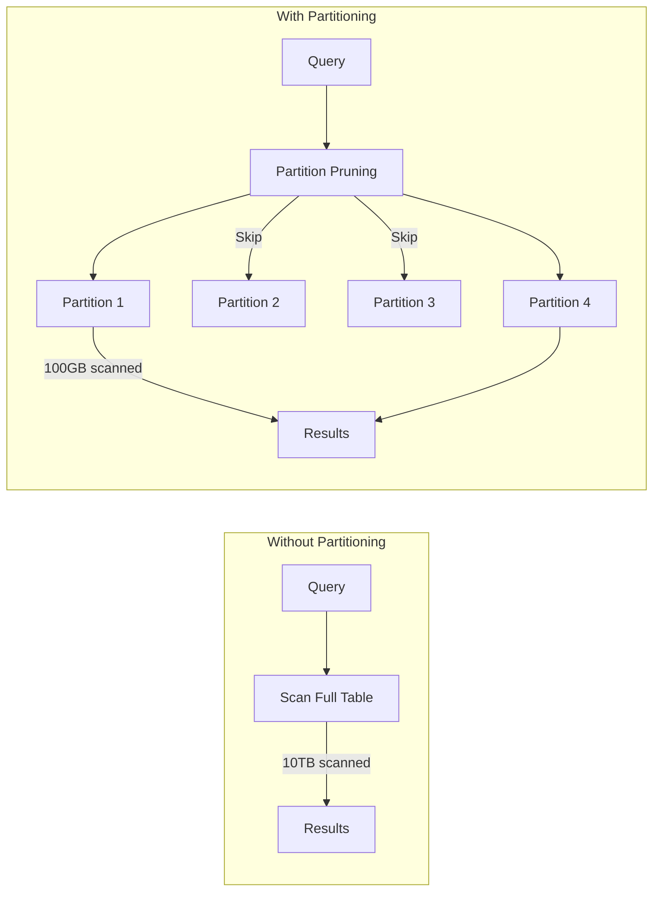
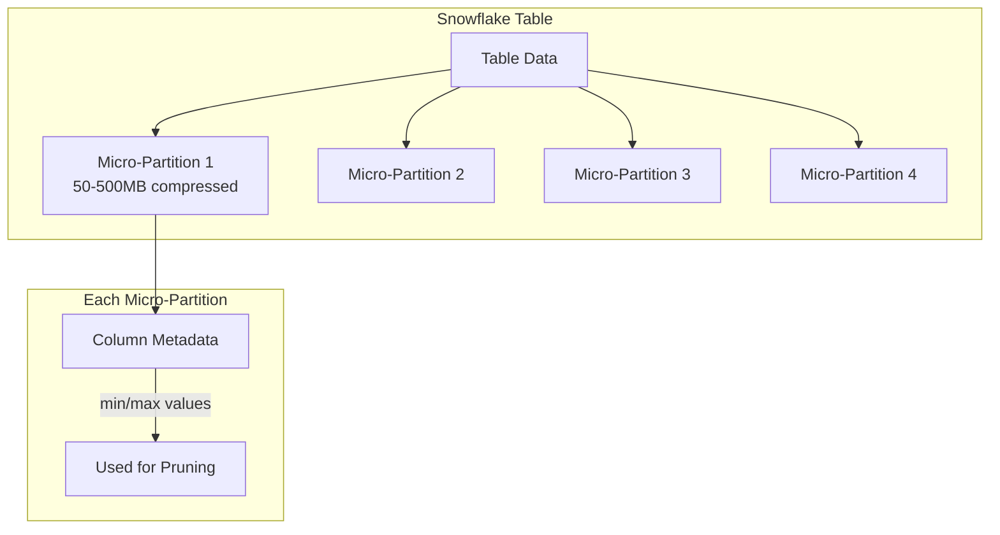
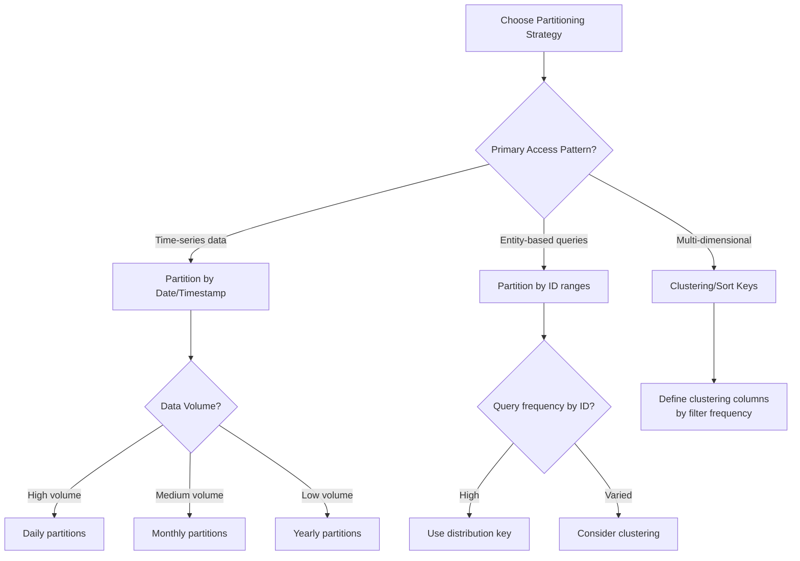

# How to Configure Data Warehouse Partitioning

Author: [nawazdhandala](https://www.github.com/nawazdhandala)

Tags: Data Warehouse, Partitioning, BigQuery, Snowflake, Redshift, SQL, Performance Optimization

Description: Learn how to configure partitioning strategies in modern data warehouses to improve query performance and reduce costs.

---

Partitioning is one of the most effective techniques for optimizing data warehouse performance. By dividing large tables into smaller, more manageable segments, you can dramatically reduce query times and costs. This guide covers partitioning strategies across major cloud data warehouses including BigQuery, Snowflake, and Redshift.

## Why Partitioning Matters

Without partitioning, queries must scan entire tables even when you only need a small subset of data. With proper partitioning, the query engine can skip irrelevant partitions entirely, a technique called partition pruning.



## Google BigQuery Partitioning

BigQuery supports three types of partitioning: time-based, integer range, and ingestion time.

### Time-Based Partitioning

The most common approach for event data is partitioning by a timestamp column.

```sql
-- Create a table partitioned by date
CREATE TABLE `project.dataset.events`
(
  event_id STRING,
  event_timestamp TIMESTAMP,
  user_id STRING,
  event_type STRING,
  event_data JSON
)
PARTITION BY DATE(event_timestamp)
OPTIONS(
  -- Require partition filter to prevent full table scans
  require_partition_filter = true,
  -- Automatically delete partitions older than 90 days
  partition_expiration_days = 90
);
```

### Integer Range Partitioning

For tables where time is not the primary access pattern, use integer range partitioning.

```sql
-- Partition by customer ID ranges
CREATE TABLE `project.dataset.customer_transactions`
(
  transaction_id STRING,
  customer_id INT64,
  amount DECIMAL(10,2),
  transaction_date DATE
)
PARTITION BY RANGE_BUCKET(customer_id, GENERATE_ARRAY(0, 1000000, 10000))
CLUSTER BY transaction_date;
```

### Combining Partitioning with Clustering

Clustering further organizes data within partitions for even faster queries.

```sql
-- Partition by date, cluster by frequently filtered columns
CREATE TABLE `project.dataset.logs`
(
  log_timestamp TIMESTAMP,
  service_name STRING,
  severity STRING,
  message STRING
)
PARTITION BY DATE(log_timestamp)
CLUSTER BY service_name, severity;

-- This query benefits from both partitioning and clustering
SELECT *
FROM `project.dataset.logs`
WHERE DATE(log_timestamp) = '2026-01-24'  -- Partition pruning
  AND service_name = 'payment-service'     -- Cluster pruning
  AND severity = 'ERROR';
```

## Snowflake Micro-Partitioning

Snowflake uses automatic micro-partitioning, but you can optimize it using clustering keys.

### Understanding Micro-Partitions



### Configuring Clustering Keys

```sql
-- Create a table with clustering key
CREATE TABLE events (
    event_id VARCHAR(36),
    event_timestamp TIMESTAMP_NTZ,
    user_id VARCHAR(36),
    event_type VARCHAR(50),
    region VARCHAR(10),
    event_data VARIANT
)
CLUSTER BY (DATE(event_timestamp), region);

-- Add clustering to existing table
ALTER TABLE events CLUSTER BY (DATE(event_timestamp), region);

-- Check clustering efficiency
SELECT SYSTEM$CLUSTERING_INFORMATION('events');
```

### Automatic Clustering

Enable automatic reclustering to maintain clustering as data changes.

```sql
-- Enable automatic clustering
ALTER TABLE events RESUME RECLUSTER;

-- Check clustering depth (lower is better, 1.0 is perfect)
SELECT SYSTEM$CLUSTERING_DEPTH('events');

-- Monitor reclustering credits
SELECT *
FROM SNOWFLAKE.ACCOUNT_USAGE.AUTOMATIC_CLUSTERING_HISTORY
WHERE TABLE_NAME = 'EVENTS'
ORDER BY START_TIME DESC
LIMIT 10;
```

## Amazon Redshift Partitioning

Redshift uses distribution styles and sort keys for data organization.

### Distribution Styles

Choose the right distribution style based on your query patterns.

```sql
-- EVEN distribution: spreads data evenly across nodes
CREATE TABLE dimension_small (
    dim_id INT,
    dim_name VARCHAR(100)
)
DISTSTYLE EVEN;

-- KEY distribution: co-locates matching values for efficient joins
CREATE TABLE fact_sales (
    sale_id BIGINT,
    customer_id INT,
    product_id INT,
    sale_date DATE,
    amount DECIMAL(10,2)
)
DISTSTYLE KEY
DISTKEY (customer_id);

-- ALL distribution: copies entire table to all nodes (for small dimensions)
CREATE TABLE dimension_region (
    region_id INT,
    region_name VARCHAR(50),
    country VARCHAR(50)
)
DISTSTYLE ALL;
```

### Sort Keys for Partitioning

```sql
-- Compound sort key: optimizes queries that filter on leading columns
CREATE TABLE events (
    event_timestamp TIMESTAMP,
    event_type VARCHAR(50),
    user_id VARCHAR(36),
    event_data VARCHAR(MAX)
)
COMPOUND SORTKEY (event_timestamp, event_type);

-- Interleaved sort key: equal weight to all columns (use sparingly)
CREATE TABLE flexible_queries (
    dimension_a INT,
    dimension_b INT,
    dimension_c INT,
    measure DECIMAL(10,2)
)
INTERLEAVED SORTKEY (dimension_a, dimension_b, dimension_c);
```

### Maintaining Sort Order

```sql
-- Check table statistics
SELECT "table", unsorted, vacuum_sort_benefit
FROM svv_table_info
WHERE "table" = 'events';

-- Run vacuum to resort and reclaim space
VACUUM SORT ONLY events;

-- Full vacuum for heavily modified tables
VACUUM FULL events;

-- Analyze to update statistics
ANALYZE events;
```

## Choosing the Right Partitioning Strategy



## Best Practices for Partition Design

### 1. Match Partitions to Query Patterns

```sql
-- If queries always filter by date, partition by date
-- Good: matches common query pattern
SELECT COUNT(*)
FROM events
WHERE event_date = '2026-01-24';

-- Bad: cross-partition query
SELECT COUNT(*)
FROM events
WHERE user_id = 'abc123';  -- Scans all partitions
```

### 2. Avoid Too Many Small Partitions

```sql
-- Too granular: millions of tiny partitions
PARTITION BY TIMESTAMP_TRUNC(event_timestamp, HOUR)  -- Avoid for high cardinality

-- Better: larger, more manageable partitions
PARTITION BY DATE(event_timestamp)  -- One partition per day
```

### 3. Set Partition Expiration

```sql
-- BigQuery: automatic partition expiration
ALTER TABLE `project.dataset.logs`
SET OPTIONS (partition_expiration_days = 30);

-- Snowflake: use Time Travel and Fail-safe periods
ALTER TABLE logs SET DATA_RETENTION_TIME_IN_DAYS = 30;

-- Redshift: use automated vacuum delete
DELETE FROM logs WHERE event_date < DATEADD(day, -30, CURRENT_DATE);
VACUUM DELETE ONLY logs;
```

### 4. Monitor Partition Usage

```sql
-- BigQuery: check partition statistics
SELECT
  table_name,
  partition_id,
  total_rows,
  total_logical_bytes / (1024*1024*1024) AS size_gb
FROM `project.dataset.INFORMATION_SCHEMA.PARTITIONS`
WHERE table_name = 'events'
ORDER BY partition_id DESC
LIMIT 30;
```

## Conclusion

Effective partitioning is crucial for data warehouse performance and cost optimization. The key is aligning your partitioning strategy with your actual query patterns. Start by analyzing your most common queries, identify the columns used in WHERE clauses, and design your partitions accordingly. Remember to monitor partition sizes and query performance regularly, and adjust your strategy as your data and access patterns evolve. With proper partitioning, you can reduce query times from minutes to seconds and cut your data warehouse costs significantly.
