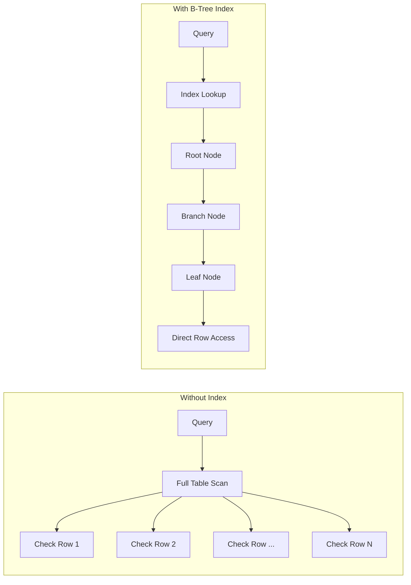
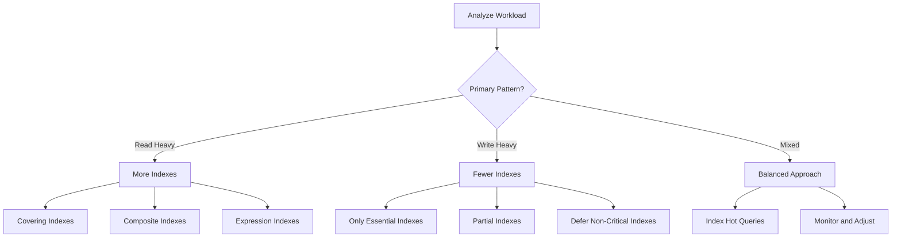

# How to Handle Database Indexing Strategy

Author: [nawazdhandala](https://www.github.com/nawazdhandala)

Tags: Database, Indexing, PostgreSQL, MySQL, Performance, Query Optimization, SQL, Backend

Description: Learn how to develop an effective database indexing strategy including index types, query analysis, and maintenance for optimal performance.

---

> Database indexes are the single most important factor for query performance. A well-designed indexing strategy can turn a 30-second query into a 30-millisecond query. This guide covers how to analyze, create, and maintain indexes effectively.

Indexes speed up reads but slow down writes. The goal is finding the right balance for your workload. Over-indexing wastes storage and slows inserts, while under-indexing makes queries crawl.

---

## How Indexes Work



| Index Type | Use Case | Example |
|------------|----------|---------|
| B-Tree | Equality, range queries, sorting | `WHERE id = 5`, `ORDER BY date` |
| Hash | Equality only | `WHERE email = 'x@y.com'` |
| GIN | Full-text search, arrays, JSONB | `WHERE tags @> ARRAY['api']` |
| GiST | Geometric, full-text | `WHERE location <-> point` |
| BRIN | Large sequential data | Time-series data |

---

## Analyzing Query Performance

Before creating indexes, analyze your queries:

```sql
-- PostgreSQL: Analyze a slow query
EXPLAIN (ANALYZE, BUFFERS, FORMAT TEXT)
SELECT
    o.id,
    o.created_at,
    c.name as customer_name,
    SUM(oi.quantity * oi.unit_price) as total
FROM orders o
JOIN customers c ON c.id = o.customer_id
JOIN order_items oi ON oi.order_id = o.id
WHERE o.created_at >= '2026-01-01'
  AND o.status = 'completed'
GROUP BY o.id, o.created_at, c.name
ORDER BY o.created_at DESC
LIMIT 100;

-- Example output (before indexing):
-- Limit  (cost=45123.45..45123.70 rows=100)
--   ->  Sort  (cost=45123.45..45234.56 rows=44444)
--         Sort Key: o.created_at DESC
--         ->  Hash Join  (cost=1234.56..40000.00 rows=44444)
--               ->  Seq Scan on orders o  (cost=0.00..35000.00 rows=44444)
--                     Filter: (status = 'completed' AND created_at >= '2026-01-01')
--                     Rows Removed by Filter: 955556
--
-- Planning Time: 0.5 ms
-- Execution Time: 2345.678 ms  <-- SLOW!
```

```sql
-- Find missing indexes based on sequential scans
-- PostgreSQL: Check which tables need indexes

SELECT
    schemaname,
    relname as table_name,
    seq_scan,
    seq_tup_read,
    idx_scan,
    idx_tup_fetch,
    CASE
        WHEN seq_scan > 0
        THEN round((seq_tup_read::numeric / seq_scan), 2)
        ELSE 0
    END as avg_rows_per_seq_scan
FROM pg_stat_user_tables
WHERE seq_scan > 100
  AND seq_tup_read > 10000
ORDER BY seq_tup_read DESC
LIMIT 20;

-- Look for:
-- - High seq_scan count with low idx_scan
-- - High avg_rows_per_seq_scan (means scanning many rows)
```

```sql
-- Find slow queries in PostgreSQL
-- Enable pg_stat_statements first

SELECT
    substring(query, 1, 100) as query_preview,
    calls,
    round(total_exec_time::numeric, 2) as total_time_ms,
    round(mean_exec_time::numeric, 2) as avg_time_ms,
    round((100 * total_exec_time / sum(total_exec_time) OVER ())::numeric, 2) as pct_total
FROM pg_stat_statements
WHERE calls > 10
ORDER BY total_exec_time DESC
LIMIT 20;
```

---

## Creating Effective Indexes

```sql
-- PostgreSQL: Create indexes for the example query

-- 1. Composite index for the WHERE clause
-- Column order matters: most selective first, or match query order
CREATE INDEX CONCURRENTLY idx_orders_status_created
ON orders (status, created_at DESC)
WHERE status = 'completed';  -- Partial index for common filter

-- 2. Index for the JOIN condition (if not primary key)
-- Foreign keys should almost always be indexed
CREATE INDEX CONCURRENTLY idx_order_items_order_id
ON order_items (order_id);

-- 3. Covering index to avoid table lookups
-- Includes all columns needed by the query
CREATE INDEX CONCURRENTLY idx_orders_covering
ON orders (status, created_at DESC)
INCLUDE (id, customer_id)
WHERE status = 'completed';

-- After indexing, same query:
-- Limit  (cost=123.45..123.70 rows=100)
--   ->  Index Scan using idx_orders_covering on orders o
--         Index Cond: (created_at >= '2026-01-01')
--
-- Execution Time: 12.345 ms  <-- 200x faster!
```

---

## Index Design Patterns

### Composite Index Column Order

```sql
-- Rule: Order columns by selectivity and query patterns

-- Good: High selectivity column first
CREATE INDEX idx_good ON events (user_id, created_at);
-- Supports: WHERE user_id = X
-- Supports: WHERE user_id = X AND created_at > Y
-- Does NOT support: WHERE created_at > Y (without user_id)

-- For range queries, equality columns come first
CREATE INDEX idx_range ON sales (region, sale_date);
-- Supports: WHERE region = 'US' AND sale_date BETWEEN X AND Y
```

### Partial Indexes

```sql
-- Only index rows you actually query
-- Saves space and improves write performance

-- Index only active users
CREATE INDEX idx_active_users ON users (email)
WHERE status = 'active';

-- Index only recent orders
CREATE INDEX idx_recent_orders ON orders (customer_id, created_at)
WHERE created_at > CURRENT_DATE - INTERVAL '90 days';

-- Index only non-null values
CREATE INDEX idx_phone ON customers (phone)
WHERE phone IS NOT NULL;
```

### Expression Indexes

```sql
-- Index computed values
CREATE INDEX idx_lower_email ON users (LOWER(email));

-- Now this query uses the index:
SELECT * FROM users WHERE LOWER(email) = 'user@example.com';

-- Index JSON fields
CREATE INDEX idx_metadata_type ON events ((metadata->>'type'));

-- Index date parts
CREATE INDEX idx_created_month ON orders (DATE_TRUNC('month', created_at));
```

---

## Index Maintenance

```sql
-- PostgreSQL: Monitor index health

-- Find unused indexes (candidates for removal)
SELECT
    schemaname,
    relname as table_name,
    indexrelname as index_name,
    idx_scan,
    pg_size_pretty(pg_relation_size(indexrelid)) as index_size
FROM pg_stat_user_indexes
WHERE idx_scan = 0
  AND indexrelid NOT IN (
      SELECT conindid FROM pg_constraint
  )
ORDER BY pg_relation_size(indexrelid) DESC;

-- Find duplicate indexes
SELECT
    a.indrelid::regclass as table_name,
    a.indexrelid::regclass as index_a,
    b.indexrelid::regclass as index_b,
    pg_size_pretty(pg_relation_size(a.indexrelid)) as size_a,
    pg_size_pretty(pg_relation_size(b.indexrelid)) as size_b
FROM pg_index a
JOIN pg_index b ON a.indrelid = b.indrelid
  AND a.indexrelid < b.indexrelid
  AND a.indkey = b.indkey;

-- Check index bloat
SELECT
    schemaname,
    relname as table_name,
    indexrelname as index_name,
    round(100 * pg_relation_size(indexrelid) /
          nullif(pg_relation_size(indrelid), 0)) as index_ratio,
    pg_size_pretty(pg_relation_size(indexrelid)) as index_size,
    pg_size_pretty(pg_relation_size(indrelid)) as table_size
FROM pg_stat_user_indexes
JOIN pg_index USING (indexrelid)
ORDER BY pg_relation_size(indexrelid) DESC
LIMIT 20;
```

```sql
-- Rebuild bloated indexes (PostgreSQL)
-- Use CONCURRENTLY to avoid locking

REINDEX INDEX CONCURRENTLY idx_orders_status_created;

-- Or rebuild all indexes on a table
REINDEX TABLE CONCURRENTLY orders;

-- Update statistics after major changes
ANALYZE orders;
```

---

## MySQL-Specific Indexing

```sql
-- MySQL: Index creation differences

-- Create index (not concurrent by default)
CREATE INDEX idx_orders_status ON orders (status, created_at);

-- Use ALGORITHM=INPLACE for less locking (MySQL 5.6+)
ALTER TABLE orders
ADD INDEX idx_customer (customer_id),
ALGORITHM=INPLACE, LOCK=NONE;

-- Check index usage
SHOW INDEX FROM orders;

-- Analyze query with index hints
EXPLAIN SELECT * FROM orders
USE INDEX (idx_orders_status)
WHERE status = 'completed';

-- Force index usage (use sparingly)
SELECT * FROM orders
FORCE INDEX (idx_orders_status)
WHERE status = 'completed';
```

---

## Index Strategy by Workload



| Workload | Strategy |
|----------|----------|
| OLTP (transactions) | Index foreign keys, common filters |
| OLAP (analytics) | Wider covering indexes, column stores |
| Time-series | BRIN indexes, partitioning by time |
| Full-text search | GIN indexes, dedicated search engine |
| High write volume | Minimal indexes, batch inserts |

---

## Common Indexing Mistakes

```sql
-- Mistake 1: Indexing low-cardinality columns alone
-- Bad: Only 3 distinct values, index won't help much
CREATE INDEX idx_status ON orders (status);

-- Better: Combine with high-cardinality column
CREATE INDEX idx_status_date ON orders (status, created_at);


-- Mistake 2: Wrong column order in composite index
-- Bad: Range column first prevents using later columns
CREATE INDEX idx_bad ON events (created_at, user_id, event_type);
-- Query: WHERE user_id = X AND event_type = Y AND created_at > Z
-- Only uses created_at part of index

-- Better: Equality columns first
CREATE INDEX idx_good ON events (user_id, event_type, created_at);


-- Mistake 3: Over-indexing
-- Every index slows down INSERT, UPDATE, DELETE
-- Remove unused indexes regularly


-- Mistake 4: Not using partial indexes
-- Bad: Full index when you only query active records
CREATE INDEX idx_users_email ON users (email);

-- Better: Partial index
CREATE INDEX idx_users_email_active ON users (email)
WHERE status = 'active';


-- Mistake 5: Forgetting to ANALYZE after bulk changes
-- Statistics become stale, leading to poor query plans
ANALYZE orders;
```

---

## Automated Index Recommendations

```python
# index_analyzer.py
# Script to suggest indexes based on query patterns

import psycopg2
from collections import defaultdict
from typing import List, Dict

def analyze_slow_queries(conn_string: str) -> List[Dict]:
    """
    Analyze slow queries and suggest indexes.
    Requires pg_stat_statements extension.
    """
    conn = psycopg2.connect(conn_string)
    cur = conn.cursor()

    # Get slow queries
    cur.execute("""
        SELECT
            query,
            calls,
            mean_exec_time,
            total_exec_time
        FROM pg_stat_statements
        WHERE mean_exec_time > 100  -- > 100ms average
          AND calls > 10
        ORDER BY total_exec_time DESC
        LIMIT 50
    """)

    slow_queries = cur.fetchall()
    suggestions = []

    for query, calls, mean_time, total_time in slow_queries:
        # Get query plan
        try:
            cur.execute(f"EXPLAIN (FORMAT JSON) {query}")
            plan = cur.fetchone()[0]

            # Look for sequential scans
            if has_seq_scan(plan):
                tables = extract_tables(plan)
                filters = extract_filters(query)

                suggestions.append({
                    'query_preview': query[:200],
                    'avg_time_ms': round(mean_time, 2),
                    'calls': calls,
                    'tables': tables,
                    'suggested_indexes': suggest_indexes(tables, filters)
                })
        except Exception as e:
            continue

    return suggestions

def has_seq_scan(plan: dict) -> bool:
    """Check if plan contains sequential scan"""
    plan_str = str(plan)
    return 'Seq Scan' in plan_str

def extract_tables(plan: dict) -> List[str]:
    """Extract table names from plan"""
    # Simplified - real implementation would parse JSON
    return []

def extract_filters(query: str) -> List[str]:
    """Extract WHERE clause columns"""
    # Simplified - real implementation would parse SQL
    return []

def suggest_indexes(tables: List[str], filters: List[str]) -> List[str]:
    """Generate index suggestions"""
    suggestions = []
    for table in tables:
        if filters:
            cols = ', '.join(filters)
            suggestions.append(
                f"CREATE INDEX CONCURRENTLY idx_{table}_suggested "
                f"ON {table} ({cols})"
            )
    return suggestions


if __name__ == '__main__':
    suggestions = analyze_slow_queries('postgresql://localhost/mydb')
    for s in suggestions:
        print(f"\nQuery: {s['query_preview']}")
        print(f"Avg time: {s['avg_time_ms']}ms, Calls: {s['calls']}")
        print("Suggested indexes:")
        for idx in s['suggested_indexes']:
            print(f"  {idx}")
```

---

## Best Practices Summary

| Practice | Description |
|----------|-------------|
| Index foreign keys | Always index columns used in JOINs |
| Use composite indexes | Match common query patterns |
| Order columns correctly | Equality before range |
| Use partial indexes | Only index what you query |
| Monitor index usage | Remove unused indexes |
| Rebuild periodically | Prevent bloat |
| Test before production | Verify improvements |
| Document indexes | Explain why each exists |

---

*Need to monitor your database performance and query times? [OneUptime](https://oneuptime.com) provides database monitoring with custom metrics, slow query tracking, and alerting.*

**Related Reading:**
- [How to Configure Elasticsearch for Performance](https://oneuptime.com/blog/post/2026-01-24-elasticsearch-performance-configuration/view)
- [How to Fix API Rate Limiting Performance](https://oneuptime.com/blog/post/2026-01-24-api-rate-limiting-performance/view)
