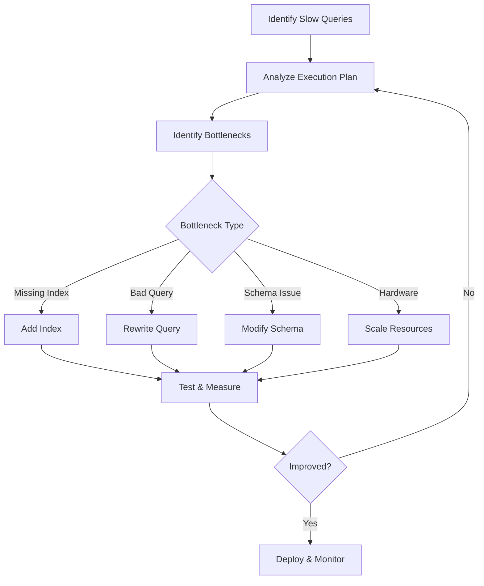
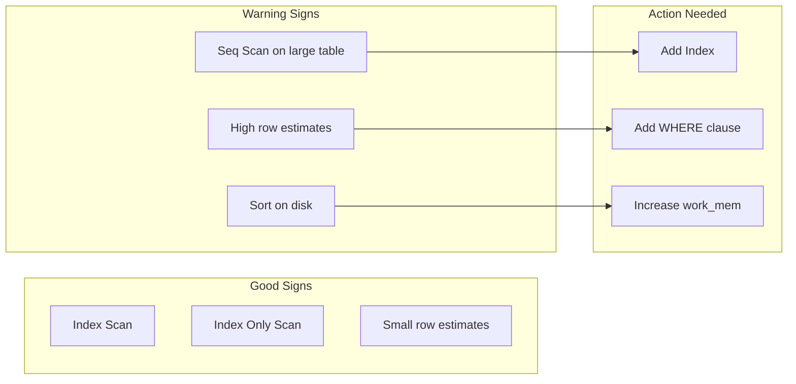
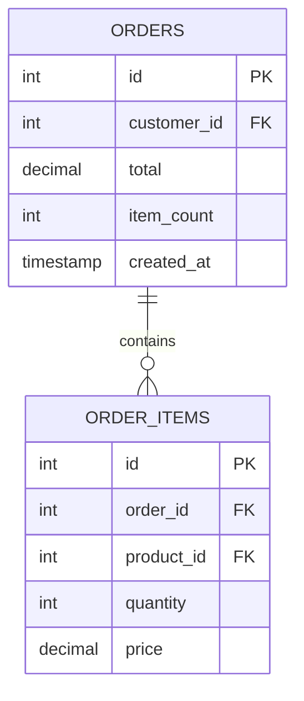

# How to Handle Database Query Optimization

Author: [nawazdhandala](https://www.github.com/nawazdhandala)

Tags: Database, SQL, Performance, PostgreSQL, MySQL, Indexing, Query Optimization

Description: A comprehensive guide to identifying slow database queries and optimizing them for better application performance.

---

Slow database queries are among the top causes of application performance issues. A single unoptimized query can bring down an entire system during peak traffic. In this guide, we will cover practical techniques to identify, analyze, and optimize database queries.

## The Query Optimization Process

Before jumping into fixes, understand the systematic approach to query optimization:



## Step 1: Finding Slow Queries

### Enable Slow Query Logging

For PostgreSQL:

```sql
-- postgresql.conf settings for slow query logging
-- Log queries taking more than 100ms
ALTER SYSTEM SET log_min_duration_statement = '100ms';

-- Log all statements (for debugging only, not production)
-- ALTER SYSTEM SET log_statement = 'all';

-- Reload configuration
SELECT pg_reload_conf();
```

For MySQL:

```sql
-- Enable slow query log in MySQL
SET GLOBAL slow_query_log = 'ON';
SET GLOBAL long_query_time = 0.1;  -- 100ms threshold
SET GLOBAL slow_query_log_file = '/var/log/mysql/slow-query.log';

-- Check current settings
SHOW VARIABLES LIKE 'slow_query%';
SHOW VARIABLES LIKE 'long_query_time';
```

### Query Monitoring in Application Code

```python
# query_monitor.py
# Decorator to log slow queries with context

import time
import logging
from functools import wraps

logger = logging.getLogger(__name__)

def log_slow_queries(threshold_ms=100):
    """Decorator to log queries exceeding threshold."""
    def decorator(func):
        @wraps(func)
        def wrapper(*args, **kwargs):
            start = time.perf_counter()

            try:
                result = func(*args, **kwargs)
                return result
            finally:
                duration_ms = (time.perf_counter() - start) * 1000

                if duration_ms > threshold_ms:
                    logger.warning(
                        f"Slow query in {func.__name__}: "
                        f"{duration_ms:.2f}ms "
                        f"args={args}, kwargs={kwargs}"
                    )
        return wrapper
    return decorator

# Usage example
class UserRepository:
    @log_slow_queries(threshold_ms=50)
    def find_by_email(self, email):
        return self.db.query(
            "SELECT * FROM users WHERE email = %s",
            (email,)
        )
```

## Step 2: Analyzing Query Execution Plans

The execution plan tells you exactly how the database processes your query.

### PostgreSQL EXPLAIN ANALYZE

```sql
-- Basic explain
EXPLAIN SELECT * FROM orders WHERE customer_id = 12345;

-- With actual execution statistics
EXPLAIN (ANALYZE, BUFFERS, FORMAT TEXT)
SELECT o.id, o.total, c.name
FROM orders o
JOIN customers c ON c.id = o.customer_id
WHERE o.created_at > '2024-01-01'
AND o.status = 'pending';

-- Output explanation:
-- Seq Scan = Full table scan (usually bad for large tables)
-- Index Scan = Using an index (good)
-- Bitmap Index Scan = Using index for filtering (good for multiple conditions)
-- Hash Join / Merge Join / Nested Loop = Join strategies
```

### Reading Execution Plans

Here is what to look for in execution plans:



### MySQL EXPLAIN

```sql
-- MySQL explain format
EXPLAIN FORMAT=JSON
SELECT o.id, o.total, c.name
FROM orders o
JOIN customers c ON c.id = o.customer_id
WHERE o.created_at > '2024-01-01';

-- Key columns to check:
-- type: ALL (bad), index, range, ref, const (best)
-- key: Which index is used (NULL means no index)
-- rows: Estimated rows to examine
-- Extra: Using where, Using index, Using filesort (bad)
```

## Step 3: Common Optimizations

### Optimization 1: Add Missing Indexes

```sql
-- Identify missing indexes in PostgreSQL
-- Find sequential scans on large tables
SELECT schemaname, relname, seq_scan, seq_tup_read,
       idx_scan, idx_tup_fetch
FROM pg_stat_user_tables
WHERE seq_scan > 0
ORDER BY seq_tup_read DESC
LIMIT 20;

-- Create index for common query patterns
-- Single column index
CREATE INDEX idx_orders_customer_id ON orders(customer_id);

-- Composite index for multiple columns
-- Column order matters! Put equality conditions first
CREATE INDEX idx_orders_status_created
ON orders(status, created_at);

-- Partial index for specific conditions
-- Only index active orders (smaller, faster)
CREATE INDEX idx_orders_active
ON orders(customer_id)
WHERE status = 'active';

-- Covering index (includes all needed columns)
-- Allows index-only scans
CREATE INDEX idx_orders_covering
ON orders(customer_id)
INCLUDE (total, status);
```

### Optimization 2: Query Rewriting

Bad queries can be rewritten for better performance:

```sql
-- BAD: Using OR can prevent index usage
SELECT * FROM orders
WHERE customer_id = 123 OR customer_id = 456;

-- BETTER: Use IN clause
SELECT * FROM orders
WHERE customer_id IN (123, 456);

-- BAD: Function on indexed column prevents index usage
SELECT * FROM users
WHERE LOWER(email) = 'user@example.com';

-- BETTER: Store normalized data or use expression index
CREATE INDEX idx_users_email_lower ON users(LOWER(email));
-- Or normalize data on insert

-- BAD: SELECT * fetches unnecessary columns
SELECT * FROM orders WHERE id = 123;

-- BETTER: Select only needed columns
SELECT id, total, status FROM orders WHERE id = 123;

-- BAD: Subquery executed for each row
SELECT * FROM orders o
WHERE customer_id IN (
    SELECT id FROM customers WHERE country = 'US'
);

-- BETTER: Use JOIN instead
SELECT o.* FROM orders o
JOIN customers c ON c.id = o.customer_id
WHERE c.country = 'US';
```

### Optimization 3: Pagination Done Right

```sql
-- BAD: OFFSET-based pagination gets slower as offset increases
SELECT * FROM orders
ORDER BY created_at DESC
LIMIT 20 OFFSET 10000;  -- Scans 10,020 rows!

-- BETTER: Cursor-based pagination (keyset pagination)
-- First page
SELECT * FROM orders
ORDER BY created_at DESC, id DESC
LIMIT 20;

-- Next page (using last row's values as cursor)
SELECT * FROM orders
WHERE (created_at, id) < ('2024-01-15 10:30:00', 12345)
ORDER BY created_at DESC, id DESC
LIMIT 20;
```

### Optimization 4: Batch Operations

```python
# batch_operations.py
# Efficient batch inserts and updates

def insert_users_bad(db, users):
    """BAD: Individual inserts are slow"""
    for user in users:
        db.execute(
            "INSERT INTO users (name, email) VALUES (%s, %s)",
            (user['name'], user['email'])
        )

def insert_users_good(db, users, batch_size=1000):
    """GOOD: Batch inserts are much faster"""
    for i in range(0, len(users), batch_size):
        batch = users[i:i + batch_size]

        # Build multi-value insert
        values = []
        params = []
        for user in batch:
            values.append("(%s, %s)")
            params.extend([user['name'], user['email']])

        query = f"""
            INSERT INTO users (name, email)
            VALUES {','.join(values)}
        """
        db.execute(query, params)

def update_batch_good(db, updates):
    """GOOD: Batch updates using CASE"""
    if not updates:
        return

    # Build CASE statement for batch update
    ids = [u['id'] for u in updates]

    query = """
        UPDATE orders
        SET status = CASE id
    """

    params = []
    for update in updates:
        query += f" WHEN %s THEN %s"
        params.extend([update['id'], update['status']])

    query += " END WHERE id IN %s"
    params.append(tuple(ids))

    db.execute(query, params)
```

## Step 4: Schema Optimizations

### Denormalization for Read Performance



```sql
-- Instead of calculating item_count every time
SELECT o.*, COUNT(oi.id) as item_count
FROM orders o
LEFT JOIN order_items oi ON oi.order_id = o.id
GROUP BY o.id;

-- Store denormalized count on the orders table
-- Update it when items change
ALTER TABLE orders ADD COLUMN item_count INTEGER DEFAULT 0;

-- Use triggers to maintain consistency
CREATE OR REPLACE FUNCTION update_order_item_count()
RETURNS TRIGGER AS $$
BEGIN
    UPDATE orders
    SET item_count = (
        SELECT COUNT(*) FROM order_items WHERE order_id = NEW.order_id
    )
    WHERE id = NEW.order_id;
    RETURN NEW;
END;
$$ LANGUAGE plpgsql;

CREATE TRIGGER order_items_count_trigger
AFTER INSERT OR DELETE ON order_items
FOR EACH ROW EXECUTE FUNCTION update_order_item_count();
```

### Proper Data Types

```sql
-- Use appropriate data types for better performance

-- BAD: Using VARCHAR for fixed-length codes
CREATE TABLE countries (
    code VARCHAR(255),  -- Wastes space, slower comparisons
    name VARCHAR(255)
);

-- GOOD: Use CHAR for fixed-length
CREATE TABLE countries (
    code CHAR(2),       -- Exactly 2 characters
    name VARCHAR(100)   -- Reasonable limit
);

-- BAD: Using TEXT for everything
CREATE TABLE logs (
    level TEXT,         -- Only a few possible values
    message TEXT
);

-- GOOD: Use ENUM for limited values
CREATE TYPE log_level AS ENUM ('debug', 'info', 'warn', 'error');
CREATE TABLE logs (
    level log_level,    -- Stored as integer internally
    message TEXT
);

-- Use appropriate integer sizes
-- SMALLINT: -32,768 to 32,767 (2 bytes)
-- INTEGER: -2B to 2B (4 bytes)
-- BIGINT: -9Q to 9Q (8 bytes)
```

## Monitoring Query Performance

Set up continuous monitoring for database performance:

```sql
-- PostgreSQL: Find most time-consuming queries
-- Requires pg_stat_statements extension
CREATE EXTENSION IF NOT EXISTS pg_stat_statements;

SELECT
    round(total_exec_time::numeric, 2) as total_time_ms,
    calls,
    round(mean_exec_time::numeric, 2) as avg_time_ms,
    round((100 * total_exec_time / sum(total_exec_time) OVER ())::numeric, 2) as percent,
    query
FROM pg_stat_statements
ORDER BY total_exec_time DESC
LIMIT 20;

-- Reset statistics periodically
-- SELECT pg_stat_statements_reset();
```

## Quick Reference: Index Selection Guide

| Query Pattern | Index Type | Example |
|--------------|-----------|---------|
| WHERE col = value | B-tree (default) | `CREATE INDEX ON t(col)` |
| WHERE col LIKE 'prefix%' | B-tree | `CREATE INDEX ON t(col)` |
| WHERE col LIKE '%suffix' | Trigram (pg_trgm) | `CREATE INDEX ON t USING gin(col gin_trgm_ops)` |
| WHERE col @> array | GIN | `CREATE INDEX ON t USING gin(col)` |
| WHERE point <-> point | GiST | `CREATE INDEX ON t USING gist(col)` |
| Multi-column WHERE | Composite | `CREATE INDEX ON t(col1, col2)` |
| Aggregations | Partial/Covering | `CREATE INDEX ON t(col) WHERE condition` |

## Summary

Database query optimization is an iterative process:

1. **Monitor** - Enable slow query logging and track performance
2. **Analyze** - Use EXPLAIN to understand query execution
3. **Optimize** - Add indexes, rewrite queries, or adjust schema
4. **Verify** - Measure improvement and watch for regressions
5. **Repeat** - Performance tuning is ongoing

The best optimization is often avoiding the query entirely through caching or denormalization. But when you need to query, make sure it is as efficient as possible.

---

*OneUptime provides database query monitoring that helps you identify slow queries, track performance trends, and alert you when query times exceed thresholds. Integrate with your observability stack for full visibility.*
