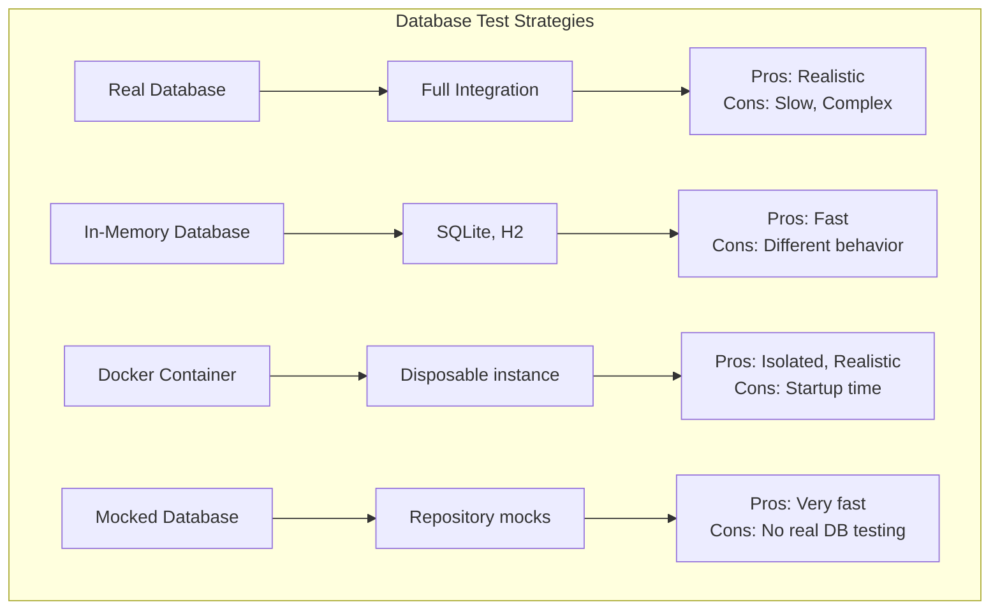
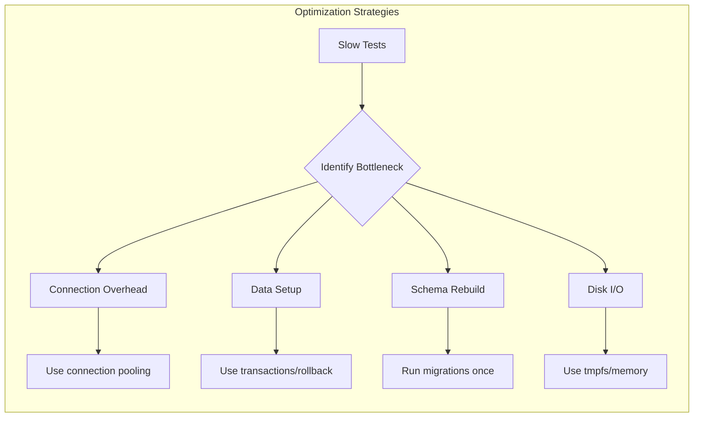

# How to Fix "Database Test" Setup Issues

Author: [nawazdhandala](https://www.github.com/nawazdhandala)

Tags: Database Testing, Test Setup, PostgreSQL, MySQL, MongoDB, Jest, Integration Testing, Docker, Test Fixtures

Description: Learn how to troubleshoot and resolve common database test setup issues including connection problems, data isolation, migration failures, and performance bottlenecks.

---

Database tests are essential for verifying your data layer works correctly, but they come with unique challenges. Connection issues, data pollution between tests, slow test suites, and migration failures can turn database testing into a frustrating experience. This guide covers the most common database test setup issues and how to fix them.

---

## Table of Contents

1. Understanding Database Test Architecture
2. Connection and Configuration Issues
3. Data Isolation Problems
4. Migration and Schema Issues
5. Test Database Strategies
6. Performance Optimization
7. Framework-Specific Solutions
8. Best Practices

---

## 1. Understanding Database Test Architecture

Before diving into fixes, let's understand the common approaches to database testing.



### When to Use Each Strategy

| Strategy | Use Case | Speed | Reliability |
|----------|----------|-------|-------------|
| **Real Database** | Final integration tests | Slow | Highest |
| **Docker Container** | CI/CD pipelines | Medium | High |
| **In-Memory DB** | Local development | Fast | Medium |
| **Mocked Repository** | Unit tests | Fastest | Lowest |

---

## 2. Connection and Configuration Issues

### Issue: "Connection Refused" Errors

**Symptoms:**
- Tests fail with ECONNREFUSED
- Database not reachable from test environment
- Works locally but fails in CI

**Fix: Verify database is ready before tests**

```javascript
// test/setup/waitForDatabase.js
const { Pool } = require('pg');

async function waitForDatabase(maxRetries = 30, delay = 1000) {
  const pool = new Pool({
    host: process.env.DB_HOST || 'localhost',
    port: process.env.DB_PORT || 5432,
    user: process.env.DB_USER || 'test',
    password: process.env.DB_PASSWORD || 'test',
    database: process.env.DB_NAME || 'test_db'
  });

  for (let i = 0; i < maxRetries; i++) {
    try {
      const client = await pool.connect();
      await client.query('SELECT 1');
      client.release();
      console.log('Database is ready');
      await pool.end();
      return;
    } catch (error) {
      console.log(`Waiting for database... (${i + 1}/${maxRetries})`);
      await new Promise(resolve => setTimeout(resolve, delay));
    }
  }

  throw new Error('Database not available after maximum retries');
}

module.exports = { waitForDatabase };
```

**Fix: Use in Jest global setup**

```javascript
// jest.config.js
module.exports = {
  globalSetup: './test/setup/globalSetup.js',
  globalTeardown: './test/setup/globalTeardown.js'
};

// test/setup/globalSetup.js
const { waitForDatabase } = require('./waitForDatabase');

module.exports = async () => {
  await waitForDatabase();
  // Run migrations after database is ready
  await runMigrations();
};
```

### Issue: "Too Many Connections" Errors

**Symptoms:**
- Tests fail intermittently
- "too many clients" or connection pool exhausted errors
- Tests hang waiting for connections

**Fix: Properly manage connection pools**

```javascript
// src/database/pool.js
const { Pool } = require('pg');

// Create a single pool instance for all tests
let pool = null;

function getPool() {
  if (!pool) {
    pool = new Pool({
      host: process.env.DB_HOST,
      port: process.env.DB_PORT,
      user: process.env.DB_USER,
      password: process.env.DB_PASSWORD,
      database: process.env.DB_NAME,
      // Limit connections for tests
      max: process.env.NODE_ENV === 'test' ? 5 : 20,
      // Release idle connections faster in tests
      idleTimeoutMillis: process.env.NODE_ENV === 'test' ? 1000 : 30000,
      // Timeout connection attempts
      connectionTimeoutMillis: 5000
    });

    pool.on('error', (err) => {
      console.error('Unexpected pool error:', err);
    });
  }
  return pool;
}

async function closePool() {
  if (pool) {
    await pool.end();
    pool = null;
  }
}

module.exports = { getPool, closePool };
```

```javascript
// test/setup/globalTeardown.js
const { closePool } = require('../../src/database/pool');

module.exports = async () => {
  await closePool();
};
```

---

## 3. Data Isolation Problems

### Issue: Tests Interfere with Each Other

**Symptoms:**
- Tests pass individually but fail when run together
- Random test failures that change on each run
- Data from one test affects another

**Fix: Use transactions with rollback**

```javascript
// test/helpers/dbTransaction.js
const { getPool } = require('../../src/database/pool');

class TransactionManager {
  constructor() {
    this.client = null;
  }

  async begin() {
    const pool = getPool();
    this.client = await pool.connect();
    await this.client.query('BEGIN');
    return this.client;
  }

  async rollback() {
    if (this.client) {
      await this.client.query('ROLLBACK');
      this.client.release();
      this.client = null;
    }
  }
}

// Usage in tests
describe('User Repository', () => {
  let txManager;
  let client;

  beforeEach(async () => {
    txManager = new TransactionManager();
    client = await txManager.begin();
  });

  afterEach(async () => {
    await txManager.rollback();  // All changes are rolled back
  });

  it('creates a user', async () => {
    // This insert will be rolled back after the test
    await client.query(
      'INSERT INTO users (name, email) VALUES ($1, $2)',
      ['John', 'john@example.com']
    );

    const result = await client.query('SELECT * FROM users WHERE email = $1', ['john@example.com']);
    expect(result.rows).toHaveLength(1);
  });
});
```

**Fix: Use database truncation between tests**

```javascript
// test/helpers/truncateTables.js
async function truncateAllTables(pool) {
  const client = await pool.connect();
  try {
    // Disable foreign key checks temporarily
    await client.query('SET session_replication_role = replica');

    // Get all table names
    const result = await client.query(`
      SELECT tablename FROM pg_tables
      WHERE schemaname = 'public'
      AND tablename NOT LIKE 'knex%'
      AND tablename NOT LIKE '_prisma%'
    `);

    // Truncate all tables
    for (const row of result.rows) {
      await client.query(`TRUNCATE TABLE "${row.tablename}" CASCADE`);
    }

    // Re-enable foreign key checks
    await client.query('SET session_replication_role = DEFAULT');
  } finally {
    client.release();
  }
}

module.exports = { truncateAllTables };
```

### Issue: Test Data Fixtures Not Loading

**Symptoms:**
- Tests expect data that doesn't exist
- Foreign key violations when inserting test data
- Fixture loading fails silently

**Fix: Create a robust fixture loader**

```javascript
// test/fixtures/loader.js
const path = require('path');
const fs = require('fs');

class FixtureLoader {
  constructor(pool) {
    this.pool = pool;
    this.loadOrder = ['users', 'products', 'orders', 'order_items'];
  }

  async loadFixture(name) {
    const fixturePath = path.join(__dirname, `${name}.json`);

    if (!fs.existsSync(fixturePath)) {
      throw new Error(`Fixture not found: ${fixturePath}`);
    }

    const data = JSON.parse(fs.readFileSync(fixturePath, 'utf8'));
    const client = await this.pool.connect();

    try {
      for (const row of data) {
        const columns = Object.keys(row);
        const values = Object.values(row);
        const placeholders = values.map((_, i) => `$${i + 1}`);

        await client.query(
          `INSERT INTO ${name} (${columns.join(', ')})
           VALUES (${placeholders.join(', ')})
           ON CONFLICT DO NOTHING`,
          values
        );
      }
    } finally {
      client.release();
    }
  }

  async loadAll() {
    for (const table of this.loadOrder) {
      await this.loadFixture(table);
    }
  }

  async reset() {
    // Truncate in reverse order to respect foreign keys
    const client = await this.pool.connect();
    try {
      for (const table of [...this.loadOrder].reverse()) {
        await client.query(`TRUNCATE TABLE ${table} CASCADE`);
      }
    } finally {
      client.release();
    }
  }
}

module.exports = { FixtureLoader };
```

---

## 4. Migration and Schema Issues

### Issue: Migrations Fail in Test Environment

**Symptoms:**
- "relation does not exist" errors
- Schema out of sync with code
- Migration scripts fail

**Fix: Ensure migrations run before tests**

```javascript
// test/setup/runMigrations.js
const knex = require('knex');
const config = require('../../knexfile');

async function runMigrations() {
  const db = knex(config.test);

  try {
    // Run all pending migrations
    const [batch, migrations] = await db.migrate.latest();

    if (migrations.length > 0) {
      console.log(`Ran ${migrations.length} migrations in batch ${batch}`);
    } else {
      console.log('No pending migrations');
    }
  } catch (error) {
    console.error('Migration failed:', error);
    throw error;
  } finally {
    await db.destroy();
  }
}

module.exports = { runMigrations };
```

**Fix: Handle schema differences for in-memory databases**

```javascript
// knexfile.js
module.exports = {
  development: {
    client: 'postgresql',
    connection: process.env.DATABASE_URL
  },

  test: {
    client: process.env.USE_SQLITE ? 'sqlite3' : 'postgresql',
    connection: process.env.USE_SQLITE
      ? { filename: ':memory:' }
      : {
          host: process.env.DB_HOST || 'localhost',
          database: process.env.DB_NAME || 'test_db'
        },
    useNullAsDefault: process.env.USE_SQLITE === 'true',

    // SQLite-specific settings
    pool: process.env.USE_SQLITE
      ? { min: 1, max: 1 }  // SQLite needs single connection for :memory:
      : { min: 2, max: 10 }
  }
};
```

---

## 5. Test Database Strategies

### Using Docker for Test Databases

```yaml
# docker-compose.test.yml
version: '3.8'
services:
  test-db:
    image: postgres:15
    environment:
      POSTGRES_USER: test
      POSTGRES_PASSWORD: test
      POSTGRES_DB: test_db
    ports:
      - "5433:5432"
    # Use tmpfs for faster I/O
    tmpfs:
      - /var/lib/postgresql/data
    healthcheck:
      test: ["CMD-SHELL", "pg_isready -U test"]
      interval: 5s
      timeout: 5s
      retries: 5
```

```json
{
  "scripts": {
    "test:db:start": "docker-compose -f docker-compose.test.yml up -d",
    "test:db:stop": "docker-compose -f docker-compose.test.yml down",
    "test:db:wait": "node scripts/wait-for-db.js",
    "test": "npm run test:db:start && npm run test:db:wait && jest && npm run test:db:stop"
  }
}
```

### Using Testcontainers

```javascript
// test/setup/testcontainers.js
const { PostgreSqlContainer } = require('@testcontainers/postgresql');

let container;

async function startContainer() {
  container = await new PostgreSqlContainer('postgres:15')
    .withDatabase('test_db')
    .withUsername('test')
    .withPassword('test')
    .start();

  // Set environment variables for your app
  process.env.DB_HOST = container.getHost();
  process.env.DB_PORT = container.getPort();
  process.env.DB_USER = container.getUsername();
  process.env.DB_PASSWORD = container.getPassword();
  process.env.DB_NAME = container.getDatabase();

  return container;
}

async function stopContainer() {
  if (container) {
    await container.stop();
  }
}

module.exports = { startContainer, stopContainer };
```

```javascript
// jest.config.js
module.exports = {
  globalSetup: './test/setup/globalSetup.js',
  globalTeardown: './test/setup/globalTeardown.js',
  testTimeout: 30000  // Increase timeout for container startup
};

// test/setup/globalSetup.js
const { startContainer } = require('./testcontainers');
const { runMigrations } = require('./runMigrations');

module.exports = async () => {
  await startContainer();
  await runMigrations();
};

// test/setup/globalTeardown.js
const { stopContainer } = require('./testcontainers');
const { closePool } = require('../../src/database/pool');

module.exports = async () => {
  await closePool();
  await stopContainer();
};
```

---

## 6. Performance Optimization

### Issue: Database Tests Are Too Slow



**Fix: Parallelize test suites with isolated databases**

```javascript
// jest.config.js
module.exports = {
  // Run test files in parallel
  maxWorkers: 4,

  // Each worker gets a unique database
  globalSetup: './test/setup/parallelSetup.js'
};

// test/setup/parallelSetup.js
const { Pool } = require('pg');

module.exports = async () => {
  const workerId = process.env.JEST_WORKER_ID || '1';
  const dbName = `test_db_${workerId}`;

  // Create database for this worker
  const adminPool = new Pool({
    host: process.env.DB_HOST,
    database: 'postgres',  // Connect to default DB
    user: process.env.DB_USER,
    password: process.env.DB_PASSWORD
  });

  try {
    // Drop and recreate database
    await adminPool.query(`DROP DATABASE IF EXISTS ${dbName}`);
    await adminPool.query(`CREATE DATABASE ${dbName}`);
  } finally {
    await adminPool.end();
  }

  // Set worker-specific database
  process.env.DB_NAME = dbName;
};
```

**Fix: Use database templates for faster setup**

```sql
-- Create a template database with schema and base data
CREATE DATABASE test_template;

-- Run migrations and seed data on template
\c test_template
-- ... migrations and seeds ...

-- Mark as template
ALTER DATABASE test_template WITH is_template = true;

-- Create test databases from template (much faster than running migrations)
CREATE DATABASE test_db_1 TEMPLATE test_template;
CREATE DATABASE test_db_2 TEMPLATE test_template;
```

```javascript
// Create database from template
async function createDatabaseFromTemplate(dbName, templateName = 'test_template') {
  const adminPool = new Pool({ database: 'postgres' });

  try {
    // Terminate connections to template
    await adminPool.query(`
      SELECT pg_terminate_backend(pid)
      FROM pg_stat_activity
      WHERE datname = $1 AND pid <> pg_backend_pid()
    `, [templateName]);

    await adminPool.query(`DROP DATABASE IF EXISTS ${dbName}`);
    await adminPool.query(`CREATE DATABASE ${dbName} TEMPLATE ${templateName}`);
  } finally {
    await adminPool.end();
  }
}
```

---

## 7. Framework-Specific Solutions

### Prisma Test Setup

```javascript
// test/setup/prisma.js
const { PrismaClient } = require('@prisma/client');
const { execSync } = require('child_process');

let prisma;

async function setupPrismaTest() {
  // Use a test-specific database URL
  const testUrl = process.env.DATABASE_URL.replace(
    /\/[^/]+$/,
    `/test_${process.env.JEST_WORKER_ID || 1}`
  );

  process.env.DATABASE_URL = testUrl;

  // Push schema to test database
  execSync('npx prisma db push --skip-generate', {
    env: { ...process.env, DATABASE_URL: testUrl }
  });

  prisma = new PrismaClient();
  return prisma;
}

async function cleanupPrismaTest() {
  // Delete all data in reverse dependency order
  const tables = ['OrderItem', 'Order', 'Product', 'User'];

  for (const table of tables) {
    await prisma[table.toLowerCase()].deleteMany();
  }
}

async function disconnectPrisma() {
  if (prisma) {
    await prisma.$disconnect();
  }
}

module.exports = { setupPrismaTest, cleanupPrismaTest, disconnectPrisma };
```

### TypeORM Test Setup

```javascript
// test/setup/typeorm.js
const { DataSource } = require('typeorm');

let dataSource;

async function setupTypeORMTest() {
  dataSource = new DataSource({
    type: 'postgres',
    host: process.env.DB_HOST,
    port: parseInt(process.env.DB_PORT || '5432'),
    username: process.env.DB_USER,
    password: process.env.DB_PASSWORD,
    database: process.env.DB_NAME,
    entities: ['src/entities/**/*.ts'],
    synchronize: true,  // Auto-sync schema for tests
    dropSchema: true,   // Drop schema before sync
    logging: false
  });

  await dataSource.initialize();
  return dataSource;
}

async function cleanupTypeORMTest() {
  if (dataSource && dataSource.isInitialized) {
    // Use query runner for transaction-wrapped cleanup
    const queryRunner = dataSource.createQueryRunner();
    await queryRunner.startTransaction();

    try {
      const entities = dataSource.entityMetadatas;
      for (const entity of entities) {
        await queryRunner.query(`TRUNCATE TABLE "${entity.tableName}" CASCADE`);
      }
      await queryRunner.commitTransaction();
    } catch (error) {
      await queryRunner.rollbackTransaction();
      throw error;
    } finally {
      await queryRunner.release();
    }
  }
}

module.exports = { setupTypeORMTest, cleanupTypeORMTest };
```

---

## 8. Best Practices

### Test Database Configuration Checklist

```javascript
// test/config/database.js
module.exports = {
  // Use separate database for tests
  database: process.env.TEST_DB_NAME || 'myapp_test',

  // Reduce pool size for tests
  pool: {
    min: 1,
    max: 5
  },

  // Shorter timeouts for faster failure
  connectionTimeoutMillis: 5000,
  idleTimeoutMillis: 1000,

  // Disable SSL for local tests
  ssl: process.env.CI ? { rejectUnauthorized: false } : false,

  // Enable query logging in debug mode
  logging: process.env.DEBUG_DB === 'true'
};
```

### GitHub Actions with Database Service

```yaml
name: Database Tests

on: [push, pull_request]

jobs:
  test:
    runs-on: ubuntu-latest

    services:
      postgres:
        image: postgres:15
        env:
          POSTGRES_USER: test
          POSTGRES_PASSWORD: test
          POSTGRES_DB: test_db
        ports:
          - 5432:5432
        options: >-
          --health-cmd pg_isready
          --health-interval 10s
          --health-timeout 5s
          --health-retries 5

    steps:
      - uses: actions/checkout@v4

      - name: Setup Node.js
        uses: actions/setup-node@v4
        with:
          node-version: '20'
          cache: 'npm'

      - name: Install dependencies
        run: npm ci

      - name: Run migrations
        run: npm run db:migrate
        env:
          DB_HOST: localhost
          DB_PORT: 5432
          DB_USER: test
          DB_PASSWORD: test
          DB_NAME: test_db

      - name: Run tests
        run: npm test
        env:
          DB_HOST: localhost
          DB_PORT: 5432
          DB_USER: test
          DB_PASSWORD: test
          DB_NAME: test_db
```

---

## Key Takeaways

1. **Wait for database readiness** before running tests
2. **Use transactions with rollback** for test isolation
3. **Manage connection pools carefully** to avoid exhaustion
4. **Run migrations once** in global setup, not per test
5. **Consider Docker or Testcontainers** for realistic test databases
6. **Use database templates** for faster test database creation
7. **Parallelize with isolated databases** for better performance
8. **Clean up properly** in afterEach and globalTeardown hooks

---

*Need to monitor your database health and performance in production? [OneUptime](https://oneuptime.com) provides database monitoring alongside your application metrics for complete visibility.*
