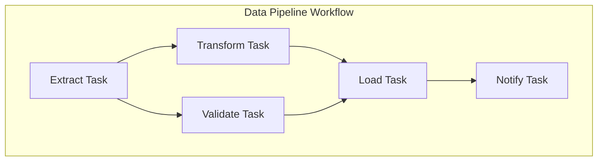
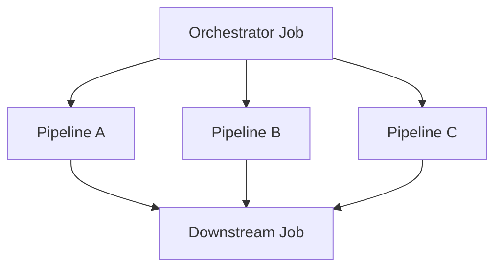

# How to Handle Databricks Workflows

Author: [nawazdhandala](https://www.github.com/nawazdhandala)

Tags: Databricks, Workflows, Data Engineering, Apache Spark, ETL, Orchestration, Data Pipelines

Description: Learn how to build, manage, and monitor production-ready data pipelines using Databricks Workflows with tasks, dependencies, and error handling.

---

> Databricks Workflows provide a native way to orchestrate complex data pipelines directly within the Databricks platform. They combine notebook execution, job scheduling, and dependency management into a unified experience.

This guide covers everything from basic workflow creation to advanced patterns for production deployments.

---

## Understanding Databricks Workflows

Workflows in Databricks consist of jobs that contain one or more tasks. Tasks can be notebooks, Python scripts, JAR files, or SQL queries, connected through dependencies.



---

## Creating Your First Workflow

You can create workflows through the UI, REST API, or Databricks Asset Bundles. Here is the programmatic approach using the Jobs API.

```python
# workflow_config.py
# Define a workflow using the Databricks SDK

from databricks.sdk import WorkspaceClient
from databricks.sdk.service.jobs import (
    Task, NotebookTask, TaskDependency,
    JobCluster, ClusterSpec, JobSettings
)

# Initialize the client
client = WorkspaceClient()

# Define the job configuration
job_config = JobSettings(
    name="daily_etl_pipeline",

    # Define a job cluster for all tasks to share
    job_clusters=[
        JobCluster(
            job_cluster_key="etl_cluster",
            new_cluster=ClusterSpec(
                spark_version="14.3.x-scala2.12",
                node_type_id="i3.xlarge",
                num_workers=4,
                spark_conf={
                    "spark.sql.adaptive.enabled": "true",
                    "spark.sql.adaptive.skewJoin.enabled": "true"
                }
            )
        )
    ],

    # Define tasks with dependencies
    tasks=[
        Task(
            task_key="extract_data",
            job_cluster_key="etl_cluster",
            notebook_task=NotebookTask(
                notebook_path="/Repos/production/etl/extract",
                base_parameters={
                    "source": "s3://data-lake/raw/",
                    "date": "{{job.start_time.iso_date}}"
                }
            )
        ),
        Task(
            task_key="transform_data",
            job_cluster_key="etl_cluster",
            notebook_task=NotebookTask(
                notebook_path="/Repos/production/etl/transform"
            ),
            depends_on=[
                TaskDependency(task_key="extract_data")
            ]
        ),
        Task(
            task_key="validate_quality",
            job_cluster_key="etl_cluster",
            notebook_task=NotebookTask(
                notebook_path="/Repos/production/etl/validate"
            ),
            depends_on=[
                TaskDependency(task_key="extract_data")
            ]
        ),
        Task(
            task_key="load_data",
            job_cluster_key="etl_cluster",
            notebook_task=NotebookTask(
                notebook_path="/Repos/production/etl/load"
            ),
            depends_on=[
                TaskDependency(task_key="transform_data"),
                TaskDependency(task_key="validate_quality")
            ]
        )
    ],

    # Schedule the job
    schedule={
        "quartz_cron_expression": "0 0 6 * * ?",  # 6 AM daily
        "timezone_id": "America/New_York"
    },

    # Email notifications
    email_notifications={
        "on_failure": ["data-team@company.com"],
        "on_success": ["data-team@company.com"]
    },

    # Retry configuration
    max_concurrent_runs=1
)

# Create the job
job = client.jobs.create(**job_config.__dict__)
print(f"Created job with ID: {job.job_id}")
```

---

## Passing Parameters Between Tasks

Tasks can share data through task values, which allow passing results from one task to the next.

```python
# extract_notebook.py
# First task: Extract data and set task values

from pyspark.sql import SparkSession

spark = SparkSession.builder.getOrCreate()

# Get parameters passed to the notebook
dbutils.widgets.text("source", "")
dbutils.widgets.text("date", "")

source_path = dbutils.widgets.get("source")
process_date = dbutils.widgets.get("date")

# Extract data
df = spark.read.parquet(f"{source_path}/{process_date}")
record_count = df.count()

# Write to staging location
staging_path = f"/mnt/staging/extracted/{process_date}"
df.write.mode("overwrite").parquet(staging_path)

# Set task values for downstream tasks
dbutils.jobs.taskValues.set(key="staging_path", value=staging_path)
dbutils.jobs.taskValues.set(key="record_count", value=record_count)
dbutils.jobs.taskValues.set(key="process_date", value=process_date)

print(f"Extracted {record_count} records to {staging_path}")
```

```python
# transform_notebook.py
# Second task: Read task values and transform

from pyspark.sql import SparkSession
from pyspark.sql.functions import col, when, current_timestamp

spark = SparkSession.builder.getOrCreate()

# Get task values from upstream task
staging_path = dbutils.jobs.taskValues.get(
    taskKey="extract_data",
    key="staging_path"
)
process_date = dbutils.jobs.taskValues.get(
    taskKey="extract_data",
    key="process_date"
)

# Read staged data
df = spark.read.parquet(staging_path)

# Apply transformations
df_transformed = df \
    .withColumn("processed_at", current_timestamp()) \
    .withColumn("status",
        when(col("amount") > 0, "credit")
        .otherwise("debit")
    ) \
    .filter(col("is_valid") == True)

# Write to processed location
processed_path = f"/mnt/processed/transactions/{process_date}"
df_transformed.write.mode("overwrite").format("delta").save(processed_path)

# Pass results downstream
dbutils.jobs.taskValues.set(key="processed_path", value=processed_path)
dbutils.jobs.taskValues.set(key="transformed_count", value=df_transformed.count())
```

---

## Handling Failures and Retries

Configure robust error handling to make workflows production-ready.

```python
# workflow_with_retries.py
# Configure task-level retry and timeout settings

from databricks.sdk.service.jobs import (
    Task, NotebookTask, TaskDependency,
    RetryPolicy, TaskNotificationSettings
)

tasks = [
    Task(
        task_key="flaky_external_api",
        notebook_task=NotebookTask(
            notebook_path="/Repos/production/etl/call_external_api"
        ),
        # Retry up to 3 times with delays
        retry_on_timeout=True,
        max_retries=3,
        min_retry_interval_millis=60000,  # 1 minute between retries

        # Timeout after 30 minutes
        timeout_seconds=1800,

        # Task-specific notifications
        notification_settings=TaskNotificationSettings(
            no_alert_for_skipped_runs=True,
            no_alert_for_canceled_runs=True
        )
    ),
    Task(
        task_key="process_data",
        notebook_task=NotebookTask(
            notebook_path="/Repos/production/etl/process"
        ),
        depends_on=[
            TaskDependency(
                task_key="flaky_external_api",
                outcome="SUCCEEDED"  # Only run if previous task succeeded
            )
        ]
    ),
    Task(
        task_key="handle_failure",
        notebook_task=NotebookTask(
            notebook_path="/Repos/production/etl/failure_handler"
        ),
        depends_on=[
            TaskDependency(
                task_key="flaky_external_api",
                outcome="FAILED"  # Run if previous task failed
            )
        ]
    )
]
```

---

## Conditional Task Execution

Use the `run_if` condition to control when tasks execute based on previous task outcomes.

```python
# conditional_workflow.py
# Tasks that run based on conditions

from databricks.sdk.service.jobs import Task, RunIf

tasks = [
    Task(
        task_key="check_data_exists",
        notebook_task=NotebookTask(
            notebook_path="/Repos/production/etl/check_source"
        )
    ),
    Task(
        task_key="full_load",
        notebook_task=NotebookTask(
            notebook_path="/Repos/production/etl/full_load"
        ),
        depends_on=[TaskDependency(task_key="check_data_exists")],
        # Only run if all dependencies succeed
        run_if=RunIf.ALL_SUCCESS
    ),
    Task(
        task_key="incremental_load",
        notebook_task=NotebookTask(
            notebook_path="/Repos/production/etl/incremental_load"
        ),
        depends_on=[TaskDependency(task_key="check_data_exists")],
        # Run regardless of upstream status
        run_if=RunIf.ALL_DONE
    ),
    Task(
        task_key="cleanup",
        notebook_task=NotebookTask(
            notebook_path="/Repos/production/etl/cleanup"
        ),
        depends_on=[
            TaskDependency(task_key="full_load"),
            TaskDependency(task_key="incremental_load")
        ],
        # Run even if some tasks failed
        run_if=RunIf.AT_LEAST_ONE_SUCCESS
    )
]
```

---

## Using For Each Tasks for Dynamic Parallelism

Process multiple items in parallel using ForEach tasks.

```python
# foreach_workflow.py
# Process multiple tables in parallel

from databricks.sdk.service.jobs import (
    Task, ForEachTask, NotebookTask
)

tasks = [
    Task(
        task_key="get_tables_to_process",
        notebook_task=NotebookTask(
            notebook_path="/Repos/production/etl/list_tables"
        )
    ),
    Task(
        task_key="process_each_table",
        depends_on=[TaskDependency(task_key="get_tables_to_process")],
        for_each_task=ForEachTask(
            # Input comes from upstream task value
            inputs="{{tasks.get_tables_to_process.values.table_list}}",
            task=Task(
                task_key="process_single_table",
                notebook_task=NotebookTask(
                    notebook_path="/Repos/production/etl/process_table",
                    base_parameters={
                        # Each iteration gets the current item
                        "table_name": "{{input}}"
                    }
                )
            ),
            concurrency=10  # Process up to 10 tables in parallel
        )
    ),
    Task(
        task_key="finalize",
        notebook_task=NotebookTask(
            notebook_path="/Repos/production/etl/finalize"
        ),
        depends_on=[TaskDependency(task_key="process_each_table")]
    )
]
```

```python
# list_tables_notebook.py
# Generate the list for ForEach task

tables_to_process = [
    "customers",
    "orders",
    "products",
    "inventory",
    "transactions"
]

# Set as task value for ForEach to consume
dbutils.jobs.taskValues.set(key="table_list", value=tables_to_process)
```

---

## Monitoring Workflow Runs

Query workflow run history and metrics programmatically.

```python
# monitor_workflows.py
# Monitor and analyze workflow execution

from databricks.sdk import WorkspaceClient
from databricks.sdk.service.jobs import ListRunsRunType
from datetime import datetime, timedelta

client = WorkspaceClient()

def get_job_metrics(job_id: int, days: int = 7):
    """
    Get execution metrics for a job over the specified period.
    """
    start_time = datetime.now() - timedelta(days=days)
    start_time_ms = int(start_time.timestamp() * 1000)

    runs = client.jobs.list_runs(
        job_id=job_id,
        start_time_from=start_time_ms,
        run_type=ListRunsRunType.JOB_RUN
    )

    metrics = {
        "total_runs": 0,
        "successful": 0,
        "failed": 0,
        "durations_seconds": [],
        "failure_reasons": []
    }

    for run in runs:
        metrics["total_runs"] += 1

        if run.state.result_state.value == "SUCCESS":
            metrics["successful"] += 1
        else:
            metrics["failed"] += 1
            metrics["failure_reasons"].append({
                "run_id": run.run_id,
                "state": run.state.result_state.value,
                "message": run.state.state_message
            })

        if run.end_time and run.start_time:
            duration = (run.end_time - run.start_time) / 1000
            metrics["durations_seconds"].append(duration)

    # Calculate statistics
    if metrics["durations_seconds"]:
        metrics["avg_duration"] = sum(metrics["durations_seconds"]) / len(metrics["durations_seconds"])
        metrics["max_duration"] = max(metrics["durations_seconds"])
        metrics["min_duration"] = min(metrics["durations_seconds"])

    metrics["success_rate"] = metrics["successful"] / metrics["total_runs"] if metrics["total_runs"] > 0 else 0

    return metrics

# Get metrics for a specific job
job_metrics = get_job_metrics(job_id=12345, days=30)
print(f"Success Rate: {job_metrics['success_rate']:.1%}")
print(f"Average Duration: {job_metrics['avg_duration'] / 60:.1f} minutes")

# Alert on degraded performance
if job_metrics["success_rate"] < 0.95:
    print("WARNING: Job success rate below 95%")
    for failure in job_metrics["failure_reasons"][-5:]:
        print(f"  Run {failure['run_id']}: {failure['message']}")
```

---

## Workflow Orchestration Patterns

### Pattern 1: Hub and Spoke

Central orchestration job that triggers multiple downstream jobs.



### Pattern 2: Event-Driven Workflows

Trigger workflows based on file arrival or external events.

```python
# event_driven_workflow.py
# Configure file arrival trigger

from databricks.sdk.service.jobs import (
    FileArrivalTriggerConfiguration,
    Trigger
)

job_config = JobSettings(
    name="file_arrival_processor",
    trigger=Trigger(
        file_arrival=FileArrivalTriggerConfiguration(
            url="s3://incoming-data/daily/",
            min_time_between_triggers_seconds=300,  # 5 minute cooldown
            wait_after_last_change_seconds=60  # Wait for file to finish uploading
        )
    ),
    tasks=[
        Task(
            task_key="process_new_files",
            notebook_task=NotebookTask(
                notebook_path="/Repos/production/etl/process_incoming"
            )
        )
    ]
)
```

---

## Best Practices

1. **Use job clusters** - Share clusters across tasks to reduce startup time
2. **Set appropriate timeouts** - Prevent runaway tasks from consuming resources
3. **Implement idempotency** - Tasks should be safe to retry without side effects
4. **Version your notebooks** - Use Repos for source control integration
5. **Monitor actively** - Set up alerts for failures and performance degradation
6. **Use task values wisely** - Keep passed data small; use paths for large datasets
7. **Test in development** - Use separate workspaces for testing workflows
8. **Document dependencies** - Keep workflow diagrams updated

---

*Building production data pipelines with Databricks? [OneUptime](https://oneuptime.com) provides end-to-end monitoring for your workflows with automated alerting and incident management.*

**Related Reading:**
- [How to Configure Delta Lake Tables](https://oneuptime.com/blog/post/2026-01-24-delta-lake-tables/view)
- [How to Fix "Data Skew" Issues in Spark](https://oneuptime.com/blog/post/2026-01-24-spark-data-skew/view)
