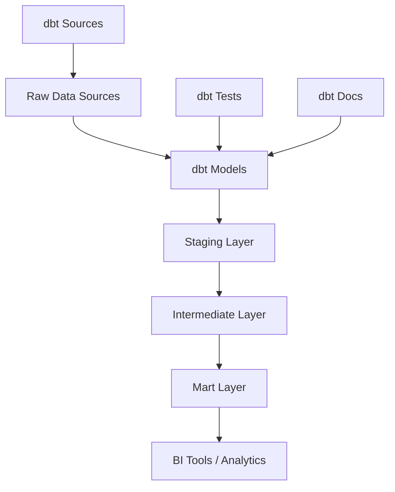
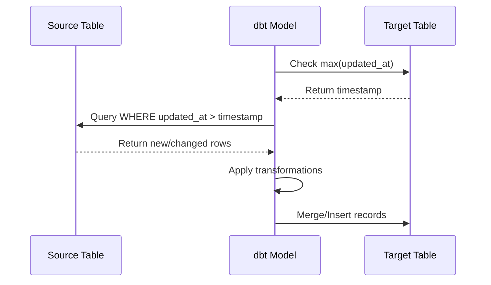

# How to Handle dbt Data Transformations

Author: [nawazdhandala](https://www.github.com/nawazdhandala)

Tags: dbt, Data Engineering, SQL, Data Transformations, Analytics, ELT

Description: Learn how to handle dbt data transformations effectively, including models, tests, incremental processing, and best practices for building reliable data pipelines.

---

dbt (data build tool) has become the standard for transforming data in modern analytics workflows. It allows data teams to write SQL-based transformations that are version-controlled, tested, and documented. This guide covers practical approaches to handling dbt transformations effectively.

---

## Understanding dbt Architecture



---

## Project Structure

A well-organized dbt project follows a layered approach:

```
my_dbt_project/
├── dbt_project.yml
├── models/
│   ├── staging/
│   │   ├── stg_customers.sql
│   │   ├── stg_orders.sql
│   │   └── _staging__models.yml
│   ├── intermediate/
│   │   ├── int_customer_orders.sql
│   │   └── _intermediate__models.yml
│   └── marts/
│       ├── dim_customers.sql
│       ├── fct_orders.sql
│       └── _marts__models.yml
├── macros/
│   └── generate_schema_name.sql
├── tests/
│   └── custom_tests.sql
└── seeds/
    └── country_codes.csv
```

---

## Creating Staging Models

Staging models clean and standardize raw data:

```sql
-- models/staging/stg_customers.sql

-- This model standardizes customer data from the raw source
-- Apply consistent naming conventions and basic transformations

with source as (
    select * from {{ source('raw_db', 'customers') }}
),

renamed as (
    select
        -- Primary key
        id as customer_id,

        -- Standardize names
        trim(lower(first_name)) as first_name,
        trim(lower(last_name)) as last_name,
        trim(lower(email)) as email,

        -- Convert timestamps to consistent timezone
        convert_timezone('UTC', created_at) as created_at_utc,
        convert_timezone('UTC', updated_at) as updated_at_utc,

        -- Clean status values
        case
            when status in ('active', 'ACTIVE', 'Active') then 'active'
            when status in ('inactive', 'INACTIVE', 'Inactive') then 'inactive'
            else 'unknown'
        end as status,

        -- Add metadata
        current_timestamp() as _loaded_at

    from source
    where id is not null  -- Remove null primary keys
)

select * from renamed
```

---

## Building Intermediate Models

Intermediate models join and transform staging data:

```sql
-- models/intermediate/int_customer_orders.sql

-- Aggregate order data at the customer level
-- This model prepares data for the final customer dimension

{{ config(
    materialized='table',
    tags=['daily']
) }}

with customers as (
    select * from {{ ref('stg_customers') }}
),

orders as (
    select * from {{ ref('stg_orders') }}
),

-- Calculate customer order metrics
customer_order_metrics as (
    select
        customer_id,
        count(*) as total_orders,
        sum(order_amount) as lifetime_value,
        min(order_date) as first_order_date,
        max(order_date) as last_order_date,
        avg(order_amount) as avg_order_value,
        count(case when order_status = 'completed' then 1 end) as completed_orders,
        count(case when order_status = 'refunded' then 1 end) as refunded_orders
    from orders
    group by customer_id
),

-- Join customers with their order metrics
final as (
    select
        c.customer_id,
        c.first_name,
        c.last_name,
        c.email,
        c.status,
        c.created_at_utc as customer_created_at,

        -- Order metrics with defaults for customers with no orders
        coalesce(m.total_orders, 0) as total_orders,
        coalesce(m.lifetime_value, 0) as lifetime_value,
        m.first_order_date,
        m.last_order_date,
        coalesce(m.avg_order_value, 0) as avg_order_value,
        coalesce(m.completed_orders, 0) as completed_orders,
        coalesce(m.refunded_orders, 0) as refunded_orders,

        -- Calculate days since last order
        datediff('day', m.last_order_date, current_date()) as days_since_last_order

    from customers c
    left join customer_order_metrics m on c.customer_id = m.customer_id
)

select * from final
```

---

## Incremental Models

For large datasets, incremental models process only new or changed data:

```sql
-- models/marts/fct_orders.sql

-- Incremental fact table for orders
-- Only processes new records since the last run

{{ config(
    materialized='incremental',
    unique_key='order_id',
    incremental_strategy='merge',
    on_schema_change='append_new_columns'
) }}

with orders as (
    select * from {{ ref('stg_orders') }}

    
    -- Only get records newer than the max in the current table
    where updated_at_utc > (
        select max(updated_at_utc) from {{ this }}
    )
    
),

enriched as (
    select
        o.order_id,
        o.customer_id,
        o.product_id,
        o.order_amount,
        o.order_status,
        o.order_date,
        o.created_at_utc,
        o.updated_at_utc,

        -- Add derived columns
        extract(year from o.order_date) as order_year,
        extract(month from o.order_date) as order_month,
        extract(dow from o.order_date) as order_day_of_week,

        -- Categorize order size
        case
            when o.order_amount < 50 then 'small'
            when o.order_amount < 200 then 'medium'
            when o.order_amount < 500 then 'large'
            else 'enterprise'
        end as order_size_category

    from orders o
)

select * from enriched
```

---

## Data Flow for Incremental Processing



---

## Creating Reusable Macros

Macros help avoid code duplication:

```sql
-- macros/cents_to_dollars.sql


    round({{ column_name }} / 100.0, {{ decimal_places }})


-- macros/generate_date_spine.sql


    with date_spine as (
        {{ dbt_utils.date_spine(
            datepart="day",
            start_date="cast('" ~ start_date ~ "' as date)",
            end_date="cast('" ~ end_date ~ "' as date)"
        ) }}
    )
    select cast(date_day as date) as calendar_date
    from date_spine


-- macros/safe_divide.sql


    case
        when {{ denominator }} = 0 then {{ default }}
        when {{ denominator }} is null then {{ default }}
        else {{ numerator }} / {{ denominator }}
    end

```

Using macros in models:

```sql
-- models/marts/fct_orders.sql

select
    order_id,
    customer_id,
    {{ cents_to_dollars('order_amount_cents') }} as order_amount,
    {{ safe_divide('discount_amount', 'order_amount') }} as discount_rate
from {{ ref('stg_orders') }}
```

---

## Testing Your Models

Define tests in YAML schema files:

```yaml
# models/marts/_marts__models.yml

version: 2

models:
  - name: fct_orders
    description: "Order fact table with enriched attributes"
    columns:
      - name: order_id
        description: "Primary key for orders"
        tests:
          - unique
          - not_null

      - name: customer_id
        description: "Foreign key to dim_customers"
        tests:
          - not_null
          - relationships:
              to: ref('dim_customers')
              field: customer_id

      - name: order_amount
        description: "Order amount in dollars"
        tests:
          - not_null
          - dbt_utils.accepted_range:
              min_value: 0
              max_value: 100000

      - name: order_status
        description: "Current order status"
        tests:
          - accepted_values:
              values: ['pending', 'completed', 'shipped', 'refunded', 'cancelled']
```

---

## Custom Tests

Create custom data tests for complex validation:

```sql
-- tests/assert_order_amounts_positive.sql

-- This test fails if any orders have negative amounts
-- which would indicate a data quality issue

select
    order_id,
    order_amount
from {{ ref('fct_orders') }}
where order_amount < 0
```

```sql
-- tests/assert_no_orphan_orders.sql

-- Ensure all orders have a valid customer

select
    o.order_id,
    o.customer_id
from {{ ref('fct_orders') }} o
left join {{ ref('dim_customers') }} c on o.customer_id = c.customer_id
where c.customer_id is null
```

---

## Using Snapshots for Historical Data

Track changes over time with snapshots:

```sql
-- snapshots/customer_snapshot.sql



{{
    config(
        target_schema='snapshots',
        unique_key='customer_id',
        strategy='timestamp',
        updated_at='updated_at_utc',
        invalidate_hard_deletes=True
    )
}}

select * from {{ source('raw_db', 'customers') }}


```

---

## dbt_project.yml Configuration

```yaml
# dbt_project.yml

name: 'my_analytics'
version: '1.0.0'

profile: 'my_warehouse'

model-paths: ["models"]
test-paths: ["tests"]
macro-paths: ["macros"]
snapshot-paths: ["snapshots"]
seed-paths: ["seeds"]

target-path: "target"
clean-targets:
  - "target"
  - "dbt_packages"

vars:
  start_date: '2020-01-01'
  default_currency: 'USD'

models:
  my_analytics:
    staging:
      +materialized: view
      +schema: staging
    intermediate:
      +materialized: table
      +schema: intermediate
    marts:
      +materialized: table
      +schema: marts
      +tags: ['daily', 'bi']
```

---

## Running dbt Commands

```bash
# Install dependencies
dbt deps

# Run all models
dbt run

# Run specific models
dbt run --select staging.stg_customers

# Run models and their downstream dependencies
dbt run --select stg_customers+

# Run only changed models since last run
dbt run --select state:modified+

# Test all models
dbt test

# Test specific model
dbt test --select fct_orders

# Generate and serve documentation
dbt docs generate
dbt docs serve

# Full refresh of incremental models
dbt run --full-refresh --select fct_orders

# Run with debug logging
dbt run --debug
```

---

## Best Practices

1. **Layer your models** - Use staging, intermediate, and mart layers to keep transformations organized and maintainable

2. **Use refs and sources** - Always use `ref()` for model dependencies and `source()` for raw tables to enable lineage tracking

3. **Write tests early** - Add tests as you build models, not as an afterthought

4. **Keep staging models simple** - Only rename columns and apply basic cleaning in staging

5. **Document everything** - Use YAML files to document columns, models, and their business meaning

6. **Use incremental models wisely** - Only use incremental materialization for large tables where full refreshes are too slow

7. **Version control your project** - Treat dbt code like application code with proper git workflows

8. **Monitor model performance** - Track run times and optimize slow models with proper indexing and partitioning

---

*Building data pipelines with dbt? [OneUptime](https://oneuptime.com) helps you monitor pipeline health, track transformation latency, and alert on data quality issues in production.*
