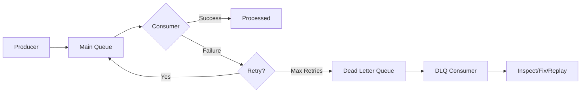

# How to Handle Dead Letter Queues in Python

Author: [nawazdhandala](https://www.github.com/nawazdhandala)

Tags: Python, Message Queues, Dead Letter Queue, RabbitMQ, Error Handling, Reliability, Distributed Systems

Description: Learn how to implement and manage dead letter queues in Python applications. This guide covers DLQ patterns with RabbitMQ, error handling strategies, and building a complete message recovery system.

---

> Messages fail. Services crash. Downstream dependencies become unavailable. Dead letter queues (DLQs) capture these failed messages so you can inspect, fix, and replay them instead of losing data forever. This guide shows you how to build robust DLQ handling in Python.

In distributed systems, message delivery failures are inevitable. A dead letter queue acts as a safety net, catching messages that cannot be processed successfully. Without DLQs, failed messages disappear, and you lose visibility into what went wrong.

---

## Understanding Dead Letter Queues

A dead letter queue receives messages that fail processing in the main queue. Messages typically end up in a DLQ when:

- The consumer explicitly rejects the message
- The message expires (TTL exceeded)
- The queue exceeds its maximum length
- Processing fails after maximum retry attempts



---

## Setting Up RabbitMQ with Dead Letter Exchange

RabbitMQ has native support for dead letter exchanges (DLX). Here's how to configure it:

```python
# dlq_setup.py
# RabbitMQ dead letter queue configuration
import pika
from typing import Optional

class RabbitMQConfig:
    """Configuration for RabbitMQ connections and queues."""

    def __init__(
        self,
        host: str = "localhost",
        port: int = 5672,
        username: str = "guest",
        password: str = "guest",
        virtual_host: str = "/"
    ):
        self.host = host
        self.port = port
        self.credentials = pika.PlainCredentials(username, password)
        self.virtual_host = virtual_host

    def get_connection_params(self) -> pika.ConnectionParameters:
        return pika.ConnectionParameters(
            host=self.host,
            port=self.port,
            credentials=self.credentials,
            virtual_host=self.virtual_host,
            heartbeat=600,  # Keep connection alive
            blocked_connection_timeout=300
        )

def setup_queues_with_dlq(config: RabbitMQConfig) -> None:
    """
    Set up main queue with dead letter exchange.
    Messages that fail processing go to the DLQ automatically.
    """
    connection = pika.BlockingConnection(config.get_connection_params())
    channel = connection.channel()

    # Declare the dead letter exchange
    # This exchange routes failed messages to the DLQ
    channel.exchange_declare(
        exchange="dlx.exchange",
        exchange_type="direct",
        durable=True
    )

    # Declare the dead letter queue
    # Failed messages accumulate here for inspection
    channel.queue_declare(
        queue="orders.dlq",
        durable=True,
        arguments={
            # Messages stay in DLQ for 7 days before expiring
            "x-message-ttl": 7 * 24 * 60 * 60 * 1000
        }
    )

    # Bind DLQ to the dead letter exchange
    channel.queue_bind(
        queue="orders.dlq",
        exchange="dlx.exchange",
        routing_key="orders"
    )

    # Declare the main queue with DLX configuration
    channel.queue_declare(
        queue="orders.main",
        durable=True,
        arguments={
            # When messages are rejected, send to this exchange
            "x-dead-letter-exchange": "dlx.exchange",
            # Use this routing key for dead-lettered messages
            "x-dead-letter-routing-key": "orders",
            # Optional: max retries before dead-lettering
            "x-max-length": 100000,  # Queue capacity
            "x-overflow": "reject-publish"  # Reject new messages when full
        }
    )

    print("Queues configured successfully")
    connection.close()
```

---

## Building a Consumer with Retry Logic

A robust consumer needs to handle failures gracefully, retry transient errors, and dead-letter persistent failures.

```python
# consumer.py
# Message consumer with retry and dead letter handling
import pika
import json
import time
from dataclasses import dataclass
from typing import Callable, Any, Optional
from functools import wraps

@dataclass
class Message:
    """Wrapper for message data and metadata."""
    body: dict
    delivery_tag: int
    retry_count: int = 0
    original_queue: str = ""
    error_history: list = None

    def __post_init__(self):
        if self.error_history is None:
            self.error_history = []

class RetryableError(Exception):
    """Exception that indicates the message should be retried."""
    pass

class PermanentError(Exception):
    """Exception that indicates the message should go to DLQ."""
    pass

class MessageConsumer:
    """
    Consumer that processes messages with automatic retry and DLQ routing.
    Implements exponential backoff for retries.
    """

    def __init__(
        self,
        config: RabbitMQConfig,
        queue_name: str,
        max_retries: int = 3,
        base_delay_seconds: float = 1.0
    ):
        self.config = config
        self.queue_name = queue_name
        self.max_retries = max_retries
        self.base_delay = base_delay_seconds
        self.connection: Optional[pika.BlockingConnection] = None
        self.channel: Optional[pika.channel.Channel] = None
        self._handlers: dict = {}

    def connect(self) -> None:
        """Establish connection to RabbitMQ."""
        self.connection = pika.BlockingConnection(
            self.config.get_connection_params()
        )
        self.channel = self.connection.channel()

        # Only fetch one message at a time for fair distribution
        self.channel.basic_qos(prefetch_count=1)

    def register_handler(self, message_type: str, handler: Callable) -> None:
        """Register a handler function for a specific message type."""
        self._handlers[message_type] = handler

    def _get_retry_count(self, properties: pika.BasicProperties) -> int:
        """Extract retry count from message headers."""
        headers = properties.headers or {}
        return headers.get("x-retry-count", 0)

    def _get_error_history(self, properties: pika.BasicProperties) -> list:
        """Extract error history from message headers."""
        headers = properties.headers or {}
        return headers.get("x-error-history", [])

    def _republish_with_delay(
        self,
        body: bytes,
        properties: pika.BasicProperties,
        retry_count: int,
        error: str
    ) -> None:
        """
        Republish a message for retry with exponential backoff.
        Adds retry metadata to headers.
        """
        # Calculate delay with exponential backoff
        delay = self.base_delay * (2 ** retry_count)
        delay = min(delay, 60)  # Cap at 60 seconds

        # Update headers with retry information
        headers = dict(properties.headers or {})
        headers["x-retry-count"] = retry_count + 1
        headers["x-last-error"] = error
        headers["x-retry-timestamp"] = time.time()

        # Add to error history
        error_history = headers.get("x-error-history", [])
        error_history.append({
            "error": error,
            "timestamp": time.time(),
            "retry": retry_count
        })
        headers["x-error-history"] = error_history

        new_properties = pika.BasicProperties(
            delivery_mode=2,  # Persistent
            content_type=properties.content_type,
            headers=headers
        )

        # Wait before republishing
        time.sleep(delay)

        # Republish to the same queue
        self.channel.basic_publish(
            exchange="",
            routing_key=self.queue_name,
            body=body,
            properties=new_properties
        )

    def _send_to_dlq(
        self,
        body: bytes,
        properties: pika.BasicProperties,
        error: str
    ) -> None:
        """
        Explicitly send a message to the dead letter queue.
        Preserves original message and adds failure metadata.
        """
        headers = dict(properties.headers or {})
        headers["x-final-error"] = error
        headers["x-dead-lettered-at"] = time.time()
        headers["x-original-queue"] = self.queue_name

        dlq_properties = pika.BasicProperties(
            delivery_mode=2,
            content_type=properties.content_type,
            headers=headers
        )

        # Publish to DLQ via the dead letter exchange
        self.channel.basic_publish(
            exchange="dlx.exchange",
            routing_key="orders",
            body=body,
            properties=dlq_properties
        )

    def _process_message(
        self,
        channel: pika.channel.Channel,
        method: pika.spec.Basic.Deliver,
        properties: pika.BasicProperties,
        body: bytes
    ) -> None:
        """
        Process a single message with retry logic.
        Routes to appropriate handler based on message type.
        """
        try:
            # Parse the message body
            data = json.loads(body.decode("utf-8"))
            message_type = data.get("type", "unknown")

            # Get retry count from headers
            retry_count = self._get_retry_count(properties)

            # Find handler for this message type
            handler = self._handlers.get(message_type)
            if not handler:
                raise PermanentError(f"No handler for message type: {message_type}")

            # Process the message
            handler(data)

            # Acknowledge successful processing
            channel.basic_ack(delivery_tag=method.delivery_tag)
            print(f"Successfully processed message: {data.get('id', 'unknown')}")

        except RetryableError as e:
            # Transient error - retry if under limit
            if retry_count < self.max_retries:
                print(f"Retrying message (attempt {retry_count + 1}): {e}")
                channel.basic_ack(delivery_tag=method.delivery_tag)
                self._republish_with_delay(body, properties, retry_count, str(e))
            else:
                print(f"Max retries exceeded, sending to DLQ: {e}")
                channel.basic_ack(delivery_tag=method.delivery_tag)
                self._send_to_dlq(body, properties, f"Max retries exceeded: {e}")

        except PermanentError as e:
            # Permanent error - send directly to DLQ
            print(f"Permanent error, sending to DLQ: {e}")
            channel.basic_ack(delivery_tag=method.delivery_tag)
            self._send_to_dlq(body, properties, str(e))

        except Exception as e:
            # Unexpected error - treat as retryable
            if retry_count < self.max_retries:
                print(f"Unexpected error, retrying: {e}")
                channel.basic_ack(delivery_tag=method.delivery_tag)
                self._republish_with_delay(body, properties, retry_count, str(e))
            else:
                print(f"Max retries exceeded for unexpected error: {e}")
                channel.basic_ack(delivery_tag=method.delivery_tag)
                self._send_to_dlq(body, properties, f"Unexpected error: {e}")

    def start_consuming(self) -> None:
        """Start consuming messages from the queue."""
        self.connect()

        self.channel.basic_consume(
            queue=self.queue_name,
            on_message_callback=self._process_message,
            auto_ack=False  # Manual acknowledgment
        )

        print(f"Waiting for messages on {self.queue_name}...")
        self.channel.start_consuming()

    def stop(self) -> None:
        """Gracefully stop the consumer."""
        if self.channel:
            self.channel.stop_consuming()
        if self.connection:
            self.connection.close()
```

---

## Building a DLQ Processor

The DLQ processor allows you to inspect failed messages and replay them:

```python
# dlq_processor.py
# Dead letter queue processing and replay
import pika
import json
from dataclasses import dataclass
from typing import List, Optional, Callable
from datetime import datetime

@dataclass
class DeadLetteredMessage:
    """Represents a message in the dead letter queue."""
    message_id: str
    body: dict
    original_queue: str
    final_error: str
    error_history: list
    dead_lettered_at: datetime
    retry_count: int
    delivery_tag: int

class DLQProcessor:
    """
    Processor for inspecting and replaying dead-lettered messages.
    Provides tools for debugging and recovery.
    """

    def __init__(self, config: RabbitMQConfig, dlq_name: str = "orders.dlq"):
        self.config = config
        self.dlq_name = dlq_name
        self.connection: Optional[pika.BlockingConnection] = None
        self.channel: Optional[pika.channel.Channel] = None

    def connect(self) -> None:
        """Establish connection to RabbitMQ."""
        self.connection = pika.BlockingConnection(
            self.config.get_connection_params()
        )
        self.channel = self.connection.channel()

    def get_queue_depth(self) -> int:
        """Get the number of messages in the DLQ."""
        result = self.channel.queue_declare(
            queue=self.dlq_name,
            passive=True  # Don't create, just check
        )
        return result.method.message_count

    def peek_messages(self, limit: int = 10) -> List[DeadLetteredMessage]:
        """
        Peek at messages in the DLQ without consuming them.
        Useful for inspection and debugging.
        """
        messages = []

        for _ in range(limit):
            method, properties, body = self.channel.basic_get(
                queue=self.dlq_name,
                auto_ack=False
            )

            if method is None:
                break  # No more messages

            # Parse the message
            data = json.loads(body.decode("utf-8"))
            headers = properties.headers or {}

            message = DeadLetteredMessage(
                message_id=data.get("id", "unknown"),
                body=data,
                original_queue=headers.get("x-original-queue", "unknown"),
                final_error=headers.get("x-final-error", "unknown"),
                error_history=headers.get("x-error-history", []),
                dead_lettered_at=datetime.fromtimestamp(
                    headers.get("x-dead-lettered-at", 0)
                ),
                retry_count=headers.get("x-retry-count", 0),
                delivery_tag=method.delivery_tag
            )
            messages.append(message)

            # Reject without requeue to put it back
            self.channel.basic_nack(
                delivery_tag=method.delivery_tag,
                requeue=True
            )

        return messages

    def replay_message(
        self,
        delivery_tag: int,
        target_queue: Optional[str] = None
    ) -> bool:
        """
        Replay a single message from the DLQ to its original queue.
        Resets retry count and clears error history.
        """
        # Get the specific message
        method, properties, body = self.channel.basic_get(
            queue=self.dlq_name,
            auto_ack=False
        )

        if method is None:
            return False

        headers = properties.headers or {}
        target = target_queue or headers.get("x-original-queue")

        if not target:
            # Can't replay without knowing the target
            self.channel.basic_nack(
                delivery_tag=method.delivery_tag,
                requeue=True
            )
            return False

        # Create new properties without DLQ metadata
        new_headers = {
            "x-replayed-from-dlq": True,
            "x-replayed-at": datetime.utcnow().timestamp()
        }

        new_properties = pika.BasicProperties(
            delivery_mode=2,
            content_type=properties.content_type,
            headers=new_headers
        )

        # Publish to the target queue
        self.channel.basic_publish(
            exchange="",
            routing_key=target,
            body=body,
            properties=new_properties
        )

        # Acknowledge removal from DLQ
        self.channel.basic_ack(delivery_tag=method.delivery_tag)

        return True

    def replay_all(
        self,
        filter_func: Optional[Callable[[DeadLetteredMessage], bool]] = None,
        limit: Optional[int] = None
    ) -> int:
        """
        Replay multiple messages from the DLQ.
        Optionally filter which messages to replay.
        """
        replayed = 0
        processed = 0

        while limit is None or replayed < limit:
            method, properties, body = self.channel.basic_get(
                queue=self.dlq_name,
                auto_ack=False
            )

            if method is None:
                break

            processed += 1

            # Parse for filtering
            data = json.loads(body.decode("utf-8"))
            headers = properties.headers or {}

            message = DeadLetteredMessage(
                message_id=data.get("id", "unknown"),
                body=data,
                original_queue=headers.get("x-original-queue", "unknown"),
                final_error=headers.get("x-final-error", "unknown"),
                error_history=headers.get("x-error-history", []),
                dead_lettered_at=datetime.fromtimestamp(
                    headers.get("x-dead-lettered-at", 0)
                ),
                retry_count=headers.get("x-retry-count", 0),
                delivery_tag=method.delivery_tag
            )

            # Apply filter if provided
            if filter_func and not filter_func(message):
                self.channel.basic_nack(
                    delivery_tag=method.delivery_tag,
                    requeue=True
                )
                continue

            # Replay the message
            target = headers.get("x-original-queue")
            if target:
                new_properties = pika.BasicProperties(
                    delivery_mode=2,
                    content_type=properties.content_type,
                    headers={"x-replayed-from-dlq": True}
                )

                self.channel.basic_publish(
                    exchange="",
                    routing_key=target,
                    body=body,
                    properties=new_properties
                )

                self.channel.basic_ack(delivery_tag=method.delivery_tag)
                replayed += 1
            else:
                self.channel.basic_nack(
                    delivery_tag=method.delivery_tag,
                    requeue=True
                )

        return replayed

    def purge_old_messages(self, older_than_days: int = 7) -> int:
        """
        Remove messages older than a certain age from the DLQ.
        Use with caution - these messages will be lost.
        """
        cutoff = datetime.utcnow().timestamp() - (older_than_days * 24 * 60 * 60)
        purged = 0

        while True:
            method, properties, body = self.channel.basic_get(
                queue=self.dlq_name,
                auto_ack=False
            )

            if method is None:
                break

            headers = properties.headers or {}
            dead_lettered_at = headers.get("x-dead-lettered-at", 0)

            if dead_lettered_at < cutoff:
                # Message is old enough to purge
                self.channel.basic_ack(delivery_tag=method.delivery_tag)
                purged += 1
            else:
                # Message is too recent, put it back
                self.channel.basic_nack(
                    delivery_tag=method.delivery_tag,
                    requeue=True
                )
                break  # Messages are roughly ordered by age

        return purged

    def close(self) -> None:
        """Close the connection."""
        if self.connection:
            self.connection.close()
```

---

## Example Usage

Here's a complete example showing the system in action:

```python
# example_usage.py
# Complete example of DLQ handling
import json
import time
from dlq_setup import RabbitMQConfig, setup_queues_with_dlq
from consumer import MessageConsumer, RetryableError, PermanentError
from dlq_processor import DLQProcessor

# Configuration
config = RabbitMQConfig(
    host="localhost",
    port=5672,
    username="guest",
    password="guest"
)

# Set up queues
setup_queues_with_dlq(config)

# Define message handlers
def process_order(data: dict) -> None:
    """
    Process an order message.
    Demonstrates different failure scenarios.
    """
    order_id = data.get("order_id")

    # Simulate different failure scenarios
    if data.get("force_retry"):
        raise RetryableError("Temporary database connection error")

    if data.get("force_dlq"):
        raise PermanentError("Invalid order format")

    # Simulate random failures (10% chance)
    import random
    if random.random() < 0.1:
        raise RetryableError("Random transient failure")

    print(f"Successfully processed order: {order_id}")

# Start consumer
consumer = MessageConsumer(
    config=config,
    queue_name="orders.main",
    max_retries=3,
    base_delay_seconds=1.0
)

consumer.register_handler("order.created", process_order)
consumer.register_handler("order.updated", process_order)

# In production, you would start this in a separate process
# consumer.start_consuming()

# DLQ management example
def inspect_and_replay_dlq():
    """Inspect DLQ and replay messages that might succeed now."""
    processor = DLQProcessor(config)
    processor.connect()

    # Check queue depth
    depth = processor.get_queue_depth()
    print(f"DLQ contains {depth} messages")

    # Peek at messages
    messages = processor.peek_messages(limit=5)
    for msg in messages:
        print(f"Message {msg.message_id}:")
        print(f"  Error: {msg.final_error}")
        print(f"  Dead-lettered at: {msg.dead_lettered_at}")
        print(f"  Retries: {msg.retry_count}")

    # Replay messages that failed due to transient errors
    def should_replay(msg):
        return "transient" in msg.final_error.lower() or \
               "temporary" in msg.final_error.lower()

    replayed = processor.replay_all(filter_func=should_replay)
    print(f"Replayed {replayed} messages")

    processor.close()
```

---

## Monitoring DLQ Health

```python
# dlq_monitoring.py
# Metrics and alerting for DLQ
from dataclasses import dataclass
from typing import Dict, List
from datetime import datetime, timedelta

@dataclass
class DLQMetrics:
    """Metrics for DLQ health monitoring."""
    queue_depth: int
    oldest_message_age_hours: float
    messages_per_hour: float
    top_errors: List[Dict[str, int]]

def collect_dlq_metrics(processor: DLQProcessor) -> DLQMetrics:
    """Collect metrics from the DLQ for monitoring."""
    depth = processor.get_queue_depth()
    messages = processor.peek_messages(limit=100)

    # Calculate oldest message age
    oldest_age_hours = 0
    if messages:
        oldest = min(m.dead_lettered_at for m in messages)
        age = datetime.utcnow() - oldest
        oldest_age_hours = age.total_seconds() / 3600

    # Count error types
    error_counts: Dict[str, int] = {}
    for msg in messages:
        error = msg.final_error
        error_counts[error] = error_counts.get(error, 0) + 1

    top_errors = [
        {"error": k, "count": v}
        for k, v in sorted(error_counts.items(), key=lambda x: -x[1])[:5]
    ]

    return DLQMetrics(
        queue_depth=depth,
        oldest_message_age_hours=oldest_age_hours,
        messages_per_hour=0,  # Would need historical data
        top_errors=top_errors
    )
```

---

## Best Practices

### 1. Preserve Message Context

Always include original queue, timestamp, and error history in DLQ messages for debugging.

### 2. Set TTL on DLQ

Messages in the DLQ should eventually expire. A week is usually sufficient for investigation.

### 3. Alert on DLQ Growth

Monitor DLQ depth and alert when it exceeds thresholds. A growing DLQ indicates systematic problems.

### 4. Categorize Errors

Distinguish between retryable (transient) and permanent errors. Only retry what might succeed.

### 5. Automate Replay for Known Issues

After fixing a bug, replay affected messages automatically rather than manually.

---

## Conclusion

Dead letter queues are essential for building reliable message-driven systems. Key takeaways:

- Configure DLX at the queue level for automatic routing of failed messages
- Implement retry logic with exponential backoff before dead-lettering
- Preserve error context for debugging
- Build tools for inspection and replay
- Monitor DLQ health and alert on anomalies

A well-designed DLQ strategy turns message failures from data loss into recoverable events.

---

*Running message queues in production? [OneUptime](https://oneuptime.com) monitors queue depths, consumer health, and dead letter rates to catch problems before they escalate.*

**Related Reading:**
- [How to Implement Event-Driven Architecture in Python](https://oneuptime.com/blog/post/2025-01-06-python-event-driven-architecture/view)
- [How to Build a Graceful Shutdown Handler in Python](https://oneuptime.com/blog/post/2025-01-06-python-graceful-shutdown-kubernetes/view)
