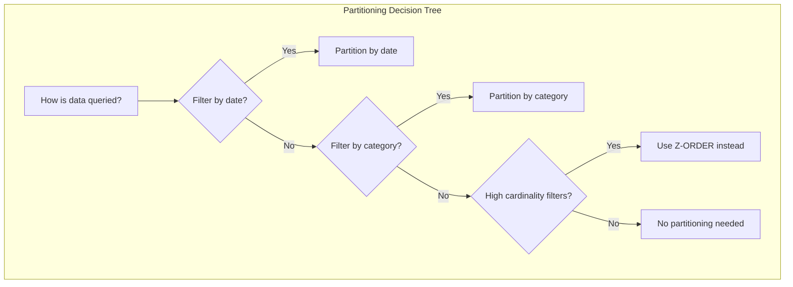
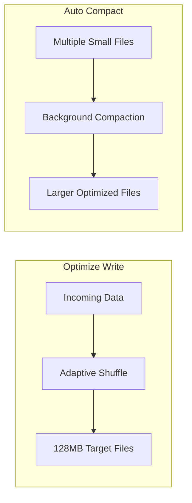

# How to Configure Delta Lake Tables

Author: [nawazdhandala](https://www.github.com/nawazdhandala)

Tags: Delta Lake, Apache Spark, Data Engineering, Databricks, Data Lakehouse, ACID Transactions, Table Optimization

Description: Learn how to configure Delta Lake tables for optimal performance including partitioning strategies, Z-ordering, vacuum settings, and schema evolution.

---

> Delta Lake brings ACID transactions, scalable metadata handling, and unified batch/streaming to your data lake. But to get the best performance, you need to configure your tables properly for your specific workload patterns.

This guide covers essential Delta Lake configurations from table creation to ongoing maintenance.

---

## Creating Delta Tables

Start with proper table design by choosing appropriate partitioning and data types.

```python
from pyspark.sql import SparkSession
from pyspark.sql.functions import col, year, month, to_date
from delta.tables import DeltaTable

spark = SparkSession.builder \
    .appName("DeltaLakeConfig") \
    .config("spark.sql.extensions", "io.delta.sql.DeltaSparkSessionExtension") \
    .config("spark.sql.catalog.spark_catalog", "org.apache.spark.sql.delta.catalog.DeltaCatalog") \
    .getOrCreate()

# Create a partitioned Delta table
df = spark.read.parquet("/raw/transactions")

# Add partition columns if needed
df_with_partitions = df \
    .withColumn("year", year(col("transaction_date"))) \
    .withColumn("month", month(col("transaction_date")))

# Write as Delta table with partitioning
df_with_partitions.write \
    .format("delta") \
    .partitionBy("year", "month") \
    .option("overwriteSchema", "true") \
    .mode("overwrite") \
    .save("/delta/transactions")
```

### Using SQL DDL

```sql
-- Create managed Delta table
CREATE TABLE transactions (
    transaction_id STRING,
    customer_id STRING,
    amount DECIMAL(18, 2),
    transaction_date DATE,
    category STRING,
    year INT GENERATED ALWAYS AS (YEAR(transaction_date)),
    month INT GENERATED ALWAYS AS (MONTH(transaction_date))
)
USING DELTA
PARTITIONED BY (year, month)
LOCATION '/delta/transactions'
TBLPROPERTIES (
    'delta.autoOptimize.optimizeWrite' = 'true',
    'delta.autoOptimize.autoCompact' = 'true',
    'delta.logRetentionDuration' = 'interval 30 days',
    'delta.deletedFileRetentionDuration' = 'interval 7 days'
);
```

---

## Partitioning Strategies

Choose partitioning based on your query patterns and data volume.



### Partition Size Guidelines

```python
def analyze_partition_strategy(df, candidate_columns):
    """
    Analyze potential partition columns and recommend strategy.
    """
    total_rows = df.count()
    total_size_gb = df.rdd.map(lambda row: len(str(row))).sum() / (1024**3)

    recommendations = []

    for column in candidate_columns:
        distinct_values = df.select(column).distinct().count()

        # Calculate average partition size
        avg_rows_per_partition = total_rows / distinct_values
        avg_size_per_partition_mb = (total_size_gb * 1024) / distinct_values

        # Ideal partition size is 128MB - 1GB
        if avg_size_per_partition_mb < 32:
            status = "TOO_SMALL - will create too many small files"
        elif avg_size_per_partition_mb > 2048:
            status = "TOO_LARGE - consider adding secondary partition"
        else:
            status = "GOOD"

        recommendations.append({
            "column": column,
            "distinct_values": distinct_values,
            "avg_partition_size_mb": avg_size_per_partition_mb,
            "status": status
        })

        print(f"Column: {column}")
        print(f"  Distinct values: {distinct_values:,}")
        print(f"  Avg partition size: {avg_size_per_partition_mb:.0f} MB")
        print(f"  Status: {status}")
        print()

    return recommendations

# Analyze potential partition columns
analyze_partition_strategy(df, ["transaction_date", "category", "region"])
```

### Composite Partitioning

```python
# For large tables, use composite partitioning
# Example: 1 billion rows over 5 years

df.write \
    .format("delta") \
    .partitionBy("year", "month", "day") \
    .mode("overwrite") \
    .save("/delta/large_transactions")

# Query pattern benefits from partition pruning
spark.sql("""
    SELECT * FROM delta.`/delta/large_transactions`
    WHERE year = 2025 AND month = 12 AND day = 25
""")  # Only reads one partition
```

---

## Z-Ordering for Query Optimization

Z-ordering colocates related data in the same files, dramatically improving query performance on non-partition columns.

```python
from delta.tables import DeltaTable

# Load existing Delta table
delta_table = DeltaTable.forPath(spark, "/delta/transactions")

# Optimize with Z-ORDER on frequently filtered columns
delta_table.optimize().zOrderBy("customer_id", "category").executeCompaction()

# Or use SQL
spark.sql("""
    OPTIMIZE delta.`/delta/transactions`
    ZORDER BY (customer_id, category)
""")
```

### When to Use Z-ORDER

```python
# Z-ORDER is beneficial when:
# 1. You filter on high-cardinality columns
# 2. Columns are not suitable for partitioning (too many distinct values)
# 3. Queries filter on multiple columns together

# Example: customer_id has millions of values (can't partition)
# but queries often filter by customer_id

# Before Z-ORDER: scans all files
spark.sql("""
    SELECT * FROM transactions
    WHERE customer_id = 'cust_12345'
""").explain()

# After Z-ORDER: scans only relevant files
# Data skip statistics allow Spark to skip files
```

### Z-ORDER Best Practices

```python
# Choose Z-ORDER columns wisely
# - Max 4 columns (effectiveness decreases with more)
# - Highest selectivity columns first
# - Columns frequently used together in WHERE clauses

# Good Z-ORDER strategy
delta_table.optimize() \
    .zOrderBy("customer_id") \  # Primary filter column
    .executeCompaction()

# For multiple columns commonly filtered together
delta_table.optimize() \
    .zOrderBy("customer_id", "transaction_date") \
    .executeCompaction()
```

---

## Auto Optimization Settings

Enable automatic file optimization to maintain table health.

```python
# Enable auto-optimize at table level
spark.sql("""
    ALTER TABLE transactions SET TBLPROPERTIES (
        'delta.autoOptimize.optimizeWrite' = 'true',
        'delta.autoOptimize.autoCompact' = 'true'
    )
""")

# Or set globally for all new tables
spark.conf.set("spark.databricks.delta.optimizeWrite.enabled", "true")
spark.conf.set("spark.databricks.delta.autoCompact.enabled", "true")
```

### Understanding Auto-Optimize



```python
# Configure auto-compact threshold
spark.conf.set("spark.databricks.delta.autoCompact.minNumFiles", "50")

# Configure target file size (in bytes)
spark.sql("""
    ALTER TABLE transactions SET TBLPROPERTIES (
        'delta.targetFileSize' = '134217728'  -- 128MB
    )
""")
```

---

## Schema Evolution

Configure how Delta Lake handles schema changes.

```python
# Enable automatic schema evolution for new columns
spark.conf.set("spark.databricks.delta.schema.autoMerge.enabled", "true")

# Write data with new columns - they will be added automatically
new_data_with_extra_column = existing_df.withColumn("new_feature", lit("value"))

new_data_with_extra_column.write \
    .format("delta") \
    .mode("append") \
    .option("mergeSchema", "true") \
    .save("/delta/transactions")
```

### Schema Evolution Modes

```python
# Strict mode (default) - reject schema changes
df.write.format("delta") \
    .mode("append") \
    .save("/delta/strict_table")

# Merge mode - add new columns automatically
df.write.format("delta") \
    .mode("append") \
    .option("mergeSchema", "true") \
    .save("/delta/flexible_table")

# Overwrite mode - replace schema entirely
df.write.format("delta") \
    .mode("overwrite") \
    .option("overwriteSchema", "true") \
    .save("/delta/replaced_table")
```

### Column Mapping for Renames and Drops

```python
# Enable column mapping for advanced schema evolution
spark.sql("""
    ALTER TABLE transactions SET TBLPROPERTIES (
        'delta.columnMapping.mode' = 'name',
        'delta.minReaderVersion' = '2',
        'delta.minWriterVersion' = '5'
    )
""")

# Now you can rename columns
spark.sql("ALTER TABLE transactions RENAME COLUMN old_name TO new_name")

# And drop columns
spark.sql("ALTER TABLE transactions DROP COLUMN unused_column")
```

---

## Vacuum and Retention Settings

Configure how long Delta Lake retains old data versions.

```python
# Set retention periods
spark.sql("""
    ALTER TABLE transactions SET TBLPROPERTIES (
        'delta.logRetentionDuration' = 'interval 30 days',
        'delta.deletedFileRetentionDuration' = 'interval 7 days'
    )
""")

# Run vacuum to remove old files
delta_table = DeltaTable.forPath(spark, "/delta/transactions")

# Vacuum files older than 7 days (default)
delta_table.vacuum()

# Vacuum with custom retention (hours)
delta_table.vacuum(168)  # 7 days = 168 hours

# WARNING: Disable safety check only if you understand the implications
# This allows vacuuming files newer than retention period
spark.conf.set("spark.databricks.delta.retentionDurationCheck.enabled", "false")
delta_table.vacuum(0)  # Remove all unreferenced files immediately
```

### Scheduled Maintenance

```python
from datetime import datetime, timedelta

def run_table_maintenance(table_path: str, z_order_columns: list = None):
    """
    Run comprehensive table maintenance including optimize and vacuum.
    """
    delta_table = DeltaTable.forPath(spark, table_path)

    print(f"Starting maintenance for {table_path}")
    print(f"Timestamp: {datetime.now()}")

    # Get table statistics before
    detail_before = spark.sql(f"DESCRIBE DETAIL delta.`{table_path}`").collect()[0]
    files_before = detail_before["numFiles"]
    size_before = detail_before["sizeInBytes"]

    print(f"Before: {files_before} files, {size_before / (1024**3):.2f} GB")

    # Run optimize with optional Z-ORDER
    if z_order_columns:
        delta_table.optimize().zOrderBy(*z_order_columns).executeCompaction()
    else:
        delta_table.optimize().executeCompaction()

    # Run vacuum
    delta_table.vacuum(168)  # 7 days retention

    # Get statistics after
    detail_after = spark.sql(f"DESCRIBE DETAIL delta.`{table_path}`").collect()[0]
    files_after = detail_after["numFiles"]
    size_after = detail_after["sizeInBytes"]

    print(f"After: {files_after} files, {size_after / (1024**3):.2f} GB")
    print(f"Files reduced: {files_before - files_after}")
    print(f"Space reclaimed: {(size_before - size_after) / (1024**3):.2f} GB")

# Run maintenance
run_table_maintenance(
    "/delta/transactions",
    z_order_columns=["customer_id", "category"]
)
```

---

## Performance Tuning Properties

```python
# Comprehensive table properties for production
spark.sql("""
    ALTER TABLE transactions SET TBLPROPERTIES (
        -- Auto optimization
        'delta.autoOptimize.optimizeWrite' = 'true',
        'delta.autoOptimize.autoCompact' = 'true',

        -- File sizing
        'delta.targetFileSize' = '134217728',  -- 128MB target
        'delta.tuneFileSizesForRewrites' = 'true',

        -- Data skipping
        'delta.dataSkippingNumIndexedCols' = '32',  -- Index more columns

        -- Checkpoint
        'delta.checkpointInterval' = '10',  -- Checkpoint every 10 commits

        -- Retention
        'delta.logRetentionDuration' = 'interval 30 days',
        'delta.deletedFileRetentionDuration' = 'interval 7 days',

        -- Compatibility
        'delta.minReaderVersion' = '1',
        'delta.minWriterVersion' = '2'
    )
""")
```

---

## Monitoring Table Health

```python
def get_table_health_report(table_path: str):
    """
    Generate a health report for a Delta table.
    """
    # Table details
    detail = spark.sql(f"DESCRIBE DETAIL delta.`{table_path}`").collect()[0]

    # History for recent operations
    history = spark.sql(f"DESCRIBE HISTORY delta.`{table_path}` LIMIT 10").collect()

    # Calculate metrics
    num_files = detail["numFiles"]
    size_bytes = detail["sizeInBytes"]
    avg_file_size_mb = (size_bytes / num_files / (1024**2)) if num_files > 0 else 0

    report = {
        "table_path": table_path,
        "num_files": num_files,
        "total_size_gb": size_bytes / (1024**3),
        "avg_file_size_mb": avg_file_size_mb,
        "partitioning": detail["partitionColumns"],
        "last_modified": detail["lastModified"],
        "recent_operations": [h["operation"] for h in history[:5]]
    }

    # Health warnings
    warnings = []

    if avg_file_size_mb < 32:
        warnings.append("Small file problem detected - run OPTIMIZE")

    if avg_file_size_mb > 1024:
        warnings.append("Large files detected - consider increasing partitioning")

    if num_files > 10000:
        warnings.append("High file count - run OPTIMIZE and VACUUM")

    # Check for recent optimize operations
    recent_optimize = any(h["operation"] == "OPTIMIZE" for h in history)
    if not recent_optimize:
        warnings.append("No recent OPTIMIZE - consider scheduling maintenance")

    report["warnings"] = warnings
    report["health_status"] = "HEALTHY" if not warnings else "NEEDS_ATTENTION"

    return report

# Generate report
health = get_table_health_report("/delta/transactions")
print(f"Health Status: {health['health_status']}")
for warning in health['warnings']:
    print(f"  WARNING: {warning}")
```

---

## Best Practices Summary

1. **Partition wisely** - Target 128MB-1GB partition sizes
2. **Use Z-ORDER** - For high-cardinality filter columns
3. **Enable auto-optimize** - Keep files well-sized automatically
4. **Schedule maintenance** - Regular OPTIMIZE and VACUUM
5. **Set appropriate retention** - Balance time travel needs with storage costs
6. **Monitor table health** - Track file count and sizes
7. **Use column mapping** - For flexible schema evolution

---

*Managing production Delta Lake tables? [OneUptime](https://oneuptime.com) provides comprehensive monitoring for data platforms with automated alerting on table health metrics.*

**Related Reading:**
- [How to Handle Databricks Workflows](https://oneuptime.com/blog/post/2026-01-24-databricks-workflows/view)
- [How to Fix "Data Skew" Issues in Spark](https://oneuptime.com/blog/post/2026-01-24-spark-data-skew/view)
