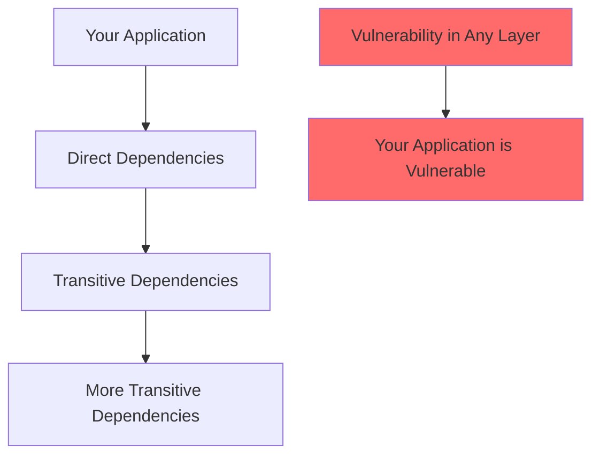
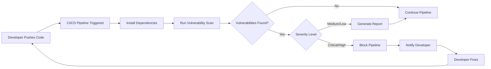
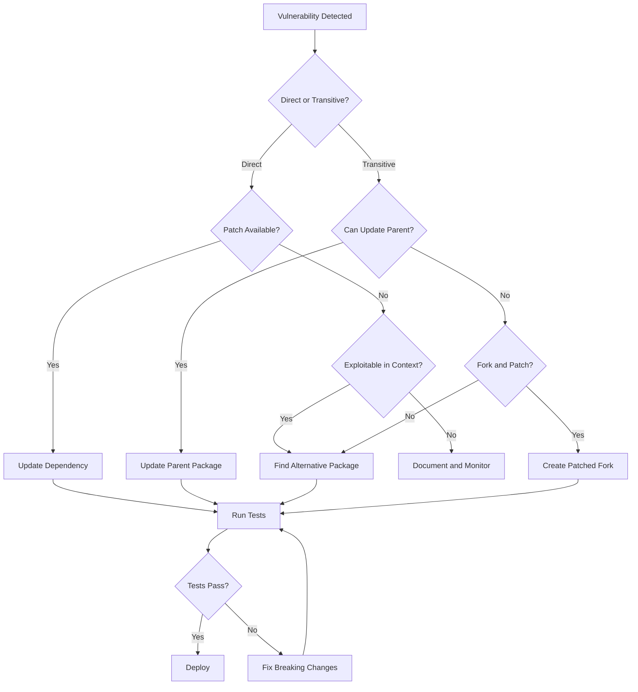

# How to Handle Dependency Vulnerability Scanning

Author: [nawazdhandala](https://www.github.com/nawazdhandala)

Tags: Security, Dependencies, Vulnerability, DevSecOps, CI/CD, npm, pip, Supply Chain

Description: Learn how to implement dependency vulnerability scanning in your development workflow to identify and remediate security issues in third-party packages.

---

Modern applications rely heavily on third-party dependencies. A typical Node.js project can have hundreds or even thousands of packages in its dependency tree. Each of these packages represents a potential security risk. Dependency vulnerability scanning helps you identify and fix security issues before they become breaches.

---

## Why Dependency Scanning Matters



Real-world incidents like the Log4Shell vulnerability (CVE-2021-44228) demonstrated how a single vulnerable dependency can affect millions of applications. The average JavaScript project has over 1,000 transitive dependencies, and you need visibility into all of them.

---

## Setting Up npm Audit

For Node.js projects, npm includes built-in vulnerability scanning:

```bash
# Run a basic audit
npm audit

# Get JSON output for CI/CD integration
npm audit --json

# Only check production dependencies
npm audit --production

# Automatically fix vulnerabilities where possible
npm audit fix

# Force fixes that may include breaking changes
npm audit fix --force
```

### Interpreting npm Audit Results

```json
{
  "vulnerabilities": {
    "lodash": {
      "name": "lodash",
      "severity": "high",
      "via": [
        {
          "source": 1085097,
          "name": "lodash",
          "dependency": "lodash",
          "title": "Prototype Pollution",
          "url": "https://github.com/advisories/GHSA-p6mc-m468-83gw",
          "severity": "high",
          "range": "<4.17.21"
        }
      ],
      "effects": ["package-a", "package-b"],
      "range": "<=4.17.20",
      "fixAvailable": {
        "name": "lodash",
        "version": "4.17.21"
      }
    }
  }
}
```

---

## Python Dependency Scanning with pip-audit

```bash
# Install pip-audit
pip install pip-audit

# Scan current environment
pip-audit

# Scan a requirements file
pip-audit -r requirements.txt

# Output in JSON format
pip-audit --format json -o vulnerabilities.json

# Automatically fix vulnerabilities
pip-audit --fix
```

### Creating a Secure Requirements Workflow

```python
# requirements.txt - Pin exact versions for reproducibility
requests==2.31.0
django==4.2.7
cryptography==41.0.7

# requirements-dev.txt - Development dependencies
-r requirements.txt
pip-audit==2.6.1
safety==2.3.5
bandit==1.7.6
```

```bash
#!/bin/bash
# scripts/check-dependencies.sh

set -e

echo "Running pip-audit..."
pip-audit -r requirements.txt --strict

echo "Running safety check..."
safety check -r requirements.txt

echo "All dependency checks passed!"
```

---

## Integrating with CI/CD

### GitHub Actions Example

```yaml
# .github/workflows/security-scan.yml
name: Security Scan

on:
  push:
    branches: [main]
  pull_request:
    branches: [main]
  schedule:
    # Run daily at midnight
    - cron: '0 0 * * *'

jobs:
  dependency-scan:
    runs-on: ubuntu-latest
    steps:
      - uses: actions/checkout@v4

      - name: Setup Node.js
        uses: actions/setup-node@v4
        with:
          node-version: '20'

      - name: Install dependencies
        run: npm ci

      - name: Run npm audit
        run: npm audit --audit-level=high
        continue-on-error: true

      - name: Run Snyk scan
        uses: snyk/actions/node@master
        env:
          SNYK_TOKEN: ${{ secrets.SNYK_TOKEN }}
        with:
          args: --severity-threshold=high

  python-scan:
    runs-on: ubuntu-latest
    steps:
      - uses: actions/checkout@v4

      - name: Setup Python
        uses: actions/setup-python@v5
        with:
          python-version: '3.11'

      - name: Install dependencies
        run: |
          pip install pip-audit
          pip install -r requirements.txt

      - name: Run pip-audit
        run: pip-audit --strict
```

---

## Scanning Flow



---

## Using Dependabot for Automated Updates

Create a Dependabot configuration to automatically create PRs for vulnerable dependencies:

```yaml
# .github/dependabot.yml
version: 2
updates:
  # JavaScript/npm dependencies
  - package-ecosystem: "npm"
    directory: "/"
    schedule:
      interval: "daily"
    open-pull-requests-limit: 10
    labels:
      - "dependencies"
      - "security"
    # Group minor and patch updates
    groups:
      production-dependencies:
        patterns:
          - "*"
        exclude-patterns:
          - "@types/*"
          - "eslint*"

  # Python dependencies
  - package-ecosystem: "pip"
    directory: "/"
    schedule:
      interval: "daily"
    labels:
      - "dependencies"
      - "python"

  # Docker base images
  - package-ecosystem: "docker"
    directory: "/"
    schedule:
      interval: "weekly"
```

---

## Advanced Scanning with Snyk

```javascript
// snyk.config.js
module.exports = {
    // Fail on high and critical vulnerabilities
    severityThreshold: 'high',

    // Ignore specific vulnerabilities with expiration
    ignore: {
        'SNYK-JS-LODASH-567746': {
            reason: 'No direct exposure, fix scheduled for Q2',
            expires: '2026-04-01'
        }
    },

    // Custom rules
    rules: {
        'no-vulnerable-licenses': {
            severity: 'medium',
            licenses: ['GPL-3.0', 'AGPL-3.0']
        }
    }
};
```

### CLI Usage

```bash
# Install Snyk CLI
npm install -g snyk

# Authenticate
snyk auth

# Test for vulnerabilities
snyk test

# Monitor project for new vulnerabilities
snyk monitor

# Test container images
snyk container test your-image:tag

# Test infrastructure as code
snyk iac test ./terraform/
```

---

## Handling Vulnerability Reports

When a vulnerability is found, follow this decision tree:



---

## Creating a Vulnerability Policy

```yaml
# vulnerability-policy.yml
# Define how your organization handles vulnerabilities

severity_thresholds:
  critical:
    action: block_deployment
    sla_hours: 24
    notify:
      - security-team@company.com
      - oncall@company.com

  high:
    action: block_deployment
    sla_hours: 72
    notify:
      - security-team@company.com

  medium:
    action: warn
    sla_days: 30
    notify:
      - dev-team@company.com

  low:
    action: log
    sla_days: 90
    notify: []

exceptions:
  # Documented exceptions for vulnerabilities that cannot be immediately fixed
  - id: CVE-2023-XXXXX
    reason: "No patch available, mitigated by WAF rules"
    approved_by: "security-lead"
    expires: "2026-06-01"
    compensating_controls:
      - "WAF rule blocking malicious payloads"
      - "Input validation at application layer"
```

---

## Scanning Private Registries

For organizations using private npm registries or PyPI mirrors:

```bash
# Configure npm for private registry
npm config set registry https://npm.yourcompany.com/

# Audit still works with private registries
npm audit

# For pip with private PyPI
pip-audit --index-url https://pypi.yourcompany.com/simple/
```

---

## Software Bill of Materials (SBOM)

Generate an SBOM for compliance and auditing:

```bash
# Generate SBOM with CycloneDX for Node.js
npx @cyclonedx/cyclonedx-npm --output-file sbom.json

# Generate SBOM for Python
pip install cyclonedx-bom
cyclonedx-py requirements > sbom.xml

# Scan SBOM for vulnerabilities
grype sbom:./sbom.json
```

---

## Monitoring in Production

```python
# Example: Track dependency versions in production
import pkg_resources
import json
import requests

def report_dependencies():
    """Report installed packages to security monitoring service"""
    dependencies = []

    for package in pkg_resources.working_set:
        dependencies.append({
            "name": package.project_name,
            "version": package.version,
            "location": package.location
        })

    # Send to monitoring service
    requests.post(
        "https://security.yourcompany.com/api/dependencies",
        json={
            "service": "my-service",
            "environment": "production",
            "dependencies": dependencies
        },
        headers={"Authorization": f"Bearer {API_TOKEN}"}
    )

# Run on application startup
report_dependencies()
```

---

## Summary

Effective dependency vulnerability scanning requires:

1. **Automated scanning** integrated into CI/CD pipelines
2. **Multiple tools** for comprehensive coverage (npm audit, Snyk, pip-audit)
3. **Clear policies** defining severity thresholds and SLAs
4. **Automated updates** via Dependabot or Renovate
5. **Regular monitoring** of production dependencies
6. **SBOM generation** for compliance and visibility
7. **Exception management** for vulnerabilities that cannot be immediately fixed

Make dependency scanning a first-class citizen in your development workflow. The few minutes it adds to your CI pipeline can save you from major security incidents.

---

*Want unified security monitoring across your entire stack? [OneUptime](https://oneuptime.com) helps you track vulnerabilities, monitor dependencies, and alert your team when critical security issues are detected.*
