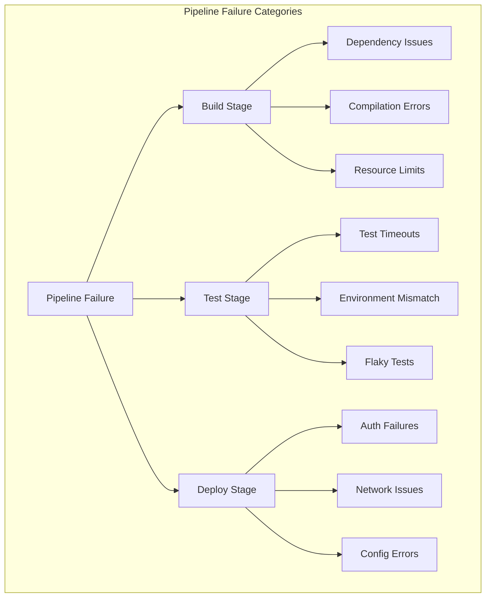
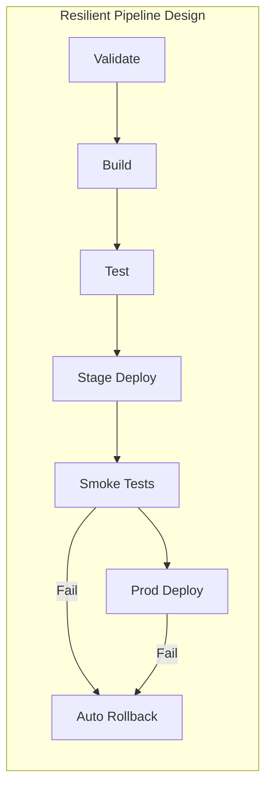

# How to Fix "Deployment" Pipeline Failures

Author: [nawazdhandala](https://www.github.com/nawazdhandala)

Tags: CI/CD, DevOps, Deployment, Pipelines, Troubleshooting, GitHub Actions, GitLab CI

Description: Learn how to diagnose and fix common deployment pipeline failures including authentication issues, resource constraints, and configuration errors.

---

Deployment pipelines fail for countless reasons, and debugging them can feel like searching for a needle in a haystack. Whether you are dealing with authentication timeouts, resource exhaustion, or cryptic error messages, understanding the common failure patterns will help you resolve issues faster and build more resilient pipelines.

## Common Pipeline Failure Categories

Before diving into fixes, let's categorize the types of failures you'll encounter. Understanding where failures originate helps you focus your debugging efforts.



## Authentication and Permission Failures

Authentication failures are among the most common deployment blockers. They often manifest as vague "access denied" errors that don't indicate the root cause.

### Expired or Invalid Credentials

Most deployment failures trace back to credential issues. Here's how to properly configure secrets in GitHub Actions:

```yaml
# .github/workflows/deploy.yml
name: Deploy to Production

on:
  push:
    branches: [main]

jobs:
  deploy:
    runs-on: ubuntu-latest

    # Define permissions explicitly - avoids default permission issues
    permissions:
      contents: read
      id-token: write  # Required for OIDC authentication

    steps:
      - uses: actions/checkout@v4

      # Use OIDC for AWS instead of long-lived credentials
      - name: Configure AWS credentials
        uses: aws-actions/configure-aws-credentials@v4
        with:
          role-to-assume: arn:aws:iam::123456789:role/github-actions-deploy
          aws-region: us-east-1
          # No access keys needed - uses OIDC token exchange

      - name: Deploy to ECS
        run: |
          # Verify credentials are working before deployment
          aws sts get-caller-identity

          # Proceed with deployment
          aws ecs update-service \
            --cluster production \
            --service web-api \
            --force-new-deployment
```

### Kubernetes Service Account Issues

When deploying to Kubernetes, service account misconfigurations cause silent failures:

```yaml
# Verify your service account has the right permissions
apiVersion: rbac.authorization.k8s.io/v1
kind: Role
metadata:
  name: deployment-manager
  namespace: production
rules:
  # Common mistake: forgetting to include 'update' or 'patch'
  - apiGroups: ["apps"]
    resources: ["deployments"]
    verbs: ["get", "list", "watch", "create", "update", "patch"]
  - apiGroups: [""]
    resources: ["pods", "pods/log"]
    verbs: ["get", "list", "watch"]
---
apiVersion: rbac.authorization.k8s.io/v1
kind: RoleBinding
metadata:
  name: deployment-manager-binding
  namespace: production
subjects:
  - kind: ServiceAccount
    name: github-actions-deployer
    namespace: ci-cd
roleRef:
  kind: Role
  name: deployment-manager
  apiGroup: rbac.authorization.k8s.io
```

## Resource Exhaustion Failures

Pipelines often fail when they run out of memory, disk space, or hit CPU limits.

### Diagnosing Resource Issues

Add resource monitoring to your pipeline to catch problems early:

```yaml
# GitLab CI example with resource monitoring
deploy:
  stage: deploy
  script:
    # Check available resources before starting
    - echo "=== Resource Check ==="
    - df -h /  # Disk space
    - free -m  # Memory
    - nproc    # Available CPUs

    # Clean up Docker to free space (common fix for disk issues)
    - docker system prune -af --volumes || true

    # Build with memory limits to prevent OOM kills
    - docker build \
        --memory=4g \
        --memory-swap=4g \
        -t $CI_REGISTRY_IMAGE:$CI_COMMIT_SHA .

    # Push with retry logic for transient failures
    - |
      for i in 1 2 3; do
        docker push $CI_REGISTRY_IMAGE:$CI_COMMIT_SHA && break
        echo "Push attempt $i failed, retrying..."
        sleep 10
      done
  tags:
    - docker
    - high-memory  # Use runners with more resources
```

### Node.js and npm Memory Issues

JavaScript builds commonly run out of memory during compilation:

```yaml
# GitHub Actions with increased Node memory
jobs:
  build:
    runs-on: ubuntu-latest
    steps:
      - uses: actions/checkout@v4

      - name: Setup Node.js
        uses: actions/setup-node@v4
        with:
          node-version: '20'
          cache: 'npm'

      - name: Install dependencies
        run: npm ci

      - name: Build with increased memory
        run: npm run build
        env:
          # Increase Node.js heap size to 4GB
          NODE_OPTIONS: "--max-old-space-size=4096"
```

## Network and Connectivity Failures

Network issues cause intermittent failures that are hard to reproduce locally.

### Implementing Retry Logic

Build resilience into your deployment scripts:

```bash
#!/bin/bash
# deploy.sh - Robust deployment script with retries

set -euo pipefail

MAX_RETRIES=3
RETRY_DELAY=30

deploy_with_retry() {
    local attempt=1

    while [ $attempt -le $MAX_RETRIES ]; do
        echo "Deployment attempt $attempt of $MAX_RETRIES"

        if kubectl apply -f k8s/ --timeout=120s; then
            echo "Deployment successful"
            return 0
        fi

        echo "Attempt $attempt failed"

        if [ $attempt -lt $MAX_RETRIES ]; then
            echo "Waiting ${RETRY_DELAY}s before retry..."
            sleep $RETRY_DELAY
            # Exponential backoff
            RETRY_DELAY=$((RETRY_DELAY * 2))
        fi

        attempt=$((attempt + 1))
    done

    echo "All deployment attempts failed"
    return 1
}

# Verify cluster connectivity before deployment
verify_cluster() {
    echo "Verifying cluster connectivity..."

    if ! kubectl cluster-info --request-timeout=30s; then
        echo "ERROR: Cannot connect to Kubernetes cluster"
        echo "Check your kubeconfig and network connectivity"
        exit 1
    fi

    echo "Cluster connectivity verified"
}

verify_cluster
deploy_with_retry
```

### Handling Registry Pull Failures

Image pull failures are common in production deployments:

```yaml
# kubernetes/deployment.yaml
apiVersion: apps/v1
kind: Deployment
metadata:
  name: web-api
spec:
  replicas: 3
  template:
    spec:
      # Pull secrets for private registries
      imagePullSecrets:
        - name: registry-credentials
      containers:
        - name: api
          image: myregistry.io/web-api:v1.2.3
          # Always pull ensures you get the latest image
          # Use IfNotPresent for immutable tags to reduce pull failures
          imagePullPolicy: IfNotPresent
```

## Configuration and Environment Errors

Missing or incorrect configuration causes deployments to fail at runtime.

### Validating Configuration Before Deploy

Catch configuration errors before they reach production:

```yaml
# .github/workflows/deploy.yml
jobs:
  validate:
    runs-on: ubuntu-latest
    steps:
      - uses: actions/checkout@v4

      - name: Validate Kubernetes manifests
        run: |
          # Install kubeval for manifest validation
          wget https://github.com/instrumenta/kubeval/releases/latest/download/kubeval-linux-amd64.tar.gz
          tar xf kubeval-linux-amd64.tar.gz

          # Validate all YAML files
          ./kubeval --strict k8s/*.yaml

      - name: Check for required secrets
        run: |
          # Verify all required secrets exist
          REQUIRED_SECRETS="DATABASE_URL API_KEY REDIS_URL"

          for secret in $REQUIRED_SECRETS; do
            if [ -z "${!secret:-}" ]; then
              echo "ERROR: Required secret $secret is not set"
              exit 1
            fi
          done

          echo "All required secrets are present"
        env:
          DATABASE_URL: ${{ secrets.DATABASE_URL }}
          API_KEY: ${{ secrets.API_KEY }}
          REDIS_URL: ${{ secrets.REDIS_URL }}

  deploy:
    needs: validate
    runs-on: ubuntu-latest
    steps:
      - name: Deploy
        run: ./deploy.sh
```

## Pipeline Debugging Techniques

When pipelines fail mysteriously, systematic debugging helps identify the root cause.

### Adding Debug Output

Temporarily increase verbosity to understand what's happening:

```yaml
# GitLab CI with debug mode
variables:
  # Enable debug output for troubleshooting
  CI_DEBUG_TRACE: "true"  # Shows all commands and outputs

deploy:
  script:
    # Print environment for debugging (redact secrets!)
    - env | grep -v PASSWORD | grep -v TOKEN | grep -v KEY | sort

    # Show Docker context
    - docker context ls
    - docker info

    # Verbose kubectl output
    - kubectl apply -f k8s/ -v=6
```

### Capturing Failure Context

Preserve information when deployments fail:

```yaml
# GitHub Actions with failure artifacts
jobs:
  deploy:
    runs-on: ubuntu-latest
    steps:
      - name: Deploy to Kubernetes
        id: deploy
        continue-on-error: true
        run: |
          kubectl apply -f k8s/
          kubectl rollout status deployment/web-api --timeout=300s

      - name: Capture debug info on failure
        if: steps.deploy.outcome == 'failure'
        run: |
          mkdir -p debug-output

          # Capture pod states
          kubectl get pods -o wide > debug-output/pods.txt

          # Capture events
          kubectl get events --sort-by='.lastTimestamp' > debug-output/events.txt

          # Capture logs from failing pods
          for pod in $(kubectl get pods -o name | grep web-api); do
            kubectl logs $pod --previous > "debug-output/${pod#pod/}-previous.log" 2>/dev/null || true
            kubectl logs $pod > "debug-output/${pod#pod/}.log" 2>/dev/null || true
          done

          # Describe deployments
          kubectl describe deployment web-api > debug-output/deployment.txt

      - name: Upload debug artifacts
        if: steps.deploy.outcome == 'failure'
        uses: actions/upload-artifact@v4
        with:
          name: deployment-debug
          path: debug-output/
          retention-days: 7

      - name: Fail if deploy failed
        if: steps.deploy.outcome == 'failure'
        run: exit 1
```

## Building Resilient Pipelines

Prevention is better than debugging. Here are patterns for building pipelines that fail less often:



### Health Checks and Smoke Tests

Always verify deployments succeeded:

```yaml
# Post-deployment verification
- name: Run smoke tests
  run: |
    # Wait for deployment to stabilize
    sleep 30

    # Check health endpoint
    for i in {1..10}; do
      HTTP_CODE=$(curl -s -o /dev/null -w "%{http_code}" https://api.example.com/health)

      if [ "$HTTP_CODE" = "200" ]; then
        echo "Health check passed"
        exit 0
      fi

      echo "Health check returned $HTTP_CODE, retrying..."
      sleep 10
    done

    echo "Health check failed after 10 attempts"
    exit 1
```

## Summary

Pipeline failures are inevitable, but with proper error handling and debugging practices, you can minimize downtime and resolve issues quickly. Key takeaways:

1. Use OIDC authentication instead of long-lived credentials where possible
2. Monitor resource usage and set appropriate limits
3. Implement retry logic for transient failures
4. Validate configuration before deployment
5. Capture debug information when failures occur
6. Always include post-deployment health checks

The best pipelines are not the ones that never fail, but the ones that fail gracefully and provide clear information about what went wrong.
