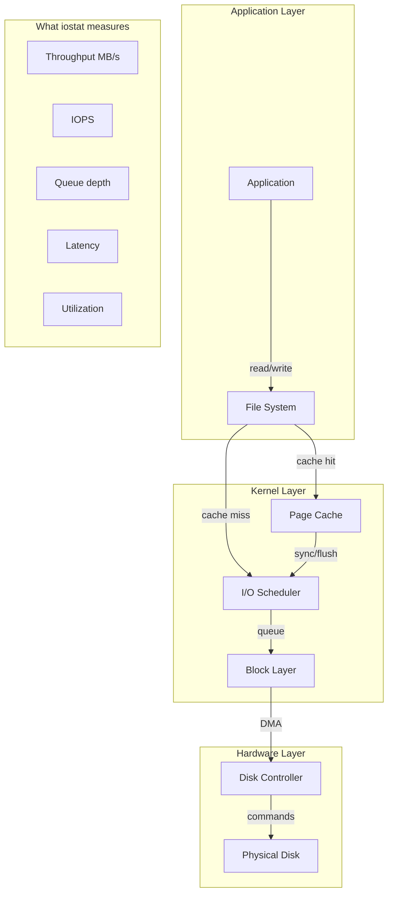
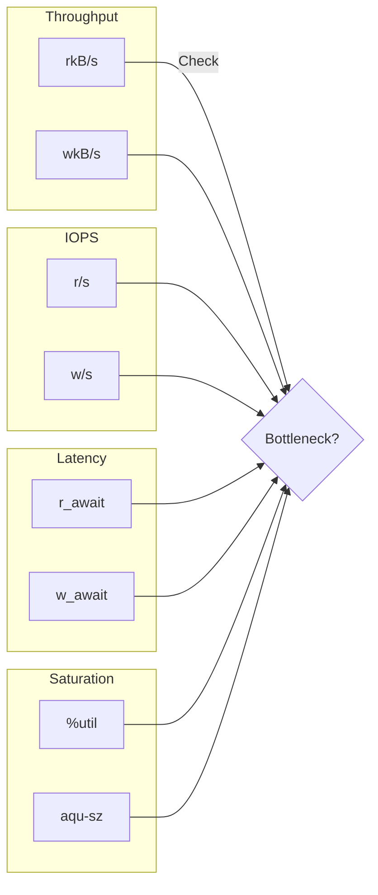
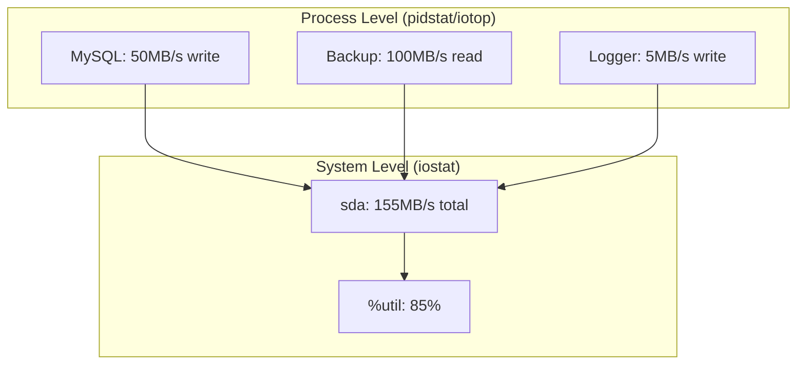
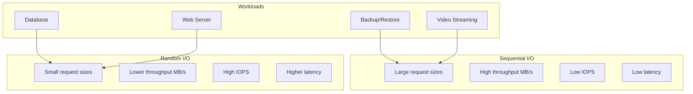

# How to Handle Disk I/O Monitoring with iostat

Author: [nawazdhandala](https://www.github.com/nawazdhandala)

Tags: iostat, Disk I/O, Performance Monitoring, Linux, sysstat, Storage, System Administration

Description: Learn how to use iostat to monitor disk I/O performance, identify bottlenecks, and optimize storage performance on Linux systems.

---

> Disk I/O bottlenecks can silently cripple your application performance. While CPU and memory issues are often obvious, storage problems require careful monitoring with tools like iostat to diagnose.

Your database is slow, but CPU usage is low and memory is fine. The culprit? Disk I/O. Let's find out how to diagnose and fix it.

---

## Understanding Disk I/O Metrics

Before diving into iostat, understand what we are measuring:



---

## Installing iostat

iostat is part of the sysstat package:

```bash
# Debian/Ubuntu
sudo apt update
sudo apt install sysstat

# RHEL/CentOS/Fedora
sudo dnf install sysstat
# or
sudo yum install sysstat

# Arch Linux
sudo pacman -S sysstat

# Verify installation
iostat --version
```

---

## Basic iostat Usage

Start with simple commands:

```bash
# Basic CPU and disk statistics
iostat

# Example output:
# Linux 5.15.0-generic (server)   01/24/2026    _x86_64_
#
# avg-cpu:  %user   %nice %system %iowait  %steal   %idle
#            5.23    0.00    2.15    1.82    0.00   90.80
#
# Device             tps    kB_read/s    kB_wrtn/s    kB_read    kB_wrtn
# sda              45.23       512.45       234.12   51234567   23456789
# sdb              12.34        89.23        45.67    8923456    4567890

# Show only disk statistics (no CPU)
iostat -d

# Show extended statistics (more details)
iostat -x

# Show statistics in megabytes
iostat -m

# Show statistics every 2 seconds, 5 times
iostat 2 5

# Show statistics for specific device
iostat -d sda

# Combine options: extended stats in MB every second
iostat -xm 1
```

---

## Extended Statistics Explained

The extended view (`-x`) provides crucial metrics:

```bash
# Get extended statistics
iostat -x 1 3
```

Example output:

```
Device  r/s    w/s   rkB/s   wkB/s  rrqm/s wrqm/s %rrqm %wrqm r_await w_await aqu-sz rareq-sz wareq-sz  svctm  %util
sda    45.00  30.00  720.00  480.00   5.00  10.00 10.00 25.00    2.50    4.00   0.25    16.00    16.00   0.80  6.00
nvme0n1 1200.00 800.00 48000.00 32000.00  0.00   0.00  0.00  0.00    0.15    0.20   0.30    40.00    40.00   0.05  10.00
```

### Metric Definitions

| Metric | Description | What to Watch |
|--------|-------------|---------------|
| `r/s` | Read requests per second | High values indicate read-heavy workload |
| `w/s` | Write requests per second | High values indicate write-heavy workload |
| `rkB/s` | Kilobytes read per second | Throughput for reads |
| `wkB/s` | Kilobytes written per second | Throughput for writes |
| `rrqm/s` | Read requests merged per second | Higher is better (efficiency) |
| `wrqm/s` | Write requests merged per second | Higher is better (efficiency) |
| `r_await` | Average read request time (ms) | Lower is better, watch for spikes |
| `w_await` | Average write request time (ms) | Lower is better, watch for spikes |
| `aqu-sz` | Average queue length | High values indicate saturation |
| `rareq-sz` | Average read request size (KB) | Larger is generally better for throughput |
| `wareq-sz` | Average write request size (KB) | Larger is generally better for throughput |
| `svctm` | Service time (deprecated) | Use await instead |
| `%util` | Percentage of time device was busy | 100% means saturated |

---

## Key Performance Indicators

Focus on these metrics for troubleshooting:



### Interpreting %util

```bash
# Monitor utilization over time
iostat -x 1 | awk '/^sd|^nvme/ {print $1, $NF}'
```

- **Below 70%**: Generally healthy
- **70-90%**: Monitor closely, may indicate approaching saturation
- **Above 90%**: Disk is becoming a bottleneck
- **100%**: Disk is saturated, requests are queuing

Note: For SSDs and NVMe, %util can be misleading due to parallelism. Focus on `await` metrics instead.

---

## Monitoring Specific Scenarios

### Scenario 1: Database Server

```bash
# Monitor database disk with high frequency
iostat -xm -p sda 1

# Focus on random I/O metrics
watch -n 1 'iostat -x sda 1 2 | tail -4'
```

Look for:
- High `r_await` and `w_await` (latency)
- High `%util` with low throughput (indicates random I/O)
- Small `rareq-sz` and `wareq-sz` (confirms random access)

### Scenario 2: File Server

```bash
# Monitor all disks for file server
iostat -xm 1

# Focus on throughput
iostat -m -p sda,sdb,sdc 1
```

Look for:
- High `rkB/s` and `wkB/s` (throughput)
- Large request sizes (sequential I/O)
- Lower `%util` per disk (spread across multiple disks)

### Scenario 3: Virtual Machine Host

```bash
# Monitor all block devices including virtio
iostat -x -d vda vdb 1

# Include device-mapper (LVM) devices
iostat -x -d dm-0 dm-1 1
```

---

## Creating iostat Reports

Generate reports for analysis:

```bash
# Collect data for 1 hour (every 5 seconds)
iostat -xmt 5 720 > iostat_report_$(date +%Y%m%d_%H%M%S).log &

# Parse the report for high utilization
grep -E "^sd|^nvme" iostat_report_*.log | awk '$NF > 80 {print}'

# Create a summary with timestamps
iostat -xmt 5 | while read line; do
    echo "$(date '+%Y-%m-%d %H:%M:%S') $line"
done > iostat_timestamped.log
```

---

## Automated Monitoring Script

Create a script for continuous monitoring:

```bash
#!/bin/bash
# /usr/local/bin/iostat-monitor.sh
# Monitor disk I/O and alert on high utilization

# Configuration
THRESHOLD_UTIL=80
THRESHOLD_AWAIT=50
LOG_FILE="/var/log/iostat-monitor.log"
ALERT_SCRIPT="/usr/local/bin/send-alert.sh"

# Function to log message
log_message() {
    echo "$(date '+%Y-%m-%d %H:%M:%S') $1" >> "$LOG_FILE"
}

# Function to check metrics
check_metrics() {
    # Get iostat output, skip header
    iostat -x 1 2 | tail -n +7 | while read line; do
        # Skip empty lines and header
        [[ -z "$line" ]] && continue
        [[ "$line" =~ ^Device ]] && continue

        # Parse the line
        device=$(echo "$line" | awk '{print $1}')
        r_await=$(echo "$line" | awk '{print $10}')
        w_await=$(echo "$line" | awk '{print $11}')
        util=$(echo "$line" | awk '{print $NF}')

        # Remove decimal for comparison
        util_int=${util%.*}
        r_await_int=${r_await%.*}
        w_await_int=${w_await%.*}

        # Check utilization threshold
        if [[ "$util_int" -gt "$THRESHOLD_UTIL" ]]; then
            message="HIGH UTIL: $device at ${util}%"
            log_message "$message"
            $ALERT_SCRIPT "$message" 2>/dev/null
        fi

        # Check await threshold
        if [[ "$r_await_int" -gt "$THRESHOLD_AWAIT" ]] || [[ "$w_await_int" -gt "$THRESHOLD_AWAIT" ]]; then
            message="HIGH LATENCY: $device r_await=${r_await}ms w_await=${w_await}ms"
            log_message "$message"
            $ALERT_SCRIPT "$message" 2>/dev/null
        fi
    done
}

# Main loop
log_message "Starting iostat monitoring"
while true; do
    check_metrics
    sleep 10
done
```

Make it executable and run as a service:

```bash
chmod +x /usr/local/bin/iostat-monitor.sh

# Create systemd service
cat << 'EOF' | sudo tee /etc/systemd/system/iostat-monitor.service
[Unit]
Description=iostat I/O Monitoring Service
After=network.target

[Service]
Type=simple
ExecStart=/usr/local/bin/iostat-monitor.sh
Restart=always
RestartSec=10

[Install]
WantedBy=multi-user.target
EOF

sudo systemctl daemon-reload
sudo systemctl enable iostat-monitor
sudo systemctl start iostat-monitor
```

---

## Correlating with Other Metrics

Use iostat with other tools for complete picture:

```bash
# Combine with vmstat for memory correlation
paste <(vmstat 1 5) <(iostat -x 1 5 | grep -E "^sd|^nvme")

# Monitor with iotop for per-process I/O
sudo iotop -o -b -n 5

# Check which processes are doing I/O
sudo pidstat -d 1 5
```

Process to disk correlation:



```bash
# See which processes are using specific disk
sudo iotop -o -a -P

# Get detailed per-process I/O stats
sudo pidstat -d 1 | head -20
```

---

## Understanding I/O Patterns

Different workloads have different patterns:



Identify the pattern from iostat:

```bash
# Sequential I/O indicators
iostat -x 1 | awk '/^sda/ && $NF > 50 {
    if ($14 > 64) print "Sequential read pattern"
    if ($15 > 64) print "Sequential write pattern"
}'

# Random I/O indicators
iostat -x 1 | awk '/^sda/ && ($6 + $7) > 1000 {
    if ($14 < 16 && $15 < 16) print "Random I/O pattern"
}'
```

---

## Optimizing Based on iostat Data

### High %util with Low Throughput (Random I/O)

```bash
# Current state
iostat -xm sda 1 3
# Device %util=95%, rkB/s=50MB/s (expected 500MB/s for SSD)

# Solutions:
# 1. Add more RAM for caching
# 2. Use faster storage (NVMe)
# 3. Optimize application for sequential access
# 4. Add read replicas for databases
```

### High await Times

```bash
# Identify the problem
iostat -x sda 1 | awk '$10 > 20 || $11 > 20 {print "High latency:", $0}'

# Solutions:
# 1. Check for disk errors
sudo smartctl -a /dev/sda | grep -E "Error|Reallocated"

# 2. Check I/O scheduler
cat /sys/block/sda/queue/scheduler

# 3. Try different scheduler for workload
echo "mq-deadline" | sudo tee /sys/block/sda/queue/scheduler
```

### High aqu-sz (Queue Depth)

```bash
# Monitor queue depth
iostat -x 1 | awk '/^sda/ && $12 > 4 {print "High queue:", $12}'

# Solutions:
# 1. Spread load across multiple disks
# 2. Implement read/write splitting
# 3. Add caching layer (Redis, Memcached)
# 4. Upgrade to faster storage
```

---

## Disk I/O Tuning Parameters

Adjust kernel parameters based on iostat findings:

```bash
# View current settings
cat /sys/block/sda/queue/scheduler
cat /sys/block/sda/queue/nr_requests
cat /sys/block/sda/queue/read_ahead_kb

# For database workloads (random I/O)
echo "none" | sudo tee /sys/block/nvme0n1/queue/scheduler
echo "256" | sudo tee /sys/block/nvme0n1/queue/nr_requests

# For sequential workloads (streaming)
echo "mq-deadline" | sudo tee /sys/block/sda/queue/scheduler
echo "2048" | sudo tee /sys/block/sda/queue/read_ahead_kb

# Make changes permanent via udev rules
cat << 'EOF' | sudo tee /etc/udev/rules.d/60-disk-scheduler.rules
# SSD/NVMe - use none scheduler
ACTION=="add|change", KERNEL=="nvme*", ATTR{queue/scheduler}="none"

# HDD - use mq-deadline scheduler
ACTION=="add|change", KERNEL=="sd*", ATTR{queue/rotational}=="1", ATTR{queue/scheduler}="mq-deadline"
EOF
```

---

## Comparing Disk Performance

Benchmark your disks to establish baselines:

```bash
# Install fio for benchmarking
sudo apt install fio

# Sequential read test
sudo fio --name=seqread --rw=read --bs=1M --size=1G --numjobs=1 \
    --filename=/tmp/testfile --direct=1

# Sequential write test
sudo fio --name=seqwrite --rw=write --bs=1M --size=1G --numjobs=1 \
    --filename=/tmp/testfile --direct=1

# Random read test (simulates database)
sudo fio --name=randread --rw=randread --bs=4K --size=1G --numjobs=4 \
    --filename=/tmp/testfile --direct=1 --iodepth=32

# Random write test
sudo fio --name=randwrite --rw=randwrite --bs=4K --size=1G --numjobs=4 \
    --filename=/tmp/testfile --direct=1 --iodepth=32

# Monitor with iostat during benchmark
iostat -xm 1
```

Expected baselines:

| Disk Type | Sequential Read | Sequential Write | Random Read IOPS | Random Write IOPS |
|-----------|-----------------|------------------|------------------|-------------------|
| HDD 7200 RPM | 150-200 MB/s | 150-200 MB/s | 100-200 | 100-200 |
| SATA SSD | 500-550 MB/s | 400-500 MB/s | 50,000-100,000 | 30,000-70,000 |
| NVMe SSD | 2,000-7,000 MB/s | 1,500-5,000 MB/s | 300,000-1,000,000 | 200,000-500,000 |

---

## Integration with Monitoring Systems

Export iostat metrics to Prometheus:

```bash
# Install node_exporter (includes disk metrics)
# Or use a custom script to expose iostat metrics

#!/bin/bash
# /usr/local/bin/iostat-prometheus.sh
# Export iostat metrics for Prometheus

OUTPUT_FILE="/var/lib/node_exporter/textfile_collector/iostat.prom"

# Get iostat data
iostat -x 1 2 | tail -n +7 | while read line; do
    [[ -z "$line" ]] && continue
    [[ "$line" =~ ^Device ]] && continue

    device=$(echo "$line" | awk '{print $1}')
    r_s=$(echo "$line" | awk '{print $2}')
    w_s=$(echo "$line" | awk '{print $3}')
    rkB_s=$(echo "$line" | awk '{print $4}')
    wkB_s=$(echo "$line" | awk '{print $5}')
    r_await=$(echo "$line" | awk '{print $10}')
    w_await=$(echo "$line" | awk '{print $11}')
    util=$(echo "$line" | awk '{print $NF}')

    cat << EOF >> "${OUTPUT_FILE}.tmp"
# HELP node_disk_reads_per_second Disk reads per second
node_disk_reads_per_second{device="$device"} $r_s
# HELP node_disk_writes_per_second Disk writes per second
node_disk_writes_per_second{device="$device"} $w_s
# HELP node_disk_read_bytes_per_second Disk read throughput in KB/s
node_disk_read_kbytes_per_second{device="$device"} $rkB_s
# HELP node_disk_write_bytes_per_second Disk write throughput in KB/s
node_disk_write_kbytes_per_second{device="$device"} $wkB_s
# HELP node_disk_read_await_ms Average read latency in ms
node_disk_read_await_ms{device="$device"} $r_await
# HELP node_disk_write_await_ms Average write latency in ms
node_disk_write_await_ms{device="$device"} $w_await
# HELP node_disk_util_percent Disk utilization percentage
node_disk_util_percent{device="$device"} $util
EOF
done

mv "${OUTPUT_FILE}.tmp" "$OUTPUT_FILE"
```

---

## Troubleshooting Common Issues

### Issue 1: No Output for NVMe Devices

```bash
# NVMe devices might not show in older iostat versions
# Update sysstat package
sudo apt update && sudo apt upgrade sysstat

# Explicitly specify NVMe device
iostat -x nvme0n1 1

# List all block devices
lsblk
```

### Issue 2: Utilization Always Shows 0%

```bash
# Ensure you are not running in a container without disk stats
cat /proc/diskstats

# Check if sysstat is collecting data
sudo systemctl status sysstat

# Enable sysstat data collection
sudo systemctl enable sysstat
sudo systemctl start sysstat
```

### Issue 3: Misleading %util on SSDs

```bash
# For SSDs, focus on await and queue metrics instead
iostat -x nvme0n1 1 | awk 'NR>6 {print "await:", $10, $11, "queue:", $12}'

# NVMe can handle multiple parallel operations
# %util of 100% does not mean saturated
# Check if await is increasing with queue depth
```

---

## Summary

Effective disk I/O monitoring with iostat involves:

1. **Regular monitoring**: Run `iostat -xm 1` during performance issues
2. **Key metrics**: Focus on `%util`, `await`, and `aqu-sz` for saturation
3. **Pattern recognition**: Identify sequential vs random I/O patterns
4. **Correlation**: Use with iotop and pidstat to find culprit processes
5. **Baselines**: Benchmark disks to know expected performance
6. **Tuning**: Adjust schedulers and parameters based on workload
7. **Alerting**: Set up automated monitoring for early warning

Remember that storage performance affects the entire system. A saturated disk will cause CPU wait times to increase, memory pressure to rise (due to delayed flushes), and application response times to degrade. Proactive monitoring with iostat helps you catch issues before they impact users.
