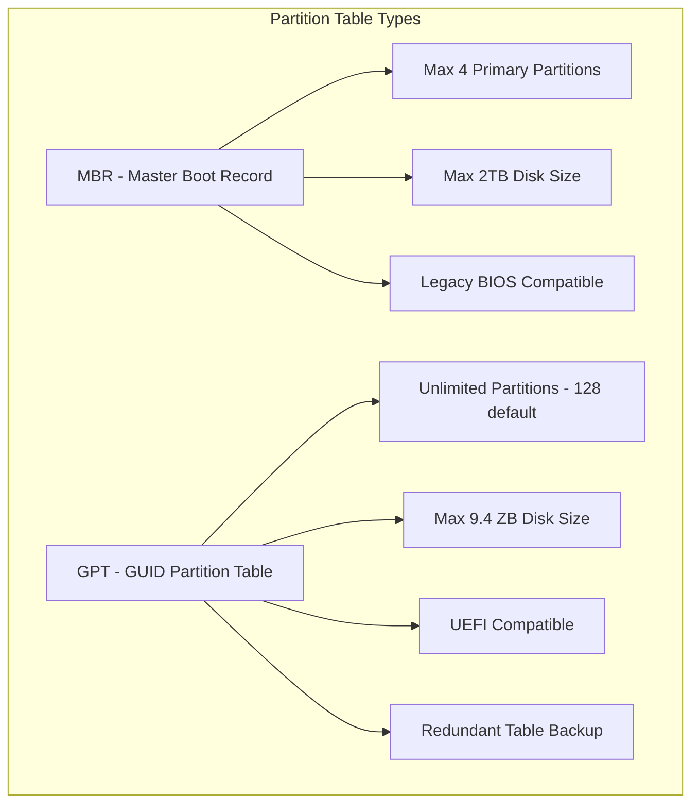
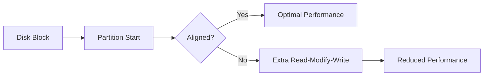
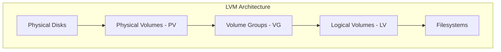
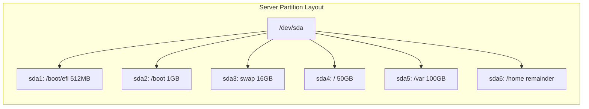
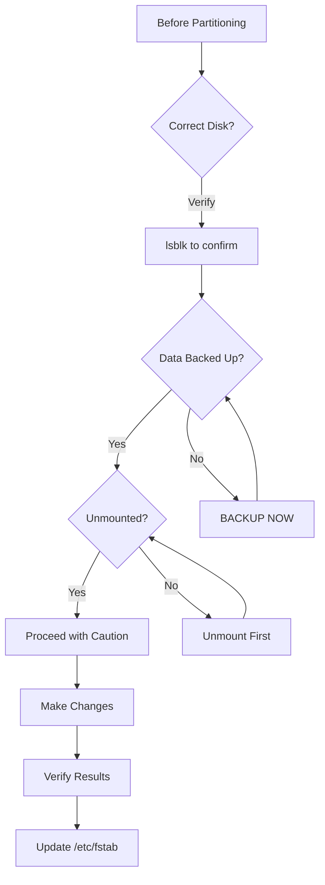

# How to Handle Disk Partitioning with fdisk and parted

Author: [nawazdhandala](https://github.com/nawazdhandala)

Tags: Linux, Disk Management, System Administration, Storage, fdisk, parted

Description: A comprehensive guide to disk partitioning in Linux using fdisk and parted, including creating, resizing, and managing partitions for both MBR and GPT disks.

---

Disk partitioning is a fundamental skill for Linux system administrators. Whether you are setting up a new server, adding storage, or reorganizing disk layouts, understanding fdisk and parted is essential. This guide covers both tools and when to use each.

## Understanding Partition Tables



| Feature | MBR | GPT |
|---------|-----|-----|
| Maximum disk size | 2 TB | 9.4 ZB |
| Maximum partitions | 4 primary (or 3 primary + 1 extended) | 128 (default) |
| Boot compatibility | BIOS | UEFI (and BIOS with hybrid) |
| Redundancy | None | Backup table at end of disk |
| Use case | Legacy systems, small disks | Modern systems, large disks |

## Viewing Disk Information

### List All Disks and Partitions

```bash
# List all block devices with details
lsblk -f

# Example output:
# NAME   FSTYPE LABEL UUID                                 MOUNTPOINT
# sda
# ├─sda1 ext4         abc12345-6789-...                    /boot
# ├─sda2 swap         def12345-6789-...                    [SWAP]
# └─sda3 ext4         ghi12345-6789-...                    /

# Show partition table type and sizes
fdisk -l

# Show detailed partition information
parted -l

# Show disk and partition sizes in human-readable format
lsblk -o NAME,SIZE,TYPE,FSTYPE,MOUNTPOINT
```

### Check Partition Table Type

```bash
# Using fdisk
fdisk -l /dev/sda | grep "Disklabel type"

# Using parted
parted /dev/sda print | grep "Partition Table"

# Using gdisk (for GPT)
gdisk -l /dev/sda | grep "GPT"
```

## Using fdisk (MBR and GPT)

fdisk is the traditional partitioning tool for Linux. Modern versions support both MBR and GPT.

### Interactive fdisk Session

```bash
# Start fdisk for a specific disk
# WARNING: Make sure you select the correct disk!
fdisk /dev/sdb

# fdisk commands:
# m - print help menu
# p - print partition table
# n - create new partition
# d - delete partition
# t - change partition type
# w - write changes and exit
# q - quit without saving
```

### Creating a New Partition

```bash
# Start fdisk
fdisk /dev/sdb

# Inside fdisk:
Command (m for help): n
Partition type:
   p   primary (0 primary, 0 extended, 4 free)
   e   extended
Select (default p): p
Partition number (1-4, default 1): 1
First sector (2048-209715199, default 2048): [Enter for default]
Last sector, +sectors or +size{K,M,G,T,P} (2048-209715199, default 209715199): +50G

Command (m for help): w
The partition table has been altered.
```

### Complete fdisk Script Example

```bash
#!/bin/bash
# Script to partition a disk non-interactively
# WARNING: This will destroy all data on the disk!

DISK="/dev/sdb"

# Create new GPT partition table and partitions
# n = new partition, p = primary, 1 = partition number
# First sector default, +size for last sector
# w = write

fdisk "$DISK" << EOF
g
n
1

+500M
t
1
n
2

+8G
t
2
19
n
3


w
EOF

# Partition 1: 500MB for /boot (type 1 = EFI System)
# Partition 2: 8GB for swap (type 19 = Linux swap)
# Partition 3: Remainder for root (default Linux filesystem)

echo "Partitioning complete. Creating filesystems..."

# Create filesystems
mkfs.vfat -F 32 "${DISK}1"
mkswap "${DISK}2"
mkfs.ext4 "${DISK}3"

echo "Done!"
```

## Using parted (Recommended for GPT)

parted is more powerful than fdisk and is the recommended tool for GPT disks and operations requiring precise alignment.

### Basic parted Commands

```bash
# Start parted interactively
parted /dev/sdb

# parted commands (inside parted):
# print - show partition table
# mklabel gpt - create GPT partition table
# mklabel msdos - create MBR partition table
# mkpart - create partition
# rm - remove partition
# resizepart - resize partition
# name - name a partition (GPT only)
# quit - exit parted
```

### Creating a GPT Disk with parted

```bash
# Start parted
parted /dev/sdb

# Create GPT partition table
(parted) mklabel gpt

# Create EFI system partition (first 500MB)
(parted) mkpart primary fat32 1MiB 501MiB
(parted) set 1 esp on

# Create swap partition (500MB to 8.5GB)
(parted) mkpart primary linux-swap 501MiB 8501MiB

# Create root partition (8.5GB to end)
(parted) mkpart primary ext4 8501MiB 100%

# View results
(parted) print
Model: ATA VBOX HARDDISK (scsi)
Disk /dev/sdb: 107GB
Sector size (logical/physical): 512B/512B
Partition Table: gpt

Number  Start   End     Size    File system  Name     Flags
 1      1049kB  526MB   525MB   fat32        primary  boot, esp
 2      526MB   8914MB  8389MB  linux-swap   primary  swap
 3      8914MB  107GB   98.4GB  ext4         primary

(parted) quit
```

### Non-Interactive parted Commands

```bash
# Create GPT partition table
parted -s /dev/sdb mklabel gpt

# Create partitions in one command each
parted -s /dev/sdb mkpart primary fat32 1MiB 501MiB
parted -s /dev/sdb set 1 esp on
parted -s /dev/sdb mkpart primary linux-swap 501MiB 8501MiB
parted -s /dev/sdb mkpart primary ext4 8501MiB 100%

# Print partition table
parted -s /dev/sdb print
```

## Partition Alignment

Proper partition alignment is crucial for SSD performance and optimal I/O.



### Check and Set Alignment

```bash
# Check current alignment in parted
parted /dev/sdb align-check optimal 1

# Ensure partitions start on 1MiB boundaries for optimal alignment
parted -s /dev/sdb mkpart primary ext4 1MiB 50GiB

# Verify alignment
parted /dev/sdb align-check optimal 1
# Output: 1 aligned

# Using fdisk - modern versions align automatically
fdisk /dev/sdb
# Partitions will start on 2048 sector boundaries by default
```

## Resizing Partitions

### Extending a Partition with parted

```bash
# IMPORTANT: Unmount the partition first if possible
umount /dev/sdb3

# Resize partition to use all available space
parted /dev/sdb resizepart 3 100%

# Or resize to specific size
parted /dev/sdb resizepart 3 80GiB

# After resizing partition, resize the filesystem
# For ext4:
resize2fs /dev/sdb3

# For xfs (can only grow, not shrink):
xfs_growfs /mountpoint
```

### Shrinking a Partition

```bash
# WARNING: Shrinking is risky - always backup first!

# Step 1: Shrink the filesystem first
# For ext4:
umount /dev/sdb3
e2fsck -f /dev/sdb3
resize2fs /dev/sdb3 40G  # Shrink filesystem to 40GB

# Step 2: Shrink the partition
parted /dev/sdb resizepart 3 40GiB

# Step 3: Remount
mount /dev/sdb3 /mnt/data
```

## Working with LVM

For flexible disk management, LVM (Logical Volume Manager) is often used on top of partitions.



### Create LVM Partition Type

```bash
# Using fdisk - set partition type to LVM
fdisk /dev/sdb
Command: t
Partition number: 1
Hex code: 8e  # Linux LVM (MBR)
# or
Hex code: 31  # Linux LVM (GPT)

# Using parted
parted -s /dev/sdb set 1 lvm on
```

### Basic LVM Setup

```bash
# Create physical volume
pvcreate /dev/sdb1

# Create volume group
vgcreate data_vg /dev/sdb1

# Create logical volume
lvcreate -L 20G -n data_lv data_vg

# Create filesystem
mkfs.ext4 /dev/data_vg/data_lv

# Mount
mount /dev/data_vg/data_lv /mnt/data
```

## Creating Filesystems

After partitioning, you need to create filesystems.

```bash
# ext4 - most common Linux filesystem
mkfs.ext4 /dev/sdb1

# ext4 with label
mkfs.ext4 -L "DataDisk" /dev/sdb1

# xfs - recommended for large files and enterprise
mkfs.xfs /dev/sdb1

# FAT32 - for EFI partitions
mkfs.vfat -F 32 /dev/sdb1

# Swap
mkswap /dev/sdb2
swapon /dev/sdb2
```

## Partition Layout Best Practices

### Server with Separate Partitions

```bash
# Recommended partition layout for a server
# Using GPT on a 500GB disk

parted -s /dev/sda mklabel gpt

# EFI System Partition
parted -s /dev/sda mkpart ESP fat32 1MiB 513MiB
parted -s /dev/sda set 1 esp on

# /boot partition
parted -s /dev/sda mkpart boot ext4 513MiB 1537MiB

# Swap (1.5x RAM for systems with less than 8GB RAM)
parted -s /dev/sda mkpart swap linux-swap 1537MiB 17921MiB

# Root partition
parted -s /dev/sda mkpart root ext4 17921MiB 68609MiB

# /var partition (for logs, databases)
parted -s /dev/sda mkpart var ext4 68609MiB 170497MiB

# /home partition
parted -s /dev/sda mkpart home ext4 170497MiB 100%
```



## Troubleshooting

### Partition Table Recovery

```bash
# Backup partition table
sfdisk -d /dev/sda > sda_partition_backup.txt

# Restore partition table
sfdisk /dev/sda < sda_partition_backup.txt

# For GPT, use gdisk
gdisk /dev/sda
# Use 'b' to backup and 'r' then 'l' to restore
```

### Fix Partition Table Issues

```bash
# Check and repair GPT
gdisk /dev/sda
# Use 'v' to verify and 'w' to write fixes

# Force kernel to re-read partition table
partprobe /dev/sda

# Or using blockdev
blockdev --rereadpt /dev/sda
```

### Recover Deleted Partitions

```bash
# Install testdisk
apt-get install testdisk

# Run testdisk
testdisk /dev/sda

# Follow prompts to analyze and recover partitions
# testdisk can often find and restore deleted partitions
```

## Safety Checklist



### Pre-Partitioning Checklist

```bash
#!/bin/bash
# Safety script before partitioning

DISK=$1

if [ -z "$DISK" ]; then
    echo "Usage: $0 /dev/sdX"
    exit 1
fi

echo "=== Disk Information ==="
lsblk "$DISK"
echo ""

echo "=== Current Partition Table ==="
fdisk -l "$DISK"
echo ""

echo "=== Mounted Partitions from this Disk ==="
mount | grep "$DISK"
echo ""

echo "=== Processes Using this Disk ==="
lsof "$DISK"* 2>/dev/null
echo ""

read -p "Are you sure you want to modify $DISK? (yes/no): " CONFIRM
if [ "$CONFIRM" != "yes" ]; then
    echo "Aborted."
    exit 1
fi

echo "Proceeding..."
```

## Quick Reference

| Task | fdisk Command | parted Command |
|------|--------------|----------------|
| List partitions | `fdisk -l /dev/sda` | `parted /dev/sda print` |
| Create GPT table | `fdisk /dev/sda` then `g` | `parted /dev/sda mklabel gpt` |
| Create MBR table | `fdisk /dev/sda` then `o` | `parted /dev/sda mklabel msdos` |
| Create partition | `fdisk /dev/sda` then `n` | `parted /dev/sda mkpart ...` |
| Delete partition | `fdisk /dev/sda` then `d` | `parted /dev/sda rm 1` |
| Resize partition | N/A | `parted /dev/sda resizepart 1 50G` |
| Set boot flag | `fdisk /dev/sda` then `a` | `parted /dev/sda set 1 boot on` |

## Conclusion

Effective disk partitioning is crucial for system performance, organization, and maintenance. Use fdisk for simple MBR operations and parted for GPT disks and advanced features. Always verify you are working on the correct disk, ensure data is backed up, and unmount partitions before modifying them. For production systems, consider using LVM for flexibility in resizing and managing storage.
