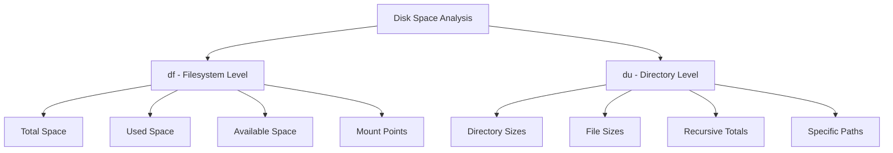
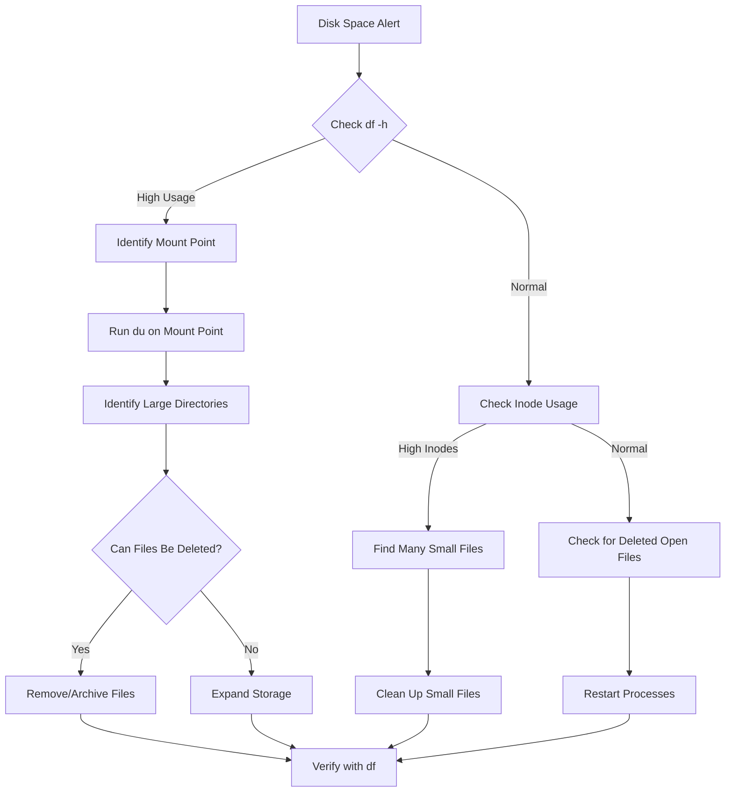

# How to Handle Disk Space Analysis with du and df

Author: [nawazdhandala](https://www.github.com/nawazdhandala)

Tags: Linux, System Administration, Disk Space, du, df, Storage, Troubleshooting

Description: A practical guide to analyzing and managing disk space on Linux systems using the du and df commands with real-world examples and troubleshooting techniques.

---

> Running out of disk space is one of the most common issues Linux administrators face. Understanding how to quickly identify space-consuming files and directories using `du` and `df` is essential for maintaining healthy systems.

This guide covers practical techniques for disk space analysis, from basic commands to advanced troubleshooting strategies that will help you identify and resolve storage issues efficiently.

---

## Understanding df and du

Before diving into commands, it is important to understand what each tool measures:

- **df (disk free)**: Reports filesystem-level disk space usage, showing total, used, and available space for mounted filesystems
- **du (disk usage)**: Calculates the actual disk space used by files and directories



---

## Using df for Filesystem Overview

### Basic df Usage

The `df` command provides a quick overview of all mounted filesystems:

```bash
# Display disk space usage for all mounted filesystems
# Shows filesystem, size, used, available, use percentage, and mount point
df -h

# Example output:
# Filesystem      Size  Used Avail Use% Mounted on
# /dev/sda1       100G   75G   20G  79% /
# /dev/sdb1       500G  350G  125G  74% /data
# tmpfs           16G   512M   16G   4% /dev/shm
```

### df Options Explained

```bash
# Human-readable sizes (KB, MB, GB)
# The -h flag converts bytes to human-readable format
df -h

# Show filesystem type (ext4, xfs, etc.)
# Useful for identifying different storage backends
df -T

# Display inode usage instead of block usage
# Important when you have many small files
df -i

# Show only local filesystems (exclude network mounts)
# Helpful when NFS mounts are slow or unavailable
df -l

# Combine options for comprehensive overview
# This shows type, human-readable sizes, and totals
df -Th --total
```

### Checking Specific Filesystems

```bash
# Check space on a specific mount point
# Returns information only for the filesystem containing /var
df -h /var

# Check multiple paths at once
# Each path returns info for its containing filesystem
df -h /var /home /tmp

# Check the filesystem of the current directory
df -h .
```

---

## Using du for Directory Analysis

### Basic du Usage

The `du` command calculates actual disk usage for files and directories:

```bash
# Show size of current directory and all subdirectories
# Recursively calculates sizes for every subdirectory
du -h

# Show only the total size of a directory
# The -s flag summarizes to a single total
du -sh /var/log

# Show sizes of immediate subdirectories only
# The --max-depth=1 limits recursion to one level
du -h --max-depth=1 /var
```

### Finding Space-Consuming Directories

```bash
# Find the 10 largest directories under /var
# Combines du with sort and head for top consumers
du -h /var --max-depth=2 2>/dev/null | sort -hr | head -10

# Alternative using du with specific depth
# The -d flag is shorthand for --max-depth
du -hd 2 /var 2>/dev/null | sort -hr | head -10

# Find large directories starting from root
# Excludes pseudo-filesystems to avoid false results
du -h --max-depth=1 / 2>/dev/null | sort -hr | head -15
```

### Finding Large Files

```bash
# Find files larger than 100MB in /var
# The + prefix means "larger than"
find /var -type f -size +100M -exec ls -lh {} \; 2>/dev/null

# Find the 20 largest files on the system
# Combines find with du for accurate size reporting
find / -type f -exec du -h {} + 2>/dev/null | sort -hr | head -20

# Find large files modified in the last 7 days
# Useful for identifying recent space growth
find / -type f -size +50M -mtime -7 -exec ls -lh {} \; 2>/dev/null
```

---

## Disk Space Analysis Workflow



---

## Common Disk Space Issues

### Issue 1: df Shows Full but du Shows Less

This often happens when files are deleted but processes still have them open:

```bash
# Find deleted files still held open by processes
# These files consume space until the process releases them
lsof +L1 2>/dev/null | head -20

# Example output shows PID holding deleted files:
# COMMAND   PID USER   FD   TYPE DEVICE SIZE/OFF NLINK NODE NAME
# nginx    1234 root   10w  REG  8,1  1073741824  0  123 /var/log/nginx/access.log (deleted)

# To reclaim space, restart the process or truncate the file descriptor
# Find the specific process and restart it
systemctl restart nginx

# Alternative: truncate the file descriptor directly (advanced)
# This empties the deleted file without restarting the process
# First, identify the PID and FD from lsof output
# Then truncate: echo "" > /proc/PID/fd/FD
```

### Issue 2: Inode Exhaustion

```bash
# Check inode usage - percentage of inodes used
# High inode usage with available space means many small files
df -i

# Find directories with many files
# Counts files in each directory under /var
find /var -xdev -type d -exec sh -c 'echo "$(find "{}" -maxdepth 1 -type f | wc -l) {}"' \; 2>/dev/null | sort -rn | head -20

# Common culprits: session files, cache directories
# Check PHP session directory
ls /var/lib/php/sessions/ | wc -l

# Check mail queue
ls /var/spool/postfix/deferred/ | wc -l
```

### Issue 3: Reserved Space for Root

```bash
# Check reserved space on ext4 filesystems
# By default, ext4 reserves 5% for root user
tune2fs -l /dev/sda1 | grep -i reserved

# Reduce reserved space to 1% (if appropriate)
# This frees up space for regular use
tune2fs -m 1 /dev/sda1

# Set reserved space to specific size (100MB)
tune2fs -r 25600 /dev/sda1  # 25600 blocks * 4KB = 100MB
```

---

## Automated Disk Space Monitoring Script

Create a script to monitor disk space and alert when thresholds are exceeded:

```bash
#!/bin/bash
# disk_monitor.sh - Monitor disk space and send alerts

# Configuration - adjust these values for your environment
THRESHOLD=80        # Alert when usage exceeds this percentage
LOG_FILE="/var/log/disk_monitor.log"
ALERT_EMAIL="admin@example.com"

# Function to log messages with timestamp
log_message() {
    echo "$(date '+%Y-%m-%d %H:%M:%S') - $1" >> "$LOG_FILE"
}

# Function to send alert (customize for your notification system)
send_alert() {
    local filesystem="$1"
    local usage="$2"
    local message="ALERT: Filesystem $filesystem is ${usage}% full"

    # Log the alert
    log_message "$message"

    # Send email alert (requires mailutils)
    echo "$message" | mail -s "Disk Space Alert" "$ALERT_EMAIL" 2>/dev/null

    # Alternative: send to monitoring system via curl
    # curl -X POST "https://monitoring.example.com/alert" \
    #     -d "message=$message" 2>/dev/null
}

# Main monitoring loop
log_message "Starting disk space check"

# Parse df output and check each filesystem
# Skip header line with tail -n +2
df -h | tail -n +2 | while read -r line; do
    # Extract filesystem and usage percentage
    filesystem=$(echo "$line" | awk '{print $1}')
    mountpoint=$(echo "$line" | awk '{print $NF}')
    usage=$(echo "$line" | awk '{print $5}' | tr -d '%')

    # Skip pseudo-filesystems
    case "$mountpoint" in
        /dev|/dev/*|/run|/run/*|/sys|/sys/*|/proc|/proc/*)
            continue
            ;;
    esac

    # Check if usage exceeds threshold
    if [ -n "$usage" ] && [ "$usage" -ge "$THRESHOLD" ]; then
        send_alert "$mountpoint" "$usage"

        # Log top space consumers for this mount point
        log_message "Top directories on $mountpoint:"
        du -h --max-depth=2 "$mountpoint" 2>/dev/null | sort -hr | head -5 >> "$LOG_FILE"
    fi
done

log_message "Disk space check completed"
```

Make the script executable and schedule it:

```bash
# Make the script executable
chmod +x /usr/local/bin/disk_monitor.sh

# Add to crontab to run every hour
# Edit crontab with: crontab -e
# Add this line:
0 * * * * /usr/local/bin/disk_monitor.sh
```

---

## Quick Reference Commands

### df Quick Reference

| Command | Description |
|---------|-------------|
| `df -h` | Human-readable filesystem usage |
| `df -i` | Inode usage |
| `df -T` | Include filesystem type |
| `df -h /path` | Check specific path |
| `df --total` | Show total across all filesystems |

### du Quick Reference

| Command | Description |
|---------|-------------|
| `du -sh /path` | Total size of directory |
| `du -h --max-depth=1` | Size of immediate subdirectories |
| `du -ah` | Size of all files and directories |
| `du -h \| sort -hr \| head` | Find largest directories |
| `du --exclude='*.log'` | Exclude pattern from calculation |

---

## Best Practices

1. **Set up monitoring**: Use automated scripts to catch disk space issues before they become critical

2. **Implement log rotation**: Configure logrotate for all log files to prevent unbounded growth

3. **Schedule cleanup jobs**: Create cron jobs to clean temporary files regularly

4. **Use separate partitions**: Mount /var, /tmp, and /home on separate partitions to prevent one area from filling the root filesystem

5. **Monitor inode usage**: Especially important for mail servers and systems with many small files

6. **Document large directories**: Keep track of expected sizes for key directories to identify anomalies

---

## Conclusion

Effective disk space management requires regular monitoring and quick diagnostic capabilities. The `df` command provides the big picture of filesystem usage, while `du` helps drill down into specific directories. Combining these tools with automated monitoring ensures you catch and resolve disk space issues before they impact system availability.

Remember to investigate the root cause of disk space growth rather than just clearing space, as recurring issues often indicate configuration problems or application bugs that need addressing.
