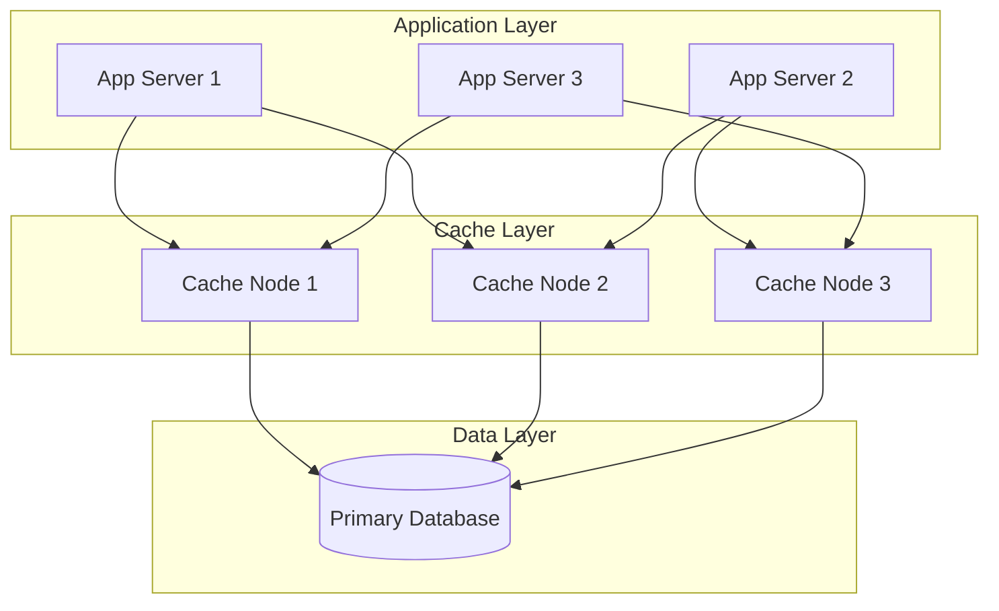
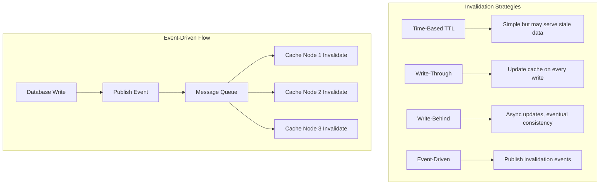
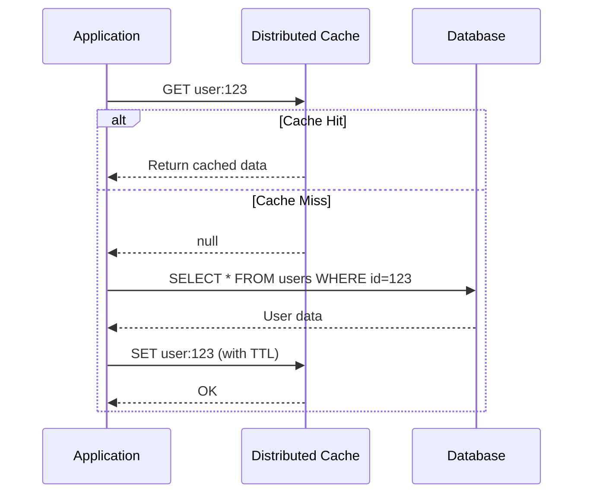

# How to Handle Distributed Caching

Author: [nawazdhandala](https://www.github.com/nawazdhandala)

Tags: Distributed Caching, Redis, Memcached, Cache Invalidation, Microservices, Performance, Scalability

Description: A comprehensive guide to implementing and managing distributed caching in microservices architectures, covering cache strategies, invalidation patterns, and consistency challenges.

---

Distributed caching is essential for building high-performance, scalable applications. When your application spans multiple servers, a local cache on each server leads to inconsistencies and wasted memory. A distributed cache provides a shared, fast data store that all your services can access. This guide covers implementing distributed caching effectively.

## Understanding Distributed Cache Architecture

A distributed cache sits between your application servers and your database, reducing load on the database and improving response times.



The cache layer distributes data across multiple nodes using consistent hashing. This ensures that adding or removing nodes only affects a portion of the cached keys.

## Implementing a Redis Cluster Cache Client

Redis Cluster provides automatic sharding and high availability. Here is a robust client implementation.

```python
# distributed_cache.py - Redis Cluster cache client
import hashlib
import json
import logging
from typing import Any, Callable, Optional, TypeVar, Union
from datetime import timedelta
from functools import wraps

import redis
from redis.cluster import RedisCluster
from redis.exceptions import RedisClusterException, ConnectionError

logger = logging.getLogger(__name__)

T = TypeVar('T')

class DistributedCache:
    """
    Distributed cache client with Redis Cluster support.

    Features:
    - Automatic connection pooling
    - Serialization/deserialization
    - TTL management
    - Circuit breaker pattern for resilience
    """

    def __init__(
        self,
        hosts: list[dict],
        default_ttl: int = 3600,
        max_connections: int = 100,
        socket_timeout: float = 5.0,
        retry_on_timeout: bool = True
    ):
        """
        Initialize distributed cache client.

        Args:
            hosts: List of Redis cluster nodes [{"host": "ip", "port": 6379}]
            default_ttl: Default time-to-live in seconds
            max_connections: Maximum connections per node
            socket_timeout: Socket timeout in seconds
            retry_on_timeout: Whether to retry on timeout
        """
        self.default_ttl = default_ttl
        self._circuit_open = False
        self._failure_count = 0
        self._failure_threshold = 5

        # Build startup nodes for Redis Cluster
        startup_nodes = [
            redis.cluster.ClusterNode(node["host"], node["port"])
            for node in hosts
        ]

        self._client = RedisCluster(
            startup_nodes=startup_nodes,
            decode_responses=True,
            max_connections=max_connections,
            socket_timeout=socket_timeout,
            retry_on_timeout=retry_on_timeout
        )

    def _serialize(self, value: Any) -> str:
        """Serialize value to JSON string."""
        return json.dumps(value, default=str)

    def _deserialize(self, value: Optional[str]) -> Any:
        """Deserialize JSON string to value."""
        if value is None:
            return None
        try:
            return json.loads(value)
        except json.JSONDecodeError:
            return value

    def _check_circuit(self) -> bool:
        """Check if circuit breaker is open."""
        return self._circuit_open

    def _record_failure(self) -> None:
        """Record a failure and potentially open circuit."""
        self._failure_count += 1
        if self._failure_count >= self._failure_threshold:
            self._circuit_open = True
            logger.warning("Circuit breaker opened due to repeated failures")

    def _record_success(self) -> None:
        """Record success and reset failure count."""
        self._failure_count = 0
        self._circuit_open = False

    def get(self, key: str) -> Optional[Any]:
        """
        Get value from cache.

        Args:
            key: Cache key

        Returns:
            Cached value or None if not found
        """
        if self._check_circuit():
            logger.warning("Circuit open, skipping cache read")
            return None

        try:
            value = self._client.get(key)
            self._record_success()
            return self._deserialize(value)
        except (RedisClusterException, ConnectionError) as e:
            logger.error(f"Cache get failed for key {key}: {e}")
            self._record_failure()
            return None

    def set(
        self,
        key: str,
        value: Any,
        ttl: Optional[int] = None
    ) -> bool:
        """
        Set value in cache.

        Args:
            key: Cache key
            value: Value to cache
            ttl: Time-to-live in seconds (uses default if None)

        Returns:
            True if successful, False otherwise
        """
        if self._check_circuit():
            logger.warning("Circuit open, skipping cache write")
            return False

        try:
            serialized = self._serialize(value)
            expire_time = ttl if ttl is not None else self.default_ttl
            self._client.setex(key, expire_time, serialized)
            self._record_success()
            return True
        except (RedisClusterException, ConnectionError) as e:
            logger.error(f"Cache set failed for key {key}: {e}")
            self._record_failure()
            return False

    def delete(self, key: str) -> bool:
        """
        Delete value from cache.

        Args:
            key: Cache key

        Returns:
            True if deleted, False otherwise
        """
        if self._check_circuit():
            return False

        try:
            self._client.delete(key)
            self._record_success()
            return True
        except (RedisClusterException, ConnectionError) as e:
            logger.error(f"Cache delete failed for key {key}: {e}")
            self._record_failure()
            return False

    def get_or_set(
        self,
        key: str,
        factory: Callable[[], T],
        ttl: Optional[int] = None
    ) -> Optional[T]:
        """
        Get value from cache or compute and store it.

        Args:
            key: Cache key
            factory: Function to compute value if not cached
            ttl: Time-to-live in seconds

        Returns:
            Cached or computed value
        """
        # Try to get from cache first
        value = self.get(key)
        if value is not None:
            return value

        # Compute value using factory
        value = factory()

        # Store in cache
        self.set(key, value, ttl)

        return value


# Decorator for caching function results
def cached(
    cache: DistributedCache,
    key_prefix: str,
    ttl: Optional[int] = None
):
    """
    Decorator to cache function results.

    Args:
        cache: DistributedCache instance
        key_prefix: Prefix for cache keys
        ttl: Time-to-live in seconds
    """
    def decorator(func: Callable[..., T]) -> Callable[..., T]:
        @wraps(func)
        def wrapper(*args, **kwargs) -> T:
            # Build cache key from function arguments
            key_parts = [key_prefix, func.__name__]
            key_parts.extend(str(arg) for arg in args)
            key_parts.extend(f"{k}={v}" for k, v in sorted(kwargs.items()))
            cache_key = ":".join(key_parts)

            # Hash long keys
            if len(cache_key) > 200:
                cache_key = f"{key_prefix}:{hashlib.md5(cache_key.encode()).hexdigest()}"

            # Try cache first
            cached_value = cache.get(cache_key)
            if cached_value is not None:
                return cached_value

            # Compute and cache
            result = func(*args, **kwargs)
            cache.set(cache_key, result, ttl)
            return result

        return wrapper
    return decorator
```

## Cache Invalidation Strategies

Cache invalidation is one of the hardest problems in distributed systems. Here are the main strategies.



Implement event-driven invalidation for consistency across cache nodes.

```python
# cache_invalidation.py - Event-driven cache invalidation
import json
import logging
from dataclasses import dataclass
from enum import Enum
from typing import Callable, Dict, List, Set
import threading

logger = logging.getLogger(__name__)

class InvalidationType(Enum):
    """Types of cache invalidation events."""
    KEY = "key"           # Invalidate specific key
    PATTERN = "pattern"   # Invalidate keys matching pattern
    TAG = "tag"           # Invalidate keys with specific tag


@dataclass
class InvalidationEvent:
    """Cache invalidation event."""
    invalidation_type: InvalidationType
    target: str
    source: str
    timestamp: float


class CacheInvalidator:
    """
    Handles cache invalidation across distributed nodes.

    Supports multiple invalidation strategies:
    - Direct key invalidation
    - Pattern-based invalidation
    - Tag-based invalidation
    """

    def __init__(self, cache: 'DistributedCache', pubsub_client):
        """
        Initialize cache invalidator.

        Args:
            cache: Distributed cache instance
            pubsub_client: Redis pubsub client for events
        """
        self._cache = cache
        self._pubsub = pubsub_client
        self._channel = "cache:invalidation"
        self._tag_index: Dict[str, Set[str]] = {}
        self._running = False
        self._listener_thread = None

    def start(self) -> None:
        """Start listening for invalidation events."""
        self._running = True
        self._pubsub.subscribe(self._channel)
        self._listener_thread = threading.Thread(
            target=self._listen_for_events,
            daemon=True
        )
        self._listener_thread.start()
        logger.info("Cache invalidator started")

    def stop(self) -> None:
        """Stop listening for invalidation events."""
        self._running = False
        self._pubsub.unsubscribe(self._channel)
        if self._listener_thread:
            self._listener_thread.join(timeout=5.0)
        logger.info("Cache invalidator stopped")

    def _listen_for_events(self) -> None:
        """Listen for invalidation events from other nodes."""
        while self._running:
            try:
                message = self._pubsub.get_message(timeout=1.0)
                if message and message["type"] == "message":
                    event_data = json.loads(message["data"])
                    event = InvalidationEvent(**event_data)
                    self._handle_event(event)
            except Exception as e:
                logger.error(f"Error processing invalidation event: {e}")

    def _handle_event(self, event: InvalidationEvent) -> None:
        """Handle an invalidation event."""
        if event.invalidation_type == InvalidationType.KEY:
            self._invalidate_key(event.target)
        elif event.invalidation_type == InvalidationType.PATTERN:
            self._invalidate_pattern(event.target)
        elif event.invalidation_type == InvalidationType.TAG:
            self._invalidate_tag(event.target)

    def _invalidate_key(self, key: str) -> None:
        """Invalidate a specific key."""
        self._cache.delete(key)
        logger.debug(f"Invalidated key: {key}")

    def _invalidate_pattern(self, pattern: str) -> None:
        """Invalidate keys matching a pattern."""
        # Use SCAN to find matching keys (cluster-safe)
        cursor = 0
        while True:
            cursor, keys = self._cache._client.scan(
                cursor=cursor,
                match=pattern,
                count=100
            )
            for key in keys:
                self._cache.delete(key)
            if cursor == 0:
                break
        logger.debug(f"Invalidated pattern: {pattern}")

    def _invalidate_tag(self, tag: str) -> None:
        """Invalidate all keys with a specific tag."""
        keys = self._tag_index.get(tag, set())
        for key in keys:
            self._cache.delete(key)
        self._tag_index.pop(tag, None)
        logger.debug(f"Invalidated tag: {tag}, keys: {len(keys)}")

    def register_tag(self, key: str, tags: List[str]) -> None:
        """Register tags for a cache key."""
        for tag in tags:
            if tag not in self._tag_index:
                self._tag_index[tag] = set()
            self._tag_index[tag].add(key)

    def publish_invalidation(
        self,
        invalidation_type: InvalidationType,
        target: str,
        source: str = "local"
    ) -> None:
        """Publish an invalidation event to all nodes."""
        import time
        event = InvalidationEvent(
            invalidation_type=invalidation_type,
            target=target,
            source=source,
            timestamp=time.time()
        )
        self._pubsub.publish(
            self._channel,
            json.dumps({
                "invalidation_type": event.invalidation_type.value,
                "target": event.target,
                "source": event.source,
                "timestamp": event.timestamp
            })
        )
```

## Cache-Aside Pattern Implementation

The cache-aside pattern is the most common caching strategy. The application checks the cache first and falls back to the database on cache miss.



Implement the cache-aside pattern with proper error handling.

```python
# cache_aside.py - Cache-aside pattern implementation
import logging
from typing import Any, Callable, Generic, Optional, TypeVar
from dataclasses import dataclass
import time

logger = logging.getLogger(__name__)

T = TypeVar('T')

@dataclass
class CacheStats:
    """Statistics for cache performance monitoring."""
    hits: int = 0
    misses: int = 0
    errors: int = 0
    avg_latency_ms: float = 0.0


class CacheAside(Generic[T]):
    """
    Cache-aside pattern implementation with monitoring.

    This pattern provides:
    - Automatic cache population on miss
    - Configurable TTL
    - Performance monitoring
    - Graceful degradation on cache failures
    """

    def __init__(
        self,
        cache: 'DistributedCache',
        data_source: Callable[[str], Optional[T]],
        key_prefix: str,
        ttl: int = 3600
    ):
        """
        Initialize cache-aside wrapper.

        Args:
            cache: Distributed cache instance
            data_source: Function to fetch data on cache miss
            key_prefix: Prefix for cache keys
            ttl: Time-to-live in seconds
        """
        self._cache = cache
        self._data_source = data_source
        self._key_prefix = key_prefix
        self._ttl = ttl
        self._stats = CacheStats()
        self._latencies: list[float] = []

    def _build_key(self, identifier: str) -> str:
        """Build cache key from identifier."""
        return f"{self._key_prefix}:{identifier}"

    def _update_latency(self, latency_ms: float) -> None:
        """Update latency statistics."""
        self._latencies.append(latency_ms)
        # Keep only last 1000 measurements
        if len(self._latencies) > 1000:
            self._latencies = self._latencies[-1000:]
        self._stats.avg_latency_ms = sum(self._latencies) / len(self._latencies)

    def get(self, identifier: str) -> Optional[T]:
        """
        Get data using cache-aside pattern.

        Args:
            identifier: Unique identifier for the data

        Returns:
            Data from cache or data source
        """
        start_time = time.time()
        cache_key = self._build_key(identifier)

        # Try cache first
        try:
            cached_value = self._cache.get(cache_key)
            if cached_value is not None:
                self._stats.hits += 1
                latency = (time.time() - start_time) * 1000
                self._update_latency(latency)
                logger.debug(f"Cache hit for {cache_key}")
                return cached_value
        except Exception as e:
            logger.warning(f"Cache read error for {cache_key}: {e}")
            self._stats.errors += 1

        # Cache miss - fetch from data source
        self._stats.misses += 1
        logger.debug(f"Cache miss for {cache_key}")

        try:
            value = self._data_source(identifier)
            if value is not None:
                # Populate cache
                try:
                    self._cache.set(cache_key, value, self._ttl)
                except Exception as e:
                    logger.warning(f"Cache write error for {cache_key}: {e}")
                    self._stats.errors += 1

            latency = (time.time() - start_time) * 1000
            self._update_latency(latency)
            return value

        except Exception as e:
            logger.error(f"Data source error for {identifier}: {e}")
            self._stats.errors += 1
            raise

    def invalidate(self, identifier: str) -> bool:
        """
        Invalidate cached data.

        Args:
            identifier: Unique identifier for the data

        Returns:
            True if invalidation was successful
        """
        cache_key = self._build_key(identifier)
        return self._cache.delete(cache_key)

    def refresh(self, identifier: str) -> Optional[T]:
        """
        Force refresh cached data from data source.

        Args:
            identifier: Unique identifier for the data

        Returns:
            Fresh data from data source
        """
        self.invalidate(identifier)
        return self.get(identifier)

    def get_stats(self) -> CacheStats:
        """Get cache performance statistics."""
        return self._stats

    @property
    def hit_rate(self) -> float:
        """Calculate cache hit rate."""
        total = self._stats.hits + self._stats.misses
        if total == 0:
            return 0.0
        return self._stats.hits / total


# Example usage with a user service
class UserService:
    """User service with distributed caching."""

    def __init__(self, cache: 'DistributedCache', db_connection):
        self._db = db_connection
        self._cache_aside = CacheAside(
            cache=cache,
            data_source=self._fetch_user_from_db,
            key_prefix="user",
            ttl=1800  # 30 minutes
        )

    def _fetch_user_from_db(self, user_id: str) -> Optional[dict]:
        """Fetch user from database."""
        cursor = self._db.cursor()
        cursor.execute(
            "SELECT id, name, email, created_at FROM users WHERE id = %s",
            (user_id,)
        )
        row = cursor.fetchone()
        if row:
            return {
                "id": row[0],
                "name": row[1],
                "email": row[2],
                "created_at": str(row[3])
            }
        return None

    def get_user(self, user_id: str) -> Optional[dict]:
        """Get user with caching."""
        return self._cache_aside.get(user_id)

    def update_user(self, user_id: str, data: dict) -> bool:
        """Update user and invalidate cache."""
        cursor = self._db.cursor()
        cursor.execute(
            "UPDATE users SET name = %s, email = %s WHERE id = %s",
            (data["name"], data["email"], user_id)
        )
        self._db.commit()

        # Invalidate cache after successful update
        self._cache_aside.invalidate(user_id)
        return True
```

## Handling Cache Thundering Herd

When a popular cache key expires, many requests might simultaneously hit the database. Use locking to prevent this.

```mermaid
sequenceDiagram
    participant R1 as Request 1
    participant R2 as Request 2
    participant R3 as Request 3
    participant Cache as Distributed Cache
    participant Lock as Distributed Lock
    participant DB as Database

    Note over R1,R2,R3: Cache key expires

    R1->>Cache: GET popular:key
    R2->>Cache: GET popular:key
    R3->>Cache: GET popular:key

    Cache-->>R1: null (miss)
    Cache-->>R2: null (miss)
    Cache-->>R3: null (miss)

    R1->>Lock: ACQUIRE lock:popular:key
    R2->>Lock: ACQUIRE lock:popular:key
    R3->>Lock: ACQUIRE lock:popular:key

    Lock-->>R1: Lock acquired
    Lock-->>R2: Wait
    Lock-->>R3: Wait

    R1->>DB: Query data
    DB-->>R1: Data
    R1->>Cache: SET popular:key
    R1->>Lock: RELEASE lock

    Lock-->>R2: Lock released
    R2->>Cache: GET popular:key
    Cache-->>R2: Cached data

    Lock-->>R3: Lock released
    R3->>Cache: GET popular:key
    Cache-->>R3: Cached data
```

Implement thundering herd protection with distributed locking.

```python
# thundering_herd.py - Protection against cache stampede
import time
import logging
from typing import Callable, Optional, TypeVar
from contextlib import contextmanager

logger = logging.getLogger(__name__)

T = TypeVar('T')

class DistributedLock:
    """Distributed lock using Redis."""

    def __init__(self, redis_client, lock_timeout: int = 10):
        """
        Initialize distributed lock.

        Args:
            redis_client: Redis client
            lock_timeout: Lock expiration in seconds
        """
        self._redis = redis_client
        self._lock_timeout = lock_timeout

    @contextmanager
    def acquire(self, lock_name: str, wait_timeout: float = 5.0):
        """
        Acquire a distributed lock.

        Args:
            lock_name: Name of the lock
            wait_timeout: Maximum time to wait for lock

        Yields:
            True if lock was acquired
        """
        lock_key = f"lock:{lock_name}"
        token = str(time.time())
        acquired = False
        start_time = time.time()

        try:
            # Try to acquire lock with retries
            while time.time() - start_time < wait_timeout:
                # SET NX with expiration
                acquired = self._redis.set(
                    lock_key,
                    token,
                    nx=True,
                    ex=self._lock_timeout
                )

                if acquired:
                    logger.debug(f"Lock acquired: {lock_name}")
                    break

                # Wait before retry
                time.sleep(0.05)

            yield acquired

        finally:
            if acquired:
                # Only release if we still hold the lock
                current_token = self._redis.get(lock_key)
                if current_token == token:
                    self._redis.delete(lock_key)
                    logger.debug(f"Lock released: {lock_name}")


class ThunderingHerdProtector:
    """
    Protects against cache thundering herd / stampede.

    Uses distributed locking to ensure only one request
    fetches data on cache miss.
    """

    def __init__(
        self,
        cache: 'DistributedCache',
        lock: DistributedLock,
        stale_ttl: int = 60
    ):
        """
        Initialize thundering herd protector.

        Args:
            cache: Distributed cache instance
            lock: Distributed lock instance
            stale_ttl: Extra TTL for serving stale data
        """
        self._cache = cache
        self._lock = lock
        self._stale_ttl = stale_ttl

    def get_with_protection(
        self,
        key: str,
        factory: Callable[[], T],
        ttl: int = 3600,
        wait_timeout: float = 5.0
    ) -> Optional[T]:
        """
        Get value with thundering herd protection.

        Args:
            key: Cache key
            factory: Function to compute value on miss
            ttl: Time-to-live in seconds
            wait_timeout: Maximum time to wait for lock

        Returns:
            Cached or computed value
        """
        # Check for fresh data
        cached = self._cache.get(key)
        if cached is not None:
            return cached

        # Check for stale data
        stale_key = f"{key}:stale"
        stale_data = self._cache.get(stale_key)

        # Try to acquire lock
        with self._lock.acquire(key, wait_timeout) as acquired:
            if acquired:
                # Double-check cache after acquiring lock
                cached = self._cache.get(key)
                if cached is not None:
                    return cached

                # Fetch fresh data
                try:
                    value = factory()

                    # Store fresh data
                    self._cache.set(key, value, ttl)

                    # Store stale copy with extended TTL
                    self._cache.set(stale_key, value, ttl + self._stale_ttl)

                    return value

                except Exception as e:
                    logger.error(f"Factory failed for {key}: {e}")
                    # Return stale data if available
                    if stale_data is not None:
                        logger.warning(f"Returning stale data for {key}")
                        return stale_data
                    raise
            else:
                # Could not acquire lock - return stale data if available
                if stale_data is not None:
                    logger.debug(f"Returning stale data while waiting: {key}")
                    return stale_data

                # Wait and retry
                time.sleep(0.1)
                return self._cache.get(key)
```

## Monitoring Distributed Cache Health

Monitor your cache cluster to detect issues before they impact users.

```python
# cache_monitoring.py - Distributed cache health monitoring
import time
import logging
from dataclasses import dataclass, field
from typing import Dict, List, Optional
from datetime import datetime
import statistics

logger = logging.getLogger(__name__)

@dataclass
class NodeHealth:
    """Health status of a cache node."""
    host: str
    port: int
    is_healthy: bool
    latency_ms: float
    memory_used_bytes: int
    memory_max_bytes: int
    connected_clients: int
    keys_count: int
    last_check: datetime


@dataclass
class ClusterHealth:
    """Overall cluster health status."""
    is_healthy: bool
    nodes: List[NodeHealth]
    total_keys: int
    total_memory_used: int
    total_memory_max: int
    avg_latency_ms: float
    unhealthy_nodes: int


class CacheHealthMonitor:
    """
    Monitors distributed cache cluster health.

    Tracks:
    - Node availability
    - Memory usage
    - Latency
    - Connection counts
    """

    def __init__(
        self,
        cache: 'DistributedCache',
        check_interval: int = 30,
        latency_threshold_ms: float = 100.0,
        memory_threshold_percent: float = 80.0
    ):
        """
        Initialize health monitor.

        Args:
            cache: Distributed cache instance
            check_interval: Health check interval in seconds
            latency_threshold_ms: Latency threshold for warnings
            memory_threshold_percent: Memory usage threshold for warnings
        """
        self._cache = cache
        self._check_interval = check_interval
        self._latency_threshold = latency_threshold_ms
        self._memory_threshold = memory_threshold_percent
        self._health_history: List[ClusterHealth] = []

    def _check_node_health(self, node) -> NodeHealth:
        """Check health of a single node."""
        start_time = time.time()

        try:
            # Ping the node
            node_client = self._cache._client.get_node(
                node.host, node.port
            )

            # Get node info
            info = node_client.info()

            latency = (time.time() - start_time) * 1000

            return NodeHealth(
                host=node.host,
                port=node.port,
                is_healthy=True,
                latency_ms=latency,
                memory_used_bytes=info.get("used_memory", 0),
                memory_max_bytes=info.get("maxmemory", 0),
                connected_clients=info.get("connected_clients", 0),
                keys_count=info.get("db0", {}).get("keys", 0),
                last_check=datetime.now()
            )

        except Exception as e:
            logger.error(f"Health check failed for {node.host}:{node.port}: {e}")
            return NodeHealth(
                host=node.host,
                port=node.port,
                is_healthy=False,
                latency_ms=-1,
                memory_used_bytes=0,
                memory_max_bytes=0,
                connected_clients=0,
                keys_count=0,
                last_check=datetime.now()
            )

    def check_cluster_health(self) -> ClusterHealth:
        """Check health of entire cluster."""
        nodes = self._cache._client.get_nodes()
        node_healths = []

        for node in nodes:
            health = self._check_node_health(node)
            node_healths.append(health)

        # Calculate cluster metrics
        healthy_nodes = [n for n in node_healths if n.is_healthy]
        unhealthy_count = len(node_healths) - len(healthy_nodes)

        total_keys = sum(n.keys_count for n in healthy_nodes)
        total_memory_used = sum(n.memory_used_bytes for n in healthy_nodes)
        total_memory_max = sum(n.memory_max_bytes for n in healthy_nodes)

        latencies = [n.latency_ms for n in healthy_nodes if n.latency_ms > 0]
        avg_latency = statistics.mean(latencies) if latencies else 0.0

        # Determine cluster health
        is_healthy = (
            unhealthy_count == 0 and
            avg_latency < self._latency_threshold
        )

        # Check memory threshold
        if total_memory_max > 0:
            memory_percent = (total_memory_used / total_memory_max) * 100
            if memory_percent > self._memory_threshold:
                is_healthy = False
                logger.warning(
                    f"Cluster memory usage high: {memory_percent:.1f}%"
                )

        cluster_health = ClusterHealth(
            is_healthy=is_healthy,
            nodes=node_healths,
            total_keys=total_keys,
            total_memory_used=total_memory_used,
            total_memory_max=total_memory_max,
            avg_latency_ms=avg_latency,
            unhealthy_nodes=unhealthy_count
        )

        # Store history
        self._health_history.append(cluster_health)
        if len(self._health_history) > 100:
            self._health_history = self._health_history[-100:]

        return cluster_health

    def get_health_summary(self) -> Dict:
        """Get a summary of cluster health."""
        current = self.check_cluster_health()

        return {
            "status": "healthy" if current.is_healthy else "degraded",
            "total_nodes": len(current.nodes),
            "healthy_nodes": len(current.nodes) - current.unhealthy_nodes,
            "unhealthy_nodes": current.unhealthy_nodes,
            "total_keys": current.total_keys,
            "memory_used_mb": current.total_memory_used / (1024 * 1024),
            "memory_max_mb": current.total_memory_max / (1024 * 1024),
            "avg_latency_ms": round(current.avg_latency_ms, 2),
            "nodes": [
                {
                    "host": n.host,
                    "port": n.port,
                    "healthy": n.is_healthy,
                    "latency_ms": round(n.latency_ms, 2),
                    "keys": n.keys_count
                }
                for n in current.nodes
            ]
        }
```

## Best Practices for Distributed Caching

Follow these guidelines for effective distributed caching:

1. **Choose appropriate TTLs** - Balance freshness against database load. Start with shorter TTLs and increase based on data volatility.

2. **Use consistent hashing** - Ensures minimal key redistribution when nodes are added or removed.

3. **Implement circuit breakers** - Prevent cache failures from cascading to your database.

4. **Monitor hit rates** - A low hit rate indicates your cache is not effective. Investigate key patterns and TTLs.

5. **Plan for cache warming** - After a deployment or cache flush, gradually warm the cache to avoid thundering herd.

6. **Use namespaced keys** - Prefix keys with service name and version to avoid collisions and enable bulk invalidation.

7. **Compress large values** - Reduce memory usage and network transfer for large cached objects.

8. **Handle serialization carefully** - Use consistent serialization formats and version your cached data structures.

Distributed caching is a powerful tool for scaling applications, but it requires careful design and monitoring to be effective.
