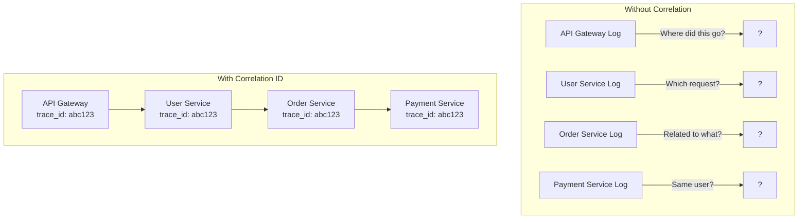
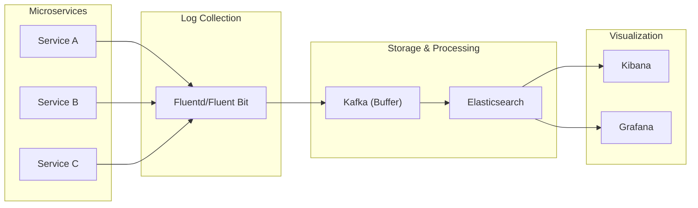
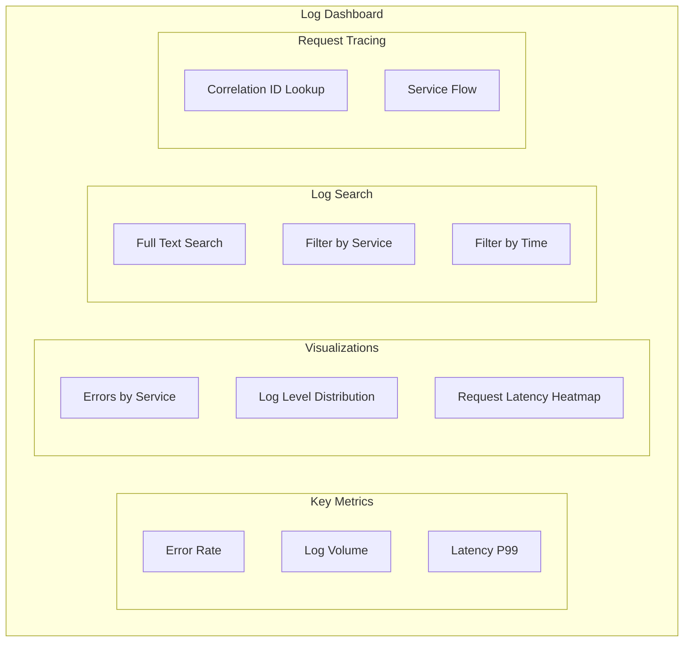

# How to Handle Distributed Logging

Author: [nawazdhandala](https://www.github.com/nawazdhandala)

Tags: Distributed Logging, Microservices, ELK Stack, Observability, Log Aggregation, Correlation ID, Structured Logging, Fluentd

Description: A practical guide to implementing distributed logging in microservices, covering log aggregation, correlation IDs, structured logging, and centralized log management with ELK and Fluentd.

---

> In a monolithic application, logs are in one place. In microservices, a single request generates logs across dozens of services. Without proper distributed logging, debugging becomes impossible. This guide shows you how to implement logging that scales with your architecture.

Distributed logging connects the dots across your microservices. When a request fails, you need to trace it through every service it touched, in the right order, with the right context.

---

## The Distributed Logging Challenge



### Key Requirements

1. **Correlation**: Link logs from the same request across services
2. **Aggregation**: Collect logs from all services in one place
3. **Structure**: Use consistent, parseable log formats
4. **Context**: Include relevant metadata with every log
5. **Search**: Query logs efficiently at scale

---

## Architecture Overview



---

## Structured Logging

### Python Implementation

```python
# logging_config.py
import logging
import json
import sys
from datetime import datetime
from typing import Any, Dict
from contextvars import ContextVar
import uuid

# Context variables for request-scoped data
correlation_id: ContextVar[str] = ContextVar("correlation_id", default="")
user_id: ContextVar[str] = ContextVar("user_id", default="")
request_path: ContextVar[str] = ContextVar("request_path", default="")

class StructuredLogFormatter(logging.Formatter):
    """
    JSON formatter for structured logging.
    Includes correlation ID and other context automatically.
    """

    def __init__(self, service_name: str, environment: str):
        super().__init__()
        self.service_name = service_name
        self.environment = environment

    def format(self, record: logging.LogRecord) -> str:
        log_data = {
            # Timestamp in ISO format
            "timestamp": datetime.utcnow().isoformat() + "Z",

            # Log level
            "level": record.levelname,
            "level_num": record.levelno,

            # Service identification
            "service": self.service_name,
            "environment": self.environment,

            # Source location
            "logger": record.name,
            "module": record.module,
            "function": record.funcName,
            "line": record.lineno,

            # The actual message
            "message": record.getMessage(),

            # Correlation context
            "correlation_id": correlation_id.get() or None,
            "user_id": user_id.get() or None,
            "request_path": request_path.get() or None,
        }

        # Add exception info if present
        if record.exc_info:
            log_data["exception"] = {
                "type": record.exc_info[0].__name__ if record.exc_info[0] else None,
                "message": str(record.exc_info[1]) if record.exc_info[1] else None,
                "stacktrace": self.formatException(record.exc_info)
            }

        # Add extra fields from record
        if hasattr(record, "extra_fields"):
            log_data.update(record.extra_fields)

        return json.dumps(log_data, default=str)


class ContextLogger(logging.LoggerAdapter):
    """
    Logger adapter that automatically includes context fields.
    """

    def process(self, msg: str, kwargs: Dict[str, Any]):
        # Add extra fields to the log record
        extra = kwargs.get("extra", {})

        # Merge with any additional context
        if "extra_fields" not in extra:
            extra["extra_fields"] = {}

        # Add any passed extra fields
        for key, value in kwargs.items():
            if key not in ("exc_info", "stack_info", "stacklevel", "extra"):
                extra["extra_fields"][key] = value

        kwargs["extra"] = extra
        return msg, kwargs


def setup_logging(
    service_name: str,
    environment: str = "development",
    log_level: str = "INFO"
) -> ContextLogger:
    """
    Set up structured logging for a service.
    """
    # Create formatter
    formatter = StructuredLogFormatter(service_name, environment)

    # Configure root logger
    root_logger = logging.getLogger()
    root_logger.setLevel(getattr(logging, log_level.upper()))

    # Remove existing handlers
    for handler in root_logger.handlers[:]:
        root_logger.removeHandler(handler)

    # Add stdout handler with JSON formatting
    stdout_handler = logging.StreamHandler(sys.stdout)
    stdout_handler.setFormatter(formatter)
    root_logger.addHandler(stdout_handler)

    # Create and return context logger
    return ContextLogger(root_logger, {})


# Usage
logger = setup_logging("order-service", "production", "INFO")

# Simple log
logger.info("Order created", order_id="ord-123", user_id="usr-456")

# Log with exception
try:
    process_payment()
except Exception as e:
    logger.error("Payment failed", exc_info=True, order_id="ord-123")
```

### FastAPI Integration

```python
# middleware.py
from fastapi import FastAPI, Request
from starlette.middleware.base import BaseHTTPMiddleware
import uuid
import time
from logging_config import correlation_id, user_id, request_path, logger

class LoggingMiddleware(BaseHTTPMiddleware):
    """
    Middleware to set up logging context for each request.
    """

    async def dispatch(self, request: Request, call_next):
        # Generate or extract correlation ID
        corr_id = request.headers.get("X-Correlation-ID") or str(uuid.uuid4())
        correlation_id.set(corr_id)

        # Extract user ID if present
        uid = request.headers.get("X-User-ID") or ""
        user_id.set(uid)

        # Set request path
        request_path.set(request.url.path)

        # Log request start
        start_time = time.time()
        logger.info(
            "Request started",
            method=request.method,
            path=request.url.path,
            query=str(request.query_params),
            client_ip=request.client.host if request.client else None
        )

        try:
            response = await call_next(request)

            # Log request completion
            duration = time.time() - start_time
            logger.info(
                "Request completed",
                method=request.method,
                path=request.url.path,
                status_code=response.status_code,
                duration_ms=round(duration * 1000, 2)
            )

            # Add correlation ID to response headers
            response.headers["X-Correlation-ID"] = corr_id

            return response

        except Exception as e:
            duration = time.time() - start_time
            logger.error(
                "Request failed",
                method=request.method,
                path=request.url.path,
                duration_ms=round(duration * 1000, 2),
                exc_info=True
            )
            raise


app = FastAPI()
app.add_middleware(LoggingMiddleware)


@app.get("/api/orders/{order_id}")
async def get_order(order_id: str):
    logger.info("Fetching order", order_id=order_id)

    # Business logic...
    order = await fetch_order(order_id)

    logger.info("Order fetched successfully", order_id=order_id)
    return order
```

### Propagating Correlation ID

```python
# http_client.py
import httpx
from logging_config import correlation_id, logger

class TracedHttpClient:
    """
    HTTP client that propagates correlation ID and logs requests.
    """

    def __init__(self, base_url: str = None):
        self.base_url = base_url
        self.client = httpx.AsyncClient(base_url=base_url)

    def _get_headers(self) -> dict:
        """Get headers including correlation ID."""
        headers = {}
        corr_id = correlation_id.get()
        if corr_id:
            headers["X-Correlation-ID"] = corr_id
        return headers

    async def request(
        self,
        method: str,
        url: str,
        **kwargs
    ) -> httpx.Response:
        """Make HTTP request with logging and correlation."""
        # Merge headers
        headers = kwargs.pop("headers", {})
        headers.update(self._get_headers())

        # Log outgoing request
        logger.info(
            "Outgoing HTTP request",
            method=method,
            url=url,
            target_service=self._extract_service_name(url)
        )

        start_time = time.time()

        try:
            response = await self.client.request(
                method,
                url,
                headers=headers,
                **kwargs
            )

            duration = time.time() - start_time
            logger.info(
                "Outgoing HTTP response",
                method=method,
                url=url,
                status_code=response.status_code,
                duration_ms=round(duration * 1000, 2)
            )

            return response

        except Exception as e:
            duration = time.time() - start_time
            logger.error(
                "Outgoing HTTP request failed",
                method=method,
                url=url,
                duration_ms=round(duration * 1000, 2),
                error=str(e)
            )
            raise

    def _extract_service_name(self, url: str) -> str:
        """Extract service name from URL."""
        # Simple extraction - adjust based on your URL patterns
        if "://" in url:
            host = url.split("://")[1].split("/")[0]
            return host.split(".")[0]
        return url.split("/")[0]

    async def get(self, url: str, **kwargs):
        return await self.request("GET", url, **kwargs)

    async def post(self, url: str, **kwargs):
        return await self.request("POST", url, **kwargs)

    async def close(self):
        await self.client.aclose()
```

---

## Log Aggregation with Fluentd

### Fluentd Configuration

```xml
<!-- fluent.conf -->
<source>
  @type forward
  port 24224
  bind 0.0.0.0
</source>

<!-- Parse JSON logs from containers -->
<source>
  @type tail
  path /var/log/containers/*.log
  pos_file /var/log/fluentd/containers.log.pos
  tag kubernetes.*
  read_from_head true

  <parse>
    @type json
    time_key timestamp
    time_format %Y-%m-%dT%H:%M:%S.%NZ
  </parse>
</source>

<!-- Add Kubernetes metadata -->
<filter kubernetes.**>
  @type kubernetes_metadata
  @id filter_kube_metadata
</filter>

<!-- Parse nested JSON in log field -->
<filter kubernetes.**>
  @type parser
  key_name log
  reserve_data true
  remove_key_name_field true

  <parse>
    @type json
  </parse>
</filter>

<!-- Add additional fields -->
<filter **>
  @type record_transformer
  <record>
    cluster ${ENV['CLUSTER_NAME']}
    region ${ENV['AWS_REGION']}
  </record>
</filter>

<!-- Buffer and send to Elasticsearch -->
<match **>
  @type elasticsearch
  host elasticsearch.logging.svc.cluster.local
  port 9200
  logstash_format true
  logstash_prefix logs
  logstash_dateformat %Y.%m.%d

  <buffer>
    @type file
    path /var/log/fluentd/buffer
    flush_mode interval
    flush_interval 5s
    chunk_limit_size 10MB
    queue_limit_length 512
    retry_max_interval 30
    retry_forever true
  </buffer>
</match>
```

### Kubernetes DaemonSet

```yaml
# fluentd-daemonset.yaml
apiVersion: apps/v1
kind: DaemonSet
metadata:
  name: fluentd
  namespace: logging
spec:
  selector:
    matchLabels:
      app: fluentd
  template:
    metadata:
      labels:
        app: fluentd
    spec:
      serviceAccountName: fluentd
      tolerations:
      - key: node-role.kubernetes.io/master
        effect: NoSchedule
      containers:
      - name: fluentd
        image: fluent/fluentd-kubernetes-daemonset:v1.14-debian-elasticsearch7
        env:
        - name: FLUENT_ELASTICSEARCH_HOST
          value: "elasticsearch.logging.svc.cluster.local"
        - name: FLUENT_ELASTICSEARCH_PORT
          value: "9200"
        - name: CLUSTER_NAME
          value: "production"
        resources:
          limits:
            memory: 512Mi
          requests:
            cpu: 100m
            memory: 256Mi
        volumeMounts:
        - name: varlog
          mountPath: /var/log
        - name: dockercontainers
          mountPath: /var/lib/docker/containers
          readOnly: true
        - name: config
          mountPath: /fluentd/etc/fluent.conf
          subPath: fluent.conf
      volumes:
      - name: varlog
        hostPath:
          path: /var/log
      - name: dockercontainers
        hostPath:
          path: /var/lib/docker/containers
      - name: config
        configMap:
          name: fluentd-config
```

---

## ELK Stack Setup

### Elasticsearch Configuration

```yaml
# elasticsearch.yaml
apiVersion: elasticsearch.k8s.elastic.co/v1
kind: Elasticsearch
metadata:
  name: logs
  namespace: logging
spec:
  version: 8.11.0
  nodeSets:
  - name: default
    count: 3
    config:
      node.store.allow_mmap: false
      # Index lifecycle management
      xpack.ilm.enabled: true
    podTemplate:
      spec:
        containers:
        - name: elasticsearch
          resources:
            requests:
              memory: 4Gi
              cpu: 1
            limits:
              memory: 8Gi
              cpu: 2
    volumeClaimTemplates:
    - metadata:
        name: elasticsearch-data
      spec:
        accessModes:
        - ReadWriteOnce
        resources:
          requests:
            storage: 100Gi
        storageClassName: fast-ssd
```

### Index Lifecycle Policy

```json
// PUT _ilm/policy/logs-policy
{
  "policy": {
    "phases": {
      "hot": {
        "min_age": "0ms",
        "actions": {
          "rollover": {
            "max_size": "50GB",
            "max_age": "1d"
          },
          "set_priority": {
            "priority": 100
          }
        }
      },
      "warm": {
        "min_age": "7d",
        "actions": {
          "forcemerge": {
            "max_num_segments": 1
          },
          "shrink": {
            "number_of_shards": 1
          },
          "set_priority": {
            "priority": 50
          }
        }
      },
      "cold": {
        "min_age": "30d",
        "actions": {
          "set_priority": {
            "priority": 0
          }
        }
      },
      "delete": {
        "min_age": "90d",
        "actions": {
          "delete": {}
        }
      }
    }
  }
}
```

### Index Template

```json
// PUT _index_template/logs-template
{
  "index_patterns": ["logs-*"],
  "template": {
    "settings": {
      "number_of_shards": 3,
      "number_of_replicas": 1,
      "index.lifecycle.name": "logs-policy",
      "index.lifecycle.rollover_alias": "logs"
    },
    "mappings": {
      "properties": {
        "timestamp": {
          "type": "date"
        },
        "level": {
          "type": "keyword"
        },
        "service": {
          "type": "keyword"
        },
        "environment": {
          "type": "keyword"
        },
        "correlation_id": {
          "type": "keyword"
        },
        "user_id": {
          "type": "keyword"
        },
        "message": {
          "type": "text",
          "fields": {
            "keyword": {
              "type": "keyword",
              "ignore_above": 256
            }
          }
        },
        "logger": {
          "type": "keyword"
        },
        "exception": {
          "properties": {
            "type": {
              "type": "keyword"
            },
            "message": {
              "type": "text"
            },
            "stacktrace": {
              "type": "text"
            }
          }
        },
        "duration_ms": {
          "type": "float"
        },
        "status_code": {
          "type": "integer"
        }
      }
    }
  }
}
```

### Kibana Configuration

```yaml
# kibana.yaml
apiVersion: kibana.k8s.elastic.co/v1
kind: Kibana
metadata:
  name: logs
  namespace: logging
spec:
  version: 8.11.0
  count: 1
  elasticsearchRef:
    name: logs
  config:
    server.name: kibana
    server.host: "0.0.0.0"
  podTemplate:
    spec:
      containers:
      - name: kibana
        resources:
          requests:
            memory: 1Gi
            cpu: 500m
          limits:
            memory: 2Gi
            cpu: 1
```

---

## Log Queries and Analysis

### Common Kibana Queries

```json
// Find all logs for a specific correlation ID
{
  "query": {
    "term": {
      "correlation_id": "abc123-def456"
    }
  },
  "sort": [
    { "timestamp": "asc" }
  ]
}

// Find errors in the last hour
{
  "query": {
    "bool": {
      "must": [
        { "term": { "level": "ERROR" } },
        { "range": { "timestamp": { "gte": "now-1h" } } }
      ]
    }
  }
}

// Find slow requests (> 1 second)
{
  "query": {
    "bool": {
      "must": [
        { "range": { "duration_ms": { "gte": 1000 } } },
        { "exists": { "field": "request_path" } }
      ]
    }
  }
}

// Aggregate errors by service
{
  "size": 0,
  "query": {
    "bool": {
      "must": [
        { "term": { "level": "ERROR" } },
        { "range": { "timestamp": { "gte": "now-24h" } } }
      ]
    }
  },
  "aggs": {
    "by_service": {
      "terms": {
        "field": "service",
        "size": 20
      },
      "aggs": {
        "error_types": {
          "terms": {
            "field": "exception.type",
            "size": 10
          }
        }
      }
    }
  }
}
```

### Python Log Query Client

```python
# log_query.py
from elasticsearch import Elasticsearch
from datetime import datetime, timedelta
from typing import List, Dict, Optional

class LogQueryClient:
    """
    Client for querying distributed logs from Elasticsearch.
    """

    def __init__(self, es_host: str):
        self.es = Elasticsearch([es_host])
        self.index_pattern = "logs-*"

    def get_request_trace(
        self,
        correlation_id: str,
        max_results: int = 1000
    ) -> List[Dict]:
        """
        Get all logs for a specific request trace.
        """
        query = {
            "query": {
                "term": {
                    "correlation_id": correlation_id
                }
            },
            "sort": [
                {"timestamp": "asc"}
            ],
            "size": max_results
        }

        response = self.es.search(
            index=self.index_pattern,
            body=query
        )

        return [hit["_source"] for hit in response["hits"]["hits"]]

    def get_errors(
        self,
        service: Optional[str] = None,
        hours: int = 1,
        limit: int = 100
    ) -> List[Dict]:
        """
        Get recent errors, optionally filtered by service.
        """
        must_clauses = [
            {"term": {"level": "ERROR"}},
            {"range": {"timestamp": {"gte": f"now-{hours}h"}}}
        ]

        if service:
            must_clauses.append({"term": {"service": service}})

        query = {
            "query": {
                "bool": {
                    "must": must_clauses
                }
            },
            "sort": [
                {"timestamp": "desc"}
            ],
            "size": limit
        }

        response = self.es.search(
            index=self.index_pattern,
            body=query
        )

        return [hit["_source"] for hit in response["hits"]["hits"]]

    def get_error_summary(
        self,
        hours: int = 24
    ) -> Dict[str, Dict]:
        """
        Get error summary by service and error type.
        """
        query = {
            "size": 0,
            "query": {
                "bool": {
                    "must": [
                        {"term": {"level": "ERROR"}},
                        {"range": {"timestamp": {"gte": f"now-{hours}h"}}}
                    ]
                }
            },
            "aggs": {
                "by_service": {
                    "terms": {
                        "field": "service",
                        "size": 50
                    },
                    "aggs": {
                        "by_error_type": {
                            "terms": {
                                "field": "exception.type",
                                "size": 20
                            }
                        },
                        "error_count": {
                            "value_count": {
                                "field": "timestamp"
                            }
                        }
                    }
                }
            }
        }

        response = self.es.search(
            index=self.index_pattern,
            body=query
        )

        summary = {}
        for bucket in response["aggregations"]["by_service"]["buckets"]:
            service = bucket["key"]
            summary[service] = {
                "total_errors": bucket["doc_count"],
                "error_types": {
                    error["key"]: error["doc_count"]
                    for error in bucket["by_error_type"]["buckets"]
                }
            }

        return summary

    def search_logs(
        self,
        query_string: str,
        service: Optional[str] = None,
        level: Optional[str] = None,
        hours: int = 24,
        limit: int = 100
    ) -> List[Dict]:
        """
        Full-text search across logs.
        """
        must_clauses = [
            {"range": {"timestamp": {"gte": f"now-{hours}h"}}},
            {"query_string": {"query": query_string, "default_field": "message"}}
        ]

        if service:
            must_clauses.append({"term": {"service": service}})
        if level:
            must_clauses.append({"term": {"level": level}})

        query = {
            "query": {
                "bool": {
                    "must": must_clauses
                }
            },
            "sort": [{"timestamp": "desc"}],
            "size": limit
        }

        response = self.es.search(
            index=self.index_pattern,
            body=query
        )

        return [hit["_source"] for hit in response["hits"]["hits"]]


# Usage
log_client = LogQueryClient("http://elasticsearch:9200")

# Get full request trace
trace = log_client.get_request_trace("abc123-def456")
for log in trace:
    print(f"[{log['timestamp']}] {log['service']}: {log['message']}")

# Get error summary
summary = log_client.get_error_summary(hours=24)
for service, data in summary.items():
    print(f"{service}: {data['total_errors']} errors")
```

---

## Log Alerting

```python
# alerting.py
from log_query import LogQueryClient
import asyncio
from dataclasses import dataclass
from typing import List, Callable

@dataclass
class AlertRule:
    name: str
    query: str
    threshold: int
    window_minutes: int
    severity: str
    notification_channels: List[str]

class LogAlertManager:
    """
    Manages alerts based on log patterns.
    """

    def __init__(self, log_client: LogQueryClient, notifier):
        self.log_client = log_client
        self.notifier = notifier
        self.rules: List[AlertRule] = []

    def add_rule(self, rule: AlertRule):
        """Add an alert rule."""
        self.rules.append(rule)

    async def check_rules(self):
        """Check all alert rules."""
        for rule in self.rules:
            try:
                count = await self._count_matching_logs(rule)

                if count >= rule.threshold:
                    await self._fire_alert(rule, count)

            except Exception as e:
                print(f"Error checking rule {rule.name}: {e}")

    async def _count_matching_logs(self, rule: AlertRule) -> int:
        """Count logs matching the rule query."""
        query = {
            "query": {
                "bool": {
                    "must": [
                        {"query_string": {"query": rule.query}},
                        {"range": {
                            "timestamp": {
                                "gte": f"now-{rule.window_minutes}m"
                            }
                        }}
                    ]
                }
            }
        }

        response = self.log_client.es.count(
            index="logs-*",
            body=query
        )

        return response["count"]

    async def _fire_alert(self, rule: AlertRule, count: int):
        """Fire an alert notification."""
        alert = {
            "rule": rule.name,
            "severity": rule.severity,
            "count": count,
            "threshold": rule.threshold,
            "window_minutes": rule.window_minutes,
            "message": f"Alert: {rule.name} - {count} matches in {rule.window_minutes} minutes"
        }

        for channel in rule.notification_channels:
            await self.notifier.send(channel, alert)

    async def run(self, check_interval_seconds: int = 60):
        """Run the alert manager continuously."""
        while True:
            await self.check_rules()
            await asyncio.sleep(check_interval_seconds)


# Define alert rules
alert_rules = [
    AlertRule(
        name="High Error Rate",
        query="level:ERROR",
        threshold=100,
        window_minutes=5,
        severity="critical",
        notification_channels=["slack", "pagerduty"]
    ),
    AlertRule(
        name="Payment Service Errors",
        query="service:payment-service AND level:ERROR",
        threshold=10,
        window_minutes=5,
        severity="high",
        notification_channels=["slack"]
    ),
    AlertRule(
        name="Database Connection Errors",
        query="message:*connection*refused* OR message:*timeout*database*",
        threshold=5,
        window_minutes=5,
        severity="critical",
        notification_channels=["slack", "pagerduty"]
    ),
    AlertRule(
        name="Slow Requests",
        query="duration_ms:>5000",
        threshold=50,
        window_minutes=10,
        severity="warning",
        notification_channels=["slack"]
    )
]

# Run alert manager
alert_manager = LogAlertManager(log_client, notifier)
for rule in alert_rules:
    alert_manager.add_rule(rule)

asyncio.run(alert_manager.run())
```

---

## Logging Best Practices

### 1. Use Consistent Log Levels

```python
# Log level guidelines
logger.debug("Detailed debugging information")  # Development only
logger.info("Request started", order_id=order_id)  # Normal operations
logger.warning("Retry attempt", attempt=3, max=5)  # Unusual but handled
logger.error("Payment failed", exc_info=True)  # Errors requiring attention
logger.critical("Database connection lost")  # System-wide failures
```

### 2. Include Relevant Context

```python
# Bad - missing context
logger.error("Failed to process order")

# Good - includes context
logger.error(
    "Failed to process order",
    order_id=order_id,
    user_id=user_id,
    payment_method=payment_method,
    error_code=error.code,
    exc_info=True
)
```

### 3. Avoid Logging Sensitive Data

```python
# sensitive_filter.py
import re

SENSITIVE_PATTERNS = [
    (r'"password"\s*:\s*"[^"]*"', '"password": "[REDACTED]"'),
    (r'"credit_card"\s*:\s*"[^"]*"', '"credit_card": "[REDACTED]"'),
    (r'"ssn"\s*:\s*"[^"]*"', '"ssn": "[REDACTED]"'),
    (r'"api_key"\s*:\s*"[^"]*"', '"api_key": "[REDACTED]"'),
]

def redact_sensitive(message: str) -> str:
    """Redact sensitive information from log messages."""
    for pattern, replacement in SENSITIVE_PATTERNS:
        message = re.sub(pattern, replacement, message, flags=re.IGNORECASE)
    return message

class SensitiveFilter(logging.Filter):
    """Filter that redacts sensitive information."""

    def filter(self, record):
        if isinstance(record.msg, str):
            record.msg = redact_sensitive(record.msg)
        return True
```

### 4. Sample High-Volume Logs

```python
# sampling.py
import random
from functools import wraps

def sampled_log(sample_rate: float = 0.1):
    """
    Decorator to sample log calls for high-volume operations.
    """
    def decorator(func):
        @wraps(func)
        def wrapper(*args, **kwargs):
            if random.random() < sample_rate:
                return func(*args, **kwargs)
        return wrapper
    return decorator

# Usage
@sampled_log(sample_rate=0.01)  # Log 1% of calls
def log_health_check():
    logger.debug("Health check received")
```

---

## Visualization Dashboard



---

## Conclusion

Effective distributed logging requires:

- **Structured Logging**: JSON format with consistent fields
- **Correlation IDs**: Link logs across services
- **Centralized Aggregation**: Collect logs in one place (ELK, Loki)
- **Efficient Storage**: Use index lifecycle management
- **Powerful Queries**: Enable fast searching and analysis
- **Alerting**: Detect issues from log patterns

Start with structured logging and correlation IDs, then add aggregation and analysis as your system grows.

---

*Need comprehensive observability for your microservices? [OneUptime](https://oneuptime.com) provides integrated logging, tracing, and metrics with automatic correlation, making it easy to debug issues across your distributed system.*

**Related Reading:**
- [How to Fix "Cascading Failures" in Microservices](https://oneuptime.com/blog/post/2026-01-24-cascading-failures-microservices/view)
- [How to Implement Distributed Tracing in Python Microservices](https://oneuptime.com/blog/post/2025-01-06-python-distributed-tracing-microservices/view)
