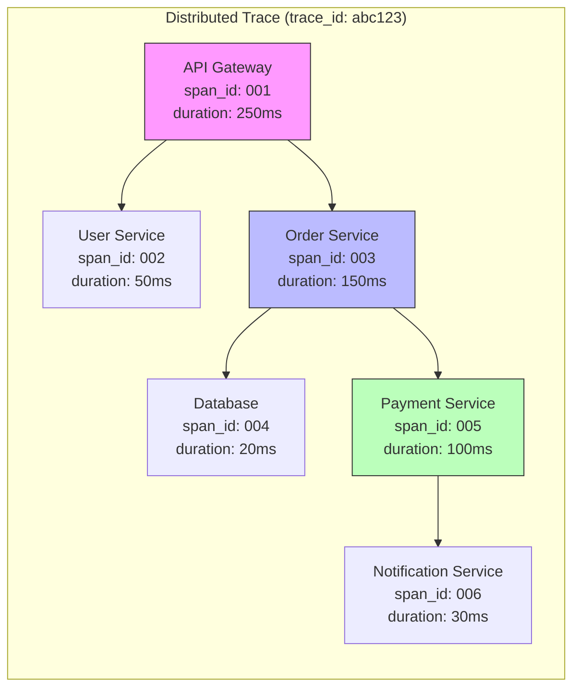
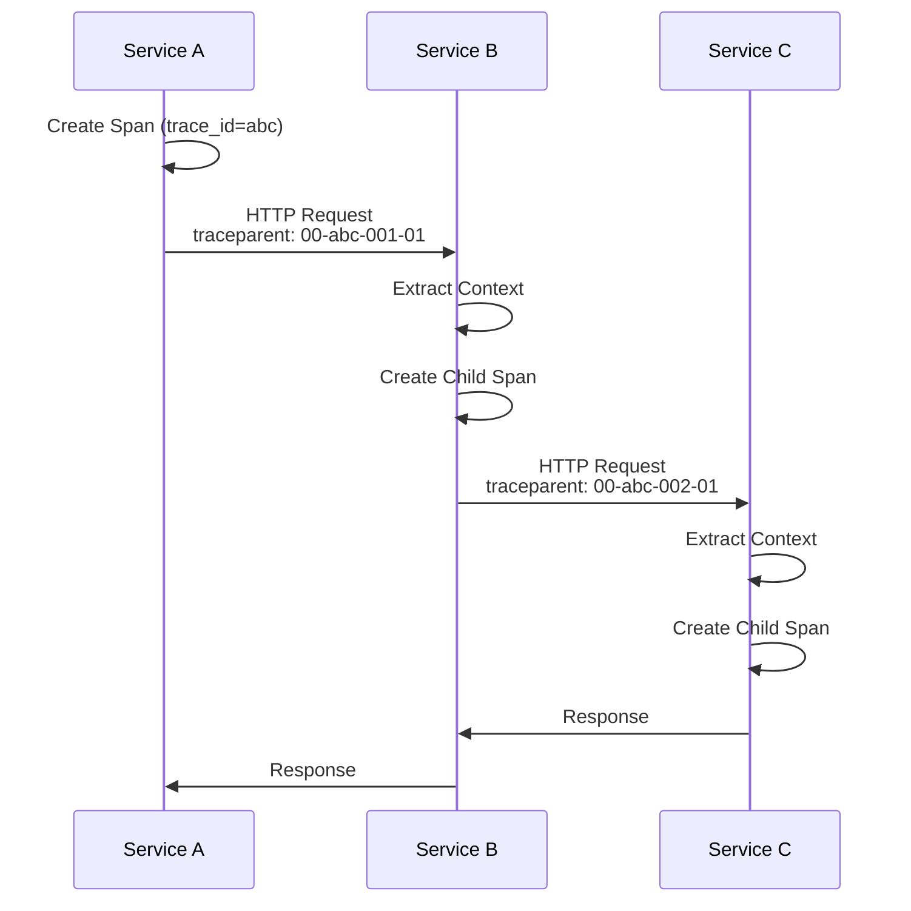
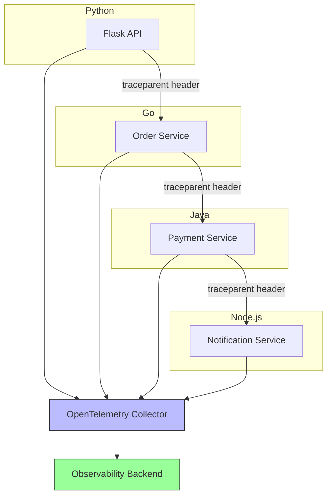
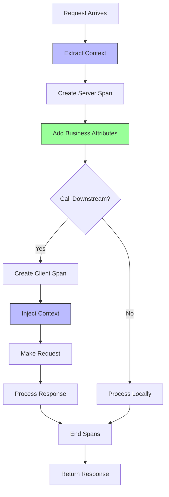

# How to Handle Distributed Tracing Across Services

Author: [nawazdhandala](https://www.github.com/nawazdhandala)

Tags: OpenTelemetry, Distributed Tracing, Microservices, Context Propagation, Observability

Description: Learn how to implement distributed tracing across multiple services using OpenTelemetry context propagation and best practices.

---

Distributed tracing is the cornerstone of observability in microservices architectures. It allows you to follow a request as it travels through multiple services, helping you understand latency, identify bottlenecks, and debug issues. This guide covers how to implement distributed tracing effectively with OpenTelemetry.

## Understanding Distributed Traces

A distributed trace represents the journey of a single request through your system:



## Context Propagation Fundamentals

The key to distributed tracing is context propagation. When one service calls another, it must pass along the trace context:



## Setting Up Distributed Tracing in Python

Here is a complete example with two services:

### Service A (API Gateway)

```python
# service_a/main.py
from flask import Flask, request, jsonify
import requests
from opentelemetry import trace
from opentelemetry.sdk.trace import TracerProvider
from opentelemetry.sdk.trace.export import BatchSpanProcessor
from opentelemetry.exporter.otlp.proto.grpc.trace_exporter import OTLPSpanExporter
from opentelemetry.instrumentation.flask import FlaskInstrumentor
from opentelemetry.instrumentation.requests import RequestsInstrumentor
from opentelemetry.propagate import inject
from opentelemetry.sdk.resources import Resource

# Configure the tracer provider with service identification
resource = Resource.create({
    "service.name": "api-gateway",
    "service.version": "1.0.0",
    "deployment.environment": "production"
})

provider = TracerProvider(resource=resource)

# Add the OTLP exporter
exporter = OTLPSpanExporter(endpoint="http://collector:4317")
provider.add_span_processor(BatchSpanProcessor(exporter))

# Set as the global tracer provider
trace.set_tracer_provider(provider)

# Get a tracer for this service
tracer = trace.get_tracer(__name__)

# Create Flask app
app = Flask(__name__)

# Automatically instrument Flask to create spans for incoming requests
FlaskInstrumentor().instrument_app(app)

# Automatically instrument requests to propagate context to outgoing calls
RequestsInstrumentor().instrument()

@app.route('/api/orders', methods=['POST'])
def create_order():
    """
    Handle order creation by coordinating with downstream services.
    Context propagation happens automatically via instrumentation.
    """
    # The Flask instrumentation already created a span for this request
    # Add custom attributes to the current span
    span = trace.get_current_span()
    span.set_attribute("order.user_id", request.json.get('user_id'))

    # Create a child span for business logic
    with tracer.start_as_current_span("validate_order") as validation_span:
        validation_span.set_attribute("order.items_count", len(request.json.get('items', [])))

        # Validate the order
        if not request.json.get('items'):
            span.set_status(trace.Status(trace.StatusCode.ERROR, "No items in order"))
            return jsonify({"error": "No items provided"}), 400

    # Call the order service - context is automatically propagated
    # The requests instrumentation will inject traceparent header
    try:
        response = requests.post(
            "http://order-service:8080/orders",
            json=request.json,
            timeout=30
        )

        span.set_attribute("downstream.status_code", response.status_code)
        return jsonify(response.json()), response.status_code

    except requests.RequestException as e:
        span.record_exception(e)
        span.set_status(trace.Status(trace.StatusCode.ERROR, str(e)))
        return jsonify({"error": "Order service unavailable"}), 503

if __name__ == '__main__':
    app.run(host='0.0.0.0', port=8000)
```

### Service B (Order Service)

```python
# service_b/main.py
from flask import Flask, request, jsonify
import requests
from opentelemetry import trace
from opentelemetry.sdk.trace import TracerProvider
from opentelemetry.sdk.trace.export import BatchSpanProcessor
from opentelemetry.exporter.otlp.proto.grpc.trace_exporter import OTLPSpanExporter
from opentelemetry.instrumentation.flask import FlaskInstrumentor
from opentelemetry.instrumentation.requests import RequestsInstrumentor
from opentelemetry.sdk.resources import Resource

# Configure with different service name
resource = Resource.create({
    "service.name": "order-service",
    "service.version": "1.0.0",
    "deployment.environment": "production"
})

provider = TracerProvider(resource=resource)
exporter = OTLPSpanExporter(endpoint="http://collector:4317")
provider.add_span_processor(BatchSpanProcessor(exporter))
trace.set_tracer_provider(provider)

tracer = trace.get_tracer(__name__)

app = Flask(__name__)
FlaskInstrumentor().instrument_app(app)
RequestsInstrumentor().instrument()

@app.route('/orders', methods=['POST'])
def create_order():
    """
    Process order creation.
    The trace context from the API gateway is automatically extracted.
    """
    span = trace.get_current_span()
    order_data = request.json

    # Add business context to the span
    span.set_attribute("order.user_id", order_data.get('user_id'))
    span.set_attribute("order.total_items", len(order_data.get('items', [])))

    # Process each item
    with tracer.start_as_current_span("process_items") as items_span:
        total = 0
        for item in order_data.get('items', []):
            total += item.get('price', 0) * item.get('quantity', 1)

        items_span.set_attribute("order.total_amount", total)

    # Call payment service
    with tracer.start_as_current_span("initiate_payment") as payment_span:
        payment_span.set_attribute("payment.amount", total)

        try:
            payment_response = requests.post(
                "http://payment-service:8080/payments",
                json={"amount": total, "user_id": order_data.get('user_id')},
                timeout=30
            )

            payment_span.set_attribute("payment.status", payment_response.json().get('status'))

        except requests.RequestException as e:
            payment_span.record_exception(e)
            payment_span.set_status(trace.Status(trace.StatusCode.ERROR, str(e)))
            return jsonify({"error": "Payment failed"}), 500

    # Create order record
    order_id = "ord_" + str(hash(str(order_data)))[:8]
    span.set_attribute("order.id", order_id)

    return jsonify({
        "order_id": order_id,
        "status": "created",
        "total": total
    })

if __name__ == '__main__':
    app.run(host='0.0.0.0', port=8080)
```

## Setting Up Distributed Tracing in Go

Here is how to implement the same pattern in Go:

### Service A (API Gateway)

```go
// service_a/main.go
package main

import (
    "context"
    "encoding/json"
    "log"
    "net/http"
    "time"

    "go.opentelemetry.io/otel"
    "go.opentelemetry.io/otel/attribute"
    "go.opentelemetry.io/otel/exporters/otlp/otlptrace/otlptracegrpc"
    "go.opentelemetry.io/otel/propagation"
    "go.opentelemetry.io/otel/sdk/resource"
    sdktrace "go.opentelemetry.io/otel/sdk/trace"
    semconv "go.opentelemetry.io/otel/semconv/v1.21.0"
    "go.opentelemetry.io/otel/trace"
    "go.opentelemetry.io/contrib/instrumentation/net/http/otelhttp"
)

var tracer trace.Tracer

func initTracer() (*sdktrace.TracerProvider, error) {
    // Create OTLP exporter
    exporter, err := otlptracegrpc.New(
        context.Background(),
        otlptracegrpc.WithEndpoint("collector:4317"),
        otlptracegrpc.WithInsecure(),
    )
    if err != nil {
        return nil, err
    }

    // Create resource with service information
    res, err := resource.Merge(
        resource.Default(),
        resource.NewWithAttributes(
            semconv.SchemaURL,
            semconv.ServiceName("api-gateway"),
            semconv.ServiceVersion("1.0.0"),
            semconv.DeploymentEnvironment("production"),
        ),
    )
    if err != nil {
        return nil, err
    }

    // Create tracer provider
    tp := sdktrace.NewTracerProvider(
        sdktrace.WithBatcher(exporter),
        sdktrace.WithResource(res),
    )

    // Set global tracer provider and propagator
    otel.SetTracerProvider(tp)
    otel.SetTextMapPropagator(propagation.NewCompositeTextMapPropagator(
        propagation.TraceContext{},
        propagation.Baggage{},
    ))

    return tp, nil
}

// httpClient is instrumented to propagate trace context
var httpClient = &http.Client{
    Transport: otelhttp.NewTransport(http.DefaultTransport),
    Timeout:   30 * time.Second,
}

func createOrderHandler(w http.ResponseWriter, r *http.Request) {
    ctx := r.Context()
    span := trace.SpanFromContext(ctx)

    // Parse request body
    var orderRequest map[string]interface{}
    if err := json.NewDecoder(r.Body).Decode(&orderRequest); err != nil {
        span.RecordError(err)
        http.Error(w, "Invalid request body", http.StatusBadRequest)
        return
    }

    // Add attributes to current span
    if userID, ok := orderRequest["user_id"].(string); ok {
        span.SetAttributes(attribute.String("order.user_id", userID))
    }

    // Create child span for validation
    ctx, validationSpan := tracer.Start(ctx, "validate_order")
    items, _ := orderRequest["items"].([]interface{})
    validationSpan.SetAttributes(attribute.Int("order.items_count", len(items)))
    validationSpan.End()

    // Forward to order service - context propagation happens automatically
    reqBody, _ := json.Marshal(orderRequest)
    req, err := http.NewRequestWithContext(ctx, "POST", "http://order-service:8080/orders",
        bytes.NewReader(reqBody))
    if err != nil {
        span.RecordError(err)
        http.Error(w, "Failed to create request", http.StatusInternalServerError)
        return
    }
    req.Header.Set("Content-Type", "application/json")

    // Make the request - otelhttp.Transport injects trace headers
    resp, err := httpClient.Do(req)
    if err != nil {
        span.RecordError(err)
        span.SetStatus(codes.Error, "Order service unavailable")
        http.Error(w, "Order service unavailable", http.StatusServiceUnavailable)
        return
    }
    defer resp.Body.Close()

    span.SetAttributes(attribute.Int("downstream.status_code", resp.StatusCode))

    // Forward response
    w.Header().Set("Content-Type", "application/json")
    w.WriteHeader(resp.StatusCode)
    io.Copy(w, resp.Body)
}

func main() {
    // Initialize tracer
    tp, err := initTracer()
    if err != nil {
        log.Fatalf("Failed to initialize tracer: %v", err)
    }
    defer tp.Shutdown(context.Background())

    tracer = otel.Tracer("api-gateway")

    // Wrap handler with instrumentation
    handler := otelhttp.NewHandler(
        http.HandlerFunc(createOrderHandler),
        "POST /api/orders",
    )

    http.Handle("/api/orders", handler)

    log.Println("API Gateway listening on :8000")
    log.Fatal(http.ListenAndServe(":8000", nil))
}
```

## Manual Context Propagation

Sometimes you need to propagate context manually (for example, with message queues):

```python
# manual_propagation.py
from opentelemetry import trace
from opentelemetry.propagate import inject, extract
from opentelemetry.trace.propagation.tracecontext import TraceContextTextMapPropagator

tracer = trace.get_tracer(__name__)
propagator = TraceContextTextMapPropagator()

def publish_to_queue(message: dict, queue_client):
    """
    Publish a message to a queue with trace context.
    """
    with tracer.start_as_current_span("publish_message") as span:
        span.set_attribute("messaging.system", "rabbitmq")
        span.set_attribute("messaging.destination", "orders")

        # Inject trace context into message headers
        headers = {}
        inject(headers)  # This adds traceparent and tracestate headers

        # Add headers to message
        message_with_context = {
            "headers": headers,
            "body": message
        }

        queue_client.publish("orders", message_with_context)
        span.set_attribute("messaging.message_id", message.get('id'))

def consume_from_queue(message: dict):
    """
    Consume a message from a queue, extracting trace context.
    """
    # Extract trace context from message headers
    headers = message.get("headers", {})
    ctx = extract(headers)

    # Create a span that continues the trace
    with tracer.start_as_current_span(
        "process_message",
        context=ctx,  # Use extracted context as parent
        kind=trace.SpanKind.CONSUMER
    ) as span:
        span.set_attribute("messaging.system", "rabbitmq")
        span.set_attribute("messaging.operation", "receive")

        # Process the message
        body = message.get("body", {})
        process_order(body)
```

## Context Propagation with Kafka

```python
# kafka_tracing.py
from kafka import KafkaProducer, KafkaConsumer
from opentelemetry import trace
from opentelemetry.propagate import inject, extract

tracer = trace.get_tracer(__name__)

class TracedKafkaProducer:
    """Kafka producer with automatic trace context injection."""

    def __init__(self, bootstrap_servers):
        self.producer = KafkaProducer(
            bootstrap_servers=bootstrap_servers,
            value_serializer=lambda v: json.dumps(v).encode('utf-8')
        )

    def send(self, topic: str, value: dict, key: str = None):
        """Send a message with trace context in headers."""
        with tracer.start_as_current_span(
            f"kafka.produce.{topic}",
            kind=trace.SpanKind.PRODUCER
        ) as span:
            span.set_attribute("messaging.system", "kafka")
            span.set_attribute("messaging.destination", topic)
            span.set_attribute("messaging.destination_kind", "topic")

            # Inject trace context into Kafka headers
            headers = []
            carrier = {}
            inject(carrier)

            for k, v in carrier.items():
                headers.append((k, v.encode('utf-8')))

            # Send with headers
            future = self.producer.send(
                topic,
                value=value,
                key=key.encode('utf-8') if key else None,
                headers=headers
            )

            # Wait for send to complete
            record_metadata = future.get(timeout=10)
            span.set_attribute("messaging.kafka.partition", record_metadata.partition)
            span.set_attribute("messaging.kafka.offset", record_metadata.offset)

class TracedKafkaConsumer:
    """Kafka consumer with automatic trace context extraction."""

    def __init__(self, topic: str, bootstrap_servers: str, group_id: str):
        self.consumer = KafkaConsumer(
            topic,
            bootstrap_servers=bootstrap_servers,
            group_id=group_id,
            value_deserializer=lambda m: json.loads(m.decode('utf-8'))
        )

    def process_messages(self, handler):
        """Process messages with trace context extraction."""
        for message in self.consumer:
            # Extract trace context from headers
            carrier = {}
            if message.headers:
                for key, value in message.headers:
                    carrier[key] = value.decode('utf-8')

            ctx = extract(carrier)

            # Create consumer span linked to producer
            with tracer.start_as_current_span(
                f"kafka.consume.{message.topic}",
                context=ctx,
                kind=trace.SpanKind.CONSUMER
            ) as span:
                span.set_attribute("messaging.system", "kafka")
                span.set_attribute("messaging.destination", message.topic)
                span.set_attribute("messaging.kafka.partition", message.partition)
                span.set_attribute("messaging.kafka.offset", message.offset)
                span.set_attribute("messaging.kafka.consumer_group", self.consumer.config['group_id'])

                try:
                    handler(message.value)
                except Exception as e:
                    span.record_exception(e)
                    span.set_status(trace.Status(trace.StatusCode.ERROR, str(e)))
                    raise
```

## Cross-Language Tracing

OpenTelemetry supports tracing across services written in different languages:



## Handling Trace Context in gRPC

```python
# grpc_tracing.py
import grpc
from opentelemetry import trace
from opentelemetry.instrumentation.grpc import (
    GrpcInstrumentorClient,
    GrpcInstrumentorServer,
)

# Instrument gRPC client
GrpcInstrumentorClient().instrument()

# Instrument gRPC server
GrpcInstrumentorServer().instrument()

# Now all gRPC calls automatically propagate trace context
```

For manual propagation in gRPC:

```python
# grpc_manual_propagation.py
import grpc
from opentelemetry import trace
from opentelemetry.propagate import inject, extract

tracer = trace.get_tracer(__name__)

class TracingClientInterceptor(grpc.UnaryUnaryClientInterceptor):
    """gRPC client interceptor that injects trace context."""

    def intercept_unary_unary(self, continuation, client_call_details, request):
        with tracer.start_as_current_span(
            f"grpc.{client_call_details.method}",
            kind=trace.SpanKind.CLIENT
        ) as span:
            # Inject trace context into metadata
            metadata = list(client_call_details.metadata or [])
            carrier = {}
            inject(carrier)

            for key, value in carrier.items():
                metadata.append((key, value))

            # Create new call details with updated metadata
            new_details = grpc.ClientCallDetails(
                method=client_call_details.method,
                timeout=client_call_details.timeout,
                metadata=metadata,
                credentials=client_call_details.credentials,
            )

            response = continuation(new_details, request)
            return response

class TracingServerInterceptor(grpc.ServerInterceptor):
    """gRPC server interceptor that extracts trace context."""

    def intercept_service(self, continuation, handler_call_details):
        # Extract trace context from metadata
        carrier = {}
        if handler_call_details.invocation_metadata:
            for key, value in handler_call_details.invocation_metadata:
                carrier[key] = value

        ctx = extract(carrier)

        # Continue with extracted context
        with tracer.start_as_current_span(
            f"grpc.{handler_call_details.method}",
            context=ctx,
            kind=trace.SpanKind.SERVER
        ):
            return continuation(handler_call_details)
```

## Baggage for Cross-Service Data

Use baggage to pass business data across service boundaries:

```python
# baggage_example.py
from opentelemetry import baggage, trace
from opentelemetry.propagate import inject, extract

tracer = trace.get_tracer(__name__)

def set_user_context(user_id: str, tenant_id: str):
    """
    Set baggage that will be propagated to all downstream services.
    """
    ctx = baggage.set_baggage("user.id", user_id)
    ctx = baggage.set_baggage("tenant.id", tenant_id, context=ctx)
    return ctx

def get_user_context():
    """
    Get baggage values in a downstream service.
    """
    user_id = baggage.get_baggage("user.id")
    tenant_id = baggage.get_baggage("tenant.id")
    return user_id, tenant_id

# In the API gateway
@app.route('/api/orders', methods=['POST'])
def create_order():
    with tracer.start_as_current_span("create_order") as span:
        # Set baggage for downstream services
        ctx = set_user_context(
            user_id=request.json.get('user_id'),
            tenant_id=request.headers.get('X-Tenant-ID')
        )

        # Baggage is automatically propagated with trace context
        response = requests.post(
            "http://order-service:8080/orders",
            json=request.json
        )
        return response.json()

# In the order service
@app.route('/orders', methods=['POST'])
def handle_order():
    with tracer.start_as_current_span("handle_order") as span:
        # Get baggage from upstream
        user_id, tenant_id = get_user_context()

        # Add to span for visibility
        span.set_attribute("user.id", user_id or "unknown")
        span.set_attribute("tenant.id", tenant_id or "unknown")

        # Process order...
```

## Best Practices Summary

1. **Use Auto-Instrumentation**: Let libraries handle context propagation where possible.

2. **Set Service Names**: Always set `service.name` resource attribute to identify services in traces.

3. **Add Business Context**: Include relevant business attributes (order IDs, user IDs) in spans.

4. **Handle Errors Properly**: Record exceptions and set error status on spans.

5. **Use Appropriate Span Kinds**: Set CLIENT, SERVER, PRODUCER, CONSUMER kinds correctly.

6. **Propagate Baggage Carefully**: Only include essential data in baggage as it adds overhead.



## Conclusion

Distributed tracing with OpenTelemetry requires proper context propagation across all service boundaries. By using auto-instrumentation libraries, you get this for free with HTTP and gRPC. For message queues and other async communication, you need to manually inject and extract trace context.

The key principles are:
- Always propagate trace context to downstream services
- Use consistent service names and semantic conventions
- Add business context to spans for better debugging
- Handle errors by recording exceptions and setting span status

With these practices in place, you will have complete visibility into request flows across your distributed system.
