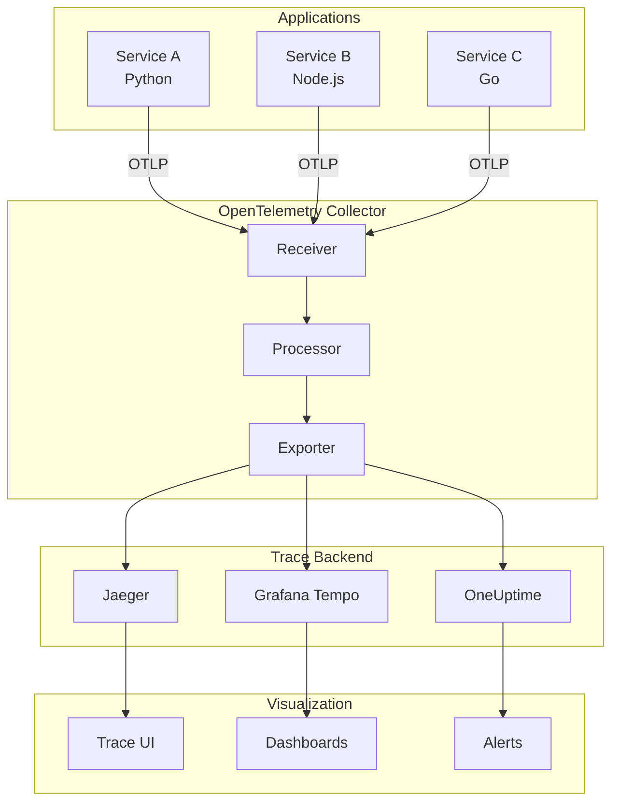
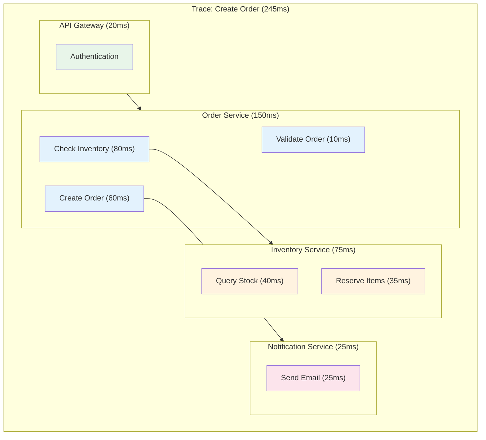

# How to Handle Distributed Tracing Setup

Author: [nawazdhandala](https://www.github.com/nawazdhandala)

Tags: Distributed Tracing, OpenTelemetry, Observability, Microservices, Jaeger, Zipkin, APM, Monitoring

Description: A complete guide to setting up distributed tracing in microservices architectures using OpenTelemetry, with practical examples for various languages and frameworks.

---

> Distributed tracing is essential for understanding request flow across microservices. This guide walks you through setting up a complete tracing infrastructure from scratch, with practical examples and best practices.

When a request touches multiple services, logs alone cannot tell you where time is spent or where failures occur. Distributed tracing connects the dots, showing the complete journey of every request.

---

## Distributed Tracing Architecture



---

## Step 1: Deploy OpenTelemetry Collector

The collector receives, processes, and exports telemetry data.

### Docker Compose Setup

```yaml
# docker-compose.yaml
version: '3.8'

services:
  otel-collector:
    image: otel/opentelemetry-collector-contrib:latest
    container_name: otel-collector
    command: ["--config=/etc/otel/config.yaml"]
    volumes:
      - ./otel-collector-config.yaml:/etc/otel/config.yaml
    ports:
      - "4317:4317"   # OTLP gRPC
      - "4318:4318"   # OTLP HTTP
      - "8888:8888"   # Prometheus metrics
      - "8889:8889"   # Prometheus exporter
      - "13133:13133" # Health check
    networks:
      - tracing

  jaeger:
    image: jaegertracing/all-in-one:latest
    container_name: jaeger
    ports:
      - "16686:16686" # Jaeger UI
      - "14250:14250" # gRPC
    environment:
      - COLLECTOR_OTLP_ENABLED=true
    networks:
      - tracing

networks:
  tracing:
    driver: bridge
```

### Collector Configuration

```yaml
# otel-collector-config.yaml
receivers:
  otlp:
    protocols:
      grpc:
        endpoint: 0.0.0.0:4317
      http:
        endpoint: 0.0.0.0:4318

processors:
  # Batch spans for efficiency
  batch:
    timeout: 1s
    send_batch_size: 1024

  # Add resource attributes
  resource:
    attributes:
      - key: environment
        value: production
        action: upsert

  # Sample traces to reduce volume
  probabilistic_sampler:
    sampling_percentage: 10

  # Filter out health checks
  filter:
    spans:
      exclude:
        match_type: regexp
        span_names:
          - "health.*"
          - "readiness.*"

exporters:
  # Jaeger
  jaeger:
    endpoint: jaeger:14250
    tls:
      insecure: true

  # OTLP to OneUptime
  otlp/oneuptime:
    endpoint: https://oneuptime.com/otlp
    headers:
      x-oneuptime-token: ${ONEUPTIME_TOKEN}

  # Debug logging
  logging:
    loglevel: debug

  # Prometheus metrics from spans
  prometheus:
    endpoint: 0.0.0.0:8889
    namespace: traces

service:
  pipelines:
    traces:
      receivers: [otlp]
      processors: [batch, resource, filter]
      exporters: [jaeger, otlp/oneuptime, logging]

  extensions: [health_check]

extensions:
  health_check:
    endpoint: 0.0.0.0:13133
```

---

## Step 2: Instrument Python Applications

### Installation

```bash
pip install opentelemetry-api \
    opentelemetry-sdk \
    opentelemetry-exporter-otlp \
    opentelemetry-instrumentation-flask \
    opentelemetry-instrumentation-requests \
    opentelemetry-instrumentation-sqlalchemy
```

### Base Configuration

```python
# telemetry.py
import os
from opentelemetry import trace
from opentelemetry.sdk.trace import TracerProvider
from opentelemetry.sdk.trace.export import BatchSpanProcessor
from opentelemetry.exporter.otlp.proto.grpc.trace_exporter import OTLPSpanExporter
from opentelemetry.sdk.resources import Resource, SERVICE_NAME, SERVICE_VERSION
from opentelemetry.propagate import set_global_textmap
from opentelemetry.propagators.composite import CompositePropagator
from opentelemetry.trace.propagation.tracecontext import TraceContextTextMapPropagator
from opentelemetry.propagators.b3 import B3MultiFormat


def setup_tracing(service_name: str, service_version: str = "1.0.0"):
    """Initialize OpenTelemetry tracing"""

    # Create resource with service info
    resource = Resource.create({
        SERVICE_NAME: service_name,
        SERVICE_VERSION: service_version,
        "deployment.environment": os.getenv("ENVIRONMENT", "development"),
        "host.name": os.getenv("HOSTNAME", "unknown"),
    })

    # Create tracer provider
    provider = TracerProvider(resource=resource)

    # Configure OTLP exporter
    otlp_exporter = OTLPSpanExporter(
        endpoint=os.getenv("OTEL_EXPORTER_OTLP_ENDPOINT", "http://localhost:4317"),
        insecure=True  # Set to False in production with TLS
    )

    # Add batch processor for efficiency
    provider.add_span_processor(
        BatchSpanProcessor(
            otlp_exporter,
            max_queue_size=2048,
            max_export_batch_size=512,
            schedule_delay_millis=5000
        )
    )

    # Set as global provider
    trace.set_tracer_provider(provider)

    # Configure context propagation
    propagator = CompositePropagator([
        TraceContextTextMapPropagator(),  # W3C standard
        B3MultiFormat()                    # Zipkin compatible
    ])
    set_global_textmap(propagator)

    return trace.get_tracer(service_name)


def get_tracer(name: str):
    """Get a tracer for a module"""
    return trace.get_tracer(name)
```

### Flask Application

```python
# app.py
from flask import Flask, request, jsonify
from opentelemetry.instrumentation.flask import FlaskInstrumentor
from opentelemetry.instrumentation.requests import RequestsInstrumentor
from opentelemetry import trace
import requests

from telemetry import setup_tracing, get_tracer

# Initialize tracing before creating app
tracer = setup_tracing("order-service", "1.0.0")

app = Flask(__name__)

# Auto-instrument Flask
FlaskInstrumentor().instrument_app(app)

# Auto-instrument requests library
RequestsInstrumentor().instrument()

# Manual tracer for custom spans
order_tracer = get_tracer("order.processing")


@app.route("/api/orders", methods=["POST"])
def create_order():
    """Create a new order with tracing"""

    data = request.json

    # Create custom span for business logic
    with order_tracer.start_as_current_span("validate_order") as span:
        span.set_attribute("order.customer_id", data.get("customer_id"))
        span.set_attribute("order.item_count", len(data.get("items", [])))

        # Validate order
        validation_result = validate_order(data)
        span.set_attribute("order.valid", validation_result["valid"])

    # Call inventory service
    with order_tracer.start_as_current_span("check_inventory") as span:
        # Trace context is automatically propagated
        inventory_response = requests.post(
            "http://inventory-service/api/check",
            json={"items": data.get("items")}
        )
        span.set_attribute("inventory.available", inventory_response.json()["available"])

    # Process order
    with order_tracer.start_as_current_span("process_order") as span:
        order_id = process_order(data)
        span.set_attribute("order.id", order_id)

    return jsonify({"order_id": order_id, "status": "created"})


@app.route("/health")
def health():
    return jsonify({"status": "healthy"})


def validate_order(data):
    return {"valid": True}


def process_order(data):
    return "order-12345"


if __name__ == "__main__":
    app.run(host="0.0.0.0", port=5000)
```

### FastAPI Application

```python
# fastapi_app.py
from fastapi import FastAPI, Request
from opentelemetry.instrumentation.fastapi import FastAPIInstrumentor
from opentelemetry.instrumentation.httpx import HTTPXClientInstrumentor
from opentelemetry import trace
import httpx

from telemetry import setup_tracing, get_tracer

# Initialize tracing
tracer = setup_tracing("user-service", "1.0.0")

app = FastAPI()

# Auto-instrument FastAPI
FastAPIInstrumentor.instrument_app(app)

# Auto-instrument httpx
HTTPXClientInstrumentor().instrument()

user_tracer = get_tracer("user.operations")


@app.post("/api/users")
async def create_user(request: Request):
    """Create user with traced operations"""

    data = await request.json()
    current_span = trace.get_current_span()

    # Add attributes to current span
    current_span.set_attribute("user.email", data.get("email"))

    with user_tracer.start_as_current_span("validate_email") as span:
        is_valid = await validate_email(data.get("email"))
        span.set_attribute("email.valid", is_valid)

    with user_tracer.start_as_current_span("create_user_record") as span:
        user_id = await create_user_in_db(data)
        span.set_attribute("user.id", user_id)

    # Call notification service
    with user_tracer.start_as_current_span("send_welcome_email") as span:
        async with httpx.AsyncClient() as client:
            await client.post(
                "http://notification-service/api/email",
                json={"user_id": user_id, "template": "welcome"}
            )

    return {"user_id": user_id}


async def validate_email(email):
    return True


async def create_user_in_db(data):
    return "user-67890"
```

---

## Step 3: Instrument Node.js Applications

### Installation

```bash
npm install @opentelemetry/api \
    @opentelemetry/sdk-node \
    @opentelemetry/auto-instrumentations-node \
    @opentelemetry/exporter-trace-otlp-grpc
```

### Setup

```javascript
// tracing.js
const { NodeSDK } = require('@opentelemetry/sdk-node');
const { getNodeAutoInstrumentations } = require('@opentelemetry/auto-instrumentations-node');
const { OTLPTraceExporter } = require('@opentelemetry/exporter-trace-otlp-grpc');
const { Resource } = require('@opentelemetry/resources');
const { SemanticResourceAttributes } = require('@opentelemetry/semantic-conventions');

// Configure the SDK
const sdk = new NodeSDK({
  resource: new Resource({
    [SemanticResourceAttributes.SERVICE_NAME]: 'notification-service',
    [SemanticResourceAttributes.SERVICE_VERSION]: '1.0.0',
    'deployment.environment': process.env.ENVIRONMENT || 'development',
  }),

  traceExporter: new OTLPTraceExporter({
    url: process.env.OTEL_EXPORTER_OTLP_ENDPOINT || 'http://localhost:4317',
  }),

  // Auto-instrument common libraries
  instrumentations: [
    getNodeAutoInstrumentations({
      // Disable fs instrumentation (too noisy)
      '@opentelemetry/instrumentation-fs': {
        enabled: false,
      },
      // Configure HTTP instrumentation
      '@opentelemetry/instrumentation-http': {
        ignoreIncomingPaths: ['/health', '/ready'],
      },
    }),
  ],
});

// Start the SDK
sdk.start();

// Graceful shutdown
process.on('SIGTERM', () => {
  sdk.shutdown()
    .then(() => console.log('Tracing terminated'))
    .catch((error) => console.log('Error terminating tracing', error))
    .finally(() => process.exit(0));
});

module.exports = sdk;
```

### Express Application

```javascript
// app.js
// Import tracing first!
require('./tracing');

const express = require('express');
const { trace, SpanStatusCode } = require('@opentelemetry/api');

const app = express();
app.use(express.json());

// Get tracer
const tracer = trace.getTracer('notification-service');

app.post('/api/email', async (req, res) => {
  const { user_id, template } = req.body;

  // Create custom span
  const span = tracer.startSpan('send_email');
  span.setAttribute('email.user_id', user_id);
  span.setAttribute('email.template', template);

  try {
    // Simulate email sending
    await sendEmail(user_id, template);

    span.setStatus({ code: SpanStatusCode.OK });
    res.json({ status: 'sent' });

  } catch (error) {
    span.setStatus({
      code: SpanStatusCode.ERROR,
      message: error.message,
    });
    span.recordException(error);
    res.status(500).json({ error: error.message });

  } finally {
    span.end();
  }
});

app.post('/api/sms', async (req, res) => {
  const { phone, message } = req.body;

  // Use span context manager pattern
  await tracer.startActiveSpan('send_sms', async (span) => {
    try {
      span.setAttribute('sms.phone', phone.substring(0, 6) + '****');

      // Nested span
      await tracer.startActiveSpan('validate_phone', async (validateSpan) => {
        const isValid = validatePhone(phone);
        validateSpan.setAttribute('phone.valid', isValid);
        validateSpan.end();
      });

      await tracer.startActiveSpan('deliver_sms', async (deliverSpan) => {
        await deliverSMS(phone, message);
        deliverSpan.end();
      });

      span.setStatus({ code: SpanStatusCode.OK });
      res.json({ status: 'sent' });

    } catch (error) {
      span.setStatus({ code: SpanStatusCode.ERROR, message: error.message });
      span.recordException(error);
      res.status(500).json({ error: error.message });

    } finally {
      span.end();
    }
  });
});

async function sendEmail(userId, template) {
  // Simulate delay
  await new Promise(resolve => setTimeout(resolve, 100));
}

function validatePhone(phone) {
  return phone && phone.length >= 10;
}

async function deliverSMS(phone, message) {
  await new Promise(resolve => setTimeout(resolve, 50));
}

app.listen(3000, () => {
  console.log('Notification service running on port 3000');
});
```

---

## Step 4: Instrument Go Applications

### Installation

```bash
go get go.opentelemetry.io/otel
go get go.opentelemetry.io/otel/sdk
go get go.opentelemetry.io/otel/exporters/otlp/otlptrace/otlptracegrpc
go get go.opentelemetry.io/contrib/instrumentation/net/http/otelhttp
```

### Setup

```go
// telemetry/telemetry.go
package telemetry

import (
    "context"
    "os"

    "go.opentelemetry.io/otel"
    "go.opentelemetry.io/otel/attribute"
    "go.opentelemetry.io/otel/exporters/otlp/otlptrace/otlptracegrpc"
    "go.opentelemetry.io/otel/propagation"
    "go.opentelemetry.io/otel/sdk/resource"
    sdktrace "go.opentelemetry.io/otel/sdk/trace"
    semconv "go.opentelemetry.io/otel/semconv/v1.17.0"
    "go.opentelemetry.io/otel/trace"
)

var tracer trace.Tracer

// InitTracing initializes OpenTelemetry tracing
func InitTracing(ctx context.Context, serviceName, serviceVersion string) (func(), error) {
    // Create OTLP exporter
    exporter, err := otlptracegrpc.New(ctx,
        otlptracegrpc.WithEndpoint(getEnv("OTEL_EXPORTER_OTLP_ENDPOINT", "localhost:4317")),
        otlptracegrpc.WithInsecure(),
    )
    if err != nil {
        return nil, err
    }

    // Create resource
    res, err := resource.New(ctx,
        resource.WithAttributes(
            semconv.ServiceName(serviceName),
            semconv.ServiceVersion(serviceVersion),
            attribute.String("deployment.environment", getEnv("ENVIRONMENT", "development")),
        ),
    )
    if err != nil {
        return nil, err
    }

    // Create tracer provider
    tp := sdktrace.NewTracerProvider(
        sdktrace.WithBatcher(exporter),
        sdktrace.WithResource(res),
        sdktrace.WithSampler(sdktrace.AlwaysSample()),
    )

    // Set global tracer provider
    otel.SetTracerProvider(tp)

    // Set global propagator
    otel.SetTextMapPropagator(propagation.NewCompositeTextMapPropagator(
        propagation.TraceContext{},
        propagation.Baggage{},
    ))

    // Get tracer
    tracer = tp.Tracer(serviceName)

    // Return cleanup function
    return func() {
        tp.Shutdown(ctx)
    }, nil
}

// GetTracer returns the global tracer
func GetTracer() trace.Tracer {
    return tracer
}

func getEnv(key, defaultValue string) string {
    if value := os.Getenv(key); value != "" {
        return value
    }
    return defaultValue
}
```

### HTTP Server

```go
// main.go
package main

import (
    "context"
    "encoding/json"
    "log"
    "net/http"

    "go.opentelemetry.io/contrib/instrumentation/net/http/otelhttp"
    "go.opentelemetry.io/otel/attribute"
    "go.opentelemetry.io/otel/codes"

    "myapp/telemetry"
)

func main() {
    ctx := context.Background()

    // Initialize tracing
    cleanup, err := telemetry.InitTracing(ctx, "inventory-service", "1.0.0")
    if err != nil {
        log.Fatalf("Failed to initialize tracing: %v", err)
    }
    defer cleanup()

    // Create traced HTTP handlers
    mux := http.NewServeMux()
    mux.Handle("/api/check", otelhttp.NewHandler(
        http.HandlerFunc(checkInventory),
        "check_inventory",
    ))

    // Wrap entire server with tracing
    handler := otelhttp.NewHandler(mux, "inventory-service")

    log.Println("Starting inventory service on :8080")
    log.Fatal(http.ListenAndServe(":8080", handler))
}

func checkInventory(w http.ResponseWriter, r *http.Request) {
    ctx := r.Context()
    tracer := telemetry.GetTracer()

    // Create span for business logic
    ctx, span := tracer.Start(ctx, "process_inventory_check")
    defer span.End()

    var request struct {
        Items []struct {
            ProductID string `json:"product_id"`
            Quantity  int    `json:"quantity"`
        } `json:"items"`
    }

    if err := json.NewDecoder(r.Body).Decode(&request); err != nil {
        span.SetStatus(codes.Error, "Invalid request")
        span.RecordError(err)
        http.Error(w, "Invalid request", http.StatusBadRequest)
        return
    }

    span.SetAttributes(attribute.Int("items.count", len(request.Items)))

    // Check each item
    allAvailable := true
    for _, item := range request.Items {
        _, itemSpan := tracer.Start(ctx, "check_item_stock")
        itemSpan.SetAttributes(
            attribute.String("product.id", item.ProductID),
            attribute.Int("quantity.requested", item.Quantity),
        )

        available := checkStock(item.ProductID, item.Quantity)
        itemSpan.SetAttributes(attribute.Bool("available", available))
        itemSpan.End()

        if !available {
            allAvailable = false
        }
    }

    span.SetAttributes(attribute.Bool("all_available", allAvailable))

    response := map[string]interface{}{
        "available": allAvailable,
    }

    w.Header().Set("Content-Type", "application/json")
    json.NewEncoder(w).Encode(response)
}

func checkStock(productID string, quantity int) bool {
    // Simulated stock check
    return true
}
```

---

## Step 5: Configure Sampling

```yaml
# otel-collector-config.yaml - Sampling strategies
processors:
  # Probabilistic sampling: sample 10% of traces
  probabilistic_sampler:
    sampling_percentage: 10

  # Tail-based sampling: sample based on trace characteristics
  tail_sampling:
    decision_wait: 10s
    num_traces: 100000
    expected_new_traces_per_sec: 1000
    policies:
      # Always sample errors
      - name: errors
        type: status_code
        status_code:
          status_codes: [ERROR]

      # Always sample slow traces (> 1s)
      - name: slow-traces
        type: latency
        latency:
          threshold_ms: 1000

      # Sample 10% of everything else
      - name: probabilistic
        type: probabilistic
        probabilistic:
          sampling_percentage: 10

      # Always sample specific operations
      - name: important-operations
        type: string_attribute
        string_attribute:
          key: operation.important
          values: ["true"]

service:
  pipelines:
    traces:
      receivers: [otlp]
      processors: [tail_sampling, batch]
      exporters: [jaeger]
```

---

## Step 6: Add Context and Attributes

```python
# context_enrichment.py
from opentelemetry import trace, baggage
from opentelemetry.context import attach, detach
from functools import wraps


def enrich_span_with_request_context(span, request):
    """Add request context to span"""

    # User context
    if hasattr(request, 'user') and request.user:
        span.set_attribute("user.id", str(request.user.id))
        span.set_attribute("user.role", request.user.role)

    # Request context
    span.set_attribute("http.request_id", request.headers.get("X-Request-ID", "unknown"))
    span.set_attribute("http.client_ip", request.remote_addr)
    span.set_attribute("http.user_agent", request.headers.get("User-Agent", "unknown"))

    # Business context
    if request.headers.get("X-Tenant-ID"):
        span.set_attribute("tenant.id", request.headers.get("X-Tenant-ID"))


def add_baggage(key: str, value: str):
    """Add baggage that propagates across services"""
    ctx = baggage.set_baggage(key, value)
    return attach(ctx)


def traced_operation(operation_name: str, attributes: dict = None):
    """Decorator for traced operations"""
    def decorator(func):
        @wraps(func)
        def wrapper(*args, **kwargs):
            tracer = trace.get_tracer(__name__)

            with tracer.start_as_current_span(operation_name) as span:
                # Add provided attributes
                if attributes:
                    for key, value in attributes.items():
                        span.set_attribute(key, value)

                # Add function info
                span.set_attribute("code.function", func.__name__)
                span.set_attribute("code.filepath", func.__code__.co_filename)

                try:
                    result = func(*args, **kwargs)
                    return result
                except Exception as e:
                    span.set_status(trace.Status(trace.StatusCode.ERROR, str(e)))
                    span.record_exception(e)
                    raise

        return wrapper
    return decorator


# Usage
@traced_operation("process_payment", {"payment.type": "credit_card"})
def process_payment(order_id: str, amount: float):
    span = trace.get_current_span()
    span.set_attribute("payment.amount", amount)
    span.set_attribute("payment.currency", "USD")
    # Process payment
    return {"status": "success"}
```

---

## Trace Visualization



---

## Health Checks and Monitoring

```python
# tracing_health.py
from opentelemetry import trace
from prometheus_client import Counter, Histogram, Gauge
import time


# Metrics for tracing health
spans_created = Counter(
    'tracing_spans_created_total',
    'Total spans created',
    ['service', 'operation']
)

span_duration = Histogram(
    'tracing_span_duration_seconds',
    'Span duration',
    ['service', 'operation'],
    buckets=[.005, .01, .025, .05, .1, .25, .5, 1, 2.5, 5, 10]
)

export_errors = Counter(
    'tracing_export_errors_total',
    'Trace export errors',
    ['service']
)


class TracingHealthCheck:
    """Health check for tracing infrastructure"""

    def __init__(self, service_name: str):
        self.service_name = service_name
        self.tracer = trace.get_tracer(service_name)

    def check(self) -> dict:
        """Run tracing health check"""
        results = {
            "healthy": True,
            "checks": {}
        }

        # Test span creation
        try:
            start = time.time()
            with self.tracer.start_as_current_span("health_check"):
                pass
            duration = time.time() - start

            results["checks"]["span_creation"] = {
                "status": "ok",
                "duration_ms": duration * 1000
            }
        except Exception as e:
            results["healthy"] = False
            results["checks"]["span_creation"] = {
                "status": "error",
                "error": str(e)
            }

        # Check tracer provider
        provider = trace.get_tracer_provider()
        results["checks"]["tracer_provider"] = {
            "status": "ok" if provider else "error",
            "type": type(provider).__name__
        }

        return results


# FastAPI health endpoint
@app.get("/health/tracing")
async def tracing_health():
    checker = TracingHealthCheck("my-service")
    return checker.check()
```

---

## Best Practices

### 1. Use Semantic Conventions

```python
# Follow OpenTelemetry semantic conventions
from opentelemetry.semconv.trace import SpanAttributes

span.set_attribute(SpanAttributes.HTTP_METHOD, "POST")
span.set_attribute(SpanAttributes.HTTP_URL, url)
span.set_attribute(SpanAttributes.HTTP_STATUS_CODE, 200)
span.set_attribute(SpanAttributes.DB_SYSTEM, "postgresql")
span.set_attribute(SpanAttributes.DB_STATEMENT, "SELECT * FROM users")
```

### 2. Name Spans Meaningfully

```python
# BAD: Generic names
tracer.start_span("process")
tracer.start_span("query")

# GOOD: Descriptive names
tracer.start_span("validate_order_items")
tracer.start_span("db.users.find_by_email")
```

### 3. Add Business Context

```python
span.set_attribute("order.id", order_id)
span.set_attribute("order.total", total_amount)
span.set_attribute("customer.tier", "premium")
```

### 4. Handle Errors Properly

```python
try:
    result = process()
except Exception as e:
    span.set_status(trace.Status(trace.StatusCode.ERROR, str(e)))
    span.record_exception(e)
    raise
```

---

## Conclusion

Distributed tracing is essential for observability in microservices. Key setup steps:

- **Deploy collector**: Centralize trace collection and processing
- **Instrument applications**: Use auto-instrumentation where possible
- **Configure sampling**: Balance visibility with cost
- **Add context**: Include business-relevant attributes
- **Monitor health**: Ensure tracing infrastructure is working

With proper tracing, you can understand exactly how requests flow through your system.

---

*Ready to set up distributed tracing? [OneUptime](https://oneuptime.com) provides a complete observability platform with distributed tracing, metrics, and logs in one place.*

**Related Reading:**
- [How to Implement Distributed Tracing in Python Microservices](https://oneuptime.com/blog/post/2025-01-06-python-distributed-tracing-microservices/view)
- [How to Name Spans in OpenTelemetry](https://oneuptime.com/blog/post/2024-11-04-how-to-name-spans-in-opentelemetry/view)
