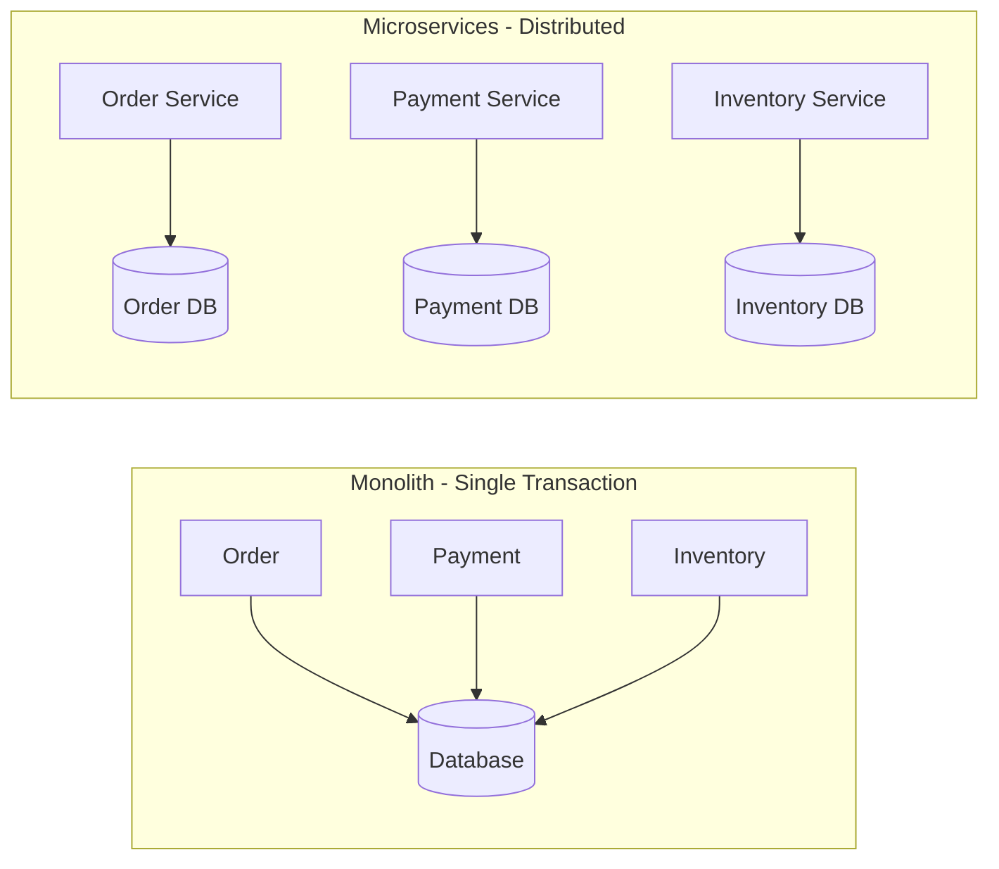
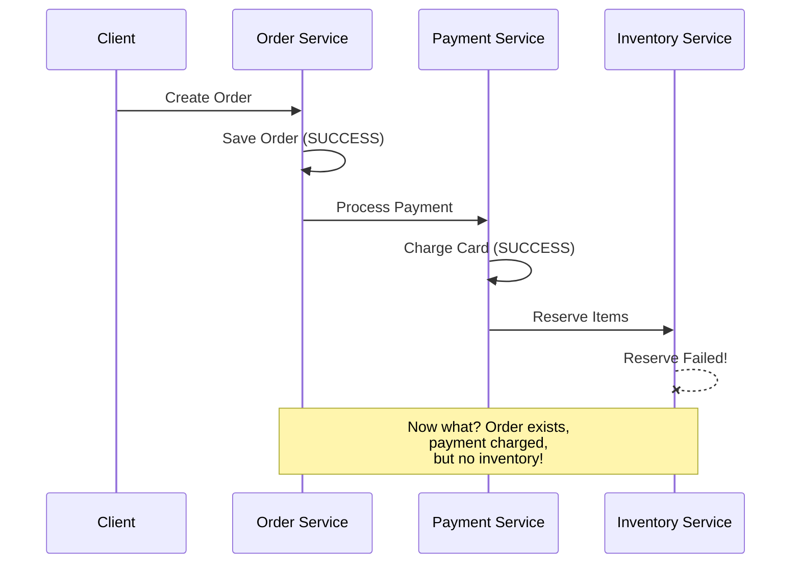
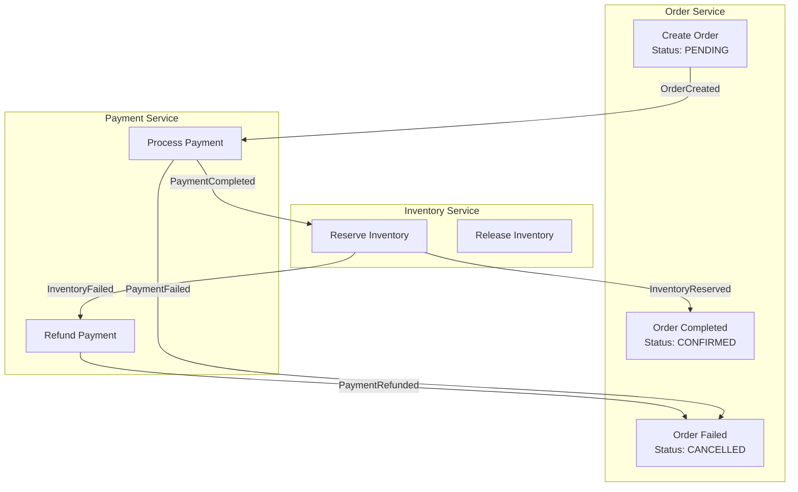
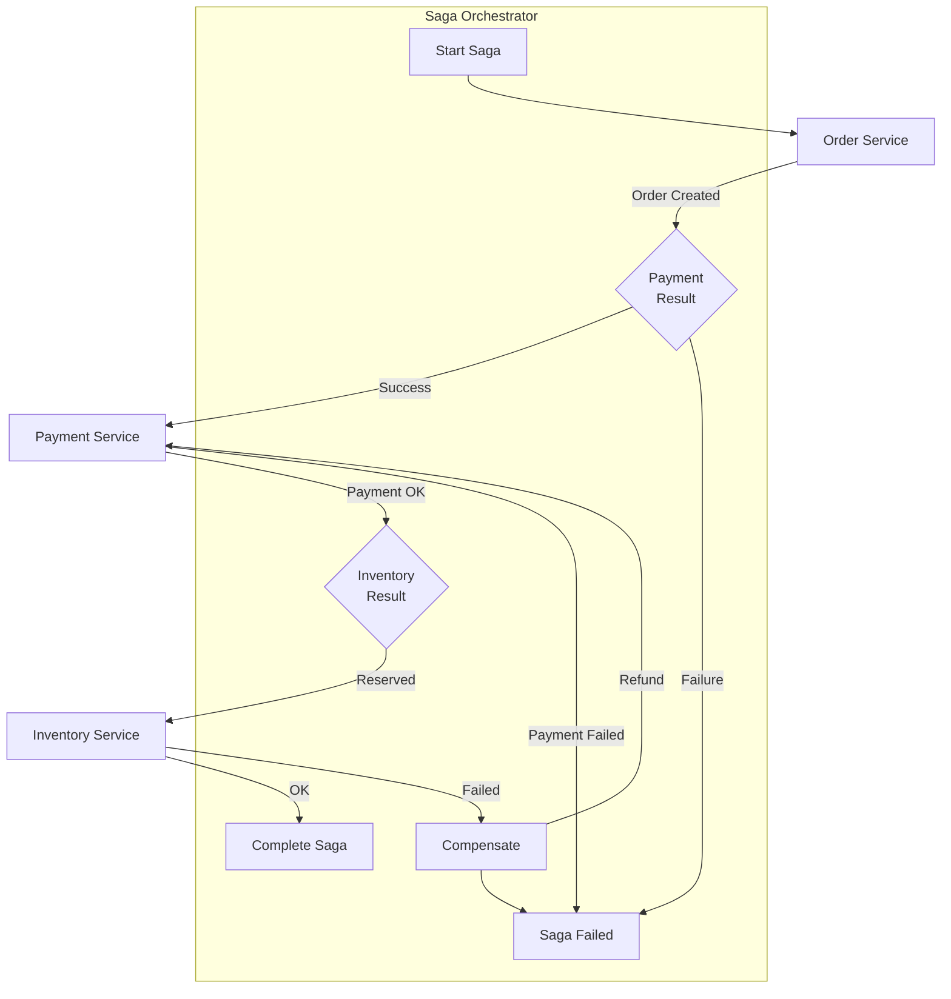
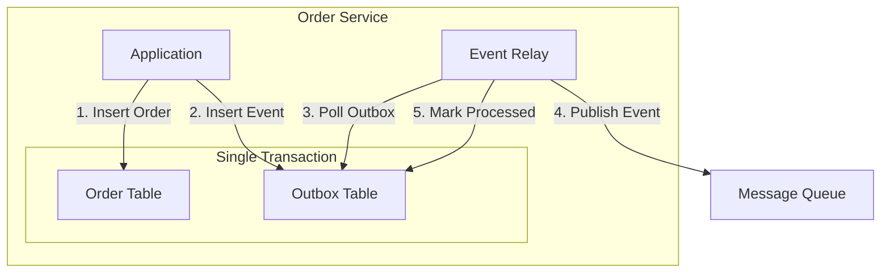
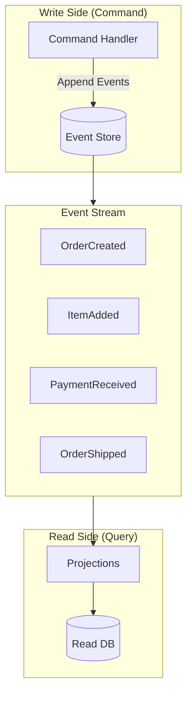
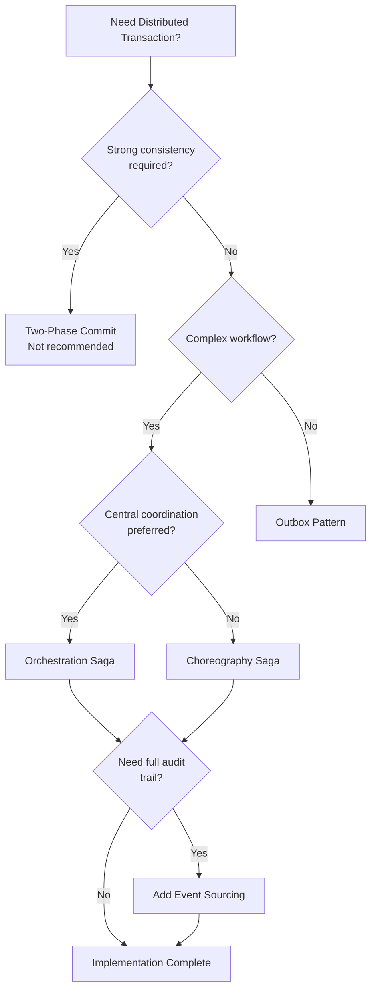

# How to Handle Distributed Transactions in Microservices

Author: [nawazdhandala](https://www.github.com/nawazdhandala)

Tags: Microservices, Distributed Transactions, Saga Pattern, Event Sourcing, CQRS, Eventual Consistency, DevOps

Description: A practical guide to handling distributed transactions in microservices using the Saga pattern, outbox pattern, and eventual consistency strategies.

---

In a monolithic application, database transactions are straightforward: wrap operations in a transaction and either commit or rollback. In microservices, each service has its own database, making traditional ACID transactions impossible across service boundaries.

## The Distributed Transaction Problem



### What Can Go Wrong

Consider an e-commerce order flow:



## Pattern 1: The Saga Pattern

Sagas manage distributed transactions as a sequence of local transactions with compensating actions for failures.

### Choreography-Based Saga

Services communicate through events without a central coordinator.



### Implementation: Choreography Saga

```javascript
// Order Service
class OrderService {
    constructor(eventBus, orderRepository) {
        this.eventBus = eventBus;
        this.orderRepository = orderRepository;

        // Subscribe to saga events
        this.eventBus.subscribe('PaymentCompleted', this.onPaymentCompleted.bind(this));
        this.eventBus.subscribe('PaymentFailed', this.onPaymentFailed.bind(this));
        this.eventBus.subscribe('InventoryReserved', this.onInventoryReserved.bind(this));
        this.eventBus.subscribe('InventoryFailed', this.onInventoryFailed.bind(this));
    }

    async createOrder(orderData) {
        // Create order in pending state
        const order = await this.orderRepository.create({
            ...orderData,
            status: 'PENDING',
            sagaState: 'STARTED',
            createdAt: new Date()
        });

        // Publish event to start saga
        await this.eventBus.publish('OrderCreated', {
            orderId: order.id,
            customerId: order.customerId,
            items: order.items,
            totalAmount: order.totalAmount
        });

        return order;
    }

    async onPaymentCompleted(event) {
        await this.orderRepository.updateSagaState(event.orderId, 'PAYMENT_COMPLETED');
    }

    async onPaymentFailed(event) {
        // Payment failed - cancel order
        await this.orderRepository.update(event.orderId, {
            status: 'CANCELLED',
            sagaState: 'FAILED',
            failureReason: event.reason
        });
    }

    async onInventoryReserved(event) {
        // All steps completed - confirm order
        await this.orderRepository.update(event.orderId, {
            status: 'CONFIRMED',
            sagaState: 'COMPLETED'
        });

        await this.eventBus.publish('OrderConfirmed', {
            orderId: event.orderId
        });
    }

    async onInventoryFailed(event) {
        // Inventory failed - need to compensate payment
        await this.orderRepository.updateSagaState(event.orderId, 'COMPENSATING');

        await this.eventBus.publish('CompensatePayment', {
            orderId: event.orderId,
            reason: event.reason
        });
    }
}

// Payment Service
class PaymentService {
    constructor(eventBus, paymentRepository, paymentGateway) {
        this.eventBus = eventBus;
        this.paymentRepository = paymentRepository;
        this.paymentGateway = paymentGateway;

        this.eventBus.subscribe('OrderCreated', this.onOrderCreated.bind(this));
        this.eventBus.subscribe('CompensatePayment', this.onCompensatePayment.bind(this));
    }

    async onOrderCreated(event) {
        try {
            // Process payment
            const paymentResult = await this.paymentGateway.charge({
                customerId: event.customerId,
                amount: event.totalAmount,
                orderId: event.orderId
            });

            // Save payment record
            await this.paymentRepository.create({
                orderId: event.orderId,
                transactionId: paymentResult.transactionId,
                amount: event.totalAmount,
                status: 'COMPLETED'
            });

            // Publish success event
            await this.eventBus.publish('PaymentCompleted', {
                orderId: event.orderId,
                transactionId: paymentResult.transactionId
            });

        } catch (error) {
            // Publish failure event
            await this.eventBus.publish('PaymentFailed', {
                orderId: event.orderId,
                reason: error.message
            });
        }
    }

    async onCompensatePayment(event) {
        // Refund the payment
        const payment = await this.paymentRepository.findByOrderId(event.orderId);

        if (payment && payment.status === 'COMPLETED') {
            await this.paymentGateway.refund(payment.transactionId);

            await this.paymentRepository.update(payment.id, {
                status: 'REFUNDED',
                refundReason: event.reason
            });
        }

        await this.eventBus.publish('PaymentRefunded', {
            orderId: event.orderId
        });
    }
}

// Inventory Service
class InventoryService {
    constructor(eventBus, inventoryRepository) {
        this.eventBus = eventBus;
        this.inventoryRepository = inventoryRepository;

        this.eventBus.subscribe('PaymentCompleted', this.onPaymentCompleted.bind(this));
    }

    async onPaymentCompleted(event) {
        try {
            // Reserve inventory for all items
            const reservation = await this.inventoryRepository.reserveItems(
                event.orderId,
                event.items
            );

            await this.eventBus.publish('InventoryReserved', {
                orderId: event.orderId,
                reservationId: reservation.id
            });

        } catch (error) {
            await this.eventBus.publish('InventoryFailed', {
                orderId: event.orderId,
                reason: error.message
            });
        }
    }
}
```

### Orchestration-Based Saga

A central orchestrator controls the saga flow.



### Implementation: Orchestration Saga

```java
package com.example.saga;

import java.util.UUID;

// Saga Orchestrator
@Service
public class OrderSagaOrchestrator {

    private final SagaRepository sagaRepository;
    private final OrderServiceClient orderClient;
    private final PaymentServiceClient paymentClient;
    private final InventoryServiceClient inventoryClient;

    public OrderSagaOrchestrator(
            SagaRepository sagaRepository,
            OrderServiceClient orderClient,
            PaymentServiceClient paymentClient,
            InventoryServiceClient inventoryClient) {
        this.sagaRepository = sagaRepository;
        this.orderClient = orderClient;
        this.paymentClient = paymentClient;
        this.inventoryClient = inventoryClient;
    }

    @Transactional
    public String startSaga(CreateOrderRequest request) {
        // Create saga instance
        String sagaId = UUID.randomUUID().toString();
        SagaState saga = new SagaState(sagaId, SagaStatus.STARTED);
        saga.setOrderData(request);
        sagaRepository.save(saga);

        // Execute saga steps
        executeSaga(sagaId);

        return sagaId;
    }

    @Async
    public void executeSaga(String sagaId) {
        SagaState saga = sagaRepository.findById(sagaId)
            .orElseThrow(() -> new SagaNotFoundException(sagaId));

        try {
            // Step 1: Create Order
            if (saga.getStatus() == SagaStatus.STARTED) {
                OrderResponse order = orderClient.createOrder(saga.getOrderData());
                saga.setOrderId(order.getId());
                saga.setStatus(SagaStatus.ORDER_CREATED);
                sagaRepository.save(saga);
            }

            // Step 2: Process Payment
            if (saga.getStatus() == SagaStatus.ORDER_CREATED) {
                PaymentResponse payment = paymentClient.processPayment(
                    new PaymentRequest(saga.getOrderId(), saga.getTotalAmount())
                );
                saga.setPaymentId(payment.getTransactionId());
                saga.setStatus(SagaStatus.PAYMENT_COMPLETED);
                sagaRepository.save(saga);
            }

            // Step 3: Reserve Inventory
            if (saga.getStatus() == SagaStatus.PAYMENT_COMPLETED) {
                InventoryResponse inventory = inventoryClient.reserveInventory(
                    new InventoryRequest(saga.getOrderId(), saga.getItems())
                );
                saga.setReservationId(inventory.getReservationId());
                saga.setStatus(SagaStatus.INVENTORY_RESERVED);
                sagaRepository.save(saga);
            }

            // Step 4: Confirm Order
            if (saga.getStatus() == SagaStatus.INVENTORY_RESERVED) {
                orderClient.confirmOrder(saga.getOrderId());
                saga.setStatus(SagaStatus.COMPLETED);
                sagaRepository.save(saga);
            }

        } catch (Exception e) {
            log.error("Saga {} failed at step {}: {}", sagaId, saga.getStatus(), e.getMessage());
            compensate(saga);
        }
    }

    private void compensate(SagaState saga) {
        saga.setStatus(SagaStatus.COMPENSATING);
        sagaRepository.save(saga);

        try {
            // Compensate in reverse order
            if (saga.getReservationId() != null) {
                inventoryClient.releaseInventory(saga.getReservationId());
            }

            if (saga.getPaymentId() != null) {
                paymentClient.refundPayment(saga.getPaymentId());
            }

            if (saga.getOrderId() != null) {
                orderClient.cancelOrder(saga.getOrderId());
            }

            saga.setStatus(SagaStatus.COMPENSATED);

        } catch (Exception e) {
            log.error("Compensation failed for saga {}: {}", saga.getId(), e.getMessage());
            saga.setStatus(SagaStatus.COMPENSATION_FAILED);
            // Alert for manual intervention
            alertService.sendAlert("Saga compensation failed: " + saga.getId());
        }

        sagaRepository.save(saga);
    }
}

// Saga State Entity
@Entity
@Table(name = "saga_state")
public class SagaState {
    @Id
    private String id;

    @Enumerated(EnumType.STRING)
    private SagaStatus status;

    private String orderId;
    private String paymentId;
    private String reservationId;

    @Column(columnDefinition = "jsonb")
    private String orderDataJson;

    private LocalDateTime createdAt;
    private LocalDateTime updatedAt;

    // Getters and setters
}

enum SagaStatus {
    STARTED,
    ORDER_CREATED,
    PAYMENT_COMPLETED,
    INVENTORY_RESERVED,
    COMPLETED,
    COMPENSATING,
    COMPENSATED,
    COMPENSATION_FAILED
}
```

## Pattern 2: The Outbox Pattern

Ensures reliable event publishing by storing events in the same transaction as the business data.



### Implementation: Outbox Pattern

```go
package outbox

import (
    "context"
    "database/sql"
    "encoding/json"
    "time"

    "github.com/google/uuid"
)

// OutboxEvent represents an event stored in the outbox
type OutboxEvent struct {
    ID          string
    AggregateID string
    EventType   string
    Payload     json.RawMessage
    CreatedAt   time.Time
    ProcessedAt *time.Time
}

// OrderRepository handles order persistence with outbox
type OrderRepository struct {
    db *sql.DB
}

// CreateOrderWithEvent creates order and outbox event in a single transaction
func (r *OrderRepository) CreateOrderWithEvent(ctx context.Context, order Order) error {
    tx, err := r.db.BeginTx(ctx, nil)
    if err != nil {
        return err
    }
    defer tx.Rollback()

    // Insert order
    _, err = tx.ExecContext(ctx, `
        INSERT INTO orders (id, customer_id, total_amount, status, created_at)
        VALUES ($1, $2, $3, $4, $5)
    `, order.ID, order.CustomerID, order.TotalAmount, order.Status, order.CreatedAt)
    if err != nil {
        return err
    }

    // Create event payload
    eventPayload, _ := json.Marshal(OrderCreatedEvent{
        OrderID:     order.ID,
        CustomerID:  order.CustomerID,
        TotalAmount: order.TotalAmount,
        Items:       order.Items,
    })

    // Insert outbox event in same transaction
    _, err = tx.ExecContext(ctx, `
        INSERT INTO outbox_events (id, aggregate_id, event_type, payload, created_at)
        VALUES ($1, $2, $3, $4, $5)
    `, uuid.New().String(), order.ID, "OrderCreated", eventPayload, time.Now())
    if err != nil {
        return err
    }

    return tx.Commit()
}

// OutboxRelay polls and publishes outbox events
type OutboxRelay struct {
    db        *sql.DB
    publisher EventPublisher
    batchSize int
    interval  time.Duration
}

// Start begins the relay process
func (r *OutboxRelay) Start(ctx context.Context) {
    ticker := time.NewTicker(r.interval)
    defer ticker.Stop()

    for {
        select {
        case <-ctx.Done():
            return
        case <-ticker.C:
            r.processOutbox(ctx)
        }
    }
}

func (r *OutboxRelay) processOutbox(ctx context.Context) {
    // Fetch unprocessed events
    rows, err := r.db.QueryContext(ctx, `
        SELECT id, aggregate_id, event_type, payload, created_at
        FROM outbox_events
        WHERE processed_at IS NULL
        ORDER BY created_at ASC
        LIMIT $1
        FOR UPDATE SKIP LOCKED
    `, r.batchSize)
    if err != nil {
        log.Printf("Failed to query outbox: %v", err)
        return
    }
    defer rows.Close()

    for rows.Next() {
        var event OutboxEvent
        err := rows.Scan(&event.ID, &event.AggregateID, &event.EventType, &event.Payload, &event.CreatedAt)
        if err != nil {
            continue
        }

        // Publish event
        err = r.publisher.Publish(ctx, event.EventType, event.Payload)
        if err != nil {
            log.Printf("Failed to publish event %s: %v", event.ID, err)
            continue
        }

        // Mark as processed
        _, err = r.db.ExecContext(ctx, `
            UPDATE outbox_events SET processed_at = $1 WHERE id = $2
        `, time.Now(), event.ID)
        if err != nil {
            log.Printf("Failed to mark event %s as processed: %v", event.ID, err)
        }
    }
}
```

### Debezium CDC Alternative

Instead of polling, use Change Data Capture (CDC) with Debezium to stream outbox events.

```json
{
  "name": "outbox-connector",
  "config": {
    "connector.class": "io.debezium.connector.postgresql.PostgresConnector",
    "database.hostname": "postgres",
    "database.port": "5432",
    "database.user": "dbuser",
    "database.password": "dbpass",
    "database.dbname": "orders",
    "table.include.list": "public.outbox_events",
    "transforms": "outbox",
    "transforms.outbox.type": "io.debezium.transforms.outbox.EventRouter",
    "transforms.outbox.table.field.event.key": "aggregate_id",
    "transforms.outbox.table.field.event.type": "event_type",
    "transforms.outbox.table.field.event.payload": "payload",
    "transforms.outbox.route.topic.replacement": "${routedByValue}.events"
  }
}
```

## Pattern 3: Event Sourcing with CQRS

Store all changes as a sequence of events, enabling complete audit trails and temporal queries.



### Implementation: Event Sourcing

```python
from abc import ABC, abstractmethod
from dataclasses import dataclass, field
from datetime import datetime
from typing import List, Optional, Dict, Any
from uuid import uuid4
import json

# Event Base Class
@dataclass
class Event:
    event_id: str = field(default_factory=lambda: str(uuid4()))
    aggregate_id: str = ""
    timestamp: datetime = field(default_factory=datetime.utcnow)
    version: int = 0

    def to_dict(self) -> Dict[str, Any]:
        return {
            "event_id": self.event_id,
            "aggregate_id": self.aggregate_id,
            "event_type": self.__class__.__name__,
            "timestamp": self.timestamp.isoformat(),
            "version": self.version,
            "data": self._event_data()
        }

    @abstractmethod
    def _event_data(self) -> Dict[str, Any]:
        pass

# Order Events
@dataclass
class OrderCreated(Event):
    customer_id: str = ""
    items: List[Dict] = field(default_factory=list)

    def _event_data(self) -> Dict[str, Any]:
        return {
            "customer_id": self.customer_id,
            "items": self.items
        }

@dataclass
class PaymentReceived(Event):
    payment_id: str = ""
    amount: float = 0.0

    def _event_data(self) -> Dict[str, Any]:
        return {
            "payment_id": self.payment_id,
            "amount": self.amount
        }

@dataclass
class OrderShipped(Event):
    tracking_number: str = ""
    carrier: str = ""

    def _event_data(self) -> Dict[str, Any]:
        return {
            "tracking_number": self.tracking_number,
            "carrier": self.carrier
        }

# Order Aggregate
class Order:
    def __init__(self, order_id: str = None):
        self.id = order_id or str(uuid4())
        self.customer_id = None
        self.items = []
        self.status = "DRAFT"
        self.payment_id = None
        self.tracking_number = None
        self.version = 0
        self._pending_events: List[Event] = []

    # Command handlers that emit events
    def create(self, customer_id: str, items: List[Dict]) -> None:
        if self.status != "DRAFT":
            raise ValueError("Order already created")

        event = OrderCreated(
            aggregate_id=self.id,
            customer_id=customer_id,
            items=items,
            version=self.version + 1
        )
        self._apply(event)
        self._pending_events.append(event)

    def receive_payment(self, payment_id: str, amount: float) -> None:
        if self.status != "PENDING_PAYMENT":
            raise ValueError("Order not awaiting payment")

        event = PaymentReceived(
            aggregate_id=self.id,
            payment_id=payment_id,
            amount=amount,
            version=self.version + 1
        )
        self._apply(event)
        self._pending_events.append(event)

    def ship(self, tracking_number: str, carrier: str) -> None:
        if self.status != "PAID":
            raise ValueError("Order not ready for shipping")

        event = OrderShipped(
            aggregate_id=self.id,
            tracking_number=tracking_number,
            carrier=carrier,
            version=self.version + 1
        )
        self._apply(event)
        self._pending_events.append(event)

    # Event handlers that update state
    def _apply(self, event: Event) -> None:
        handler = getattr(self, f"_on_{type(event).__name__}", None)
        if handler:
            handler(event)
        self.version = event.version

    def _on_OrderCreated(self, event: OrderCreated) -> None:
        self.customer_id = event.customer_id
        self.items = event.items
        self.status = "PENDING_PAYMENT"

    def _on_PaymentReceived(self, event: PaymentReceived) -> None:
        self.payment_id = event.payment_id
        self.status = "PAID"

    def _on_OrderShipped(self, event: OrderShipped) -> None:
        self.tracking_number = event.tracking_number
        self.status = "SHIPPED"

    def get_pending_events(self) -> List[Event]:
        events = self._pending_events.copy()
        self._pending_events.clear()
        return events

    @classmethod
    def load_from_events(cls, order_id: str, events: List[Event]) -> "Order":
        order = cls(order_id)
        for event in events:
            order._apply(event)
        return order

# Event Store
class EventStore:
    def __init__(self, db_connection):
        self.db = db_connection

    def append(self, aggregate_id: str, events: List[Event], expected_version: int) -> None:
        """Append events with optimistic concurrency check."""
        cursor = self.db.cursor()

        # Check current version
        cursor.execute(
            "SELECT MAX(version) FROM events WHERE aggregate_id = %s",
            (aggregate_id,)
        )
        current_version = cursor.fetchone()[0] or 0

        if current_version != expected_version:
            raise ConcurrencyError(
                f"Expected version {expected_version}, but found {current_version}"
            )

        # Append events
        for event in events:
            cursor.execute("""
                INSERT INTO events (event_id, aggregate_id, event_type, version, data, timestamp)
                VALUES (%s, %s, %s, %s, %s, %s)
            """, (
                event.event_id,
                event.aggregate_id,
                type(event).__name__,
                event.version,
                json.dumps(event.to_dict()),
                event.timestamp
            ))

        self.db.commit()

    def get_events(self, aggregate_id: str, from_version: int = 0) -> List[Event]:
        """Load events for an aggregate."""
        cursor = self.db.cursor()
        cursor.execute("""
            SELECT event_type, data FROM events
            WHERE aggregate_id = %s AND version > %s
            ORDER BY version ASC
        """, (aggregate_id, from_version))

        events = []
        for event_type, data in cursor.fetchall():
            event_class = globals().get(event_type)
            if event_class:
                event_data = json.loads(data)
                events.append(self._deserialize_event(event_class, event_data))

        return events

# Repository using Event Sourcing
class OrderRepository:
    def __init__(self, event_store: EventStore):
        self.event_store = event_store

    def get(self, order_id: str) -> Optional[Order]:
        events = self.event_store.get_events(order_id)
        if not events:
            return None
        return Order.load_from_events(order_id, events)

    def save(self, order: Order) -> None:
        pending_events = order.get_pending_events()
        if pending_events:
            expected_version = order.version - len(pending_events)
            self.event_store.append(order.id, pending_events, expected_version)

# Usage Example
class OrderCommandHandler:
    def __init__(self, repository: OrderRepository, event_publisher):
        self.repository = repository
        self.event_publisher = event_publisher

    def handle_create_order(self, command: CreateOrderCommand) -> str:
        order = Order()
        order.create(command.customer_id, command.items)

        self.repository.save(order)

        # Publish events for other services
        for event in order.get_pending_events():
            self.event_publisher.publish(event)

        return order.id
```

## Handling Idempotency

Ensure operations can be safely retried without side effects.

```java
@Service
public class IdempotentPaymentProcessor {

    private final IdempotencyKeyRepository idempotencyRepo;
    private final PaymentGateway paymentGateway;

    @Transactional
    public PaymentResult processPayment(String idempotencyKey, PaymentRequest request) {
        // Check if already processed
        Optional<IdempotencyRecord> existing = idempotencyRepo.findByKey(idempotencyKey);

        if (existing.isPresent()) {
            log.info("Returning cached result for idempotency key: {}", idempotencyKey);
            return existing.get().getResult();
        }

        // Process payment
        PaymentResult result;
        try {
            result = paymentGateway.charge(request);
        } catch (Exception e) {
            result = PaymentResult.failed(e.getMessage());
        }

        // Store result for future duplicate requests
        idempotencyRepo.save(new IdempotencyRecord(
            idempotencyKey,
            result,
            Instant.now().plus(24, ChronoUnit.HOURS)
        ));

        return result;
    }
}

// Message consumer with idempotency
@Component
public class PaymentEventConsumer {

    private final Set<String> processedEventIds = ConcurrentHashMap.newKeySet();
    private final PaymentService paymentService;

    @KafkaListener(topics = "order-events")
    public void handleOrderCreated(OrderCreatedEvent event) {
        // Check if already processed
        if (!processedEventIds.add(event.getEventId())) {
            log.info("Duplicate event ignored: {}", event.getEventId());
            return;
        }

        try {
            paymentService.processPayment(event);
        } catch (Exception e) {
            // Remove from processed set to allow retry
            processedEventIds.remove(event.getEventId());
            throw e;
        }
    }
}
```

## Best Practices Summary

### Choosing the Right Pattern



### Key Takeaways

1. **Embrace eventual consistency**: Accept that microservices cannot have traditional ACID transactions
2. **Design for failure**: Every step needs a compensating action
3. **Implement idempotency**: Messages may be delivered multiple times
4. **Use the outbox pattern**: Never publish events without persisting state first
5. **Monitor saga state**: Track in-progress and failed sagas for manual intervention
6. **Test failure scenarios**: Inject failures at every step during testing

---

Distributed transactions in microservices require a fundamental shift in thinking. Instead of trying to maintain strong consistency across services, design your system to handle eventual consistency gracefully. The Saga pattern, combined with the outbox pattern, provides a robust foundation for reliable distributed operations.
