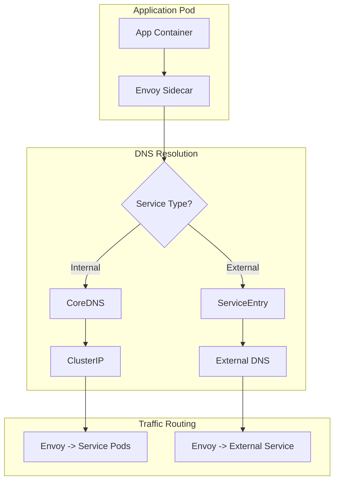

# How to Fix "DNS Resolution" Issues in Microservices

Author: [nawazdhandala](https://www.github.com/nawazdhandala)

Tags: DNS Resolution, Microservices, Kubernetes, Service Discovery, Networking, Troubleshooting, CoreDNS

Description: A practical guide to diagnosing and fixing DNS resolution issues in microservices environments, covering common problems, debugging techniques, and configuration best practices.

---

DNS resolution issues are among the most common problems in microservices architectures. When services cannot resolve each other's names, communication breaks down and applications fail. This guide covers how to diagnose and fix DNS resolution issues in containerized and Kubernetes environments.

## Understanding DNS in Microservices

In a microservices environment, DNS is the primary mechanism for service discovery. Understanding how DNS flows through your infrastructure is essential for troubleshooting.

```mermaid
flowchart TD
    subgraph "Application Pod"
        A[App Container] --> B[/etc/resolv.conf]
    end

    subgraph "Kubernetes DNS"
        B --> C[CoreDNS Service]
        C --> D[CoreDNS Pods]
    end

    subgraph "DNS Resolution Chain"
        D --> E{Is it a cluster service?}
        E -->|Yes| F[Return ClusterIP]
        E -->|No| G{Is it a local domain?}
        G -->|Yes| H[Query upstream DNS]
        G -->|No| I[Return NXDOMAIN]
        H --> J[External DNS Server]
    end

    F --> K[Service Endpoint]
    J --> L[External IP]
```

## Common DNS Resolution Errors

Before diving into solutions, understand the common error patterns.

```python
# dns_error_analyzer.py - Analyze DNS resolution errors
import re
import logging
from dataclasses import dataclass
from typing import List, Optional, Dict
from enum import Enum

logger = logging.getLogger(__name__)

class DNSErrorType(Enum):
    """Types of DNS errors."""
    NXDOMAIN = "nxdomain"           # Domain does not exist
    TIMEOUT = "timeout"             # DNS query timed out
    SERVFAIL = "servfail"           # Server failed to answer
    REFUSED = "refused"             # Server refused query
    NETWORK_ERROR = "network"       # Network connectivity issue
    CONFIGURATION = "config"        # Configuration error
    UNKNOWN = "unknown"


@dataclass
class DNSError:
    """Represents a DNS resolution error."""
    error_type: DNSErrorType
    hostname: str
    message: str
    possible_causes: List[str]
    suggested_fixes: List[str]


class DNSErrorAnalyzer:
    """
    Analyzes DNS errors and suggests fixes.
    """

    ERROR_PATTERNS = {
        r"NXDOMAIN": DNSErrorType.NXDOMAIN,
        r"name.*not.*found": DNSErrorType.NXDOMAIN,
        r"no such host": DNSErrorType.NXDOMAIN,
        r"timeout": DNSErrorType.TIMEOUT,
        r"timed out": DNSErrorType.TIMEOUT,
        r"SERVFAIL": DNSErrorType.SERVFAIL,
        r"server failure": DNSErrorType.SERVFAIL,
        r"REFUSED": DNSErrorType.REFUSED,
        r"connection refused": DNSErrorType.REFUSED,
        r"network.*unreachable": DNSErrorType.NETWORK_ERROR,
        r"no route to host": DNSErrorType.NETWORK_ERROR,
    }

    CAUSES_AND_FIXES = {
        DNSErrorType.NXDOMAIN: {
            "causes": [
                "Service does not exist in the cluster",
                "Wrong namespace in service name",
                "Service name is misspelled",
                "DNS search domains not configured correctly",
                "Service was deleted or not yet created"
            ],
            "fixes": [
                "Verify service exists: kubectl get svc <name> -n <namespace>",
                "Use fully qualified name: <service>.<namespace>.svc.cluster.local",
                "Check service name spelling in application config",
                "Verify pod's /etc/resolv.conf has correct search domains",
                "Check if service endpoints exist: kubectl get endpoints <name>"
            ]
        },
        DNSErrorType.TIMEOUT: {
            "causes": [
                "CoreDNS pods are overloaded",
                "Network policy blocking DNS traffic",
                "CoreDNS pods not running",
                "Firewall blocking UDP port 53",
                "DNS response too large for UDP"
            ],
            "fixes": [
                "Check CoreDNS pods: kubectl get pods -n kube-system -l k8s-app=kube-dns",
                "Review network policies for DNS port 53 access",
                "Check CoreDNS logs: kubectl logs -n kube-system -l k8s-app=kube-dns",
                "Increase CoreDNS replicas if under high load",
                "Check for ndots setting causing excessive queries"
            ]
        },
        DNSErrorType.SERVFAIL: {
            "causes": [
                "CoreDNS configuration error",
                "Upstream DNS server issues",
                "Invalid DNS zone configuration",
                "CoreDNS plugin failure"
            ],
            "fixes": [
                "Check CoreDNS configmap: kubectl get cm coredns -n kube-system -o yaml",
                "Verify upstream DNS servers are reachable",
                "Check CoreDNS logs for specific errors",
                "Restart CoreDNS pods if config was fixed"
            ]
        },
        DNSErrorType.REFUSED: {
            "causes": [
                "DNS server refusing queries",
                "Access control blocking requests",
                "CoreDNS not listening on expected port"
            ],
            "fixes": [
                "Check CoreDNS service: kubectl get svc kube-dns -n kube-system",
                "Verify CoreDNS is bound to correct address",
                "Check for ACL rules in CoreDNS config"
            ]
        },
        DNSErrorType.NETWORK_ERROR: {
            "causes": [
                "Pod network not configured correctly",
                "CNI plugin issues",
                "Node network connectivity problems",
                "Service CIDR routing issues"
            ],
            "fixes": [
                "Check pod network connectivity: kubectl exec <pod> -- ping <dns-ip>",
                "Verify CNI plugin is running on all nodes",
                "Check node network configuration",
                "Verify kube-proxy is running and configured"
            ]
        }
    }

    def analyze(self, error_message: str, hostname: str = "") -> DNSError:
        """
        Analyze a DNS error message.

        Args:
            error_message: The error message to analyze
            hostname: The hostname that failed to resolve

        Returns:
            DNSError with analysis
        """
        error_type = self._detect_error_type(error_message)
        causes_fixes = self.CAUSES_AND_FIXES.get(error_type, {
            "causes": ["Unknown error type"],
            "fixes": ["Check application and DNS server logs"]
        })

        return DNSError(
            error_type=error_type,
            hostname=hostname,
            message=error_message,
            possible_causes=causes_fixes["causes"],
            suggested_fixes=causes_fixes["fixes"]
        )

    def _detect_error_type(self, message: str) -> DNSErrorType:
        """Detect error type from message."""
        message_lower = message.lower()

        for pattern, error_type in self.ERROR_PATTERNS.items():
            if re.search(pattern, message_lower):
                return error_type

        return DNSErrorType.UNKNOWN

    def print_analysis(self, error: DNSError) -> None:
        """Print formatted error analysis."""
        print(f"\n{'='*60}")
        print(f"DNS Error Analysis")
        print(f"{'='*60}")
        print(f"Hostname: {error.hostname}")
        print(f"Error Type: {error.error_type.value}")
        print(f"Message: {error.message}")
        print(f"\nPossible Causes:")
        for cause in error.possible_causes:
            print(f"  - {cause}")
        print(f"\nSuggested Fixes:")
        for fix in error.suggested_fixes:
            print(f"  - {fix}")
        print(f"{'='*60}\n")
```

## Debugging DNS in Kubernetes

Use these techniques to debug DNS resolution in Kubernetes clusters.

```bash
#!/bin/bash
# dns_debug.sh - Comprehensive DNS debugging script for Kubernetes

set -e

# Colors for output
RED='\033[0;31m'
GREEN='\033[0;32m'
YELLOW='\033[1;33m'
NC='\033[0m'

print_header() {
    echo -e "\n${YELLOW}=== $1 ===${NC}\n"
}

print_success() {
    echo -e "${GREEN}[OK]${NC} $1"
}

print_error() {
    echo -e "${RED}[ERROR]${NC} $1"
}

# Check CoreDNS pods
check_coredns_pods() {
    print_header "Checking CoreDNS Pods"

    local pods=$(kubectl get pods -n kube-system -l k8s-app=kube-dns -o jsonpath='{.items[*].metadata.name}')

    if [ -z "$pods" ]; then
        print_error "No CoreDNS pods found!"
        return 1
    fi

    for pod in $pods; do
        local status=$(kubectl get pod -n kube-system $pod -o jsonpath='{.status.phase}')
        local ready=$(kubectl get pod -n kube-system $pod -o jsonpath='{.status.containerStatuses[0].ready}')

        if [ "$status" == "Running" ] && [ "$ready" == "true" ]; then
            print_success "$pod is running and ready"
        else
            print_error "$pod status: $status, ready: $ready"
        fi
    done
}

# Check CoreDNS service
check_coredns_service() {
    print_header "Checking CoreDNS Service"

    local svc_ip=$(kubectl get svc kube-dns -n kube-system -o jsonpath='{.spec.clusterIP}')

    if [ -n "$svc_ip" ]; then
        print_success "CoreDNS service IP: $svc_ip"
    else
        print_error "CoreDNS service not found!"
        return 1
    fi

    # Check endpoints
    local endpoints=$(kubectl get endpoints kube-dns -n kube-system -o jsonpath='{.subsets[*].addresses[*].ip}')

    if [ -n "$endpoints" ]; then
        print_success "CoreDNS endpoints: $endpoints"
    else
        print_error "No CoreDNS endpoints found!"
    fi
}

# Check CoreDNS config
check_coredns_config() {
    print_header "CoreDNS Configuration"

    kubectl get configmap coredns -n kube-system -o yaml
}

# Check CoreDNS logs
check_coredns_logs() {
    print_header "CoreDNS Recent Logs"

    local pods=$(kubectl get pods -n kube-system -l k8s-app=kube-dns -o jsonpath='{.items[0].metadata.name}')

    if [ -n "$pods" ]; then
        kubectl logs -n kube-system $pods --tail=50
    fi
}

# Test DNS resolution from a debug pod
test_dns_resolution() {
    local hostname=${1:-kubernetes.default.svc.cluster.local}

    print_header "Testing DNS Resolution for: $hostname"

    # Create a debug pod if it does not exist
    kubectl run dns-debug --image=busybox:1.28 --restart=Never --rm -it --command -- nslookup $hostname 2>/dev/null || true
}

# Check resolv.conf in a pod
check_pod_resolv_conf() {
    local pod=$1
    local namespace=${2:-default}

    print_header "Checking /etc/resolv.conf in pod: $pod"

    kubectl exec -n $namespace $pod -- cat /etc/resolv.conf 2>/dev/null || print_error "Cannot read resolv.conf"
}

# Main
main() {
    echo "DNS Debugging Tool for Kubernetes"
    echo "=================================="

    check_coredns_pods
    check_coredns_service
    check_coredns_config
    check_coredns_logs

    if [ -n "$1" ]; then
        test_dns_resolution $1
    fi
}

main "$@"
```

## Fixing Common DNS Issues

### Issue 1: ndots Configuration Causing Slow Resolution

The ndots setting determines when to use search domains versus querying directly.

```yaml
# pod-with-dns-config.yaml - Optimized DNS configuration
apiVersion: v1
kind: Pod
metadata:
  name: myapp
spec:
  containers:
  - name: myapp
    image: myapp:latest
  # Optimize DNS configuration
  dnsConfig:
    options:
    # Reduce ndots from default 5 to 2
    # This reduces DNS queries for external domains
    - name: ndots
      value: "2"
    # Enable single-request to reduce query count
    - name: single-request-reopen
    # Set timeout for faster failover
    - name: timeout
      value: "2"
    # Limit retry attempts
    - name: attempts
      value: "3"
```

### Issue 2: DNS Caching Problems

Implement DNS caching at the application level to reduce CoreDNS load.

```python
# dns_cache.py - Application-level DNS caching
import socket
import time
import threading
import logging
from dataclasses import dataclass, field
from typing import Dict, List, Optional, Tuple
from functools import lru_cache

logger = logging.getLogger(__name__)

@dataclass
class DNSCacheEntry:
    """A cached DNS entry."""
    addresses: List[str]
    timestamp: float
    ttl: int = 30

    def is_expired(self) -> bool:
        """Check if cache entry is expired."""
        return time.time() - self.timestamp > self.ttl


class DNSCache:
    """
    Thread-safe DNS cache for applications.

    Reduces DNS queries by caching resolved addresses.
    Implements automatic expiration and background refresh.
    """

    def __init__(
        self,
        default_ttl: int = 30,
        negative_ttl: int = 5,
        max_entries: int = 1000
    ):
        """
        Initialize DNS cache.

        Args:
            default_ttl: Default TTL for successful lookups
            negative_ttl: TTL for failed lookups
            max_entries: Maximum cache entries
        """
        self._cache: Dict[str, DNSCacheEntry] = {}
        self._negative_cache: Dict[str, float] = {}
        self._lock = threading.RLock()
        self._default_ttl = default_ttl
        self._negative_ttl = negative_ttl
        self._max_entries = max_entries
        self._hits = 0
        self._misses = 0

    def resolve(
        self,
        hostname: str,
        port: int = 0
    ) -> Optional[List[Tuple[str, int]]]:
        """
        Resolve hostname with caching.

        Args:
            hostname: Hostname to resolve
            port: Port number for the result

        Returns:
            List of (address, port) tuples or None
        """
        # Check positive cache
        with self._lock:
            entry = self._cache.get(hostname)
            if entry and not entry.is_expired():
                self._hits += 1
                logger.debug(f"DNS cache hit for {hostname}")
                return [(addr, port) for addr in entry.addresses]

            # Check negative cache
            neg_timestamp = self._negative_cache.get(hostname)
            if neg_timestamp and time.time() - neg_timestamp < self._negative_ttl:
                self._hits += 1
                logger.debug(f"DNS negative cache hit for {hostname}")
                return None

        # Cache miss - perform actual lookup
        self._misses += 1
        logger.debug(f"DNS cache miss for {hostname}")

        try:
            # Perform DNS lookup
            addresses = self._do_lookup(hostname)

            if addresses:
                # Cache successful result
                with self._lock:
                    self._ensure_capacity()
                    self._cache[hostname] = DNSCacheEntry(
                        addresses=addresses,
                        timestamp=time.time(),
                        ttl=self._default_ttl
                    )
                return [(addr, port) for addr in addresses]
            else:
                # Cache negative result
                with self._lock:
                    self._negative_cache[hostname] = time.time()
                return None

        except socket.gaierror as e:
            logger.warning(f"DNS lookup failed for {hostname}: {e}")
            with self._lock:
                self._negative_cache[hostname] = time.time()
            return None

    def _do_lookup(self, hostname: str) -> List[str]:
        """Perform actual DNS lookup."""
        try:
            # Get all addresses for hostname
            results = socket.getaddrinfo(
                hostname,
                None,
                socket.AF_UNSPEC,
                socket.SOCK_STREAM
            )

            # Extract unique addresses
            addresses = list(set(
                result[4][0]
                for result in results
            ))

            return addresses

        except socket.gaierror:
            return []

    def _ensure_capacity(self) -> None:
        """Ensure cache does not exceed max entries."""
        if len(self._cache) >= self._max_entries:
            # Remove oldest entries
            sorted_entries = sorted(
                self._cache.items(),
                key=lambda x: x[1].timestamp
            )
            # Remove oldest 10%
            to_remove = len(sorted_entries) // 10
            for hostname, _ in sorted_entries[:to_remove]:
                del self._cache[hostname]

    def invalidate(self, hostname: str) -> None:
        """Invalidate cache entry for hostname."""
        with self._lock:
            self._cache.pop(hostname, None)
            self._negative_cache.pop(hostname, None)

    def clear(self) -> None:
        """Clear all cache entries."""
        with self._lock:
            self._cache.clear()
            self._negative_cache.clear()

    def get_stats(self) -> Dict:
        """Get cache statistics."""
        with self._lock:
            total = self._hits + self._misses
            hit_rate = self._hits / total if total > 0 else 0

            return {
                "hits": self._hits,
                "misses": self._misses,
                "hit_rate": hit_rate,
                "entries": len(self._cache),
                "negative_entries": len(self._negative_cache)
            }


# Singleton instance for application-wide caching
_dns_cache = DNSCache()


def cached_resolve(hostname: str, port: int = 0) -> Optional[List[Tuple[str, int]]]:
    """Resolve hostname using application DNS cache."""
    return _dns_cache.resolve(hostname, port)
```

### Issue 3: CoreDNS Configuration Issues

Fix common CoreDNS configuration problems.

```yaml
# coredns-configmap.yaml - Optimized CoreDNS configuration
apiVersion: v1
kind: ConfigMap
metadata:
  name: coredns
  namespace: kube-system
data:
  Corefile: |
    .:53 {
        errors
        health {
            lameduck 5s
        }
        ready

        # Kubernetes service discovery
        kubernetes cluster.local in-addr.arpa ip6.arpa {
            pods insecure
            fallthrough in-addr.arpa ip6.arpa
            ttl 30
        }

        # Enable caching for better performance
        cache 30 {
            success 9984 30
            denial 9984 5
        }

        # Forward external queries to upstream DNS
        forward . /etc/resolv.conf {
            max_concurrent 1000
            prefer_udp
        }

        # Enable logging for debugging (disable in production)
        # log

        # Prometheus metrics
        prometheus :9153

        # Loop detection
        loop

        # Reload config on change
        reload

        # Load balancing
        loadbalance
    }
```

### Issue 4: Network Policy Blocking DNS

Ensure network policies allow DNS traffic.

```yaml
# dns-network-policy.yaml - Allow DNS traffic
apiVersion: networking.k8s.io/v1
kind: NetworkPolicy
metadata:
  name: allow-dns-access
  namespace: default
spec:
  podSelector: {}  # Apply to all pods in namespace
  policyTypes:
  - Egress
  egress:
  # Allow DNS queries to kube-dns
  - to:
    - namespaceSelector:
        matchLabels:
          kubernetes.io/metadata.name: kube-system
      podSelector:
        matchLabels:
          k8s-app: kube-dns
    ports:
    - protocol: UDP
      port: 53
    - protocol: TCP
      port: 53
```

## DNS Health Monitoring

Monitor DNS resolution health continuously.

```python
# dns_monitor.py - DNS health monitoring for microservices
import socket
import time
import logging
import threading
from dataclasses import dataclass
from typing import Dict, List, Callable, Optional
from concurrent.futures import ThreadPoolExecutor
import statistics

logger = logging.getLogger(__name__)

@dataclass
class DNSHealthResult:
    """Result of a DNS health check."""
    hostname: str
    success: bool
    latency_ms: float
    resolved_addresses: List[str]
    error: Optional[str] = None


@dataclass
class DNSHealthSummary:
    """Summary of DNS health for a hostname."""
    hostname: str
    success_rate: float
    avg_latency_ms: float
    p99_latency_ms: float
    last_error: Optional[str]
    is_healthy: bool


class DNSHealthMonitor:
    """
    Monitors DNS resolution health for critical services.

    Features:
    - Periodic health checks
    - Latency tracking
    - Alert callbacks
    - Automatic recovery detection
    """

    def __init__(
        self,
        check_interval: int = 30,
        unhealthy_threshold: float = 0.8,
        latency_threshold_ms: float = 100
    ):
        """
        Initialize DNS health monitor.

        Args:
            check_interval: Seconds between health checks
            unhealthy_threshold: Success rate below this is unhealthy
            latency_threshold_ms: Latency above this triggers warning
        """
        self._check_interval = check_interval
        self._unhealthy_threshold = unhealthy_threshold
        self._latency_threshold = latency_threshold_ms

        self._hostnames: List[str] = []
        self._results: Dict[str, List[DNSHealthResult]] = {}
        self._callbacks: List[Callable[[str, bool], None]] = []
        self._running = False
        self._thread: Optional[threading.Thread] = None
        self._lock = threading.RLock()

    def add_hostname(self, hostname: str) -> None:
        """Add hostname to monitor."""
        with self._lock:
            if hostname not in self._hostnames:
                self._hostnames.append(hostname)
                self._results[hostname] = []

    def remove_hostname(self, hostname: str) -> None:
        """Remove hostname from monitoring."""
        with self._lock:
            if hostname in self._hostnames:
                self._hostnames.remove(hostname)
                self._results.pop(hostname, None)

    def add_callback(self, callback: Callable[[str, bool], None]) -> None:
        """Add callback for health state changes."""
        self._callbacks.append(callback)

    def check_hostname(self, hostname: str) -> DNSHealthResult:
        """
        Check DNS resolution for a single hostname.

        Args:
            hostname: Hostname to check

        Returns:
            DNSHealthResult
        """
        start_time = time.time()

        try:
            # Perform DNS lookup
            results = socket.getaddrinfo(
                hostname,
                None,
                socket.AF_UNSPEC,
                socket.SOCK_STREAM
            )

            latency = (time.time() - start_time) * 1000
            addresses = list(set(r[4][0] for r in results))

            return DNSHealthResult(
                hostname=hostname,
                success=True,
                latency_ms=latency,
                resolved_addresses=addresses
            )

        except socket.gaierror as e:
            latency = (time.time() - start_time) * 1000
            return DNSHealthResult(
                hostname=hostname,
                success=False,
                latency_ms=latency,
                resolved_addresses=[],
                error=str(e)
            )

    def get_health_summary(self, hostname: str) -> Optional[DNSHealthSummary]:
        """
        Get health summary for a hostname.

        Args:
            hostname: Hostname to get summary for

        Returns:
            DNSHealthSummary or None
        """
        with self._lock:
            results = self._results.get(hostname, [])

        if not results:
            return None

        # Calculate metrics from recent results (last 100)
        recent = results[-100:]

        successes = [r for r in recent if r.success]
        success_rate = len(successes) / len(recent)

        latencies = [r.latency_ms for r in recent]
        avg_latency = statistics.mean(latencies)
        p99_latency = (
            sorted(latencies)[int(len(latencies) * 0.99)]
            if len(latencies) > 1 else avg_latency
        )

        last_error = None
        for r in reversed(recent):
            if r.error:
                last_error = r.error
                break

        is_healthy = (
            success_rate >= self._unhealthy_threshold and
            p99_latency <= self._latency_threshold
        )

        return DNSHealthSummary(
            hostname=hostname,
            success_rate=success_rate,
            avg_latency_ms=avg_latency,
            p99_latency_ms=p99_latency,
            last_error=last_error,
            is_healthy=is_healthy
        )

    def _check_all(self) -> None:
        """Check all monitored hostnames."""
        with self._lock:
            hostnames = self._hostnames.copy()

        with ThreadPoolExecutor(max_workers=10) as executor:
            futures = {
                executor.submit(self.check_hostname, h): h
                for h in hostnames
            }

            for future in futures:
                hostname = futures[future]
                try:
                    result = future.result(timeout=10)

                    with self._lock:
                        self._results[hostname].append(result)
                        # Keep only last 1000 results
                        if len(self._results[hostname]) > 1000:
                            self._results[hostname] = self._results[hostname][-1000:]

                    # Check for state changes
                    summary = self.get_health_summary(hostname)
                    if summary:
                        self._notify_callbacks(hostname, summary.is_healthy)

                except Exception as e:
                    logger.error(f"Health check failed for {hostname}: {e}")

    def _notify_callbacks(self, hostname: str, is_healthy: bool) -> None:
        """Notify callbacks of health state."""
        for callback in self._callbacks:
            try:
                callback(hostname, is_healthy)
            except Exception as e:
                logger.error(f"Callback error: {e}")

    def _run_loop(self) -> None:
        """Main monitoring loop."""
        while self._running:
            try:
                self._check_all()
            except Exception as e:
                logger.error(f"Monitoring loop error: {e}")

            time.sleep(self._check_interval)

    def start(self) -> None:
        """Start the monitoring thread."""
        if self._running:
            return

        self._running = True
        self._thread = threading.Thread(target=self._run_loop, daemon=True)
        self._thread.start()
        logger.info("DNS health monitoring started")

    def stop(self) -> None:
        """Stop the monitoring thread."""
        self._running = False
        if self._thread:
            self._thread.join(timeout=5)
        logger.info("DNS health monitoring stopped")

    def get_all_summaries(self) -> Dict[str, DNSHealthSummary]:
        """Get health summaries for all monitored hostnames."""
        summaries = {}
        with self._lock:
            for hostname in self._hostnames:
                summary = self.get_health_summary(hostname)
                if summary:
                    summaries[hostname] = summary
        return summaries
```

## Service Mesh DNS Considerations

When using a service mesh like Istio, DNS resolution has additional considerations.



```yaml
# istio-service-entry.yaml - External service DNS configuration
apiVersion: networking.istio.io/v1beta1
kind: ServiceEntry
metadata:
  name: external-api
spec:
  hosts:
  - api.external-service.com
  location: MESH_EXTERNAL
  ports:
  - number: 443
    name: https
    protocol: HTTPS
  resolution: DNS
  # Enable DNS resolution caching
  endpoints:
  - address: api.external-service.com
---
# Virtual service for traffic management
apiVersion: networking.istio.io/v1beta1
kind: VirtualService
metadata:
  name: external-api
spec:
  hosts:
  - api.external-service.com
  http:
  - timeout: 30s
    retries:
      attempts: 3
      perTryTimeout: 10s
    route:
    - destination:
        host: api.external-service.com
        port:
          number: 443
```

## Best Practices

1. **Use fully qualified domain names** - Always use complete names like `service.namespace.svc.cluster.local` for clarity and faster resolution.

2. **Configure ndots appropriately** - Set ndots to 2 for most applications to reduce unnecessary DNS queries.

3. **Implement DNS caching** - Cache DNS results at the application level to reduce load on CoreDNS.

4. **Monitor DNS latency** - Track DNS resolution latency as part of your observability stack.

5. **Scale CoreDNS appropriately** - Run multiple CoreDNS replicas for high availability and load distribution.

6. **Use headless services carefully** - Understand when to use headless services and their DNS behavior.

7. **Test DNS during chaos engineering** - Include DNS failure scenarios in your chaos testing.

8. **Document service names** - Maintain clear documentation of service names and their purposes.

Proper DNS configuration and monitoring are essential for reliable microservices communication.
