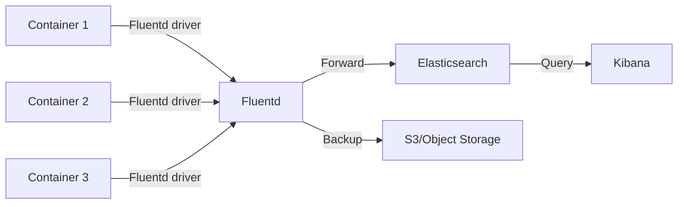

# How to Set Up Docker Log Rotation

Author: [nawazdhandala](https://www.github.com/nawazdhandala)

Tags: Docker, Logging, DevOps, Disk Management, Operations

Description: Prevent disk exhaustion from Docker container logs by configuring proper log rotation at the daemon level, per-container settings, and integrating with external logging systems.

---

Docker containers can generate massive log files that fill up disk space and crash servers. Without log rotation, a busy container might produce gigabytes of logs within hours. Setting up proper log rotation prevents disk exhaustion and keeps your systems running smoothly.

## The Problem: Unbounded Log Growth

By default, Docker stores container logs as JSON files without size limits:

```bash
# Check log file sizes
sudo du -sh /var/lib/docker/containers/*/*-json.log

# Example output showing a 15GB log file
15G /var/lib/docker/containers/abc123.../abc123...-json.log
```

A single runaway container can consume all available disk space, affecting every service on the host.

## Solution 1: Configure Docker Daemon Defaults

Set log rotation defaults for all containers in the Docker daemon configuration:

```json
// /etc/docker/daemon.json
{
  "log-driver": "json-file",
  "log-opts": {
    "max-size": "10m",
    "max-file": "3",
    "compress": "true"
  }
}
```

Options explained:

- `max-size`: Maximum size of each log file before rotation (10 megabytes)
- `max-file`: Number of log files to keep (3 files = current + 2 rotated)
- `compress`: Compress rotated log files with gzip

Apply the configuration:

```bash
# Reload Docker daemon
sudo systemctl reload docker

# Or restart if reload doesn't apply changes
sudo systemctl restart docker
```

New containers automatically use these settings. Existing containers need to be recreated.

## Solution 2: Per-Container Log Options

Override defaults for specific containers:

```bash
# Run container with custom log settings
docker run -d \
  --name high-traffic-app \
  --log-opt max-size=50m \
  --log-opt max-file=5 \
  myapp:latest
```

In Docker Compose:

```yaml
# docker-compose.yml
version: '3.8'

services:
  api:
    image: myapp:latest
    logging:
      driver: json-file
      options:
        max-size: "50m"
        max-file: "5"

  worker:
    image: myworker:latest
    logging:
      driver: json-file
      options:
        max-size: "100m"
        max-file: "10"

  # Low-priority service with smaller logs
  cleanup:
    image: cleanup:latest
    logging:
      driver: json-file
      options:
        max-size: "5m"
        max-file: "2"
```

## Solution 3: Alternative Logging Drivers

Docker supports multiple logging drivers with built-in rotation:

### Syslog Driver

```bash
docker run -d \
  --log-driver syslog \
  --log-opt syslog-address=udp://logserver:514 \
  --log-opt tag="myapp" \
  myapp:latest
```

```yaml
# docker-compose.yml
services:
  app:
    image: myapp:latest
    logging:
      driver: syslog
      options:
        syslog-address: "udp://logserver:514"
        syslog-facility: "local0"
        tag: "{{.Name}}"
```

### Local Driver (Optimized JSON)

The `local` driver is optimized for performance with built-in rotation:

```json
// /etc/docker/daemon.json
{
  "log-driver": "local",
  "log-opts": {
    "max-size": "10m",
    "max-file": "3"
  }
}
```

Note: The `local` driver uses a different format than `json-file`, so tools expecting JSON logs may not work.

### Fluentd Driver

Send logs to Fluentd for aggregation:

```yaml
services:
  app:
    image: myapp:latest
    logging:
      driver: fluentd
      options:
        fluentd-address: "localhost:24224"
        tag: "docker.{{.Name}}"

  fluentd:
    image: fluent/fluentd:v1.16
    volumes:
      - ./fluent.conf:/fluentd/etc/fluent.conf
    ports:
      - "24224:24224"
```

## Cleaning Up Existing Logs

For existing containers with bloated logs:

### Truncate Without Stopping

```bash
# Truncate the log file (container keeps running)
sudo truncate -s 0 /var/lib/docker/containers/CONTAINER_ID/CONTAINER_ID-json.log
```

### Script for Bulk Cleanup

```bash
#!/bin/bash
# truncate-docker-logs.sh
# Truncate all Docker log files larger than specified size

MAX_SIZE_MB=${1:-100}

for log in /var/lib/docker/containers/*/*-json.log; do
    size_mb=$(du -m "$log" | cut -f1)
    if [ "$size_mb" -gt "$MAX_SIZE_MB" ]; then
        echo "Truncating $log (${size_mb}MB)"
        sudo truncate -s 0 "$log"
    fi
done
```

```bash
# Truncate logs larger than 100MB
sudo ./truncate-docker-logs.sh 100
```

### Recreate Containers with New Settings

After updating daemon.json, existing containers need recreation:

```bash
# For Docker Compose
docker compose down
docker compose up -d

# For individual containers
docker stop mycontainer
docker rm mycontainer
docker run ... mycontainer  # Recreate with same options
```

## Monitoring Log Sizes

Set up monitoring to catch log growth before it becomes critical:

```bash
#!/bin/bash
# monitor-docker-logs.sh
# Alert if any container log exceeds threshold

THRESHOLD_MB=500
ALERT_COMMAND="curl -X POST https://alerts.example.com/webhook"

for log in /var/lib/docker/containers/*/*-json.log; do
    size_mb=$(du -m "$log" | cut -f1)
    container_id=$(basename $(dirname "$log"))
    container_name=$(docker inspect --format '{{.Name}}' "$container_id" 2>/dev/null | tr -d '/')

    if [ "$size_mb" -gt "$THRESHOLD_MB" ]; then
        echo "ALERT: $container_name log is ${size_mb}MB"
        $ALERT_COMMAND -d "{\"container\": \"$container_name\", \"size_mb\": $size_mb}"
    fi
done
```

Add to cron:

```bash
# Run every hour
0 * * * * /path/to/monitor-docker-logs.sh >> /var/log/docker-log-monitor.log 2>&1
```

## Best Practices for Application Logging

### Log to stdout/stderr

Docker captures stdout and stderr automatically. Configure your application to log there:

```python
# Python: Configure logging to stdout
import logging
import sys

logging.basicConfig(
    level=logging.INFO,
    format='%(asctime)s %(levelname)s %(message)s',
    handlers=[logging.StreamHandler(sys.stdout)]
)
```

```javascript
// Node.js: Already logs to stdout by default
console.log('Info message');
console.error('Error message');

// For structured logging
const pino = require('pino');
const logger = pino({ level: 'info' });
logger.info({ event: 'request', path: '/api' }, 'Handled request');
```

### Avoid Verbose Debug Logs in Production

```yaml
services:
  app:
    image: myapp:latest
    environment:
      - LOG_LEVEL=info  # Not 'debug'
```

### Use Structured Logging

Structured logs are easier to parse and analyze:

```json
{"timestamp":"2026-01-24T10:30:00Z","level":"info","message":"Request handled","path":"/api","duration_ms":45}
```

## Log Aggregation Architecture

For production systems, forward logs to a central aggregation system:



```yaml
# docker-compose.yml
version: '3.8'

services:
  app:
    image: myapp:latest
    logging:
      driver: fluentd
      options:
        fluentd-address: "fluentd:24224"
        tag: "app.{{.Name}}"

  fluentd:
    image: fluent/fluentd-kubernetes-daemonset:v1
    volumes:
      - ./fluent.conf:/fluentd/etc/fluent.conf
    ports:
      - "24224:24224"

  elasticsearch:
    image: elasticsearch:8.11.0
    environment:
      - discovery.type=single-node
      - xpack.security.enabled=false
    volumes:
      - es-data:/usr/share/elasticsearch/data

  kibana:
    image: kibana:8.11.0
    ports:
      - "5601:5601"
    environment:
      - ELASTICSEARCH_HOSTS=http://elasticsearch:9200

volumes:
  es-data:
```

---

Log rotation is essential for Docker systems in production. Configure daemon-level defaults for all containers, use per-container settings for services with different requirements, and consider log aggregation for centralized management. Regular monitoring prevents surprises, and proper application logging practices reduce log volume from the source.
