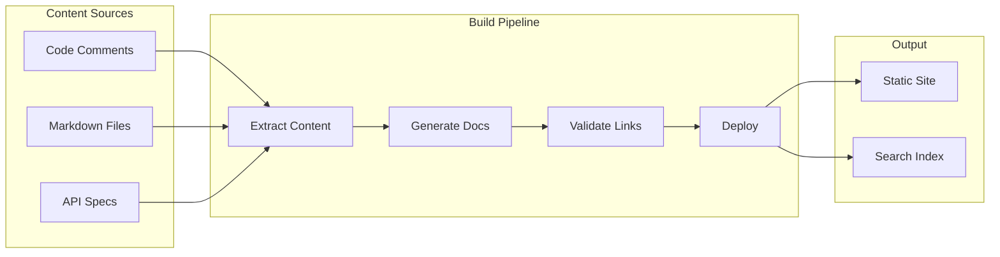

# How to Fix Documentation Automation Issues

Author: [nawazdhandala](https://www.github.com/nawazdhandala)

Tags: Documentation, Automation, DevOps, CI/CD, Technical Writing, Docs as Code

Description: Practical solutions for common documentation automation problems including broken builds, stale content, and deployment failures.

---

Documentation automation promises to keep your docs up to date with minimal manual effort. In practice, broken builds, sync failures, and stale content plague most documentation pipelines. Here is how to fix the most common issues.

## Understanding Documentation Automation Architecture

Before debugging, understand how documentation pipelines typically work.



## Problem 1: Documentation Build Failures

The most common issue is builds that fail intermittently or break after code changes.

### Root Cause: Missing Dependencies

Documentation generators often have implicit dependencies on specific versions of tools or libraries.

**Solution: Pin all dependencies and use containerized builds.**

```dockerfile
# Dockerfile.docs
# Containerized documentation build environment

FROM python:3.11-slim

# Install system dependencies for documentation tools
RUN apt-get update && apt-get install -y \
    git \
    graphviz \
    plantuml \
    && rm -rf /var/lib/apt/lists/*

# Install documentation tools with pinned versions
COPY requirements-docs.txt /tmp/
RUN pip install --no-cache-dir -r /tmp/requirements-docs.txt

WORKDIR /docs
ENTRYPOINT ["mkdocs"]
```

Pin your documentation tool versions explicitly.

```txt
# requirements-docs.txt
# Pinned versions prevent surprise breakages

mkdocs==1.6.0
mkdocs-material==9.5.3
mkdocs-minify-plugin==0.8.0
mkdocs-redirects==1.2.1
pymdown-extensions==10.7
mkdocstrings==0.24.0
mkdocstrings-python==1.8.0
mike==2.0.0
```

### Root Cause: Broken Cross-References

Documentation often links to code symbols that get renamed or removed.

**Solution: Add link validation to your CI pipeline.**

```yaml
# .github/workflows/docs.yaml
name: Documentation

on:
  push:
    branches: [main]
    paths:
      - 'docs/**'
      - 'src/**'
      - 'mkdocs.yml'
  pull_request:
    paths:
      - 'docs/**'
      - 'src/**'

jobs:
  build:
    runs-on: ubuntu-latest
    steps:
      - uses: actions/checkout@v4
        with:
          fetch-depth: 0  # Needed for git-based versioning

      - name: Build documentation
        run: |
          docker build -f Dockerfile.docs -t docs-builder .
          docker run --rm -v $(pwd):/docs docs-builder build --strict

      - name: Check for broken links
        run: |
          # Install link checker
          pip install linkchecker

          # Start a local server
          python -m http.server 8000 --directory site &
          sleep 2

          # Check all internal links
          linkchecker http://localhost:8000 \
            --check-extern \
            --no-robots \
            --ignore-url 'https://github.com/.*/edit/.*'

      - name: Validate API references
        run: |
          # Ensure all documented functions exist in code
          python scripts/validate_api_docs.py
```

Create a script to validate that documented APIs still exist.

```python
#!/usr/bin/env python3
# scripts/validate_api_docs.py
# Validates that documented APIs exist in the codebase

import ast
import re
import sys
from pathlib import Path

def extract_documented_symbols(docs_dir: Path) -> set:
    """Extract all API references from documentation."""
    symbols = set()

    for md_file in docs_dir.rglob('*.md'):
        content = md_file.read_text()

        # Match mkdocstrings references like ::: module.function
        refs = re.findall(r':::\s*([\w.]+)', content)
        symbols.update(refs)

        # Match inline code references like `module.function()`
        inline_refs = re.findall(r'`([\w.]+)\(`', content)
        symbols.update(inline_refs)

    return symbols

def extract_code_symbols(src_dir: Path) -> set:
    """Extract all public symbols from source code."""
    symbols = set()

    for py_file in src_dir.rglob('*.py'):
        try:
            tree = ast.parse(py_file.read_text())
        except SyntaxError:
            continue

        module_path = py_file.relative_to(src_dir).with_suffix('')
        module_name = str(module_path).replace('/', '.')

        for node in ast.walk(tree):
            if isinstance(node, (ast.FunctionDef, ast.ClassDef)):
                if not node.name.startswith('_'):
                    symbols.add(f"{module_name}.{node.name}")

    return symbols

def main():
    docs_dir = Path('docs')
    src_dir = Path('src')

    documented = extract_documented_symbols(docs_dir)
    existing = extract_code_symbols(src_dir)

    missing = documented - existing

    if missing:
        print("ERROR: Documented symbols not found in code:")
        for symbol in sorted(missing):
            print(f"  - {symbol}")
        sys.exit(1)

    print(f"Validated {len(documented)} API references")

if __name__ == '__main__':
    main()
```

## Problem 2: Stale Documentation

Documentation that does not update when code changes becomes misleading and dangerous.

### Solution: Generate Documentation from Code

Instead of manually writing API docs, generate them from docstrings and type hints.

```yaml
# mkdocs.yml
# Configuration for auto-generated API documentation

site_name: Acme Platform Docs
site_url: https://docs.acme.com

theme:
  name: material
  features:
    - navigation.tabs
    - navigation.sections
    - search.suggest

plugins:
  - search
  - mkdocstrings:
      handlers:
        python:
          options:
            # Show source code links
            show_source: true
            # Include inherited members
            inherited_members: true
            # Show type annotations
            show_signature_annotations: true
            # Merge __init__ into class docs
            merge_init_into_class: true

nav:
  - Home: index.md
  - Getting Started: getting-started.md
  - API Reference:
      - Client: api/client.md
      - Models: api/models.md
      - Exceptions: api/exceptions.md
  - Changelog: changelog.md
```

Write docstrings that generate useful documentation.

```python
# src/client.py
# Example code with documentation-ready docstrings

from typing import Optional
from dataclasses import dataclass

@dataclass
class PaymentResult:
    """Result of a payment operation.

    Attributes:
        transaction_id: Unique identifier for the transaction.
        status: Current status (pending, completed, failed).
        amount_cents: Amount charged in cents.
        error_message: Error details if status is failed.
    """
    transaction_id: str
    status: str
    amount_cents: int
    error_message: Optional[str] = None

class PaymentClient:
    """Client for interacting with the payment service.

    This client handles all payment operations including charges,
    refunds, and transaction queries.

    Example:
        ```python
        client = PaymentClient(api_key="your-key")
        result = client.charge(
            amount_cents=1000,
            currency="usd",
            customer_id="cust_123"
        )
        print(f"Transaction: {result.transaction_id}")
        ```

    Attributes:
        base_url: Base URL for the payment API.
        timeout: Request timeout in seconds.
    """

    def __init__(
        self,
        api_key: str,
        base_url: str = "https://api.payments.com",
        timeout: int = 30
    ):
        """Initialize the payment client.

        Args:
            api_key: Your API key for authentication.
            base_url: Override the default API URL.
            timeout: Request timeout in seconds.

        Raises:
            ValueError: If api_key is empty.
        """
        if not api_key:
            raise ValueError("api_key cannot be empty")
        self.api_key = api_key
        self.base_url = base_url
        self.timeout = timeout

    def charge(
        self,
        amount_cents: int,
        currency: str,
        customer_id: str,
        idempotency_key: Optional[str] = None
    ) -> PaymentResult:
        """Charge a customer's payment method.

        Args:
            amount_cents: Amount to charge in cents (e.g., 1000 = $10.00).
            currency: Three-letter ISO currency code (e.g., "usd").
            customer_id: ID of the customer to charge.
            idempotency_key: Optional key to prevent duplicate charges.

        Returns:
            PaymentResult with transaction details.

        Raises:
            PaymentError: If the charge fails.
            ValidationError: If parameters are invalid.

        Note:
            Charges are not immediately completed. Check the status
            field of the result to determine the outcome.
        """
        # Implementation here
        pass
```

### Solution: Auto-Update Changelogs

Generate changelogs from git commits or pull requests to ensure they stay current.

```yaml
# .github/workflows/changelog.yaml
name: Update Changelog

on:
  push:
    branches: [main]
  release:
    types: [published]

jobs:
  changelog:
    runs-on: ubuntu-latest
    steps:
      - uses: actions/checkout@v4
        with:
          fetch-depth: 0

      - name: Generate changelog
        uses: orhun/git-cliff-action@v3
        with:
          config: cliff.toml
          args: --verbose
        env:
          OUTPUT: CHANGELOG.md

      - name: Commit changelog
        run: |
          git config user.name "github-actions[bot]"
          git config user.email "github-actions[bot]@users.noreply.github.com"
          git add CHANGELOG.md
          git diff --staged --quiet || git commit -m "docs: update changelog"
          git push
```

Configure the changelog generator to categorize changes properly.

```toml
# cliff.toml
# Configuration for git-cliff changelog generator

[changelog]
header = """
# Changelog

All notable changes to this project will be documented in this file.
"""
body = """
\
    ## [{{ version }}] - {{ timestamp | date(format="%Y-%m-%d") }}
\
    ## [Unreleased]
\


    ### {{ group | upper_first }}
    
        - {{ commit.message | upper_first }}\
    

"""

[git]
# Parse conventional commits
conventional_commits = true
filter_unconventional = true
commit_parsers = [
    { message = "^feat", group = "Features" },
    { message = "^fix", group = "Bug Fixes" },
    { message = "^doc", group = "Documentation" },
    { message = "^perf", group = "Performance" },
    { message = "^refactor", group = "Refactoring" },
    { message = "^style", group = "Style" },
    { message = "^test", group = "Testing" },
    { message = "^chore", skip = true },
]
```

## Problem 3: Documentation Deployment Failures

Deployments fail silently or leave docs in inconsistent states.

### Solution: Implement Proper Deployment Pipelines

```yaml
# .github/workflows/deploy-docs.yaml
name: Deploy Documentation

on:
  push:
    branches: [main]
    paths:
      - 'docs/**'
      - 'mkdocs.yml'

jobs:
  deploy:
    runs-on: ubuntu-latest
    steps:
      - uses: actions/checkout@v4
        with:
          fetch-depth: 0

      - name: Setup Python
        uses: actions/setup-python@v5
        with:
          python-version: '3.11'

      - name: Install dependencies
        run: pip install -r requirements-docs.txt

      - name: Build documentation
        run: mkdocs build --strict

      - name: Deploy to GitHub Pages
        run: |
          git config user.name "github-actions[bot]"
          git config user.email "github-actions[bot]@users.noreply.github.com"
          mkdocs gh-deploy --force

      - name: Verify deployment
        run: |
          # Wait for GitHub Pages to update
          sleep 30

          # Check that the site is accessible
          curl --fail https://docs.acme.com || exit 1

          # Check that key pages exist
          curl --fail https://docs.acme.com/api/client/ || exit 1

      - name: Notify on failure
        if: failure()
        uses: slackapi/slack-github-action@v1
        with:
          payload: |
            {
              "text": "Documentation deployment failed!",
              "blocks": [
                {
                  "type": "section",
                  "text": {
                    "type": "mrkdwn",
                    "text": "Documentation deployment failed for commit ${{ github.sha }}"
                  }
                }
              ]
            }
        env:
          SLACK_WEBHOOK_URL: ${{ secrets.SLACK_WEBHOOK }}
```

## Problem 4: Search Not Working

Documentation search often breaks when indices are not updated or configuration is wrong.

### Solution: Configure Search Properly

```yaml
# mkdocs.yml search configuration

plugins:
  - search:
      # Boost title matches
      separator: '[\s\-\.]+'

      # Include code blocks in search
      lang:
        - en

      # Minimum characters to trigger search
      min_search_length: 2

extra:
  # Analytics to track search queries
  analytics:
    provider: google
    property: G-XXXXXXXXXX

    # Track what users search for
    feedback:
      title: Was this page helpful?
      ratings:
        - icon: material/emoticon-happy-outline
          name: This page was helpful
          data: 1
        - icon: material/emoticon-sad-outline
          name: This page could be improved
          data: 0
```

For larger documentation sites, use Algolia for better search.

```yaml
# mkdocs.yml with Algolia search

plugins:
  - search:
      # Disable built-in search
      enabled: false

extra:
  search:
    provider: algolia
    index_name: acme_docs
    app_id: YOUR_APP_ID
    api_key: YOUR_SEARCH_API_KEY
```

## Monitoring Documentation Health

Set up monitoring to catch documentation issues before users report them.

```python
#!/usr/bin/env python3
# scripts/docs_health_check.py
# Monitor documentation site health

import requests
import sys
from urllib.parse import urljoin

DOCS_URL = "https://docs.acme.com"
CRITICAL_PAGES = [
    "/",
    "/getting-started/",
    "/api/client/",
    "/changelog/",
]

def check_page(url: str) -> bool:
    """Check if a page loads successfully."""
    try:
        response = requests.get(url, timeout=10)
        return response.status_code == 200
    except requests.RequestException:
        return False

def main():
    failures = []

    for page in CRITICAL_PAGES:
        url = urljoin(DOCS_URL, page)
        if not check_page(url):
            failures.append(url)
            print(f"FAIL: {url}")
        else:
            print(f"OK: {url}")

    if failures:
        print(f"\n{len(failures)} pages failed health check")
        sys.exit(1)

    print("\nAll pages healthy")

if __name__ == '__main__':
    main()
```

---

Documentation automation works when you treat it like any other software system. Pin dependencies, validate outputs, monitor for failures, and fix issues quickly. The goal is documentation that stays accurate without constant manual intervention. When the automation is solid, your team can focus on writing good content instead of fighting broken pipelines.
