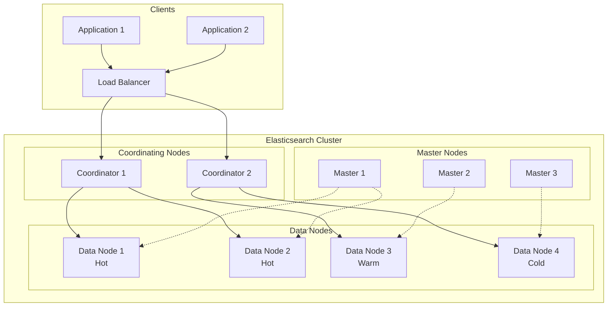

# How to Configure Elasticsearch for Performance

Author: [nawazdhandala](https://www.github.com/nawazdhandala)

Tags: Elasticsearch, Performance, Search, Indexing, JVM, Tuning, Database, DevOps

Description: Learn how to configure Elasticsearch for optimal performance including JVM settings, index configurations, shard strategies, and query optimization.

---

> Elasticsearch can handle massive amounts of data and queries, but achieving optimal performance requires careful configuration. This guide covers the essential settings and strategies for getting the best performance from your Elasticsearch cluster.

Default Elasticsearch settings are designed for development, not production. Without proper tuning, you might see slow queries, high memory usage, or cluster instability under load.

---

## Cluster Architecture Overview



---

## JVM and Memory Configuration

The JVM heap is critical for Elasticsearch performance:

```yaml
# jvm.options
# Elasticsearch JVM configuration for a 64GB RAM server

# Set heap size to 50% of available RAM, max 31GB
# Both values must be the same to avoid resizing pauses
-Xms31g
-Xmx31g

# Use G1 garbage collector for heaps larger than 6GB
-XX:+UseG1GC

# G1 tuning for Elasticsearch
-XX:G1HeapRegionSize=32m
-XX:InitiatingHeapOccupancyPercent=75
-XX:G1ReservePercent=25

# Reduce GC pause times
-XX:MaxGCPauseMillis=200

# Enable GC logging for troubleshooting
-Xlog:gc*,gc+age=trace,safepoint:file=/var/log/elasticsearch/gc.log:utctime,pid,tags:filecount=32,filesize=64m

# Disable swapping (critical for performance)
-XX:+AlwaysPreTouch

# Pre-allocate memory pages
-XX:+UseTransparentHugePages
```

```yaml
# elasticsearch.yml
# Core cluster configuration

cluster.name: production-cluster
node.name: data-node-1

# Memory settings
bootstrap.memory_lock: true  # Prevent swapping

# Network settings
network.host: 0.0.0.0
http.port: 9200
transport.port: 9300

# Discovery configuration
discovery.seed_hosts:
  - master-1:9300
  - master-2:9300
  - master-3:9300

cluster.initial_master_nodes:
  - master-1
  - master-2
  - master-3

# Thread pools for different operations
thread_pool:
  search:
    size: 25
    queue_size: 1000
  write:
    size: 12
    queue_size: 1000
  analyze:
    size: 5
    queue_size: 100

# Circuit breakers to prevent OOM
indices.breaker.total.limit: 70%
indices.breaker.fielddata.limit: 40%
indices.breaker.request.limit: 40%

# Indexing buffer
indices.memory.index_buffer_size: 20%

# Search settings
indices.queries.cache.size: 15%
```

---

## Shard Strategy and Index Settings

Proper shard configuration is essential:

```json
// Create index with optimized settings
// PUT /logs-2026.01
{
  "settings": {
    "index": {
      // Shard configuration
      // Rule: Each shard should be 10-50GB
      "number_of_shards": 5,
      "number_of_replicas": 1,

      // Refresh interval (tradeoff: freshness vs performance)
      // Default 1s is too aggressive for high-volume indexing
      "refresh_interval": "30s",

      // Translog settings for durability vs performance
      "translog": {
        "durability": "async",
        "sync_interval": "30s",
        "flush_threshold_size": "1gb"
      },

      // Merge settings to control background merging
      "merge": {
        "scheduler": {
          "max_thread_count": 2
        },
        "policy": {
          "max_merged_segment": "5gb",
          "segments_per_tier": 10
        }
      },

      // Sorting for faster range queries
      "sort.field": ["@timestamp"],
      "sort.order": ["desc"],

      // Compression
      "codec": "best_compression"
    },

    // Analysis settings
    "analysis": {
      "analyzer": {
        "log_analyzer": {
          "type": "custom",
          "tokenizer": "standard",
          "filter": ["lowercase", "stop"]
        }
      }
    }
  },

  "mappings": {
    "dynamic": "strict",
    "properties": {
      "@timestamp": {
        "type": "date",
        "format": "strict_date_optional_time"
      },
      "message": {
        "type": "text",
        "analyzer": "log_analyzer",
        // Disable norms if not using relevance scoring
        "norms": false
      },
      "level": {
        "type": "keyword"
      },
      "service": {
        "type": "keyword"
      },
      "trace_id": {
        "type": "keyword",
        // Disable doc_values if not sorting/aggregating
        "doc_values": true,
        // Disable indexing if only using for retrieval
        "index": true
      },
      "response_time_ms": {
        "type": "integer"
      },
      "metadata": {
        "type": "object",
        "enabled": false  // Store but don't index
      }
    }
  }
}
```

---

## Index Lifecycle Management

Automate index management for time-series data:

```json
// PUT _ilm/policy/logs-policy
{
  "policy": {
    "phases": {
      "hot": {
        "min_age": "0ms",
        "actions": {
          "rollover": {
            "max_age": "1d",
            "max_primary_shard_size": "50gb"
          },
          "set_priority": {
            "priority": 100
          }
        }
      },
      "warm": {
        "min_age": "2d",
        "actions": {
          "set_priority": {
            "priority": 50
          },
          // Reduce replicas on warm nodes
          "allocate": {
            "number_of_replicas": 0,
            "require": {
              "data": "warm"
            }
          },
          // Force merge for better query performance
          "forcemerge": {
            "max_num_segments": 1
          },
          // Shrink shards
          "shrink": {
            "number_of_shards": 1
          }
        }
      },
      "cold": {
        "min_age": "30d",
        "actions": {
          "set_priority": {
            "priority": 0
          },
          "allocate": {
            "require": {
              "data": "cold"
            }
          },
          // Use searchable snapshots for cold data
          "searchable_snapshot": {
            "snapshot_repository": "cold-storage"
          }
        }
      },
      "delete": {
        "min_age": "90d",
        "actions": {
          "delete": {}
        }
      }
    }
  }
}
```

---

## Query Optimization

Write efficient queries:

```python
# elasticsearch_queries.py
# Optimized Elasticsearch query patterns

from elasticsearch import Elasticsearch
from datetime import datetime, timedelta

es = Elasticsearch(["http://localhost:9200"])

def search_logs_optimized(
    service: str,
    level: str = None,
    start_time: datetime = None,
    end_time: datetime = None,
    size: int = 100
) -> dict:
    """
    Optimized log search query.

    Optimizations:
    1. Use filter context for exact matches (cached)
    2. Limit fields returned
    3. Use date range with format
    4. Avoid wildcards at start of terms
    """

    # Build filter clauses (cacheable, no scoring)
    filters = [
        {"term": {"service": service}}
    ]

    if level:
        filters.append({"term": {"level": level}})

    if start_time or end_time:
        date_range = {}
        if start_time:
            date_range["gte"] = start_time.isoformat()
        if end_time:
            date_range["lte"] = end_time.isoformat()
        filters.append({"range": {"@timestamp": date_range}})

    query = {
        "size": size,
        # Only return fields we need
        "_source": ["@timestamp", "message", "level", "trace_id"],
        "query": {
            "bool": {
                # Use filter instead of must for exact matches
                "filter": filters
            }
        },
        # Sort by timestamp (matches index sort for efficiency)
        "sort": [
            {"@timestamp": {"order": "desc"}}
        ],
        # Track only limited total hits for faster queries
        "track_total_hits": 1000
    }

    return es.search(index="logs-*", body=query)


def aggregate_response_times(
    service: str,
    interval: str = "1h",
    start_time: datetime = None
) -> dict:
    """
    Efficient aggregation query for metrics.

    Optimizations:
    1. Set size to 0 (no documents returned)
    2. Use fixed_interval for predictable buckets
    3. Limit bucket count with min_doc_count
    """

    if not start_time:
        start_time = datetime.utcnow() - timedelta(days=1)

    query = {
        "size": 0,  # We only want aggregations
        "query": {
            "bool": {
                "filter": [
                    {"term": {"service": service}},
                    {"range": {"@timestamp": {"gte": start_time.isoformat()}}}
                ]
            }
        },
        "aggs": {
            "response_times_over_time": {
                "date_histogram": {
                    "field": "@timestamp",
                    "fixed_interval": interval,
                    "min_doc_count": 1  # Skip empty buckets
                },
                "aggs": {
                    "avg_response": {"avg": {"field": "response_time_ms"}},
                    "p95_response": {
                        "percentiles": {
                            "field": "response_time_ms",
                            "percents": [95]
                        }
                    },
                    "error_count": {
                        "filter": {"term": {"level": "ERROR"}}
                    }
                }
            }
        }
    }

    return es.search(index="logs-*", body=query)


def bulk_index_optimized(documents: list, index_name: str) -> dict:
    """
    Optimized bulk indexing.

    Optimizations:
    1. Use bulk API with optimal batch size
    2. Disable refresh during bulk
    3. Use routing for related documents
    """
    from elasticsearch.helpers import bulk

    def generate_actions():
        for doc in documents:
            yield {
                "_index": index_name,
                "_source": doc,
                # Route by service for better query performance
                "_routing": doc.get("service", "default")
            }

    # Temporarily increase refresh interval
    es.indices.put_settings(
        index=index_name,
        body={"index": {"refresh_interval": "-1"}}
    )

    try:
        success, errors = bulk(
            es,
            generate_actions(),
            chunk_size=1000,     # Optimal batch size
            request_timeout=60,
            raise_on_error=False
        )

        return {"success": success, "errors": errors}

    finally:
        # Restore refresh interval and force refresh
        es.indices.put_settings(
            index=index_name,
            body={"index": {"refresh_interval": "30s"}}
        )
        es.indices.refresh(index=index_name)
```

---

## System-Level Configuration

Operating system settings for Elasticsearch:

```bash
#!/bin/bash
# system_tuning.sh
# System configuration for Elasticsearch performance

# Increase file descriptor limits
echo "elasticsearch soft nofile 65536" >> /etc/security/limits.conf
echo "elasticsearch hard nofile 65536" >> /etc/security/limits.conf

# Increase virtual memory areas
echo "vm.max_map_count=262144" >> /etc/sysctl.conf
sysctl -p

# Disable swap (critical for Elasticsearch)
swapoff -a
# Remove swap entries from /etc/fstab

# Set I/O scheduler to noop/none for SSDs
echo "none" > /sys/block/nvme0n1/queue/scheduler

# Increase network buffer sizes
echo "net.core.rmem_max=16777216" >> /etc/sysctl.conf
echo "net.core.wmem_max=16777216" >> /etc/sysctl.conf
echo "net.ipv4.tcp_rmem=4096 87380 16777216" >> /etc/sysctl.conf
echo "net.ipv4.tcp_wmem=4096 65536 16777216" >> /etc/sysctl.conf

# Transparent huge pages (optional, test in your environment)
echo "always" > /sys/kernel/mm/transparent_hugepage/enabled
```

---

## Performance Monitoring

Key metrics to monitor:

| Metric | Healthy Value | Action if Exceeded |
|--------|---------------|-------------------|
| JVM Heap Used | < 75% | Increase heap or add nodes |
| Search Latency (p99) | < 500ms | Optimize queries, add replicas |
| Indexing Rate | Consistent | Check bulk queue, refresh interval |
| Merge Time | < 10% of time | Reduce merge threads |
| Query Cache Hit Rate | > 20% | Review filter usage |
| Field Data Size | < heap * 0.4 | Use doc_values, avoid text aggregations |

```bash
# Useful monitoring commands

# Check cluster health
curl -X GET "localhost:9200/_cluster/health?pretty"

# Check node stats
curl -X GET "localhost:9200/_nodes/stats?pretty"

# Check hot threads
curl -X GET "localhost:9200/_nodes/hot_threads"

# Check pending tasks
curl -X GET "localhost:9200/_cluster/pending_tasks?pretty"

# Check shard allocation
curl -X GET "localhost:9200/_cat/shards?v&s=store:desc"

# Check index stats
curl -X GET "localhost:9200/_stats?pretty"
```

---

## Best Practices Summary

| Area | Recommendation |
|------|----------------|
| **Heap** | 50% of RAM, max 31GB |
| **Shards** | 10-50GB per shard, avoid over-sharding |
| **Replicas** | 1 for HA, 0 for warm/cold data |
| **Refresh** | 30s-60s for write-heavy workloads |
| **Queries** | Use filter context, limit fields |
| **Mappings** | Strict mappings, disable unused features |
| **ILM** | Automate rollover and data tiering |
| **Monitoring** | Track heap, latency, and indexing rate |

---

*Need to monitor your Elasticsearch cluster performance? [OneUptime](https://oneuptime.com) provides comprehensive infrastructure monitoring with custom dashboards and alerting.*

**Related Reading:**
- [How to Handle Database Indexing Strategy](https://oneuptime.com/blog/post/2026-01-24-database-indexing-strategy/view)
- [How to Fix Service Mesh Overhead Issues](https://oneuptime.com/blog/post/2026-01-24-service-mesh-overhead/view)
