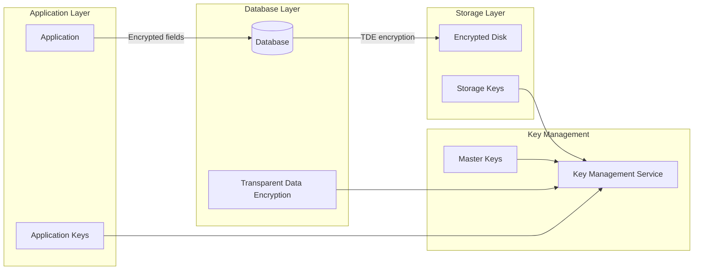

# How to Handle Encryption at Rest

Author: [nawazdhandala](https://www.github.com/nawazdhandala)

Tags: Security, Encryption, Data Protection, Databases, Cloud Security, Compliance

Description: Learn how to implement encryption at rest to protect sensitive data in databases, file systems, and cloud storage.

---

Encryption at rest protects data when it is stored on disk. If an attacker gains physical access to storage media or bypasses access controls, encrypted data remains unreadable without the encryption keys. This is a fundamental requirement for compliance with GDPR, HIPAA, PCI-DSS, and other regulations.

## Understanding Encryption at Rest

Encryption at rest transforms stored data into ciphertext using encryption keys. Only systems with access to the decryption keys can read the original data.



### Encryption Layers

| Layer | What It Protects | Who Manages Keys |
|-------|------------------|------------------|
| Application-level | Specific sensitive fields | Application |
| Database TDE | Entire database files | Database admin |
| Filesystem | All files on disk | System admin |
| Storage/Disk | Physical storage media | Cloud provider |

## Application-Level Encryption

Encrypt sensitive fields before storing them in the database. This provides the strongest protection because data is encrypted even from database administrators.

### Node.js Field Encryption

```javascript
const crypto = require('crypto');

class FieldEncryption {
  constructor(masterKey) {
    // Master key should come from KMS or secure config
    this.masterKey = Buffer.from(masterKey, 'hex');
    this.algorithm = 'aes-256-gcm';
  }

  encrypt(plaintext) {
    // Generate unique IV for each encryption
    const iv = crypto.randomBytes(16);

    const cipher = crypto.createCipheriv(
      this.algorithm,
      this.masterKey,
      iv
    );

    let encrypted = cipher.update(plaintext, 'utf8', 'hex');
    encrypted += cipher.final('hex');

    // Get authentication tag for integrity verification
    const authTag = cipher.getAuthTag();

    // Combine IV + authTag + ciphertext for storage
    return `${iv.toString('hex')}:${authTag.toString('hex')}:${encrypted}`;
  }

  decrypt(encryptedData) {
    const [ivHex, authTagHex, ciphertext] = encryptedData.split(':');

    const iv = Buffer.from(ivHex, 'hex');
    const authTag = Buffer.from(authTagHex, 'hex');

    const decipher = crypto.createDecipheriv(
      this.algorithm,
      this.masterKey,
      iv
    );

    decipher.setAuthTag(authTag);

    let decrypted = decipher.update(ciphertext, 'hex', 'utf8');
    decrypted += decipher.final('utf8');

    return decrypted;
  }
}

// Usage
const encryption = new FieldEncryption(process.env.ENCRYPTION_KEY);

// Encrypt before storing
const ssn = encryption.encrypt('123-45-6789');
await User.create({ name: 'John', ssn_encrypted: ssn });

// Decrypt when reading
const user = await User.findById(id);
const decryptedSSN = encryption.decrypt(user.ssn_encrypted);
```

### Mongoose Encryption Plugin

```javascript
const mongoose = require('mongoose');
const crypto = require('crypto');

// Encryption plugin for Mongoose schemas
function encryptionPlugin(schema, options) {
  const { fields, key } = options;
  const algorithm = 'aes-256-gcm';
  const masterKey = Buffer.from(key, 'hex');

  // Encrypt fields before saving
  schema.pre('save', function(next) {
    fields.forEach(field => {
      if (this.isModified(field) && this[field]) {
        const iv = crypto.randomBytes(16);
        const cipher = crypto.createCipheriv(algorithm, masterKey, iv);

        let encrypted = cipher.update(this[field], 'utf8', 'hex');
        encrypted += cipher.final('hex');
        const authTag = cipher.getAuthTag();

        this[field] = `${iv.toString('hex')}:${authTag.toString('hex')}:${encrypted}`;
      }
    });
    next();
  });

  // Add decrypt method
  schema.methods.decryptField = function(field) {
    if (!this[field]) return null;

    const [ivHex, authTagHex, ciphertext] = this[field].split(':');
    const iv = Buffer.from(ivHex, 'hex');
    const authTag = Buffer.from(authTagHex, 'hex');

    const decipher = crypto.createDecipheriv(algorithm, masterKey, iv);
    decipher.setAuthTag(authTag);

    let decrypted = decipher.update(ciphertext, 'hex', 'utf8');
    decrypted += decipher.final('utf8');

    return decrypted;
  };
}

// Apply to schema
const userSchema = new mongoose.Schema({
  name: String,
  email: String,
  ssn: String,  // Will be encrypted
  creditCard: String  // Will be encrypted
});

userSchema.plugin(encryptionPlugin, {
  fields: ['ssn', 'creditCard'],
  key: process.env.ENCRYPTION_KEY
});
```

### Python Field Encryption

```python
from cryptography.hazmat.primitives.ciphers.aead import AESGCM
import os
import base64

class FieldEncryption:
    def __init__(self, key: bytes):
        # Key should be 32 bytes for AES-256
        self.aesgcm = AESGCM(key)

    def encrypt(self, plaintext: str) -> str:
        # Generate unique nonce for each encryption
        nonce = os.urandom(12)

        # Encrypt data
        ciphertext = self.aesgcm.encrypt(
            nonce,
            plaintext.encode('utf-8'),
            None  # No associated data
        )

        # Combine nonce and ciphertext
        encrypted = nonce + ciphertext
        return base64.b64encode(encrypted).decode('utf-8')

    def decrypt(self, encrypted_data: str) -> str:
        # Decode from base64
        data = base64.b64decode(encrypted_data.encode('utf-8'))

        # Extract nonce and ciphertext
        nonce = data[:12]
        ciphertext = data[12:]

        # Decrypt
        plaintext = self.aesgcm.decrypt(nonce, ciphertext, None)
        return plaintext.decode('utf-8')

# Usage with SQLAlchemy
from sqlalchemy import TypeDecorator, String

class EncryptedString(TypeDecorator):
    impl = String
    cache_ok = True

    def __init__(self, key: bytes, *args, **kwargs):
        super().__init__(*args, **kwargs)
        self.encryption = FieldEncryption(key)

    def process_bind_param(self, value, dialect):
        if value is not None:
            return self.encryption.encrypt(value)
        return value

    def process_result_value(self, value, dialect):
        if value is not None:
            return self.encryption.decrypt(value)
        return value

# Model with encrypted fields
class User(Base):
    __tablename__ = 'users'

    id = Column(Integer, primary_key=True)
    name = Column(String(100))
    email = Column(String(255))
    ssn = Column(EncryptedString(ENCRYPTION_KEY, 500))  # Encrypted
    credit_card = Column(EncryptedString(ENCRYPTION_KEY, 500))  # Encrypted
```

## Database Transparent Data Encryption (TDE)

TDE encrypts the entire database at the storage level without requiring application changes.

### PostgreSQL TDE Setup

```sql
-- PostgreSQL 16+ supports TDE
-- Configure in postgresql.conf:
-- encryption_method = 'AES256'
-- encryption_key_command = 'your-key-retrieval-command'

-- For older versions, use pgcrypto for column encryption
CREATE EXTENSION pgcrypto;

-- Encrypt data using pgcrypto
INSERT INTO users (name, ssn_encrypted)
VALUES (
  'John Doe',
  pgp_sym_encrypt('123-45-6789', 'encryption_key')
);

-- Decrypt when reading
SELECT
  name,
  pgp_sym_decrypt(ssn_encrypted::bytea, 'encryption_key') as ssn
FROM users;
```

### MySQL TDE Configuration

```sql
-- Enable InnoDB tablespace encryption
-- my.cnf configuration:
-- [mysqld]
-- early-plugin-load=keyring_file.so
-- keyring_file_data=/var/lib/mysql-keyring/keyring

-- Create encrypted tablespace
CREATE TABLESPACE encrypted_ts
  ADD DATAFILE 'encrypted_ts.ibd'
  ENCRYPTION='Y';

-- Create table in encrypted tablespace
CREATE TABLE sensitive_data (
  id INT PRIMARY KEY,
  ssn VARCHAR(255),
  credit_card VARCHAR(255)
) TABLESPACE encrypted_ts ENCRYPTION='Y';

-- Verify encryption
SELECT TABLE_SCHEMA, TABLE_NAME, CREATE_OPTIONS
FROM INFORMATION_SCHEMA.TABLES
WHERE CREATE_OPTIONS LIKE '%ENCRYPTION%';
```

### MongoDB Encryption

```javascript
// MongoDB supports encryption at rest with WiredTiger
// Configure in mongod.conf:
/*
security:
  enableEncryption: true
  encryptionKeyFile: /path/to/keyfile

storage:
  wiredTiger:
    engineConfig:
      encryptionKeyIdentifier: mykey
*/

// Client-side field level encryption
const { MongoClient, ClientEncryption } = require('mongodb');

const client = new MongoClient(uri);
const encryption = new ClientEncryption(client, {
  keyVaultNamespace: 'encryption.__keyVault',
  kmsProviders: {
    local: {
      key: masterKey  // 96-byte key for local provider
    }
  }
});

// Create data encryption key
const dataKeyId = await encryption.createDataKey('local');

// Encrypt field
const encryptedSSN = await encryption.encrypt(
  '123-45-6789',
  {
    algorithm: 'AEAD_AES_256_CBC_HMAC_SHA_512-Deterministic',
    keyId: dataKeyId
  }
);

// Store encrypted data
await db.collection('users').insertOne({
  name: 'John',
  ssn: encryptedSSN
});
```

## Cloud Storage Encryption

### AWS S3 Encryption

```javascript
const { S3Client, PutObjectCommand, GetObjectCommand } = require('@aws-sdk/client-s3');

const s3Client = new S3Client({ region: 'us-east-1' });

// Upload with server-side encryption (SSE-S3)
async function uploadEncrypted(bucket, key, data) {
  const command = new PutObjectCommand({
    Bucket: bucket,
    Key: key,
    Body: data,
    ServerSideEncryption: 'AES256'  // SSE-S3
  });

  await s3Client.send(command);
}

// Upload with customer-managed key (SSE-KMS)
async function uploadWithKMS(bucket, key, data, kmsKeyId) {
  const command = new PutObjectCommand({
    Bucket: bucket,
    Key: key,
    Body: data,
    ServerSideEncryption: 'aws:kms',
    SSEKMSKeyId: kmsKeyId
  });

  await s3Client.send(command);
}

// Enable default encryption for bucket
const { PutBucketEncryptionCommand } = require('@aws-sdk/client-s3');

async function enableBucketEncryption(bucket, kmsKeyArn) {
  const command = new PutBucketEncryptionCommand({
    Bucket: bucket,
    ServerSideEncryptionConfiguration: {
      Rules: [{
        ApplyServerSideEncryptionByDefault: {
          SSEAlgorithm: 'aws:kms',
          KMSMasterKeyID: kmsKeyArn
        },
        BucketKeyEnabled: true
      }]
    }
  });

  await s3Client.send(command);
}
```

### Kubernetes Secrets Encryption

```yaml
# encryption-config.yaml for kube-apiserver
apiVersion: apiserver.config.k8s.io/v1
kind: EncryptionConfiguration
resources:
  - resources:
      - secrets
    providers:
      # Use AES-GCM encryption
      - aesgcm:
          keys:
            - name: key1
              secret: <base64-encoded-32-byte-key>
      # Fallback to identity (unencrypted) for reading old secrets
      - identity: {}
```

Enable in kube-apiserver:

```bash
# Add to kube-apiserver flags
--encryption-provider-config=/etc/kubernetes/encryption-config.yaml
```

## Key Management Best Practices

### Using AWS KMS

```javascript
const { KMSClient, GenerateDataKeyCommand, DecryptCommand } = require('@aws-sdk/client-kms');

const kmsClient = new KMSClient({ region: 'us-east-1' });

// Generate data key for encryption
async function getDataKey(keyId) {
  const command = new GenerateDataKeyCommand({
    KeyId: keyId,
    KeySpec: 'AES_256'
  });

  const response = await kmsClient.send(command);

  return {
    plaintext: response.Plaintext,  // Use this to encrypt data
    encrypted: response.CiphertextBlob  // Store this alongside encrypted data
  };
}

// Decrypt data key when needed
async function decryptDataKey(encryptedKey) {
  const command = new DecryptCommand({
    CiphertextBlob: encryptedKey
  });

  const response = await kmsClient.send(command);
  return response.Plaintext;
}
```

### Key Rotation

```javascript
class KeyRotation {
  constructor(kmsKeyId) {
    this.kmsKeyId = kmsKeyId;
    this.currentKeyVersion = null;
  }

  async rotateKeys() {
    // Generate new data key
    const newKey = await getDataKey(this.kmsKeyId);

    // Re-encrypt all data with new key
    const records = await db.collection('encrypted_data').find({}).toArray();

    for (const record of records) {
      // Decrypt with old key
      const oldDataKey = await decryptDataKey(record.encryptedDataKey);
      const plaintext = decrypt(record.data, oldDataKey);

      // Encrypt with new key
      const newCiphertext = encrypt(plaintext, newKey.plaintext);

      // Update record
      await db.collection('encrypted_data').updateOne(
        { _id: record._id },
        {
          $set: {
            data: newCiphertext,
            encryptedDataKey: newKey.encrypted,
            keyVersion: Date.now()
          }
        }
      );
    }
  }
}
```

## Compliance Checklist

- [ ] Identify all sensitive data requiring encryption
- [ ] Implement application-level encryption for PII/PHI
- [ ] Enable database TDE for additional protection
- [ ] Configure storage-level encryption
- [ ] Use a Key Management Service (not hardcoded keys)
- [ ] Implement key rotation procedures
- [ ] Document encryption methods for auditors
- [ ] Test decryption after key rotation
- [ ] Monitor for encryption failures

---

Encryption at rest is a defense-in-depth measure. Implement it at multiple layers: application, database, and storage. Use a proper key management service, rotate keys regularly, and remember that encryption is only as strong as your key management practices. Never store encryption keys alongside encrypted data.
