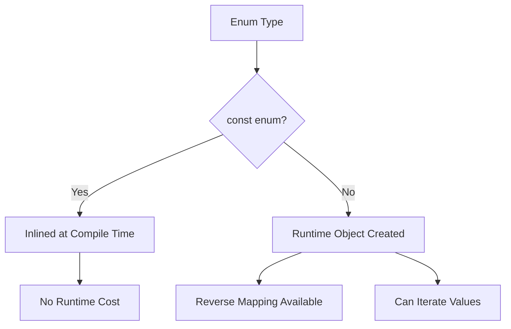
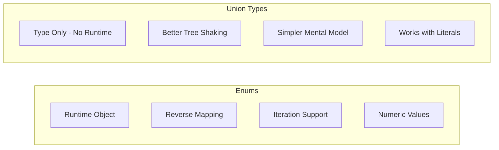

# How to Handle Enums vs Union Types

Author: [nawazdhandala](https://www.github.com/nawazdhandala)

Tags: TypeScript, Enums, Union Types, Type Safety, Best Practices, Design Patterns

Description: A comprehensive comparison of TypeScript enums and union types, helping you choose the right approach for your use cases with practical examples and best practices.

---

When defining a set of related constants in TypeScript, you have two main options: enums and union types. Both serve similar purposes but have different characteristics that make them suitable for different situations. In this guide, we will explore both approaches in depth and help you make informed decisions for your codebase.

## Understanding Enums

Enums in TypeScript allow you to define a set of named constants. They come in several forms: numeric enums, string enums, and heterogeneous enums.

### Numeric Enums

By default, enums use numeric values starting from 0:

```typescript
enum Direction {
    Up,      // 0
    Down,    // 1
    Left,    // 2
    Right    // 3
}

function move(direction: Direction): void {
    console.log(`Moving: ${Direction[direction]}`);
}

move(Direction.Up);  // "Moving: Up"
```

You can also specify custom numeric values:

```typescript
enum HttpStatus {
    OK = 200,
    Created = 201,
    BadRequest = 400,
    Unauthorized = 401,
    NotFound = 404,
    InternalError = 500
}

function handleResponse(status: HttpStatus): void {
    if (status >= 400) {
        console.error(`Error: ${status}`);
    }
}
```

### String Enums

String enums provide readable values without reverse mapping:

```typescript
enum LogLevel {
    Debug = "DEBUG",
    Info = "INFO",
    Warning = "WARNING",
    Error = "ERROR"
}

function log(level: LogLevel, message: string): void {
    console.log(`[${level}] ${message}`);
}

log(LogLevel.Info, "Application started");
// Output: [INFO] Application started
```

### const Enums

For better performance, you can use `const` enums which are inlined at compile time:

```typescript
const enum Color {
    Red = "#FF0000",
    Green = "#00FF00",
    Blue = "#0000FF"
}

// At compile time, this becomes:
// const backgroundColor = "#FF0000";
const backgroundColor = Color.Red;
```



## Understanding Union Types

Union types define a type that can be one of several literal values:

```typescript
type Direction = "up" | "down" | "left" | "right";

function move(direction: Direction): void {
    console.log(`Moving: ${direction}`);
}

move("up");  // Valid
move("diagonal");  // Error: Argument of type '"diagonal"' is not assignable
```

### Union Types with Objects

You can create more complex unions with discriminated types:

```typescript
type Result<T> =
    | { success: true; data: T }
    | { success: false; error: string };

function fetchUser(id: number): Result<User> {
    if (id <= 0) {
        return { success: false, error: "Invalid user ID" };
    }
    return { success: true, data: { id, name: "Alice" } };
}

const result = fetchUser(1);
if (result.success) {
    console.log(result.data);  // TypeScript knows data exists here
} else {
    console.error(result.error);  // TypeScript knows error exists here
}
```

## Comparison: Enums vs Union Types



### Bundle Size and Runtime

Enums generate JavaScript code, while union types are erased at compile time:

```typescript
// TypeScript enum
enum Status {
    Pending = "PENDING",
    Active = "ACTIVE",
    Completed = "COMPLETED"
}

// Compiles to JavaScript:
var Status;
(function (Status) {
    Status["Pending"] = "PENDING";
    Status["Active"] = "ACTIVE";
    Status["Completed"] = "COMPLETED";
})(Status || (Status = {}));

// Union type
type Status = "PENDING" | "ACTIVE" | "COMPLETED";

// Compiles to: nothing (completely erased)
```

### Type Safety

Both provide type safety, but with different characteristics:

```typescript
// Enum - allows any number assignment with numeric enums
enum NumericStatus {
    Pending,
    Active
}

function processNumeric(status: NumericStatus): void {}
processNumeric(999);  // No error! TypeScript allows any number

// String enum - stricter
enum StringStatus {
    Pending = "PENDING",
    Active = "ACTIVE"
}

function processString(status: StringStatus): void {}
processString("PENDING");  // Error: must use StringStatus.Pending

// Union type - strict by design
type UnionStatus = "PENDING" | "ACTIVE";

function processUnion(status: UnionStatus): void {}
processUnion("PENDING");  // Works - string literals are allowed
processUnion("INVALID");  // Error: not in union
```

### Iteration and Runtime Access

Enums allow runtime iteration, union types do not:

```typescript
// Enum - can iterate at runtime
enum Color {
    Red = "RED",
    Green = "GREEN",
    Blue = "BLUE"
}

// Get all enum values
const colors = Object.values(Color);
console.log(colors);  // ["RED", "GREEN", "BLUE"]

// Union type - need a separate array
type ColorUnion = "RED" | "GREEN" | "BLUE";

// Must maintain separately
const colorValues: ColorUnion[] = ["RED", "GREEN", "BLUE"];
```

### Using as const for Best of Both Worlds

The `as const` pattern provides union types with runtime access:

```typescript
// Define values as const
const STATUS = {
    Pending: "PENDING",
    Active: "ACTIVE",
    Completed: "COMPLETED"
} as const;

// Extract union type from values
type Status = typeof STATUS[keyof typeof STATUS];
// Result: "PENDING" | "ACTIVE" | "COMPLETED"

// Now you have both:
// 1. Runtime access to values
const allStatuses = Object.values(STATUS);

// 2. Type safety
function updateStatus(status: Status): void {
    console.log(status);
}

updateStatus(STATUS.Pending);  // Works
updateStatus("PENDING");       // Also works
updateStatus("INVALID");       // Error
```

## When to Use Each Approach

### Use Enums When:

1. **You need reverse mapping** (numeric enums only):

```typescript
enum ErrorCode {
    NotFound = 404,
    ServerError = 500
}

// Reverse mapping
console.log(ErrorCode[404]);  // "NotFound"
```

2. **You need to iterate over all values at runtime**:

```typescript
enum Permission {
    Read = "READ",
    Write = "WRITE",
    Delete = "DELETE"
}

function hasAllPermissions(userPerms: Permission[]): boolean {
    const allPerms = Object.values(Permission);
    return allPerms.every(p => userPerms.includes(p));
}
```

3. **Working with legacy code or APIs that expect enums**

### Use Union Types When:

1. **You want zero runtime overhead**:

```typescript
// No JavaScript generated
type HttpMethod = "GET" | "POST" | "PUT" | "DELETE" | "PATCH";
```

2. **You need discriminated unions**:

```typescript
type Shape =
    | { kind: "circle"; radius: number }
    | { kind: "rectangle"; width: number; height: number }
    | { kind: "triangle"; base: number; height: number };

function area(shape: Shape): number {
    switch (shape.kind) {
        case "circle":
            return Math.PI * shape.radius ** 2;
        case "rectangle":
            return shape.width * shape.height;
        case "triangle":
            return (shape.base * shape.height) / 2;
    }
}
```

3. **You want better tree shaking**:

```typescript
// With union types, unused values are not included in bundle
type Environment = "development" | "staging" | "production";

// Only the string "production" ends up in your production bundle
const env: Environment = "production";
```

### Use as const Pattern When:

1. **You need both runtime values and type safety**:

```typescript
const ROUTES = {
    Home: "/",
    About: "/about",
    Contact: "/contact",
    Users: "/users",
    UserDetail: "/users/:id"
} as const;

type Route = typeof ROUTES[keyof typeof ROUTES];

// Runtime access
function getAllRoutes(): string[] {
    return Object.values(ROUTES);
}

// Type safety
function navigate(route: Route): void {
    window.location.href = route;
}
```

2. **You want a type-safe configuration object**:

```typescript
const CONFIG = {
    api: {
        baseUrl: "https://api.example.com",
        timeout: 5000,
        retries: 3
    },
    features: {
        darkMode: true,
        analytics: false
    }
} as const;

type Config = typeof CONFIG;
type ApiConfig = Config["api"];
// { readonly baseUrl: "https://api.example.com"; readonly timeout: 5000; ... }
```

## Practical Examples

### Example 1: API Response Status

```typescript
// Using union type with as const for HTTP status handling
const HTTP_STATUS = {
    OK: 200,
    Created: 201,
    BadRequest: 400,
    Unauthorized: 401,
    Forbidden: 403,
    NotFound: 404,
    InternalError: 500
} as const;

type HttpStatusCode = typeof HTTP_STATUS[keyof typeof HTTP_STATUS];

interface ApiResponse<T> {
    status: HttpStatusCode;
    data?: T;
    error?: string;
}

function handleApiResponse<T>(response: ApiResponse<T>): void {
    if (response.status === HTTP_STATUS.OK) {
        console.log("Success:", response.data);
    } else if (response.status >= 400) {
        console.error("Error:", response.error);
    }
}
```

### Example 2: State Machine

```typescript
// Using discriminated unions for a state machine
type OrderState =
    | { status: "pending"; createdAt: Date }
    | { status: "confirmed"; confirmedAt: Date; estimatedDelivery: Date }
    | { status: "shipped"; trackingNumber: string; shippedAt: Date }
    | { status: "delivered"; deliveredAt: Date }
    | { status: "cancelled"; cancelledAt: Date; reason: string };

function getOrderMessage(order: OrderState): string {
    switch (order.status) {
        case "pending":
            return `Order pending since ${order.createdAt.toLocaleDateString()}`;
        case "confirmed":
            return `Order confirmed! Estimated delivery: ${order.estimatedDelivery.toLocaleDateString()}`;
        case "shipped":
            return `Order shipped! Tracking: ${order.trackingNumber}`;
        case "delivered":
            return `Order delivered on ${order.deliveredAt.toLocaleDateString()}`;
        case "cancelled":
            return `Order cancelled: ${order.reason}`;
    }
}
```

### Example 3: Feature Flags

```typescript
// Using as const for feature flags
const FEATURES = {
    DARK_MODE: "dark_mode",
    ANALYTICS: "analytics",
    BETA_UI: "beta_ui",
    AI_ASSISTANT: "ai_assistant"
} as const;

type FeatureFlag = typeof FEATURES[keyof typeof FEATURES];

class FeatureManager {
    private enabledFeatures: Set<FeatureFlag> = new Set();

    enable(feature: FeatureFlag): void {
        this.enabledFeatures.add(feature);
    }

    isEnabled(feature: FeatureFlag): boolean {
        return this.enabledFeatures.has(feature);
    }

    getAllFeatures(): FeatureFlag[] {
        return Object.values(FEATURES);
    }
}

const features = new FeatureManager();
features.enable(FEATURES.DARK_MODE);
features.enable(FEATURES.AI_ASSISTANT);

console.log(features.isEnabled(FEATURES.DARK_MODE));  // true
console.log(features.isEnabled(FEATURES.BETA_UI));    // false
```

## Migration Guide

### From Enums to Union Types

```typescript
// Before: enum
enum UserRole {
    Admin = "ADMIN",
    Editor = "EDITOR",
    Viewer = "VIEWER"
}

function hasAccess(role: UserRole): boolean {
    return role === UserRole.Admin || role === UserRole.Editor;
}

// After: union type with as const
const USER_ROLE = {
    Admin: "ADMIN",
    Editor: "EDITOR",
    Viewer: "VIEWER"
} as const;

type UserRole = typeof USER_ROLE[keyof typeof USER_ROLE];

function hasAccess(role: UserRole): boolean {
    return role === USER_ROLE.Admin || role === USER_ROLE.Editor;
}
```

### Keeping Backward Compatibility

If you need to migrate gradually while maintaining backward compatibility:

```typescript
// Keep enum for backward compatibility
enum LegacyStatus {
    Active = "ACTIVE",
    Inactive = "INACTIVE"
}

// Create union type alias
type Status = `${LegacyStatus}`;
// Result: "ACTIVE" | "INACTIVE"

// New code can use string literals
function newFunction(status: Status): void {}
newFunction("ACTIVE");  // Works

// Legacy code still works
function legacyFunction(status: LegacyStatus): void {}
legacyFunction(LegacyStatus.Active);  // Works
```

## Conclusion

Both enums and union types have their place in TypeScript. Here is a quick decision guide:

| Requirement | Use |
|------------|-----|
| Zero runtime overhead | Union Types |
| Iterate values at runtime | Enum or as const |
| Reverse mapping | Numeric Enum |
| Discriminated unions | Union Types |
| Better tree shaking | Union Types |
| Legacy code compatibility | Enum |
| Type-safe constants with runtime access | as const |

For most modern TypeScript projects, the `as const` pattern offers the best balance of type safety, runtime access, and bundle size. Reserve traditional enums for cases where you specifically need reverse mapping or are working with codebases that already use them extensively.

---

**Related Reading:**

- [How to Configure TypeScript with Node.js](https://oneuptime.com/blog/post/2026-01-24-configure-typescript-with-nodejs/view)
- [How to Fix "Expected X Arguments but Got Y" Errors](https://oneuptime.com/blog/post/2026-01-24-expected-x-arguments-but-got-y/view)
- [How to Fix "Module Has No Default Export" Errors](https://oneuptime.com/blog/post/2026-01-24-module-has-no-default-export/view)
