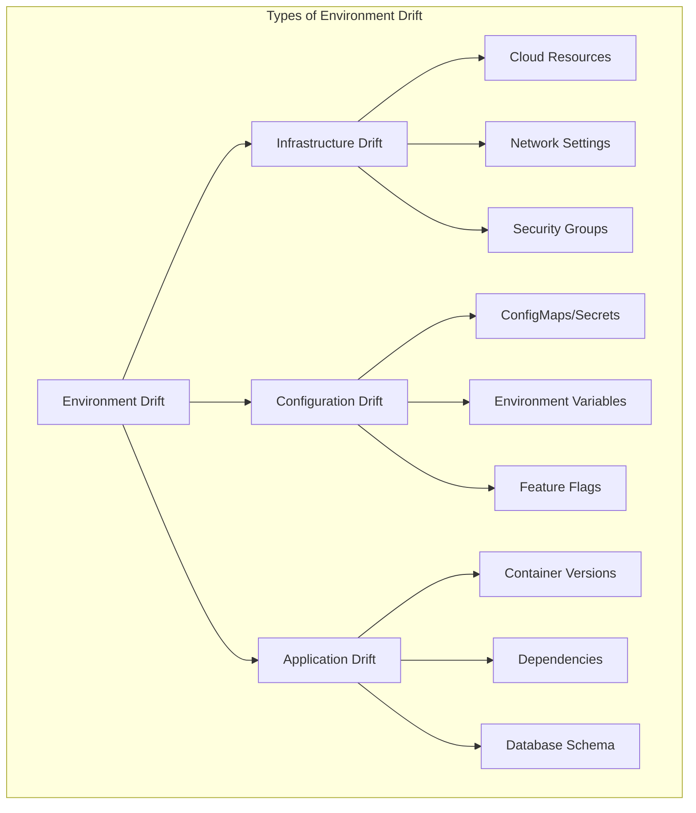

# How to Fix "Environment Drift" Issues

Author: [nawazdhandala](https://www.github.com/nawazdhandala)

Tags: Environment Drift, DevOps, Infrastructure as Code, Configuration Management, Terraform, Kubernetes, GitOps

Description: Learn how to detect, prevent, and fix environment drift issues where infrastructure and configurations diverge from their intended state.

---

Environment drift occurs when the actual state of your infrastructure diverges from the expected state defined in your code or configuration. This happens gradually through manual changes, failed deployments, or misconfigured automation. Drift causes unpredictable behavior, makes deployments fail, and turns debugging into a nightmare because your staging environment no longer matches production.

## Understanding Environment Drift

Drift can occur at multiple levels of your infrastructure stack.



## Detecting Infrastructure Drift

The first step to fixing drift is detecting it. Set up automated drift detection as part of your workflow.

### Terraform Drift Detection

Run regular plan checks to detect drift:

```yaml
# .github/workflows/drift-detection.yml
name: Detect Infrastructure Drift

on:
  schedule:
    - cron: '0 */6 * * *'  # Every 6 hours
  workflow_dispatch:  # Allow manual triggers

jobs:
  detect-drift:
    runs-on: ubuntu-latest
    strategy:
      matrix:
        environment: [staging, production]
    steps:
      - uses: actions/checkout@v4

      - name: Setup Terraform
        uses: hashicorp/setup-terraform@v3
        with:
          terraform_version: 1.6.0

      - name: Configure AWS credentials
        uses: aws-actions/configure-aws-credentials@v4
        with:
          role-to-assume: ${{ secrets.AWS_ROLE_ARN }}
          aws-region: us-east-1

      - name: Terraform Init
        run: terraform init
        working-directory: terraform/environments/${{ matrix.environment }}

      - name: Detect Drift
        id: plan
        run: |
          # Run plan and capture output
          terraform plan -detailed-exitcode -out=tfplan 2>&1 | tee plan_output.txt
          EXIT_CODE=${PIPESTATUS[0]}

          # Exit code 2 means changes detected (drift)
          if [ $EXIT_CODE -eq 2 ]; then
            echo "drift_detected=true" >> $GITHUB_OUTPUT
            echo "DRIFT DETECTED in ${{ matrix.environment }}"
          else
            echo "drift_detected=false" >> $GITHUB_OUTPUT
            echo "No drift detected"
          fi
        working-directory: terraform/environments/${{ matrix.environment }}
        continue-on-error: true

      - name: Create drift report
        if: steps.plan.outputs.drift_detected == 'true'
        run: |
          # Generate human-readable drift report
          terraform show -no-color tfplan > drift_report.txt
        working-directory: terraform/environments/${{ matrix.environment }}

      - name: Notify on drift
        if: steps.plan.outputs.drift_detected == 'true'
        uses: slackapi/slack-github-action@v1
        with:
          payload: |
            {
              "text": "Infrastructure drift detected in ${{ matrix.environment }}",
              "blocks": [
                {
                  "type": "section",
                  "text": {
                    "type": "mrkdwn",
                    "text": "*Infrastructure Drift Alert*\nEnvironment: `${{ matrix.environment }}`\nSee workflow run for details."
                  }
                }
              ]
            }
        env:
          SLACK_WEBHOOK_URL: ${{ secrets.SLACK_WEBHOOK }}
```

### Kubernetes Configuration Drift

Detect drift in Kubernetes resources:

```bash
#!/bin/bash
# detect-k8s-drift.sh
# Compare running state with Git-stored manifests

NAMESPACE="production"
MANIFEST_DIR="./k8s/production"

echo "Checking for Kubernetes configuration drift..."

drift_found=false

for manifest in $MANIFEST_DIR/*.yaml; do
  echo "Checking $manifest..."

  # Get the resource name and kind from the manifest
  RESOURCE_KIND=$(yq '.kind' $manifest)
  RESOURCE_NAME=$(yq '.metadata.name' $manifest)

  # Perform a dry-run apply and check for differences
  DIFF_OUTPUT=$(kubectl diff -f $manifest 2>&1)

  if [ -n "$DIFF_OUTPUT" ]; then
    echo "DRIFT DETECTED: $RESOURCE_KIND/$RESOURCE_NAME"
    echo "$DIFF_OUTPUT"
    drift_found=true
  fi
done

if [ "$drift_found" = true ]; then
  echo "Drift detected in one or more resources"
  exit 1
else
  echo "No drift detected"
  exit 0
fi
```

## Fixing Infrastructure Drift

Once drift is detected, you need to decide whether to update the code or reconcile the infrastructure.

### Option 1: Reconcile to Match Code

Apply the defined state to fix drift:

```bash
#!/bin/bash
# reconcile-terraform.sh
# Apply Terraform to fix drift

ENVIRONMENT=$1

if [ -z "$ENVIRONMENT" ]; then
  echo "Usage: ./reconcile-terraform.sh <environment>"
  exit 1
fi

cd terraform/environments/$ENVIRONMENT

echo "Creating plan to reconcile drift..."
terraform plan -out=reconcile.tfplan

echo ""
echo "Review the plan above carefully."
read -p "Apply changes to fix drift? (yes/no): " confirm

if [ "$confirm" = "yes" ]; then
  terraform apply reconcile.tfplan
  echo "Drift reconciled"
else
  echo "Aborted"
fi
```

### Option 2: Import Changes to Code

If manual changes were intentional, import them into your IaC:

```bash
# Example: Import a manually created S3 bucket into Terraform

# First, add the resource block to your Terraform code
# terraform/modules/storage/main.tf
cat >> main.tf << 'EOF'
resource "aws_s3_bucket" "manually_created" {
  bucket = "my-manually-created-bucket"

  tags = {
    Environment = var.environment
    ManagedBy   = "terraform"
  }
}
EOF

# Then import the existing resource
terraform import aws_s3_bucket.manually_created my-manually-created-bucket

# Verify the import
terraform plan
# Should show no changes if import was successful
```

## Preventing Environment Drift

Prevention is better than detection. Implement guardrails to stop drift before it happens.

### GitOps with Argo CD

Argo CD automatically syncs your cluster state with Git:

```yaml
# argocd/application.yaml
apiVersion: argoproj.io/v1alpha1
kind: Application
metadata:
  name: web-api
  namespace: argocd
spec:
  project: default
  source:
    repoURL: https://github.com/mycompany/k8s-manifests.git
    targetRevision: main
    path: production/web-api
  destination:
    server: https://kubernetes.default.svc
    namespace: production
  syncPolicy:
    automated:
      # Automatically sync when Git changes
      prune: true      # Delete resources removed from Git
      selfHeal: true   # Revert manual changes to match Git
      allowEmpty: false
    syncOptions:
      - CreateNamespace=true
      - PrunePropagationPolicy=foreground
    retry:
      limit: 5
      backoff:
        duration: 5s
        factor: 2
        maxDuration: 3m
```

### Terraform Cloud Drift Detection

Enable continuous drift detection in Terraform Cloud:

```hcl
# terraform/main.tf
terraform {
  cloud {
    organization = "mycompany"

    workspaces {
      name = "production-infrastructure"
    }
  }
}

# In Terraform Cloud workspace settings:
# - Enable "Health Assessments"
# - Set assessment interval (e.g., every 24 hours)
# - Configure drift detection notifications
```

### Lock Down Manual Access

Prevent manual changes through access controls:

```yaml
# kubernetes/rbac-read-only.yaml
# Give most users read-only access
apiVersion: rbac.authorization.k8s.io/v1
kind: ClusterRole
metadata:
  name: read-only-user
rules:
  - apiGroups: [""]
    resources: ["pods", "services", "configmaps", "secrets"]
    verbs: ["get", "list", "watch"]
  - apiGroups: ["apps"]
    resources: ["deployments", "statefulsets", "daemonsets"]
    verbs: ["get", "list", "watch"]
---
# Only CI/CD service accounts can make changes
apiVersion: rbac.authorization.k8s.io/v1
kind: ClusterRole
metadata:
  name: deployment-automation
rules:
  - apiGroups: ["*"]
    resources: ["*"]
    verbs: ["*"]
---
apiVersion: rbac.authorization.k8s.io/v1
kind: ClusterRoleBinding
metadata:
  name: ci-cd-automation
subjects:
  - kind: ServiceAccount
    name: github-actions
    namespace: ci-cd
roleRef:
  kind: ClusterRole
  name: deployment-automation
  apiGroup: rbac.authorization.k8s.io
```

## Configuration Drift Between Environments

A common source of drift is configuration differences between dev, staging, and production.

### Using Kustomize for Environment Parity

```yaml
# kustomize/base/deployment.yaml
apiVersion: apps/v1
kind: Deployment
metadata:
  name: web-api
spec:
  replicas: 1
  template:
    spec:
      containers:
        - name: api
          image: myapp/api:latest
          env:
            - name: LOG_LEVEL
              value: "info"
---
# kustomize/overlays/staging/kustomization.yaml
apiVersion: kustomize.config.k8s.io/v1beta1
kind: Kustomization
namespace: staging
resources:
  - ../../base
patches:
  - patch: |-
      - op: replace
        path: /spec/replicas
        value: 2
    target:
      kind: Deployment
      name: web-api
configMapGenerator:
  - name: web-api-config
    literals:
      - DATABASE_HOST=staging-db.internal
---
# kustomize/overlays/production/kustomization.yaml
apiVersion: kustomize.config.k8s.io/v1beta1
kind: Kustomization
namespace: production
resources:
  - ../../base
patches:
  - patch: |-
      - op: replace
        path: /spec/replicas
        value: 5
    target:
      kind: Deployment
      name: web-api
configMapGenerator:
  - name: web-api-config
    literals:
      - DATABASE_HOST=prod-db.internal
```

### Validating Environment Parity

Create a script to compare environments:

```python
#!/usr/bin/env python3
# compare_environments.py
# Compare configuration between environments

import subprocess
import json
import sys
from deepdiff import DeepDiff

def get_deployment_config(namespace, deployment_name):
    """Get deployment configuration from Kubernetes."""
    result = subprocess.run(
        ["kubectl", "get", "deployment", deployment_name,
         "-n", namespace, "-o", "json"],
        capture_output=True, text=True
    )

    if result.returncode != 0:
        print(f"Error getting deployment from {namespace}: {result.stderr}")
        return None

    config = json.loads(result.stdout)

    # Remove fields that are expected to differ
    spec = config.get("spec", {}).get("template", {}).get("spec", {})

    # Normalize for comparison
    return {
        "image": spec.get("containers", [{}])[0].get("image", "").split(":")[0],
        "env_vars": sorted([e["name"] for e in spec.get("containers", [{}])[0].get("env", [])]),
        "resources": spec.get("containers", [{}])[0].get("resources", {}),
        "probes": {
            "readiness": spec.get("containers", [{}])[0].get("readinessProbe") is not None,
            "liveness": spec.get("containers", [{}])[0].get("livenessProbe") is not None,
        }
    }

def main():
    deployments = ["web-api", "worker", "scheduler"]

    print("Comparing staging and production configurations...\n")

    drift_found = False

    for deployment in deployments:
        staging_config = get_deployment_config("staging", deployment)
        prod_config = get_deployment_config("production", deployment)

        if staging_config is None or prod_config is None:
            continue

        diff = DeepDiff(staging_config, prod_config, ignore_order=True)

        if diff:
            print(f"DRIFT in {deployment}:")
            print(json.dumps(dict(diff), indent=2))
            drift_found = True
        else:
            print(f"OK: {deployment} - configurations match")

    sys.exit(1 if drift_found else 0)

if __name__ == "__main__":
    main()
```

## Drift in Database Schemas

Database schema drift is particularly dangerous and hard to detect.

### Schema Comparison Script

```bash
#!/bin/bash
# compare-schemas.sh
# Compare database schemas between environments

STAGING_DB_URL=$1
PROD_DB_URL=$2

# Dump schemas (structure only, no data)
pg_dump --schema-only --no-owner --no-privileges \
  "$STAGING_DB_URL" > staging_schema.sql

pg_dump --schema-only --no-owner --no-privileges \
  "$PROD_DB_URL" > prod_schema.sql

# Compare schemas
if diff staging_schema.sql prod_schema.sql > schema_diff.txt; then
  echo "Schemas match"
  rm staging_schema.sql prod_schema.sql schema_diff.txt
else
  echo "SCHEMA DRIFT DETECTED"
  echo "Differences:"
  cat schema_diff.txt
  exit 1
fi
```

### Automated Migration Verification

```yaml
# .github/workflows/migration-check.yml
name: Verify Migrations Applied

on:
  schedule:
    - cron: '0 8 * * *'  # Daily

jobs:
  check-migrations:
    runs-on: ubuntu-latest
    strategy:
      matrix:
        environment: [staging, production]
    steps:
      - uses: actions/checkout@v4

      - name: Check pending migrations
        run: |
          # Connect to database and check migration status
          PENDING=$(python manage.py showmigrations --plan | grep "\[ \]" | wc -l)

          if [ "$PENDING" -gt 0 ]; then
            echo "WARNING: $PENDING pending migrations in ${{ matrix.environment }}"
            python manage.py showmigrations --plan | grep "\[ \]"
            exit 1
          fi

          echo "All migrations applied in ${{ matrix.environment }}"
        env:
          DATABASE_URL: ${{ secrets[format('{0}_DATABASE_URL', matrix.environment)] }}
```

## Monitoring for Drift

Set up continuous monitoring to catch drift as it happens.

```yaml
# prometheus/drift-alerts.yaml
groups:
  - name: drift-detection
    rules:
      # Alert when Argo CD app is out of sync
      - alert: ArgoCDAppOutOfSync
        expr: |
          argocd_app_info{sync_status!="Synced"} == 1
        for: 10m
        labels:
          severity: warning
        annotations:
          summary: "Argo CD app {{ $labels.name }} is out of sync"
          description: "Application has drifted from Git state for more than 10 minutes"

      # Alert when Terraform workspace has drift
      - alert: TerraformDriftDetected
        expr: |
          tfc_workspace_drift_detected == 1
        for: 0m
        labels:
          severity: warning
        annotations:
          summary: "Terraform drift detected in {{ $labels.workspace }}"
```

## Summary

Environment drift is an inevitable challenge in infrastructure management, but with the right tools and practices, you can minimize its impact. Key takeaways:

1. Run automated drift detection on a regular schedule
2. Use GitOps tools like Argo CD to automatically reconcile drift
3. Lock down manual access to production infrastructure
4. Standardize configurations across environments using Kustomize or Helm
5. Monitor database schema parity between environments
6. Set up alerts to catch drift as soon as it happens

The goal is not to eliminate all drift, but to detect it quickly and have clear procedures for reconciliation. When everyone knows the process, drift becomes a minor inconvenience rather than a major incident.
