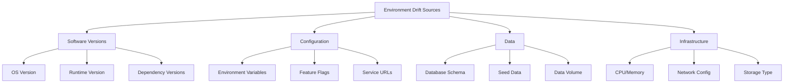

# How to Fix 'Environment Parity' Issues

Author: [nawazdhandala](https://www.github.com/nawazdhandala)

Tags: Environment Parity, DevOps, Docker, Kubernetes, Testing, Infrastructure as Code

Description: Learn how to achieve environment parity between development, staging, and production to reduce deployment failures and catch bugs earlier in the development cycle.

---

"Works on my machine" is the classic symptom of environment parity problems. When development, staging, and production environments differ, bugs slip through testing and only appear in production. This guide shows you how to make your environments consistent so that what works locally works everywhere.

## Why Environment Parity Matters

Environment differences cause real problems:

- Bugs that only appear in production
- "Works in staging" failures that block releases
- Time wasted debugging environment-specific issues
- Reduced confidence in the deployment process

The Twelve-Factor App methodology recommends keeping development, staging, and production as similar as possible. Let's see how to actually do that.

## Common Sources of Environment Drift

Before fixing parity issues, you need to know what causes them.



## Containerization for Consistent Environments

Docker is the foundation of environment parity. The same container image runs everywhere.

```dockerfile
# Dockerfile
# Use specific version tags, not 'latest'
FROM node:20.10.0-alpine3.19

# Set working directory
WORKDIR /app

# Copy dependency files first for better caching
COPY package.json package-lock.json ./

# Install exact versions from lockfile
RUN npm ci --only=production

# Copy application code
COPY . .

# Build the application
RUN npm run build

# Use non-root user for security
USER node

# Expose the application port
EXPOSE 3000

# Define the startup command
CMD ["node", "dist/server.js"]
```

Pin all dependency versions to avoid surprises.

```json
{
  "name": "api-server",
  "version": "2.3.1",
  "engines": {
    "node": "20.10.0",
    "npm": "10.2.3"
  },
  "dependencies": {
    "express": "4.18.2",
    "pg": "8.11.3",
    "redis": "4.6.12"
  }
}
```

## Infrastructure as Code

Define infrastructure in code so every environment is built the same way.

```yaml
# terraform/modules/app/main.tf
variable "environment" {
  type        = string
  description = "Environment name (dev, staging, production)"
}

variable "instance_count" {
  type        = number
  description = "Number of application instances"
}

# Same module, different variables per environment
resource "kubernetes_deployment" "app" {
  metadata {
    name      = "api-server"
    namespace = var.environment
    labels = {
      app         = "api-server"
      environment = var.environment
    }
  }

  spec {
    replicas = var.instance_count

    selector {
      match_labels = {
        app = "api-server"
      }
    }

    template {
      metadata {
        labels = {
          app         = "api-server"
          environment = var.environment
        }
      }

      spec {
        container {
          image = "ghcr.io/company/api-server:${var.app_version}"
          name  = "api-server"

          # Same resource structure, scaled by environment
          resources {
            limits = {
              cpu    = var.environment == "production" ? "2000m" : "500m"
              memory = var.environment == "production" ? "2Gi" : "512Mi"
            }
            requests = {
              cpu    = var.environment == "production" ? "500m" : "100m"
              memory = var.environment == "production" ? "1Gi" : "256Mi"
            }
          }

          env_from {
            config_map_ref {
              name = "app-config-${var.environment}"
            }
          }
        }
      }
    }
  }
}
```

Use environment-specific variable files with the same structure.

```hcl
# terraform/environments/dev.tfvars
environment     = "dev"
instance_count  = 1
app_version     = "latest"

# terraform/environments/staging.tfvars
environment     = "staging"
instance_count  = 2
app_version     = "v2.3.1"

# terraform/environments/production.tfvars
environment     = "production"
instance_count  = 5
app_version     = "v2.3.1"
```

## Configuration Management

Keep configuration structured and environment-aware.

```yaml
# config/base.yaml - Shared configuration
app:
  name: api-server
  port: 3000

logging:
  format: json
  level: info

database:
  pool_size: 10
  timeout_ms: 5000

cache:
  ttl_seconds: 300
```

```yaml
# config/dev.yaml - Development overrides
logging:
  level: debug

database:
  host: localhost
  pool_size: 5

cache:
  ttl_seconds: 60
```

```yaml
# config/production.yaml - Production overrides
database:
  host: ${DATABASE_HOST}
  pool_size: 20

cache:
  ttl_seconds: 600
```

Load configuration with environment awareness.

```typescript
// config/loader.ts
import * as yaml from 'js-yaml';
import * as fs from 'fs';
import * as path from 'path';

interface Config {
  app: { name: string; port: number };
  logging: { format: string; level: string };
  database: { host: string; pool_size: number; timeout_ms: number };
  cache: { ttl_seconds: number };
}

function loadConfig(): Config {
  const env = process.env.NODE_ENV || 'development';
  const configDir = path.join(__dirname, '../config');

  // Load base configuration
  const baseConfig = yaml.load(
    fs.readFileSync(path.join(configDir, 'base.yaml'), 'utf8')
  ) as Config;

  // Load environment-specific overrides
  const envConfigPath = path.join(configDir, `${env}.yaml`);
  let envConfig = {};

  if (fs.existsSync(envConfigPath)) {
    envConfig = yaml.load(fs.readFileSync(envConfigPath, 'utf8')) as Partial<Config>;
  }

  // Merge configurations
  const config = deepMerge(baseConfig, envConfig);

  // Replace environment variable placeholders
  return replaceEnvVars(config);
}

function replaceEnvVars(obj: any): any {
  if (typeof obj === 'string') {
    // Replace ${VAR_NAME} with environment variable value
    return obj.replace(/\$\{(\w+)\}/g, (_, varName) => {
      const value = process.env[varName];
      if (value === undefined) {
        throw new Error(`Environment variable ${varName} is not set`);
      }
      return value;
    });
  }

  if (Array.isArray(obj)) {
    return obj.map(replaceEnvVars);
  }

  if (typeof obj === 'object' && obj !== null) {
    return Object.fromEntries(
      Object.entries(obj).map(([key, value]) => [key, replaceEnvVars(value)])
    );
  }

  return obj;
}

export const config = loadConfig();
```

## Local Development Environment

Use Docker Compose to run a production-like environment locally.

```yaml
# docker-compose.yml
version: '3.8'

services:
  app:
    build:
      context: .
      dockerfile: Dockerfile
    ports:
      - "3000:3000"
    environment:
      NODE_ENV: development
      DATABASE_HOST: postgres
      REDIS_HOST: redis
    depends_on:
      postgres:
        condition: service_healthy
      redis:
        condition: service_healthy
    volumes:
      # Mount source for hot reload in development
      - ./src:/app/src:ro

  postgres:
    image: postgres:16.1-alpine
    environment:
      POSTGRES_USER: app
      POSTGRES_PASSWORD: devpassword
      POSTGRES_DB: appdb
    ports:
      - "5432:5432"
    volumes:
      - postgres_data:/var/lib/postgresql/data
      # Initialize with production-like schema
      - ./db/schema.sql:/docker-entrypoint-initdb.d/01-schema.sql:ro
      - ./db/seed-dev.sql:/docker-entrypoint-initdb.d/02-seed.sql:ro
    healthcheck:
      test: ["CMD-SHELL", "pg_isready -U app -d appdb"]
      interval: 5s
      timeout: 5s
      retries: 5

  redis:
    image: redis:7.2-alpine
    ports:
      - "6379:6379"
    healthcheck:
      test: ["CMD", "redis-cli", "ping"]
      interval: 5s
      timeout: 5s
      retries: 5

volumes:
  postgres_data:
```

## Database Schema Parity

Keep database schemas identical across environments using migrations.

```typescript
// migrations/20240115_001_create_users.ts
import { Knex } from 'knex';

export async function up(knex: Knex): Promise<void> {
  await knex.schema.createTable('users', (table) => {
    table.uuid('id').primary().defaultTo(knex.raw('gen_random_uuid()'));
    table.string('email', 255).notNullable().unique();
    table.string('name', 255).notNullable();
    table.string('password_hash', 255).notNullable();
    table.timestamp('created_at').defaultTo(knex.fn.now());
    table.timestamp('updated_at').defaultTo(knex.fn.now());

    // Indexes
    table.index(['email']);
    table.index(['created_at']);
  });
}

export async function down(knex: Knex): Promise<void> {
  await knex.schema.dropTable('users');
}
```

Run migrations as part of deployment.

```yaml
# k8s/migration-job.yaml
apiVersion: batch/v1
kind: Job
metadata:
  name: db-migration-${VERSION}
  annotations:
    argocd.argoproj.io/hook: PreSync
    argocd.argoproj.io/hook-delete-policy: HookSucceeded
spec:
  template:
    spec:
      containers:
        - name: migrate
          image: ghcr.io/company/api-server:${VERSION}
          command: ["npm", "run", "migrate"]
          env:
            - name: DATABASE_URL
              valueFrom:
                secretKeyRef:
                  name: db-credentials
                  key: url
      restartPolicy: Never
  backoffLimit: 3
```

## Testing Environment Parity

Write tests that verify environment consistency.

```typescript
// tests/environment-parity.test.ts
import { execSync } from 'child_process';

describe('Environment Parity', () => {
  const environments = ['dev', 'staging', 'production'];

  test('all environments use same Docker base image', () => {
    const dockerfile = fs.readFileSync('Dockerfile', 'utf8');
    const baseImage = dockerfile.match(/^FROM\s+(\S+)/m)?.[1];

    expect(baseImage).toBeDefined();
    expect(baseImage).toMatch(/^node:20\.10\.0/);
  });

  test('all environments have same config structure', () => {
    const baseConfig = loadYaml('config/base.yaml');
    const baseKeys = getNestedKeys(baseConfig);

    for (const env of environments) {
      const envConfigPath = `config/${env}.yaml`;
      if (fs.existsSync(envConfigPath)) {
        const envConfig = loadYaml(envConfigPath);
        const envKeys = getNestedKeys(envConfig);

        // Environment config should only override, not add new keys
        for (const key of envKeys) {
          expect(baseKeys).toContain(key);
        }
      }
    }
  });

  test('database migrations are in sync', async () => {
    // Check that all environments have same migration status
    const migrationFiles = fs.readdirSync('migrations').sort();

    for (const env of environments) {
      const applied = await getMigrationsForEnv(env);
      expect(applied.sort()).toEqual(migrationFiles);
    }
  });

  test('dependency versions are locked', () => {
    const packageJson = JSON.parse(fs.readFileSync('package.json', 'utf8'));
    const packageLock = JSON.parse(fs.readFileSync('package-lock.json', 'utf8'));

    // Ensure lockfile exists and matches package.json
    expect(packageLock.lockfileVersion).toBeGreaterThanOrEqual(2);

    for (const [dep, version] of Object.entries(packageJson.dependencies)) {
      // No floating versions like ^1.0.0 or ~1.0.0
      expect(version).not.toMatch(/^[\^~]/);
    }
  });
});
```

## Environment Parity Checklist

Create a script that validates parity before deployments.

```bash
#!/bin/bash
# parity-check.sh

set -e

echo "Checking environment parity..."

# Check 1: Verify same container image across environments
echo "1. Checking container images..."
DEV_IMAGE=$(kubectl get deployment app -n dev -o jsonpath='{.spec.template.spec.containers[0].image}')
STAGING_IMAGE=$(kubectl get deployment app -n staging -o jsonpath='{.spec.template.spec.containers[0].image}')

DEV_TAG=$(echo $DEV_IMAGE | cut -d: -f2)
STAGING_TAG=$(echo $STAGING_IMAGE | cut -d: -f2)

if [ "$DEV_TAG" != "$STAGING_TAG" ] && [ "$STAGING_TAG" != "latest" ]; then
    echo "WARNING: Dev ($DEV_TAG) and staging ($STAGING_TAG) have different versions"
fi

# Check 2: Verify config maps have same keys
echo "2. Checking config structure..."
DEV_KEYS=$(kubectl get configmap app-config -n dev -o json | jq -r '.data | keys[]' | sort)
STAGING_KEYS=$(kubectl get configmap app-config -n staging -o json | jq -r '.data | keys[]' | sort)
PROD_KEYS=$(kubectl get configmap app-config -n production -o json | jq -r '.data | keys[]' | sort)

if [ "$DEV_KEYS" != "$STAGING_KEYS" ] || [ "$STAGING_KEYS" != "$PROD_KEYS" ]; then
    echo "ERROR: Config maps have different keys across environments"
    echo "Dev: $DEV_KEYS"
    echo "Staging: $STAGING_KEYS"
    echo "Production: $PROD_KEYS"
    exit 1
fi

# Check 3: Verify database schema version
echo "3. Checking database schema..."
for env in dev staging production; do
    SCHEMA_VERSION=$(kubectl exec -n $env deploy/app -- npm run migrate:status --silent | tail -1)
    echo "$env: $SCHEMA_VERSION"
done

# Check 4: Verify secrets exist
echo "4. Checking required secrets..."
REQUIRED_SECRETS="db-credentials api-keys tls-cert"
for env in dev staging production; do
    for secret in $REQUIRED_SECRETS; do
        if ! kubectl get secret $secret -n $env &>/dev/null; then
            echo "ERROR: Secret $secret missing in $env"
            exit 1
        fi
    done
done

echo "Environment parity check complete!"
```

## Handling Intentional Differences

Some differences are intentional. Document and manage them explicitly.

```yaml
# environment-differences.yaml
# This file documents intentional differences between environments

scaling:
  description: "Production has more replicas for high availability"
  dev: 1
  staging: 2
  production: 5

resources:
  description: "Production has higher resource limits"
  dev:
    cpu: 500m
    memory: 512Mi
  staging:
    cpu: 500m
    memory: 512Mi
  production:
    cpu: 2000m
    memory: 2Gi

external_services:
  description: "Each environment uses different external service endpoints"
  payment_gateway:
    dev: "https://sandbox.stripe.com"
    staging: "https://sandbox.stripe.com"
    production: "https://api.stripe.com"

feature_flags:
  description: "Some features enabled only in specific environments"
  new_checkout:
    dev: true
    staging: true
    production: false  # Will enable after staging validation
```

## Best Practices

1. **Use containers** - Same image everywhere eliminates "works on my machine"
2. **Pin versions** - Floating versions cause unexpected drift
3. **Automate infrastructure** - Manual changes cause drift
4. **Test parity** - Write tests that verify environments match
5. **Document differences** - When differences are intentional, document why
6. **Use the same CI/CD** - Same pipeline reduces deployment-specific bugs

---

Environment parity is not about making all environments identical. It is about making differences intentional and documented. When staging matches production, you can trust your tests. When development matches staging, developers catch bugs earlier. Start with containers, add infrastructure as code, and continuously verify that your environments stay in sync.
