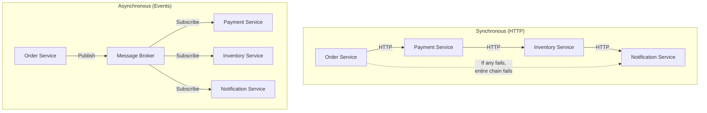
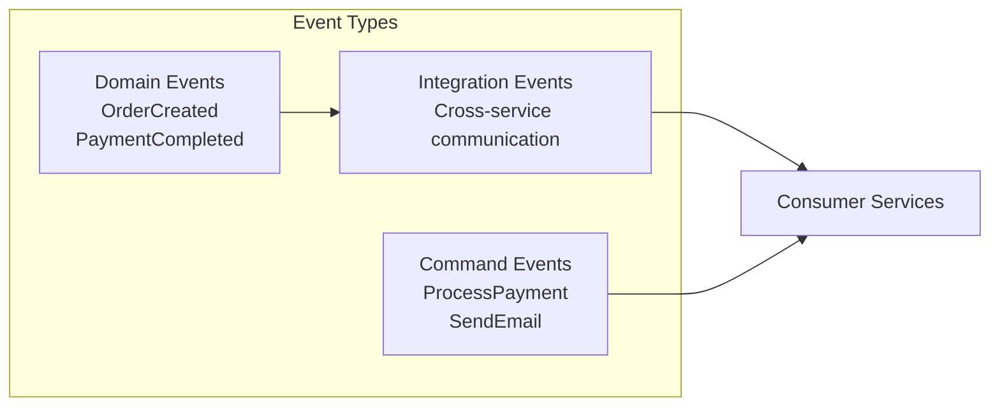
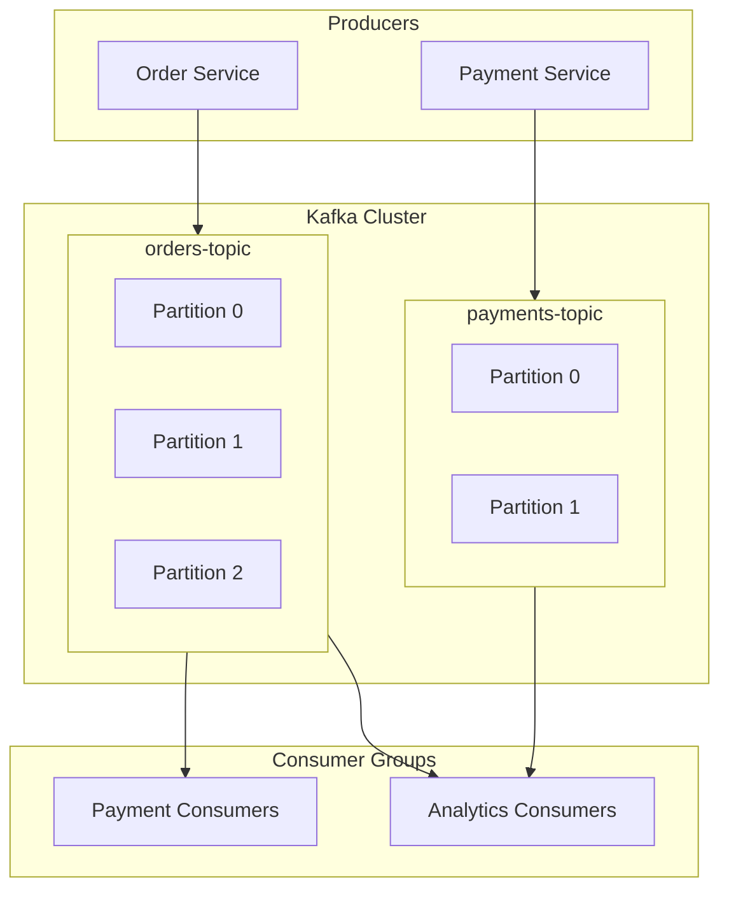
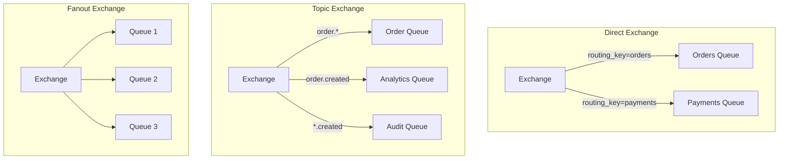
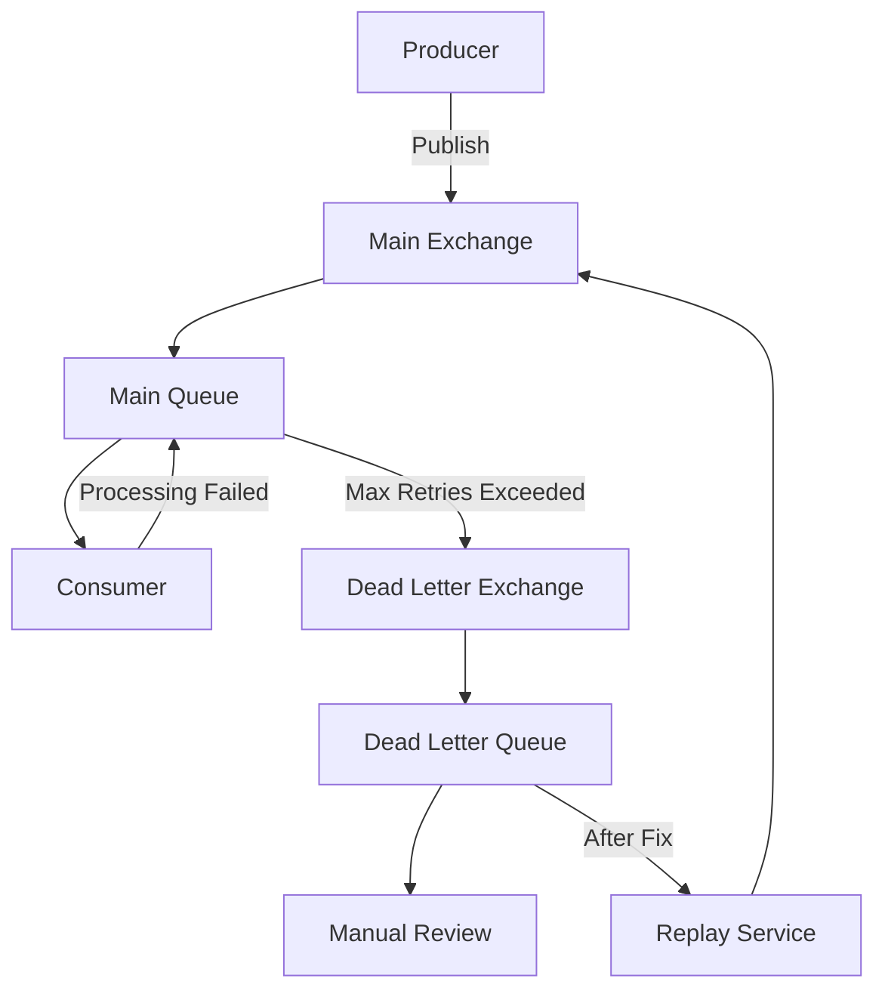
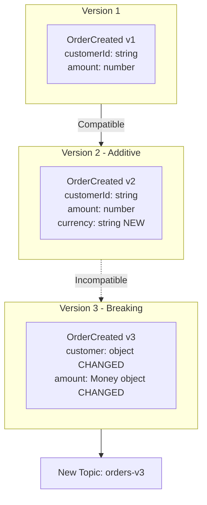

# How to Handle Event-Driven Communication

Author: [nawazdhandala](https://www.github.com/nawazdhandala)

Tags: Event-Driven Architecture, Microservices, Kafka, RabbitMQ, Message Queue, Async Communication, DevOps

Description: A practical guide to implementing event-driven communication in microservices using message brokers, event schemas, and reliable delivery patterns.

---

Synchronous HTTP calls between microservices create tight coupling and cascading failures. Event-driven communication decouples services, improves resilience, and enables better scalability. This guide covers the practical aspects of implementing event-driven architectures.

## Why Event-Driven Communication?



### Benefits of Event-Driven Architecture

| Aspect | Synchronous | Event-Driven |
|--------|-------------|--------------|
| Coupling | Tight | Loose |
| Availability | Chain dependent | Independent |
| Scalability | Limited by slowest | Independent scaling |
| Failure handling | Cascading | Isolated |
| Latency | Cumulative | Parallel processing |

## Event Design Patterns

### Event Types



### Event Schema Design

```json
{
  "$schema": "http://json-schema.org/draft-07/schema#",
  "title": "OrderCreatedEvent",
  "type": "object",
  "required": ["eventId", "eventType", "timestamp", "aggregateId", "data"],
  "properties": {
    "eventId": {
      "type": "string",
      "format": "uuid",
      "description": "Unique identifier for this event"
    },
    "eventType": {
      "type": "string",
      "const": "OrderCreated"
    },
    "timestamp": {
      "type": "string",
      "format": "date-time"
    },
    "aggregateId": {
      "type": "string",
      "description": "Order ID"
    },
    "version": {
      "type": "integer",
      "minimum": 1
    },
    "correlationId": {
      "type": "string",
      "description": "For tracing across services"
    },
    "causationId": {
      "type": "string",
      "description": "Event that caused this event"
    },
    "data": {
      "type": "object",
      "properties": {
        "customerId": { "type": "string" },
        "items": {
          "type": "array",
          "items": {
            "type": "object",
            "properties": {
              "productId": { "type": "string" },
              "quantity": { "type": "integer" },
              "price": { "type": "number" }
            }
          }
        },
        "totalAmount": { "type": "number" }
      }
    },
    "metadata": {
      "type": "object",
      "properties": {
        "userId": { "type": "string" },
        "source": { "type": "string" },
        "environment": { "type": "string" }
      }
    }
  }
}
```

## Implementation with Apache Kafka

### Kafka Architecture



### Kafka Producer Implementation

```java
package com.example.events;

import org.apache.kafka.clients.producer.KafkaProducer;
import org.apache.kafka.clients.producer.ProducerConfig;
import org.apache.kafka.clients.producer.ProducerRecord;
import org.apache.kafka.common.serialization.StringSerializer;

import java.util.Properties;
import java.util.UUID;
import java.util.concurrent.CompletableFuture;

public class EventPublisher {

    private final KafkaProducer<String, String> producer;
    private final ObjectMapper objectMapper;

    public EventPublisher(String bootstrapServers) {
        Properties props = new Properties();
        props.put(ProducerConfig.BOOTSTRAP_SERVERS_CONFIG, bootstrapServers);
        props.put(ProducerConfig.KEY_SERIALIZER_CLASS_CONFIG, StringSerializer.class);
        props.put(ProducerConfig.VALUE_SERIALIZER_CLASS_CONFIG, StringSerializer.class);

        // Reliability settings
        props.put(ProducerConfig.ACKS_CONFIG, "all");
        props.put(ProducerConfig.RETRIES_CONFIG, 3);
        props.put(ProducerConfig.ENABLE_IDEMPOTENCE_CONFIG, true);

        // Performance settings
        props.put(ProducerConfig.BATCH_SIZE_CONFIG, 16384);
        props.put(ProducerConfig.LINGER_MS_CONFIG, 5);
        props.put(ProducerConfig.COMPRESSION_TYPE_CONFIG, "snappy");

        this.producer = new KafkaProducer<>(props);
        this.objectMapper = new ObjectMapper();
    }

    public CompletableFuture<Void> publish(String topic, Event event) {
        CompletableFuture<Void> future = new CompletableFuture<>();

        try {
            String key = event.getAggregateId();
            String value = objectMapper.writeValueAsString(event);

            ProducerRecord<String, String> record = new ProducerRecord<>(topic, key, value);

            // Add headers for tracing
            record.headers()
                .add("eventId", event.getEventId().getBytes())
                .add("eventType", event.getEventType().getBytes())
                .add("correlationId", event.getCorrelationId().getBytes());

            producer.send(record, (metadata, exception) -> {
                if (exception != null) {
                    log.error("Failed to publish event: {}", event.getEventId(), exception);
                    future.completeExceptionally(exception);
                } else {
                    log.info("Published event {} to {}:{}",
                        event.getEventId(), metadata.topic(), metadata.partition());
                    future.complete(null);
                }
            });

        } catch (Exception e) {
            future.completeExceptionally(e);
        }

        return future;
    }

    public void close() {
        producer.flush();
        producer.close();
    }
}

// Event base class
public abstract class Event {
    private String eventId;
    private String eventType;
    private Instant timestamp;
    private String aggregateId;
    private int version;
    private String correlationId;
    private String causationId;

    protected Event() {
        this.eventId = UUID.randomUUID().toString();
        this.timestamp = Instant.now();
        this.correlationId = MDC.get("correlationId");
    }

    // Getters and setters
}

// Specific event
public class OrderCreatedEvent extends Event {
    private OrderData data;

    public OrderCreatedEvent(String orderId, OrderData data) {
        super();
        this.setAggregateId(orderId);
        this.setEventType("OrderCreated");
        this.data = data;
    }
}
```

### Kafka Consumer Implementation

```java
package com.example.events;

import org.apache.kafka.clients.consumer.*;
import org.apache.kafka.common.errors.WakeupException;

import java.time.Duration;
import java.util.*;
import java.util.concurrent.atomic.AtomicBoolean;

public class EventConsumer implements Runnable {

    private final KafkaConsumer<String, String> consumer;
    private final Map<String, EventHandler<?>> handlers;
    private final AtomicBoolean shutdown;
    private final ObjectMapper objectMapper;

    public EventConsumer(String bootstrapServers, String groupId, List<String> topics) {
        Properties props = new Properties();
        props.put(ConsumerConfig.BOOTSTRAP_SERVERS_CONFIG, bootstrapServers);
        props.put(ConsumerConfig.GROUP_ID_CONFIG, groupId);
        props.put(ConsumerConfig.KEY_DESERIALIZER_CLASS_CONFIG, StringDeserializer.class);
        props.put(ConsumerConfig.VALUE_DESERIALIZER_CLASS_CONFIG, StringDeserializer.class);

        // Consumer settings
        props.put(ConsumerConfig.ENABLE_AUTO_COMMIT_CONFIG, false);
        props.put(ConsumerConfig.AUTO_OFFSET_RESET_CONFIG, "earliest");
        props.put(ConsumerConfig.MAX_POLL_RECORDS_CONFIG, 100);
        props.put(ConsumerConfig.MAX_POLL_INTERVAL_MS_CONFIG, 300000);

        this.consumer = new KafkaConsumer<>(props);
        this.consumer.subscribe(topics);
        this.handlers = new HashMap<>();
        this.shutdown = new AtomicBoolean(false);
        this.objectMapper = new ObjectMapper();
    }

    public <T extends Event> void registerHandler(String eventType, EventHandler<T> handler) {
        handlers.put(eventType, handler);
    }

    @Override
    public void run() {
        try {
            while (!shutdown.get()) {
                ConsumerRecords<String, String> records = consumer.poll(Duration.ofMillis(100));

                for (ConsumerRecord<String, String> record : records) {
                    processRecord(record);
                }

                // Manual commit after processing
                consumer.commitSync();
            }
        } catch (WakeupException e) {
            if (!shutdown.get()) {
                throw e;
            }
        } finally {
            consumer.close();
        }
    }

    private void processRecord(ConsumerRecord<String, String> record) {
        String eventType = getHeader(record, "eventType");
        String eventId = getHeader(record, "eventId");

        // Set correlation ID for tracing
        String correlationId = getHeader(record, "correlationId");
        MDC.put("correlationId", correlationId);

        try {
            EventHandler<?> handler = handlers.get(eventType);
            if (handler == null) {
                log.warn("No handler for event type: {}", eventType);
                return;
            }

            // Check idempotency
            if (isAlreadyProcessed(eventId)) {
                log.info("Skipping duplicate event: {}", eventId);
                return;
            }

            // Deserialize and handle
            Event event = objectMapper.readValue(record.value(), handler.getEventClass());
            handler.handle(event);

            // Mark as processed
            markAsProcessed(eventId);

            log.info("Processed event: {} type: {}", eventId, eventType);

        } catch (Exception e) {
            log.error("Failed to process event: {}", eventId, e);
            handleFailure(record, e);
        } finally {
            MDC.clear();
        }
    }

    private void handleFailure(ConsumerRecord<String, String> record, Exception e) {
        // Send to dead letter topic for later analysis
        String dlqTopic = record.topic() + ".dlq";
        // Publish to DLQ with original headers plus error info
    }

    public void shutdown() {
        shutdown.set(true);
        consumer.wakeup();
    }

    private String getHeader(ConsumerRecord<String, String> record, String key) {
        Header header = record.headers().lastHeader(key);
        return header != null ? new String(header.value()) : null;
    }
}

// Event handler interface
public interface EventHandler<T extends Event> {
    void handle(T event);
    Class<T> getEventClass();
}

// Example handler
@Component
public class OrderCreatedHandler implements EventHandler<OrderCreatedEvent> {

    private final PaymentService paymentService;

    @Override
    public void handle(OrderCreatedEvent event) {
        log.info("Processing order created: {}", event.getAggregateId());

        paymentService.initiatePayment(
            event.getAggregateId(),
            event.getData().getTotalAmount()
        );
    }

    @Override
    public Class<OrderCreatedEvent> getEventClass() {
        return OrderCreatedEvent.class;
    }
}
```

## Implementation with RabbitMQ

### RabbitMQ Exchange Patterns



### RabbitMQ Producer

```python
import json
import pika
from datetime import datetime
from uuid import uuid4
from typing import Dict, Any
import logging

logger = logging.getLogger(__name__)

class RabbitMQPublisher:
    def __init__(self, host: str, port: int = 5672, username: str = 'guest',
                 password: str = 'guest'):
        self.connection_params = pika.ConnectionParameters(
            host=host,
            port=port,
            credentials=pika.PlainCredentials(username, password),
            heartbeat=600,
            blocked_connection_timeout=300
        )
        self.connection = None
        self.channel = None

    def connect(self):
        self.connection = pika.BlockingConnection(self.connection_params)
        self.channel = self.connection.channel()

        # Declare exchanges
        self.channel.exchange_declare(
            exchange='events',
            exchange_type='topic',
            durable=True
        )

        # Enable publisher confirms
        self.channel.confirm_delivery()

    def publish(self, event_type: str, event_data: Dict[str, Any],
                correlation_id: str = None) -> bool:
        """Publish an event with reliability guarantees."""
        if not self.channel or self.channel.is_closed:
            self.connect()

        event = {
            'event_id': str(uuid4()),
            'event_type': event_type,
            'timestamp': datetime.utcnow().isoformat(),
            'correlation_id': correlation_id or str(uuid4()),
            'data': event_data
        }

        routing_key = event_type.lower().replace('_', '.')

        properties = pika.BasicProperties(
            content_type='application/json',
            delivery_mode=2,  # Persistent
            message_id=event['event_id'],
            correlation_id=event['correlation_id'],
            timestamp=int(datetime.utcnow().timestamp()),
            headers={
                'event_type': event_type,
                'version': '1.0'
            }
        )

        try:
            self.channel.basic_publish(
                exchange='events',
                routing_key=routing_key,
                body=json.dumps(event),
                properties=properties,
                mandatory=True  # Ensure message is routed
            )
            logger.info(f"Published event {event['event_id']} to {routing_key}")
            return True

        except pika.exceptions.UnroutableError:
            logger.error(f"Message was not routable: {event['event_id']}")
            return False

    def close(self):
        if self.connection and not self.connection.is_closed:
            self.connection.close()

# Usage
publisher = RabbitMQPublisher(host='rabbitmq')
publisher.connect()

publisher.publish(
    event_type='ORDER_CREATED',
    event_data={
        'order_id': 'ord-123',
        'customer_id': 'cust-456',
        'items': [{'product_id': 'prod-789', 'quantity': 2}],
        'total_amount': 99.99
    }
)
```

### RabbitMQ Consumer

```python
import json
import pika
from typing import Callable, Dict, Any
import logging
import threading

logger = logging.getLogger(__name__)

class RabbitMQConsumer:
    def __init__(self, host: str, port: int = 5672, username: str = 'guest',
                 password: str = 'guest', prefetch_count: int = 10):
        self.connection_params = pika.ConnectionParameters(
            host=host,
            port=port,
            credentials=pika.PlainCredentials(username, password),
            heartbeat=600
        )
        self.prefetch_count = prefetch_count
        self.handlers: Dict[str, Callable] = {}
        self.processed_events: set = set()
        self.connection = None
        self.channel = None

    def connect(self):
        self.connection = pika.BlockingConnection(self.connection_params)
        self.channel = self.connection.channel()

        # QoS settings
        self.channel.basic_qos(prefetch_count=self.prefetch_count)

        # Declare exchange
        self.channel.exchange_declare(
            exchange='events',
            exchange_type='topic',
            durable=True
        )

    def register_handler(self, event_pattern: str, handler: Callable,
                         queue_name: str = None):
        """Register handler for event pattern."""
        queue_name = queue_name or f"{event_pattern.replace('.', '_')}_queue"

        # Declare queue
        self.channel.queue_declare(
            queue=queue_name,
            durable=True,
            arguments={
                'x-dead-letter-exchange': 'events.dlx',
                'x-dead-letter-routing-key': 'dead.letter'
            }
        )

        # Bind queue to exchange
        self.channel.queue_bind(
            exchange='events',
            queue=queue_name,
            routing_key=event_pattern
        )

        self.handlers[queue_name] = handler
        logger.info(f"Registered handler for {event_pattern} on queue {queue_name}")

    def _on_message(self, channel, method, properties, body):
        """Process incoming message."""
        event_id = properties.message_id
        event_type = properties.headers.get('event_type', 'unknown')

        try:
            # Idempotency check
            if event_id in self.processed_events:
                logger.info(f"Skipping duplicate event: {event_id}")
                channel.basic_ack(delivery_tag=method.delivery_tag)
                return

            # Parse event
            event = json.loads(body)

            # Get handler for this queue
            handler = self.handlers.get(method.consumer_tag)
            if handler:
                handler(event)

            # Mark as processed
            self.processed_events.add(event_id)

            # Acknowledge message
            channel.basic_ack(delivery_tag=method.delivery_tag)
            logger.info(f"Processed event {event_id} type {event_type}")

        except json.JSONDecodeError as e:
            logger.error(f"Invalid JSON in message: {e}")
            # Reject and don't requeue malformed messages
            channel.basic_reject(delivery_tag=method.delivery_tag, requeue=False)

        except Exception as e:
            logger.error(f"Error processing event {event_id}: {e}")
            # Reject and send to DLQ
            channel.basic_nack(delivery_tag=method.delivery_tag, requeue=False)

    def start(self):
        """Start consuming from all registered queues."""
        if not self.channel:
            self.connect()

        for queue_name in self.handlers.keys():
            self.channel.basic_consume(
                queue=queue_name,
                on_message_callback=self._on_message,
                consumer_tag=queue_name
            )

        logger.info("Starting consumer...")
        try:
            self.channel.start_consuming()
        except KeyboardInterrupt:
            self.channel.stop_consuming()
            self.connection.close()

# Usage
def handle_order_created(event):
    """Handle order created events."""
    order_id = event['data']['order_id']
    logger.info(f"Processing order: {order_id}")
    # Process the order...

consumer = RabbitMQConsumer(host='rabbitmq')
consumer.connect()
consumer.register_handler('order.created', handle_order_created)
consumer.start()
```

## Handling Failures and Retries

### Dead Letter Queue Pattern



### Implementing Retry with Exponential Backoff

```javascript
const amqp = require('amqplib');

class RetryableConsumer {
    constructor(config) {
        this.config = config;
        this.maxRetries = config.maxRetries || 3;
        this.baseDelay = config.baseDelay || 1000;
    }

    async connect() {
        this.connection = await amqp.connect(this.config.url);
        this.channel = await this.connection.createChannel();

        // Set up main queue with DLX
        await this.channel.assertExchange('events', 'topic', { durable: true });
        await this.channel.assertExchange('events.dlx', 'topic', { durable: true });
        await this.channel.assertExchange('events.retry', 'topic', { durable: true });

        // Main queue
        await this.channel.assertQueue('orders.queue', {
            durable: true,
            arguments: {
                'x-dead-letter-exchange': 'events.dlx',
                'x-dead-letter-routing-key': 'orders.dead'
            }
        });

        // Retry queues with different delays
        for (let i = 1; i <= this.maxRetries; i++) {
            const delay = this.baseDelay * Math.pow(2, i - 1);
            await this.channel.assertQueue(`orders.retry.${i}`, {
                durable: true,
                arguments: {
                    'x-dead-letter-exchange': 'events',
                    'x-dead-letter-routing-key': 'order.created',
                    'x-message-ttl': delay
                }
            });
            await this.channel.bindQueue(
                `orders.retry.${i}`,
                'events.retry',
                `orders.retry.${i}`
            );
        }

        // Dead letter queue
        await this.channel.assertQueue('orders.dlq', { durable: true });
        await this.channel.bindQueue('orders.dlq', 'events.dlx', 'orders.dead');

        // Bind main queue
        await this.channel.bindQueue('orders.queue', 'events', 'order.created');
    }

    async consume(handler) {
        await this.channel.prefetch(10);

        this.channel.consume('orders.queue', async (msg) => {
            const retryCount = this.getRetryCount(msg);
            const eventId = msg.properties.messageId;

            try {
                const event = JSON.parse(msg.content.toString());
                await handler(event);

                this.channel.ack(msg);
                console.log(`Processed event ${eventId}`);

            } catch (error) {
                console.error(`Error processing ${eventId}: ${error.message}`);

                if (retryCount < this.maxRetries) {
                    // Send to retry queue
                    await this.sendToRetry(msg, retryCount + 1);
                    this.channel.ack(msg);
                } else {
                    // Max retries exceeded, send to DLQ
                    this.channel.nack(msg, false, false);
                    console.error(`Event ${eventId} sent to DLQ after ${retryCount} retries`);
                }
            }
        });
    }

    getRetryCount(msg) {
        const xDeath = msg.properties.headers['x-death'];
        if (!xDeath) return 0;
        return xDeath.reduce((count, death) => count + death.count, 0);
    }

    async sendToRetry(msg, retryNumber) {
        const routingKey = `orders.retry.${retryNumber}`;

        // Update headers with retry info
        const headers = {
            ...msg.properties.headers,
            'x-retry-count': retryNumber,
            'x-original-routing-key': msg.fields.routingKey
        };

        await this.channel.publish(
            'events.retry',
            routingKey,
            msg.content,
            {
                ...msg.properties,
                headers
            }
        );

        console.log(`Scheduled retry ${retryNumber} for event ${msg.properties.messageId}`);
    }
}

// Usage
const consumer = new RetryableConsumer({
    url: 'amqp://localhost',
    maxRetries: 3,
    baseDelay: 1000
});

await consumer.connect();
await consumer.consume(async (event) => {
    // Process event - throw to retry
    console.log('Processing:', event.data.order_id);
});
```

## Event Schema Evolution

### Handling Schema Changes



### Schema Registry Integration

```java
// Avro schema for type-safe events
@AvroGenerated
public class OrderCreatedEvent extends SpecificRecordBase {
    @Nullable
    private String eventId;
    private String orderId;
    private String customerId;
    private List<OrderItem> items;
    private BigDecimal totalAmount;
    private String currency;  // New field with default

    // Schema evolution: new fields must have defaults
    public static final Schema SCHEMA$ = new Schema.Parser().parse(
        "{\"type\":\"record\",\"name\":\"OrderCreatedEvent\"," +
        "\"fields\":[" +
        "{\"name\":\"eventId\",\"type\":[\"null\",\"string\"],\"default\":null}," +
        "{\"name\":\"orderId\",\"type\":\"string\"}," +
        "{\"name\":\"customerId\",\"type\":\"string\"}," +
        "{\"name\":\"items\",\"type\":{\"type\":\"array\",\"items\":\"OrderItem\"}}," +
        "{\"name\":\"totalAmount\",\"type\":{\"type\":\"bytes\",\"logicalType\":\"decimal\"}}," +
        "{\"name\":\"currency\",\"type\":\"string\",\"default\":\"USD\"}" +
        "]}"
    );
}

// Producer with schema registry
public class AvroEventPublisher {
    private final KafkaProducer<String, SpecificRecord> producer;

    public AvroEventPublisher(String bootstrapServers, String schemaRegistryUrl) {
        Properties props = new Properties();
        props.put(ProducerConfig.BOOTSTRAP_SERVERS_CONFIG, bootstrapServers);
        props.put(ProducerConfig.KEY_SERIALIZER_CLASS_CONFIG, StringSerializer.class);
        props.put(ProducerConfig.VALUE_SERIALIZER_CLASS_CONFIG,
            KafkaAvroSerializer.class);
        props.put("schema.registry.url", schemaRegistryUrl);

        this.producer = new KafkaProducer<>(props);
    }

    public void publish(String topic, SpecificRecord event) {
        ProducerRecord<String, SpecificRecord> record =
            new ProducerRecord<>(topic, event);
        producer.send(record);
    }
}
```

## Monitoring Event-Driven Systems

### Key Metrics to Track

```yaml
# Prometheus metrics for event-driven systems
groups:
  - name: event-metrics
    rules:
      # Consumer lag
      - alert: HighConsumerLag
        expr: kafka_consumer_group_lag > 10000
        for: 5m
        labels:
          severity: warning
        annotations:
          summary: "High consumer lag on {{ $labels.topic }}"

      # Processing rate
      - alert: LowProcessingRate
        expr: rate(events_processed_total[5m]) < 10
        for: 10m
        labels:
          severity: warning

      # Dead letter queue growth
      - alert: DLQGrowing
        expr: increase(dlq_messages_total[1h]) > 100
        labels:
          severity: critical
        annotations:
          summary: "Dead letter queue growing rapidly"

      # Event processing latency
      - alert: HighEventLatency
        expr: histogram_quantile(0.95, event_processing_duration_seconds_bucket) > 5
        for: 5m
        labels:
          severity: warning
```

### Distributed Tracing

```javascript
const { trace, context, propagation } = require('@opentelemetry/api');

class TracedEventPublisher {
    constructor(publisher) {
        this.publisher = publisher;
        this.tracer = trace.getTracer('event-publisher');
    }

    async publish(topic, event) {
        const span = this.tracer.startSpan(`publish ${topic}`, {
            kind: SpanKind.PRODUCER,
            attributes: {
                'messaging.system': 'kafka',
                'messaging.destination': topic,
                'messaging.message_id': event.eventId
            }
        });

        try {
            // Inject trace context into event headers
            const headers = {};
            propagation.inject(context.active(), headers);

            event.traceContext = headers;

            await this.publisher.publish(topic, event);

            span.setStatus({ code: SpanStatusCode.OK });
        } catch (error) {
            span.setStatus({ code: SpanStatusCode.ERROR, message: error.message });
            throw error;
        } finally {
            span.end();
        }
    }
}

class TracedEventConsumer {
    constructor(consumer) {
        this.consumer = consumer;
        this.tracer = trace.getTracer('event-consumer');
    }

    async process(event, handler) {
        // Extract trace context from event
        const parentContext = propagation.extract(
            context.active(),
            event.traceContext || {}
        );

        const span = this.tracer.startSpan(
            `process ${event.eventType}`,
            {
                kind: SpanKind.CONSUMER,
                attributes: {
                    'messaging.message_id': event.eventId,
                    'messaging.operation': 'process'
                }
            },
            parentContext
        );

        try {
            await context.with(trace.setSpan(parentContext, span), async () => {
                await handler(event);
            });

            span.setStatus({ code: SpanStatusCode.OK });
        } catch (error) {
            span.setStatus({ code: SpanStatusCode.ERROR, message: error.message });
            throw error;
        } finally {
            span.end();
        }
    }
}
```

## Best Practices Summary

1. **Design events carefully**: Events are contracts. Use schema registries and versioning.
2. **Ensure idempotency**: Consumers must handle duplicate messages gracefully.
3. **Use dead letter queues**: Failed messages need a place to go for analysis.
4. **Implement proper retries**: Use exponential backoff, not immediate retries.
5. **Monitor consumer lag**: Know when processing falls behind.
6. **Trace across services**: Use correlation IDs and distributed tracing.
7. **Plan for ordering**: Understand when ordering matters and partition accordingly.
8. **Size queues appropriately**: Consider memory limits and message TTLs.

---

Event-driven communication is powerful but complex. Start simple with reliable delivery patterns, add complexity only when needed, and always have observability into your event flows. When done right, event-driven architecture enables truly scalable and resilient microservices.
