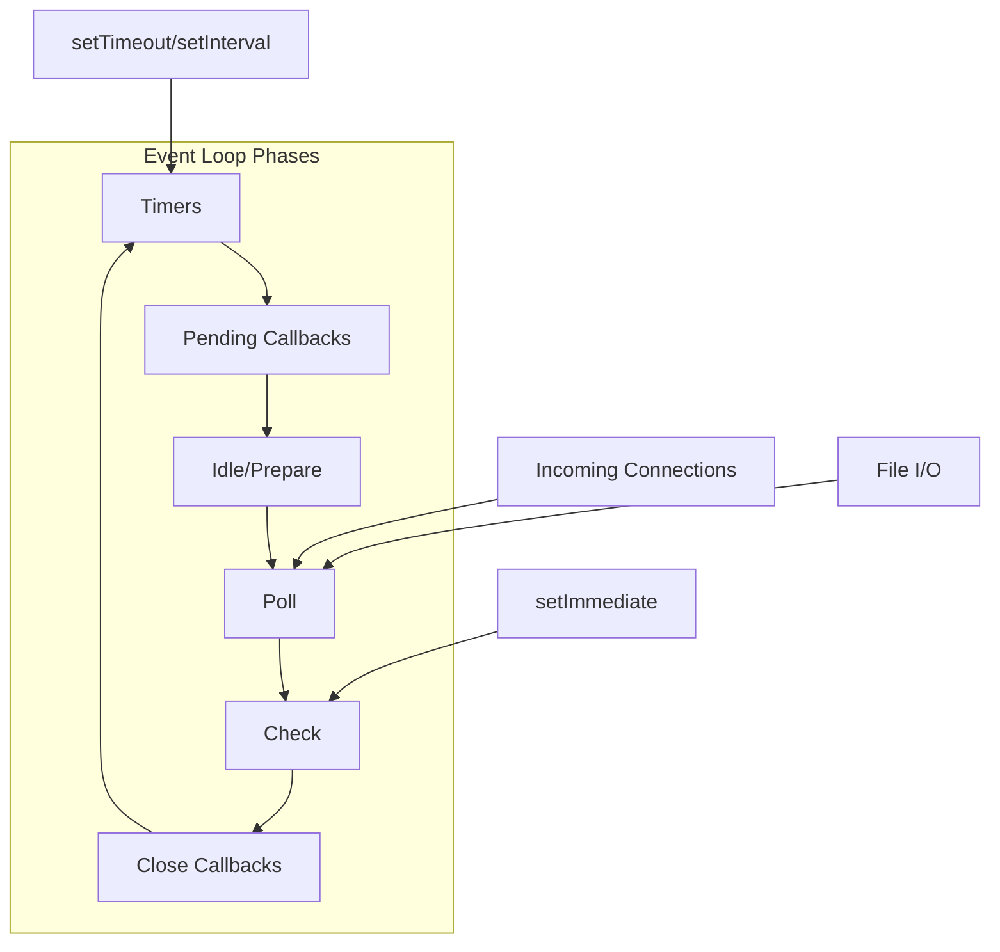
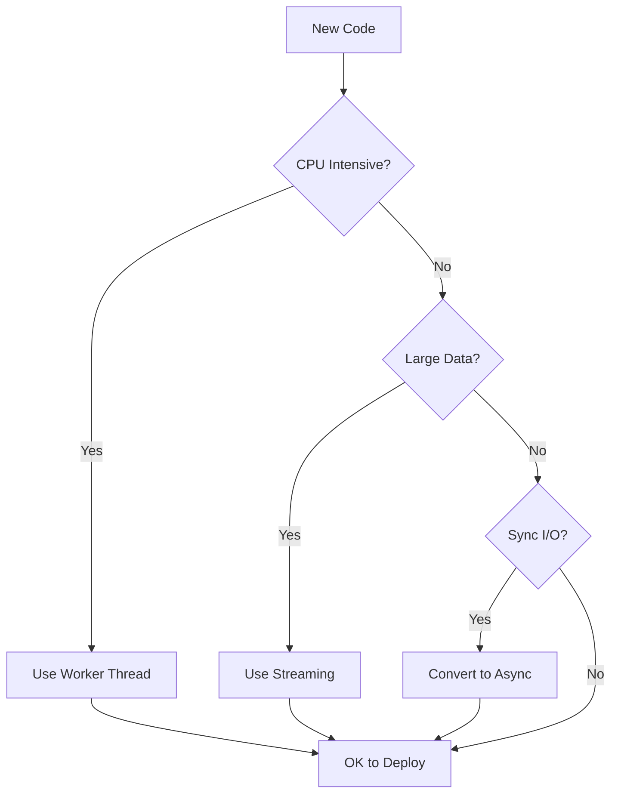

# How to Fix "Event Loop Blocking" Issues

Author: [nawazdhandala](https://www.github.com/nawazdhandala)

Tags: Node.js, JavaScript, Performance, Event Loop, Async, Concurrency

Description: Learn how to identify and fix event loop blocking issues in Node.js applications to maintain responsiveness and performance.

---

The event loop is the heart of Node.js, handling all asynchronous operations. When the event loop gets blocked by long-running synchronous operations, your entire application becomes unresponsive. This guide shows you how to identify and fix these issues.

---

## Understanding the Event Loop



Each iteration of the event loop is called a "tick." If any phase takes too long, incoming requests queue up and response times increase dramatically.

---

## Common Causes of Event Loop Blocking

### 1. CPU-Intensive Operations

```javascript
// blocking-example.js
// BAD: This blocks the event loop

function calculatePrimes(max) {
    const primes = [];
    for (let i = 2; i <= max; i++) {
        let isPrime = true;
        for (let j = 2; j < i; j++) {
            if (i % j === 0) {
                isPrime = false;
                break;
            }
        }
        if (isPrime) primes.push(i);
    }
    return primes;
}

const http = require('http');

const server = http.createServer((req, res) => {
    if (req.url === '/primes') {
        // This blocks for several seconds
        const primes = calculatePrimes(1000000);
        res.end(`Found ${primes.length} primes`);
    } else {
        res.end('Hello World');
    }
});

server.listen(3000);
// While /primes is calculating, ALL other requests are blocked
```

---

### 2. Synchronous File Operations

```javascript
// BAD: Synchronous file operations block the event loop
const fs = require('fs');

function processRequest(req, res) {
    // This blocks while reading the file
    const data = fs.readFileSync('/path/to/large/file.json');
    const parsed = JSON.parse(data);
    res.json(parsed);
}

// GOOD: Use async operations
async function processRequestAsync(req, res) {
    const data = await fs.promises.readFile('/path/to/large/file.json');
    const parsed = JSON.parse(data);
    res.json(parsed);
}
```

---

### 3. Large JSON Operations

```javascript
// BAD: Large JSON parsing blocks the event loop
const hugeData = fs.readFileSync('huge-file.json');

// This single operation can block for seconds
const parsed = JSON.parse(hugeData);  // BLOCKING

// This also blocks
const stringified = JSON.stringify(parsed);  // BLOCKING
```

---

## Detecting Event Loop Blocking

### Using Monitoring Tools

```javascript
// event-loop-monitor.js
const { monitorEventLoopDelay } = require('perf_hooks');

class EventLoopMonitor {
    constructor(options = {}) {
        this.resolution = options.resolution || 10;
        this.threshold = options.threshold || 100;  // 100ms
        this.histogram = monitorEventLoopDelay({ resolution: this.resolution });
        this.isRunning = false;
    }

    start() {
        this.histogram.enable();
        this.isRunning = true;

        // Log stats every 5 seconds
        this.interval = setInterval(() => {
            this.logStats();
        }, 5000);

        console.log('Event loop monitoring started');
    }

    stop() {
        this.histogram.disable();
        clearInterval(this.interval);
        this.isRunning = false;
    }

    logStats() {
        const stats = {
            min: this.histogram.min / 1e6,      // Convert to ms
            max: this.histogram.max / 1e6,
            mean: this.histogram.mean / 1e6,
            p50: this.histogram.percentile(50) / 1e6,
            p99: this.histogram.percentile(99) / 1e6
        };

        console.log('Event Loop Delay Stats (ms):', stats);

        if (stats.max > this.threshold) {
            console.warn(`WARNING: Event loop blocked for ${stats.max.toFixed(2)}ms`);
        }

        // Reset for next interval
        this.histogram.reset();
    }

    getStats() {
        return {
            min: this.histogram.min / 1e6,
            max: this.histogram.max / 1e6,
            mean: this.histogram.mean / 1e6,
            percentiles: {
                50: this.histogram.percentile(50) / 1e6,
                90: this.histogram.percentile(90) / 1e6,
                99: this.histogram.percentile(99) / 1e6
            }
        };
    }
}

// Usage
const monitor = new EventLoopMonitor({ threshold: 50 });
monitor.start();

module.exports = monitor;
```

---

### Using Blocked Detection

```javascript
// blocked-at.js
// Detect and log when the event loop is blocked

let lastCheck = Date.now();
const threshold = 100;  // 100ms

function checkBlocking() {
    const now = Date.now();
    const delta = now - lastCheck;

    if (delta > threshold) {
        console.warn(`Event loop was blocked for ${delta}ms`);

        // Capture stack trace (requires --enable-source-maps)
        const stack = new Error().stack;
        console.warn('Stack trace:', stack);
    }

    lastCheck = now;
    setImmediate(checkBlocking);
}

// Start monitoring
setImmediate(checkBlocking);
```

---

## Solutions for Event Loop Blocking

### 1. Using Worker Threads

```javascript
// worker-threads-solution.js
const { Worker, isMainThread, parentPort, workerData } = require('worker_threads');
const http = require('http');

if (isMainThread) {
    // Main thread - handles HTTP requests

    function runWorker(data) {
        return new Promise((resolve, reject) => {
            const worker = new Worker(__filename, { workerData: data });
            worker.on('message', resolve);
            worker.on('error', reject);
            worker.on('exit', (code) => {
                if (code !== 0) {
                    reject(new Error(`Worker stopped with exit code ${code}`));
                }
            });
        });
    }

    const server = http.createServer(async (req, res) => {
        if (req.url === '/primes') {
            try {
                // Run CPU-intensive work in a worker thread
                const result = await runWorker({ max: 1000000 });
                res.end(`Found ${result.count} primes`);
            } catch (error) {
                res.statusCode = 500;
                res.end('Error processing request');
            }
        } else {
            res.end('Hello World');
        }
    });

    server.listen(3000, () => {
        console.log('Server running on port 3000');
    });

} else {
    // Worker thread - performs CPU-intensive calculation

    function calculatePrimes(max) {
        const primes = [];
        for (let i = 2; i <= max; i++) {
            let isPrime = true;
            for (let j = 2; j * j <= i; j++) {
                if (i % j === 0) {
                    isPrime = false;
                    break;
                }
            }
            if (isPrime) primes.push(i);
        }
        return primes;
    }

    const primes = calculatePrimes(workerData.max);
    parentPort.postMessage({ count: primes.length });
}
```

---

### 2. Breaking Up Work with setImmediate

```javascript
// chunked-processing.js
// Process large arrays without blocking the event loop

async function processArrayInChunks(array, processor, chunkSize = 1000) {
    const results = [];

    for (let i = 0; i < array.length; i += chunkSize) {
        const chunk = array.slice(i, i + chunkSize);

        // Process this chunk
        for (const item of chunk) {
            results.push(processor(item));
        }

        // Yield to the event loop between chunks
        await new Promise(resolve => setImmediate(resolve));
    }

    return results;
}

// Usage example
const largeArray = Array.from({ length: 100000 }, (_, i) => i);

async function main() {
    console.log('Starting processing...');

    const results = await processArrayInChunks(
        largeArray,
        (num) => num * 2,  // Simple processor
        5000               // Process 5000 items per chunk
    );

    console.log(`Processed ${results.length} items`);
}

main();
```

---

### 3. Using a Worker Pool

```javascript
// worker-pool.js
const { Worker } = require('worker_threads');
const os = require('os');

class WorkerPool {
    constructor(workerScript, poolSize = os.cpus().length) {
        this.workerScript = workerScript;
        this.poolSize = poolSize;
        this.workers = [];
        this.freeWorkers = [];
        this.taskQueue = [];

        // Initialize workers
        for (let i = 0; i < poolSize; i++) {
            this.addWorker();
        }
    }

    addWorker() {
        const worker = new Worker(this.workerScript);

        worker.on('message', (result) => {
            // Worker completed task, resolve the promise
            worker.currentResolve(result);
            worker.currentResolve = null;
            worker.currentReject = null;

            // Check for queued tasks
            if (this.taskQueue.length > 0) {
                const { data, resolve, reject } = this.taskQueue.shift();
                this.runTask(worker, data, resolve, reject);
            } else {
                this.freeWorkers.push(worker);
            }
        });

        worker.on('error', (error) => {
            if (worker.currentReject) {
                worker.currentReject(error);
            }
            // Replace the failed worker
            this.workers = this.workers.filter(w => w !== worker);
            this.addWorker();
        });

        this.workers.push(worker);
        this.freeWorkers.push(worker);
    }

    runTask(worker, data, resolve, reject) {
        worker.currentResolve = resolve;
        worker.currentReject = reject;
        worker.postMessage(data);
    }

    execute(data) {
        return new Promise((resolve, reject) => {
            if (this.freeWorkers.length > 0) {
                const worker = this.freeWorkers.pop();
                this.runTask(worker, data, resolve, reject);
            } else {
                // Queue the task
                this.taskQueue.push({ data, resolve, reject });
            }
        });
    }

    async shutdown() {
        for (const worker of this.workers) {
            await worker.terminate();
        }
        this.workers = [];
        this.freeWorkers = [];
    }
}

// Usage
const pool = new WorkerPool('./heavy-computation-worker.js', 4);

// Execute multiple tasks concurrently
async function processMultipleTasks() {
    const tasks = Array.from({ length: 10 }, (_, i) =>
        pool.execute({ taskId: i, data: Math.random() * 1000000 })
    );

    const results = await Promise.all(tasks);
    console.log('All tasks completed:', results);
}

processMultipleTasks();
```

---

### 4. Streaming Large JSON

```javascript
// streaming-json.js
const { createReadStream } = require('fs');
const { pipeline } = require('stream/promises');
const JSONStream = require('JSONStream');

// BAD: Loading entire file into memory
async function processLargeJsonBad(filePath) {
    const data = require(filePath);  // Blocks and uses lots of memory
    return data.items.map(item => transform(item));
}

// GOOD: Stream processing
async function processLargeJsonGood(filePath) {
    const results = [];

    const readStream = createReadStream(filePath);
    const jsonParser = JSONStream.parse('items.*');

    jsonParser.on('data', (item) => {
        results.push(transform(item));
    });

    await pipeline(readStream, jsonParser);

    return results;
}

function transform(item) {
    return { ...item, processed: true };
}

// Even better: Use a transform stream
const { Transform } = require('stream');

class ItemTransformer extends Transform {
    constructor() {
        super({ objectMode: true });
    }

    _transform(item, encoding, callback) {
        // Transform each item
        const transformed = { ...item, processed: true };
        this.push(transformed);
        callback();
    }
}

async function processWithTransformStream(filePath, outputPath) {
    const readStream = createReadStream(filePath);
    const jsonParser = JSONStream.parse('items.*');
    const transformer = new ItemTransformer();
    const jsonStringify = JSONStream.stringify();
    const writeStream = createWriteStream(outputPath);

    await pipeline(
        readStream,
        jsonParser,
        transformer,
        jsonStringify,
        writeStream
    );
}
```

---

## Event Loop Blocking Prevention Checklist



---

## Monitoring in Production

```javascript
// production-monitoring.js
const { monitorEventLoopDelay } = require('perf_hooks');
const http = require('http');

// Create histogram for event loop monitoring
const histogram = monitorEventLoopDelay({ resolution: 10 });
histogram.enable();

// Expose metrics endpoint
const metricsServer = http.createServer((req, res) => {
    if (req.url === '/metrics') {
        const metrics = {
            event_loop_delay_min_ms: histogram.min / 1e6,
            event_loop_delay_max_ms: histogram.max / 1e6,
            event_loop_delay_mean_ms: histogram.mean / 1e6,
            event_loop_delay_p50_ms: histogram.percentile(50) / 1e6,
            event_loop_delay_p99_ms: histogram.percentile(99) / 1e6,
            memory_usage: process.memoryUsage(),
            uptime: process.uptime()
        };

        res.setHeader('Content-Type', 'application/json');
        res.end(JSON.stringify(metrics, null, 2));

        // Reset histogram after reading
        histogram.reset();
    } else {
        res.statusCode = 404;
        res.end('Not found');
    }
});

metricsServer.listen(9090, () => {
    console.log('Metrics available at http://localhost:9090/metrics');
});
```

---

## Summary

Event loop blocking issues occur when synchronous operations take too long, preventing Node.js from handling other requests. To fix these issues:

1. **Identify blocking code** using event loop monitoring tools
2. **Move CPU-intensive work** to worker threads
3. **Use async I/O** instead of sync operations
4. **Stream large data** instead of loading it all into memory
5. **Break up large loops** with setImmediate
6. **Monitor in production** to catch issues early

The key principle is simple: keep synchronous code fast, and move slow operations off the main thread.

---

*Keep your Node.js applications responsive with [OneUptime](https://oneuptime.com). Monitor event loop latency, track worker thread health, and get alerted when blocking issues occur in production.*
