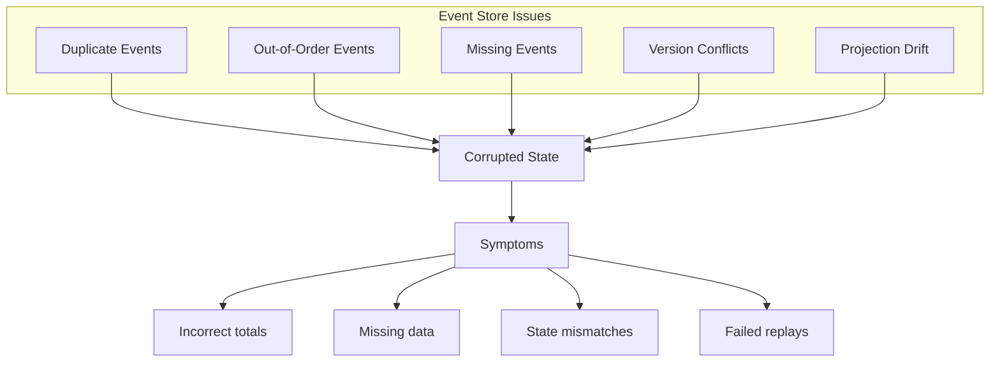
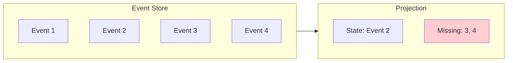

# How to Fix 'Event Store' Consistency Issues

Author: [nawazdhandala](https://www.github.com/nawazdhandala)

Tags: Event Sourcing, Event Store, Consistency, CQRS, Distributed Systems, Data Integrity, Python

Description: Learn how to diagnose and fix common event store consistency issues including ordering problems, duplicate events, and projection drift in event-sourced systems.

---

> Event stores are the backbone of event-sourced systems, but consistency issues can lead to corrupted state, lost data, and incorrect projections. This guide shows you how to identify, prevent, and fix common event store problems.

Event sourcing stores all changes as an immutable sequence of events. When this sequence becomes corrupted or inconsistent, it can cascade into serious application issues.

---

## Common Event Store Consistency Issues



---

## Issue 1: Duplicate Events

### Detection

```python
# duplicate_detection.py
from typing import List, Dict, Set
from dataclasses import dataclass
from collections import defaultdict


@dataclass
class EventRecord:
    event_id: str
    aggregate_id: str
    sequence_number: int
    event_type: str
    data: dict
    timestamp: str


class DuplicateEventDetector:
    """Detect duplicate events in event store"""

    def __init__(self, event_store):
        self.event_store = event_store

    def find_duplicates_by_id(self, aggregate_id: str = None) -> List[Dict]:
        """Find events with duplicate event_ids"""
        duplicates = []
        seen_ids: Set[str] = set()

        events = (
            self.event_store.get_events(aggregate_id)
            if aggregate_id
            else self.event_store.get_all_events()
        )

        for event in events:
            if event.event_id in seen_ids:
                duplicates.append({
                    "event_id": event.event_id,
                    "aggregate_id": event.aggregate_id,
                    "sequence": event.sequence_number
                })
            seen_ids.add(event.event_id)

        return duplicates

    def find_duplicates_by_sequence(self, aggregate_id: str) -> List[Dict]:
        """Find events with duplicate sequence numbers for same aggregate"""
        events = self.event_store.get_events(aggregate_id)
        seen_sequences: Dict[int, EventRecord] = {}
        duplicates = []

        for event in events:
            if event.sequence_number in seen_sequences:
                duplicates.append({
                    "sequence": event.sequence_number,
                    "original": seen_sequences[event.sequence_number].event_id,
                    "duplicate": event.event_id
                })
            else:
                seen_sequences[event.sequence_number] = event

        return duplicates

    def find_content_duplicates(self, aggregate_id: str, time_window_seconds: int = 5) -> List[Dict]:
        """Find events with identical content within time window"""
        events = self.event_store.get_events(aggregate_id)
        content_hashes: Dict[str, List[EventRecord]] = defaultdict(list)
        duplicates = []

        for event in events:
            # Create content hash
            content = f"{event.event_type}:{str(event.data)}"
            content_hash = hash(content)

            for prev in content_hashes[content_hash]:
                time_diff = abs(
                    (event.timestamp - prev.timestamp).total_seconds()
                )
                if time_diff < time_window_seconds:
                    duplicates.append({
                        "event1": prev.event_id,
                        "event2": event.event_id,
                        "time_diff_seconds": time_diff
                    })

            content_hashes[content_hash].append(event)

        return duplicates


# Run detection
detector = DuplicateEventDetector(event_store)
id_duplicates = detector.find_duplicates_by_id()
sequence_duplicates = detector.find_duplicates_by_sequence("order-123")

if id_duplicates:
    print(f"Found {len(id_duplicates)} duplicate event IDs")
if sequence_duplicates:
    print(f"Found {len(sequence_duplicates)} duplicate sequences")
```

### Prevention

```python
# idempotent_event_store.py
import hashlib
import json
from typing import Optional


class IdempotentEventStore:
    """Event store with built-in duplicate prevention"""

    def __init__(self, underlying_store, dedup_cache):
        self.store = underlying_store
        self.dedup_cache = dedup_cache  # Redis or similar

    def append_event(
        self,
        aggregate_id: str,
        event: DomainEvent,
        expected_version: int,
        idempotency_key: Optional[str] = None
    ):
        """Append event with idempotency check"""

        # Generate idempotency key if not provided
        if idempotency_key is None:
            idempotency_key = event.event_id

        # Check if already processed
        if self._is_duplicate(idempotency_key):
            # Return existing result
            return self._get_cached_result(idempotency_key)

        try:
            # Optimistic locking on version
            current_version = self.store.get_current_version(aggregate_id)

            if current_version != expected_version:
                raise ConcurrencyException(
                    f"Expected version {expected_version}, got {current_version}"
                )

            # Append event
            result = self.store.append(aggregate_id, event, expected_version + 1)

            # Cache result
            self._cache_result(idempotency_key, result)

            return result

        except ConcurrencyException:
            raise
        except Exception as e:
            # Don't cache failures
            raise

    def _is_duplicate(self, idempotency_key: str) -> bool:
        """Check if event was already processed"""
        return self.dedup_cache.exists(f"event:processed:{idempotency_key}")

    def _cache_result(self, idempotency_key: str, result):
        """Cache successful result"""
        self.dedup_cache.set(
            f"event:processed:{idempotency_key}",
            json.dumps(result),
            ex=86400  # 24 hour TTL
        )

    def _get_cached_result(self, idempotency_key: str):
        """Get cached result for duplicate request"""
        cached = self.dedup_cache.get(f"event:processed:{idempotency_key}")
        return json.loads(cached) if cached else None


class ConcurrencyException(Exception):
    """Raised when optimistic locking fails"""
    pass
```

### Remediation

```python
# duplicate_remediation.py
from typing import List
import logging

logger = logging.getLogger(__name__)


class DuplicateRemediator:
    """Remove duplicate events and repair projections"""

    def __init__(self, event_store, projection_manager):
        self.event_store = event_store
        self.projection_manager = projection_manager

    def remove_duplicate_events(
        self,
        aggregate_id: str,
        dry_run: bool = True
    ) -> List[Dict]:
        """Remove duplicate events keeping the first occurrence"""

        events = self.event_store.get_events(aggregate_id)
        seen_sequences = {}
        to_remove = []

        for event in events:
            if event.sequence_number in seen_sequences:
                to_remove.append({
                    "event_id": event.event_id,
                    "sequence": event.sequence_number,
                    "reason": "duplicate_sequence"
                })
            else:
                seen_sequences[event.sequence_number] = event

        if dry_run:
            logger.info(f"Would remove {len(to_remove)} duplicate events")
            return to_remove

        # Actually remove duplicates
        for event_info in to_remove:
            self.event_store.mark_event_deleted(event_info["event_id"])
            logger.warning(f"Removed duplicate event: {event_info['event_id']}")

        # Rebuild projections
        self._rebuild_projections(aggregate_id)

        return to_remove

    def _rebuild_projections(self, aggregate_id: str):
        """Rebuild all projections for an aggregate"""
        events = self.event_store.get_events(aggregate_id)
        self.projection_manager.rebuild_for_aggregate(aggregate_id, events)
```

---

## Issue 2: Out-of-Order Events

### Detection

```python
# order_detection.py
from typing import List, Tuple


class EventOrderValidator:
    """Validate event ordering in event store"""

    def __init__(self, event_store):
        self.event_store = event_store

    def find_out_of_order_events(self, aggregate_id: str) -> List[Dict]:
        """Find events that are out of sequence order"""

        events = self.event_store.get_events(aggregate_id)
        issues = []

        for i in range(1, len(events)):
            prev = events[i - 1]
            curr = events[i]

            # Check sequence continuity
            if curr.sequence_number != prev.sequence_number + 1:
                issues.append({
                    "type": "sequence_gap",
                    "expected": prev.sequence_number + 1,
                    "actual": curr.sequence_number,
                    "event_id": curr.event_id
                })

            # Check timestamp ordering
            if curr.timestamp < prev.timestamp:
                issues.append({
                    "type": "timestamp_reversal",
                    "prev_timestamp": prev.timestamp,
                    "curr_timestamp": curr.timestamp,
                    "event_id": curr.event_id
                })

        return issues

    def find_global_ordering_issues(self) -> List[Dict]:
        """Find global ordering issues across all aggregates"""

        all_events = self.event_store.get_all_events_ordered_by_global_sequence()
        issues = []

        for i in range(1, len(all_events)):
            prev = all_events[i - 1]
            curr = all_events[i]

            if curr.global_sequence != prev.global_sequence + 1:
                issues.append({
                    "type": "global_sequence_gap",
                    "expected": prev.global_sequence + 1,
                    "actual": curr.global_sequence,
                    "event_id": curr.event_id
                })

        return issues


# Run validation
validator = EventOrderValidator(event_store)
for aggregate_id in get_all_aggregate_ids():
    issues = validator.find_out_of_order_events(aggregate_id)
    if issues:
        print(f"Aggregate {aggregate_id}: {len(issues)} ordering issues")
```

### Prevention

```python
# ordered_event_store.py
import threading
from datetime import datetime


class OrderedEventStore:
    """Event store that guarantees ordering"""

    def __init__(self, underlying_store):
        self.store = underlying_store
        self._locks = {}  # Per-aggregate locks
        self._global_lock = threading.Lock()
        self._global_sequence = self._get_max_global_sequence()

    def append_event(
        self,
        aggregate_id: str,
        event: DomainEvent,
        expected_version: int
    ):
        """Append event with strict ordering guarantees"""

        # Get or create per-aggregate lock
        lock = self._get_aggregate_lock(aggregate_id)

        with lock:
            # Verify expected version
            current_version = self.store.get_current_version(aggregate_id)

            if current_version != expected_version:
                raise ConcurrencyException(
                    f"Version mismatch: expected {expected_version}, got {current_version}"
                )

            # Assign global sequence
            with self._global_lock:
                self._global_sequence += 1
                global_seq = self._global_sequence

            # Set event metadata
            event.sequence_number = expected_version + 1
            event.global_sequence = global_seq
            event.timestamp = datetime.utcnow()

            # Persist
            self.store.append(aggregate_id, event)

    def _get_aggregate_lock(self, aggregate_id: str) -> threading.Lock:
        """Get or create lock for aggregate"""
        if aggregate_id not in self._locks:
            with self._global_lock:
                if aggregate_id not in self._locks:
                    self._locks[aggregate_id] = threading.Lock()
        return self._locks[aggregate_id]

    def _get_max_global_sequence(self) -> int:
        """Get the maximum global sequence number"""
        return self.store.get_max_global_sequence() or 0
```

### Remediation

```python
# order_remediation.py
class EventOrderRemediator:
    """Fix event ordering issues"""

    def __init__(self, event_store, backup_store):
        self.event_store = event_store
        self.backup_store = backup_store

    def reorder_events(self, aggregate_id: str, dry_run: bool = True) -> Dict:
        """Reorder events by timestamp while preserving data"""

        events = self.event_store.get_events(aggregate_id)

        # Sort by timestamp
        sorted_events = sorted(events, key=lambda e: e.timestamp)

        # Check if reordering is needed
        needs_reorder = events != sorted_events

        if not needs_reorder:
            return {"status": "no_reorder_needed"}

        if dry_run:
            return {
                "status": "would_reorder",
                "original_order": [e.event_id for e in events],
                "new_order": [e.event_id for e in sorted_events]
            }

        # Backup original events
        self.backup_store.backup_events(aggregate_id, events)

        # Reassign sequence numbers
        for i, event in enumerate(sorted_events):
            event.sequence_number = i + 1

        # Replace events (atomic operation)
        self.event_store.replace_events(aggregate_id, sorted_events)

        return {
            "status": "reordered",
            "events_affected": len(sorted_events)
        }

    def fill_sequence_gaps(self, aggregate_id: str) -> Dict:
        """Fill gaps in sequence numbers by reindexing"""

        events = self.event_store.get_events(aggregate_id)

        # Check for gaps
        sequences = [e.sequence_number for e in events]
        expected = list(range(1, len(events) + 1))

        if sequences == expected:
            return {"status": "no_gaps"}

        # Reindex
        for i, event in enumerate(events):
            event.sequence_number = i + 1

        self.event_store.replace_events(aggregate_id, events)

        return {
            "status": "reindexed",
            "old_sequences": sequences,
            "new_sequences": expected
        }
```

---

## Issue 3: Projection Drift



### Detection

```python
# projection_drift_detector.py
from typing import Dict, List
from dataclasses import dataclass


@dataclass
class ProjectionState:
    projection_name: str
    last_processed_sequence: int
    last_processed_timestamp: str


class ProjectionDriftDetector:
    """Detect drift between event store and projections"""

    def __init__(self, event_store, projection_tracker):
        self.event_store = event_store
        self.projection_tracker = projection_tracker

    def detect_drift(self) -> List[Dict]:
        """Detect all projection drift issues"""

        drift_issues = []
        current_global_seq = self.event_store.get_max_global_sequence()

        for projection in self.projection_tracker.get_all_projections():
            state = self.projection_tracker.get_state(projection.name)

            lag = current_global_seq - state.last_processed_sequence

            if lag > 0:
                drift_issues.append({
                    "projection": projection.name,
                    "current_sequence": current_global_seq,
                    "projection_sequence": state.last_processed_sequence,
                    "lag": lag,
                    "severity": self._calculate_severity(lag)
                })

        return drift_issues

    def _calculate_severity(self, lag: int) -> str:
        if lag > 10000:
            return "critical"
        elif lag > 1000:
            return "high"
        elif lag > 100:
            return "medium"
        return "low"

    def verify_projection_accuracy(
        self,
        projection_name: str,
        aggregate_id: str
    ) -> Dict:
        """Verify projection matches event replay"""

        # Get current projection state
        current_state = self.projection_tracker.get_aggregate_state(
            projection_name, aggregate_id
        )

        # Replay events to get expected state
        events = self.event_store.get_events(aggregate_id)
        expected_state = self._replay_events(projection_name, events)

        # Compare
        differences = self._find_differences(current_state, expected_state)

        return {
            "projection": projection_name,
            "aggregate_id": aggregate_id,
            "is_accurate": len(differences) == 0,
            "differences": differences
        }

    def _replay_events(self, projection_name: str, events: List) -> Dict:
        """Replay events to compute expected state"""
        projection = self.projection_tracker.get_projection(projection_name)
        state = {}

        for event in events:
            state = projection.apply(state, event)

        return state

    def _find_differences(self, actual: Dict, expected: Dict) -> List[Dict]:
        """Find differences between actual and expected state"""
        differences = []

        all_keys = set(actual.keys()) | set(expected.keys())

        for key in all_keys:
            actual_val = actual.get(key)
            expected_val = expected.get(key)

            if actual_val != expected_val:
                differences.append({
                    "field": key,
                    "actual": actual_val,
                    "expected": expected_val
                })

        return differences
```

### Prevention

```python
# reliable_projection_processor.py
import time
import threading
from typing import Optional


class ReliableProjectionProcessor:
    """Projection processor with exactly-once semantics"""

    def __init__(
        self,
        event_store,
        projection,
        checkpoint_store,
        batch_size: int = 100
    ):
        self.event_store = event_store
        self.projection = projection
        self.checkpoint_store = checkpoint_store
        self.batch_size = batch_size
        self._running = False
        self._thread: Optional[threading.Thread] = None

    def start(self):
        """Start the projection processor"""
        self._running = True
        self._thread = threading.Thread(target=self._process_loop, daemon=True)
        self._thread.start()

    def stop(self):
        """Stop the projection processor"""
        self._running = False
        if self._thread:
            self._thread.join()

    def _process_loop(self):
        """Main processing loop"""
        while self._running:
            try:
                processed = self._process_batch()
                if processed == 0:
                    # No events to process, wait
                    time.sleep(0.1)
            except Exception as e:
                # Log error but continue
                print(f"Projection error: {e}")
                time.sleep(1)

    def _process_batch(self) -> int:
        """Process a batch of events"""

        # Get last processed position
        last_sequence = self.checkpoint_store.get_checkpoint(
            self.projection.name
        ) or 0

        # Fetch next batch
        events = self.event_store.get_events_after(
            last_sequence,
            limit=self.batch_size
        )

        if not events:
            return 0

        # Process events in transaction
        for event in events:
            # Skip if already processed (idempotency)
            if self._is_processed(event):
                continue

            try:
                # Apply event to projection
                self.projection.handle(event)

                # Update checkpoint
                self.checkpoint_store.set_checkpoint(
                    self.projection.name,
                    event.global_sequence
                )

                # Mark as processed
                self._mark_processed(event)

            except Exception as e:
                # Log and continue to next event
                self._handle_failed_event(event, e)

        return len(events)

    def _is_processed(self, event) -> bool:
        """Check if event was already processed"""
        return self.checkpoint_store.is_event_processed(
            self.projection.name,
            event.event_id
        )

    def _mark_processed(self, event):
        """Mark event as processed"""
        self.checkpoint_store.mark_event_processed(
            self.projection.name,
            event.event_id
        )

    def _handle_failed_event(self, event, error):
        """Handle event that failed processing"""
        # Could write to dead letter queue or alert
        print(f"Failed to process event {event.event_id}: {error}")
```

### Remediation

```python
# projection_rebuild.py
from datetime import datetime
import logging

logger = logging.getLogger(__name__)


class ProjectionRebuilder:
    """Rebuild projections from event store"""

    def __init__(self, event_store, projection_registry, checkpoint_store):
        self.event_store = event_store
        self.projection_registry = projection_registry
        self.checkpoint_store = checkpoint_store

    def rebuild_projection(
        self,
        projection_name: str,
        from_sequence: int = 0,
        batch_size: int = 1000
    ) -> Dict:
        """Rebuild a single projection from scratch"""

        logger.info(f"Starting rebuild of projection: {projection_name}")
        start_time = datetime.utcnow()

        projection = self.projection_registry.get(projection_name)

        # Clear existing data
        projection.clear()

        # Reset checkpoint
        self.checkpoint_store.set_checkpoint(projection_name, from_sequence)

        # Process all events
        processed = 0
        current_seq = from_sequence

        while True:
            events = self.event_store.get_events_after(
                current_seq,
                limit=batch_size
            )

            if not events:
                break

            for event in events:
                projection.handle(event)
                current_seq = event.global_sequence
                processed += 1

                if processed % 10000 == 0:
                    logger.info(f"Processed {processed} events")

            # Update checkpoint periodically
            self.checkpoint_store.set_checkpoint(projection_name, current_seq)

        duration = (datetime.utcnow() - start_time).total_seconds()

        logger.info(
            f"Rebuild complete: {processed} events in {duration:.2f}s"
        )

        return {
            "projection": projection_name,
            "events_processed": processed,
            "duration_seconds": duration,
            "final_sequence": current_seq
        }

    def rebuild_all_projections(self) -> List[Dict]:
        """Rebuild all projections"""
        results = []

        for projection in self.projection_registry.get_all():
            result = self.rebuild_projection(projection.name)
            results.append(result)

        return results

    def rebuild_aggregate_in_projection(
        self,
        projection_name: str,
        aggregate_id: str
    ) -> Dict:
        """Rebuild single aggregate in a projection"""

        projection = self.projection_registry.get(projection_name)

        # Clear aggregate state in projection
        projection.clear_aggregate(aggregate_id)

        # Replay aggregate events
        events = self.event_store.get_events(aggregate_id)

        for event in events:
            projection.handle(event)

        return {
            "projection": projection_name,
            "aggregate_id": aggregate_id,
            "events_replayed": len(events)
        }
```

---

## Issue 4: Version Conflicts

### Detection and Resolution

```python
# version_conflict_handler.py
from typing import Callable, TypeVar, Optional
import time

T = TypeVar('T')


class OptimisticLockException(Exception):
    """Raised when optimistic lock fails"""
    def __init__(self, aggregate_id: str, expected: int, actual: int):
        self.aggregate_id = aggregate_id
        self.expected_version = expected
        self.actual_version = actual
        super().__init__(
            f"Version conflict for {aggregate_id}: "
            f"expected {expected}, got {actual}"
        )


class VersionConflictResolver:
    """Handle version conflicts with retry logic"""

    def __init__(
        self,
        event_store,
        max_retries: int = 3,
        base_delay: float = 0.1
    ):
        self.event_store = event_store
        self.max_retries = max_retries
        self.base_delay = base_delay

    def execute_with_retry(
        self,
        aggregate_id: str,
        operation: Callable[[T, int], None],
        aggregate_loader: Callable[[str], T]
    ) -> T:
        """Execute operation with automatic retry on version conflict"""

        last_error = None

        for attempt in range(self.max_retries):
            try:
                # Load current state
                aggregate = aggregate_loader(aggregate_id)
                current_version = self.event_store.get_current_version(aggregate_id)

                # Execute operation
                operation(aggregate, current_version)

                # Get and save events
                events = aggregate.get_uncommitted_events()
                self.event_store.append_events(
                    aggregate_id,
                    events,
                    expected_version=current_version
                )

                aggregate.clear_events()
                return aggregate

            except OptimisticLockException as e:
                last_error = e
                # Exponential backoff
                delay = self.base_delay * (2 ** attempt)
                time.sleep(delay)
                continue

        # All retries exhausted
        raise last_error

    def merge_concurrent_changes(
        self,
        aggregate_id: str,
        local_events: list,
        expected_version: int
    ) -> list:
        """Attempt to merge concurrent changes"""

        # Get events that happened since expected version
        current_version = self.event_store.get_current_version(aggregate_id)

        if current_version == expected_version:
            # No conflict
            return local_events

        concurrent_events = self.event_store.get_events_since(
            aggregate_id,
            expected_version
        )

        # Check for conflicts
        conflicts = self._detect_conflicts(local_events, concurrent_events)

        if conflicts:
            raise UnresolvableConflictException(
                aggregate_id,
                conflicts
            )

        # No conflicts - rebase local events
        rebased_events = self._rebase_events(
            local_events,
            current_version
        )

        return rebased_events

    def _detect_conflicts(self, local: list, concurrent: list) -> list:
        """Detect conflicting changes"""
        conflicts = []

        # Example: detect if same field modified
        local_fields = self._get_modified_fields(local)
        concurrent_fields = self._get_modified_fields(concurrent)

        overlap = local_fields & concurrent_fields
        if overlap:
            conflicts.append({
                "type": "field_conflict",
                "fields": list(overlap)
            })

        return conflicts

    def _get_modified_fields(self, events: list) -> set:
        """Extract fields modified by events"""
        fields = set()
        for event in events:
            fields.update(event.modified_fields or [])
        return fields

    def _rebase_events(self, events: list, new_base_version: int) -> list:
        """Rebase events to new version"""
        rebased = []
        for i, event in enumerate(events):
            event.version = new_base_version + i + 1
            rebased.append(event)
        return rebased


class UnresolvableConflictException(Exception):
    """Raised when concurrent changes cannot be merged"""
    pass
```

---

## Monitoring and Health Checks

```python
# event_store_health.py
from prometheus_client import Gauge, Counter, Histogram
from datetime import datetime
import threading


class EventStoreHealthMonitor:
    """Monitor event store health and consistency"""

    def __init__(self, event_store, projection_tracker):
        self.event_store = event_store
        self.projection_tracker = projection_tracker

        # Prometheus metrics
        self.event_count = Gauge(
            'event_store_total_events',
            'Total number of events'
        )

        self.projection_lag = Gauge(
            'projection_lag_events',
            'Number of events behind for projection',
            ['projection']
        )

        self.consistency_errors = Counter(
            'event_store_consistency_errors',
            'Number of consistency errors detected',
            ['error_type']
        )

        self.health_check_duration = Histogram(
            'event_store_health_check_duration_seconds',
            'Time to run health check'
        )

    def run_health_check(self) -> Dict:
        """Run comprehensive health check"""
        start = datetime.utcnow()
        issues = []

        # Check event store
        try:
            event_count = self.event_store.get_event_count()
            self.event_count.set(event_count)
        except Exception as e:
            issues.append({
                "component": "event_store",
                "error": str(e)
            })

        # Check projections
        drift_detector = ProjectionDriftDetector(
            self.event_store,
            self.projection_tracker
        )
        drift_issues = drift_detector.detect_drift()

        for drift in drift_issues:
            self.projection_lag.labels(
                projection=drift["projection"]
            ).set(drift["lag"])

            if drift["severity"] in ["high", "critical"]:
                issues.append({
                    "component": "projection",
                    "projection": drift["projection"],
                    "lag": drift["lag"],
                    "severity": drift["severity"]
                })

        # Check for ordering issues (sample)
        order_validator = EventOrderValidator(self.event_store)
        sample_aggregates = self.event_store.get_recent_aggregate_ids(limit=100)

        for agg_id in sample_aggregates:
            order_issues = order_validator.find_out_of_order_events(agg_id)
            if order_issues:
                self.consistency_errors.labels(error_type="ordering").inc()
                issues.append({
                    "component": "ordering",
                    "aggregate_id": agg_id,
                    "issues": order_issues
                })

        duration = (datetime.utcnow() - start).total_seconds()
        self.health_check_duration.observe(duration)

        return {
            "healthy": len(issues) == 0,
            "issues": issues,
            "duration_seconds": duration,
            "event_count": event_count,
            "checked_at": datetime.utcnow().isoformat()
        }


# FastAPI health endpoint
@app.get("/health/event-store")
async def event_store_health():
    """Event store health check endpoint"""
    monitor = EventStoreHealthMonitor(event_store, projection_tracker)
    health = monitor.run_health_check()

    status_code = 200 if health["healthy"] else 503
    return JSONResponse(content=health, status_code=status_code)
```

---

## Best Practices

### 1. Always Use Idempotency Keys

```python
# For every command that creates events
command = CreateOrderCommand(
    idempotency_key=f"order:{customer_id}:{request_id}",
    customer_id=customer_id,
    items=items
)
```

### 2. Implement Event Versioning

```python
# Version your event schemas
class OrderCreatedEventV1:
    schema_version = 1
    # Original fields

class OrderCreatedEventV2:
    schema_version = 2
    # Added fields with defaults for backwards compatibility

def deserialize_event(data: dict):
    version = data.get("schema_version", 1)
    if version == 1:
        return migrate_v1_to_v2(OrderCreatedEventV1(**data))
    return OrderCreatedEventV2(**data)
```

### 3. Regular Consistency Audits

```python
# Run periodic consistency checks
@scheduler.scheduled_job('cron', hour=3)  # 3 AM daily
def nightly_consistency_check():
    results = consistency_auditor.run_full_audit()
    if results["issues"]:
        alert_team(results)
```

---

## Conclusion

Event store consistency is critical for event-sourced systems. Key strategies:

- **Prevent duplicates**: Use idempotency keys and deduplication
- **Ensure ordering**: Use proper locking and sequence validation
- **Monitor projections**: Track lag and accuracy
- **Handle conflicts**: Implement optimistic locking with retry
- **Regular audits**: Run consistency checks proactively

With proper monitoring and remediation tools, you can maintain a healthy event store.

---

*Need real-time monitoring for your event-sourced systems? [OneUptime](https://oneuptime.com) provides comprehensive observability with custom metrics, alerting, and distributed tracing.*
