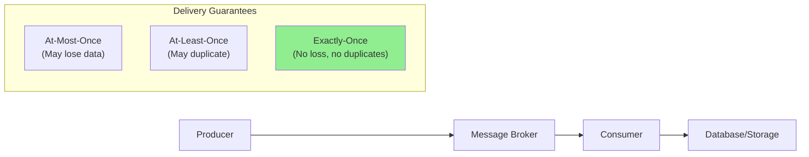

# How to Fix "Exactly-Once" Semantics in Streaming

Author: [nawazdhandala](https://www.github.com/nawazdhandala)

Tags: Streaming, Apache Kafka, Apache Flink, Exactly-Once, Data Processing, Event Streaming, Distributed Systems

Description: Learn how to implement and fix exactly-once semantics in streaming systems using Kafka, Flink, and transactional patterns for reliable data processing.

---

> Exactly-once processing is the holy grail of stream processing. Getting it wrong means duplicate records, inconsistent aggregations, or lost data. This guide shows you how to implement and troubleshoot exactly-once semantics in production streaming systems.

Duplicate processing costs money and breaks trust. Let's fix it properly.

---

## Understanding Exactly-Once Semantics

Before diving into fixes, let's understand what exactly-once actually means in distributed streaming systems.



Exactly-once means each record is processed exactly one time, with its effects appearing exactly once in the output. This requires coordination between producers, brokers, and consumers.

---

## Common Causes of Exactly-Once Failures

### 1. Producer Retries Without Idempotence

When a producer retries after a network timeout, it may send duplicate messages:

```python
# Problem: Non-idempotent producer creates duplicates on retry
from kafka import KafkaProducer

# This producer will create duplicates if retries happen
producer = KafkaProducer(
    bootstrap_servers=['localhost:9092'],
    retries=3,  # Retries enabled
    # Missing: enable_idempotence=True
)

# If this send times out but actually succeeds, retry creates duplicate
producer.send('orders', value=b'order-123')
```

### 2. Consumer Offset Commit Race Conditions

The most common issue occurs when processing and offset commits are not atomic:

```python
# Problem: Processing may complete but offset commit fails
from kafka import KafkaConsumer

consumer = KafkaConsumer(
    'orders',
    bootstrap_servers=['localhost:9092'],
    enable_auto_commit=True,  # Dangerous for exactly-once
    auto_commit_interval_ms=5000
)

for message in consumer:
    process_order(message.value)  # This completes
    # Auto-commit happens later - if crash here, reprocessing occurs
```

### 3. Non-Transactional Sink Writes

Writing to external systems without transactions breaks exactly-once:

```python
# Problem: Database write and offset commit are separate operations
def process_message(message):
    # Write to database
    db.execute("INSERT INTO orders VALUES (?)", message.value)

    # If crash happens here, message is processed but offset not committed
    # On restart, the same message will be processed again
    consumer.commit()
```

---

## Fix 1: Enable Idempotent Producers in Kafka

Idempotent producers prevent duplicates at the broker level:

```python
# Solution: Enable idempotent producer
from kafka import KafkaProducer
import json

producer = KafkaProducer(
    bootstrap_servers=['localhost:9092'],
    # Enable idempotence - broker deduplicates based on producer ID and sequence
    enable_idempotence=True,
    # Required settings for idempotence
    acks='all',  # Wait for all replicas to acknowledge
    retries=5,   # Allow retries (broker handles deduplication)
    max_in_flight_requests_per_connection=5,  # Max 5 for idempotence
    value_serializer=lambda v: json.dumps(v).encode('utf-8')
)

def send_order(order_id, order_data):
    """Send order with exactly-once guarantee at producer level"""
    future = producer.send(
        'orders',
        key=order_id.encode('utf-8'),
        value=order_data
    )
    # Block until acknowledged to catch errors
    record_metadata = future.get(timeout=10)
    return record_metadata
```

---

## Fix 2: Implement Kafka Transactions

For end-to-end exactly-once, use Kafka transactions that atomically commit offsets and produce messages:

```python
# Solution: Transactional producer-consumer pattern
from kafka import KafkaProducer, KafkaConsumer
from kafka.errors import KafkaError
import json

class ExactlyOnceProcessor:
    def __init__(self, input_topic, output_topic, group_id):
        # Transactional producer with unique transaction ID
        self.producer = KafkaProducer(
            bootstrap_servers=['localhost:9092'],
            transactional_id=f'{group_id}-processor',  # Unique per instance
            enable_idempotence=True,
            acks='all',
            value_serializer=lambda v: json.dumps(v).encode('utf-8')
        )

        # Consumer with manual offset management
        self.consumer = KafkaConsumer(
            input_topic,
            bootstrap_servers=['localhost:9092'],
            group_id=group_id,
            enable_auto_commit=False,  # Critical: disable auto-commit
            isolation_level='read_committed',  # Only read committed messages
            auto_offset_reset='earliest'
        )

        self.output_topic = output_topic
        # Initialize transactions
        self.producer.init_transactions()

    def process_batch(self):
        """Process messages with exactly-once semantics"""
        messages = self.consumer.poll(timeout_ms=1000)

        if not messages:
            return

        try:
            # Begin transaction
            self.producer.begin_transaction()

            for topic_partition, records in messages.items():
                for record in records:
                    # Process and produce output
                    result = self.transform(record.value)
                    self.producer.send(self.output_topic, value=result)

            # Atomically commit offsets and produced messages
            self.producer.send_offsets_to_transaction(
                self.consumer.position(self.consumer.assignment()),
                self.consumer.group_id
            )

            # Commit the transaction
            self.producer.commit_transaction()

        except KafkaError as e:
            # Abort on any error - no partial commits
            self.producer.abort_transaction()
            raise

    def transform(self, value):
        """Transform input record to output"""
        data = json.loads(value)
        data['processed'] = True
        data['processor_id'] = 'exactly-once-demo'
        return data
```

---

## Fix 3: Implement Exactly-Once in Apache Flink

Flink provides exactly-once through checkpointing and two-phase commit:

```java
// Flink exactly-once configuration
import org.apache.flink.streaming.api.environment.StreamExecutionEnvironment;
import org.apache.flink.streaming.api.CheckpointingMode;
import org.apache.flink.streaming.connectors.kafka.FlinkKafkaConsumer;
import org.apache.flink.streaming.connectors.kafka.FlinkKafkaProducer;

public class ExactlyOnceFlinkJob {

    public static void main(String[] args) throws Exception {
        StreamExecutionEnvironment env = StreamExecutionEnvironment.getExecutionEnvironment();

        // Enable checkpointing for exactly-once
        env.enableCheckpointing(60000);  // Checkpoint every 60 seconds
        env.getCheckpointConfig().setCheckpointingMode(CheckpointingMode.EXACTLY_ONCE);

        // Configure checkpoint storage
        env.getCheckpointConfig().setCheckpointStorage("s3://my-bucket/flink-checkpoints");

        // Tolerate checkpoint failures
        env.getCheckpointConfig().setTolerableCheckpointFailureNumber(3);

        // Minimum time between checkpoints
        env.getCheckpointConfig().setMinPauseBetweenCheckpoints(30000);

        // Configure Kafka consumer
        Properties consumerProps = new Properties();
        consumerProps.setProperty("bootstrap.servers", "localhost:9092");
        consumerProps.setProperty("group.id", "flink-exactly-once");
        consumerProps.setProperty("isolation.level", "read_committed");

        FlinkKafkaConsumer<String> consumer = new FlinkKafkaConsumer<>(
            "input-topic",
            new SimpleStringSchema(),
            consumerProps
        );
        // Commit offsets only on checkpoints
        consumer.setCommitOffsetsOnCheckpoints(true);

        // Configure Kafka producer with exactly-once
        Properties producerProps = new Properties();
        producerProps.setProperty("bootstrap.servers", "localhost:9092");
        producerProps.setProperty("transaction.timeout.ms", "900000");

        FlinkKafkaProducer<String> producer = new FlinkKafkaProducer<>(
            "output-topic",
            new SimpleStringSchema(),
            producerProps,
            FlinkKafkaProducer.Semantic.EXACTLY_ONCE  // Enable exactly-once
        );

        // Build the pipeline
        env.addSource(consumer)
            .map(value -> processRecord(value))
            .addSink(producer);

        env.execute("Exactly-Once Streaming Job");
    }
}
```

---

## Fix 4: Idempotent Sink Operations

When writing to external databases, make sink operations idempotent:

```python
# Solution: Idempotent database writes with deduplication
import psycopg2
from kafka import KafkaConsumer
import json
import hashlib

class IdempotentSinkProcessor:
    def __init__(self):
        self.consumer = KafkaConsumer(
            'orders',
            bootstrap_servers=['localhost:9092'],
            group_id='order-processor',
            enable_auto_commit=False,
            value_deserializer=lambda v: json.loads(v.decode('utf-8'))
        )
        self.db = psycopg2.connect(
            host='localhost',
            database='orders',
            user='app',
            password='secret'
        )

    def generate_idempotency_key(self, message):
        """Generate unique key for deduplication"""
        # Combine topic, partition, and offset for uniqueness
        key_data = f"{message.topic}-{message.partition}-{message.offset}"
        return hashlib.sha256(key_data.encode()).hexdigest()

    def process_message(self, message):
        """Process message with idempotent write"""
        idempotency_key = self.generate_idempotency_key(message)
        order_data = message.value

        cursor = self.db.cursor()
        try:
            # Use INSERT ... ON CONFLICT for idempotent writes
            cursor.execute("""
                INSERT INTO processed_orders (
                    idempotency_key,
                    order_id,
                    customer_id,
                    amount,
                    processed_at
                ) VALUES (%s, %s, %s, %s, NOW())
                ON CONFLICT (idempotency_key) DO NOTHING
                RETURNING order_id
            """, (
                idempotency_key,
                order_data['order_id'],
                order_data['customer_id'],
                order_data['amount']
            ))

            result = cursor.fetchone()
            if result:
                print(f"Processed new order: {result[0]}")
            else:
                print(f"Skipped duplicate: {order_data['order_id']}")

            self.db.commit()
            # Commit offset only after successful database commit
            self.consumer.commit()

        except Exception as e:
            self.db.rollback()
            raise
        finally:
            cursor.close()

    def run(self):
        """Main processing loop"""
        for message in self.consumer:
            self.process_message(message)
```

---

## Fix 5: Outbox Pattern for Cross-System Consistency

When you need exactly-once across multiple systems, use the outbox pattern:

```mermaid
flowchart LR
    App["Application"] --> DB["Database"]

    subgraph "Single Transaction"
        DB --> Orders["Orders Table"]
        DB --> Outbox["Outbox Table"]
    end

    CDC["CDC/Poller"] --> Outbox
    CDC --> Kafka["Kafka"]

    style "Single Transaction" fill:#f0f0f0
```

```python
# Outbox pattern implementation
import psycopg2
import json
import uuid
from datetime import datetime

class OutboxProcessor:
    def __init__(self, db_conn):
        self.db = db_conn

    def create_order_with_event(self, order_data):
        """Create order and outbox event in single transaction"""
        cursor = self.db.cursor()
        event_id = str(uuid.uuid4())

        try:
            # Start transaction
            cursor.execute("BEGIN")

            # Insert order
            cursor.execute("""
                INSERT INTO orders (order_id, customer_id, amount, status)
                VALUES (%s, %s, %s, 'created')
            """, (order_data['order_id'], order_data['customer_id'], order_data['amount']))

            # Insert outbox event (same transaction)
            cursor.execute("""
                INSERT INTO outbox (
                    event_id,
                    aggregate_type,
                    aggregate_id,
                    event_type,
                    payload,
                    created_at
                ) VALUES (%s, %s, %s, %s, %s, %s)
            """, (
                event_id,
                'Order',
                order_data['order_id'],
                'OrderCreated',
                json.dumps(order_data),
                datetime.utcnow()
            ))

            # Commit both together
            cursor.execute("COMMIT")
            return event_id

        except Exception as e:
            cursor.execute("ROLLBACK")
            raise
        finally:
            cursor.close()

    def poll_and_publish(self, producer):
        """Poll outbox and publish to Kafka"""
        cursor = self.db.cursor()

        try:
            # Lock and fetch unpublished events
            cursor.execute("""
                SELECT event_id, aggregate_type, aggregate_id, event_type, payload
                FROM outbox
                WHERE published_at IS NULL
                ORDER BY created_at
                LIMIT 100
                FOR UPDATE SKIP LOCKED
            """)

            events = cursor.fetchall()

            for event in events:
                event_id, agg_type, agg_id, event_type, payload = event

                # Publish to Kafka with event_id as key for ordering
                producer.send(
                    f'{agg_type.lower()}-events',
                    key=agg_id.encode(),
                    value=payload.encode(),
                    headers=[('event_id', event_id.encode())]
                ).get(timeout=10)  # Wait for ack

                # Mark as published
                cursor.execute("""
                    UPDATE outbox SET published_at = NOW()
                    WHERE event_id = %s
                """, (event_id,))

            self.db.commit()
            return len(events)

        except Exception as e:
            self.db.rollback()
            raise
```

---

## Debugging Exactly-Once Issues

### Check Producer Idempotence Status

```bash
# Verify producer configuration
kafka-configs.sh --bootstrap-server localhost:9092 \
  --describe --entity-type brokers --entity-default | grep -i idempotence

# Check for duplicate messages in topic
kafka-console-consumer.sh --bootstrap-server localhost:9092 \
  --topic orders --from-beginning --property print.key=true \
  --property print.timestamp=true | sort | uniq -d
```

### Monitor Consumer Lag and Commits

```python
# Check consumer group status
from kafka.admin import KafkaAdminClient, ConsumerGroupDescription

admin = KafkaAdminClient(bootstrap_servers=['localhost:9092'])

# Get consumer group details
groups = admin.describe_consumer_groups(['order-processor'])
for group in groups:
    print(f"Group: {group.group_id}")
    print(f"State: {group.state}")
    for member in group.members:
        print(f"  Member: {member.member_id}")
        print(f"  Assignment: {member.member_assignment}")
```

---

## Best Practices

1. **Always enable idempotent producers** - Set `enable.idempotence=true` for all producers
2. **Disable auto-commit** - Use manual offset management with transactions
3. **Use read_committed isolation** - Consumers should only see committed messages
4. **Implement idempotent sinks** - Use upserts with unique keys for database writes
5. **Monitor transaction metrics** - Track aborted transactions and commit latency
6. **Set appropriate timeouts** - Transaction timeouts should exceed processing time
7. **Test failure scenarios** - Simulate crashes during processing to verify guarantees

---

## Conclusion

Exactly-once semantics requires careful coordination across your entire data pipeline. The key takeaways are:

- Enable idempotent producers to prevent duplicates at the source
- Use Kafka transactions for atomic read-process-write operations
- Implement idempotent sinks when writing to external systems
- Consider the outbox pattern for cross-system consistency
- Monitor and alert on transaction failures

Getting exactly-once right eliminates an entire class of data quality issues and builds trust in your streaming systems.

---

*Need to monitor your streaming pipelines? [OneUptime](https://oneuptime.com) provides comprehensive observability for Kafka, Flink, and other streaming systems with real-time alerting on processing failures.*
