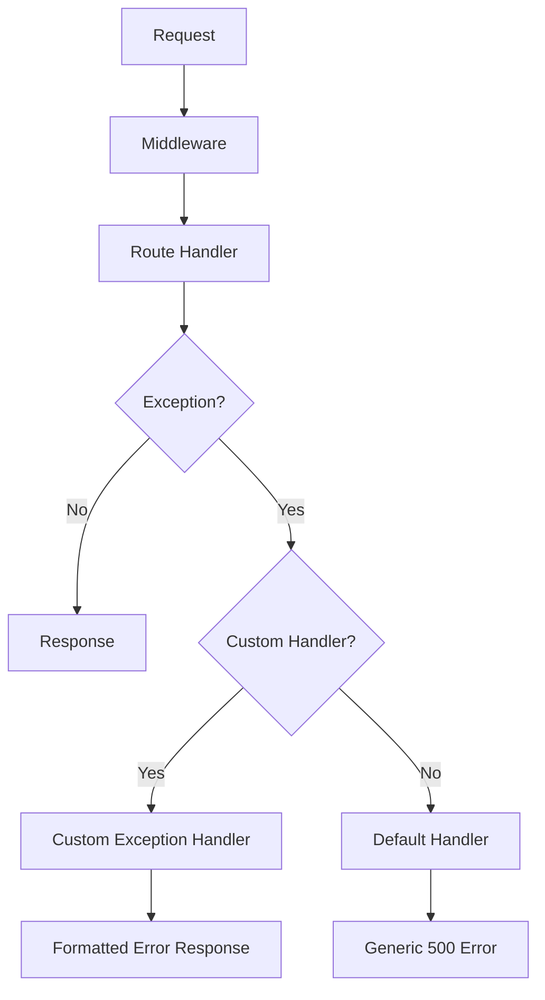

# How to Build Exception Handlers in FastAPI

Author: [nawazdhandala](https://www.github.com/nawazdhandala)

Tags: Python, FastAPI, Exception Handling, Error Handling, API Development, REST API

Description: Learn how to build robust exception handlers in FastAPI that provide clear error responses, proper logging, and maintain API consistency. This guide covers custom exceptions, global handlers, and production patterns.

---

> Good error handling separates professional APIs from amateur ones. Users and developers need clear, consistent error responses to understand what went wrong and how to fix it. This guide shows you how to build exception handlers that make your FastAPI applications robust and user-friendly.

Exception handling in APIs is about more than catching errors. It's about translating internal failures into meaningful responses, logging for debugging, and maintaining security by not leaking sensitive information. FastAPI gives you powerful tools for this, but you need to use them correctly.

---

## Understanding FastAPI Exception Handling

FastAPI processes requests through a chain of middleware and handlers. When an exception occurs, it bubbles up until something catches it. Without custom handlers, FastAPI returns generic errors that don't help anyone.



---

## Basic Exception Handling Setup

Let's start with a foundation that catches common errors and returns consistent responses.

```python
# exception_handlers.py
# Foundation for FastAPI exception handling
from fastapi import FastAPI, Request, HTTPException
from fastapi.responses import JSONResponse
from fastapi.exceptions import RequestValidationError
from pydantic import BaseModel
from typing import Optional, List, Any
from datetime import datetime
import logging
import traceback

# Configure logging for error tracking
logging.basicConfig(level=logging.INFO)
logger = logging.getLogger(__name__)

app = FastAPI()

class ErrorResponse(BaseModel):
    """
    Standard error response format.
    All errors return this structure for consistency.
    """
    error: str  # Human-readable error message
    code: str  # Machine-readable error code
    timestamp: datetime  # When the error occurred
    path: str  # The request path that caused the error
    details: Optional[Any] = None  # Additional context (validation errors, etc.)

@app.exception_handler(HTTPException)
async def http_exception_handler(request: Request, exc: HTTPException):
    """
    Handle FastAPI HTTPException with consistent format.
    This catches all raise HTTPException(...) calls.
    """
    error_response = ErrorResponse(
        error=exc.detail,
        code=f"HTTP_{exc.status_code}",
        timestamp=datetime.utcnow(),
        path=str(request.url.path)
    )

    # Log client errors at INFO, server errors at ERROR
    if exc.status_code >= 500:
        logger.error(f"Server error: {exc.detail} at {request.url}")
    else:
        logger.info(f"Client error: {exc.status_code} at {request.url}")

    return JSONResponse(
        status_code=exc.status_code,
        content=error_response.dict()
    )

@app.exception_handler(RequestValidationError)
async def validation_exception_handler(
    request: Request,
    exc: RequestValidationError
):
    """
    Handle Pydantic validation errors with detailed field information.
    Returns 422 with specific field errors for easy debugging.
    """
    # Extract field-level errors from Pydantic
    field_errors = []
    for error in exc.errors():
        field_errors.append({
            "field": ".".join(str(loc) for loc in error["loc"]),
            "message": error["msg"],
            "type": error["type"]
        })

    error_response = ErrorResponse(
        error="Request validation failed",
        code="VALIDATION_ERROR",
        timestamp=datetime.utcnow(),
        path=str(request.url.path),
        details=field_errors
    )

    logger.info(f"Validation error at {request.url}: {field_errors}")

    return JSONResponse(
        status_code=422,
        content=error_response.dict()
    )

@app.exception_handler(Exception)
async def global_exception_handler(request: Request, exc: Exception):
    """
    Catch-all handler for unexpected exceptions.
    Logs the full traceback but returns a safe message to clients.
    """
    # Log the full error for debugging
    logger.error(
        f"Unhandled exception at {request.url}:\n"
        f"{traceback.format_exc()}"
    )

    error_response = ErrorResponse(
        error="An internal error occurred",
        code="INTERNAL_ERROR",
        timestamp=datetime.utcnow(),
        path=str(request.url.path)
        # Note: Don't include exc details - could leak sensitive info
    )

    return JSONResponse(
        status_code=500,
        content=error_response.dict()
    )
```

---

## Custom Exception Classes

Define your own exceptions for domain-specific errors. This makes error handling more explicit and self-documenting.

```python
# custom_exceptions.py
# Domain-specific exception classes
from typing import Optional, Dict, Any

class AppException(Exception):
    """
    Base class for all application exceptions.
    Extend this for specific error types.
    """
    def __init__(
        self,
        message: str,
        code: str,
        status_code: int = 400,
        details: Optional[Dict[str, Any]] = None
    ):
        self.message = message
        self.code = code
        self.status_code = status_code
        self.details = details or {}
        super().__init__(self.message)

class NotFoundError(AppException):
    """Resource not found (404)"""
    def __init__(self, resource: str, identifier: str):
        super().__init__(
            message=f"{resource} with id '{identifier}' not found",
            code="RESOURCE_NOT_FOUND",
            status_code=404,
            details={"resource": resource, "identifier": identifier}
        )

class AuthenticationError(AppException):
    """Authentication failed (401)"""
    def __init__(self, reason: str = "Invalid credentials"):
        super().__init__(
            message=reason,
            code="AUTHENTICATION_FAILED",
            status_code=401
        )

class AuthorizationError(AppException):
    """User lacks permission (403)"""
    def __init__(self, action: str, resource: str):
        super().__init__(
            message=f"Not authorized to {action} on {resource}",
            code="AUTHORIZATION_FAILED",
            status_code=403,
            details={"action": action, "resource": resource}
        )

class ConflictError(AppException):
    """Resource conflict, like duplicate entries (409)"""
    def __init__(self, message: str, conflicting_field: str = None):
        super().__init__(
            message=message,
            code="RESOURCE_CONFLICT",
            status_code=409,
            details={"conflicting_field": conflicting_field} if conflicting_field else {}
        )

class RateLimitError(AppException):
    """Too many requests (429)"""
    def __init__(self, retry_after: int):
        super().__init__(
            message="Rate limit exceeded",
            code="RATE_LIMIT_EXCEEDED",
            status_code=429,
            details={"retry_after_seconds": retry_after}
        )

class ValidationError(AppException):
    """Business logic validation failed (422)"""
    def __init__(self, message: str, field: str = None):
        super().__init__(
            message=message,
            code="VALIDATION_FAILED",
            status_code=422,
            details={"field": field} if field else {}
        )

class ExternalServiceError(AppException):
    """External dependency failed (502)"""
    def __init__(self, service: str, reason: str):
        super().__init__(
            message=f"External service '{service}' failed: {reason}",
            code="EXTERNAL_SERVICE_ERROR",
            status_code=502,
            details={"service": service}
        )
```

---

## Registering Custom Exception Handlers

Now connect your custom exceptions to FastAPI's exception handling system.

```python
# app_handlers.py
# Register handlers for custom exceptions
from fastapi import FastAPI, Request
from fastapi.responses import JSONResponse
from datetime import datetime
import logging

from custom_exceptions import (
    AppException, NotFoundError, AuthenticationError,
    AuthorizationError, RateLimitError, ExternalServiceError
)

logger = logging.getLogger(__name__)

def create_app() -> FastAPI:
    """Create and configure the FastAPI application"""
    app = FastAPI(title="API with Exception Handling")

    # Register all exception handlers
    register_exception_handlers(app)

    return app

def register_exception_handlers(app: FastAPI):
    """Register all custom exception handlers"""

    @app.exception_handler(AppException)
    async def app_exception_handler(request: Request, exc: AppException):
        """
        Handle all custom AppException subclasses.
        This single handler works for NotFoundError, AuthError, etc.
        """
        # Log based on severity
        if exc.status_code >= 500:
            logger.error(f"{exc.code}: {exc.message} at {request.url}")
        else:
            logger.info(f"{exc.code}: {exc.message}")

        return JSONResponse(
            status_code=exc.status_code,
            content={
                "error": exc.message,
                "code": exc.code,
                "timestamp": datetime.utcnow().isoformat(),
                "path": str(request.url.path),
                "details": exc.details
            }
        )

    @app.exception_handler(RateLimitError)
    async def rate_limit_handler(request: Request, exc: RateLimitError):
        """
        Special handler for rate limits that adds Retry-After header.
        HTTP spec says 429 responses should include this header.
        """
        return JSONResponse(
            status_code=429,
            content={
                "error": exc.message,
                "code": exc.code,
                "timestamp": datetime.utcnow().isoformat(),
                "retry_after": exc.details.get("retry_after_seconds")
            },
            headers={
                "Retry-After": str(exc.details.get("retry_after_seconds", 60))
            }
        )

# Usage example in routes
app = create_app()

@app.get("/users/{user_id}")
async def get_user(user_id: str):
    user = await find_user(user_id)
    if not user:
        # Raise custom exception - handler converts to proper response
        raise NotFoundError("User", user_id)
    return user

@app.post("/users")
async def create_user(email: str):
    if await email_exists(email):
        raise ConflictError(
            "A user with this email already exists",
            conflicting_field="email"
        )
    # ... create user
```

---

## Error Handling Middleware

For cross-cutting concerns like request ID tracking and error correlation, use middleware.

```python
# error_middleware.py
# Middleware for enhanced error handling and tracking
from fastapi import FastAPI, Request
from fastapi.responses import JSONResponse
from starlette.middleware.base import BaseHTTPMiddleware
import uuid
import time
import logging

logger = logging.getLogger(__name__)

class ErrorTrackingMiddleware(BaseHTTPMiddleware):
    """
    Middleware that adds request tracking and timing to all requests.
    Helps correlate logs and debug issues across services.
    """

    async def dispatch(self, request: Request, call_next):
        # Generate unique request ID for tracking
        request_id = str(uuid.uuid4())[:8]

        # Store in request state for access in handlers
        request.state.request_id = request_id

        # Track timing
        start_time = time.time()

        try:
            response = await call_next(request)

            # Add request ID to response headers
            response.headers["X-Request-ID"] = request_id

            # Log successful requests
            duration_ms = (time.time() - start_time) * 1000
            logger.info(
                f"[{request_id}] {request.method} {request.url.path} "
                f"- {response.status_code} ({duration_ms:.2f}ms)"
            )

            return response

        except Exception as exc:
            # Log failed requests with full context
            duration_ms = (time.time() - start_time) * 1000
            logger.error(
                f"[{request_id}] {request.method} {request.url.path} "
                f"- FAILED ({duration_ms:.2f}ms): {exc}"
            )

            # Re-raise for exception handlers to process
            raise

class DatabaseErrorMiddleware(BaseHTTPMiddleware):
    """
    Middleware to catch database errors and convert to API responses.
    Prevents raw database errors from reaching clients.
    """

    async def dispatch(self, request: Request, call_next):
        try:
            return await call_next(request)
        except DatabaseConnectionError as exc:
            logger.error(f"Database connection failed: {exc}")
            return JSONResponse(
                status_code=503,
                content={
                    "error": "Service temporarily unavailable",
                    "code": "DATABASE_UNAVAILABLE"
                }
            )
        except DatabaseTimeoutError as exc:
            logger.error(f"Database query timeout: {exc}")
            return JSONResponse(
                status_code=504,
                content={
                    "error": "Request timed out",
                    "code": "DATABASE_TIMEOUT"
                }
            )

# Register middleware
app = FastAPI()
app.add_middleware(ErrorTrackingMiddleware)
app.add_middleware(DatabaseErrorMiddleware)
```

---

## Structured Error Logging

Production applications need structured logging for effective debugging and monitoring.

```python
# structured_logging.py
# Structured JSON logging for production
import logging
import json
from datetime import datetime
from typing import Any, Dict
from fastapi import Request

class StructuredLogFormatter(logging.Formatter):
    """
    Format log messages as JSON for log aggregation systems.
    Works with ELK, Datadog, CloudWatch, etc.
    """

    def format(self, record: logging.LogRecord) -> str:
        log_data = {
            "timestamp": datetime.utcnow().isoformat(),
            "level": record.levelname,
            "logger": record.name,
            "message": record.getMessage(),
            "module": record.module,
            "function": record.funcName,
            "line": record.lineno
        }

        # Add exception info if present
        if record.exc_info:
            log_data["exception"] = self.formatException(record.exc_info)

        # Add extra fields if present
        if hasattr(record, "extra_fields"):
            log_data.update(record.extra_fields)

        return json.dumps(log_data)

def setup_structured_logging():
    """Configure structured JSON logging"""
    handler = logging.StreamHandler()
    handler.setFormatter(StructuredLogFormatter())

    root_logger = logging.getLogger()
    root_logger.addHandler(handler)
    root_logger.setLevel(logging.INFO)

class ErrorLogger:
    """
    Helper class for logging errors with context.
    Use this in exception handlers for consistent logging.
    """

    def __init__(self, logger_name: str = "api"):
        self.logger = logging.getLogger(logger_name)

    def log_error(
        self,
        request: Request,
        error: Exception,
        error_code: str,
        extra: Dict[str, Any] = None
    ):
        """Log an error with full request context"""
        context = {
            "request_id": getattr(request.state, "request_id", "unknown"),
            "method": request.method,
            "path": str(request.url.path),
            "client_ip": request.client.host if request.client else "unknown",
            "error_code": error_code,
            "error_type": type(error).__name__
        }

        if extra:
            context.update(extra)

        # Create a log record with extra fields
        self.logger.error(
            str(error),
            extra={"extra_fields": context},
            exc_info=True
        )

# Usage in exception handlers
error_logger = ErrorLogger()

@app.exception_handler(AppException)
async def logged_exception_handler(request: Request, exc: AppException):
    """Exception handler with structured logging"""
    error_logger.log_error(
        request=request,
        error=exc,
        error_code=exc.code,
        extra=exc.details
    )

    return JSONResponse(
        status_code=exc.status_code,
        content={
            "error": exc.message,
            "code": exc.code,
            "request_id": getattr(request.state, "request_id", None)
        }
    )
```

---

## Testing Exception Handlers

Verify your exception handlers work correctly with comprehensive tests.

```python
# test_exception_handlers.py
# Tests for exception handling
import pytest
from fastapi.testclient import TestClient
from main import app

client = TestClient(app)

def test_not_found_error():
    """Test that 404 returns proper error format"""
    response = client.get("/users/nonexistent-id")

    assert response.status_code == 404
    data = response.json()
    assert data["code"] == "RESOURCE_NOT_FOUND"
    assert "User" in data["error"]
    assert "timestamp" in data

def test_validation_error():
    """Test that validation errors return field details"""
    response = client.post("/users", json={"email": "invalid-email"})

    assert response.status_code == 422
    data = response.json()
    assert data["code"] == "VALIDATION_ERROR"
    assert "details" in data
    assert len(data["details"]) > 0

def test_rate_limit_includes_retry_header():
    """Test that 429 includes Retry-After header"""
    # Trigger rate limit (implementation depends on your rate limiter)
    response = client.get("/rate-limited-endpoint")

    if response.status_code == 429:
        assert "Retry-After" in response.headers
        assert response.json()["code"] == "RATE_LIMIT_EXCEEDED"

def test_internal_error_hides_details():
    """Test that 500 errors don't leak sensitive info"""
    response = client.get("/endpoint-that-crashes")

    assert response.status_code == 500
    data = response.json()
    # Should not contain stack trace or internal details
    assert "traceback" not in str(data).lower()
    assert data["code"] == "INTERNAL_ERROR"
```

---

## Best Practices

1. **Use custom exceptions** - They make code more readable and error handling more explicit.

2. **Never leak internals** - Production errors should never expose stack traces, SQL queries, or file paths.

3. **Include request IDs** - Makes debugging across distributed systems possible.

4. **Log everything** - But log to files/services, not to responses.

5. **Be consistent** - All errors should follow the same response format.

6. **Test your handlers** - Exception handlers are code too. Test them.

---

## Conclusion

Well-designed exception handlers make your API easier to use and debug. By following these patterns, you'll catch errors gracefully, provide helpful responses to clients, and maintain detailed logs for troubleshooting. Start with the basics and add complexity as your application grows.

---

*Need to track errors across your Python services? [OneUptime](https://oneuptime.com) provides comprehensive error monitoring with automatic alerting, helping you catch and fix issues before users notice.*

**Related Reading:**
- [How to Implement Rate Limiting in FastAPI](https://oneuptime.com/blog/post/2025-01-06-fastapi-rate-limiting/view)
- [How to Build Health Checks and Readiness Probes in Python for Kubernetes](https://oneuptime.com/blog/post/2025-01-06-python-health-checks-kubernetes/view)
