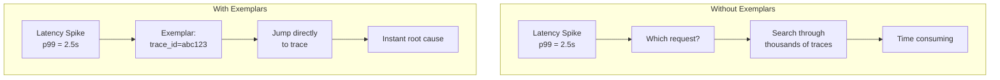
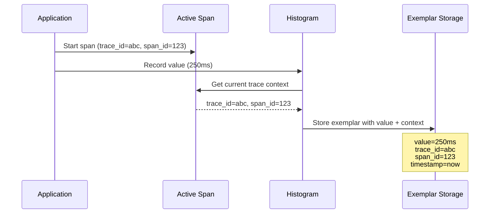
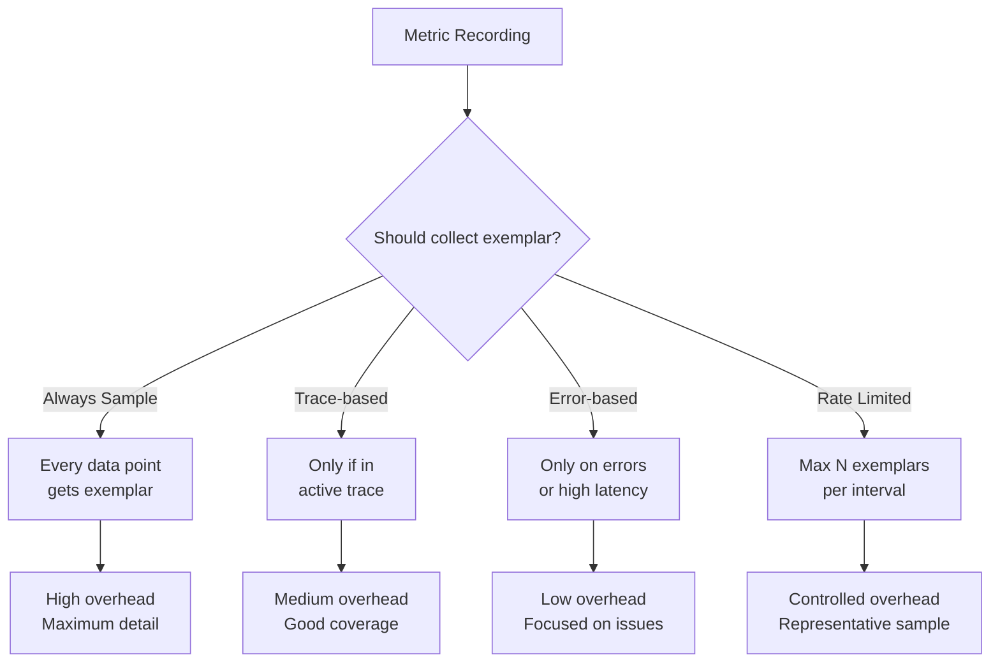

# How to Handle Exemplars in OpenTelemetry Metrics

Author: [nawazdhandala](https://www.github.com/nawazdhandala)

Tags: OpenTelemetry, Metrics, Exemplars, Tracing, Observability, Prometheus, Debugging, Performance

Description: Learn how to configure and use exemplars in OpenTelemetry to link metrics to traces, enabling faster root cause analysis by connecting high-level metrics to detailed trace data.

---

Exemplars are one of the most powerful features in OpenTelemetry for connecting metrics to traces. When you see a spike in latency or error rate, exemplars let you jump directly to a specific trace that caused that spike. This guide covers how to configure, collect, and use exemplars effectively.

## What Are Exemplars?

Exemplars are sample data points attached to metrics that include trace context. When a metric is recorded, an exemplar captures the trace ID and span ID of the current request, creating a direct link from aggregated metrics to detailed distributed traces.



## How Exemplars Work

When you record a metric value, OpenTelemetry can attach the current trace context as an exemplar:



## Enabling Exemplars in Node.js

Configure your metric reader to collect exemplars:

```typescript
// instrumentation.ts
import { NodeSDK } from '@opentelemetry/sdk-node';
import { getNodeAutoInstrumentations } from '@opentelemetry/auto-instrumentations-node';
import { OTLPMetricExporter } from '@opentelemetry/exporter-metrics-otlp-http';
import { OTLPTraceExporter } from '@opentelemetry/exporter-trace-otlp-http';
import {
  PeriodicExportingMetricReader,
  MeterProvider,
  View,
  Aggregation,
  ExplicitBucketHistogramAggregation,
} from '@opentelemetry/sdk-metrics';
import { Resource } from '@opentelemetry/resources';
import { ATTR_SERVICE_NAME } from '@opentelemetry/semantic-conventions';

const resource = new Resource({
  [ATTR_SERVICE_NAME]: 'my-service',
});

// Configure OTLP exporters
const traceExporter = new OTLPTraceExporter({
  url: 'https://oneuptime.com/otlp/v1/traces',
  headers: {
    'x-oneuptime-token': process.env.ONEUPTIME_TOKEN || '',
  },
});

const metricExporter = new OTLPMetricExporter({
  url: 'https://oneuptime.com/otlp/v1/metrics',
  headers: {
    'x-oneuptime-token': process.env.ONEUPTIME_TOKEN || '',
  },
});

// Create a metric reader that preserves exemplars
const metricReader = new PeriodicExportingMetricReader({
  exporter: metricExporter,
  exportIntervalMillis: 15000,
});

// Define views to control exemplar collection
const views = [
  // Collect exemplars for request duration histogram
  new View({
    instrumentName: 'http.server.request.duration',
    aggregation: Aggregation.ExplicitBucketHistogram({
      boundaries: [5, 10, 25, 50, 100, 250, 500, 1000, 2500, 5000, 10000],
      // Enable exemplar collection (default is enabled)
      recordMinMax: true,
    }),
  }),
];

// Initialize the SDK
const sdk = new NodeSDK({
  resource,
  traceExporter,
  metricReader,
  instrumentations: [getNodeAutoInstrumentations()],
});

sdk.start();
```

## Recording Metrics with Exemplars

When recording metrics within a traced context, exemplars are automatically captured:

```typescript
// metrics.ts
import { metrics, trace, context } from '@opentelemetry/api';

const meter = metrics.getMeter('my-service', '1.0.0');

// Create a histogram that will collect exemplars
const requestDuration = meter.createHistogram('http.server.request.duration', {
  description: 'Duration of HTTP requests',
  unit: 'ms',
});

const errorCounter = meter.createCounter('http.server.errors', {
  description: 'Number of HTTP errors',
  unit: '1',
});

// Express middleware that records metrics with exemplars
export function metricsMiddleware(req: Request, res: Response, next: NextFunction) {
  const startTime = Date.now();

  res.on('finish', () => {
    const duration = Date.now() - startTime;
    const attributes = {
      'http.method': req.method,
      'http.route': req.route?.path || req.path,
      'http.status_code': res.statusCode,
    };

    // Record duration - exemplar is automatically attached from current span context
    // The exemplar links this metric data point to the trace that generated it
    requestDuration.record(duration, attributes);

    // Record errors
    if (res.statusCode >= 500) {
      errorCounter.add(1, attributes);
    }
  });

  next();
}
```

## Exemplars with Custom Spans

When creating custom spans, the exemplar context is preserved:

```typescript
import { trace, metrics, SpanStatusCode } from '@opentelemetry/api';

const tracer = trace.getTracer('payment-service');
const meter = metrics.getMeter('payment-service');

// Create metrics that will have exemplars
const paymentDuration = meter.createHistogram('payment.processing.duration', {
  description: 'Payment processing duration',
  unit: 'ms',
});

const paymentAmount = meter.createHistogram('payment.amount', {
  description: 'Payment amounts processed',
  unit: 'USD',
});

async function processPayment(paymentRequest: PaymentRequest) {
  // Start a span - this creates the trace context for exemplars
  return tracer.startActiveSpan('process-payment', async (span) => {
    const startTime = Date.now();

    try {
      // Add attributes to the span
      span.setAttribute('payment.method', paymentRequest.method);
      span.setAttribute('payment.currency', paymentRequest.currency);

      // Process the payment
      const result = await executePayment(paymentRequest);

      // Record successful payment amount
      // This exemplar links to the 'process-payment' span
      paymentAmount.record(paymentRequest.amount, {
        'payment.method': paymentRequest.method,
        'payment.status': 'success',
      });

      span.setStatus({ code: SpanStatusCode.OK });
      return result;
    } catch (error: any) {
      span.recordException(error);
      span.setStatus({ code: SpanStatusCode.ERROR, message: error.message });

      // Record failed payment - exemplar links to the error trace
      paymentAmount.record(paymentRequest.amount, {
        'payment.method': paymentRequest.method,
        'payment.status': 'failed',
      });

      throw error;
    } finally {
      const duration = Date.now() - startTime;

      // Record duration with exemplar
      paymentDuration.record(duration, {
        'payment.method': paymentRequest.method,
      });

      span.end();
    }
  });
}
```

## Exemplars in Python

Configure exemplar collection in Python:

```python
# instrumentation.py
from opentelemetry import metrics, trace
from opentelemetry.sdk.metrics import MeterProvider
from opentelemetry.sdk.metrics.export import PeriodicExportingMetricReader
from opentelemetry.sdk.metrics.view import View, ExplicitBucketHistogramAggregation
from opentelemetry.exporter.otlp.proto.http.metric_exporter import OTLPMetricExporter
from opentelemetry.sdk.trace import TracerProvider
from opentelemetry.sdk.trace.export import BatchSpanProcessor
from opentelemetry.exporter.otlp.proto.http.trace_exporter import OTLPSpanExporter
from opentelemetry.sdk.resources import Resource
import os

def configure_opentelemetry():
    """Configure OpenTelemetry with exemplar support."""

    resource = Resource.create({
        "service.name": os.getenv("OTEL_SERVICE_NAME", "python-service"),
    })

    # Configure tracing
    trace_provider = TracerProvider(resource=resource)
    trace_exporter = OTLPSpanExporter(
        endpoint=os.getenv("OTEL_EXPORTER_OTLP_ENDPOINT", "http://localhost:4318/v1/traces"),
    )
    trace_provider.add_span_processor(BatchSpanProcessor(trace_exporter))
    trace.set_tracer_provider(trace_provider)

    # Configure metrics with exemplar-enabled views
    metric_exporter = OTLPMetricExporter(
        endpoint=os.getenv("OTEL_EXPORTER_OTLP_ENDPOINT", "http://localhost:4318/v1/metrics"),
    )

    metric_reader = PeriodicExportingMetricReader(
        exporter=metric_exporter,
        export_interval_millis=15000,
    )

    # Define views for exemplar collection
    views = [
        View(
            instrument_name="http.server.request.duration",
            aggregation=ExplicitBucketHistogramAggregation(
                boundaries=[5, 10, 25, 50, 100, 250, 500, 1000, 2500, 5000],
            ),
        ),
    ]

    meter_provider = MeterProvider(
        resource=resource,
        metric_readers=[metric_reader],
        views=views,
    )
    metrics.set_meter_provider(meter_provider)

    return trace_provider, meter_provider
```

```python
# app.py
from opentelemetry import trace, metrics
import time
from instrumentation import configure_opentelemetry

# Initialize OpenTelemetry
trace_provider, meter_provider = configure_opentelemetry()

# Get tracer and meter
tracer = trace.get_tracer("my-service")
meter = metrics.get_meter("my-service")

# Create histogram for duration tracking with exemplars
request_duration = meter.create_histogram(
    name="http.server.request.duration",
    description="Duration of HTTP requests",
    unit="ms",
)

def process_request(request_data: dict):
    """Process a request with tracing and metrics."""

    # Start a span - this creates context for exemplars
    with tracer.start_as_current_span("process-request") as span:
        start_time = time.time()

        try:
            # Add span attributes
            span.set_attribute("request.type", request_data.get("type"))

            # Do the actual work
            result = do_work(request_data)

            span.set_status(trace.Status(trace.StatusCode.OK))
            return result

        except Exception as e:
            span.record_exception(e)
            span.set_status(trace.Status(trace.StatusCode.ERROR, str(e)))
            raise

        finally:
            # Record duration - exemplar automatically attached
            duration_ms = (time.time() - start_time) * 1000
            request_duration.record(
                duration_ms,
                attributes={
                    "request.type": request_data.get("type"),
                },
            )
```

## Exemplars in Go

Configure exemplar collection in Go:

```go
package main

import (
	"context"
	"time"

	"go.opentelemetry.io/otel"
	"go.opentelemetry.io/otel/attribute"
	"go.opentelemetry.io/otel/exporters/otlp/otlpmetric/otlpmetrichttp"
	"go.opentelemetry.io/otel/exporters/otlp/otlptrace/otlptracehttp"
	"go.opentelemetry.io/otel/metric"
	sdkmetric "go.opentelemetry.io/otel/sdk/metric"
	"go.opentelemetry.io/otel/sdk/resource"
	sdktrace "go.opentelemetry.io/otel/sdk/trace"
	semconv "go.opentelemetry.io/otel/semconv/v1.21.0"
	"go.opentelemetry.io/otel/trace"
)

var (
	tracer          trace.Tracer
	meter           metric.Meter
	requestDuration metric.Float64Histogram
)

func initTelemetry(ctx context.Context) (func(), error) {
	// Create resource
	res, err := resource.Merge(
		resource.Default(),
		resource.NewWithAttributes(
			semconv.SchemaURL,
			semconv.ServiceName("go-service"),
		),
	)
	if err != nil {
		return nil, err
	}

	// Configure trace exporter
	traceExporter, err := otlptracehttp.New(ctx,
		otlptracehttp.WithEndpoint("localhost:4318"),
		otlptracehttp.WithInsecure(),
	)
	if err != nil {
		return nil, err
	}

	// Configure trace provider
	traceProvider := sdktrace.NewTracerProvider(
		sdktrace.WithBatcher(traceExporter),
		sdktrace.WithResource(res),
	)
	otel.SetTracerProvider(traceProvider)
	tracer = traceProvider.Tracer("go-service")

	// Configure metric exporter
	metricExporter, err := otlpmetrichttp.New(ctx,
		otlpmetrichttp.WithEndpoint("localhost:4318"),
		otlpmetrichttp.WithInsecure(),
	)
	if err != nil {
		return nil, err
	}

	// Configure meter provider with exemplar filter
	// The exemplar filter determines which data points get exemplars
	meterProvider := sdkmetric.NewMeterProvider(
		sdkmetric.WithResource(res),
		sdkmetric.WithReader(
			sdkmetric.NewPeriodicReader(metricExporter,
				sdkmetric.WithInterval(15*time.Second),
			),
		),
		// Configure views for histogram boundaries
		sdkmetric.WithView(
			sdkmetric.NewView(
				sdkmetric.Instrument{Name: "http.server.request.duration"},
				sdkmetric.Stream{
					Aggregation: sdkmetric.AggregationExplicitBucketHistogram{
						Boundaries: []float64{5, 10, 25, 50, 100, 250, 500, 1000, 2500, 5000},
					},
				},
			),
		),
	)
	otel.SetMeterProvider(meterProvider)
	meter = meterProvider.Meter("go-service")

	// Create histogram instrument
	requestDuration, err = meter.Float64Histogram(
		"http.server.request.duration",
		metric.WithDescription("Duration of HTTP requests"),
		metric.WithUnit("ms"),
	)
	if err != nil {
		return nil, err
	}

	// Return cleanup function
	cleanup := func() {
		traceProvider.Shutdown(ctx)
		meterProvider.Shutdown(ctx)
	}

	return cleanup, nil
}

func handleRequest(ctx context.Context, requestType string) error {
	// Start a span - this creates context for exemplars
	ctx, span := tracer.Start(ctx, "handle-request")
	defer span.End()

	startTime := time.Now()

	// Add span attributes
	span.SetAttributes(attribute.String("request.type", requestType))

	// Simulate work
	err := doWork(ctx)

	// Record duration with exemplar
	// The exemplar is automatically attached from the span context
	duration := float64(time.Since(startTime).Milliseconds())
	requestDuration.Record(ctx, duration,
		metric.WithAttributes(
			attribute.String("request.type", requestType),
		),
	)

	return err
}
```

## Querying Exemplars

Once collected, exemplars can be queried in various ways depending on your backend.

### Prometheus Query

If using Prometheus, you can query exemplars alongside your metrics:

```promql
# Query histogram with exemplars
histogram_quantile(0.99,
  sum(rate(http_server_request_duration_bucket[5m])) by (le)
)

# In Grafana, enable "Exemplars" toggle in the query options
# to display exemplar data points on the graph
```

### OneUptime

In OneUptime, exemplars appear as clickable links on metric charts:

1. View any histogram metric chart
2. Hover over data points to see exemplar information
3. Click the trace ID to navigate directly to the associated trace

## Exemplar Sampling Strategies

Not every metric data point needs an exemplar. Configure sampling to balance detail with overhead:



### Implementing Custom Exemplar Filtering

```typescript
// custom-exemplar-filter.ts
import { ExemplarFilter, Context } from '@opentelemetry/sdk-metrics';
import { trace, SpanStatusCode } from '@opentelemetry/api';

// Custom filter that only collects exemplars for interesting cases
export class SelectiveExemplarFilter implements ExemplarFilter {
  private exemplarCount = 0;
  private lastResetTime = Date.now();
  private maxExemplarsPerInterval = 100;
  private intervalMs = 60000; // 1 minute

  shouldSample(
    value: number,
    timestamp: number,
    attributes: Record<string, unknown>,
    ctx: Context
  ): boolean {
    // Reset counter if interval has passed
    const now = Date.now();
    if (now - this.lastResetTime > this.intervalMs) {
      this.exemplarCount = 0;
      this.lastResetTime = now;
    }

    // Check if we have exceeded the rate limit
    if (this.exemplarCount >= this.maxExemplarsPerInterval) {
      return false;
    }

    // Get current span to check for errors
    const span = trace.getSpan(ctx);
    if (!span) {
      return false; // No active span, skip exemplar
    }

    const spanContext = span.spanContext();
    if (!spanContext.traceId) {
      return false; // Invalid trace context
    }

    // Always sample errors
    const status = (span as any)._status;
    if (status?.code === SpanStatusCode.ERROR) {
      this.exemplarCount++;
      return true;
    }

    // Sample high latency requests (value is duration in ms)
    if (value > 1000) {
      this.exemplarCount++;
      return true;
    }

    // Sample a percentage of normal requests
    if (Math.random() < 0.01) {
      // 1% sampling
      this.exemplarCount++;
      return true;
    }

    return false;
  }
}
```

## Best Practices

### 1. Use Meaningful Histogram Boundaries

Configure boundaries that align with your SLOs:

```typescript
// Boundaries aligned with SLO thresholds
const sloAlignedBoundaries = [
  10,    // Excellent (< 10ms)
  50,    // Good (< 50ms)
  100,   // Acceptable (< 100ms - SLO threshold)
  250,   // Degraded
  500,   // Poor
  1000,  // Critical
  2500,  // Severe
  5000,  // Outage-level
];
```

### 2. Include Relevant Attributes

Add attributes that help identify the request:

```typescript
requestDuration.record(duration, {
  'http.method': req.method,
  'http.route': req.route?.path,
  'http.status_code': res.statusCode,
  'service.instance': process.env.HOSTNAME,
});
```

### 3. Ensure Trace Context Propagation

Exemplars only work when there is an active span:

```typescript
// Ensure you are within a traced context
tracer.startActiveSpan('my-operation', (span) => {
  // Metrics recorded here will have exemplars
  myHistogram.record(value, attributes);
  span.end();
});
```

### 4. Configure Appropriate Retention

Exemplars reference trace IDs that must still exist in your tracing backend:

```yaml
# Collector config - ensure trace retention >= metric retention
exporters:
  otlphttp:
    endpoint: "https://oneuptime.com/otlp"
    # Traces and metrics go to the same backend
    # ensuring exemplar links remain valid
```

## Troubleshooting

| Issue | Cause | Solution |
|-------|-------|----------|
| No exemplars appearing | No active trace context | Ensure metrics are recorded within a span |
| Exemplar links broken | Trace already deleted | Align trace and metric retention periods |
| Too many exemplars | No filtering configured | Implement sampling or rate limiting |
| Missing trace IDs | Propagation not configured | Set up W3C TraceContext propagator |

## Summary

Exemplars bridge the gap between high-level metrics and detailed traces:

1. **Configure your SDK** to collect exemplars with appropriate histogram boundaries
2. **Record metrics within traced contexts** to automatically attach trace IDs
3. **Implement sampling strategies** to control overhead while maintaining useful coverage
4. **Use exemplars in your workflow** to quickly jump from metric anomalies to root cause

When you see a latency spike at 3 AM, exemplars let you go from "something is slow" to "this specific request to this specific service with this specific payload is slow" in seconds rather than hours.
