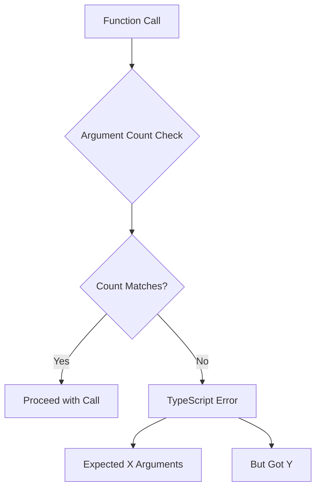

# How to Fix 'Expected X Arguments but Got Y' Errors

Author: [nawazdhandala](https://www.github.com/nawazdhandala)

Tags: TypeScript, Debugging, Functions, Type Safety, Error Handling, JavaScript

Description: Learn how to diagnose and fix TypeScript's 'Expected X arguments but got Y' errors, including understanding function signatures, optional parameters, and overloads.

---

The "Expected X arguments but got Y" error is one of the most common TypeScript errors you will encounter. While it might seem straightforward, this error can appear in various contexts with different underlying causes. In this guide, we will explore the root causes of this error and learn how to fix it effectively.

## Understanding the Error

This error occurs when you call a function with a different number of arguments than what its signature expects. TypeScript enforces strict argument counts to prevent runtime errors.

```typescript
function greet(name: string, age: number): string {
    return `Hello, ${name}! You are ${age} years old.`;
}

// Error: Expected 2 arguments, but got 1
greet("Alice");

// Error: Expected 2 arguments, but got 3
greet("Alice", 30, "extra");

// Correct
greet("Alice", 30);
```



## Common Causes and Solutions

### Cause 1: Missing Required Arguments

The most straightforward case is forgetting to pass required arguments.

```typescript
interface User {
    id: number;
    name: string;
    email: string;
}

function createUser(id: number, name: string, email: string): User {
    return { id, name, email };
}

// Error: Expected 3 arguments, but got 2
const user = createUser(1, "Alice");
```

**Solution: Pass all required arguments.**

```typescript
const user = createUser(1, "Alice", "alice@example.com");
```

### Cause 2: Optional Parameters Not Marked

If a parameter should be optional, mark it with `?`:

```typescript
// Before - all parameters required
function sendEmail(to: string, subject: string, body: string): void {
    // send email
}

// Error: Expected 3 arguments, but got 2
sendEmail("user@example.com", "Hello");
```

**Solution: Make parameters optional where appropriate.**

```typescript
// After - body is optional
function sendEmail(to: string, subject: string, body?: string): void {
    const emailBody = body ?? "No body provided";
    // send email
}

// Now this works
sendEmail("user@example.com", "Hello");
```

### Cause 3: Default Parameters

Using default parameters is another way to make arguments optional:

```typescript
// Using default values instead of optional marker
function greet(name: string, greeting: string = "Hello"): string {
    return `${greeting}, ${name}!`;
}

// Both work
greet("Alice");            // "Hello, Alice!"
greet("Alice", "Hi");      // "Hi, Alice!"
```

### Cause 4: Callback Functions with Wrong Signatures

This error frequently occurs when passing callbacks with incorrect argument counts:

```typescript
const numbers = [1, 2, 3, 4, 5];

// Array.map expects a callback with up to 3 arguments
// (value, index, array) => newValue

// This callback expects 2 arguments
function doubleWithIndex(value: number, index: number): string {
    return `${index}: ${value * 2}`;
}

// Works - callback receives correct arguments
numbers.map(doubleWithIndex);

// But if your function expects more than map provides:
function processItem(value: number, index: number, array: number[], extra: string): string {
    return `${extra}: ${value}`;
}

// Error: Argument of type '...' is not assignable to parameter of type '...'
numbers.map(processItem);
```

**Solution: Adjust your callback signature to match what the caller provides.**

```typescript
// Fix by making extra parameter optional or removing it
function processItem(value: number, index: number, array: number[], extra?: string): string {
    return `${extra ?? "Item"}: ${value}`;
}

// Or use a wrapper
numbers.map((value, index, array) => processItem(value, index, array, "Number"));
```

### Cause 5: Method Overloading Confusion

When working with overloaded functions, you might call with wrong argument combinations:

```typescript
// Function overloads
function createElement(tag: "div"): HTMLDivElement;
function createElement(tag: "span"): HTMLSpanElement;
function createElement(tag: "a", href: string): HTMLAnchorElement;
function createElement(tag: string, href?: string): HTMLElement {
    const element = document.createElement(tag);
    if (tag === "a" && href) {
        (element as HTMLAnchorElement).href = href;
    }
    return element;
}

// Correct uses
createElement("div");
createElement("span");
createElement("a", "https://example.com");

// Error: Expected 2 arguments, but got 1
// (when calling with "a", the overload requires href)
createElement("a");
```

**Solution: Follow the overload signatures exactly.**

```typescript
// If you need an anchor without href, update overloads
function createElement(tag: "a"): HTMLAnchorElement;
function createElement(tag: "a", href: string): HTMLAnchorElement;
// ... rest of implementation
```

### Cause 6: Class Constructor Arguments

Constructors can have the same issue:

```typescript
class HttpClient {
    private baseUrl: string;
    private timeout: number;

    constructor(baseUrl: string, timeout: number) {
        this.baseUrl = baseUrl;
        this.timeout = timeout;
    }
}

// Error: Expected 2 arguments, but got 1
const client = new HttpClient("https://api.example.com");
```

**Solution: Provide all constructor arguments or make some optional.**

```typescript
class HttpClient {
    private baseUrl: string;
    private timeout: number;

    constructor(baseUrl: string, timeout: number = 5000) {
        this.baseUrl = baseUrl;
        this.timeout = timeout;
    }
}

// Now works with default timeout
const client = new HttpClient("https://api.example.com");
```

### Cause 7: Rest Parameters

When a function uses rest parameters, you have more flexibility:

```typescript
// Without rest parameters
function sum(a: number, b: number): number {
    return a + b;
}

// Error: Expected 2 arguments, but got 3
sum(1, 2, 3);

// With rest parameters
function sumAll(...numbers: number[]): number {
    return numbers.reduce((acc, n) => acc + n, 0);
}

// Now any number of arguments works
sumAll(1, 2, 3);        // 6
sumAll(1, 2, 3, 4, 5);  // 15
```

### Cause 8: Tuple Types in Function Parameters

When using tuple types for parameters, argument count is strictly enforced:

```typescript
type Point = [number, number];

function distance(start: Point, end: Point): number {
    const [x1, y1] = start;
    const [x2, y2] = end;
    return Math.sqrt((x2 - x1) ** 2 + (y2 - y1) ** 2);
}

// Must pass exactly two tuples
distance([0, 0], [3, 4]);  // 5

// Error: Expected 2 arguments, but got 1
distance([0, 0]);
```

## Working with Third-Party Libraries

Library type definitions might not match your expected usage:

```typescript
// Example: lodash debounce
import { debounce } from "lodash";

function handleInput(event: Event, context: string): void {
    // handle input
}

// Error: The underlying debounce might have different type expectations
const debouncedHandler = debounce(handleInput, 300);
```

**Solution: Check the library's type definitions or use type assertions.**

```typescript
// Option 1: Wrap in a compatible function
const debouncedHandler = debounce((event: Event) => {
    handleInput(event, "search");
}, 300);

// Option 2: Use proper typing
const debouncedHandler = debounce(
    (event: Event, context: string) => handleInput(event, context),
    300
);
```

## Debugging Strategies

### Check the Function Signature

Hover over the function in your IDE to see its expected signature:

```typescript
// Hovering over 'fetch' shows:
// function fetch(input: RequestInfo | URL, init?: RequestInit): Promise<Response>

// Now you know init is optional
fetch("https://api.example.com");  // Works
fetch("https://api.example.com", { method: "POST" });  // Also works
```

### Check for Type Inference Issues

Sometimes TypeScript infers types incorrectly:

```typescript
const handlers = {
    onClick: (event: MouseEvent, data: string) => {
        console.log(data);
    }
};

// If TypeScript infers handlers incorrectly, you might get argument errors
// Be explicit with types
interface Handlers {
    onClick: (event: MouseEvent, data: string) => void;
}

const handlers: Handlers = {
    onClick: (event, data) => {
        console.log(data);
    }
};
```

### Use Function Type Aliases

Define clear function types for consistency:

```typescript
// Define the expected callback type
type EventHandler<T> = (event: T, context: string) => void;

// Use it consistently
function registerHandler(handler: EventHandler<MouseEvent>): void {
    // register the handler
}

// Now the required arguments are clear
registerHandler((event, context) => {
    console.log(context, event.clientX);
});
```

## Advanced Patterns

### Generic Functions with Constraints

Generics can sometimes cause argument count confusion:

```typescript
function processArray<T>(
    items: T[],
    processor: (item: T, index: number) => T
): T[] {
    return items.map(processor);
}

// Error if processor signature does not match
processArray([1, 2, 3], (item) => item * 2);  // Works - index is optional for callbacks

// Error: Expected 2 arguments, but got 3
function badProcessor(item: number, index: number, extra: string): number {
    return item;
}
processArray([1, 2, 3], badProcessor);
```

### Conditional Types and Arguments

With conditional types, argument requirements can change based on type parameters:

```typescript
type RequestConfig<T> = T extends "GET"
    ? { url: string }
    : { url: string; body: unknown };

function makeRequest<T extends "GET" | "POST">(
    method: T,
    config: RequestConfig<T>
): Promise<Response> {
    // implementation
    return fetch(config.url, {
        method,
        body: "body" in config ? JSON.stringify(config.body) : undefined
    });
}

// GET only needs url
makeRequest("GET", { url: "/api/users" });

// POST needs url and body
makeRequest("POST", { url: "/api/users", body: { name: "Alice" } });

// Error: Property 'body' is missing
makeRequest("POST", { url: "/api/users" });
```

## Best Practices

### 1. Use Parameter Objects for Many Arguments

Instead of many positional arguments, use an options object:

```typescript
// Hard to remember argument order
function createRequest(
    url: string,
    method: string,
    headers: Record<string, string>,
    body: unknown,
    timeout: number,
    retries: number
): void {}

// Better: use an options object
interface RequestOptions {
    url: string;
    method?: string;
    headers?: Record<string, string>;
    body?: unknown;
    timeout?: number;
    retries?: number;
}

function createRequest(options: RequestOptions): void {
    const { url, method = "GET", timeout = 5000 } = options;
    // implementation
}

// Clearer to use
createRequest({
    url: "/api/users",
    method: "POST",
    body: { name: "Alice" }
});
```

### 2. Document Parameter Requirements

Use JSDoc comments to clarify parameter expectations:

```typescript
/**
 * Creates a new user in the system
 * @param name - The user's full name (required)
 * @param email - The user's email address (required)
 * @param age - The user's age (optional, defaults to undefined)
 */
function createUser(name: string, email: string, age?: number): User {
    return { name, email, age };
}
```

### 3. Prefer Explicit Over Implicit

When argument requirements are complex, be explicit:

```typescript
// Implicit - hard to understand from signature
function query(sql: string, ...params: unknown[]): Promise<Result[]>;

// Explicit - clear what is expected
interface QueryOptions {
    sql: string;
    params?: unknown[];
    timeout?: number;
}

function query(options: QueryOptions): Promise<Result[]>;
```

## Conclusion

The "Expected X arguments but got Y" error helps TypeScript catch potential bugs before runtime. When you encounter this error:

1. Check the function signature to understand required arguments
2. Look for optional parameters marked with `?` or default values
3. Consider if you need to update the function signature or your call
4. Use parameter objects for functions with many arguments
5. Be explicit about callback types when passing functions

By understanding function signatures and TypeScript's type system, you can quickly diagnose and fix these errors while writing more robust code.

---

**Related Reading:**

- [How to Configure TypeScript with Node.js](https://oneuptime.com/blog/post/2026-01-24-configure-typescript-with-nodejs/view)
- [How to Handle Enums vs Union Types](https://oneuptime.com/blog/post/2026-01-24-enums-vs-union-types/view)
- [How to Fix "Cannot Redeclare Block-Scoped Variable"](https://oneuptime.com/blog/post/2026-01-24-cannot-redeclare-block-scoped-variable/view)
