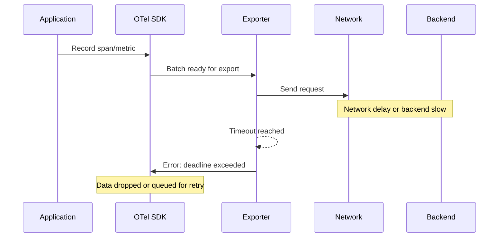
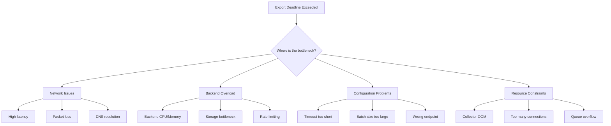
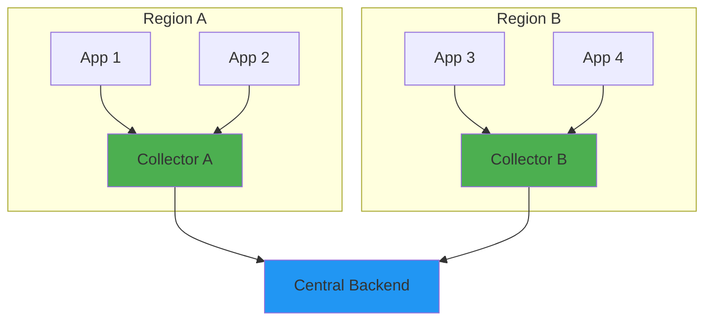
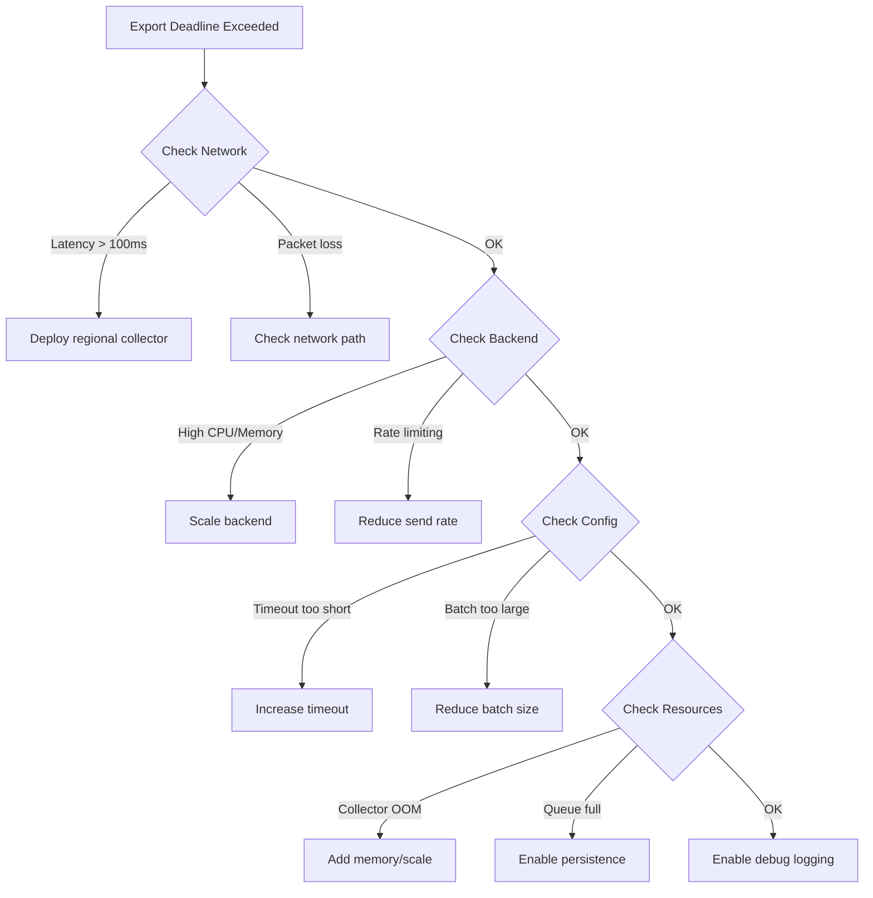

# How to Fix 'Export Deadline Exceeded' Errors

Author: [nawazdhandala](https://www.github.com/nawazdhandala)

Tags: OpenTelemetry, Troubleshooting, Performance, Exporter, Collector

Description: Diagnose and resolve OpenTelemetry export deadline exceeded errors caused by network issues, backend problems, or misconfigured timeouts.

---

The "export deadline exceeded" error is one of the most common issues when working with OpenTelemetry. This error occurs when the exporter cannot send telemetry data to the backend within the configured timeout period. This guide will help you diagnose the root cause and implement effective fixes.

## Understanding the Error

When you see this error, it means the exporter gave up waiting for a response:

```
2024-01-15T10:30:45.123Z error exporterhelper/queued_retry.go:394
    Exporting failed. Dropping data.
    {"kind": "exporter", "data_type": "traces", "name": "otlp",
     "error": "context deadline exceeded", "dropped_items": 150}
```



## Common Causes

Before diving into fixes, identify which category your issue falls into:



## Fix 1: Increase Export Timeout

The default timeout may be too aggressive for your environment.

### SDK Configuration (Python)

```python
# Configure OTLP exporter with increased timeout
from opentelemetry.exporter.otlp.proto.grpc.trace_exporter import OTLPSpanExporter
from opentelemetry.sdk.trace.export import BatchSpanProcessor

# Create exporter with longer timeout
# Default is 10 seconds, increase for high-latency networks
exporter = OTLPSpanExporter(
    endpoint="https://collector.example.com:4317",
    timeout=30,  # 30 seconds timeout
)

# Configure BatchSpanProcessor with appropriate settings
processor = BatchSpanProcessor(
    exporter,
    max_queue_size=2048,           # Maximum spans to queue
    max_export_batch_size=512,     # Spans per export batch
    export_timeout_millis=30000,   # 30 second export timeout
    schedule_delay_millis=5000,    # Wait 5 seconds before exporting
)
```

### SDK Configuration (Node.js)

```javascript
// Configure OTLP exporter with increased timeout
const { OTLPTraceExporter } = require('@opentelemetry/exporter-trace-otlp-grpc');
const { BatchSpanProcessor } = require('@opentelemetry/sdk-trace-base');

// Create exporter with extended timeout
const exporter = new OTLPTraceExporter({
    url: 'https://collector.example.com:4317',
    // Timeout in milliseconds (default is 10000)
    timeoutMillis: 30000,
});

// Configure batch processor with matching timeouts
const processor = new BatchSpanProcessor(exporter, {
    maxQueueSize: 2048,
    maxExportBatchSize: 512,
    scheduledDelayMillis: 5000,
    exportTimeoutMillis: 30000,  // Match exporter timeout
});
```

### SDK Configuration (Go)

```go
package main

import (
    "context"
    "time"

    "go.opentelemetry.io/otel/exporters/otlp/otlptrace/otlptracegrpc"
    "go.opentelemetry.io/otel/sdk/trace"
    "google.golang.org/grpc"
)

func initTracer() (*trace.TracerProvider, error) {
    ctx := context.Background()

    // Create exporter with extended timeout
    exporter, err := otlptracegrpc.New(ctx,
        otlptracegrpc.WithEndpoint("collector.example.com:4317"),
        // Set connection timeout
        otlptracegrpc.WithDialOption(grpc.WithBlock()),
        // Set RPC timeout
        otlptracegrpc.WithTimeout(30*time.Second),
        // Retry configuration
        otlptracegrpc.WithRetry(otlptracegrpc.RetryConfig{
            Enabled:         true,
            InitialInterval: 1 * time.Second,
            MaxInterval:     30 * time.Second,
            MaxElapsedTime:  2 * time.Minute,
        }),
    )
    if err != nil {
        return nil, err
    }

    // Create tracer provider with batch processor
    tp := trace.NewTracerProvider(
        trace.WithBatcher(exporter,
            trace.WithMaxQueueSize(2048),
            trace.WithMaxExportBatchSize(512),
            trace.WithBatchTimeout(5*time.Second),
            trace.WithExportTimeout(30*time.Second),
        ),
    )

    return tp, nil
}
```

## Fix 2: Reduce Batch Size

Large batches take longer to serialize and transmit. Smaller batches complete faster.

```yaml
# otel-collector-config.yaml
processors:
  batch:
    # Reduce batch size for faster exports
    send_batch_size: 200       # Default is 8192
    send_batch_max_size: 500   # Hard limit
    timeout: 5s                # Export after 5 seconds even if batch not full

exporters:
  otlp:
    endpoint: backend.example.com:4317
    # Increase timeout for the exporter
    timeout: 30s
    # Enable retry on failure
    retry_on_failure:
      enabled: true
      initial_interval: 1s
      max_interval: 30s
      max_elapsed_time: 5m
```

### Application-Level Batch Configuration

```python
# Python: Configure smaller batches
from opentelemetry.sdk.trace.export import BatchSpanProcessor

processor = BatchSpanProcessor(
    exporter,
    # Smaller batches export faster
    max_export_batch_size=100,  # Reduced from default 512
    # Smaller queue prevents memory buildup
    max_queue_size=500,
    # Export more frequently
    schedule_delay_millis=1000,  # 1 second
)
```

## Fix 3: Implement Connection Pooling

Reuse connections instead of creating new ones for each export.

```yaml
# otel-collector-config.yaml
exporters:
  otlp/with-pooling:
    endpoint: backend.example.com:4317
    # Keep connections alive
    keepalive:
      time: 30s
      timeout: 10s
      permit_without_stream: true
    # Connection pool settings
    balancer_name: round_robin
    # Number of concurrent streams
    sending_queue:
      enabled: true
      num_consumers: 10
      queue_size: 5000
```

### gRPC Connection Settings

```go
// Go: Configure connection pooling for gRPC
package main

import (
    "go.opentelemetry.io/otel/exporters/otlp/otlptrace/otlptracegrpc"
    "google.golang.org/grpc"
    "google.golang.org/grpc/keepalive"
    "time"
)

func createExporter() (*otlptracegrpc.Exporter, error) {
    // Configure keepalive to maintain connections
    keepaliveParams := keepalive.ClientParameters{
        Time:                30 * time.Second, // Ping if no activity
        Timeout:             10 * time.Second, // Wait for ping ack
        PermitWithoutStream: true,             // Allow pings with no active RPC
    }

    return otlptracegrpc.New(
        context.Background(),
        otlptracegrpc.WithEndpoint("collector.example.com:4317"),
        otlptracegrpc.WithDialOption(
            grpc.WithKeepaliveParams(keepaliveParams),
            // Enable connection backoff
            grpc.WithConnectParams(grpc.ConnectParams{
                MinConnectTimeout: 5 * time.Second,
            }),
        ),
    )
}
```

## Fix 4: Add Retry Logic

Configure automatic retries for transient failures.

```yaml
# otel-collector-config.yaml
exporters:
  otlp:
    endpoint: backend.example.com:4317
    timeout: 30s

    # Retry configuration for transient failures
    retry_on_failure:
      enabled: true
      initial_interval: 1s      # First retry after 1 second
      randomization_factor: 0.5 # Add jitter to prevent thundering herd
      multiplier: 1.5           # Exponential backoff multiplier
      max_interval: 30s         # Maximum wait between retries
      max_elapsed_time: 5m      # Give up after 5 minutes

    # Queue settings for buffering during outages
    sending_queue:
      enabled: true
      num_consumers: 10    # Parallel export workers
      queue_size: 10000    # Buffer up to 10000 batches
      storage: file_storage/otlp_queue  # Persist queue to disk
```

### SDK-Level Retry (Node.js)

```javascript
// Node.js: Implement retry wrapper for exporter
const { OTLPTraceExporter } = require('@opentelemetry/exporter-trace-otlp-http');

class RetryingExporter {
    constructor(options) {
        this.exporter = new OTLPTraceExporter(options);
        this.maxRetries = options.maxRetries || 3;
        this.initialDelay = options.initialDelay || 1000;
    }

    async export(spans, resultCallback) {
        let lastError;
        let delay = this.initialDelay;

        for (let attempt = 0; attempt <= this.maxRetries; attempt++) {
            try {
                // Attempt export
                await new Promise((resolve, reject) => {
                    this.exporter.export(spans, (result) => {
                        if (result.code === 0) {
                            resolve();
                        } else {
                            reject(new Error(result.error?.message || 'Export failed'));
                        }
                    });
                });

                // Success - call callback with success
                resultCallback({ code: 0 });
                return;

            } catch (error) {
                lastError = error;
                console.warn(`Export attempt ${attempt + 1} failed: ${error.message}`);

                if (attempt < this.maxRetries) {
                    // Wait before retry with exponential backoff
                    await this.sleep(delay);
                    delay *= 2; // Exponential backoff
                }
            }
        }

        // All retries failed
        console.error(`Export failed after ${this.maxRetries + 1} attempts`);
        resultCallback({ code: 1, error: lastError });
    }

    sleep(ms) {
        return new Promise(resolve => setTimeout(resolve, ms));
    }

    shutdown() {
        return this.exporter.shutdown();
    }
}
```

## Fix 5: Use Compression

Reduce payload size to speed up transmission.

```yaml
# otel-collector-config.yaml
exporters:
  otlp:
    endpoint: backend.example.com:4317
    # Enable gzip compression to reduce payload size
    compression: gzip
    timeout: 30s
```

### SDK Compression Configuration

```python
# Python: Enable compression
from opentelemetry.exporter.otlp.proto.grpc.trace_exporter import OTLPSpanExporter
import grpc

# Create channel with compression
exporter = OTLPSpanExporter(
    endpoint="collector.example.com:4317",
    # Enable gzip compression for smaller payloads
    compression=grpc.Compression.Gzip,
)
```

```javascript
// Node.js: Enable compression
const { OTLPTraceExporter } = require('@opentelemetry/exporter-trace-otlp-grpc');
const { CompressionAlgorithm } = require('@opentelemetry/otlp-exporter-base');

const exporter = new OTLPTraceExporter({
    url: 'https://collector.example.com:4317',
    // Enable gzip compression
    compression: CompressionAlgorithm.GZIP,
});
```

## Fix 6: Deploy Regional Collectors

Reduce network latency by deploying collectors closer to your applications.



```yaml
# Regional collector configuration
# collector-region-a.yaml
receivers:
  otlp:
    protocols:
      grpc:
        endpoint: 0.0.0.0:4317

processors:
  batch:
    timeout: 5s
    send_batch_size: 1000

  # Add region identifier
  resource:
    attributes:
      - key: deployment.region
        value: us-east-1
        action: upsert

exporters:
  # Export to central backend
  otlp:
    endpoint: central-backend.example.com:4317
    timeout: 60s  # Longer timeout for cross-region

    # Enable queue for resilience
    sending_queue:
      enabled: true
      queue_size: 10000

    # Retry for network issues
    retry_on_failure:
      enabled: true
      max_elapsed_time: 10m

service:
  pipelines:
    traces:
      receivers: [otlp]
      processors: [resource, batch]
      exporters: [otlp]
```

## Fix 7: Monitor Export Health

Set up monitoring to catch issues before they cause data loss.

```yaml
# otel-collector-config.yaml
service:
  telemetry:
    metrics:
      # Expose collector metrics
      address: 0.0.0.0:8888
      level: detailed

extensions:
  health_check:
    endpoint: 0.0.0.0:13133
    path: /health

  zpages:
    endpoint: 0.0.0.0:55679
```

### Prometheus Alerts for Export Issues

```yaml
# prometheus-alerts.yaml
groups:
  - name: otel-export-alerts
    rules:
      # Alert on high export failure rate
      - alert: HighExportFailureRate
        expr: |
          rate(otelcol_exporter_send_failed_spans[5m]) /
          (rate(otelcol_exporter_sent_spans[5m]) + rate(otelcol_exporter_send_failed_spans[5m])) > 0.1
        for: 5m
        labels:
          severity: warning
        annotations:
          summary: "OpenTelemetry export failure rate above 10%"
          description: "{{ $value | humanizePercentage }} of spans are failing to export"

      # Alert on export queue buildup
      - alert: ExportQueueBacklog
        expr: otelcol_exporter_queue_size > 5000
        for: 10m
        labels:
          severity: warning
        annotations:
          summary: "OpenTelemetry export queue building up"
          description: "Export queue has {{ $value }} items waiting"

      # Alert on deadline exceeded errors
      - alert: ExportDeadlineExceeded
        expr: rate(otelcol_exporter_send_failed_spans{error=~".*deadline.*"}[5m]) > 0
        for: 5m
        labels:
          severity: warning
        annotations:
          summary: "Export deadline exceeded errors detected"
```

### Dashboard Queries

```promql
# Export success rate
sum(rate(otelcol_exporter_sent_spans[5m])) by (exporter) /
(sum(rate(otelcol_exporter_sent_spans[5m])) by (exporter) +
 sum(rate(otelcol_exporter_send_failed_spans[5m])) by (exporter))

# Average export latency
histogram_quantile(0.95,
  sum(rate(otelcol_exporter_send_latency_bucket[5m])) by (le, exporter)
)

# Queue utilization
otelcol_exporter_queue_size / otelcol_exporter_queue_capacity
```

## Fix 8: Implement Circuit Breaker

Prevent cascade failures when the backend is overloaded.

```python
# circuit_breaker.py - Circuit breaker for OpenTelemetry exports
import time
from enum import Enum
from threading import Lock

class CircuitState(Enum):
    CLOSED = "closed"      # Normal operation
    OPEN = "open"          # Failing, reject requests
    HALF_OPEN = "half_open"  # Testing if backend recovered

class CircuitBreaker:
    def __init__(
        self,
        failure_threshold=5,      # Failures before opening
        recovery_timeout=30,      # Seconds before trying again
        success_threshold=3       # Successes to close circuit
    ):
        self.failure_threshold = failure_threshold
        self.recovery_timeout = recovery_timeout
        self.success_threshold = success_threshold

        self.state = CircuitState.CLOSED
        self.failure_count = 0
        self.success_count = 0
        self.last_failure_time = None
        self.lock = Lock()

    def can_execute(self):
        """Check if request should be allowed."""
        with self.lock:
            if self.state == CircuitState.CLOSED:
                return True

            if self.state == CircuitState.OPEN:
                # Check if recovery timeout has passed
                if time.time() - self.last_failure_time >= self.recovery_timeout:
                    self.state = CircuitState.HALF_OPEN
                    self.success_count = 0
                    return True
                return False

            # HALF_OPEN state - allow limited requests
            return True

    def record_success(self):
        """Record successful export."""
        with self.lock:
            if self.state == CircuitState.HALF_OPEN:
                self.success_count += 1
                if self.success_count >= self.success_threshold:
                    self.state = CircuitState.CLOSED
                    self.failure_count = 0
            elif self.state == CircuitState.CLOSED:
                self.failure_count = 0

    def record_failure(self):
        """Record failed export."""
        with self.lock:
            self.failure_count += 1
            self.last_failure_time = time.time()

            if self.state == CircuitState.HALF_OPEN:
                # Any failure in half-open goes back to open
                self.state = CircuitState.OPEN
            elif self.failure_count >= self.failure_threshold:
                self.state = CircuitState.OPEN


# Usage with OpenTelemetry exporter
class CircuitBreakerExporter:
    def __init__(self, exporter, circuit_breaker=None):
        self.exporter = exporter
        self.circuit_breaker = circuit_breaker or CircuitBreaker()

    def export(self, spans, result_callback):
        if not self.circuit_breaker.can_execute():
            # Circuit is open - fail fast
            print("Circuit breaker open, skipping export")
            result_callback({"code": 1, "error": "Circuit breaker open"})
            return

        def wrapped_callback(result):
            if result.get("code") == 0:
                self.circuit_breaker.record_success()
            else:
                self.circuit_breaker.record_failure()
            result_callback(result)

        self.exporter.export(spans, wrapped_callback)
```

## Diagnostic Checklist

Use this checklist to systematically diagnose export deadline exceeded errors:



## Summary

Export deadline exceeded errors stem from various causes. Here is a quick reference for solutions:

| Cause | Solution |
|-------|----------|
| Network latency | Deploy regional collectors |
| Short timeout | Increase exporter timeout |
| Large batches | Reduce batch size |
| No retries | Enable retry with backoff |
| No compression | Enable gzip compression |
| Backend overload | Scale backend or reduce traffic |
| Connection churn | Enable keepalive and pooling |

Key takeaways:

1. **Start with diagnostics** - Use collector metrics to identify the bottleneck
2. **Increase timeouts** - Default timeouts may be too aggressive
3. **Enable retries** - Transient failures are common
4. **Use compression** - Reduces payload size and transmission time
5. **Monitor continuously** - Set up alerts before issues cause data loss

By systematically addressing these issues, you can achieve reliable telemetry export even in challenging network conditions.
