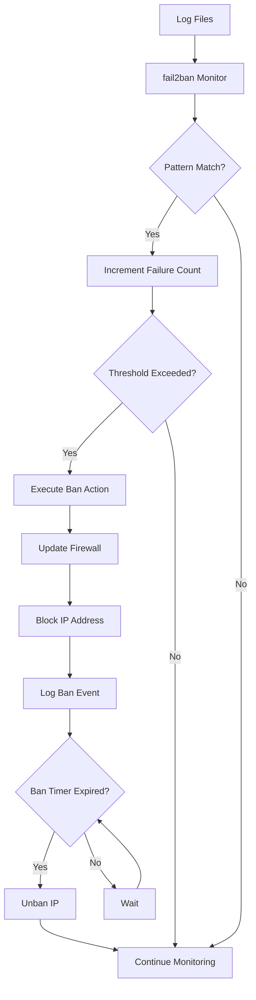
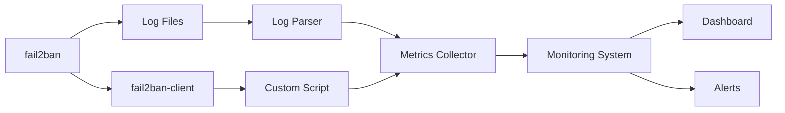

# How to Configure fail2ban for Intrusion Prevention

Author: [nawazdhandala](https://www.github.com/nawazdhandala)

Tags: Linux, Security, fail2ban, Intrusion Prevention, SSH, Firewall, System Administration

Description: A comprehensive guide to installing, configuring, and managing fail2ban to protect Linux servers from brute-force attacks and unauthorized access attempts.

---

> fail2ban is an intrusion prevention framework that monitors log files for malicious activity and automatically bans offending IP addresses using firewall rules. It is essential for protecting internet-facing services from brute-force attacks.

This guide walks you through fail2ban installation, configuration, and best practices for protecting SSH, web servers, and other services on your Linux systems.

---

## How fail2ban Works



---

## Installation

### Debian/Ubuntu

```bash
# Update package list and install fail2ban
apt-get update
apt-get install -y fail2ban

# fail2ban starts automatically after installation
# Check the status
systemctl status fail2ban
```

### RHEL/CentOS/Rocky Linux

```bash
# Enable EPEL repository (required for fail2ban)
dnf install -y epel-release

# Install fail2ban
dnf install -y fail2ban

# Start and enable fail2ban service
systemctl start fail2ban
systemctl enable fail2ban
```

---

## Configuration Structure

fail2ban uses multiple configuration files with a specific hierarchy:

```
/etc/fail2ban/
  ├── fail2ban.conf     # Main configuration (do not modify)
  ├── fail2ban.local    # Local overrides for fail2ban.conf
  ├── jail.conf         # Default jail definitions (do not modify)
  ├── jail.local        # Local jail overrides (create this)
  ├── jail.d/           # Additional jail configurations
  │   └── *.conf        # Drop-in jail files
  ├── filter.d/         # Filter definitions (regex patterns)
  │   ├── sshd.conf
  │   ├── apache-auth.conf
  │   └── ...
  └── action.d/         # Ban action definitions
      ├── iptables.conf
      ├── nftables.conf
      └── ...
```

**Important**: Never modify `.conf` files directly. Create `.local` files or add files to `.d` directories for customization. This preserves your changes during package updates.

---

## Basic Configuration

### Create jail.local

```bash
# Create the main local configuration file
# This file overrides settings from jail.conf
cat > /etc/fail2ban/jail.local << 'EOF'
# fail2ban local configuration
# All settings here override jail.conf

[DEFAULT]
# Ban IP for 1 hour (3600 seconds)
# Increase for repeat offenders using bantime.increment
bantime = 1h

# Time window to count failures
# Failures outside this window are not counted
findtime = 10m

# Number of failures before ban
# Lower values are more aggressive
maxretry = 5

# Backend for log monitoring
# auto = best available (systemd, pyinotify, or polling)
backend = auto

# Email notifications (optional)
# Uncomment and configure if you want email alerts
# destemail = admin@example.com
# sender = fail2ban@example.com
# mta = sendmail

# Ban action - uses iptables by default
# For nftables: banaction = nftables-multiport
banaction = iptables-multiport

# Ignore these IP addresses (whitelist)
# Add your trusted IPs here
ignoreip = 127.0.0.1/8 ::1

# Enable ban time increment for repeat offenders
bantime.increment = true
bantime.factor = 2
bantime.maxtime = 1w

[sshd]
# SSH jail - enabled by default
enabled = true
port = ssh
filter = sshd
logpath = /var/log/auth.log
maxretry = 3
bantime = 1h
EOF
```

### Verify Configuration

```bash
# Check fail2ban configuration for errors
# This validates syntax before applying changes
fail2ban-client -t

# Reload fail2ban to apply changes
fail2ban-client reload

# Check status of all jails
fail2ban-client status
```

---

## Protecting SSH

### Enhanced SSH Jail Configuration

```bash
# Create a dedicated SSH jail configuration
cat > /etc/fail2ban/jail.d/sshd.local << 'EOF'
[sshd]
enabled = true
port = ssh
filter = sshd
logpath = %(sshd_log)s

# Aggressive settings for SSH
# SSH brute-force is common and dangerous
maxretry = 3
findtime = 10m
bantime = 1h

# Ban time increases with repeat offenses
# First ban: 1h, second: 2h, third: 4h, etc.
bantime.increment = true
bantime.factor = 2
bantime.maxtime = 1w

# Mode can be: normal, ddos, or aggressive
# aggressive mode catches more patterns
mode = aggressive

[sshd-ddos]
# Additional jail for SSH DDoS patterns
enabled = true
port = ssh
filter = sshd-ddos
logpath = %(sshd_log)s
maxretry = 10
findtime = 30s
bantime = 1h
EOF
```

### Custom SSH Filter (Optional)

```bash
# Create a stricter SSH filter if needed
# This catches additional attack patterns
cat > /etc/fail2ban/filter.d/sshd-strict.local << 'EOF'
# Custom SSH filter for additional patterns
[INCLUDES]
before = sshd.conf

[Definition]
# Additional failure patterns
failregex = %(known/failregex)s
            ^%(__prefix_line)s(?:error: )?maximum authentication attempts exceeded for .* from <HOST>

# Ignore these patterns (reduce false positives)
ignoreregex = ^%(__prefix_line)sConnection closed by authenticating user .* \[preauth\]$
EOF
```

---

## Protecting Web Servers

### Apache Configuration

```bash
# Apache authentication protection
cat > /etc/fail2ban/jail.d/apache.local << 'EOF'
[apache-auth]
# Protects against HTTP basic auth brute-force
enabled = true
port = http,https
filter = apache-auth
logpath = /var/log/apache2/*error.log
maxretry = 5
bantime = 1h

[apache-badbots]
# Block known malicious bots and scanners
enabled = true
port = http,https
filter = apache-badbots
logpath = /var/log/apache2/*access.log
maxretry = 2
bantime = 24h

[apache-noscript]
# Block attempts to access scripts that do not exist
enabled = true
port = http,https
filter = apache-noscript
logpath = /var/log/apache2/*error.log
maxretry = 5
bantime = 1h

[apache-overflows]
# Block buffer overflow attempts
enabled = true
port = http,https
filter = apache-overflows
logpath = /var/log/apache2/*error.log
maxretry = 2
bantime = 24h
EOF
```

### Nginx Configuration

```bash
# Nginx protection
cat > /etc/fail2ban/jail.d/nginx.local << 'EOF'
[nginx-http-auth]
# HTTP basic authentication failures
enabled = true
port = http,https
filter = nginx-http-auth
logpath = /var/log/nginx/*error.log
maxretry = 5
bantime = 1h

[nginx-botsearch]
# Block bot scanning for vulnerabilities
enabled = true
port = http,https
filter = nginx-botsearch
logpath = /var/log/nginx/*access.log
maxretry = 2
bantime = 24h

[nginx-limit-req]
# Block IPs hitting rate limits
enabled = true
port = http,https
filter = nginx-limit-req
logpath = /var/log/nginx/*error.log
maxretry = 10
findtime = 1m
bantime = 1h
EOF
```

### Custom Nginx Rate Limit Filter

```bash
# Create filter for nginx rate limiting
cat > /etc/fail2ban/filter.d/nginx-limit-req.conf << 'EOF'
# Filter for nginx rate limit exceeded messages
[Definition]
failregex = limiting requests, excess: .* by zone .*, client: <HOST>

ignoreregex =
EOF
```

---

## Protecting Other Services

### Postfix Mail Server

```bash
cat > /etc/fail2ban/jail.d/postfix.local << 'EOF'
[postfix]
enabled = true
port = smtp,465,submission
filter = postfix
logpath = /var/log/mail.log
maxretry = 5
bantime = 1h

[postfix-sasl]
# SMTP authentication failures
enabled = true
port = smtp,465,submission,imap,imaps,pop3,pop3s
filter = postfix-sasl
logpath = /var/log/mail.log
maxretry = 3
bantime = 1h
EOF
```

### MySQL/MariaDB

```bash
cat > /etc/fail2ban/jail.d/mysql.local << 'EOF'
[mysqld-auth]
enabled = true
port = 3306
filter = mysqld-auth
logpath = /var/log/mysql/error.log
maxretry = 5
bantime = 1h
EOF
```

---

## Advanced Configuration

### Ban Time Increment (Recidive)

```bash
# Configure progressive ban times for repeat offenders
cat > /etc/fail2ban/jail.d/recidive.local << 'EOF'
[recidive]
# Ban IPs that get banned repeatedly
enabled = true
filter = recidive
logpath = /var/log/fail2ban.log
action = %(action_mwl)s

# Trigger after 5 bans from any jail
maxretry = 5

# Within 1 day
findtime = 1d

# Ban for 1 week
bantime = 1w

# Whitelist your own IPs
ignoreip = 127.0.0.1/8 ::1 10.0.0.0/8 192.168.0.0/16
EOF
```

### Custom Action with Notifications

```bash
# Create a custom action that sends notifications
cat > /etc/fail2ban/action.d/notify.local << 'EOF'
# Custom notification action
[Definition]
actionstart =
actionstop =
actioncheck =

# Called when banning an IP
actionban = /usr/local/bin/notify_ban.sh ban <ip> <name>

# Called when unbanning an IP
actionunban = /usr/local/bin/notify_ban.sh unban <ip> <name>
EOF

# Create the notification script
cat > /usr/local/bin/notify_ban.sh << 'EOF'
#!/bin/bash
# Notification script for fail2ban actions

ACTION="$1"
IP="$2"
JAIL="$3"
TIMESTAMP=$(date '+%Y-%m-%d %H:%M:%S')

# Log to file
echo "$TIMESTAMP - $ACTION - IP: $IP - Jail: $JAIL" >> /var/log/fail2ban-notify.log

# Send to webhook (example for Slack)
# Uncomment and configure your webhook URL
# curl -X POST -H 'Content-type: application/json' \
#     --data "{\"text\":\"fail2ban: $ACTION $IP from $JAIL\"}" \
#     https://hooks.slack.com/services/YOUR/WEBHOOK/URL

# Send email (requires mailutils)
# echo "fail2ban: $ACTION $IP from $JAIL at $TIMESTAMP" | \
#     mail -s "fail2ban alert" admin@example.com
EOF

chmod +x /usr/local/bin/notify_ban.sh
```

---

## Managing fail2ban

### Common Commands

```bash
# Check overall status
fail2ban-client status

# Check specific jail status
fail2ban-client status sshd

# Example output:
# Status for the jail: sshd
# |- Filter
# |  |- Currently failed: 3
# |  |- Total failed:     127
# |  `- Journal matches:  _SYSTEMD_UNIT=sshd.service
# `- Actions
#    |- Currently banned: 2
#    |- Total banned:     15
#    `- Banned IP list:   192.0.2.1 198.51.100.1

# Manually ban an IP
fail2ban-client set sshd banip 192.0.2.100

# Unban an IP
fail2ban-client set sshd unbanip 192.0.2.100

# Get current banned IPs for a jail
fail2ban-client get sshd banip

# Reload all jails
fail2ban-client reload

# Reload specific jail
fail2ban-client reload sshd
```

### Testing Filters

```bash
# Test a filter against a log file
# This shows what would be matched without making changes
fail2ban-regex /var/log/auth.log /etc/fail2ban/filter.d/sshd.conf

# Test with verbose output
fail2ban-regex /var/log/auth.log /etc/fail2ban/filter.d/sshd.conf --print-all-matched

# Test a specific log line
echo "Failed password for invalid user admin from 192.0.2.1 port 22 ssh2" | \
    fail2ban-regex - /etc/fail2ban/filter.d/sshd.conf
```

---

## Monitoring and Logging

### Log Analysis Script

```bash
#!/bin/bash
# fail2ban_report.sh - Generate fail2ban activity report

echo "=========================================="
echo "fail2ban Activity Report"
echo "Generated: $(date)"
echo "=========================================="
echo

# Overall status
echo "=== Jail Status ==="
fail2ban-client status | tail -n +2

echo
echo "=== Per-Jail Statistics ==="
for jail in $(fail2ban-client status | grep "Jail list" | sed 's/.*://;s/,//g'); do
    echo
    echo "--- $jail ---"
    fail2ban-client status "$jail" | tail -n +2
done

echo
echo "=== Recent Bans (Last 24 hours) ==="
grep "Ban " /var/log/fail2ban.log | tail -20

echo
echo "=== Top Banned IPs ==="
grep "Ban " /var/log/fail2ban.log | awk '{print $NF}' | sort | uniq -c | sort -rn | head -10

echo
echo "=== Ban Statistics by Jail ==="
grep "Ban " /var/log/fail2ban.log | awk -F'[][]' '{print $2}' | sort | uniq -c | sort -rn
```

### Integration with System Monitoring



---

## Best Practices

### 1. Whitelist Trusted IPs

```bash
# Always whitelist your own IPs to prevent lockout
# Add to [DEFAULT] section in jail.local
ignoreip = 127.0.0.1/8 ::1 10.0.0.0/8 192.168.0.0/16 YOUR.OFFICE.IP.ADDRESS
```

### 2. Use Appropriate Ban Times

```bash
# Start with shorter ban times and increase for repeat offenders
bantime = 10m        # Initial ban
bantime.increment = true
bantime.factor = 2   # Double each time
bantime.maxtime = 1w # Maximum 1 week
```

### 3. Monitor for False Positives

```bash
# Regularly check banned IPs
fail2ban-client status sshd

# Review fail2ban logs for patterns
grep "Ban\|Unban" /var/log/fail2ban.log | tail -50

# Check for legitimate users being banned
# Cross-reference with application logs
```

### 4. Combine with Other Security Measures

- Use SSH key authentication instead of passwords
- Run SSH on a non-standard port
- Implement rate limiting at the application level
- Use a Web Application Firewall (WAF)

---

## Troubleshooting

### fail2ban Not Banning

```bash
# Check if the jail is enabled
fail2ban-client status jail-name

# Test the filter
fail2ban-regex /var/log/auth.log /etc/fail2ban/filter.d/sshd.conf

# Check log file permissions
ls -la /var/log/auth.log

# Verify fail2ban can read logs
tail -f /var/log/fail2ban.log
```

### Bans Not Persisting After Restart

```bash
# Enable persistent bans with SQLite database
# Add to [DEFAULT] in jail.local
dbfile = /var/lib/fail2ban/fail2ban.sqlite3
dbpurgeage = 1d
```

### High Resource Usage

```bash
# Reduce log polling frequency
# Add to jail.local [DEFAULT] section
backend = systemd    # Use systemd journal instead of file polling

# Or if using file backend, reduce frequency
backend = polling
polltime = 10        # Poll every 10 seconds instead of default
```

---

## Conclusion

fail2ban is a powerful and essential tool for protecting Linux servers from brute-force attacks. By properly configuring jails for each service, implementing progressive ban times, and monitoring activity, you can significantly reduce the risk of unauthorized access to your systems.

Remember to regularly review banned IPs and adjust thresholds to balance security with usability. Combine fail2ban with other security measures like strong authentication, firewall rules, and intrusion detection systems for comprehensive protection.
