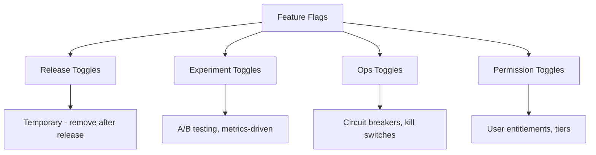
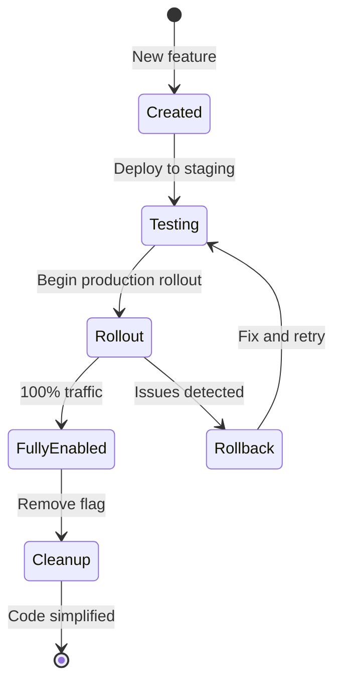

# How to Handle Feature Flag Implementation

Author: [nawazdhandala](https://www.github.com/nawazdhandala)

Tags: Feature Flags, Feature Toggles, Progressive Delivery, DevOps, LaunchDarkly, Unleash, A/B Testing

Description: A comprehensive guide to implementing feature flags in production applications, covering architecture patterns, SDK integration, and best practices for managing feature toggles at scale.

---

Feature flags let you decouple deployment from release. You can deploy code to production but keep it hidden behind a flag until you are ready to release it. This enables safer rollouts, A/B testing, and quick rollbacks without redeploying. This guide covers implementing feature flags from simple boolean toggles to sophisticated targeting systems.

## Understanding Feature Flag Types

Feature flags serve different purposes depending on your use case. Understanding the types helps you choose the right approach.



Release toggles are temporary and should be removed after the feature is fully rolled out. Ops toggles might stay forever as circuit breakers. Understanding this helps you manage technical debt.

## Implementing a Simple Feature Flag System

Start with a basic implementation before adopting a full-featured service. This helps you understand the concepts.

```python
# feature_flags.py - Simple file-based feature flags
import json
import os
from functools import wraps
from typing import Any, Callable, Dict, Optional

class FeatureFlags:
    def __init__(self, config_path: str = "features.json"):
        self.config_path = config_path
        self._flags: Dict[str, Any] = {}
        self._load_flags()

    def _load_flags(self) -> None:
        """Load flags from configuration file."""
        try:
            with open(self.config_path) as f:
                self._flags = json.load(f)
        except FileNotFoundError:
            self._flags = {}

    def is_enabled(
        self,
        flag_name: str,
        user_id: Optional[str] = None,
        default: bool = False
    ) -> bool:
        """Check if a feature flag is enabled."""
        flag = self._flags.get(flag_name)

        if flag is None:
            return default

        # Simple boolean flag
        if isinstance(flag, bool):
            return flag

        # Percentage rollout
        if isinstance(flag, dict):
            if "percentage" in flag:
                if user_id:
                    # Consistent hashing for user
                    hash_value = hash(f"{flag_name}:{user_id}") % 100
                    return hash_value < flag["percentage"]
                return default

            # User targeting
            if "users" in flag and user_id:
                return user_id in flag["users"]

            # Default enabled state
            return flag.get("enabled", default)

        return default

    def get_variant(
        self,
        flag_name: str,
        user_id: Optional[str] = None,
        default: str = "control"
    ) -> str:
        """Get the variant for an A/B test flag."""
        flag = self._flags.get(flag_name)

        if not flag or not isinstance(flag, dict):
            return default

        variants = flag.get("variants", [])
        if not variants:
            return default

        if user_id:
            # Consistent assignment based on user
            hash_value = hash(f"{flag_name}:{user_id}") % 100
            cumulative = 0
            for variant in variants:
                cumulative += variant.get("weight", 0)
                if hash_value < cumulative:
                    return variant["name"]

        return default


# Decorator for feature-flagged functions
def feature_flag(
    flag_name: str,
    fallback: Optional[Callable] = None
):
    """Decorator to wrap a function with a feature flag."""
    def decorator(func: Callable) -> Callable:
        @wraps(func)
        def wrapper(*args, **kwargs):
            flags = FeatureFlags()
            user_id = kwargs.get("user_id")

            if flags.is_enabled(flag_name, user_id=user_id):
                return func(*args, **kwargs)
            elif fallback:
                return fallback(*args, **kwargs)
            else:
                return None
        return wrapper
    return decorator
```

Configuration file:

```json
{
  "new_checkout_flow": true,
  "dark_mode": {
    "enabled": true,
    "users": ["user_123", "user_456"]
  },
  "recommendation_engine": {
    "percentage": 25
  },
  "pricing_experiment": {
    "variants": [
      {"name": "control", "weight": 50},
      {"name": "variant_a", "weight": 25},
      {"name": "variant_b", "weight": 25}
    ]
  }
}
```

Usage example:

```python
# Using the feature flag system
flags = FeatureFlags()

# Simple check
if flags.is_enabled("new_checkout_flow"):
    render_new_checkout()
else:
    render_old_checkout()

# User-targeted rollout
if flags.is_enabled("dark_mode", user_id=current_user.id):
    apply_dark_theme()

# A/B test variant
variant = flags.get_variant("pricing_experiment", user_id=current_user.id)
if variant == "variant_a":
    show_monthly_pricing()
elif variant == "variant_b":
    show_annual_pricing()
else:
    show_default_pricing()

# Using the decorator
@feature_flag("new_search", fallback=old_search)
def new_search(query: str, user_id: str = None):
    return advanced_search_engine(query)
```

## Integrating with Unleash

Unleash is an open-source feature flag service you can self-host. Here is how to integrate it.

```bash
# Deploy Unleash with Docker Compose
version: "3.8"
services:
  unleash:
    image: unleashorg/unleash-server:latest
    ports:
      - "4242:4242"
    environment:
      DATABASE_URL: postgres://unleash:unleash@db:5432/unleash
      DATABASE_SSL: "false"
    depends_on:
      - db

  db:
    image: postgres:15
    environment:
      POSTGRES_USER: unleash
      POSTGRES_PASSWORD: unleash
      POSTGRES_DB: unleash
    volumes:
      - unleash-data:/var/lib/postgresql/data

volumes:
  unleash-data:
```

Python SDK integration:

```python
# unleash_client.py
from UnleashClient import UnleashClient
from typing import Optional, Dict, Any

class FeatureFlagService:
    def __init__(
        self,
        url: str = "http://unleash:4242/api",
        app_name: str = "myapp",
        environment: str = "production"
    ):
        self.client = UnleashClient(
            url=url,
            app_name=app_name,
            environment=environment,
            refresh_interval=15,  # Seconds between flag updates
            metrics_interval=60   # Seconds between metrics reports
        )
        self.client.initialize_client()

    def is_enabled(
        self,
        feature_name: str,
        context: Optional[Dict[str, Any]] = None
    ) -> bool:
        """Check if feature is enabled for the given context."""
        return self.client.is_enabled(
            feature_name,
            context=context or {}
        )

    def get_variant(
        self,
        feature_name: str,
        context: Optional[Dict[str, Any]] = None
    ) -> Dict[str, Any]:
        """Get the variant for A/B testing."""
        return self.client.get_variant(
            feature_name,
            context=context or {}
        )


# Usage in a Flask application
from flask import Flask, g, request

app = Flask(__name__)
flags = FeatureFlagService()

@app.before_request
def set_feature_context():
    """Set up feature flag context for each request."""
    g.feature_context = {
        "userId": request.headers.get("X-User-ID"),
        "sessionId": request.cookies.get("session_id"),
        "remoteAddress": request.remote_addr,
        "properties": {
            "plan": request.headers.get("X-User-Plan", "free"),
            "country": request.headers.get("X-Country", "US")
        }
    }

@app.route("/api/recommendations")
def get_recommendations():
    if flags.is_enabled("ml_recommendations", g.feature_context):
        return ml_recommendation_engine()
    return simple_recommendations()
```

## Implementing Feature Flags in Kubernetes

For Kubernetes applications, you can manage feature flags through ConfigMaps.

```yaml
# feature-flags-configmap.yaml
apiVersion: v1
kind: ConfigMap
metadata:
  name: feature-flags
  namespace: myapp
data:
  flags.json: |
    {
      "new_api_version": {
        "enabled": true,
        "percentage": 50
      },
      "enhanced_logging": true,
      "beta_features": {
        "users": ["enterprise_customer_1", "enterprise_customer_2"]
      }
    }
```

Mount and watch for changes:

```yaml
# deployment.yaml
apiVersion: apps/v1
kind: Deployment
metadata:
  name: myapp
  annotations:
    reloader.stakater.com/auto: "true"
spec:
  template:
    spec:
      containers:
        - name: myapp
          image: myapp:latest
          volumeMounts:
            - name: feature-flags
              mountPath: /etc/feature-flags
              readOnly: true
          env:
            - name: FEATURE_FLAGS_PATH
              value: /etc/feature-flags/flags.json
      volumes:
        - name: feature-flags
          configMap:
            name: feature-flags
```

Application code that watches for changes:

```python
# config_watcher.py
import json
import time
import threading
from watchdog.observers import Observer
from watchdog.events import FileSystemEventHandler

class FeatureFlagWatcher(FileSystemEventHandler):
    def __init__(self, flag_service):
        self.flag_service = flag_service

    def on_modified(self, event):
        if event.src_path.endswith("flags.json"):
            self.flag_service.reload()

class DynamicFeatureFlags:
    def __init__(self, config_path: str):
        self.config_path = config_path
        self._flags = {}
        self._lock = threading.Lock()
        self._load_flags()
        self._start_watcher()

    def _load_flags(self):
        with self._lock:
            with open(self.config_path) as f:
                self._flags = json.load(f)

    def reload(self):
        """Reload flags from disk."""
        self._load_flags()
        print("Feature flags reloaded")

    def _start_watcher(self):
        """Start watching for file changes."""
        observer = Observer()
        handler = FeatureFlagWatcher(self)
        observer.schedule(
            handler,
            path=os.path.dirname(self.config_path),
            recursive=False
        )
        observer.start()

    def is_enabled(self, flag_name: str, **context) -> bool:
        with self._lock:
            return self._evaluate_flag(flag_name, context)
```

## Managing Feature Flag Lifecycle

Feature flags accumulate over time. Without proper management, they become technical debt.



Track flag metadata:

```python
# feature_flag_registry.py
from dataclasses import dataclass
from datetime import datetime
from enum import Enum
from typing import Optional

class FlagType(Enum):
    RELEASE = "release"
    EXPERIMENT = "experiment"
    OPS = "ops"
    PERMISSION = "permission"

@dataclass
class FlagMetadata:
    name: str
    flag_type: FlagType
    owner: str
    created_at: datetime
    expires_at: Optional[datetime]
    jira_ticket: Optional[str]
    description: str

# Registry of all flags with metadata
FLAG_REGISTRY = {
    "new_checkout_flow": FlagMetadata(
        name="new_checkout_flow",
        flag_type=FlagType.RELEASE,
        owner="checkout-team",
        created_at=datetime(2026, 1, 15),
        expires_at=datetime(2026, 2, 15),  # Must be removed by this date
        jira_ticket="CHECKOUT-1234",
        description="New streamlined checkout experience"
    ),
    "circuit_breaker_payments": FlagMetadata(
        name="circuit_breaker_payments",
        flag_type=FlagType.OPS,
        owner="platform-team",
        created_at=datetime(2025, 6, 1),
        expires_at=None,  # Permanent flag
        jira_ticket=None,
        description="Kill switch for payment processing"
    )
}

def get_stale_flags(days_old: int = 30):
    """Find flags that should be cleaned up."""
    now = datetime.now()
    stale = []

    for name, meta in FLAG_REGISTRY.items():
        if meta.flag_type == FlagType.RELEASE:
            age = (now - meta.created_at).days
            if age > days_old:
                stale.append((name, meta, age))

    return stale
```

## Testing with Feature Flags

Feature flags require special testing strategies to ensure all code paths work correctly.

```python
# test_features.py
import pytest
from unittest.mock import patch, MagicMock

class TestFeatureFlaggedCode:

    @pytest.fixture
    def mock_flags(self):
        """Create a mock feature flag service."""
        with patch("myapp.flags.FeatureFlags") as mock:
            yield mock.return_value

    def test_new_feature_enabled(self, mock_flags):
        """Test behavior when feature is enabled."""
        mock_flags.is_enabled.return_value = True

        result = process_order(order_id="123")

        assert result.used_new_flow is True
        mock_flags.is_enabled.assert_called_with(
            "new_checkout_flow",
            user_id="user_123"
        )

    def test_new_feature_disabled(self, mock_flags):
        """Test fallback behavior when feature is disabled."""
        mock_flags.is_enabled.return_value = False

        result = process_order(order_id="123")

        assert result.used_new_flow is False

    @pytest.mark.parametrize("variant,expected_price", [
        ("control", 9.99),
        ("variant_a", 7.99),
        ("variant_b", 12.99),
    ])
    def test_pricing_variants(self, mock_flags, variant, expected_price):
        """Test all A/B test variants."""
        mock_flags.get_variant.return_value = {"name": variant}

        price = calculate_price(product_id="prod_123", user_id="user_123")

        assert price == expected_price


# Integration test that cycles through flag states
class TestFeatureFlagIntegration:

    def test_feature_rollout_simulation(self, test_client, test_db):
        """Simulate a feature rollout through all stages."""
        flag_states = [
            {"percentage": 0},    # Not rolled out
            {"percentage": 10},   # Initial rollout
            {"percentage": 50},   # Wider rollout
            {"percentage": 100},  # Full rollout
        ]

        for state in flag_states:
            with override_flag("new_feature", state):
                # Run integration tests at each rollout stage
                response = test_client.get("/api/endpoint")
                assert response.status_code == 200
```

## Best Practices

**Keep flags short-lived** - Release toggles should be removed within weeks of full rollout. Set expiration dates and track them.

**Use consistent naming** - Adopt a naming convention like `feature_name_purpose` (e.g., `checkout_v2_release`, `search_algorithm_experiment`).

**Default to off** - New flags should default to disabled in production. This prevents accidental exposure of incomplete features.

**Log flag evaluations** - Record which flags were evaluated for each request. This helps with debugging and understanding feature usage.

```python
# Logging flag evaluations
import structlog

logger = structlog.get_logger()

def is_enabled_with_logging(flag_name: str, context: dict) -> bool:
    result = flags.is_enabled(flag_name, context)

    logger.info(
        "feature_flag_evaluated",
        flag=flag_name,
        enabled=result,
        user_id=context.get("userId"),
        request_id=context.get("requestId")
    )

    return result
```

Feature flags transform how you ship software. Start with simple boolean flags and evolve to more sophisticated targeting as your needs grow. Remember that every flag is technical debt until removed, so plan for cleanup from the start.
