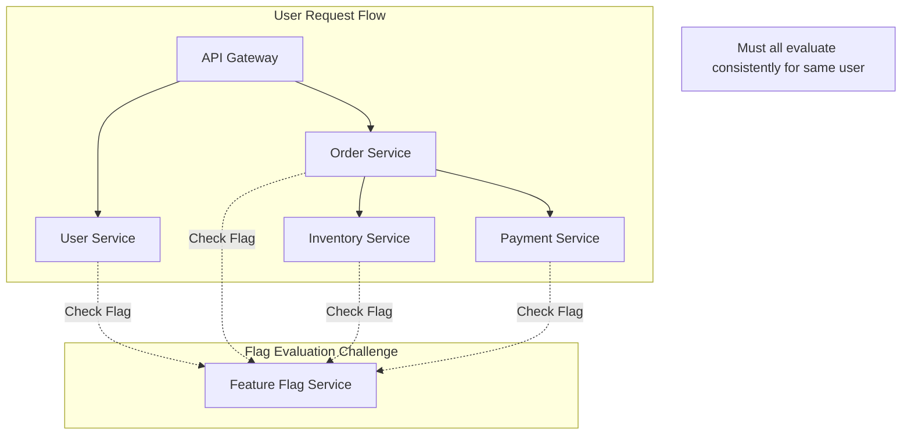
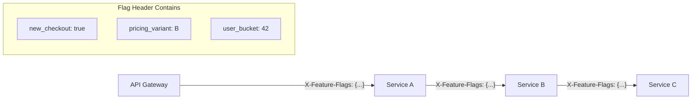
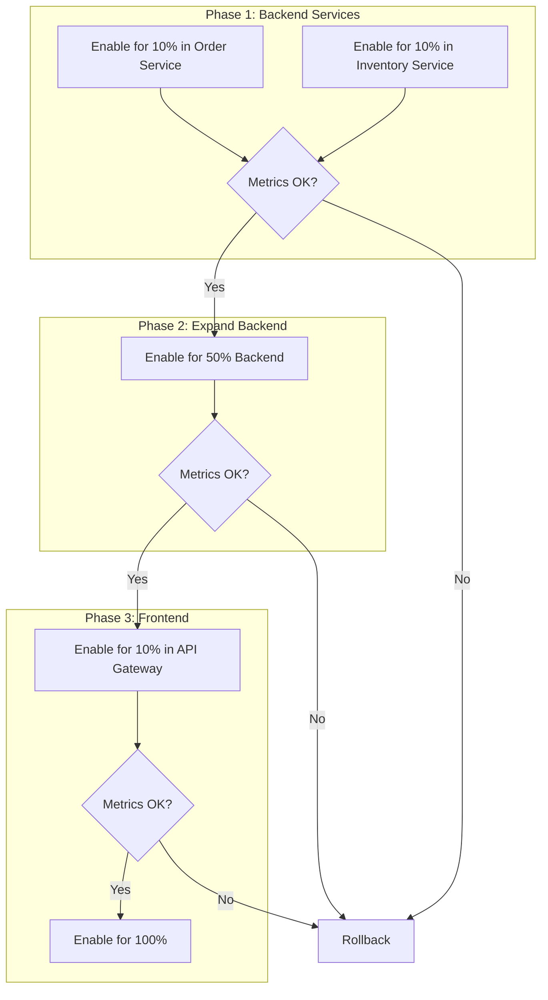

# How to Handle Feature Flags in Microservices

Author: [nawazdhandala](https://www.github.com/nawazdhandala)

Tags: Feature Flags, Microservices, Distributed Systems, Progressive Delivery, Configuration Management, A/B Testing

Description: A comprehensive guide to implementing and managing feature flags across microservices architectures, covering consistency, propagation, and testing strategies.

---

Feature flags in microservices present unique challenges compared to monolithic applications. When a feature spans multiple services, you need consistent flag evaluation, cross-service propagation, and careful coordination during rollouts. This guide covers practical patterns for implementing feature flags that work reliably across distributed systems.

## The Challenge of Distributed Feature Flags

In a microservices architecture, a single user request often touches multiple services. Feature flags must evaluate consistently across all these services.



## Architecture Patterns

### Pattern 1: Centralized Flag Service

A dedicated service handles all flag evaluations, ensuring consistency.

```python
# flag_service.py - Centralized feature flag service
from fastapi import FastAPI, HTTPException
from pydantic import BaseModel
from typing import Dict, List, Optional, Any
import hashlib
import json
from datetime import datetime

app = FastAPI()

class FlagContext(BaseModel):
    user_id: str
    session_id: Optional[str] = None
    attributes: Dict[str, Any] = {}

class FlagEvaluation(BaseModel):
    flag_name: str
    enabled: bool
    variant: Optional[str] = None
    reason: str

class FeatureFlagStore:
    def __init__(self):
        self.flags = {}
        self.evaluation_cache = {}

    def load_flags(self, config: Dict):
        """Load flag configurations."""
        self.flags = config

    def evaluate(
        self,
        flag_name: str,
        context: FlagContext
    ) -> FlagEvaluation:
        """Evaluate a flag for the given context."""
        flag = self.flags.get(flag_name)

        if not flag:
            return FlagEvaluation(
                flag_name=flag_name,
                enabled=False,
                reason="flag_not_found"
            )

        # Check if globally disabled
        if not flag.get("enabled", True):
            return FlagEvaluation(
                flag_name=flag_name,
                enabled=False,
                reason="globally_disabled"
            )

        # Check user targeting
        if context.user_id in flag.get("enabled_users", []):
            return FlagEvaluation(
                flag_name=flag_name,
                enabled=True,
                reason="user_targeted"
            )

        # Check percentage rollout
        if "percentage" in flag:
            bucket = self._get_bucket(flag_name, context.user_id)
            enabled = bucket < flag["percentage"]
            return FlagEvaluation(
                flag_name=flag_name,
                enabled=enabled,
                variant=self._get_variant(flag, bucket) if enabled else None,
                reason="percentage_rollout"
            )

        return FlagEvaluation(
            flag_name=flag_name,
            enabled=flag.get("default", False),
            reason="default_value"
        )

    def _get_bucket(self, flag_name: str, user_id: str) -> int:
        """Get consistent bucket (0-99) for user."""
        hash_input = f"{flag_name}:{user_id}"
        hash_value = hashlib.md5(hash_input.encode()).hexdigest()
        return int(hash_value[:8], 16) % 100

    def _get_variant(self, flag: Dict, bucket: int) -> Optional[str]:
        """Determine variant for A/B tests."""
        variants = flag.get("variants", [])
        if not variants:
            return None

        cumulative = 0
        for variant in variants:
            cumulative += variant["weight"]
            if bucket < cumulative:
                return variant["name"]
        return variants[-1]["name"]

store = FeatureFlagStore()

@app.post("/evaluate", response_model=FlagEvaluation)
async def evaluate_flag(flag_name: str, context: FlagContext):
    """Evaluate a single flag."""
    return store.evaluate(flag_name, context)

@app.post("/evaluate-batch", response_model=List[FlagEvaluation])
async def evaluate_batch(flag_names: List[str], context: FlagContext):
    """Evaluate multiple flags in one call."""
    return [store.evaluate(name, context) for name in flag_names]
```

### Pattern 2: SDK with Local Caching

Each service uses an SDK that caches flags locally, reducing latency and improving resilience.

```python
# feature_flag_sdk.py - SDK for microservices
import threading
import time
import requests
from typing import Dict, Optional, Any
from dataclasses import dataclass
from functools import lru_cache
import logging

logger = logging.getLogger(__name__)

@dataclass
class EvaluationContext:
    user_id: str
    session_id: Optional[str] = None
    attributes: Dict[str, Any] = None

    def to_dict(self) -> Dict:
        return {
            "user_id": self.user_id,
            "session_id": self.session_id,
            "attributes": self.attributes or {}
        }

class FeatureFlagClient:
    def __init__(
        self,
        service_url: str,
        api_key: str,
        cache_ttl_seconds: int = 60,
        fallback_flags: Dict[str, bool] = None
    ):
        self.service_url = service_url
        self.api_key = api_key
        self.cache_ttl = cache_ttl_seconds
        self.fallback_flags = fallback_flags or {}

        self._cache: Dict[str, Any] = {}
        self._cache_timestamps: Dict[str, float] = {}
        self._lock = threading.Lock()

        # Start background refresh
        self._start_background_refresh()

    def is_enabled(
        self,
        flag_name: str,
        context: EvaluationContext,
        default: bool = False
    ) -> bool:
        """Check if a flag is enabled for the given context."""
        try:
            evaluation = self._evaluate(flag_name, context)
            return evaluation.get("enabled", default)
        except Exception as e:
            logger.error(f"Flag evaluation failed: {e}")
            return self.fallback_flags.get(flag_name, default)

    def get_variant(
        self,
        flag_name: str,
        context: EvaluationContext,
        default: str = "control"
    ) -> str:
        """Get the variant for an A/B test."""
        try:
            evaluation = self._evaluate(flag_name, context)
            return evaluation.get("variant") or default
        except Exception as e:
            logger.error(f"Variant evaluation failed: {e}")
            return default

    def _evaluate(
        self,
        flag_name: str,
        context: EvaluationContext
    ) -> Dict:
        """Evaluate flag, using cache when possible."""
        cache_key = f"{flag_name}:{context.user_id}"

        # Check cache
        with self._lock:
            if cache_key in self._cache:
                timestamp = self._cache_timestamps.get(cache_key, 0)
                if time.time() - timestamp < self.cache_ttl:
                    return self._cache[cache_key]

        # Fetch from service
        response = requests.post(
            f"{self.service_url}/evaluate",
            params={"flag_name": flag_name},
            json=context.to_dict(),
            headers={"Authorization": f"Bearer {self.api_key}"},
            timeout=1.0
        )
        response.raise_for_status()
        result = response.json()

        # Update cache
        with self._lock:
            self._cache[cache_key] = result
            self._cache_timestamps[cache_key] = time.time()

        return result

    def _start_background_refresh(self):
        """Periodically refresh cached flags."""
        def refresh_loop():
            while True:
                time.sleep(self.cache_ttl / 2)
                self._refresh_cache()

        thread = threading.Thread(target=refresh_loop, daemon=True)
        thread.start()

    def _refresh_cache(self):
        """Refresh all cached flags."""
        with self._lock:
            keys_to_refresh = list(self._cache.keys())

        for key in keys_to_refresh:
            try:
                flag_name, user_id = key.rsplit(":", 1)
                context = EvaluationContext(user_id=user_id)
                self._evaluate(flag_name, context)
            except Exception as e:
                logger.warning(f"Failed to refresh flag {key}: {e}")


# Middleware for request-scoped context
from contextvars import ContextVar

_current_context: ContextVar[Optional[EvaluationContext]] = ContextVar(
    'feature_flag_context',
    default=None
)

def set_flag_context(context: EvaluationContext):
    """Set the feature flag context for the current request."""
    _current_context.set(context)

def get_flag_context() -> Optional[EvaluationContext]:
    """Get the current feature flag context."""
    return _current_context.get()


# Flask middleware example
from flask import Flask, g, request

def init_feature_flags(app: Flask, client: FeatureFlagClient):
    @app.before_request
    def set_context():
        context = EvaluationContext(
            user_id=request.headers.get("X-User-ID", "anonymous"),
            session_id=request.headers.get("X-Session-ID"),
            attributes={
                "plan": request.headers.get("X-User-Plan", "free"),
                "country": request.headers.get("X-Country")
            }
        )
        set_flag_context(context)
        g.feature_flags = client
```

### Pattern 3: Context Propagation Across Services

Pass flag decisions through service boundaries to ensure consistency.



```python
# context_propagation.py - Propagate flag decisions across services
import json
import base64
from typing import Dict, Any, Optional
from dataclasses import dataclass, asdict
import hmac
import hashlib

@dataclass
class FeatureFlagHeader:
    user_id: str
    bucket: int  # 0-99 for consistent hashing
    evaluated_flags: Dict[str, Any]
    timestamp: float

    def to_header(self, signing_key: str) -> str:
        """Serialize to HTTP header value."""
        data = json.dumps(asdict(self))
        encoded = base64.b64encode(data.encode()).decode()

        # Sign to prevent tampering
        signature = hmac.new(
            signing_key.encode(),
            data.encode(),
            hashlib.sha256
        ).hexdigest()[:16]

        return f"{encoded}.{signature}"

    @classmethod
    def from_header(
        cls,
        header_value: str,
        signing_key: str
    ) -> Optional['FeatureFlagHeader']:
        """Deserialize from HTTP header value."""
        try:
            encoded, signature = header_value.rsplit(".", 1)
            data = base64.b64decode(encoded).decode()

            # Verify signature
            expected_sig = hmac.new(
                signing_key.encode(),
                data.encode(),
                hashlib.sha256
            ).hexdigest()[:16]

            if not hmac.compare_digest(signature, expected_sig):
                return None

            parsed = json.loads(data)
            return cls(**parsed)
        except Exception:
            return None


class FeatureFlagPropagator:
    """Handles flag context propagation between services."""

    HEADER_NAME = "X-Feature-Flags"

    def __init__(self, signing_key: str, flag_client):
        self.signing_key = signing_key
        self.flag_client = flag_client

    def extract_context(self, headers: Dict[str, str]) -> Optional[FeatureFlagHeader]:
        """Extract flag context from incoming request headers."""
        header_value = headers.get(self.HEADER_NAME)
        if not header_value:
            return None
        return FeatureFlagHeader.from_header(header_value, self.signing_key)

    def create_context(
        self,
        user_id: str,
        flag_names: list
    ) -> FeatureFlagHeader:
        """Create new flag context for a request."""
        # Calculate consistent bucket for user
        bucket = int(hashlib.md5(user_id.encode()).hexdigest()[:8], 16) % 100

        # Evaluate all flags that might be needed
        context = EvaluationContext(user_id=user_id)
        evaluated = {}
        for flag_name in flag_names:
            result = self.flag_client._evaluate(flag_name, context)
            evaluated[flag_name] = {
                "enabled": result.get("enabled"),
                "variant": result.get("variant")
            }

        return FeatureFlagHeader(
            user_id=user_id,
            bucket=bucket,
            evaluated_flags=evaluated,
            timestamp=time.time()
        )

    def inject_headers(
        self,
        headers: Dict[str, str],
        flag_context: FeatureFlagHeader
    ) -> Dict[str, str]:
        """Add flag context to outgoing request headers."""
        headers[self.HEADER_NAME] = flag_context.to_header(self.signing_key)
        return headers


# Usage in a service
from flask import Flask, request, g

app = Flask(__name__)
propagator = FeatureFlagPropagator(
    signing_key=os.environ["FLAG_SIGNING_KEY"],
    flag_client=flag_client
)

# List of flags this service cares about
RELEVANT_FLAGS = ["new_checkout", "pricing_experiment", "enhanced_logging"]

@app.before_request
def extract_or_create_flag_context():
    """Extract propagated flags or create new context."""
    # Try to extract from incoming request
    flag_context = propagator.extract_context(dict(request.headers))

    if flag_context:
        g.flag_context = flag_context
    else:
        # Create new context at edge
        user_id = request.headers.get("X-User-ID", "anonymous")
        g.flag_context = propagator.create_context(user_id, RELEVANT_FLAGS)

def is_flag_enabled(flag_name: str) -> bool:
    """Check if flag is enabled using propagated context."""
    flag_context = g.flag_context

    if flag_name in flag_context.evaluated_flags:
        return flag_context.evaluated_flags[flag_name]["enabled"]

    # Flag not in context, evaluate fresh (and log warning)
    logger.warning(f"Flag {flag_name} not in propagated context")
    context = EvaluationContext(user_id=flag_context.user_id)
    return flag_client.is_enabled(flag_name, context)


# When making downstream calls
import httpx

async def call_downstream_service(endpoint: str, data: dict):
    """Call downstream service with propagated flag context."""
    headers = {}
    propagator.inject_headers(headers, g.flag_context)

    async with httpx.AsyncClient() as client:
        response = await client.post(
            endpoint,
            json=data,
            headers=headers
        )
        return response.json()
```

## Handling Flag Changes During Requests

A long-running request might span a flag change. Ensure consistency within a single request.

```python
# request_scoped_flags.py - Snapshot flags at request start
from contextvars import ContextVar
from typing import Dict, Set
from dataclasses import dataclass, field
from datetime import datetime

@dataclass
class FlagSnapshot:
    """Immutable snapshot of flag evaluations for a request."""
    timestamp: datetime
    evaluations: Dict[str, bool] = field(default_factory=dict)
    variants: Dict[str, str] = field(default_factory=dict)

    def is_enabled(self, flag_name: str) -> bool:
        return self.evaluations.get(flag_name, False)

    def get_variant(self, flag_name: str) -> Optional[str]:
        return self.variants.get(flag_name)

_request_flags: ContextVar[Optional[FlagSnapshot]] = ContextVar(
    'request_flags',
    default=None
)

class RequestScopedFlags:
    """Ensures consistent flag evaluation within a request."""

    def __init__(self, flag_client, preload_flags: Set[str] = None):
        self.flag_client = flag_client
        self.preload_flags = preload_flags or set()

    def initialize_for_request(self, context: EvaluationContext) -> FlagSnapshot:
        """Create flag snapshot at request start."""
        snapshot = FlagSnapshot(timestamp=datetime.now())

        # Preload commonly used flags
        for flag_name in self.preload_flags:
            snapshot.evaluations[flag_name] = self.flag_client.is_enabled(
                flag_name, context
            )
            variant = self.flag_client.get_variant(flag_name, context)
            if variant:
                snapshot.variants[flag_name] = variant

        _request_flags.set(snapshot)
        return snapshot

    def is_enabled(
        self,
        flag_name: str,
        context: EvaluationContext
    ) -> bool:
        """Get flag value, using snapshot if available."""
        snapshot = _request_flags.get()

        if snapshot and flag_name in snapshot.evaluations:
            return snapshot.evaluations[flag_name]

        # Evaluate and cache in snapshot
        result = self.flag_client.is_enabled(flag_name, context)

        if snapshot:
            # Add to existing snapshot
            snapshot.evaluations[flag_name] = result

        return result

    def get_snapshot(self) -> Optional[FlagSnapshot]:
        """Get current request's flag snapshot."""
        return _request_flags.get()


# Middleware integration
from fastapi import FastAPI, Request
from starlette.middleware.base import BaseHTTPMiddleware

class FeatureFlagMiddleware(BaseHTTPMiddleware):
    def __init__(self, app, flag_service: RequestScopedFlags):
        super().__init__(app)
        self.flag_service = flag_service

    async def dispatch(self, request: Request, call_next):
        # Create context from request
        context = EvaluationContext(
            user_id=request.headers.get("X-User-ID", "anonymous"),
            session_id=request.headers.get("X-Session-ID"),
            attributes={"path": request.url.path}
        )

        # Initialize snapshot
        self.flag_service.initialize_for_request(context)

        response = await call_next(request)

        # Add evaluated flags to response headers for debugging
        snapshot = self.flag_service.get_snapshot()
        if snapshot:
            response.headers["X-Evaluated-Flags"] = ",".join(
                snapshot.evaluations.keys()
            )

        return response
```

## Testing Feature Flags in Microservices

Testing requires controlling flags across multiple services.

```python
# test_feature_flags.py - Testing patterns for distributed flags
import pytest
from unittest.mock import patch, MagicMock
from contextlib import contextmanager

class FeatureFlagTestHelper:
    """Helper for testing with feature flags."""

    def __init__(self):
        self.overrides: Dict[str, Any] = {}

    @contextmanager
    def override_flags(self, **flags):
        """Temporarily override flag values for testing."""
        old_overrides = self.overrides.copy()
        self.overrides.update(flags)
        try:
            yield
        finally:
            self.overrides = old_overrides

    def is_enabled(self, flag_name: str, context=None) -> bool:
        """Check flag with test overrides."""
        if flag_name in self.overrides:
            return self.overrides[flag_name]
        return False  # Default for tests


@pytest.fixture
def flag_helper():
    """Fixture providing flag test helper."""
    helper = FeatureFlagTestHelper()

    # Patch the global flag client
    with patch('myapp.flags.flag_client', helper):
        yield helper


class TestCheckoutService:

    def test_new_checkout_flow_enabled(self, flag_helper, client):
        """Test behavior with new checkout enabled."""
        with flag_helper.override_flags(new_checkout_flow=True):
            response = client.post('/checkout', json={
                'items': [{'id': '123', 'quantity': 1}]
            })

            assert response.status_code == 200
            assert response.json()['flow_version'] == 'v2'

    def test_new_checkout_flow_disabled(self, flag_helper, client):
        """Test fallback behavior with new checkout disabled."""
        with flag_helper.override_flags(new_checkout_flow=False):
            response = client.post('/checkout', json={
                'items': [{'id': '123', 'quantity': 1}]
            })

            assert response.status_code == 200
            assert response.json()['flow_version'] == 'v1'

    @pytest.mark.parametrize("variant,expected_discount", [
        ("control", 0),
        ("variant_a", 10),
        ("variant_b", 20),
    ])
    def test_pricing_experiment_variants(
        self,
        flag_helper,
        client,
        variant,
        expected_discount
    ):
        """Test all pricing experiment variants."""
        with flag_helper.override_flags(
            pricing_experiment=True,
            pricing_experiment_variant=variant
        ):
            response = client.get('/api/pricing')

            assert response.json()['discount_percent'] == expected_discount


# Integration test with multiple services
class TestCrossServiceFlags:
    """Test flag consistency across services."""

    @pytest.fixture
    def services(self, docker_compose):
        """Start all services for integration test."""
        docker_compose.up(['api-gateway', 'user-service', 'order-service'])
        yield docker_compose
        docker_compose.down()

    def test_flag_propagation_across_services(self, services, http_client):
        """Verify flag decisions propagate correctly."""
        # Set flag to enabled for specific user
        flag_service = services.get_service('flag-service')
        flag_service.set_flag('new_feature', {
            'enabled_users': ['test-user-123']
        })

        # Make request as that user
        response = http_client.post(
            '/api/orders',
            headers={'X-User-ID': 'test-user-123'},
            json={'product_id': 'prod-1'}
        )

        # Verify all services saw flag as enabled
        assert response.status_code == 200

        # Check each service's flag evaluation logs
        for service_name in ['api-gateway', 'user-service', 'order-service']:
            logs = services.get_logs(service_name)
            assert f'new_feature=true user=test-user-123' in logs
```

## Rollout Strategies

Coordinate flag rollouts across multiple services.



```yaml
# flag_rollout_config.yaml - Coordinated rollout configuration
rollouts:
  new_checkout_v2:
    phases:
      - name: backend_canary
        services:
          - order-service
          - payment-service
          - inventory-service
        percentage: 10
        duration: 24h
        success_criteria:
          error_rate: "< 0.1%"
          latency_p99: "< 500ms"

      - name: backend_wider
        services:
          - order-service
          - payment-service
          - inventory-service
        percentage: 50
        duration: 48h
        success_criteria:
          error_rate: "< 0.1%"
          latency_p99: "< 500ms"

      - name: frontend_canary
        services:
          - api-gateway
          - web-frontend
        percentage: 10
        duration: 24h
        success_criteria:
          error_rate: "< 0.1%"
          conversion_rate: "> baseline - 1%"

      - name: full_rollout
        services: all
        percentage: 100

    rollback:
      trigger:
        - error_rate: "> 1%"
        - latency_p99: "> 2s"
      action: disable_all_services
```

```python
# rollout_controller.py - Automated rollout management
import asyncio
from dataclasses import dataclass
from typing import List, Dict
from enum import Enum
import httpx

class RolloutPhase(Enum):
    PENDING = "pending"
    IN_PROGRESS = "in_progress"
    SUCCEEDED = "succeeded"
    FAILED = "failed"
    ROLLED_BACK = "rolled_back"

@dataclass
class PhaseConfig:
    name: str
    services: List[str]
    percentage: int
    duration_hours: int
    success_criteria: Dict[str, str]

class RolloutController:
    def __init__(self, flag_service_url: str, metrics_service_url: str):
        self.flag_service = flag_service_url
        self.metrics_service = metrics_service_url

    async def execute_rollout(
        self,
        flag_name: str,
        phases: List[PhaseConfig]
    ):
        """Execute a phased rollout."""
        for phase in phases:
            print(f"Starting phase: {phase.name}")

            # Update flag percentage for target services
            await self._update_flag(flag_name, phase.services, phase.percentage)

            # Wait for phase duration while monitoring
            success = await self._monitor_phase(
                flag_name,
                phase.duration_hours,
                phase.success_criteria
            )

            if not success:
                print(f"Phase {phase.name} failed, initiating rollback")
                await self._rollback(flag_name)
                return False

            print(f"Phase {phase.name} succeeded")

        print("Rollout completed successfully")
        return True

    async def _update_flag(
        self,
        flag_name: str,
        services: List[str],
        percentage: int
    ):
        """Update flag configuration."""
        async with httpx.AsyncClient() as client:
            await client.put(
                f"{self.flag_service}/flags/{flag_name}",
                json={
                    "services": services,
                    "percentage": percentage
                }
            )

    async def _monitor_phase(
        self,
        flag_name: str,
        duration_hours: int,
        criteria: Dict[str, str]
    ) -> bool:
        """Monitor metrics during rollout phase."""
        check_interval = 300  # 5 minutes
        checks = (duration_hours * 3600) // check_interval

        for _ in range(checks):
            await asyncio.sleep(check_interval)

            metrics = await self._get_metrics(flag_name)

            if not self._check_criteria(metrics, criteria):
                return False

        return True

    async def _get_metrics(self, flag_name: str) -> Dict:
        """Fetch current metrics for the flag."""
        async with httpx.AsyncClient() as client:
            response = await client.get(
                f"{self.metrics_service}/metrics",
                params={"flag": flag_name}
            )
            return response.json()

    def _check_criteria(self, metrics: Dict, criteria: Dict[str, str]) -> bool:
        """Check if metrics meet success criteria."""
        for metric, threshold in criteria.items():
            value = metrics.get(metric)
            if not self._evaluate_threshold(value, threshold):
                print(f"Criteria failed: {metric}={value}, required {threshold}")
                return False
        return True

    async def _rollback(self, flag_name: str):
        """Rollback flag to safe state."""
        await self._update_flag(flag_name, ["all"], 0)
```

Feature flags in microservices require careful attention to consistency, propagation, and coordination. By implementing proper context propagation, using request-scoped snapshots, and automating rollouts, you can safely manage features that span multiple services.
